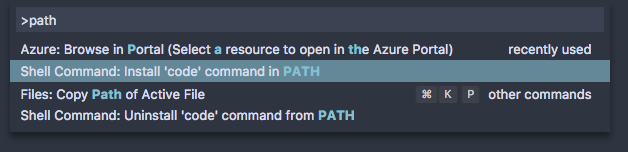
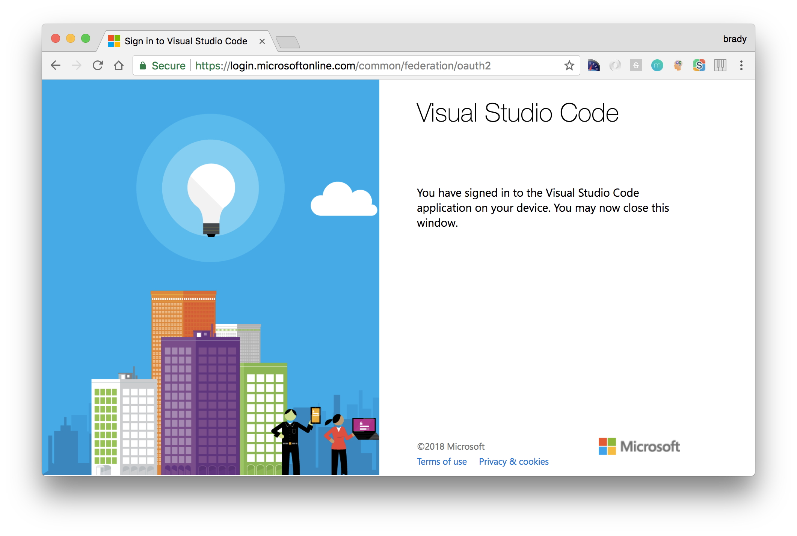
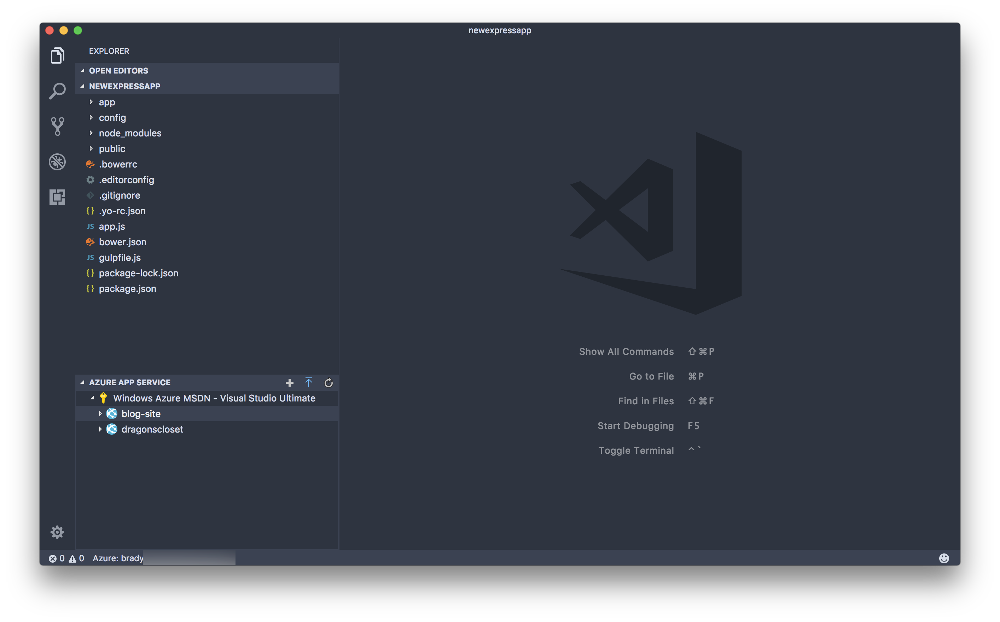
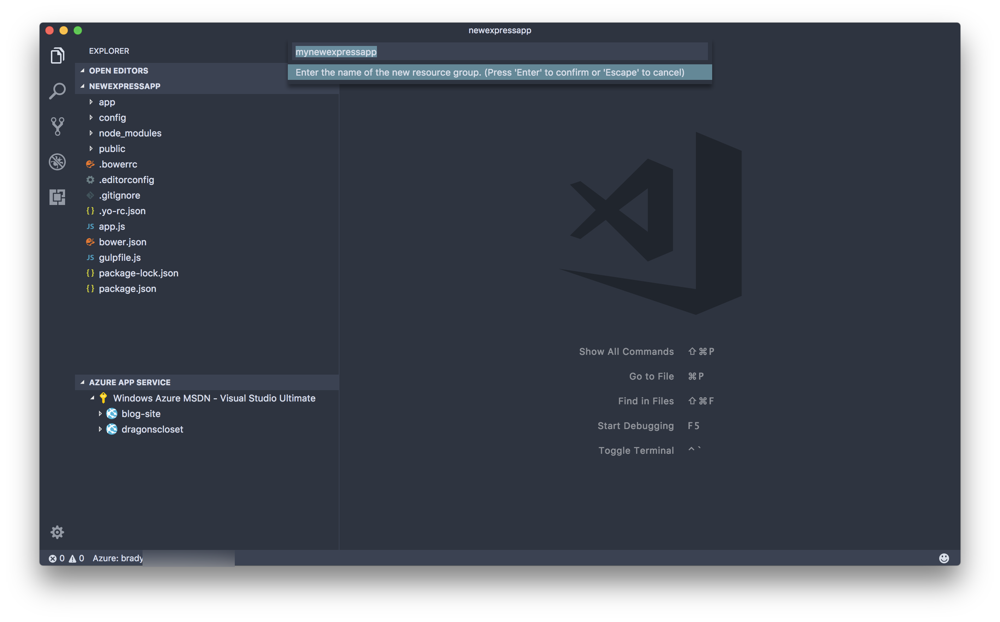
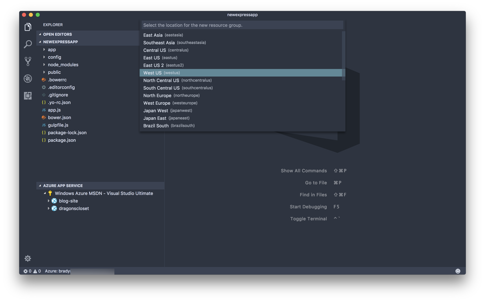
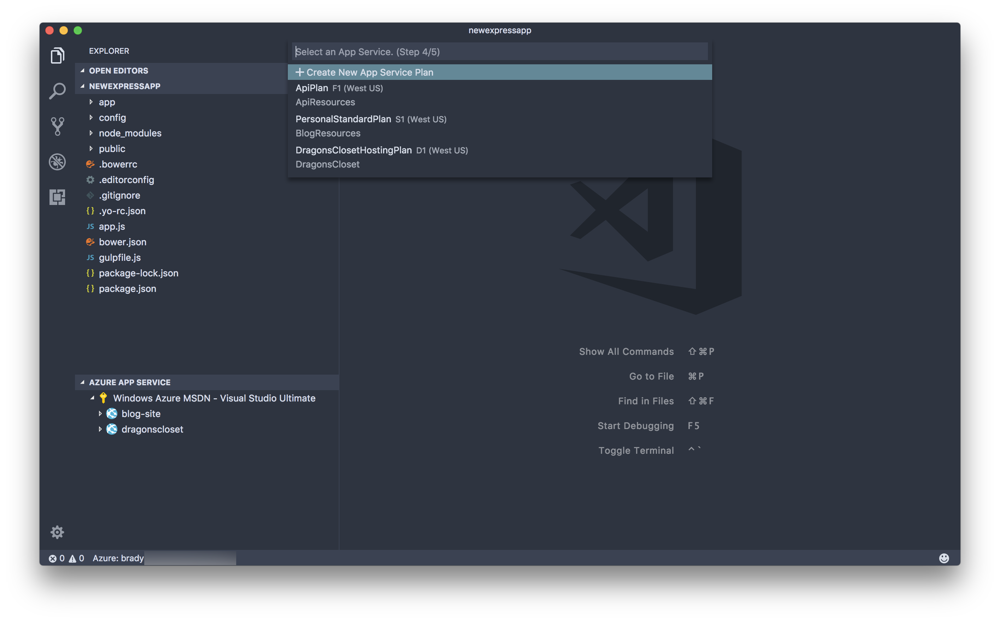
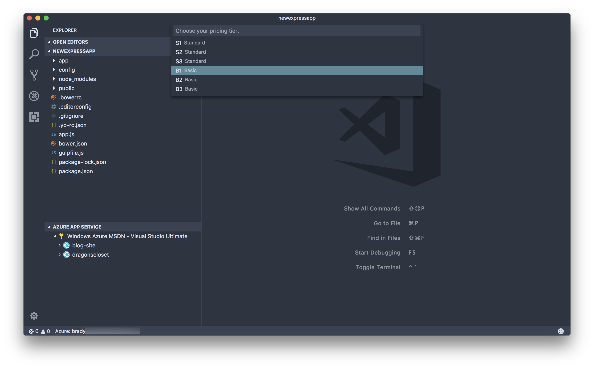
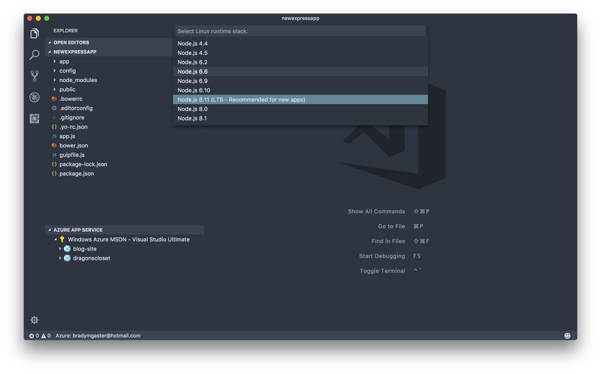
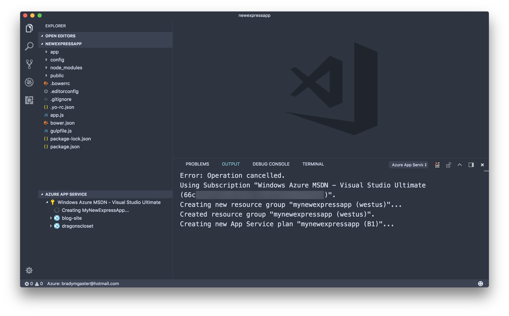
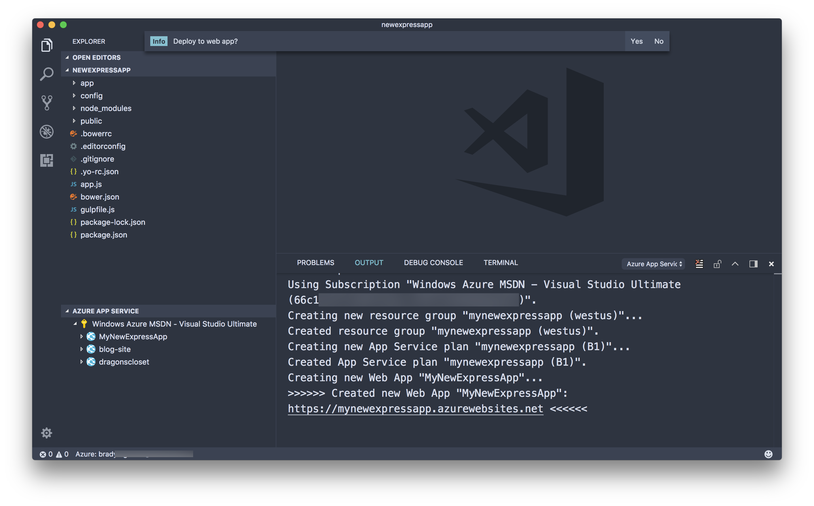

# Node.js and Express continuous deployment with Visual Studio Team Services and Azure App Service

# DevOps with Node.js, Team Services, and Azure App Service

In this lab, we will present a scenario where Visual Studio Team Services (VSTS) can enable Node.js developers with continuous integration and deployment features. The scenario demonstrates how a Node.js developer using [Visual Studio Code](http://code.visualstudio.com) and various Azure-related VS Code extensions to create a new Azure App Service and use Git-based deployment. You'll learn how a Node.js developer can use VSTS to ensure that their code is deployed automatically to an Azure App Service when code is committed to a VSTS Git repository. 

--- 

## Contents:
- [Demo Setup](#demo-setup)
- [Scaffolding a new Express app using Yeoman](#scaffolding-a-new-express-app-using-yeoman)
    - [Install Yeoman and the Express generator](#install-yeoman-and-the-express-generator)
    - [Generate a skeleton Express app](#generate-a-skeleton-express-app)
- [Create an Azure App Service using VS code](#create-an-azure-app-service-using-vs-code)
    - [Login to your Azure subscription](#login-to-your-azure-subscription)
    - [Create the App Service Web App](#create-the-app-service-web-app)
    - [Viewing the App Service in the Azure portal](#viewing-the-new-app-service-in-the-azure-portal)
- [Use Team Services to enable continuous deployment](#use-team-services-to-enable-continuous-deployment)
    - [Create the new Team Services project](#create-the-new-team-services-project)
    - [Create the build definition](#create-the-build-definition)
    - [Run the build](#run-the-build)
    - [Enabling triggered builds](#enabling-triggered-builds)

--- 

## Demo Setup

1. If you don't already have a Visual Studio Dev Essentials and Visual Studio Team Services account, create one at [my.visualstudio.com](http://my.visualstudio.com). 
1. If you don't already have an Azure subscription, create one [here](https://azure.microsoft.com/en-us/free/). 
1. Install Git if you don't already have it installed. 
1. Install Node.js either by using the downloadable installers from [Node.js](https://nodejs.org) or using various command-line tools. Mac users can install Node.js using [Homebrew](https://brew.sh/) using the command `brew install node`.
1. Install [Visual Studio Code](http://code.visualstudio.com).
1. Install the [Azure App Service Tools](https://marketplace.visualstudio.com/items?itemName=ms-azuretools.vscode-azureappservice) using the VS Code Extensions Palette (search for *azure*).
1. Once you have installed Visual Studio Code and the App Service Tools extension, open Visual Studio Code. In Code, use `Ctrl-Shift-P` (or `Cmd-Shift-P` on a Mac) to open up the command palette. Type the word `path` to filter the command menu, and then select the command **Install 'code' command in PATH** to make it easy to open Visual Studio Code from your command line. 

    

---

## Demo Steps

[Express](https://expressjs.com/) is a minimal, flexible web application framework for Node.js developers that provides a robust set of features for both web and mobile web developers. The [Express package](https://www.npmjs.com/package/express) is available via [NPM](https://www.npmjs.com/), easily installable into any Node.js application using the command `npm install express`. In most cases Express needn't be installed as a global package using the `-g` NPM switch, as the convention is that Express is installed independently into each Node.js app during development. 

This demo will walk you through the process of creating a new Node.js web app that uses Express. Then you'll create a new Visual Studio Team Services project to use for storing the code and continuously deploying the app to Azure App Service. 

## Scaffolding a new Express app using Yeoman

To ease the process of bootstrapping a Node.js Express application, developers can use the [Yeoman](http://yeoman.io) template engine. Yeoman - known as **yo** from it's NPM CLI command name - has hundreds of scaffolders for all sorts of projects. Luckilly, Yeoman is easilly installable as an NPM package just like Express and many other Node.js components. 

### Install Yeoman and the Express generator

1. Run the command `npm install -g yo`. 

2. Type `yo` at the command prompt. 

    

3. Type `express` at the prompt and hit enter to search the Yeoman template database for Express-related scaffolders. 

    

4. Scroll through the list of results until you see the generator named, simply, **express**, and then hit enter. 

    

### Generate a skeleton Express app

1. In the command prompt, enter the command `yo express` to create a new Express application. 

    

2. Enter the command `code .` to start Visual Studio Code with the new Express app's folder open. 

    

3. Edit `gulpfile.js` to turn off local hosting during the Gulp build. The code for the `default` task should be commented out: 

    ```javascript
    gulp.task('default', [
        //'develop'
    ]);
    ```

## Create an Azure App Service using VS Code

There are a number of various extensions for VS Code that provide Azure functionality. Extensions like the [Azure CLI Tools](https://marketplace.visualstudio.com/items?itemName=ms-vscode.azurecli) make it easy to write scripts that make use of the [Azure CLI](http://docs.microsoft.com/cli/azure) to perform administrative tasks in your Azure nn. 

The [Azure App Service Tools for VS Code](https://marketplace.visualstudio.com/items?itemName=ms-azuretools.vscode-azureappservice) provide a series of convenient features for creating new Azure App Services. 

### Login to your Azure subscription

1. Expand the Azure App Service Tools pane. Click the `Sign in to Azure` gesture in the explorer pane. 
    
    

3. Click `Copy and Open` to open the browser and log in to your Azure subscription.

    

4. Hit `Ctrl-V` or `Cmd-V` on Mac, or use the context menu to paste the login code into the textbox. 

    

5. Click the **Continue** button to perform the login routine. 

    

    Once you click Continue, you'll be able to select which of the organizational or Microsoft accounts you want to use to login to your Azure subscription. 

    

6. Once the login page loads, flip back to VS Code. You should see all of your Azure subscriptions in the App Service pane. When you expand the pane, all of your App Services are visible. 

    

### Create the App Service Web App

To setup continuous deployment to an Azure App Service, an Azure App Service resource must be created into which code can be deployed. Luckilly, Visual Studio, Visual Studio for Mac, and Visual Studio Code all make this a rather easy task directly within the various IDEs. 

1. In VS Code, right-click the subscription you want to use and select the `Create New Web App` menu option.

    

2. Type in a name for the App Service. Note, if an existing App Service with this name exists you'll be informed with an error message. 

    

3. Create a new resource group for the App Service. 

    

4. Give the new resource group a name.

    

5. Select the geographic region from the menu. 

    

6. Select the option for creating a new App Service Plan. 

    

7. Give the new App Service Plan a name.  

    

8. Select the tier of service. 

    

9. Select the Node.js version your app will need. VS Code will try to determine this for you but you have the option to choose your version.  

    

10. Visual Studio Code will provide a stream of information as the resources are being created in your subscription.  

    

11. Once the App Service is created, it will appear in the App Service Explorer pane.  

    

### Viewing the new App Service in the Azure Portal

1. In VS Code, right-click on the App Service to open the context menu. Select the `Open in Portal` option to open the new App Service in the Azure Portal.

    

2. Once you select an App Service to view within VS Code it'll open directly in the Azure portal in your default browser. Click the link in the portal's overview section to open the new App Service in a separate tab. 

    

4. The App Service should open in your browser, displaying the default App Service start page. 

    

## Use Team Services to Enable Continuous Deployment

Now that the app is ready to be deployed we'll set up a new Team Services project and set it up with Git so the code can be easily committed and continuously deployed. 

### Create the new Team Services Project 

1. Browse to your Team Services account at [https://{youraccount}.visualstudio.com](https://{youraccount}.visualstudio.com). Give the project a name and click **Create**. 

    

2. If you haven't already created Git credentials click the **Generate Git credentials** button, then provide a username and password to be used when interacting with this project. Then, click the **Copy clone url to clipboard** button as shown below. 

    

3. At a command prompt in your project's folder, type the command `git init` to initialize a new repository locally. Then, type `git remote add origin {copied URL}` to add the remote to your local repository. Then, `add` and `commit` the files to the repository. Finally, use `git push origin master` to push the Express app code up to the VSTS project's Git repository. 

    

4. Click on the **Code** tab in your Team Services browser.

    

### Create the Build Definition

1. Click the **Set up build** button in the **Files** page in the browser. 

    

2. Find the build template named **NodeJS with Gulp** and click the **Apply** button. 

    

3. Give the build definition the name `DevDeploy` and select **Hosted** from the **Default agent queue** menu. 

    

4. Click the **Copy Publish Artifact: drop** build task to see the details of this task. 

    

5. Click the **Add Task** button under the list of build tasks. Select the **Azure App Service Deploy** task and click the **Add** button next to it. 

    

6. Note that the **Azure subscription** and **App Service name** menus are both required.

    

7. Select the Azure subscription in which your destination App Service is housed. 

    

8. Select the App Service you created earlier within VS Code to use as the deployment target for your Node.js source code. 

    

9. Click the previous build task (the "Copy Publish Artifact: drop" task) and take note of the **Copy root** and **Contents** text boxes. 

    

10. Once you've copied these two value and pasted them both into the Deploy build task, the value of the task's **Package or folder** textbox should represent the full path the ZIP file being built by your VSTS build. 

    

11. Check the checkbox labelled **Generate Web.config** to enable that section of the task window. Then click the ellipse button next to the text box to open up the **Web.config parameters** dialog. 

    

12. Select **node** from the Web.config parameters screen's **Application framework** menu. Then, change the **NodeStartFile** value to be `app.js` since the Express app's default filename is `app.js`.

    

### Run the Build

Now the build definition is complete running it will result in the code being deployed to the Azure App Service. 

1. To kick off the manual build, click the **Save and Queue** spin button in the build definition page. Then, select the **Save and queue** option to save the definition and trigger the build. 

    

2. Click the **Queue** button on the **Queue build for deploy** dialog. 

    

3. Click the queued build link to drill into the running build. 

    

4. The build log is visible in the browser. 

    

5. Wait until the build has completed. 

    

6. Open up a browser (or refresh the already-open browser tab) on the App Service URL. 

    

### Enabling triggered builds

1. Click the **Triggers** tab in Team Services. 

    

2. Edit the code in `controllers/home.js` so that the `articles` variable in the `get` method is instantiated using the code below. 

    ```javascript
    var articles = [
        new Article({
        'title': 'First Article',
        'text' : 'This is the text of the first article'
        }),
        new Article({
        'title': 'Second Article',
        'text' : 'This is the text of the second article'
        })
    ];
    ```

    

3. Edit the code in `view\index.handlebars` to add a `dl` list containing a presentation of the articles in the view model. 

    ```handlebars
    <dl>
        {{#each articles}}
        <dt>{{title}}</dt>
        <dd>{{text}}</dd>
        {{/each}}
    </dl>
    ````

    

4. Commit the code to the repository. 

    

5. Go back to the build definition in Team Services and take note that a new build has been queued. 

    

6. Refresh the site in the browser. 

    