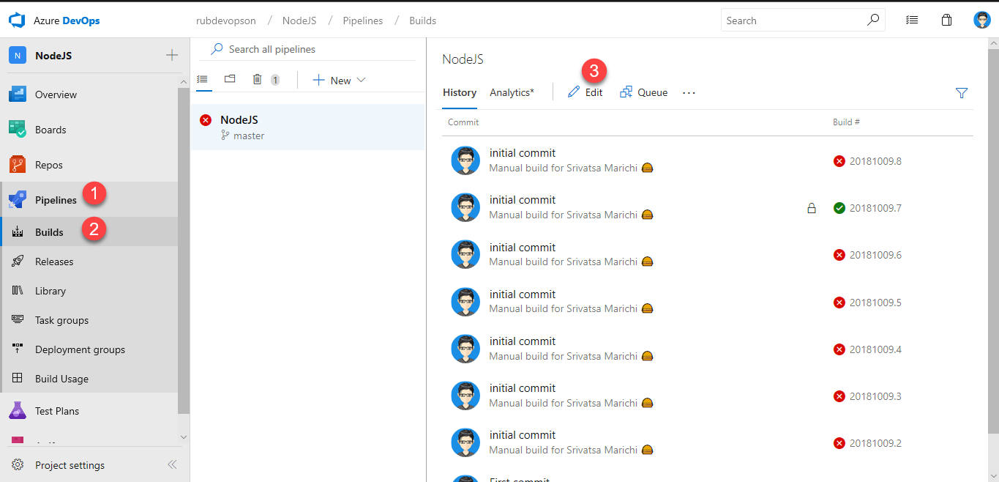
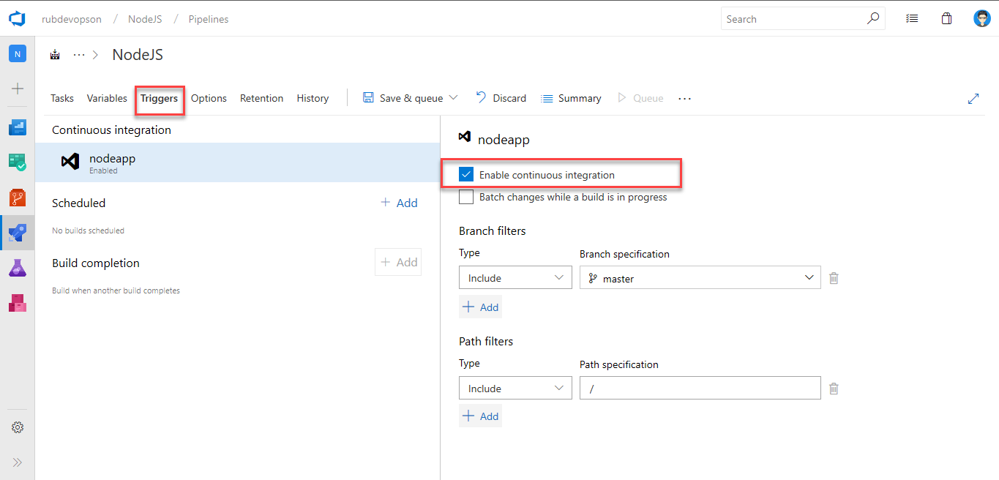
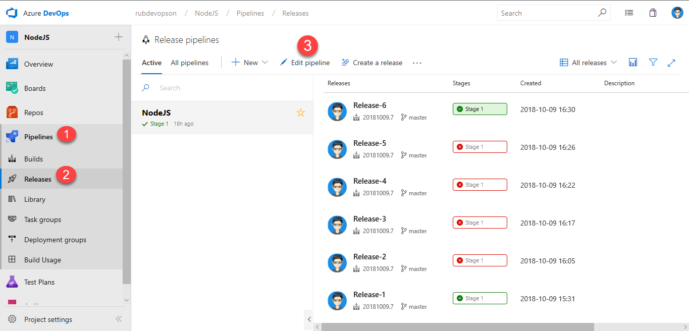
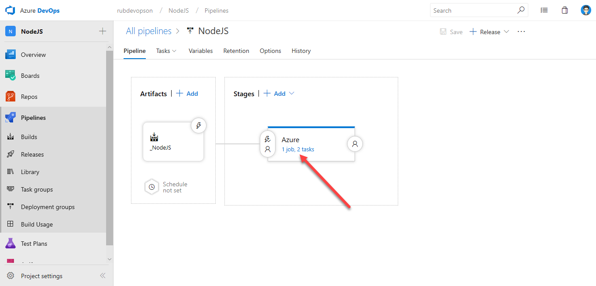
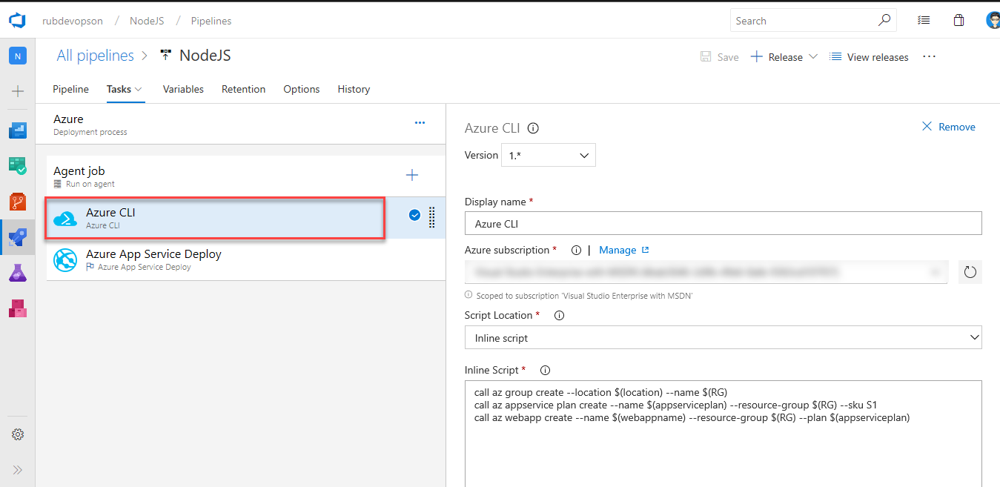
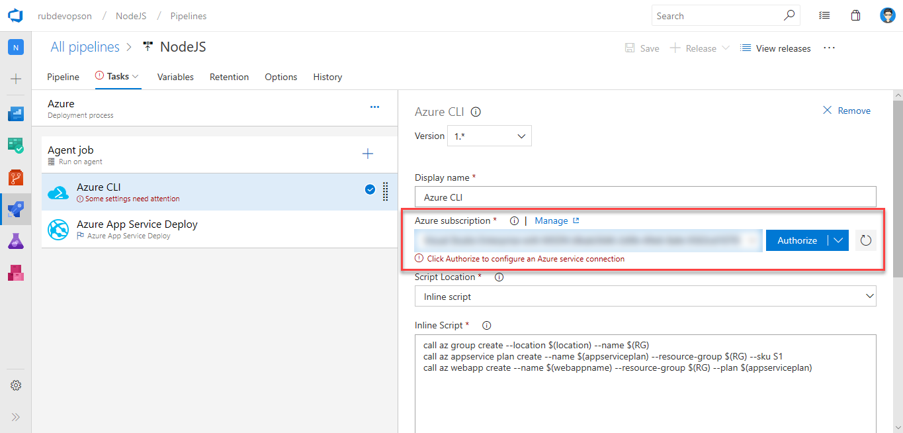
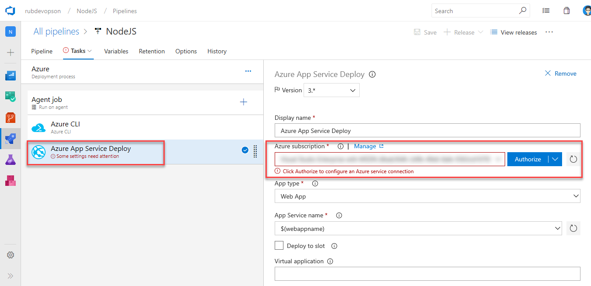

## Overview

This lab shows you how to deploy Node application to Azure App Service using Azure DevOps.

## Prerequisites for the lab

1. Refer the [Getting Started](../Setup/) page to know the prerequisites for this lab.

1. Click the [Azure DevOps Demo Generator](http://azuredevopsdemogenerator.azurewebsites.net/?TemplateId=77376&Name=AzureFunctions_BuildWorkshop) link and follow the instructions in [Getting Started](../Setup/) page to provision the project to your **Azure DevOps**.

## Exercise 1: Configure Build

Since the Azure DevOps demo generator would have created the pipeline, we will now explore the tasks used to create the build pipeline and set the build trigger to Continuous Integration (CI).

1. From the pipelines, select **Build**. Click on the **edit**.

   

1. The build pipeline uses Hosted VS 2017 agent to cater the build. It uses 4 tasks. Below are the details for each of these tasks:- 

    * **Use Node version**: Finds/downloads the specific version of Node and adds it to the path

    * **npm install**: Installs the npm packages to the project directory. In this lab, the npm install is set to the applications folder, where the packages will be installed and used

    * **Archive Files**: Is used to archive files from the source folder

    * **Publish Artifacts**: This task is used to publish the build artifacts to Azure DevOps which later will be consumed in the release pipeline for the deployment

1. Click on **Triggers** and enable CI.

   

1. Once the CI is enabled, save the build pipeline.

## Exercise 2: Configure Release

In this exercise, we will configure an Azure service connection in the release pipeline.

1. From the pipelines, select **Releases**. Click on the **edit pipeline**.

   

1. In the environment, click to view the stage tasks and select the **Azure CLI** task.

   

   

1. In the Azure subscription field, select the required subscription from the dropdown and click on **Authorize** to    configure an Azure service connection.

   

1. Select the **Azure App Service Deploy** task. In the Azure subscription field, select the required subscription from the dropdown and click on **Authorize** to    configure an Azure service connection.

   

