Last updated : {{ "now" | date: "%b %d, %Y" }}.

## Overview

[Package Management](https://www.visualstudio.com/en-us/docs/package/overview/){:target="_blank"} is an extension that makes it easy to discover, install, and publish packages.

It's deeply integrated with other Team Services hubs like Build so that package management can become a seamless part of your existing workflows.

Your product is successful, your organization is growing, and it’s time to scale up your codebase to match. As you scale out past 2-3 teams working in a single codebase on a single product, you may find yourself asking questions like:

- How do my teams effectively share reusable components?
- How do I enable my feature teams to iterate rapidly without stepping on other teams’ work?
- How do I give my teams autonomy to iterate at the pace that’s right for them?

These questions aren’t just applicable to newly growing teams. If you’re an established team with a legacy code base, you may be asking these same questions as you’re being asked to deliver more value, ever faster. Regardless of your situation, componentization can help you build a code base that scales to the size of your team and the speed of today’s development.

In this module, we'll explore how binary composition through package management can help you manage and share your external dependencies, your OSS, and your isolated shared components.

## Prerequisites

In order to complete this lab you will need-

- Visual Studio 2017 virtual machine provided by Microsoft. Click the button below to launch the virtual machine.

  <a href="" class="launch-hol" role="button" target="_blank"><span class="lab-details">Launch the virtual machine</span></a>

- **Visual Studio Team Services account**. If you don't have one, you can create from [here](https://www.visualstudio.com/team-services){:target="_blank"}

- You can use the **[VSTS Demo Data Generator](http://azuredevopsdemogenerator.azurewebsites.net){:target="_blank"}** to provision a project with pre-defined data on to your Visual Studio Team Services account. Please use the ***My Health Clinic*** template to follow the hands-on-labs.

- If you are not using the VSTS Demo Data Generator, you can clone the code from here

## Task 1: Installing Package Manager Extension

1. To start using Package Management from Visual Studio Team Services we must first install the Package Management extension from the Visual Studio Market place, you can find the extension [here](https://marketplace.visualstudio.com/items?itemName=ms.fee)

    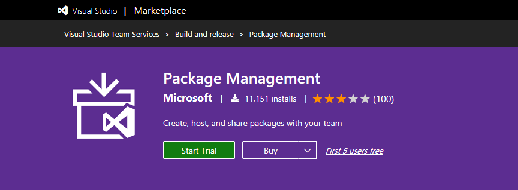

1. Click **Start Trial** to install the extension and select your VSTS account to install and click **confirm**.

    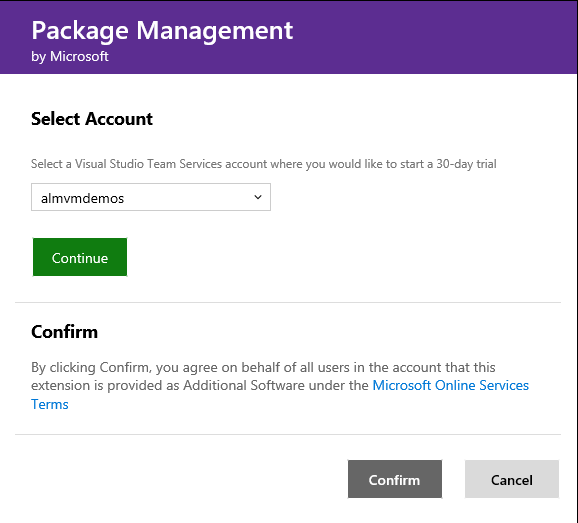

    > This has installed the extension on your account.
    > Package feeds are our own NuGet package feeds we can use for our own dependencies, or even share dependencies with other teams. **Nuget.org** is a public feed where we can publish packages for other developers.

1. After installation click on **Proceed to the account**. You can now see the  **Package** menu option inside the Team Projects under the **Build & Release** section.

    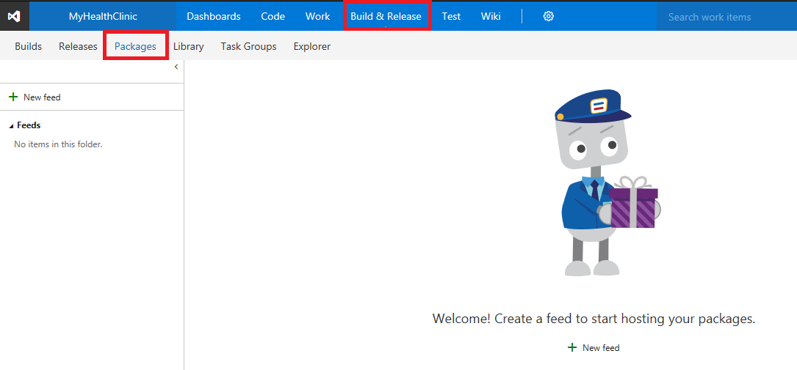

## Task 2: Creating feed

1. Sign in to your Visual Studio Team Services account.

1. From your account overview page, select your team project. You can also search as well.

   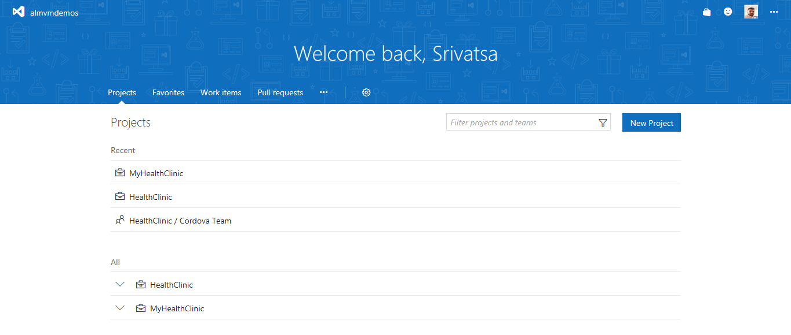

1. Now you should see a new menu option **Package** under the **Build & Release** tab. Click on it.

   

1. Click on **+ New feed** to create. Give a name and click **create**.

   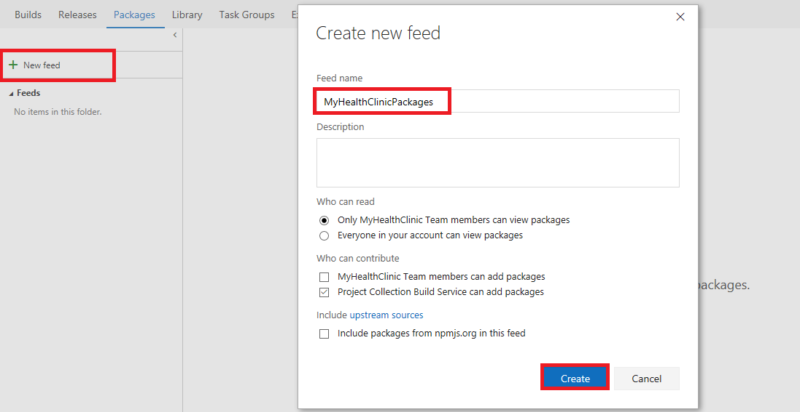

1. Click on **Connect to feed**. Take a note of the **Package source URL**.

   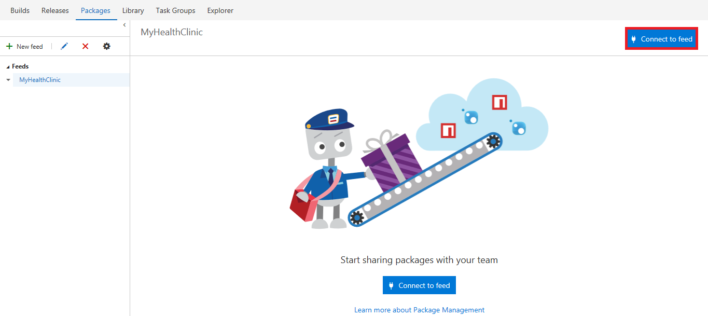

   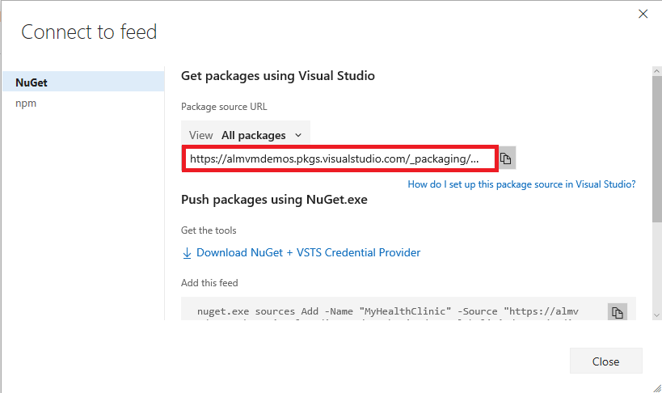

   > We need the Url for the feed so we would be able to connect our developers to the feed as well as configure projects to use it during automated builds.

## Task 3: Publishing packages

We will start from a previously created and configured package. The first step when creating a package, which in this case is just a simple class library with some custom helpers, defining its **nuspec** file.

This file defines the properties on how the package will appear in the listings.

In the **07\_Demos\_PackageManagement** solution we created a class library with a **nuspec** file definition. Instructions on how to create and use the file can be found in NuGet.org documentation [here](https://docs.nuget.org/ndocs/create-packages/creating-a-package){:target="_blank"}

It is also important to take care of package versioning, so developers know which version of the package is the latest, previous versions, and the one they are using as well as the differences between them.

We will publish packages to the feed with an automated build. So we will start creating a new Build definition (check Continuous integration lab for more details).

1. We will start from the Visual Studio build template. Select the template **Visual Studio build** by creating a new build definition.

   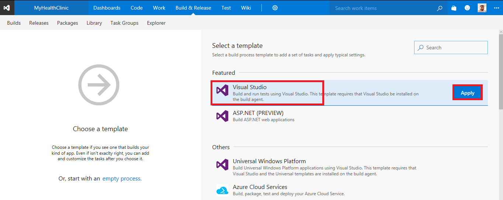

1. Remove the **Publish symbols**, **Copy files** and **Publish Artifact** tasks. And configure the **Nuget Restore** and **Build** steps to build our NuGet Package solution.

   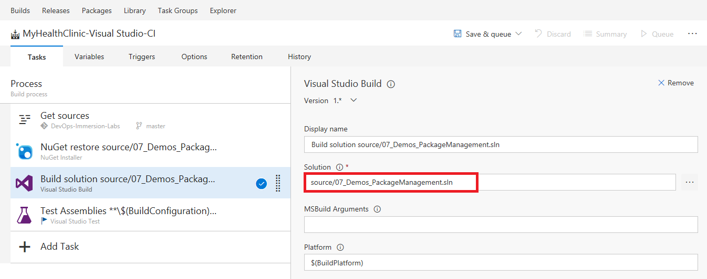

1. Add the **NuGet Packager** task from the **Package** section.

   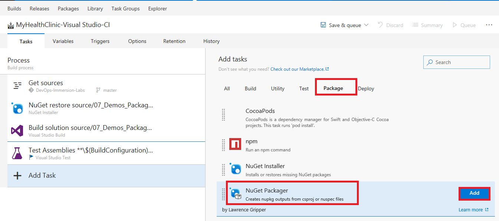

1. Add the **Nuget Publisher** task from the **Package** section.

   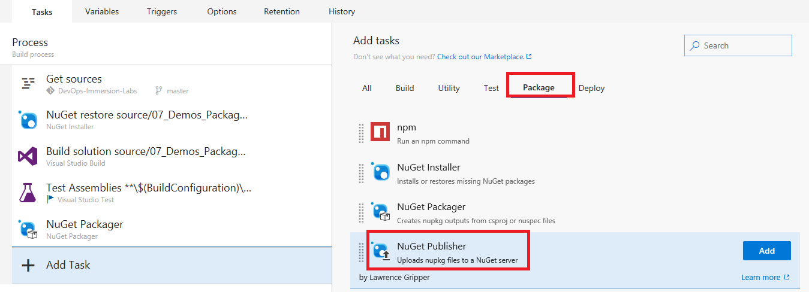

1. Let's configure the **Nuget Packager** task. For this, we will select the **csproj** file of the project containing the NuGet Package. This must be the same name as the **nuspec** file, but with the **csproj** extension.

   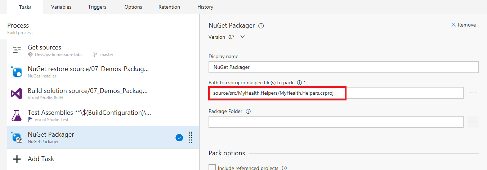

   >It is very important to point at this time to the *csproj* file, and the *nuspec* file convention of having the same name as the *csproj* file, so the package is correctly generated.

1. In the **Nuget publisher** task, we will need to point the feed we want to publish the target. Select **Feed type** internal and introduce the URL for our internal feed (the URL you noted earlier). Once finished **Save** and **Queue** this build definition.

   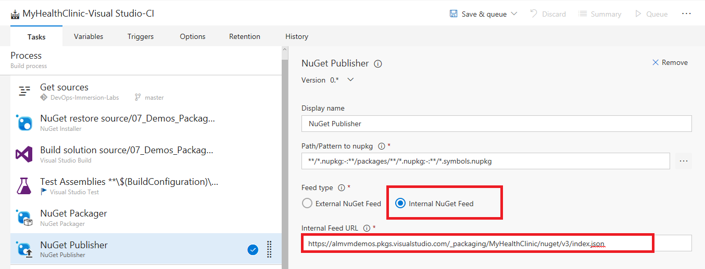

   > Look also at the **Path/Pattern to nupkg** the default filter will only include the package we just built, it will exclude other packages which are references to this one with the *-:\*\*/packages/\*\*/\*.nupkg* filter and also exclude the symbols package with this filter  _-:\*\*/\*.symbols.nupkg_ which are currently not supported.

1. Once the build completes, you should see the package is already published to the feed and ready to be used. Go to **Packages** and check.

   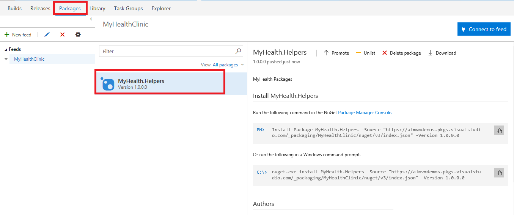

## Task 4: Configure Visual Studio

1. Open Visual Studio, and goto **Tools** \| **NuGet Package Manager** \| **Package Manager Settings**.

   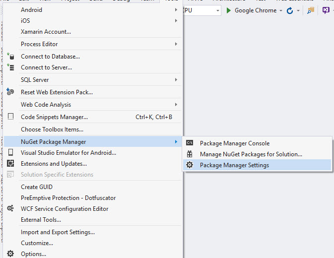

   >We need to configure Visual Studio to have this package manager available for developers.

1. Open **Package Sources**.

   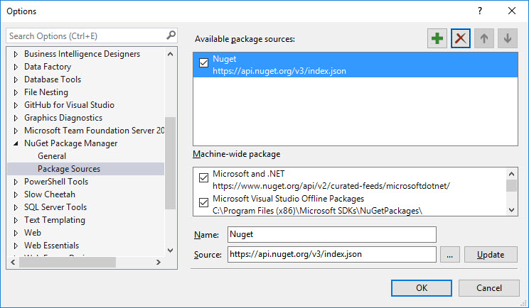

   > In this screen we will manage our own package feeds so they are available when adding NuGet packages to a project.

1. Click **+** icon. A new Package source line has been added with default values. Change the **Name** to the desired name (i.e. "HealthClinic Feed") and in the **URL** paste the value of the URL for the feed we noted before. Click **Ok**.

   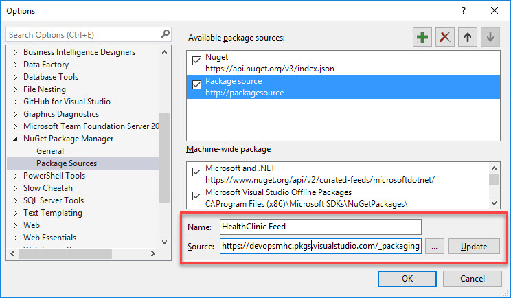

   > We just added to our Visual Studio the new feed. All members of the team must do the same in their own Visual Studio in order to get the packages.

1. Create an empty project, or open an existing project, right click on it, select **Manage Nuget Packages**, go to **Browse** and in the **package source** selector, select the recently added feed. You should see the recently added package.

   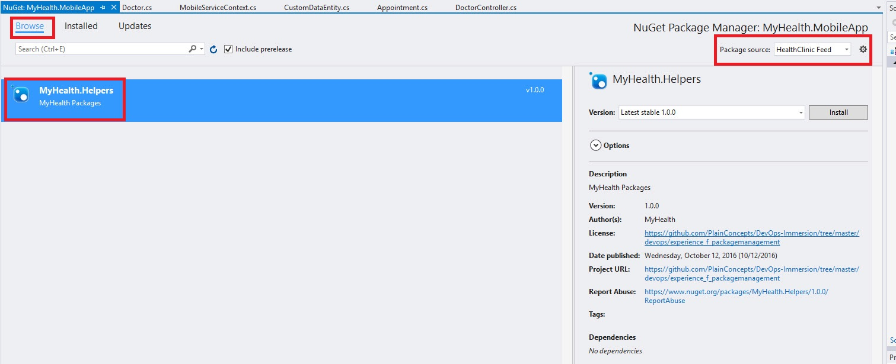

   > All the team members, with the feed configured in Visual Studio, will be able to access this feed and install the package into their projects, so we can better reuse the code of our common libraries across the projects.

## Task 5: Consuming Packages From Build

When we create builds, the first step is the **Nuget package restore** step, but by default, it will only look for packages in **nuget.org** feed. So we need to give instructions to **Team Build** it is done via **nuget.config** files.

1. Create an empty file named **nuget.config** at the same level as the solution file you will be building with **Team Build** and paste this code:

   ```xml
   <?xml version="1.0" encoding="utf-8"?>
   <configuration>
   <packageSources>
    <add key="NuGet" value="https://api.nuget.org/v3/index.json" />
    <add key="HealthClinic Repo" value="YOUR_PACKAGE_URL" />
   </packageSources>
   </configuration>

   ```

   > The first package source is needed to indicate the original Nuget feed for the Nuget public Nuget packages. The second one is the url for our custom feed.

1. Commit the file to the repository.

1. Now, in the Team Build you are using for building the project which uses the internal Nuget package, on the package restore step, point to the **nuget.config** file we just added to the repository.

   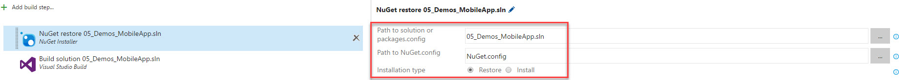

1. During the build you can see the console output while building the project which references the internal Nuget feed.

   ```xml
   Feeds used:
   C:\Users\buildguest\AppData\Local\NuGet\Cache
   https://api.nuget.org/v3/index.json
   YOUR_PACKAGE_URL

   ```