Lab version:15.7.3

Last updated:6/17/2017

## Overview ##

In this lab, you will learn how to use the Team Foundation Build in order to build, test, and deploy your applications. This scriptable build system is both web-based and cross-platform, while also providing a modern interface for visualizing sophisticated workflows. Although we won't demonstrate all of the cross-platform possibilities in this lab, it is important to point out that you can also build for iOS, Android, Java (using Ant, Maven, or Gradle), and Linux.

### Prerequisites ###

- This lab requires you to complete task 1 from the prerequisite instructions

## Exercise 1: Introduction to Visual Studio Team Services Build ##

### Task 1: Creating a basic build definition from a template ###

1. Navigate to your team project on VSTS.

1. Navigate to **Build and Release | Builds**.

    

1. Click **New** to create a new build definition.

    

1. The first thing you'll need to do is to configure the source repository. Every major platform is available, but the default options are all we need here. This build will use the **master** branch of the **PartsUnlimited** repo. Click **Continue**.

    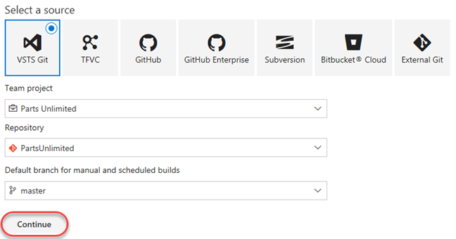

1. Locate the **ASP.NET** template and click **Apply** to apply this template to the build definition. Note that there are many options that should cover all of our mainstream scenarios. For our purposes here, we'll just build the project using the baseline ASP.NET template.

    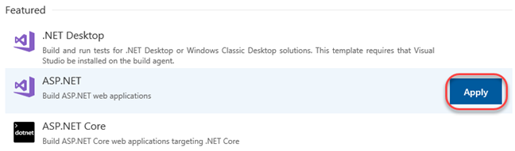

1. The process for this build template is easy to follow. After getting the source, VSTS will use NuGet to restore any dependent packages. Then, the project will be built and tested. The results will then be published to the configured target.

    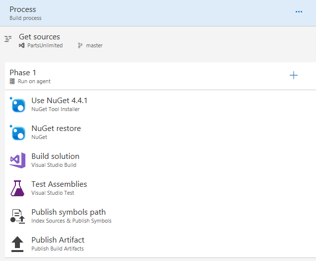

1. Select the **Variables** tab. Here you can configure special parameters to be used during the build, such as the configuration or platform.

    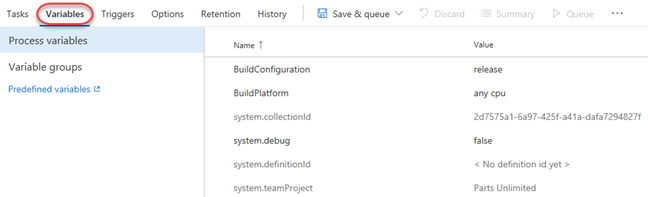

1. Select the **Triggers** tab. These triggers enable you to automatically invoke builds on a schedule, when another build completes, or when changes are made to the source. Check **Enable continuous integration** so that this build will get invoked whenever source changes are committed.

    

1. Select the **Options** tab. This section includes a wide variety of options related to the build workflow. Note that you'll generally configure options for specific build tasks on the configuration views of the tasks themselves.

    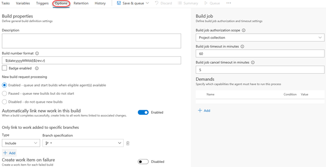

1. Select the **Retention** tab. This is where you configure which builds are retained and for how long.

    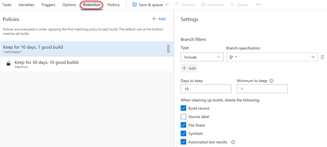

1. Select the **History** tab. There's nothing here yet, but it will fill up once you start completing builds.

    

1. Select **Save & Queue | Save & Queue** to save and queue a new build.

    

1. Accept the default options by clicking **Save & queue**.

    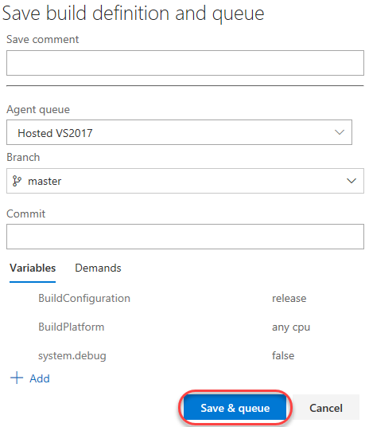

### Task 2: Tracking and reviewing a build ###

1. Click the link to the newly created build.

    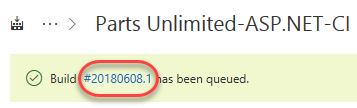

1. Depending on load, the build may need to wait in the queue for a moment.

    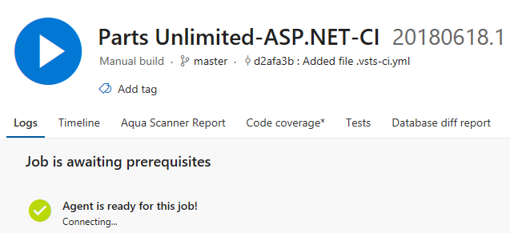

1. Once the build begins, you'll be able to track the console output. If you want to review an earlier task, you can click to review its logs.

    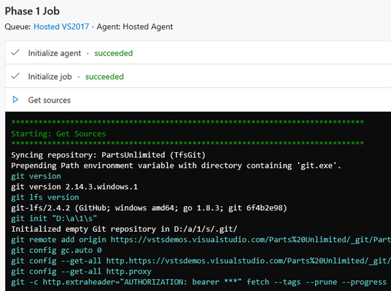

1. The build should eventually succeed, which you can review in the summary.

    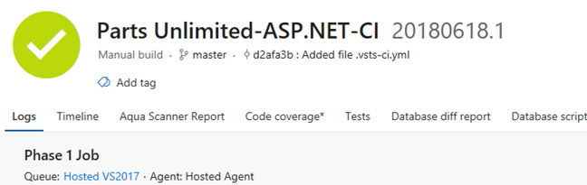

1. Select the **Timeline** tab to see each step, how long it took, and where it occurred.

    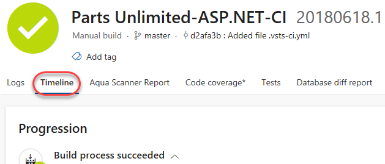

1. Select the **Tests** tab to review test performance for this build.

    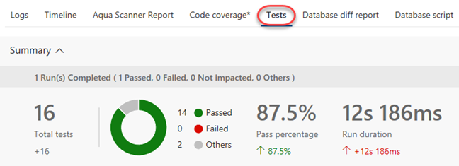

1. You also have easy access to the pipeline editor, the ability to queue a new build, and download the artifacts of this build.

    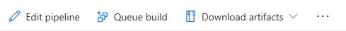

### Task 3: Invoking a continuous integration build ###

1. The build was configured earlier to support continuous integration. Navigate to the code for this project using **Code | Files**.

    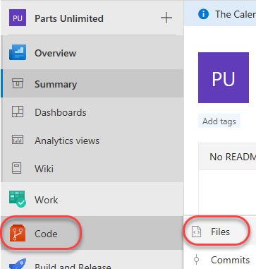

1. Open the file at **PartsUnlimited-aspnet45/src/PartsUnlimitedWebsite/Views/Home/Index.cshtml**.

    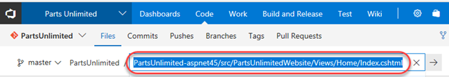

1. Click **Edit**.

    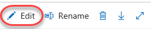

1. Make a minor cosmetic change, such as by tweaking the title of the document. Click **Commt**.

    

1. Accept the default commit details and click **Commit**.

    

1. A build should be underway shortly. Select **Build and Release | Builds** to see if it's in progress.

    

1. You should now see that a new build (note the **.2**) is in progress and that it was triggered by your change. Click the build to track it.

    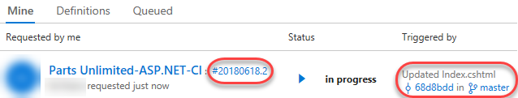

1. This build should run and succeed just like the previous build.

    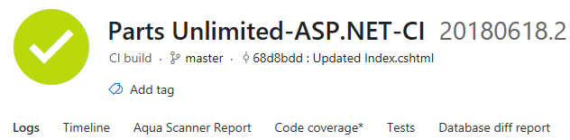

