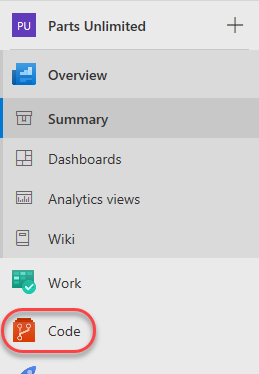
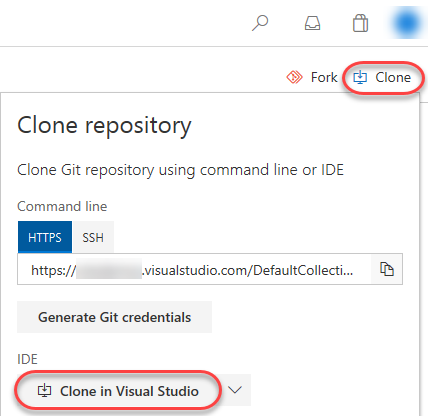
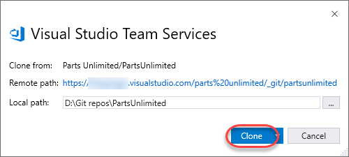

Lab version:15.7.3

Last updated:6/6/2018

## Overview ##

Certain Visual Studio Team Services labs require a preconfigured **Parts Unlimited** team project. This document outlines the required steps to set up the required data.

### Prerequisites ###

- Visual Studio Team Services (VSTS) account ([https://www.visualstudio.com/team-services](https://www.visualstudio.com/team-services))

- Visual Studio 2017 (if specified in lab)

## Exercise 1: Configuring the Parts Unlimited team project ##

### Task 1: Configuring the Parts Unlimited team project ###

1. Navigate to [https://vstsdemogenerator.azurewebsites.net](https://vstsdemogenerator.azurewebsites.net/).

1. Sign in using the Microsoft account associated with your VSTS subscription.

1. **Accept** the permission requests for accessing your subscription.

1. Use the project name **"Parts Unlimited"** and select the **PartsUnlimited** template. Click **Create Project**. Wait for the process to complete.

    

### Task 2: Configuring the Parts Unlimited solution in Visual Studio ###

1. Some labs will require you to open the **Parts Unlimited** solution in **Visual Studio**. If your lab doesn't require this, you can skip this task.

1. Navigate to your VSTS team project for **Parts Unlimited**. It will be something like [https://YOURACCOUNT.visualstudio.com/Parts%20Unlimited](https://youraccount.visualstudio.com/Parts Unlimited).

1. Navigate to the **Code** hub.

    

1. Click **Clone** and select **Clone in Visual Studio**.

    

1. Follow the workflow to clone and configure the project in Visual Studio. Click **Clone** to copy the repo locally.

    

1. From **Solution Explorer**, double-click **PartsUnlimited.sln** to open the solution. You can ignore warnings about unsupported project types.

    

1. Leave Visual Studio open for use in your lab.

