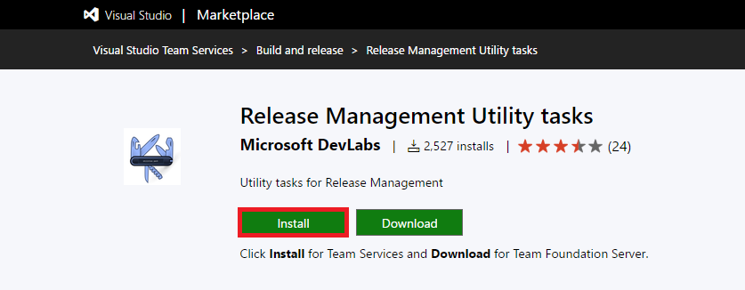
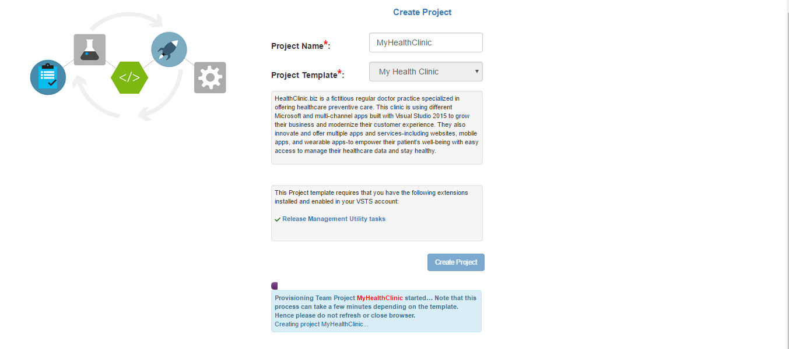
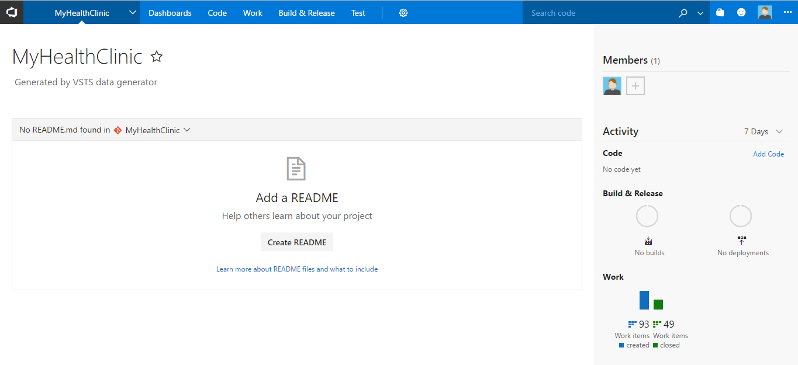

## Overview

We are working on providing hands-on-labs for Visual Studio Team Services. Here are a few labs, for a start. 

In order to complete these labs you will need 

- **Visual Studio Team Services account**: If you don't have one, you can sign up for one, from <a href="https://www.visualstudio.com/">here</a>

- **Microsoft Azure Account**: You will need a valid and active Azure account for the Azure labs. If you do not have one, you can sign up for a [free trial ](https://azure.microsoft.com/en-us/free/)

    - If you are a Visual Studio Active Subscriber, you are entitled for a $50-$150 credit per month. You can refer to this [link](https://azure.microsoft.com/en-us/pricing/member-offers/msdn-benefits-details/) to find out more including how to activate and start using your monthly Azure credit.

    - If you are not a Visual Studio Subscriber, you can sign up for the FREE [Visual Studio Dev Essentials](https://www.visualstudio.com/dev-essentials/) program to create **Azure free account** (includes 1 yr of free services, $200 for 1st month).

- **Visual Studio 2017** or higher version - You will need Visual Studio for some of the labs. You can use your own machine with VS 2017 installed, or download and use the latest [ALM VM](../tfs/),  or spin up a VM pre-installed with Visual Studio on [Azure](https://portal.azure.com). 

- You can use the **[Visual Studio Team Services Demo Data generator](https://vstsdemogenerator.azurewebsites.net)** to provision a project with pre-defined data on to your Visual Studio Team Services account. Please use the ***My Health Clinic*** template to follow the hands-on-labs.

If you are not using the VSTS Demo Data Generator, you can clone the code from this [GitHub repository](https://github.com/Microsoft/myhealthclinic2017)

## Working with VSTS DemoGenerator

### Overview 

Visual Studio Team Services Demo Generator helps you create projects on your Visual Studio Team Services account with preset sample content which includes source code, work items, service endpoints, build and release definitions based on a template you choose.

The purpose of this system is to help follow hands-on-labs, demos and other education material provided by the Microsoft Visual Studio marketing team.

Before you start:

- You will need a Visual Studio Team Services account - if you do not have one, you can 
<a href="http://bit.ly/2dwMwYR">create</a> one now
- You will need a Personal Access Token for the account. An overview of PAT with instructions to create is available <a href="http://bit.ly/2okeOyJ">here</a>

### How to use?

1. Browse to <a href="https://vstsdemogenerator.azurewebsites.net/" target="_blank">VSTS Demo Generator</a>

   

2. Enter your ***VSTS account name*** and ***personal access token*** and then Click on **Verify & Continue** 

   

3. Provide a name for your project and select the template you want to provision from the drop-down list

   

4. Some templates may require additional extensions to be installed to your VSTS account. The system will check if these extensions are already installed. A green tick before the extension means that the extension is already installed. If the extensions needs to be installed, you can select the extension which will take you to the page on Visual Studio Team Services Marketplace, from where you can  install the extension. 

    

5. Click on **Install**  to install the extension to your account.

   

6. After the extension is installed, return back to the VSTS Demo Generator tab and refresh the page.  Select **Create Project**. You will see the status while project is being created.

   

7. Upon successful creation of a project, you will see a link with the URL to the team project you created.

   

8. Select the link to navigate to the project and confirm the project was successfully generated.

   

   >**Note:** You will need to provide your own information such as URLs, user name, password, etc for the endpoints created. You will need to provide them before you attempt to use them, say in build, release definitions, for example.

## Hands-On-Labs     

<table width="100%">
   <thead>
      <tr>
         <th width="75%"><b>Lab Name</b></th>
         <th><b>Last Updated</b></th>
      </tr>
   </thead>
   <tr>
      <td><a href="agile/">Agile Planning and Portfolio Management using Visual Studio Team Services</a></td>
      <td>April 19, 2017</td>
   </tr>
   <tr>
      <td><a href="git/">Version Controlling with Git using Visual Studio Team Services</a></td>
      <td>April 22, 2017</td>
   </tr>
   <tr>
      <td><a href="packagemanagement/">Package Management using Visual Studio Team Services</a></td>
      <td>May 15, 2017</td>
   </tr>
   <tr>
      <td><a href="continuousintegration/">Continuous Integration using Visual Studio Team Services</a></td>
      <td>April 22, 2017</td>
   </tr>
   <tr>
      <td><a href="continuousdeployment/">Continuous Deployment using Visual Studio Team Services</a></td>
      <td>May 10, 2017</td>
   </tr>
      <tr>
      <td><a href="azurecd/">Setting up Continuous Delivery workflow from the Azure Portal</a></td>
      <td>July 19, 2017</td>
   </tr>
   <tr>
      <td><a href="testmanagement/">Test Planning and Management with Visual Studio Team Services</a></td>
      <td>April 25, 2017</td>
   </tr>
   <tr>
      <td><a href="exploratorytesting/">Exploratory Testing and Feedback Management using Visual Studio Team Services</a></td>
      <td>March 6, 2017</td>
   </tr>
   <tr>
      <td><a href="selenium/">UI Automation using Selenium Tests</a></td>
      <td>March 6, 2017</td>
   </tr>
   <tr>
      <td><a href="load/">Load Testing using Visual Studio Team Services</a></td>
      <td>March 6, 2017</td>
   </tr>
   <tr>
      <td><a href="monitor/">Monitoring Applications using Application Insights</a></td>
      <td>March 6, 2017</td>
   </tr>
   <tr>
      <td><a href="appservice/">Deploy an ASP.NET Web App in Azure App Service from Visual Studio</a></td>
      <td>March 8, 2017</td>
   </tr>
   <tr>
      <td><a href="azureresource/">Deploy and Manage Azure Resources from Visual Studio</a></td>
      <td>March 2, 2017</td>
   </tr>
   <tr>
      <td><a href="teams/">Microsoft Teams Integration (Collaborate, Communicate and Celebrate)</a></td>
      <td>June 30, 2017</td>
   </tr>
   <tr>
      <td><a href="powerbi/">Connect to Visual Studio Team Services with Power BI</a></td>
      <td>June 30, 2017</td>
   </tr>
   <tr>
      <td><a href="nodejs/">DevOps for Node.js with Visual Studio Team Services and Azure</a></td>
      <td>September 14, 2017</td>
   </tr>
</table>

