Last updated : {{ "now" | date: "%b %d, %Y" }}.

## Overview

 In this lab, you will learn how to manage your project test lifecycle using the Visual Studio Team Services. This lab will guide you through creating test plans designed efficiently to validate your software milestones. You will also create and execute manual tests that can be consistently reproduced over the course of each release.

## Test Manager Extension

You will need the **Test Manager** extension to get the comprehensive set of testing features in your Visual Studio Team Services account. This extension is included with Visual Studio Enterprise, MSDN Platforms and Test Professional subscriptions. If you do not have any of these subscriptions, then you will need to acquire or request a trial version from the [Visual Studio Marketplace](https://marketplace.visualstudio.com/items?itemName=ms.vss-testmanager-web){:target="_blank"}. Please see the **"Installing the Test Manager Extension"** section below for step-by-step instructions to install the extension.

## Task 1: Creating Test Plan

Visual Studio Team Services (VSTS) allows teams to organize test cases into a hierarchy of test suites inside test plans. Test plans are used to track manual testing for sprints or milestones. That way, you can see when the testing for a specific sprint or milestone is complete. Let's start with creating a new test plan.

1. Go to your Visual Studio Team Services (VSTS) account and project. Select **Test** hub.

1. Click the green + to create a new  **Test Plan**. We will create a test plan for testing our backlog items in Sprint1. Name the test plan and select ***MyHealthClinic\Sprint 1*** for the iteration

   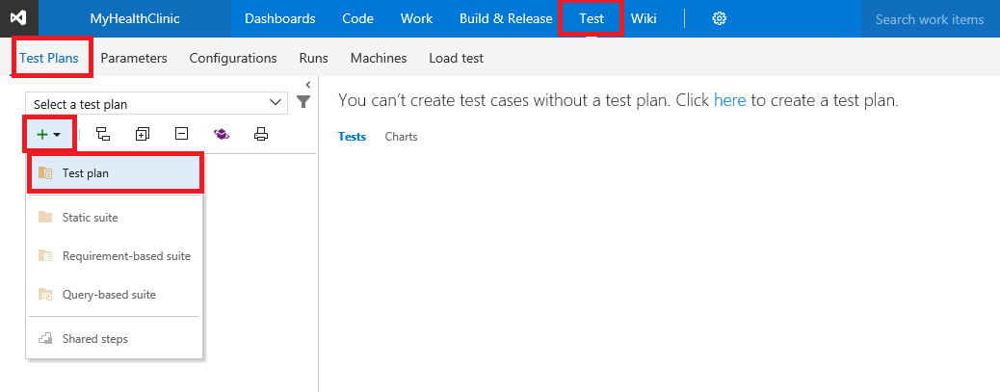

   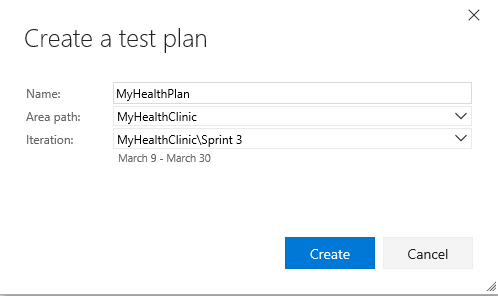

1. Add a **Test Suite** now to group test cases further. You can create three types of test suites:

   * Static test suites are like folders. A static test suite can contain both test cases and other suites.
   * Requirements-based suites are derived from Product Backlog Items, User Stories, or other requirements. The suite contains all the test cases that are linked to its requirement. This type helps you track how well each requirement has been tested.
   * Query-based suites show the results of a query that you define. For example, you could select all the test cases that have Priority = 1.

1. Expand the dropdown next to the newly created suite and select **New requirement-based suite.**

   

1. Add a clause to filter by the iteration path for the sprint and click **Run query**. Select the backlog items that you want to test this sprint and select **Create suites** to add them as requirements to your test plan by creating test suites from them.
   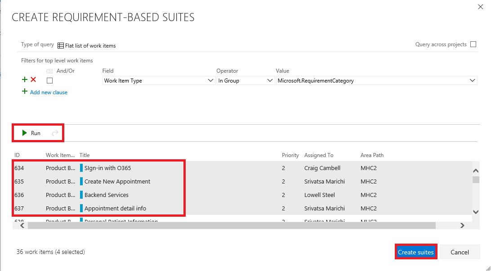

1. Now, you can start adding test cases.  Select the backlog item to which you want to add a test case and select **New Test Case**

   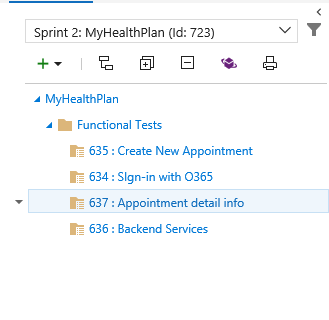

1. Enter a name for the test case and add some test steps. Each step includes an **Action**, which describes the action the tester needs to perform. Optionally, a step can include an **Expected Result**, which describes the expected result of the given action. You can add attachments to a step if you want.

   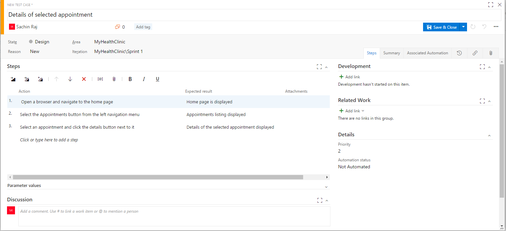

1. Select **Save & Close** to save the test case and return to the previous page

1. While you can create test cases one at a time, it’s sometimes easier to use a grid layout to quickly add many test cases. In the test case panel, select **New \| New test case using grid**.

   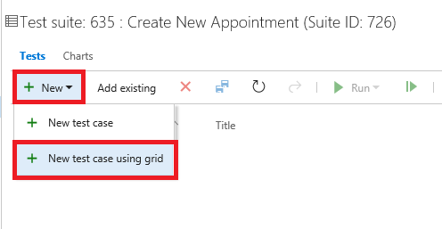

1. Enter a few test cases. Select the **Save All** button when you are done and select the **View: Grid** to toggle back to the list view

    |Title|Step Action| Step Expected Result|
    |-----|-----------|---------------------|
    | Appointments on Dashboard Page |             |        |
    |                                | Navigate to the main page | Home page should be displayed      |
    |                                | Click on **Private area** | Login screen displayed             |
    |                                | Enter Username            |                                    |
    |                                | Enter Password            |                                    |
    |                                | SelectLogin button        | dashboard screen displayed         |
    | Create New Appointment         |                           |                                    |
    |                                | Navigate to the main page | Home page should be displayed      |
    |                                | Click on **Private area** | Login screen displayed             |
    |                                | Enter Username            |                                    |
    |                                | Enter Password            |                                    |
    |                                | Click on Login button     | dashboard screen displayed         |
    |                                | Select Appointments       | Appointments main screen displayed |

    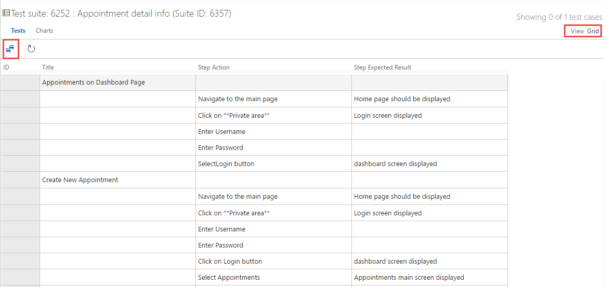

## Task 2: Running Manual Tests

You can run your manual tests and record the test results for each test step using Microsoft Test Runner. You can also capture and attach documents and screen shots to the test and save them together with the test result.

Microsoft Test Runner is available both in web  and as a Windows desktop client. If you are testing a web-based app or just want to capture screen recordings when testing a desktop app, use the web-based Microsoft Test Runner. The Windows client is only recommended when you want to collect more types of data when testing a desktop.

We will use the web-based Test Runner since we are testing a web application.

1. Right-click the test case created earlier and select **Run** to start the test execution.

   

1. You can select  **Run with Options**  to customize each test run. The first option is to select a **Runner**, which will be the browser in this scenario. Next, you have the option to specify what kind of **data to collect**. Finally, you may optionally specify which build is being tested to make it easier to associate the results with the build they were from.

   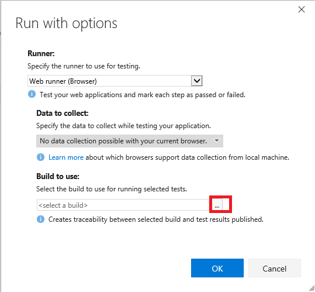

1. If the Test Runner window does not appear, check if the window is blocked by the pop-up blocker. If so, click the Pop-up blocker button, select **Always allow** and then click Done. You can then launch the **Test runner** window successfully.

   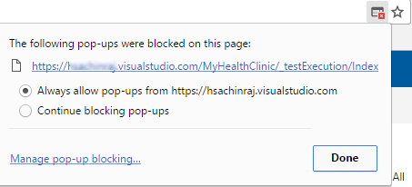

1. You can see the **Test Runner** window now.

   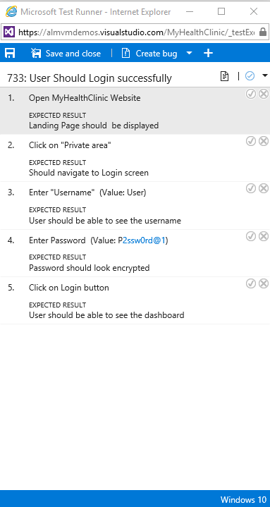

1. As you go about performing the test steps, you can capture the results for every step. If the step results in the expected outcome, you can mark the step as "Passed" by selecting the OK symbol next to the test step. To mark a test step as "Failed", you can select the cancel symbol. You can also right-click the test step to mark the results. You can also add comments and attachments to the test step

   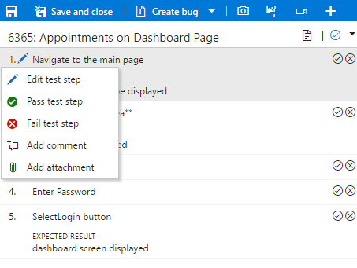

### Capturing rich data

Often when you do manual testing, you want to capture just more than a pass or fail status. Microsoft Test Runner allows you to capture rich information including screen shots, action log and even screen recording.

1. You can use the buttons on the top of the Test Runner window to capture a screen shot or start/stop recording a video.

   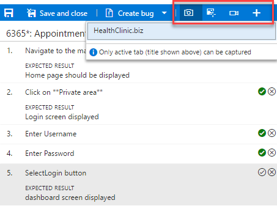

   You will need to select from the dropdown list , an open window from which you want to capture the screenshot.

1. You can also capture your interactions with the app that you are testing, as image action logs. This can be very helpful when you identify a bug and want to record the steps that led to the bug. To start recording your action, select the **Capture user actions...** icon and choose the window that contains the app that you are testing

   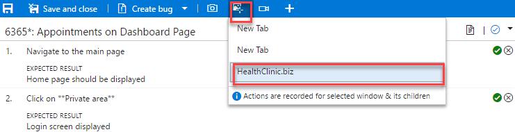

1. Select **Start** to start capturing the actions. The Test Runner will now record all the actions you take on the app's browser tab.

   >If you create a bug while recording your actions, all the data collected up to that point will be included in the bug.

1. Select the **Stop** button to finish capturing your actions. The action log will be added to the test results as an attachment.

   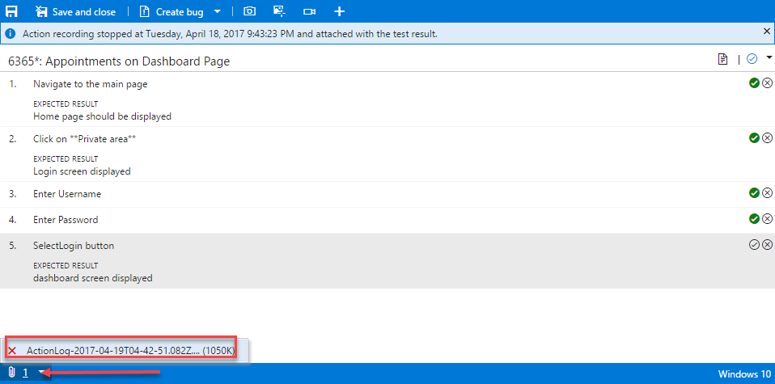

1. To view the data captured, you can click the attachment to open it in a browser

   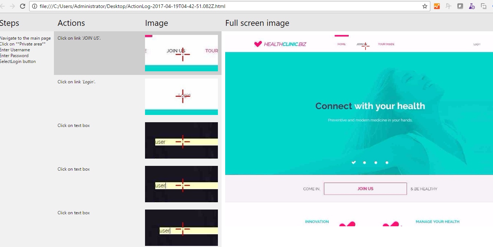

## Task 4: Creating Shared Steps

Shared Steps combines multiple steps that are commonly performed in sequence into a single logical step, which can be shared across tests. If the process defined by the shared steps ever changes in the future, you can update the shared step in one place and it will be reflected in all tests that reference it.

As you may have observed, the login sequence is repeated in the two test cases created above. This is a perfect candidate for shared steps. Let's convert it to shared steps.

1. Open the "Create New Appointment" test case that you created above

   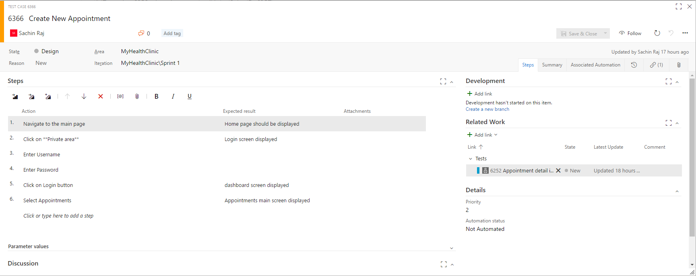

1. Select steps 1-5 (use **Shift+Click**) and right-click and select **Create shared steps**

   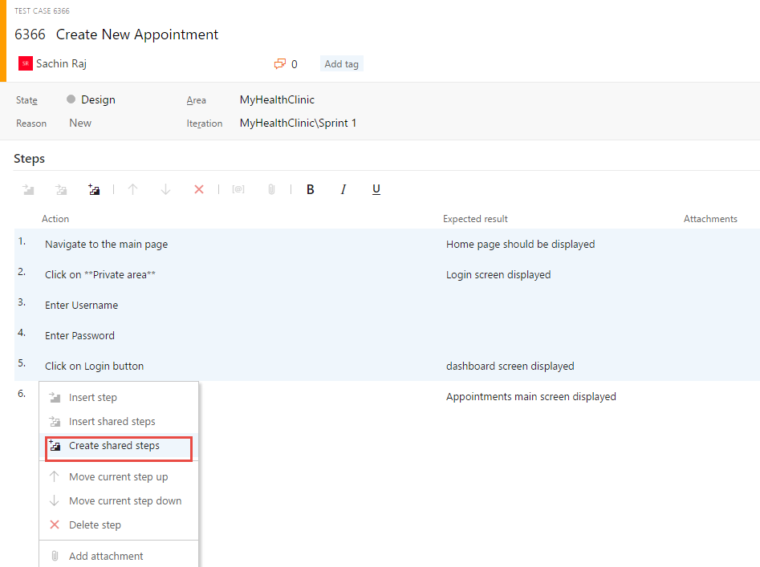

1. Provide a name for the shared steps and click **Create**.

   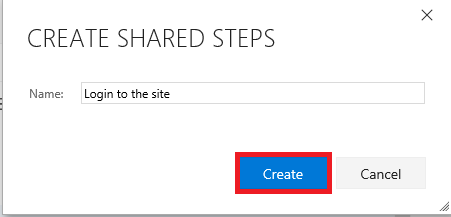

1. Now you can see the steps you selected are replaced with a link to the new shared steps. You can double-click the link to open the shared steps for viewing/editing.

   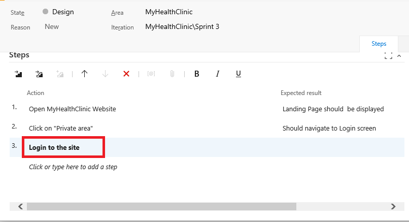

1. Click **Save & Close** to save the test case.

1. You can use the shared steps in other test cases. Open the other test case that you created. **Delete** the steps that you want to be replaced. Select the **Insert shared steps** button

   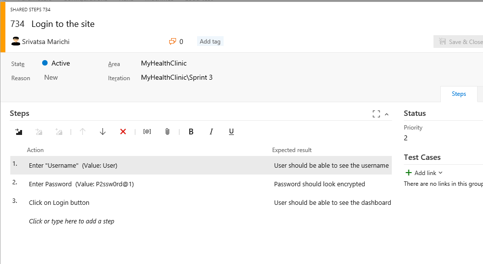

1. This will bring a query window with a query that will fetch all work items of **Microsoft.SharedStepsCategory**. You can add more clauses, if required. Click **Run** to run the query. Select the shared step that we created above and select the **Insert shared steps** button

   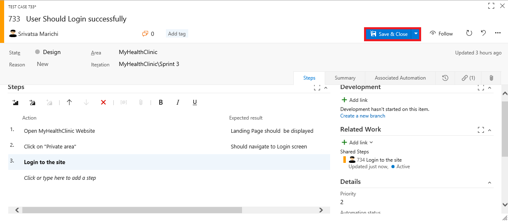

 When you run the tests case now, the shared steps will be expanded. You can mark the entire sequence as passed or failed or mark each step separately.

## Task 5: Analyzing Test Results

1. In this task, you will learn how to review the results of a manual test run.

1. Select the **Runs** tab under the **Test** hub. Double-click the most recent test run to open it.

   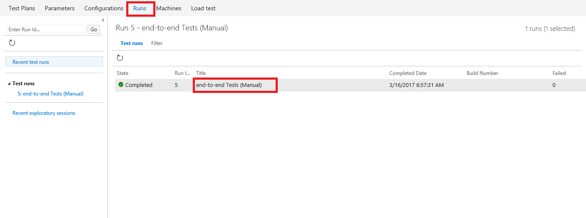

1. The **Run summary** tab provides an overview of the test run, as well as high-level details on the results of all tests included as part of the run.

   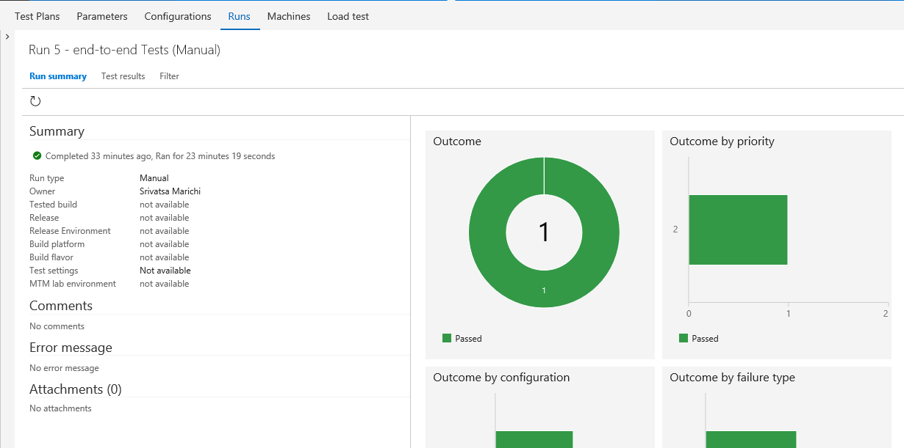

1. Select the **Test results** tab. This tab lists the results of each individual test case included in the run along with their results. Since there was only one test case included here, double-click it to open.

   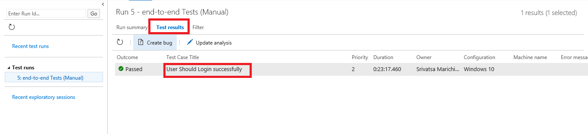

1. You can review all details for this particular test case run from here.

   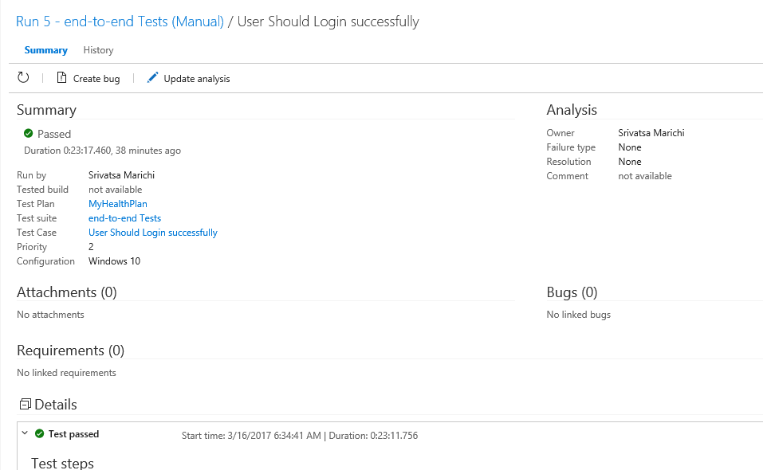

1. Review the results of each step in this iteration, during the test run.

   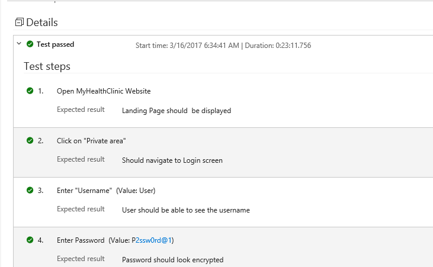

1. If you update the test results , you can select **Update Analysis** to change the test owner, test result and resolution type

    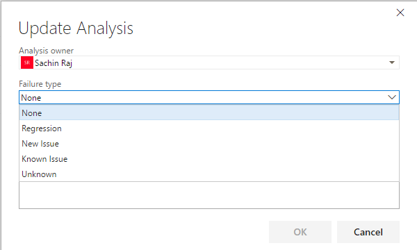

## Installing the Test Manager Extension

1. To acquire a full or a trial version of the **Test Manager** extension, select **Browse MarketPlace** from your account by clicking on the **shopping bag** icon.

   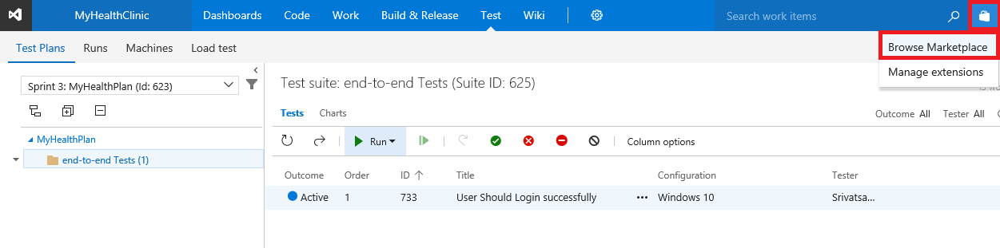

1. Under **Visual Studio Team Services** section, search for **Test Manager** extension in the Marketplace.

   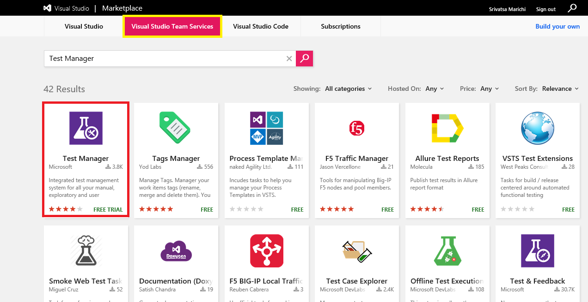

1. Install the extension by clicking **Start Trial**.

   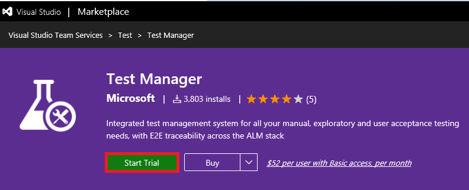

1. Select the account to which the extension has to be installed and click **Continue**.

   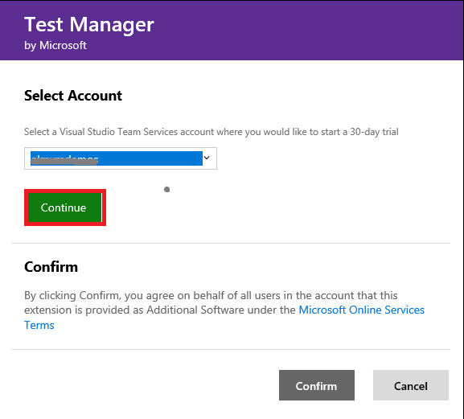

1. You should see a confirmation message. Click on **Confirm** to go ahead with the installation.

   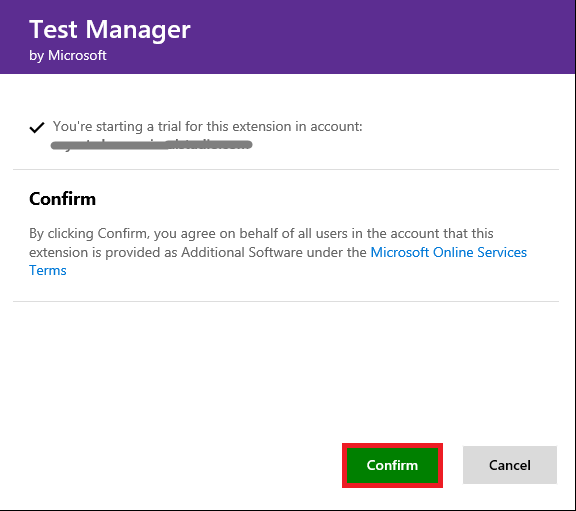

1. Trial extensions are available to all users. If you have requested for a trial version of the Test Manager extension, you do not have to do anything further. You are ready to start using the test management capabilities of Visual Studio Team Services.