## Overview

 In this lab, you will learn how to manage your project test lifecycle using the Visual Studio Team Services. This lab will guide you through creating Test Plans designed efficiently validate your software milestones. You will also create and execute Manual Tests that can be consistently reproduced over the course of each release.

## Task 1: Authoring Tests

1. Go to your VSTS account and project. Select **Test** hub.

2. Create a **Test Plan** as shown below and give a name.

   

   

3. Select **New static suite** and give a name. A static suite of test cases is a suite where the Test cases have been manually assigned. Remember that you can easily share test cases across suites, so there’s minimal redundancy when having a lot of overlapping suites. You can also create suites based on common requirements (requirement-based suite) or a query of test cases and/or work items (query-based suite).

   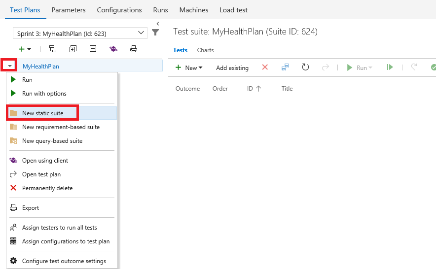

4. Expand the dropdown next to the newly created suite and select **New requirement-based suite.**

   

5. You could customize the query used to specify which requirements are retrieved, but just leave the defaults and click **Run query**. Locate and select the user stories. Click **Create** suites to create a test suite for each user story.

   

6. Select the first user story that focuses on Creating New Appointment.

   

7. While you can create test cases one at a time, it’s sometimes easier to use a grid layout to quickly add many test cases. In the test cases panel, select **New \| New test case using grid**.

   

8. Enter a few test cases and click the **Save All** button.

   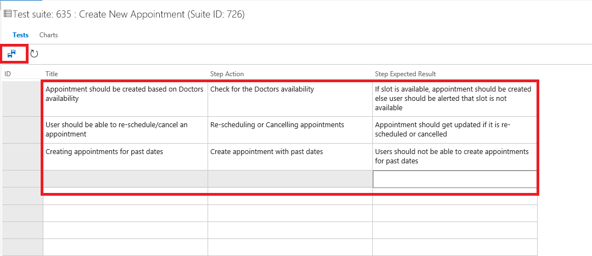

9. You can optionally continue to add and edit work items in the grid view. When satisfied, return back to the list view by clicking the **View: Grid** toggle.

    

    <table>
    <tr>
    <th class="text_center">Action</th>
    <th class="text_center">Expected Result</th>
    </tr>
    <tr>
    <td >Open <a href="https://myhealthclinic.azurewebsites.net">MyHealthClinicWebsite</a></td>
    <td>Landing page should be displayed</td>
    </tr>

    <tr>
    <td >Click on "Private area"</td>
    <td>Should navigate to Login screen</td>
    </tr>

10. The list view shows the same data, but in a different view.

    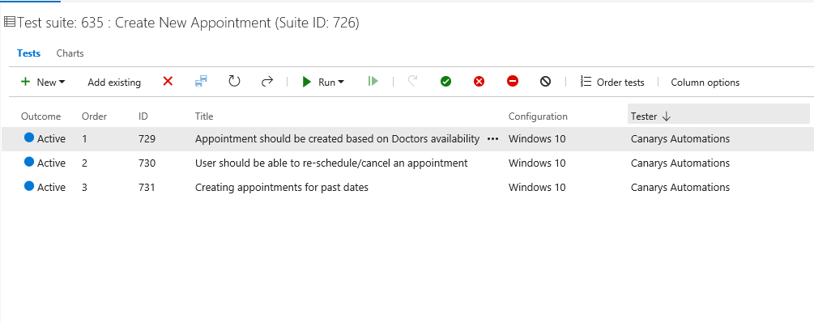

11. Another option to create suites is via work item query. Expand the dropdown next to the **Functional tests** suite and select new query-based suite.

    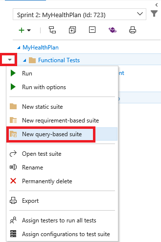

12. Let’s say you wanted to create a set of test suites based on bugs in the project. Change the Work Item Type to **Microsoft.BugCategory** (to search bugs)

    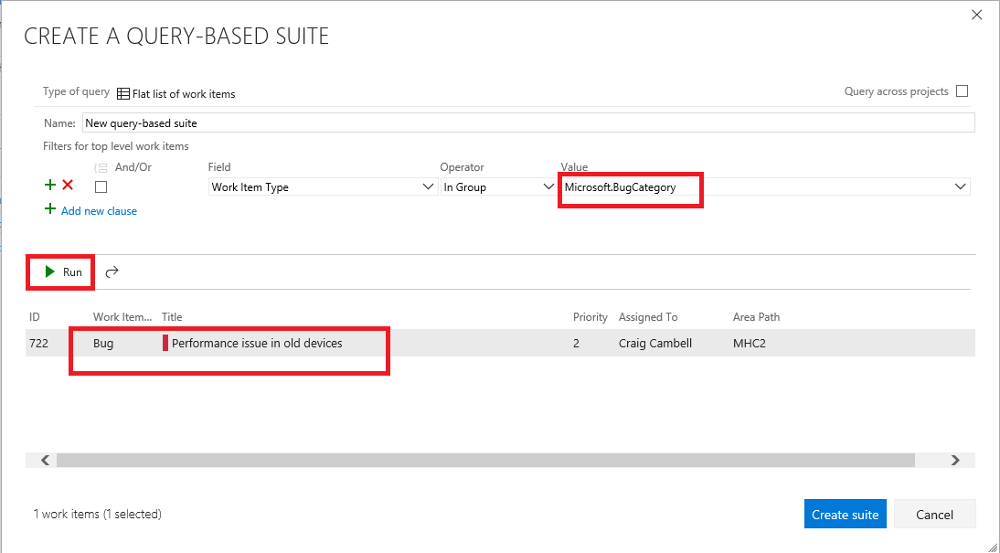

13. Press Esc to close the dialog.

## Task 2: Authoring a Manual Test Plan

1. Navigate to your **VSTS** account.

2. Select the **MyHealthClinic** project.

3. Select **Test \| Test Plans**.

   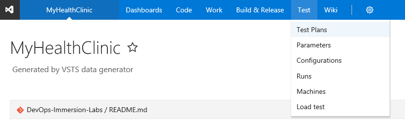

4. Expand the dropdown next to the test plan and select **New static suite**.

   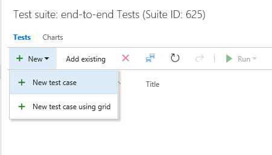

5. In the Title box, type **User Should Login successfully** as the name of the new test case.

   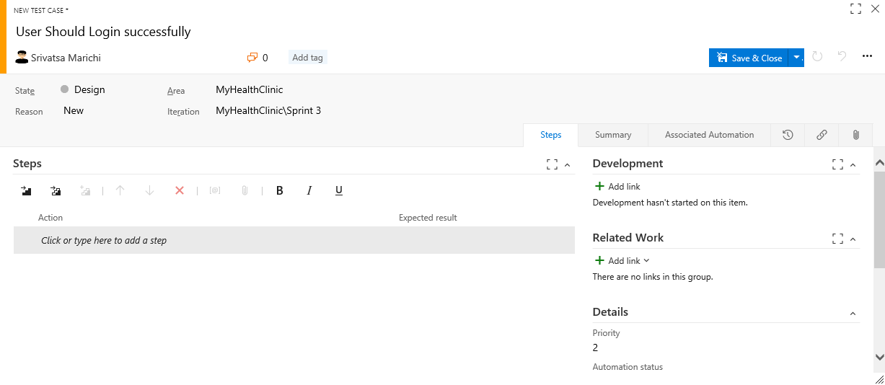

6. At this point, we’re ready to add steps to this manual test. Each step includes an **Action**, which describes the action the tester needs to perform. Optionally, a step can include an **Expected Result**, which describes the expected result of the given action. In the **Steps** panel, create a step for each of the following **Actions**, only one of which has an **Expected Result**.

   <table>
    <tr>
    <th class="text_center">Action</th>
    <th class="text_center">Expected Result</th>
    </tr>
    <tr>
    <td >Open <a href="https://myhealthclinic.azurewebsites.net">MyHealthClinicWebsite</a></td>
    <td>Landing page should be displayed</td>
    </tr>

    <tr>
    <td >Click on "Private area"</td>
    <td>Should navigate to Login screen</td>
    </tr>

    <tr>
    <td>Enter Username (User)</td>
    <td>User should be able to see the username</td>
    </tr>

    <tr>
    <td>Enter Password (P2ssw0rd@1)</td>
    <td>Password should look encrypted</td>
    </tr>

    <tr>
    <td>Click on Login button</td>
    <td>User should be able to see the dashboard</td>
    </tr>
    </table>

7. At this point, the **Steps** panel should look similar to the following:

   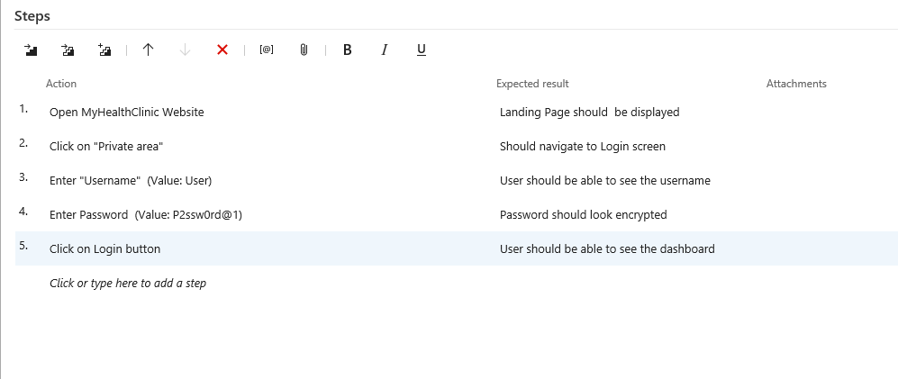

8. Click **Save & Close** to save the test case.

## Task 3: Running a Manual Test Plan

Before running tests manually, you should start the trial version for accessing all the features of **Test Manager** extension.

1. To do that **Browse MarketPlace** from your account by clicking on the **shopping bag** icon.

   

2. Under **Visual Studio Team Services** section, search for **Test Manager** extension in the Marketplace.

   

3. Install the extension by clicking **Start Trial**.

   

4. Select the account to which the extension has to be installed and click **Continue**.

   

5. You should see a confirmation message. Click on **Confirm** to go ahead with the installation.

   

6. Now that we are good to go, let's explore the features.

7. Return to Internet Explorer. Right-click the test case created earlier and select **Run with options** to begin a manual test run.

   

8. There are a few options that you can use to customize each test run. The first option is to select a **Runner**, which will be the browser in this scenario. Next, you have the option to specify what kind of **data to collect**. Finally, you may optionally specify which build is being tested to make it easier to associate the results with the build they were from. Click the **...** button to select a build.

   

9. Click **Find** to search builds. Using the default settings returns all builds.

   

10. If you do not want to select any builds, then press **Esc** within the **Find Builds** window.

11. Click **OK** to continue.

    

12. If the Test Runner window does not appear, check if the window is blocked by the pop-up blocker. If so, click the Pop-up blocker button, select **Always allow** and then click Done. You can then launch the **Test runner** window successfully.

    

13. You can see the **Test Runner** window now.

    

14. Let's start executing the Test Case now. 

    - **Test Step 1**: The first test step in this test case is to open <a href="https://myhealthclinic.azurewebsites.net">MyHealthClinicWebsite</a>. To do this, open a new window in Chrome. If you’re working on a large screen, it may be easier to resize the new window to fit next to the **Test Runner** window. Otherwise you can just switch back and forth.

      

    - **Test Step 2**: Once the site loads, return to the **Test Runner** and click the **Pass test** step button.

      

      >**Note**: When you execute each Test step and the step passes, you can mark it as passed. Do this for the remaining test steps.

    - **Test Step 3**: The next step is to click the **Private area**.

      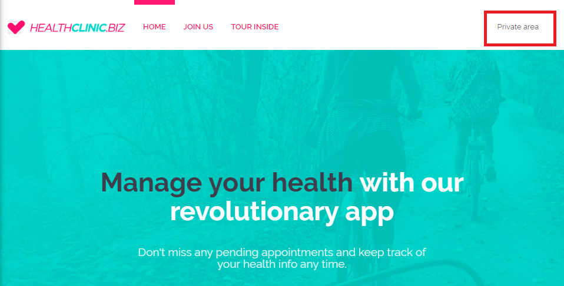

    - **Test Step 4**: Enter the **Username**. Use the below Username.
    
      >Username: User

      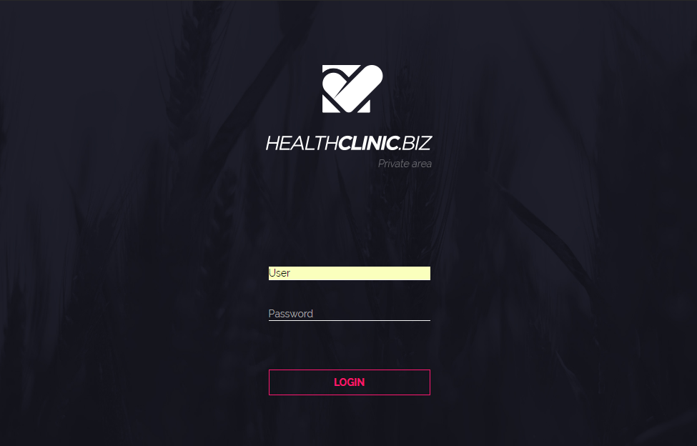

    - **Test Step 5**: Enter the **Password**.

      >Value: P2ssw0rd@1

      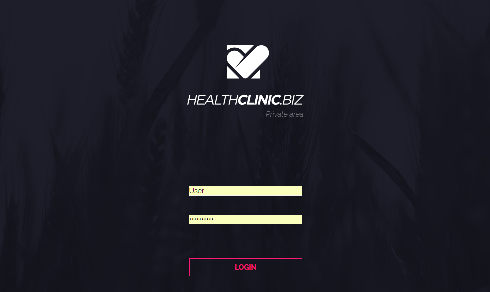

    - **Test Step 6**: Click on the **Login Button**.

      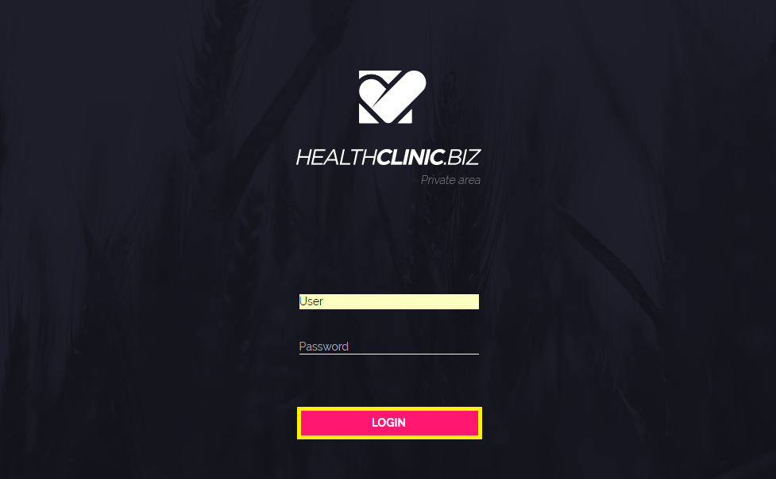

      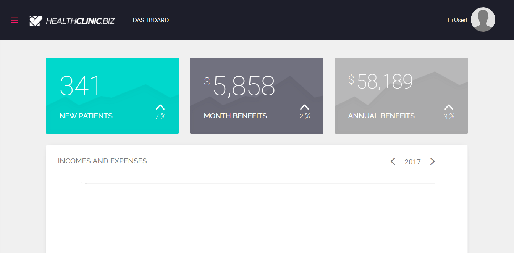

15. Click **Save and close** from the Test runner.

    

## Task 4: Analyzing Manual Test Results

1. In this task, you will learn how to review the results of a manual test run.

2. Return to the browser window hosting the **Test Hub**. Select the **Runs** tab and double-click the most recent test run to open it.

   

3. The **Run summary** tab provides an overview of the test run, as well as high-level details on the results of all tests included as part of the run.
   
   

4. Select the **Test results** tab. This tab lists the results of each individual test case included in the run along with their results. Since there was only one test case included here, double-click it to open.

   

5. You can review all details for this particular test case run from here.

   

6. Review the results of each step in this iteration, during the test run.

   

## Task 6: Creating Shared Steps

1. In this task, you will learn how to create shared steps. A shared step combines multiple steps that are commonly performed in sequence into a single logical step, which can be shared across tests. If the process defined by the shared steps ever changes in the future, you can update the shared step in one place and it will be reflected in all tests that reference it.

2. Click the test case link in the Summary section to open the test case editor.

   

3. Select steps 3-5 (use **Shift+Click**) and click the **Create shared steps** button.

   

4. Set the name of these shared steps to **Login to the site** and click **Create**.

   

5. Now you can see the previous steps replaced with the shared steps. Double-click the shared steps to open.

   

6. If necessary, you can revisit these steps later on to update them for new requirements.

   

7. Press **Esc** to close the **Shared Steps** dialog.

8. Click **Save & Close** to save the test case.

   

