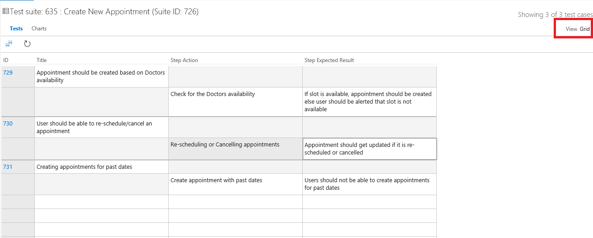
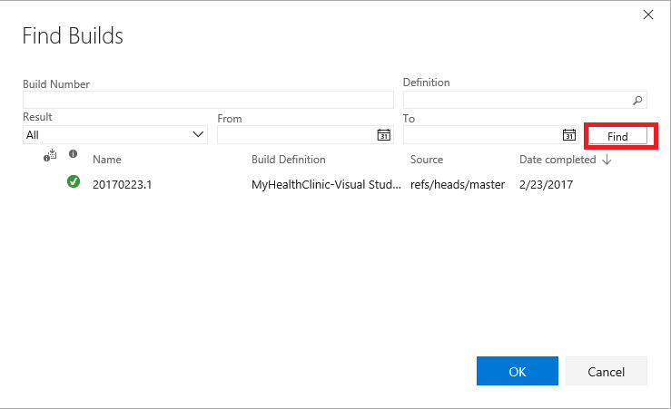
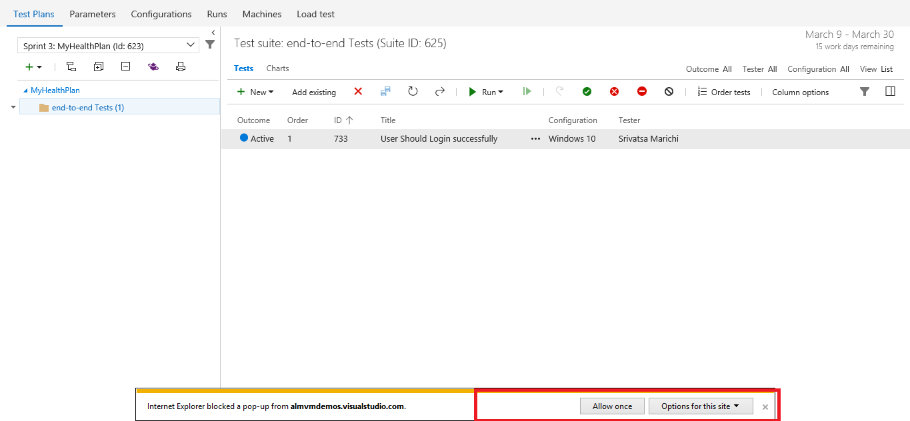
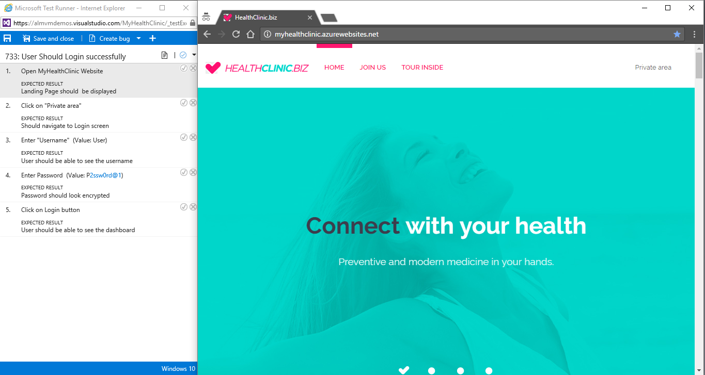
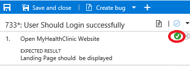
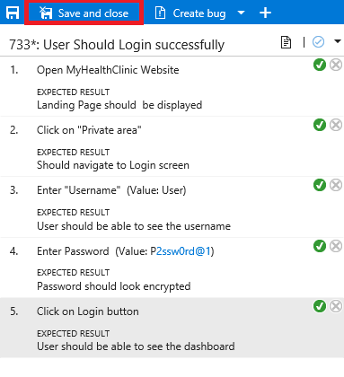
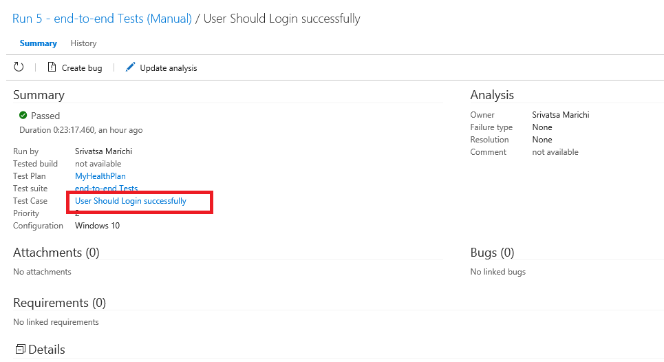
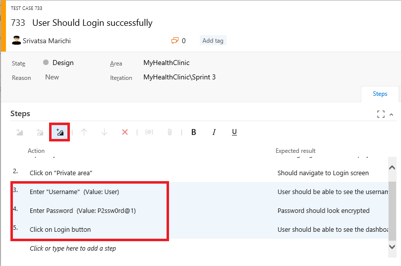

## Overview

 In this lab, you will learn how to manage your project test lifecycle using the Visual Studio Team Services. This lab will guide you through creating test plans designed efficiently to validate your software milestones. You will also create and execute manual tests that can be consistently reproduced over the course of each release.

## Task 1: Creating Test Plan

Visual Studio Team Services (VSTS) allows teams to organize test cases into a hierarchy of test suites inside test plans. Test plans are used to track manual testing for sprints or milestones. That way, you can see when the testing for a specific sprint or milestone is complete. Let's start with creating a new test plan.

1. Go to your Visual Studio Team Services (VSTS) account and project. Select **Test** hub.

2. Click the green + to create a new  **Test Plan**. We will create a test plan for testing our backlog items in Sprint1. Name the test plan and select ***MyHealthClinic\Sprint 1*** for the iteration

   

   

3. Add a **Test Suite** now to group test cases further. You can create three types of test suites:  
  * Static test suites are like folders. A static test suite can contain both test cases and other suites.
  * Requirements-based suites are derived from Product Backlog Items, User Stories, or other requirements. The suite contains all the test cases that are linked to its requirement. This type helps you track how well each requirement has been tested. 
  * Query-based suites show the results of a query that you define. For example, you could select all the test cases that have Priority = 1.

4. Expand the dropdown next to the newly created suite and select **New requirement-based suite.**

   

5. Add a clause to filter by the iteration path for the sprint and click **Run query**. Select the backlog items that you want to test this sprint and select **Create suites** to add them as requirements to your test plan by creating test suites from them.
   

6. Now, you can start adding test cases.  Select the backlog item to which you want to add a test case and select **New Test Case**

   

1. Enter a name for the test case and add some test steps. Each step includes an **Action**, which describes the action the tester needs to perform. Optionally, a step can include an **Expected Result**, which describes the expected result of the given action. You can add attachments to a step if you want.

   

1. Select **Save & Close** to save the test case and return to the previous page

1. While you can create test cases one at a time, it’s sometimes easier to use a grid layout to quickly add many test cases. In the test case panel, select **New \| New test case using grid**.

   

1. Enter a few test cases.

   <!--img src="images/8.png" width="624"-->

   <table>
    <thead>
    <th class="text_center">Title</th>
    <th class="text_center">Step Action</th>
    <th class="text_center">Step Expected Result</th>
    </thead>

    <tr><td> Appointments on Dashboard Page</td><td></td><td></td></tr>
    <tr><td></td><td>Navigate to the main page</td><td>Home page should be displayed</td></tr>
    <tr><td></td><td>Click on **Private area**</td><td>	Login screen displayed</td></tr>
    <tr><td></td><td>Enter Username </td><td></td>v
    <tr><td></td><td>Enter Password </td><td></td></tr>
    <tr><td></td><td>SelectLogin button</td><td>	dashboard screen displayed</td>
    </tr>

    <tr><td>Create New Appointment</td><td></td><td></td></tr>
    <tr><td></td><td>Navigate to the main page</td><td>Home page should be displayed</td></tr>
    <tr><td></td><td>Click on **Private area**</td><td>	Login screen displayed</td></tr>
    <tr><td></td><td>Enter Username </td><td></td>v
    <tr><td></td><td>Enter Password </td><td></td></tr>
    <tr><td></td><td>Click on Login button</td><td>	dashboard screen displayed</td>
        <tr><td></td><td>Select Appointments</td><td>	Appointments main screen displayed</td>
    </tr>
</table>

1. Select the **Save All** button when you are done

9. Select the **View: Grid** to toggle back to the list view

    

## Task 2: Run Manual Tests

Before running tests manually, you should start the trial version of **Test Manager** extension for accessing all the features.

1. To do that **Browse MarketPlace** from your account by clicking on the **shopping bag** icon.

   

2. Under **Visual Studio Team Services** section, search for **Test Manager** extension in the Marketplace.

   

3. Install the extension by clicking **Start Trial**.

   

4. Select the account to which the extension has to be installed and click **Continue**.

   

5. You should see a confirmation message. Click on **Confirm** to go ahead with the installation.

   

6. Now that we are good to go, let's explore the features.

7. Return to Internet Explorer. Right-click the test case created earlier and select **Run with options** to begin a manual test run.

   

8. There are a few options that you can use to customize each test run. The first option is to select a **Runner**, which will be the browser in this scenario. Next, you have the option to specify what kind of **data to collect**. Finally, you may optionally specify which build is being tested to make it easier to associate the results with the build they were from. Click the **...** button to select a build.

   

9. Click **Find** to search builds. Using the default settings returns all builds.

   

10. If you do not want to select any builds, then press **Esc** within the **Find Builds** window.

11. Click **OK** to continue.

    

12. If the Test Runner window does not appear, check if the window is blocked by the pop-up blocker. If so, click the Pop-up blocker button, select **Always allow** and then click Done. You can then launch the **Test runner** window successfully.

    

13. You can see the **Test Runner** window now.

    

14. Let's start executing the Test Case now. 

    - **Test Step 1**: The first test step in this test case is to open <a href="">MyHealthClinicWebsite</a>. To do this, open a new window in Chrome. If you’re working on a large screen, it may be easier to resize the new window to fit next to the **Test Runner** window. Otherwise you can just switch back and forth.

      

    - **Test Step 2**: Once the site loads, return to the **Test Runner** and click the **Pass test** step button.

      

      >**Note**: When you execute each Test step and the step passes, you can mark it as passed. Do this for the remaining test steps.

15. Click **Save and close** from the Test runner.

    

## Task 4: Creating Shared Steps

Shared Steps combines multiple steps that are commonly performed in sequence into a single logical step, which can be shared across tests. If the process defined by the shared steps ever changes in the future, you can update the shared step in one place and it will be reflected in all tests that reference it.

1. Click the test case link in the Summary section to open the test case editor.

   

2. Select steps 3-5 (use **Shift+Click**) and click the **Create shared steps** button.

   

3. Set the name of these shared steps to **Login to the site** and click **Create**.

   

4. Now you can see the previous steps replaced with the shared steps. Double-click the shared steps to open.

   

5. If necessary, you can revisit these steps later on to update them for new requirements.

   

6. Press **Esc** to close the **Shared Steps** dialog.

7. Click **Save & Close** to save the test case.

   

## Task 5: Analyzing Test Results

1. In this task, you will learn how to review the results of a manual test run.

2. Return to the browser window hosting the **Test Hub**. Select the **Runs** tab and double-click the most recent test run to open it.

   

3. The **Run summary** tab provides an overview of the test run, as well as high-level details on the results of all tests included as part of the run.
   
   

4. Select the **Test results** tab. This tab lists the results of each individual test case included in the run along with their results. Since there was only one test case included here, double-click it to open.

   

5. You can review all details for this particular test case run from here.

   

6. Review the results of each step in this iteration, during the test run.

   

