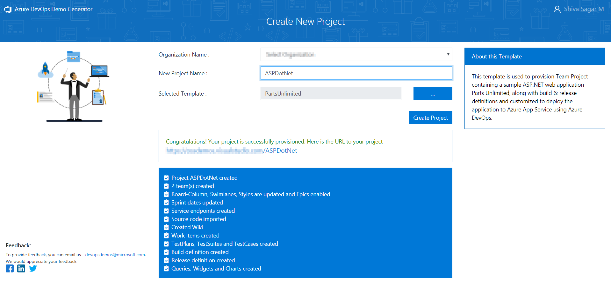

### Prerequisites for the lab

1. **Microsoft Azure Account**: You will need a valid and active Azure account for the Azure labs. If you do not have one, you can sign up for a [free trial](https://azure.microsoft.com/en-us/free/){:target="_blank"}

    * If you are an active Visual Studio Subscriber, you are entitled for a $50-$150 credit per month. You can refer to this [link](https://azure.microsoft.com/en-us/pricing/member-offers/msdn-benefits-details/){:target="_blank"} to find out more information about this, including how to activate and start using your monthly Azure credit.

    * If you are not a Visual Studio Subscriber, you can sign up for the FREE [Visual Studio Dev Essentials](https://www.visualstudio.com/dev-essentials/){:target="_blank"} program to create an **Azure free account** (includes 1 year of free services, $200 for 1st month).

1. You will need an **Azure DevOps Organization**. If you do not have one, you can sign up for free [here](https://www.visualstudio.com/products/visual-studio-team-services-vs){:target="_blank"}

## Setting up the Azure DevOps Project

1. Use the [Azure DevOps Demo Generator](https://azuredevopsdemogenerator.azurewebsites.net){:target="_blank"} to provision team project on your Azure DevOps Organization.

   > **Azure DevOps Demo Generator** helps you create team projects on your Azure DevOps Organization with sample content that include source code, work items, iterations, service endpoints, build and release definitions based on the template you choose during the configuration.

   

1. Once team project is provisioned, click on the URL to navigate to the team project.

   