<div class="rw-ui-container"></div>

## Overview

[Jenkins](https://jenkins.io/){:target="_blank"} is a very popular Java-based open source continuous integration (CI) server that allows teams to continuously build applications across platforms. Azure Pipeline includes the ability to build any application on any platform including Windows, Linux and Mac. However, it also integrates well with Jenkins for teams who already use or prefer to use Jenkins for CI.

There are two ways to integrate Jenkins with Azure Pipelines:

* One way is to  **run CI jobs in Jenkins** separately. This involves the configuration of a CI pipeline in Jenkins and a webhook in Azure DevOps that invokes the CI process when source code is pushed to a repository or a branch.

* The alternate way is to **wrap a Jenkins CI job inside an Azure pipeline**. In this approach, a build definition will be configured in Azure Pipelines to use the **Jenkins** tasks to invoke a CI job in Jenkins, download and publish the artifacts produced by Jenkins. 

An Azure CD pipeline can be configured to pick these build artifacts, irrespective of the approach, for deployment. While there are pros and cons with both the approaches, the latter approach has multiple benefits:

 1. End-to-end traceability from work item to source code to build and release
 1. Triggering of a Continuous Deployment (CD) when the build is completed successfully
 1. Execution of the build as part of the branching strategy

### What's covered in this lab

This lab covers both the approaches and the following tasks will be performed

* Provision Jenkins on Azure VM using the Jenkins template available on the Azure Marketplace
* Configure Jenkins to work with Maven and Azure DevOps
* Create a build job in Jenkins
* Configure Azure Pipeline to integrate with Jenkins
* Configure a CD pipeline in the Azure Pipelines to deploy the build artifacts

### Before you begin

1. **Microsoft Azure Account**: You will need a valid and active Azure account for the Azure labs. If you do not have one, you can sign up for a [free trial](https://azure.microsoft.com/en-us/free/){:target="_blank"}
    
1. <a href="http://www.putty.org/" target="_blank"> Putty</a> a free SSH and Telnet client

1. Set up your Azure DevOps project using the **MyShuttle** template in the <a href="https://azuredevopsdemogenerator.azurewebsites.net/?TemplateId=77371&Name=MyShuttle" target="_blank">Azure DevOps Demo Generator</a>. We will use a Java web app that connects to a MySQL backend.

## Setting up the Jenkins VM

1. To configure Jenkins, the Jenkins VM image available on the Azure Marketplace will be used. This will install the latest stable Jenkins version on an Ubuntu Linux VM along with the tools and plugins configured to work with the Azure. Click on the **Deploy to Azure** button below to get started. Note: After clicking create, choose Password as the Authentication Type. Make note of the username and password.

   [](https://portal.azure.com/#create/bitnami.jenkins1-650){:target="_blank"}

1. Once the Jenkins VM is provisioned, navigate to the VM's overview page and make a note of the `public IP address`. This information will be required to connect to the Jenkins VM from ***Putty***

   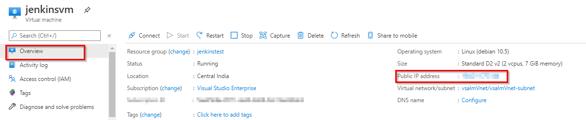

   {% include note.html content= "Jenkins, by default, listens on port 8080 using HTTP. To configure a secure HTTPS connection, an SSL certificate will be required. If HTTPS communication is not being configured, the best way to ensure that the sign-in credentials are not leaked due to a \"Man-in-the-middle\" attack is by logging-in using the SSH tunnelling. An SSH tunnel is an encrypted tunnel created through an SSH protocol connection, that can be used to transfer unencrypted traffic over an unsecured network." %}

   <!-- <div id="myModal" class="modal">
        <span class="close">&times;</span>
        <div id="caption"></div>
    </div> -->

1. To initiate an SSH tunnel, the following command needs to be run from a Command Prompt. An SSH tunnel creates a secure connection between your host and remote computer through which services can be relayed. If this command is successful, you should be able to access the remote Jenkins on port 8080 on your local machine. Note: If you have a website on 8080, you may need to choose another port.

    ```cmd
    putty.exe -ssh -L 8080:localhost:8080 <username>@<ip address>
    ```

   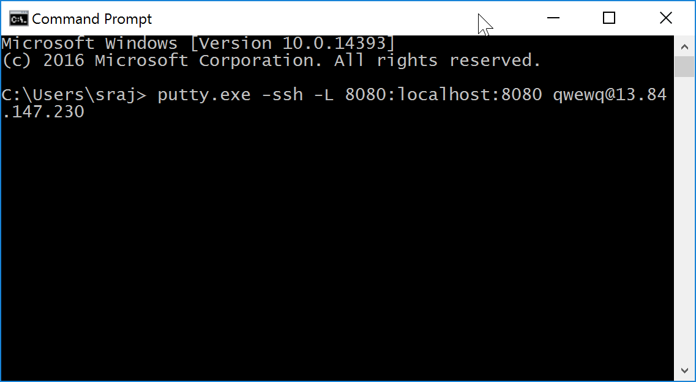

   

1. Log in with the user name and password that you have provided while provisioning the Jenkins VM.

1. Once the connection is successful, open a browser on the host machine and navigate to the URL [http://localhost:8080](http://localhost:8080). The **Sign in** page for Jenkins will be displayed.

1. For security reasons, the application credentials are stored in a standalone file in the VM. This credentials will need to be retrieved and provided to sign in to Jenkins. Return to the **Putty** terminal and type the following command to open the credentials file and copy the user name and password. 

    `sudo cat /home/bitnami/bitnami_credentials`

     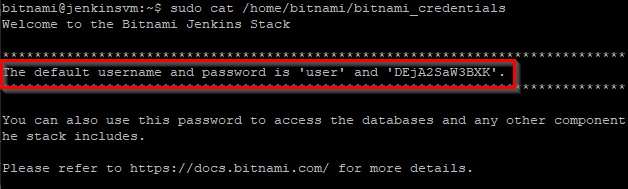

1. Return to the browser, paste the copied Username and Password to sign in to the Jenkins.

<!--
1. Jenkins has a vast ecosystem with a strong and active open source community users contributing hundreds of useful plugins. While configuring Jenkins,  you can choose between installing the most commonly used plugins or go for specific selected plugins. Select **Install suggested plugins**  to initiate the configuration with default plugins. We will install other plugins such as Maven, Azure DevOps manually later.

      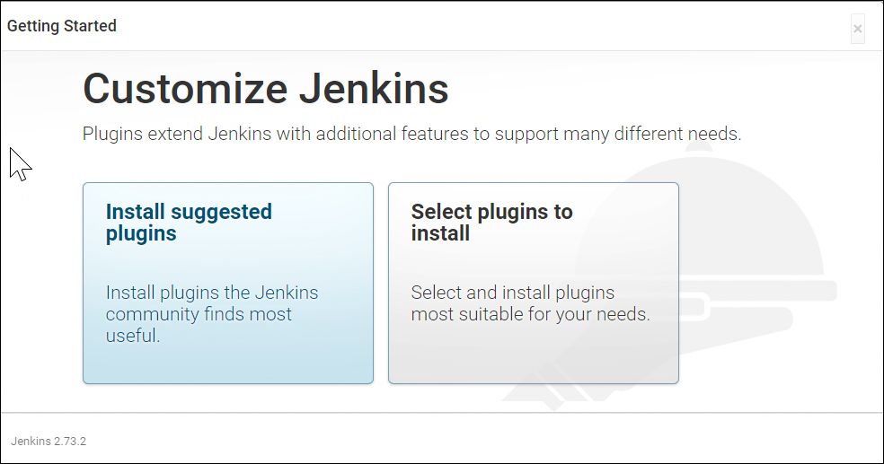

1. The final step is to create a new `Admin` user. Provide  *User name*, *Password*, *Full name* and *Email address* for the user. Select **Save and Continue** when you are done. 

    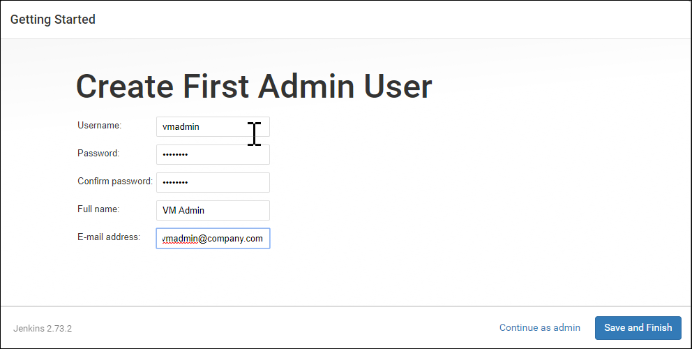

1. Jenkins is now ready for use. Select **Start using Jenkins** to start using it.

    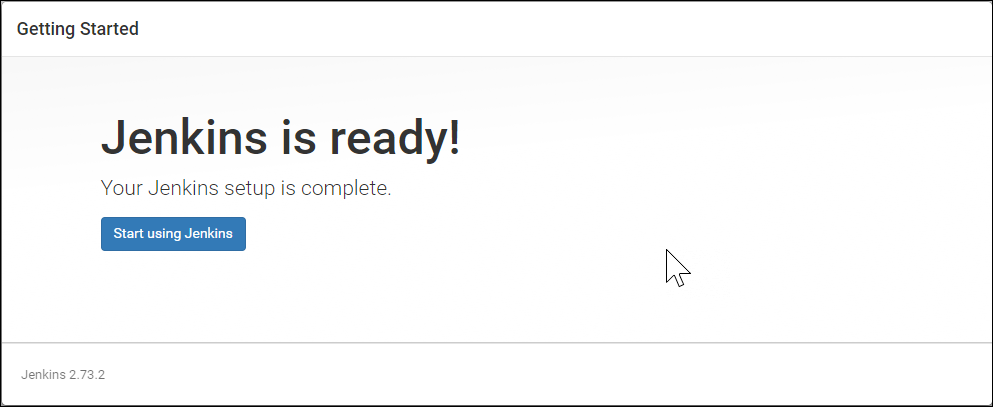
    
    -->

### Installing and Configuring Plugins

1. We will now install the Maven and VSTS (yet to be renamed Azure DevOps!) plugins that we require for this lab. Click **Manage Jenkins**  on the Jenkins home page and select **Manage Plugins**. Select the **Available** tab and search for `team services` 

    

  


1. Select **VS Team Services Continuous Deployment** plugin and select **Install without restart**
    
    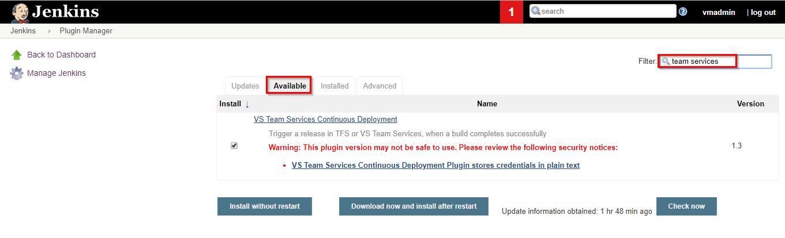

1. Select **Manage Plugins**, select the **Available** tab and search for `maven-plugin`

1. Select the **Maven Integration Plugin** and select the **Install without restart** button to install the plugin.

    

1. Once the plugin is installed, go back to **Manage Jenkins** and select the **Global Tool Configuration** option.

    

   

1. To install Maven, select the **Install automatically** option and select the **Apply** button. The latest version of Maven at the time of writing this lab is 3.5.4

   

1. Select the **Back to Dashboard** button to return to the home page. We are done with the setup. Let's go and create a new CI job. 

### Creating a new build job in Jenkins

1. From the Jenkins home page, click on the **New Item** link. Provide a name for the build definition, select **Maven project** and click **OK**.

    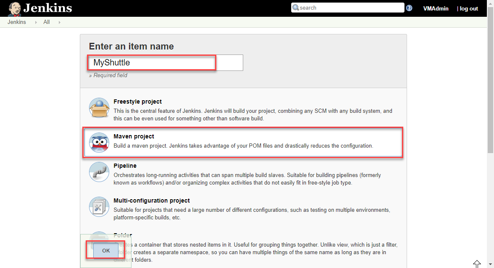

1. Now scroll down to the **Source code Management** section. Select  **Git**  and provide the clone URL of the Azure DevOps Git repo in the format 
   `http://dev.azure.com/{your org name}/{team project name}/_git/MyShuttle`. If you do not see **Git** under Source code management (not a usual thing), you will need to install/enable the Git plugin.

   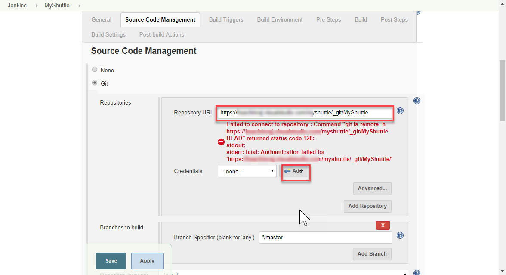

1. Your Azure repo is very likely to be private. Unless you have a public repo, you should provide the credentials to access the repository. If you do not have one or don't remember the credentials, go to your Azure Repos and select the **Clone** option. Select **Generate Credentials** and note down `Username` and `Password`.

   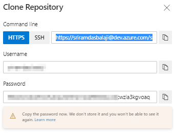

1. Select the **Add \| Jenkins** option to add a new credential. Provide the `Username` and `Password` created in the previous step and click the **Add** button to close the wizard

    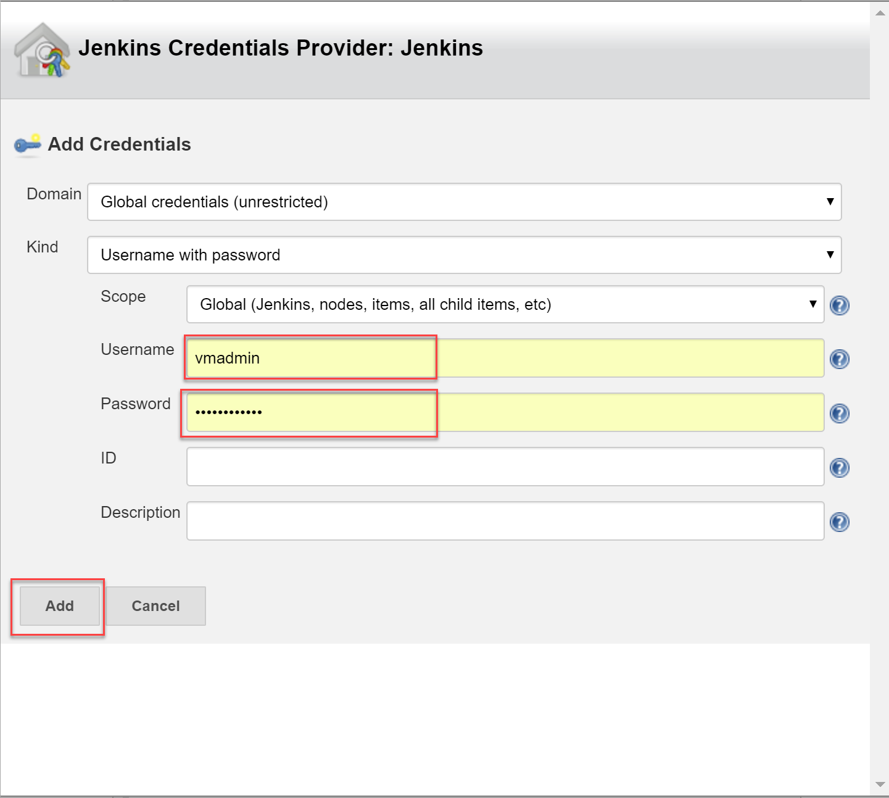

1. Select the credential created in the previous step from the drop-down. The error message should disappear.

     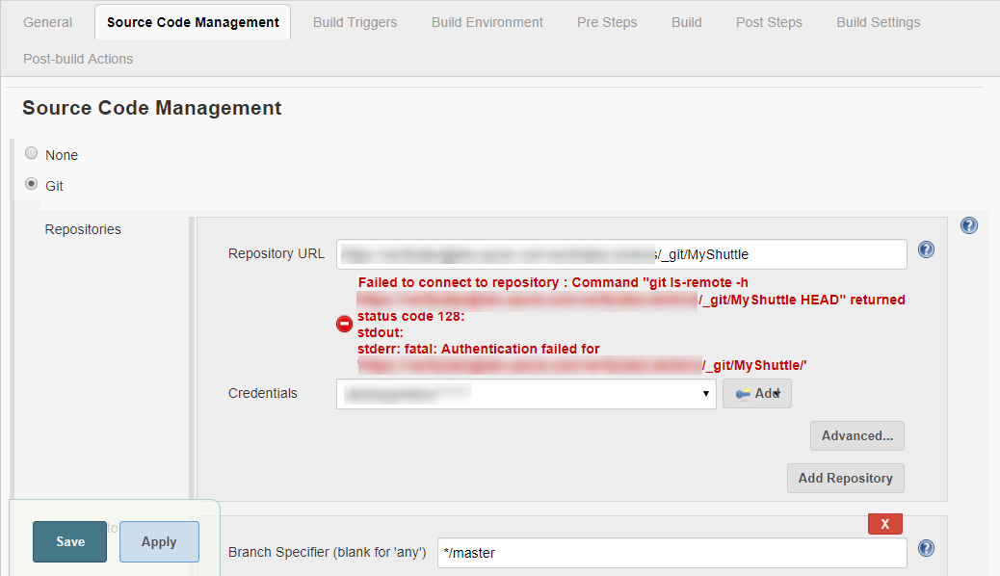

1. The source code for this application has both unit tests and UI tests. We are not ready to run the UI test at this point. So, we will specify to run only the unit tests. Scroll down to the **Build** section and provide the text `package -Dtest=FaresTest,SimpleTest` in the **Goals and options** field. 

     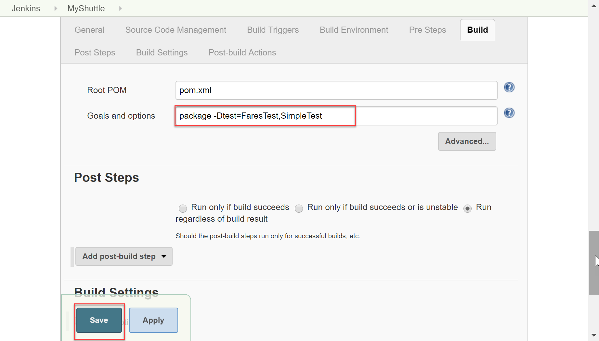

1. Once the build is complete, you can specify what action you want to take. For instance, you can archive the build artifacts, trigger an Azure CD pipeline, deploy directly to Azure App Service, etc., We will choose the **Archive the artifacts** option in the **Post-build Actions**. 

   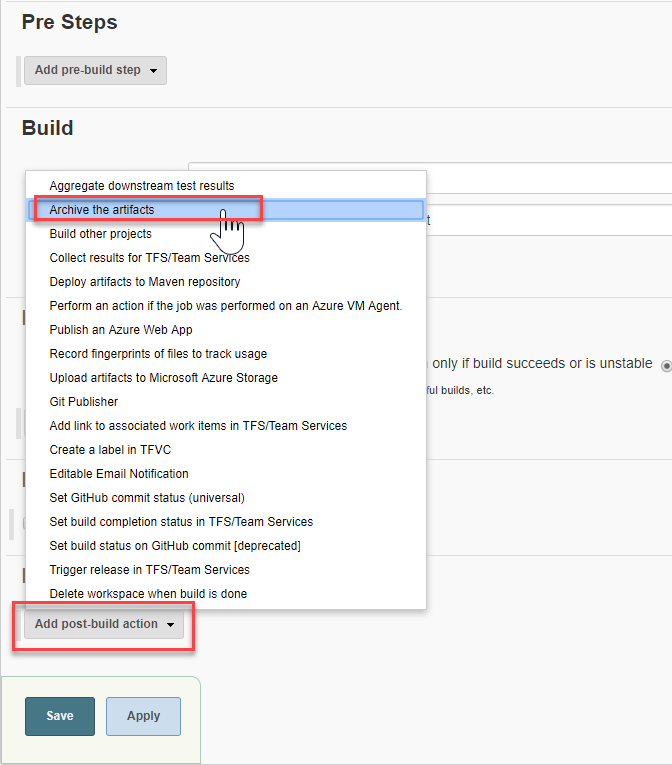

   

1. Enter  **target/*.war, \*.sql** in the **Files to archive** text box. Select the **Save** button to save the settings and return to the project page.

   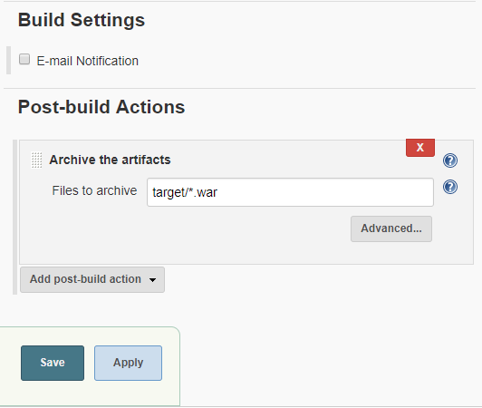

1. The configuration is now completed, Select the **Build Now** option to initiate an Ad-hoc build. The build progress will be displayed on the left pane in the **Build History** section

   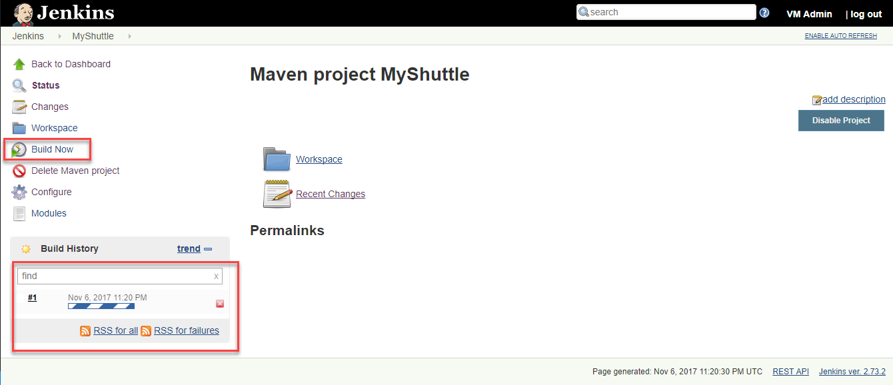

1. To view the build details and the list of build artifacts, select the build number displayed in the **Build History** section.

    <!-- 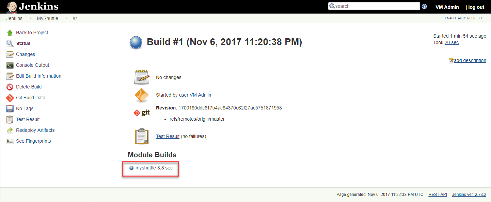 -->

    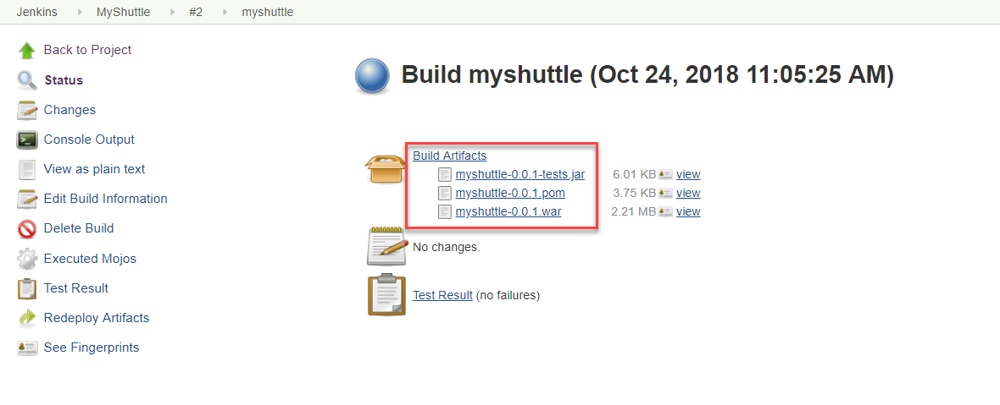

1. Select the **Test Result** option to view the results of the unit tests that were included in the build definition.

Next, we will explore the two different options available to trigger the Jenkins CI job when a code is pushed to Azure Repos. 

## Preparing Jenkins machine to use service hook in Azure DevOps

For the service hook in Azure DevOps to work - Jenkins machine should accept incoming connections to port 8080. 

1. Open [https://portal.azure.com/](https://portal.azure.com/) and access your virtual machine with Jenkins. 

1. Click the "Networking" link in the Settings tab and click "Add inbound port rule" button 

    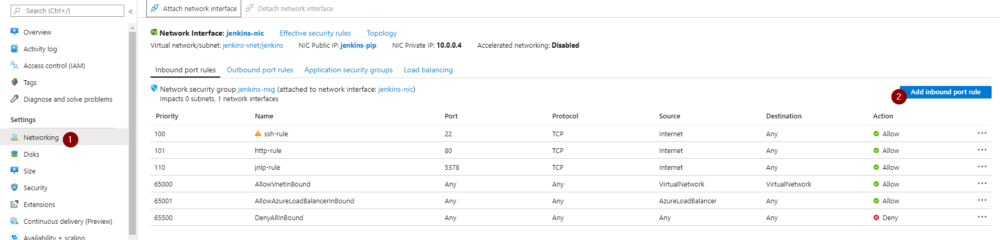

1. Set an inbound rule for port 8080

    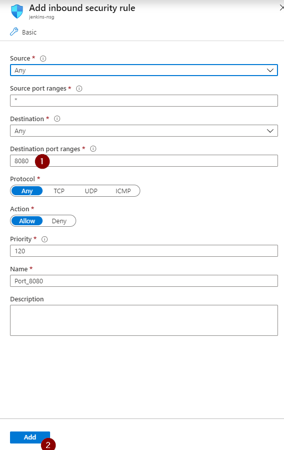
1. Navigate to your Jenkins page and go to **User \| Configure**. Click on **Add new token** under API Token section and give some name and click **Generate**. Make a note of the Token generated. We would be using this Token as Jenkins password in Azure DevOps
   
     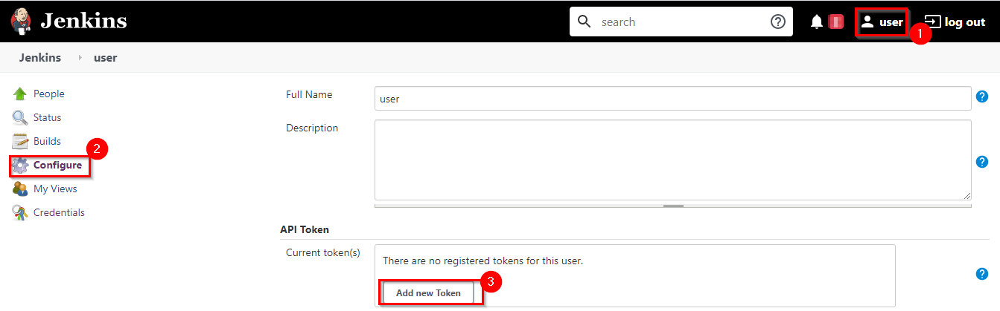

     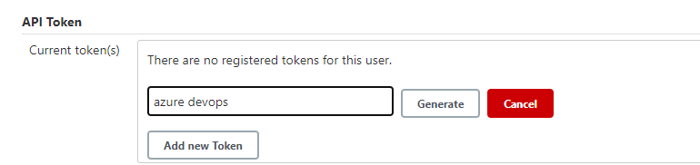

## Approach 1: Triggering the CI via a service hook in Azure DevOps

In this approach, a service hook will be configured in Azure DevOps to trigger a Jenkins build upon a code commit. Service hooks enable you to perform tasks on other services when events happen in your Azure DevOps Services projects.

1. To configure the service hook, navigate to the Azure DevOps project settings page and select **Service hooks** under **General**. Select **+ Create subscription**.

1. In the *New Service Hook Subscriptions* screen, select the **Jenkins** option and then click the **Next** button. Jenkins service supports three events - **Build completed**,  **Code Pushed** and **Pull request merged**. We are only interested in the code push event - so, select **Code pushed** for the **Trigger on this type of event** field. Select the **MyShuttle** repository and then click **Next**

    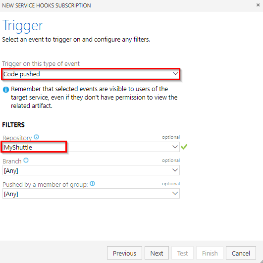

  

1. Provide the following details in the **Select and configure the action to perform** screen
   1. Select the **Trigger generic build** option

   1. Provide the **Jenkins base URL** in `Http://{ip address}:8080` format 

   1. Provide the **User name**  and **User API Token** to trigger the build. Note that the username and Token are the credentials of the Jenkins user. For Token use, the API Token generated earlier from Jenkins
   
   
   1. Select the **Build** job you created in Jenkins.
     
      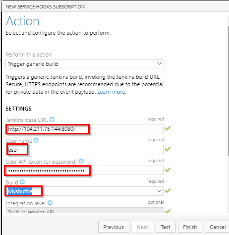

    <!-- 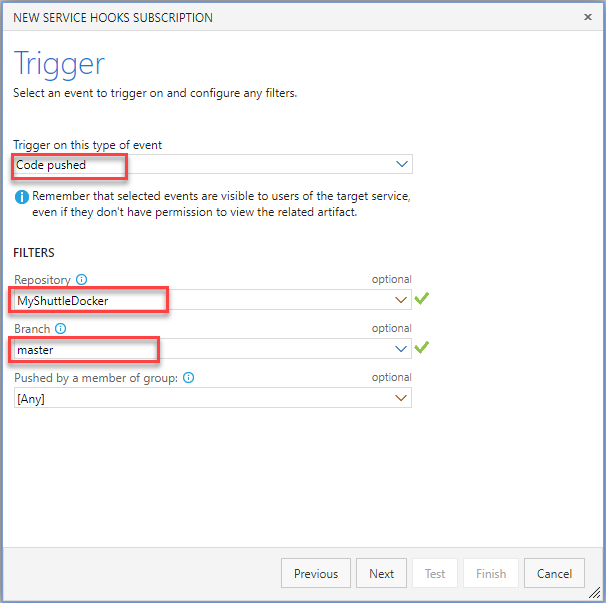 -->
1. Click the **Test** button to validate the configuration and then click **Finish**. This will set the trigger to initiate the Jenkins CI build whenever a source code change is committed on the repository.

1. Try making a commit to the code -  `src/main/webapp/index.jsp` would be a good candidate. This should trigger the MyShuttle build on Jenkins. You can confirm it by checking the history tab of the Jenkins services hook.  

   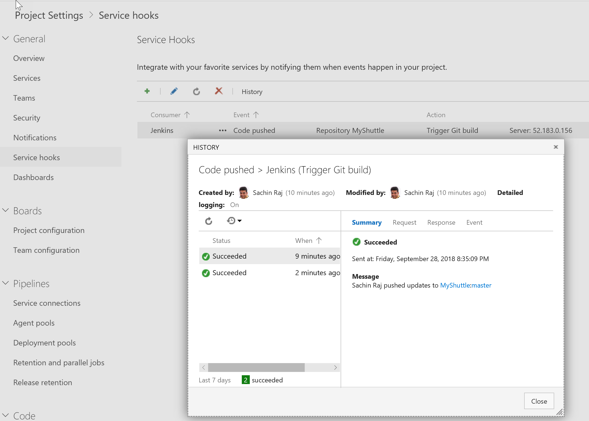

   
## Approach 2: Wrapping Jenkins Job within Azure Pipelines

In this approach, Jenkins CI job will be nested within an Azure CI pipeline. The key benefit of this approach is that you can have end-to-end traceability from work items to source code to build and release pipelines.

To begin, an endpoint to the Jenkins Server for communication with Azure DevOps will be configured.

1. Go to your project settings. Select **Pipelines** and **Service connections**, click **New service connection** and choose **Jenkins** from the dropdown.

1. Provide a connection name, Jenkins server URL in the format `http://[server IP address]:8080` and Jenkins user name with password (Use Jenkins User API Token as password). Select **Verify Connection** and validate the configuration. If it is successful, then select **Ok**. 

   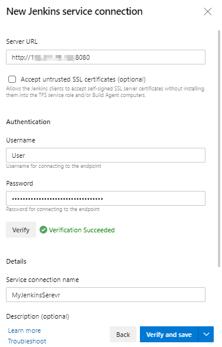

   The next step would be to configure the build pipeline.

1. Go to **Pipelines \| Pipelines**, Click **New Pipeline**  to create a new build definition.

1. Select **Use the classic editor** to create a pipeline without a YAML. 

1. Select **Myshuttle** project, repository and click *Continue*.

1. Scroll down and select the standard **Jenkins** template and then click on **Apply**.

    

1. Select **vs2017-win2016** for the Agent specification, provide **MyShuttle** as the Job name ( name of the build definition that was created in Jenkins)  and then select the Jenkins service endpoint created earlier.

    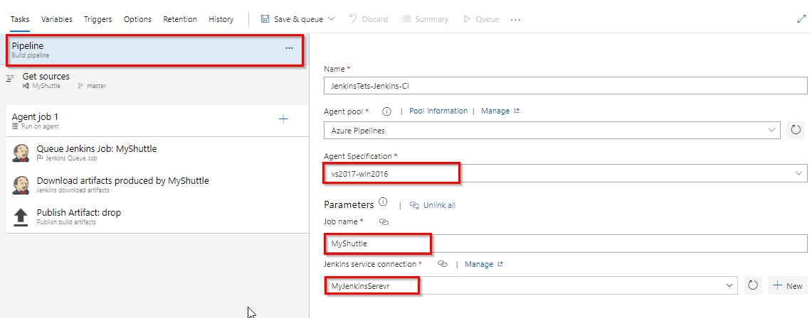

    <!-- 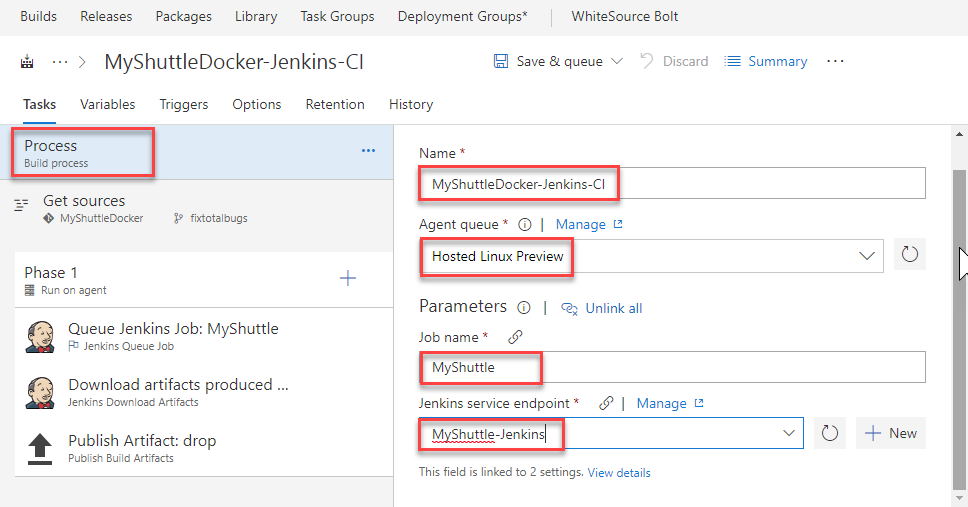 -->

1. Next, select the **Get Sources** step. Since Jenkins is being used for the build, there is no need to download the source code to the build agent. To skip syncing with the agent, select **Don't sync sources** option.

    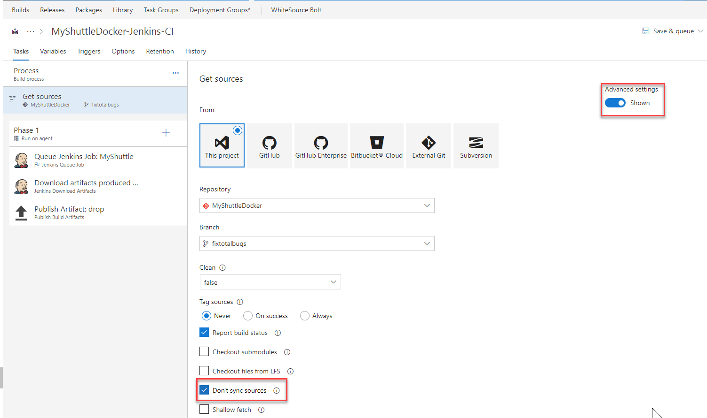

1. Next, select the **Queue Jenkins Job** step. This task queues the job on the Jenkins server. Make sure that the services endpoint and the job names are correct. The **Capture console output** and the **Capture pipeline output** options available at this step will be selected.

    The **Capture console output and wait for completion** option, when selected, will capture the output of the Jenkins build console when the Azure build pipeline runs. The build will wait until the Jenkins Job is completed. The **Capture pipeline output and wait for pipeline completion** option is very similar but applies to Jenkins pipelines (a build that has more than one job nested together).

     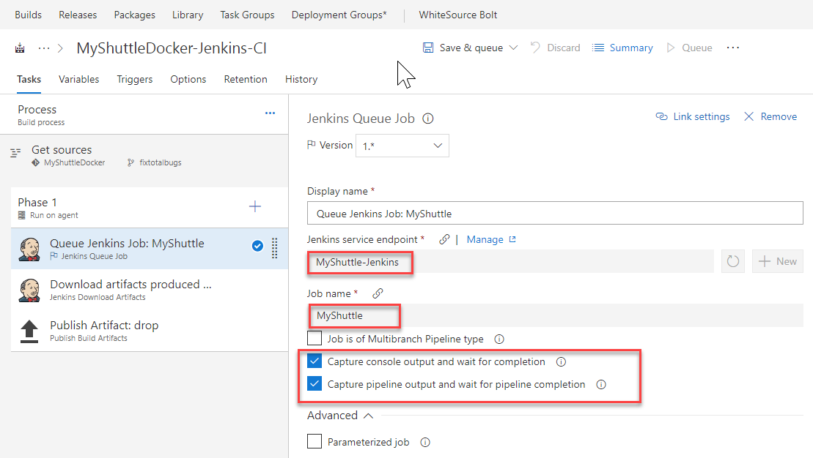

1. The **Jenkins Download Artifacts** task will download the build artifacts from the Jenkins job to the staging directory.

    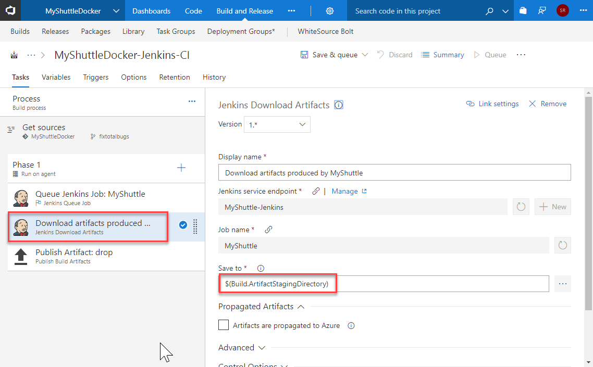

1. The **Publish Artifact drop** will publish to Azure Pipelines.

1. Click on **Save & queue** button to save and initiate a new build.

## Linking the build artifact for deployment in a CD pipeline    

Next, you will configure an Azure CD pipeline to fetch and deploy the artifacts produced by the build. Since the deployment is being done to Azure, an endpoint to Azure will be configured. An endpoint to Jenkins server will also be configured, if not configured earlier.

1. After the endpoint creation, go to the **Releases** tab in **Azure Pipelines**. Click **+New**  and select **New release pipeline** to create a new release pipeline.

1. Select the **Azure App Service Deployment** template. 

   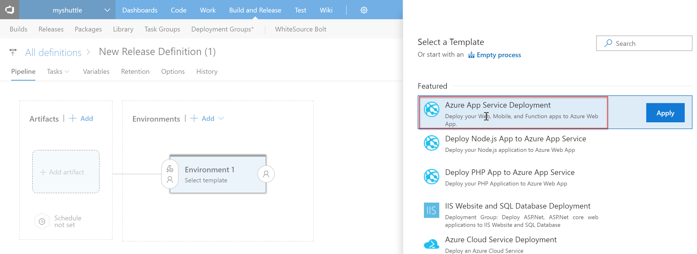

1. The default environment for deployment will be named as **Dev**

   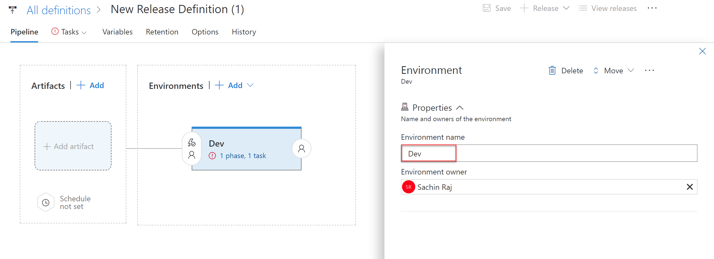

1. In the **Artifacts** section in the **Pipeline** tab, choose the **+ Add** link to select your build artifact.

    1. If you have used the first approach, select **Jenkins** as the *Source type*, select the Jenkins endpoint configured earlier and provide **MyShuttle** for the *Source(Job)*, choose the **Default version** as *Latest*. The Source(Job) should map to the project name configured in Jenkins.

        If the Jenkins server and the source location is configured correctly, once the publishing of the artifacts is completed, a message with the output file name **myshuttledev.war** will be displayed.

        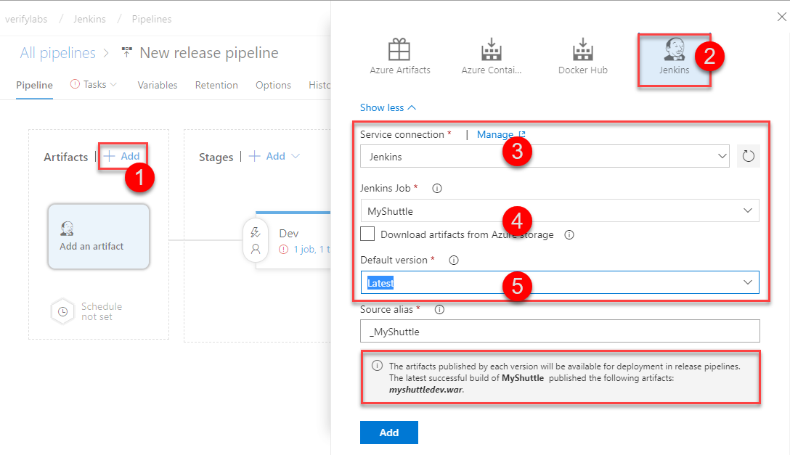

   1. Otherwise, point this to the Azure CI build pipeline from which the Jenkins CI is executed.  

1. Now, the artifact is linked for deployment. Please refer the [Deploying a MySQL Backed Tomcat app on Azure Web App](../tomcat/) lab for deploying the WAR file to Azure App Service.
