[Jenkins](https://jenkins.io/) is a very popular Java-based open source continuous integration (CI) server that allows teams to continuously build applications across platforms.

Visual Studio Team Services (VSTS) includes Team Build, a native CI build server that allows compilation of applications on Windows, Linux and Mac platforms. However, it also integrates well with Jenkins for teams who already use or prefer to use Jenkins for CI.

There are two ways to integrate VSTS with Jenkins

* One way is to completely replace the VSTS Build with Jenkins. This involves the configuration of a CI pipeline in Jenkins and a web hook in VSTS that invokes the CI process when source code is pushed by any member to a repository or a branch. The VSTS Release Management will be configured to connect to the Jenkins server through the configured Service Endpoint to fetch the compiled artifacts for the deployment.

* The alternate way is to use Jenkins and Team Build together. In this approach, a Jenkins build will be nested within the VSTS build. A build definition will be configured in the VSTS with a **Jenkins** task to queue a job in Jenkins that downloads the artifacts produced by the job and publish it to the VSTS or any shared folder from where it can be picked by the Release Management. This approach has multiple benefits:

    1. End-to-end traceability from work item to source code to build and release
    1. Triggering of a Continuous Deployment (CD) when the build is completed successfully
    1. Execution of the build as part of the branching strategy

This lab covers both the approaches and the following tasks will be performed

* Provision Jenkins on Azure VM using an Azure Marketplace Jenkins Template
* Configure Jenkins to work with Maven and VSTS
* Create a build definition in Jenkins
* Configure VSTS to integrate with Jenkins
* Setup Release Management in VSTS to deploy build artifacts from Jenkins

## Pre-requisites

1. An active Microsoft Azure account
1. An active **VSTS** account
1. A [Personal Access Token (PAT)](https://docs.microsoft.com/en-us/vsts/accounts/use-personal-access-tokens-to-authenticate)
1. [Putty](http://www.putty.org/), a free SSH and Telnet client
1. **Docker Integration** extension installed and enabled for the VSTS account. This step can be performed later while using the VSTS Demo Generator.

## Setting up the VSTS project

1. Use the [VSTS Demo Generator](https://vstsdemogenerator.azurewebsites.net/?name=MyShuttleDocker&templateid=77373) to provision a team project on the VSTS account

    
1. Select **MyShuttleDocker** for the template

    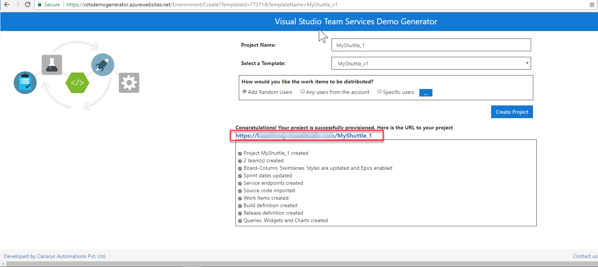

    

## Setting up the Jenkins VM

1. To configure Jenkins, the Jenkins VM image available on the Azure MarketPlace will be used. This will install the latest stable Jenkins version on a Ubuntu Linux VM along with the tools and plugins configured to work with Azure.

[](https://portal.azure.com/#create/azure-oss.jenkinsjenkins)

1. Once the Jenkins VM is provisioned, click on the **Connect** button and make a note of the \<username> and the \<ip address>. This information will be required toconnect to the Jenkins VM from ***Putty***

    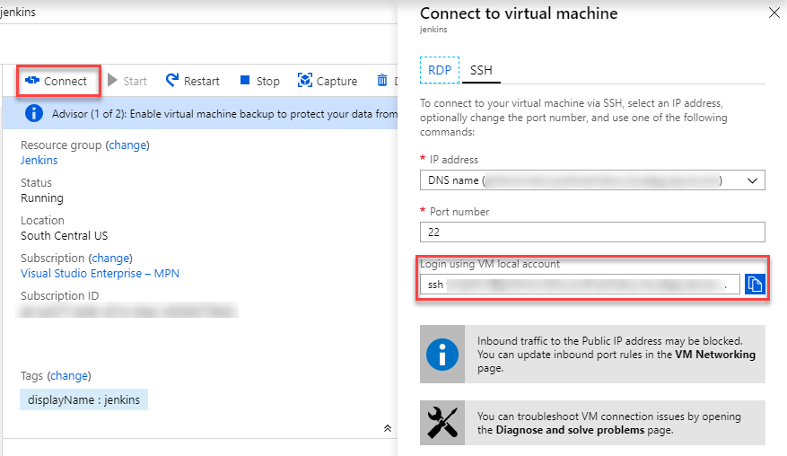

1. Jenkins, by default, listens on port 8080 using HTTP. To configure a secure HTTPS connection, an SSL certificate will be required. If HTTPS communication is not being configured, the best way to ensure the sign-in credentials are not leaked due to a "Man-in-the-middle" attack is by logging-in using the SSH tunneling. An SSH tunnel is an encrypted tunnel created through a SSH protocol connection, that can be used to transfer unencrypted traffic over an unsecured network. To initiate a SSH tunnel, the following command needs to be run from a Command Prompt.

    ````cmd
    putty.exe -ssh -L 8080:localhost:8080 <username>@<ip address>
    ````
    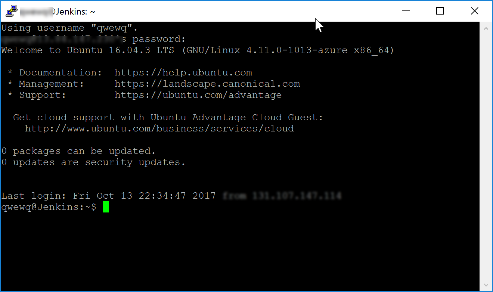

    

1. Login with the user name and password that was provided during the provisioning of the VM.

1. Once the connection is successful, open a browser on the host machine and navigate to the URL [http://localhost:8080](http://localhost:8080). The **Getting Started** page for Jenkins will be displayed.

1. The initial password needs to be provided in the **Getting Started** screen to unlock Jenkins. For security reasons, Jenkins will generate a password and save it in a file on the server.

   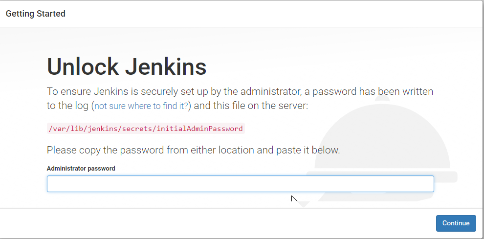

   

1. Return to the **Putty** terminal and type the following command to open the log file that contains the password. Copy the password.
    >sudo vi /var/lib/jenkins/secrets/initialAdminPassword

    *You can double click on the line and use **CTRL+C** to copy the text and place it in the clipboard. Press **ESC and then :q!** to exit the vi editor without saving the file*

1. Return to the browser, paste the copied text and click the **Continue** button.

    

    Jenkins has a vast ecosystem with a strong and active open source community users contributing hundreds of useful plugins. While configuring Jenkins, you can either install the most commonly used plugins or pick the plugins that you want.

1. The Maven plugin is also required but will be installed later. For now, we will go with the suggested plugins. Click on the **Install suggested plugins** to initiate the configuration.

    

1. You will need to create a new *Admin* user for Jenkins. Provide a user name and password and click on the **Continue** button.

    

1. Jenkins will now be ready for use. Click on the **Start using Jenkins** button to start using it.

    

## Installing and Configuring Maven

 Starting with Jenkins version 2, Maven plugin is not installed by default. You will need to install this manually

1. Select the **Manage Jenkins** option on the main page of the Jenkins portal. This will take you to the Manage Jenkins page, the centralized one-stop-shop for all the Jenkins configuration. From this screen, you can configure the Jenkins server, install and upgrade plugins, keep track of system load, manage distributed build servers, and more!

1. Select the **Manage Plugins** option

    

1. Select the **Available** tab and search for **maven-plugin** in the filter box

1. Select the **Maven Integration Plugin** option and click on the **Install without restart** button to install the plugin.

    

1. Once the plugin is installed, select the **Manage Jenkins** option and then select **Global Tool Configuration** option.

    

1. Jenkins provides great out-of-the-box support for Maven. Since the Maven is not yet installed, it can be manually installed by extracting the ***tar*** file located in a shared folder. Alternatively, you can let Jenkins do all the hard work and download Maven for you. When the **Install automatically** option is selected, Jenkins will download and install Maven from the Apache website when a build job requires it, first time.

    We will install Maven version 3.5, the latest version at the time the lab is written

    

1. Click on the **Apply** button and then click the **Back to Dashboard** option to return to the home page.

## Creating a new build job

1. From Jenkins home page, click on the **New Item** option. Provide a name for the build definition, and select the **Maven project** and click **OK** to save

   

1. Now scroll down to the **Source code Management** section. Select the **Git** option and provide the clone URL of the VSTS Git repo. It would be typically in the format **http://\<your account name>.visualstudio.com/
 \<your project name>/_git/MyShuttle**

   

   

   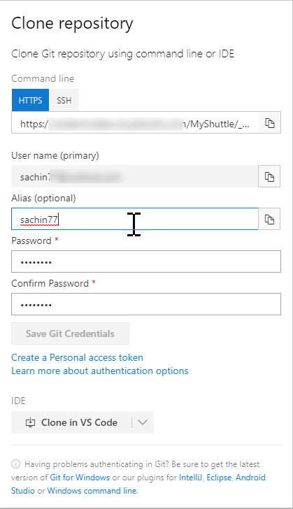

1. Select **Add \| Jenkins** to add a new credential. Enter the user name and password created in the previous step and click **Add** to close the wizard

    

1. Select the credential from the drop-down. The error message should disappear now

   

1. The source code for this application has both unit tests and UI tests. We will include the unit tests but skip the UI tests from running now.

1. Scroll down to the **Build** section. Enter the following text in the **Goals and Options** field

   >package -Dtest=FaresTest,SimpleTest

1. Click **Save** to navigate to the main page of the project you just created

   

1. The last configuration that we will do for this lab is to add a *Post-build* action to publish the artifacts. Scroll down to **Post-Build Actions**  section, click **Add post-build action** and select **Archive the artifacts**

   

1. Enter  **target/*.war** in the text box. Click **Save** to save the settings and return to the project page

   

1. We have completed all the necessary configuration and Select **Build Now** to start an Ad-hoc build

1. You will notice the build progress just below the left side navigation menu

   

1. You can select the build number to get into the details of the build including the build artifacts, in this case, the WAR file for the project.

   

   

1. Select the **Test Results** links if you want to see the results of the unit tests that were included in the build definition.

## Approach 1: Running Jenkins without VSTS Build

In this section, we will cover the first approach. We will run Jenkins separately. We will configure a service hook in VSTS to trigger a Jenkins build whenever a code is pushed to a particular branch.

1. Go to your VSTS project page and navigate to the **Admin** \| **Service Hooks** page

    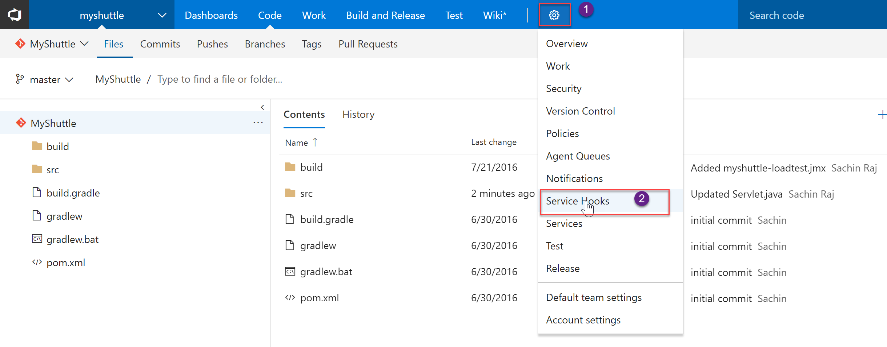

1. Select **Create subscription** button

1. In the *New subscriptions dialog* select **Jenkins** and click **Next**

   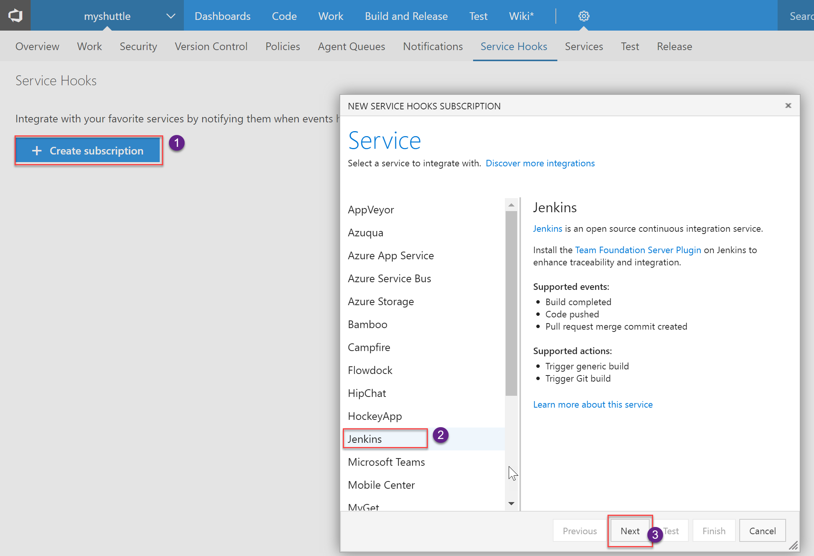

1. Select **Code pushed**  for the **Trigger on this of type event**

1. Choose the repository and branch and Select **Next**

   

1. In the next page, select **Trigger generic build** for the perform action field

1. Enter the URL of the Jenkins server in **http://{ip address or the host name}**  format

1. Enter the **User name** and **Password** that you have setup for Jenkins

1. Select **Test** to check the settings. If the settings are correct, click **Finish** to save and exit

   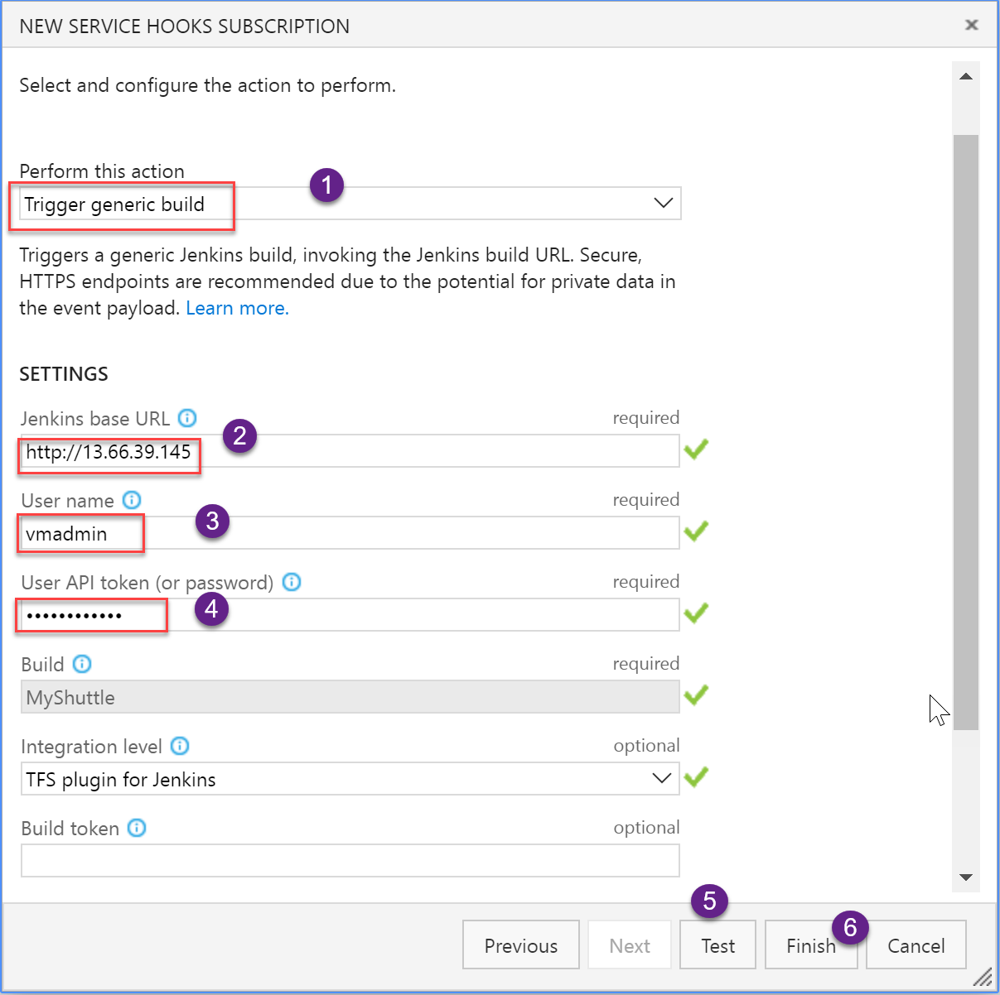

Now you can try making a change and commit your code. Upon commit,VSTS will notify Jenkins to initiate a new build.

## Approach 2: Wrapping Jenkins Job within VSTS Build

We will cover the second approach in this section. We will wrap the Jenkins job within a Team Build. The key benefit taking this approach is the end to end traceability from work item to code to build and release can be maintained

First, we will need to create an endpoint to the Jenkins server

1. From the **Admin \| Services** tab, select the **New Service Endpoint \| Jenkins** button to create a new endpoint

1. Provide the server URL and the user name and password to connect to the server. The server URL is in http://[server IP address or DNS name] format. Click **Verify Connection** to validate the entries and to confirm that VSTS is able to reach the Jenkins server

   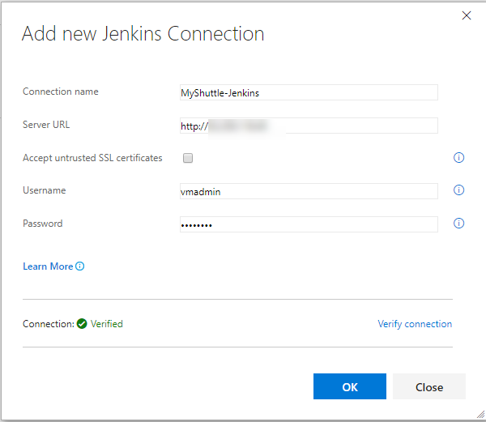

1. Select **Builds** from the **Build and Release** help and select **+New** to create a new build Definition**

1. You will notice that there is a **Jenkins** template out-of-the-box. Select the template and click **Apply**

    

1. In the *Build process* settings, select the Jenkins service endpoint that you created and enter **MyShuttle** for Jenkins Job Name.

    

1. Next, select the **Get Sources** task. Since, we  are only triggering a Jenkins job from the build, there is no need to download the code to the VSTS build agent. Select **Advanced Options** and check the **Don't sync sources** option

    

1. Next, select the **Queue Jenkins Job** task. This task queues the job on the Jenkins server. Make sure that the services endpoint and the job name are correct.  You will see the two options checked- leave them as-is.

     

    

1. When the build is complete, the **Jenkins Download Artifacts** task will download the build artifacts produced by the Jenkins job to the staging directory

    

1. Finally, we will publish the artifacts to VSTS.

1. Click **Save & queue** to save the build definition and start a new build.

## Deploying Jenkins Artifacts with Release Management

Next, we will configure Visual Studio VSTS Release Management to fetch and deploy the artifacts produced by the build.

1. As we are deploying to Azure, we will need to create an endpoint to Azure. You should also create an endpoint to Jenkins, if you have not done it before

1. After you have created the endpoints, select the **Build & Release** hub and select **+ Create a new Release definition** to start creating a new release definition

1. We will use the **Azure App Service Deployment** template as we are trying to publish a web application

   

1. We will name the default environment as **Dev**

   

1. We will link this release definition to the MyShuttle build on Jenkins. Select **+Add** to add an artifact

1. Select **Jenkins** for the *Source type*. Select the Jenkins endpoint you created above and enter **MyShuttle** for the *Source(Job)* - Note this should map to the project name that you have configured in Jenkins

1. If the Jenkins server and the source location is configured correctly, once the publishing of the artifacts is completed, a message with the output file name **myshuttledev.war** will be displayed

   

1. You are now ready to deploy!

1. The output .war file can now be deployed on Azure. For details on the deployment, refer to the [Deploying a MySQL database backed Java app to Tomcat on Azure with VSTS](../tomcat/)

## Additional Sections

### Logging into Jenkins with the default credentials

1. In case the initial admin was not configured for Jenkins during the setup, the default user **admin** can be used to login to Jenkins. The admin password will be the content from the password file created automatically by Jenkins stored in the path `\var\lib\jenkins\secrets\initialAdminPassword`

1. To change password, click on the user name on the top-right corner. Click the **Configure** option, scroll down to the **password** section to specify a new password and then click the **Save** button.

### Installing the Git Plugin

1. Navigate to the home page of the Jenkins portal, click on the **Manage Jenkins** option and then click on the **Manage Plugins** option

    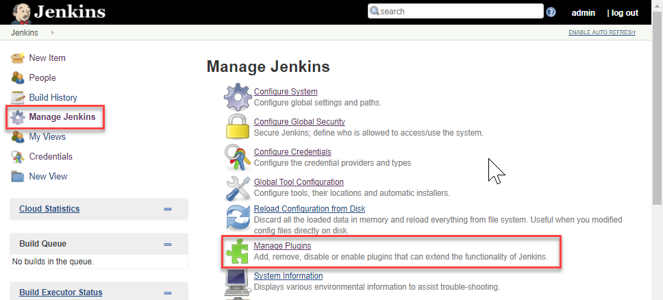

1. Select the **Available** tab.

1. Type **Git plugin** in the filter textbox

1. Select **Git plugin** in the search list and select **Install without Restart**

### Installing VSTS Private agent

1. Navigate to the home page of VSTS team project and select the **Admin**|**Agent Queues** option

1. In the Agents for pool Default section, click on the **Download agent** button.

    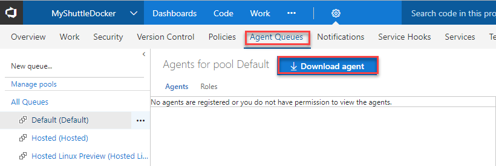

1. If the page is being accessed from the VM, the selected tab will default to **Linux**. Otherwise, select the **Linux** tab.

1. Click on the **Download** button to initiate the agent download. The downloaded file gets typically saved in the *Downloads* folder

    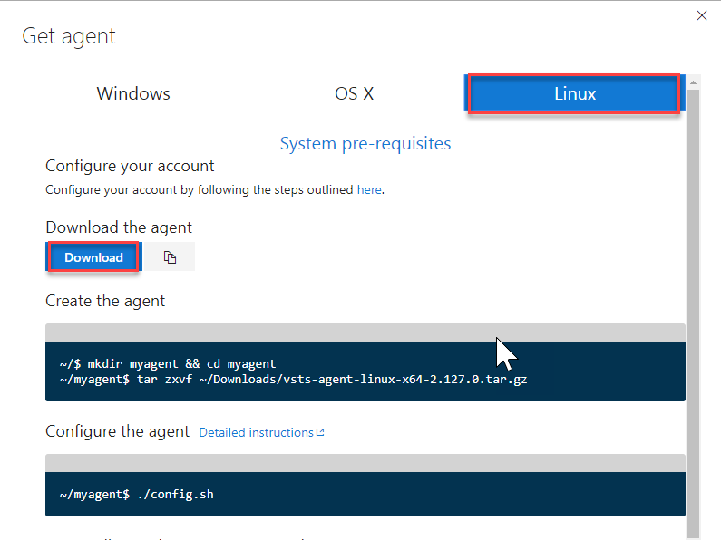

1. Open a terminal window and enter the following commands one-by-one

    ````cmd
    mkdir vstsagent
    cd vstsagent
    tar -zxvf ../Downloads/vsts-agent-linux-x64-2.126.0.tar.gz
    ````
1. Once the files are extracted, run `./config.sh` to configure the agent. The VSTS URL and the PAT will need to be provided during the configuration.

1. After the configuration is completed, start the agent by running the following command `./run.sh`