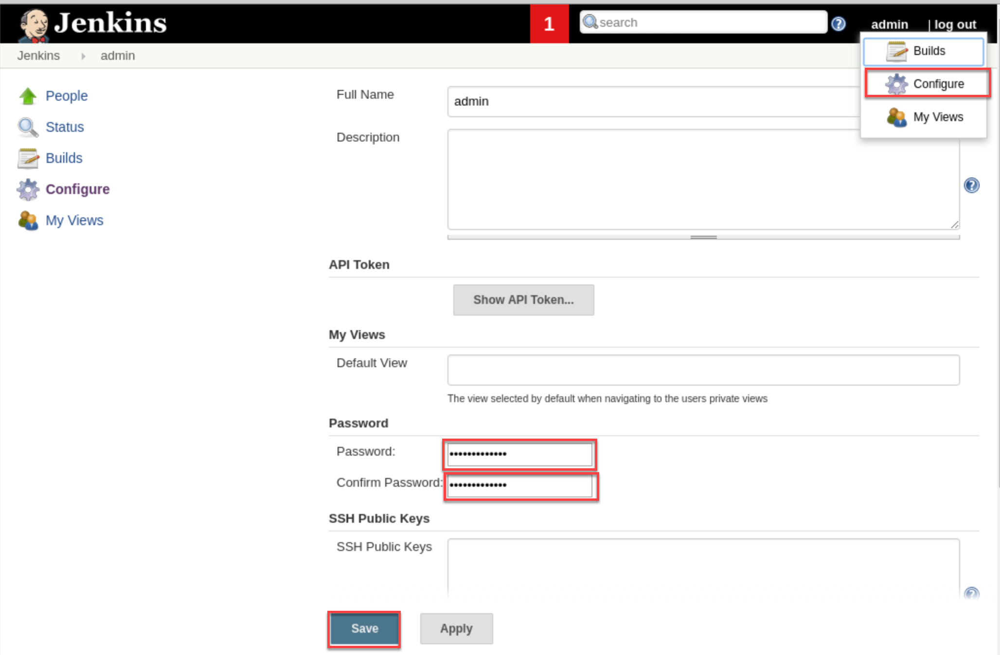

Last updated : {{ "now" | date: "%b %d,%Y" }}

## Overview

[Jenkins](https://jenkins.io/){:target="_blank"} is a very popular Java-based open source continuous integration (CI) server that allows teams to continuously build applications across platforms.

Visual Studio Team Services (VSTS) includes Team Build, a native CI build server that allows compilation of applications on Windows, Linux and Mac platforms. However, it also integrates well with Jenkins for teams who already use or prefer to use Jenkins for CI.

There are two ways to integrate VSTS with Jenkins

* One way is to completely **replace the VSTS Build with Jenkins**. This involves the configuration of a CI pipeline in Jenkins and a web hook in VSTS that invokes the CI process when source code is pushed by any member to a repository or a branch. The VSTS Release Management will be configured to connect to the Jenkins server through the configured Service Endpoint to fetch the compiled artifacts for the deployment.

* The alternate way is to **use Jenkins and Team Build together**. In this approach, a Jenkins build will be nested within the VSTS build. A build definition will be configured in the VSTS with a **Jenkins** task to queue a job in Jenkins that downloads the artifacts produced by the job and publish it to the VSTS or any shared folder. The VSTS Release Management will pick these build artifacts for deployment.

While there are pros and cons with both the approaches, the latter approach has multiple benefits:

 1. End-to-end traceability from work item to source code to build and release
 1. Triggering of a Continuous Deployment (CD) when the build is completed successfully
 1. Execution of the build as part of the branching strategy

### What's covered in this lab

This lab covers both the approaches and the following tasks will be performed

* Provision Jenkins on Azure VM using a Jenkins Template available on the Azure Marketplace
* Configure Jenkins to work with Maven and VSTS
* Create a build definition in Jenkins
* Configure VSTS to integrate with Jenkins
* Configure Release Management in VSTS to deploy the build artifacts from Jenkins

### Prerequisites for the lab

1. **Microsoft Azure Account**: You will need a valid and active Azure account for the Azure labs. If you do not have one, you can sign up for a [free trial](https://azure.microsoft.com/en-us/free/){:target="_blank"}

    * If you are an active Visual Studio Subscriber, you are entitled for a $50-$150 Azure credit per month. You can refer to this [link](https://azure.microsoft.com/en-us/pricing/member-offers/msdn-benefits-details/){:target="_blank"} to find out more information about this including how to activate and start using your monthly Azure credit.

    * If you are not a Visual Studio Subscriber, you can sign up for the FREE [Visual Studio Dev Essentials](https://www.visualstudio.com/dev-essentials/){:target="_blank"} program to create a **Azure free account** (includes 1 year of free services, $200 for 1st month).

1. You will need a **Visual Studio Team Services Account**. If you do not have one, you can sign up for free [here](https://www.visualstudio.com/products/visual-studio-team-services-vs){:target="_blank"}

1. You will need a **Personal Access Token** to set up your project using the **VSTS Demo Generator**. Please see this [article](https://docs.microsoft.com/en-us/vsts/accounts/use-personal-access-tokens-to-authenticate){:target="_blank"} for instructions to create your token.

    
    
1. [Putty](http://www.putty.org/){:target="_blank"}, a free SSH and Telnet client

1. **Docker Integration** extension installed and configured for the VSTS account. *This step can be performed later while using the VSTS Demo Generator*.

## Reference Architecture


Read the complete specifications at [https://docs.microsoft.com/en-us/azure/architecture/reference-architectures/jenkins/images/jenkins-server.png](https://docs.microsoft.com/en-us/azure/architecture/reference-architectures/jenkins/images/jenkins-server.png){:target="_blank"}

## Setting up the VSTS team project

1. Use the [VSTS Demo Generator](https://vstsdemogenerator.azurewebsites.net/?name=MyShuttleDocker&templateid=77373){:target="_blank"} to provision the MyShuttleDocker sample project on to your VSTS account

   > **VSTS Demo Generator** helps you create team projects on your VSTS account with sample content that include source code, work items,iterations, service endpoints, build and release definitions based on the template you choose during the configuration. 

    

1. Provide a project name and click **Create Project**. If the Docker Integration extension is not installed,the Click Project would not be available until the extension is installed and enabled on the account. Click the on the extension name to install the extension from the marketplace

    

    > Using the VSTS Demo Generator link will automatically select the MyShuttleDocker template in the demo generator for the team project creation. To work with other team project templates, use this link instead:  [https://vstsdemogenerator.azurewebsites.net/](https://vstsdemogenerator.azurewebsites.net/){:target="_blank"}

## Setting up the Jenkins VM

1. To configure Jenkins, the Jenkins VM image available on the Azure MarketPlace will be used. This will install the latest stable Jenkins version on a Ubuntu Linux VM along with the tools and plugins configured to work with Azure. Click on the **Deploy to Azure** button below to get started.

   [](https://portal.azure.com/#create/azure-oss.jenkinsjenkins){:target="_blank"}

1. Once the Jenkins VM is provisioned, click on the **Connect** button and make a note of the `username` and the `ip address`. This information will be required to connect to the Jenkins VM from ***Putty***

    

    

1. To initiate a SSH tunnel, the following command needs to be run from a Command Prompt.

   ```cmd
   putty.exe -ssh -L 8080:localhost:8080 <username>@<ip address>
   ```

   

   > To run the above command, either the Putty.exe needs to be placed in the path selected in the Command Prompt or the full path of the Putty.exe need to be provided in the command.

1. Login with the user name and password that was provided during the provisioning of the Jenkins VM.

1. Once the connection is successful, open a browser on the host machine and navigate to the URL [http://localhost:8080](http://localhost:8080). The **Getting Started** page for Jenkins will be displayed.

1. The initial password needs to be provided in the **Getting Started** screen to unlock Jenkins. For security reasons, Jenkins will generate a password and save it in a file on the server.

    

   
  
1. Return to the **Putty** terminal and type the following command to open the password file and copy the password. Press the **Esc** button and then type **:q!** at the prompt to exit the vi editor without saving the file.

    `sudo vi /var/lib/jenkins/secrets/initialAdminPassword`

    > You can double click on the password text and use **CTRL+C** to copy the text and place it in the clipboard

1. Return to the browser, paste the copied text in the Administrator password text box and click on the **Continue** button.

    

    > Jenkins has a vast ecosystem with a strong and active open source community users contributing hundreds of useful plugins. While configuring Jenkins, choose between installing the most commonly used plugins or selected plugins.

1. The Maven plugin is also required for the lab but will be installed later. Click on the **Install suggested plugins** option to initiate the configuration.

    

1. To work with Jenkins, a new `Admin` user needs to be created. Provide the *User name*, *Password*, *Full name* and *Email address* in the **Getting Started** screen and then click on the **Save and Finish** button.

    

1. Jenkins will now be ready for use. Click on the **Start using Jenkins** button to start using it.

    

## Installing and Configuring Maven



1. Click the **Manage Jenkins** option on the Jenkins home page to navigate to the **Manage Jenkins** screen, the centralized one-stop-shop for all the Jenkins configuration. From this screen, the configuration of the Jenkins server, the installation and upgrades of plugins, keeping track of system load, managing distributed build servers can be managed.

1. Click on the **Manage Plugins** option, select the **Available** tab and search for `maven-plugin` in the filter box.

    

1. Select the **Maven Integration Plugin** and click on the **Install without restart** button to install the plugin.

    

1. Once the plugin is installed, click on the **Global Tool Configuration** option.

    

   > Jenkins provides great out-of-the-box support for Maven. Since the Maven is not yet installed, it can be manually installed by extracting the `tar` file located in a shared folder. Alternatively, when the **Install automatically** option is selected in the **Global Tool Configuration** screen, Jenkins will download and install Maven from the Apache website when a build job requires it.

1. To install Maven, select the **Install automatically** option and click on the **Apply** button.

   > The latest version of Maven at the time of writing the lab was 3.5

    

1. Click on the **Back to Dashboard** button to return to the home page.

## Creating a new build job in Jenkins

1. From the Jenkins home page, click on the **New Item** option. Provide a name for the build definition, select the **Maven project** and click on the **OK** button.

   

1. Now scroll down to the **Source code Management** section. Select the **Git** option and provide the clone URL of the VSTS Git repo in the format

   `http://{your account name}.visualstudio.com/{team project name}/_git/MyShuttle`

   

   

   The VSTS Git repos are private and requires user credentials to be provided to access the repository. If the Git credentials is not set already, it can be done from the VSTS.

1. Go to your VSTS project page and select the **Clone** option, provide the `User name` and `Password` and then click on the **OK** button.

   

1. Click on the **Add \| Jenkins** option to add a new credential. Provide the `User name` and `Password` created earlier and click the **Add** button to close the wizard

    

1. Select the credential created in the previous step from the drop-down. The error message should disappear now.

   

   >The source code for this application has both unit tests and UI tests. Only the unit tests will be included in this lab.

1. Scroll down to the **Build** section and provide the text `package -Dtest=FaresTest,SimpleTest` in the **Goals and options** field. Click on the **Save** button to navigate to the home page of the project.

   

1. To configure the Post build actions in the **Post-Build Actions** section, click on the **Add post-build action** button and choose the **Archive the artifacts** option.

   

1. Enter  **target/*.war** in the **Files to archive** text box. Click on the **Save** button to save the settings and return to the project page.

   

1. Since the configuration is now completed, click on the **Build Now** option to initiate an Ad-hoc build.

   > The build progress will be displayed on the left pane in the **Build History** section

   

1. To view the build details and the list of build artifacts, click on the build number displayed in the **Module Builds** section.

   

   

1. Click on the **Test Results** option to view the results of the unit tests that were included in the build definition.

## Approach 1: Using Jenkins without the VSTS Build

In this section, the Jenkins will be configured to run separately. A service hook will be configured in VSTS to trigger a Jenkins build whenever source code changes are pushed to a particular branch.

1. To configure the service hook, navigate to the VSTS team project page, click on the Settings icon and choose the **Service Hooks** option

    

1. On the **Service Hooks** screen, click on the **Create subscription** button. In the *New Service Hook Subscriptions* screen, click on the **Jenkins** option and then click on the **Next** button.

   

1. Select the **Code pushed** option for the **Trigger on this type of event** field, select the MyShuttleDocker as the **Repository**, master as **Branch** and then click on the **Next** button.

   

1. Provide the following details in the **Select and configure the action to perform** screen
   1. In the **Perform this action** field, select the **Trigger generic build** option

   1. In the **Jenkins base URL** field, Provide the URL of the Jenkins server in the  format `http://{ip address or the host name}`

   1. In the **User name** and **User API token (or password)** fields, provide the user name and password already configured for Jenkins

1. Click on the **Test** button to validate the configuration and then click on the **Finish** button to complete the subscription.

   

The VSTS will now automatically notify Jenkins to initiate a new build whenever any source code changes are committed on the repository.

## Approach 2: Wrapping Jenkins Job within the VSTS Build

In this section, Jenkins will be included as a job within a VSTS Team Build. The key benefit of this approach is the end-to-end traceability from the work items to the source code to the build and release provided by the VSTS.

To begin, an endpoint to the Jenkins Server for communication with VSTS will be configured.

1. In the **Admin \| Services** section, click on the **New Service Endpoint \| Jenkins** option to create a new endpoint.

1. In the **Add new Jenkins Connection** screen, provide a connection name, Jenkins server URL in the format `http://[server IP address or DNS name]` and Jenkins user name with password. Click on the **Verify Connection** button to validate the configuration and then click on the **Ok** button.

   

   The next step would be to configure the build definition.

1. Click on the **Build and Release** hub, select the Builds section and click on the **+New** button to create a new build Definition

1. In the **Choose a template** window, select the out-of-the-box **Jenkins** template and click on the **Apply** button

    

1. In the *Process* step, provide a name for the definition, select Hosted Linux Preview as the Agent Queue, provide **MyShuttle** as the Job name and then select the Jenkins service endpoint created earlier.

    

1. Next, select the **Get Sources** step. Since Jenkins is being used for the build, there is no need to download the source code to the VSTS build agent. Enable the **Advanced settings** option and select the **Don't sync sources** option.

    

1. Next, select the **Queue Jenkins Job** step. This task queues the job on the Jenkins server. Make sure that the services endpoint and the job name are correct. The **Capture console output** and the **Capture pipeline output** options available at this step will be selected.

     

     >The **Capture console output and wait for completion** option, when selected, will capture the output of the Jenkins build console when the VSTS build runs. The build will wait until the Jenkins Job is completed. The **Capture pipeline output and wait for pipeline completion** option is very similar but applies to Jenkins pipelines (a build that has more than one job nested together).

1. The **Jenkins Download Artifacts** task will download the build artifacts from the Jenkins job to the staging directory

    

1. The **Publish Artifact drop** will publish to the VSTS.

1. Click on the **Save & queue** button to complete the build definition configuration and initiate a new build.

## Deploying Jenkins Artifacts with Release Management

The next step is to configure the VSTS Release Management to fetch and deploy the artifacts produced by the build.

1. Since the deployment is being done to Azure, an endpoint to Azure will be configured. An endpoint to Jenkins server will also be configured, if not configured earlier.

1. After the endpoint creation, click on the **Build & Release** hub and then select the **Releases** section. Click on the **+ Create a new Release definition** button to initiate a new release definition

1. Since a web application will be published to Azure, the **Azure App Service Deployment** template will be used for the configuration.

   

1. The default environment for deployment will be named as **Dev**

   

1. To link the release definition with the MyShuttle build on Jenkins, click on the **+Add** button to add an artifact

1. In the **Add artifact** screen, Select **Jenkins** as the *Source type*, select the Jenkins endpoint configured earlier and provide **MyShuttle** for the *Source(Job)*

   >The Source(Job) should map to the project name configured in Jenkins

1. If the Jenkins server and the source location is configured correctly, once the publishing of the artifacts is completed, a message with the output file name **myshuttledev.war** will be displayed.

   

1. The output .war file can now be deployed on Azure. For details on the deployment, refer to the [Deploying a dockerized Java app on Azure Web App](../dockerjava/){:target="_blank"}

## Additional Tasks

### Logging into Jenkins with the default credentials

1. In case the initial admin was not configured for Jenkins during the setup, the default user **admin** can be used to login to Jenkins.

1. The admin password will be the content from the password file created automatically by Jenkins stored in the path `\var\lib\jenkins\secrets\initialAdminPassword`

1. From a terminal window, type `sudo vi /var/lib/jenkins/secrets/initialAdminPassword`to open the file. You can double click on the password text and use **CTRL+C** to copy the text and place it in the clipboard. To close the file without saving, press **ESC** and then **:q!** 

1. It is recommended that you change your password. After login, click on the user name on the top-right corner. Click the **Configure** option, scroll down to the **password** section to specify a new password and then click the **Save** button.

    

### Installing the Git Plugin

1. Navigate to the home page of the Jenkins portal, click on the **Manage Jenkins** option and then click on the **Manage Plugins** option

    

1. Select the **Available** tab.

1. Enter the words **Git plugin** in the filter textbox

1. Select the **Git plugin** in the search list and click on the **Install without Restart** button

### Installing VSTS Private agent

1. Navigate to the home page of VSTS team project and select the **Admin**->**Agent Queues** option

1. In the Agents for pool Default section, click on the **Download agent** button.

    

1. If the page is being accessed from a VM, the selected tab will default to **Linux**. Otherwise, select the **Linux** tab.

1. Click on the **Download** button to initiate the agent download. The downloaded file gets typically saved in the *Downloads* folder

    

1. Launch a terminal window and run the following commands in the sequence.
    ````cmd
    mkdir vstsagent
    cd vstsagent
    tar -zxvf ../Downloads/vsts-agent-linux-x64-2.126.0.tar.gz
    ````
1. Once the files are extracted, run the following command to configure the agent.
   > The VSTS URL and the PAT will be required during the configuration.

   ```cmd
   ./config.sh
   ```
1. After the configuration is completed, run the following command to start the agent.

   ```cmd
   ./run.sh
   ```