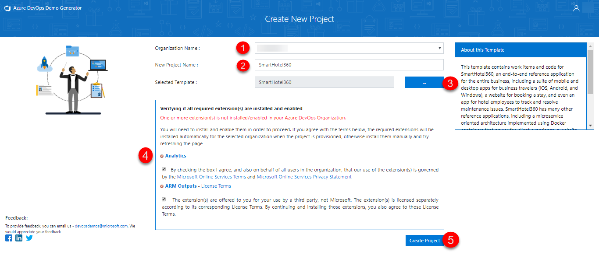
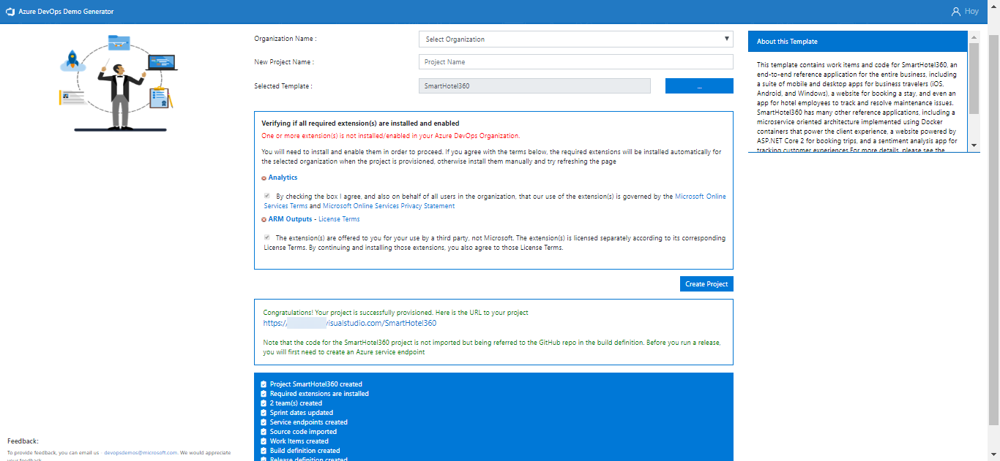

## Before you begin

Welcome! We are excited you want to learn how to integrate Azure DevOps with 3rd party tools. 

Before you start following the labs, you need to complete the below tasks.

## Prerequisites

1. **Microsoft Azure Account**: You will need a valid and active Azure account for the Azure labs. If you do not have one, you can sign up for a [free trial](https://azure.microsoft.com/en-us/free/){:target="_blank"}. 

    * If you are an active Visual Studio Subscriber, you are entitled for a $50-$150 credit per month. You can refer to this [link](https://azure.microsoft.com/en-us/pricing/member-offers/msdn-benefits-details/){:target="_blank"} to find out more information about this, including how to activate and start using your monthly Azure credit.

    * If you are not a Visual Studio Subscriber, you can sign up for the FREE [Visual Studio Dev Essentials](https://www.visualstudio.com/dev-essentials/){:target="_blank"} program to create an **Azure free account** (includes 1 year of free services, $200 for 1st month).

1. You will need an **Azure DevOps** account. If you do not have one, you can sign up for free [here](https://azure.microsoft.com/en-us/services/devops/){:target="_blank"}

## Setting up the Azure DevOps Project

**Azure DevOps Demo Generator** helps you create team projects on your Azure DevOps Organization with sample content that include source code, work items, iterations, service endpoints, build and release definitions based on the template you choose during the configuration.

Try the **Azure DevOps Demo Generator**  to experiment with different services and options in a personal, pre-configured sandbox by following the instructions below.

1. In the [Azure DevOps Demo Generator](https://azuredevopsdemogenerator.azurewebsites.net){:target="_blank"} page, Click **Sign In** and provide the appropriate credentials to sign into the account.
   
   

1. In the **Create New Project** page, 

   1. Choose the **Organization Name** 
   2. Provide a **New Project Name** 
   3. Click the *ellipsis* to choose a project template
   4. Click **accept terms** if any extensions are required to be installed and enabled
   5. Click **Create Project**.

    > If you are following a specific lab which has its own template, skip Step 3.  

    

1. Once team project is provisioned, click on the resulting URL to navigate to the team project.

   

