

### Author: Praneet Singh Solanki

## Overview
**Machine learning** is a data science technique that allows computers to use existing data to forecast future behaviours, outcomes, and trends. By using machine learning, computers learn without being explicitly programmed.

**Azure Machine Learning service** provides a cloud-based environment you can use to develop, train, test, deploy, manage, and track machine learning models. 

### What’s covered in this lab
In this lab, you will see
1. How to build the Continuous Integration and Continuous Delivery pipelines for a Machine Learning project with **Azure Pipelines**. 

We will be using the Azure DevOps project for build and release pipelines along with Azure ML services for ML/AI model management and operationalization. 

This template contains code and pipeline definition for a machine learning project demonstrating how to automate the end to end ML/AI project. The build pipelines include DevOps tasks for data sanity test, model training on different compute targets, model version management, model evaluation/model selection, model deployment as real-time web service, staged deployment to QA/prod, integration testing and functional testing.

### Before you begin

1. Refer the [Getting Started](../Setup/) page before you begin following the exercises.

1. Use the [Azure DevOps Demo Generator](https://azuredevopsdemogenerator.azurewebsites.net/?name=machinelearning) to provision the project on your Azure DevOps organization. This URL will automatically select **Azure Machine Learning** template in the demo generator. This template contains code and pipeline definition for a machine learning project demonstrating how to automate the end to end ML/AI project. 

### Exercise 1: Configure CI pipeline for ML/AI project

In this exercise, you will configure CI pipeline for your ML/AI project. This build pipeline includes DevOps tasks for data sanity test, model training on different compute targets, model version management, model evaluation/model selection etc.

1.  Navigate to **Pipeline > Builds**. Select **DevOps-for-AI-CI** and click **Edit**.

     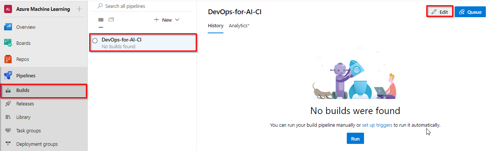

1. Your build pipeline will look like as below. 
   
     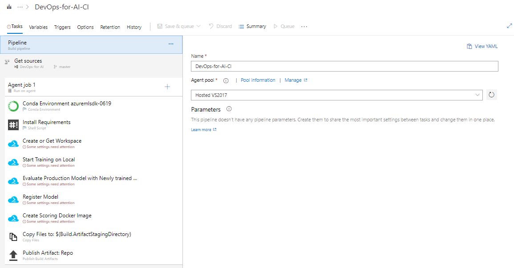

     In this pipeline [Conda Environment](https://docs.microsoft.com/en-us/azure/devops/pipelines/tasks/package/conda-environment?view=azdevops) task and **Install requirements** task are used to setup and prepare the Python environment to use it for subsequent build tasks.

1. Select **Create or Get Workspace** task. Select the Azure subscription from the drop-down list and click **Authorize** to configure Azure service connection. This task used here to create [Workspace](https://docs.microsoft.com/en-us/azure/machine-learning/service/concept-azure-machine-learning-architecture#workspace) for Azure Machine learning service.

    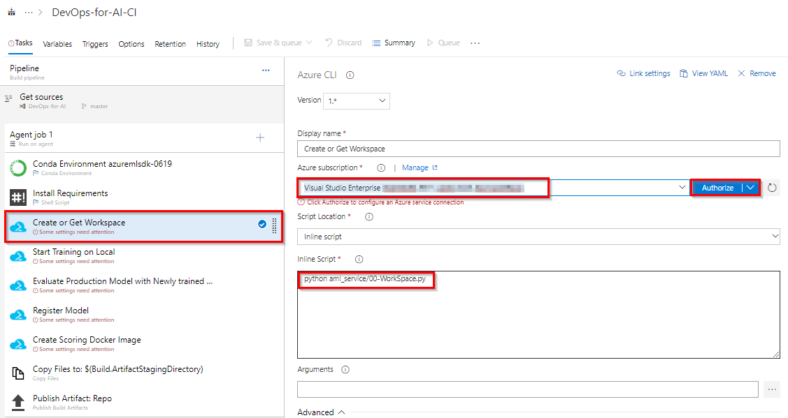

 1. Click all other tasks in the pipeline and select the same subscription. Once the tasks are updated with a subscription, **Save** the changes.
     
       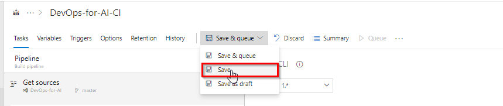

1. Select **Triggers** and make sure that CI is enabled.
      
      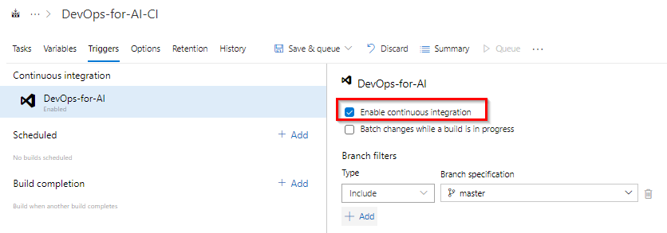

1. The steps performed in the CI pipeline are 

    - Prepare the python environment
    - Get or Create the workspace for AML service
    - Submit Training job on the remote DSVM / Local Python Env
    - Compare performance of different models and select the best
    - Register model to the workspace
    - Create Docker Image for Scoring Web service
    - Copy and Publish the Artifacts to Release Pipeline

### Exercise 2: Configure CD pipeline for ML/AI project
In this exercise, we will configure Release pipeline which will deploy the image created from the build pipeline to Azure Container Instance and Azure Kubernetes Services

1. Navigate to **Pipeline >> Releases**. Select **Deploy Web service** and click **Edit** pipeline. 

   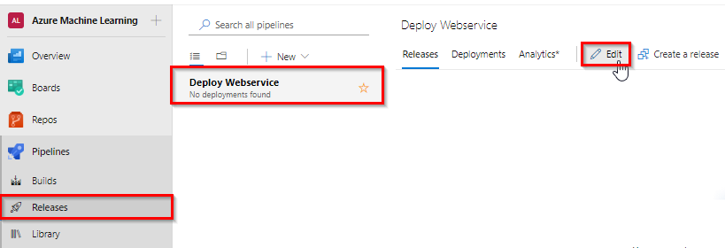

1. You will see release pipeline with two stages **QA** and **Prod**. Select **QA** stage and select **view stage tasks** to view the tasks in **QA** stage.
    
    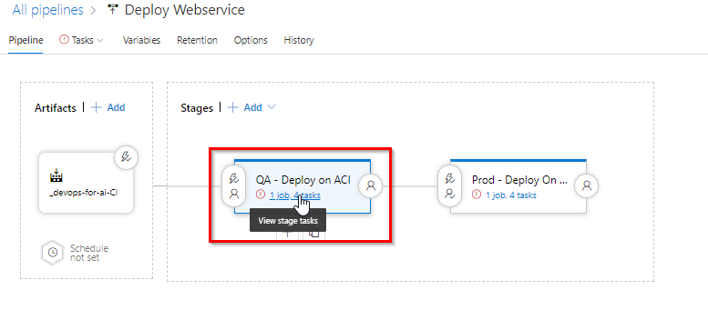

1. In **QA** stage [Conda Environment](https://docs.microsoft.com/en-us/azure/devops/pipelines/tasks/package/conda-environment?view=azdevops) task and **Install requirements** tasks are used to setup and prepare the Python environment to use it for subsequent tasks.
       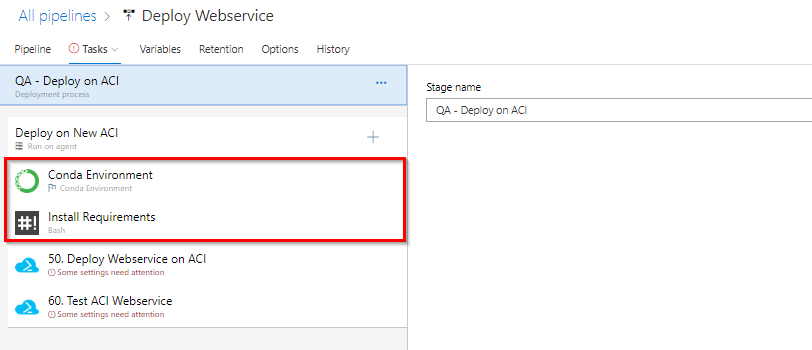

1. Select **Deploy Web service on ACI** task. Select Azure subscription details. This task creates ACI ([Azure Container Instance](https://azure.microsoft.com/en-in/services/container-instances/)) and deploys web service image created in Build Pipeline to ACI.

    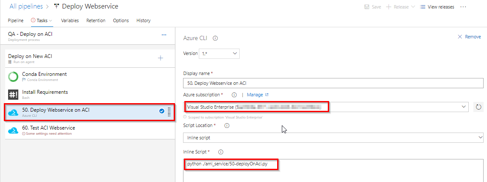

1. Select **Test ACI Web service** task. Update the Azure subscription details. This task is to test the scoring image deployed.

   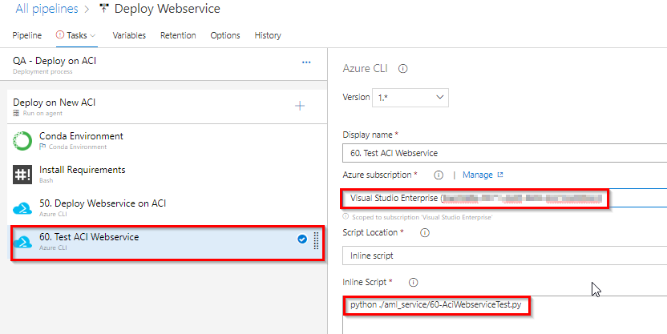

1. Click on **Tasks** on the top to switch to the **Prod** stage, update the subscription details for the two tasks in prod stage and click **Save** to save the changes.

    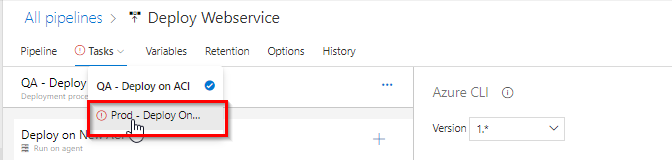

    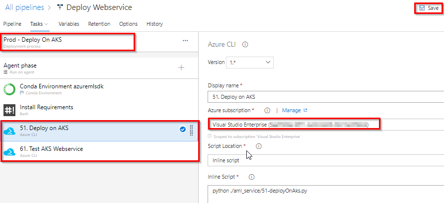

### Exercise 3: Update config file in the source code to trigger CI and CD

1. Navigate to **Repos**. Open **config.json** file from the folder **aml_config/**.

      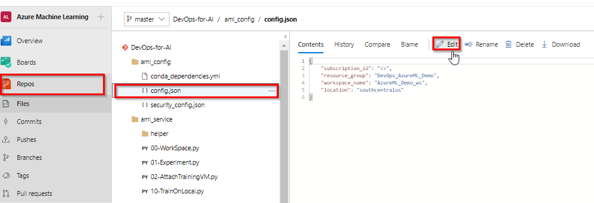

1. Update your Azure subscription ID in place of <>. If  required Change resource group name, AML workspace name and the location where you want to deploy your Azure ML service workspace. Click **Commit** to commit the changes.

      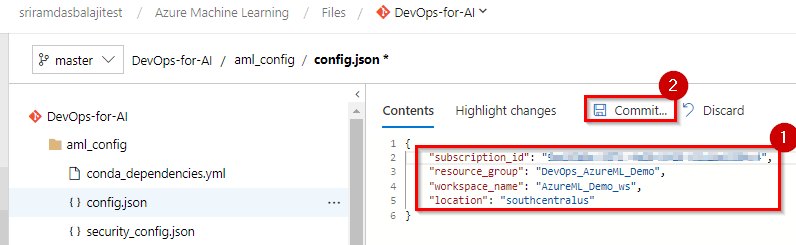

   > You can find the details of the code and scripts [here](https://github.com/praneetmsft/DevOpsForAI/blob/master/docs/code_description.md)

1. Since we have enabled in **CI trigger** a build will be queued automatically. Navigate to **Pipelines -->Builds** and you will see a build is queued. Open the build to see the progress.
Once the build is success a release will be queued automatically. Navigate to **Pipelines --> Releases** to see the release in progress.
  
   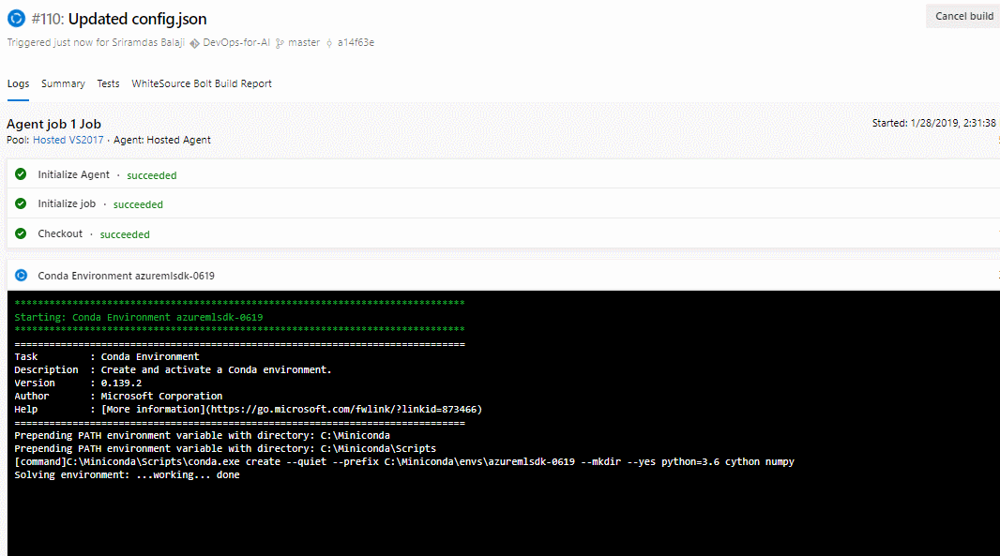

1. Now navigate to your Azure portal to view the resources provisioned and deployed by CI-CD pipelines.
   
    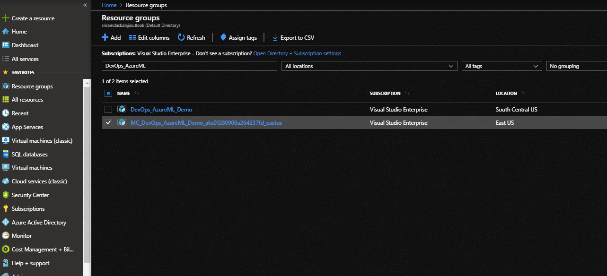

### References 
Do you want to learn more about **Azure Machine Learning service**? if yes below are few references to look at
- [Azure Machine Learning(Azure ML) Service Workspace](https://docs.microsoft.com/en-us/azure/machine-learning/service/overview-what-is-azure-ml)

- [Azure ML Samples](https://docs.microsoft.com/en-us/azure/machine-learning/service/samples-notebooks)
- [Azure ML Python SDK Quickstart](https://docs.microsoft.com/en-us/azure/machine-learning/service/quickstart-create-workspace-with-python)
- [Azure DevOps](https://docs.microsoft.com/en-us/azure/devops/?view=vsts)
