

## Overview

[Ansible](https://www.ansible.com/) is an open-source tool that automates cloud provisioning, configuration management, and application deployments. Using Ansible you can provision virtual machines, containers, network, and complete cloud infrastructures. In addition, Ansible allows you to automate the deployment and configuration of resources in your environment.

Ansible includes a suite of [Ansible modules](http://docs.ansible.com/ansible/latest/modules_by_category.html) that can be executed directly on remote hosts or via playbooks. Users can also create their own modules. Modules can be used to control system resources - such as services, packages, or files - or execute system commands.

For interacting with Azure services, Ansible includes a suite of [Ansible cloud modules](http://docs.ansible.com/ansible/list_of_cloud_modules.html#azure) that provides the tools to easily create and orchestrate your infrastructure on Azure.

### What’s covered in this lab

In this lab, you will see
1.	How Ansible can be used to implement Infrastructure as Code (IaC)
1.	How to automate infrastructure deployments in the Cloud with Ansible and Azure pipelines.

The following image will walk you through all the steps explained in this lab

 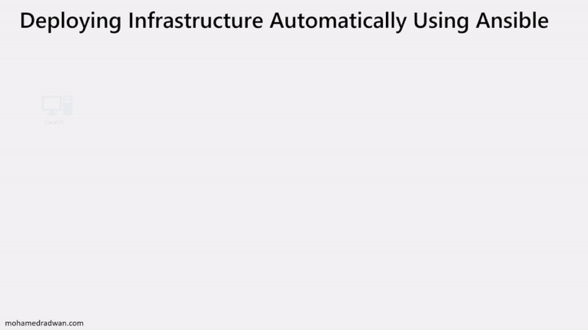

### Before you begin

1. Refer the [Getting Started](../Setup/) page before you begin following the exercises.

1. Use the [Azure DevOps Demo Generator](https://azuredevopsdemogenerator.azurewebsites.net/?Name=Ansible) to provision the project on your Azure DevOps organization.
   This URL will automatically select **Ansible** template in the demo generator. If you want to try other projects, use this URL instead -https://azuredevopsdemogenerator.azurewebsites.net/

   Follow the [simple walkthrough](https://docs.microsoft.com/en-us/azure/devops/demo-gen/use-vsts-demo-generator-v2?view=vsts) to know how to use the Azure DevOps Demo Generator.

### Setting up the Environment
### Task 1: Create an Azure service principal with Azure CLI
Ansible includes a suite of modules for interacting with Azure Resource Manager, giving you the tools to easily create and orchestrate infrastructure on the Microsoft Azure Cloud. Using the Azure Resource Manager modules requires authenticating with the Azure API. In this lab, you will use Azure service principal for authentication.

1. Login to the [Azure portal](https://portal.azure.com).

1. Click **Cloud Shell** and select **Bash**.

    

1. Enter the following command by replacing ServicePrincipalName with your desired value.

   `az ad sp create-for-rbac --name ServicePrincipalName `

   It will give you a JSON output as shown in the image. Copy the output to notepad. This details required in your next tasks.
         
    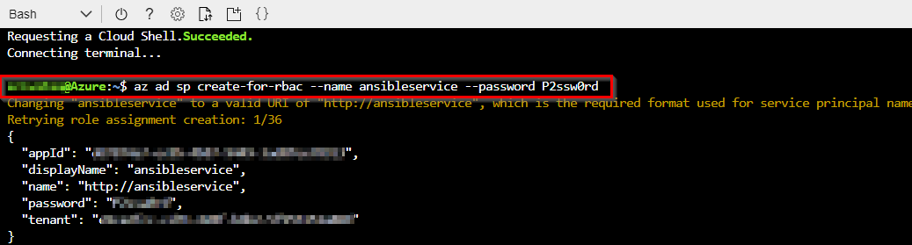

1. Enter the following command to get Azure SubscriptionID and copy the same to notepad.
   
    `az account show`

      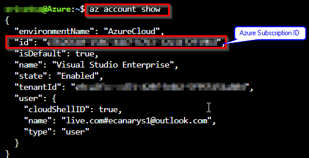

    For more information about Azure service principal click [here](https://docs.microsoft.com/en-us/cli/azure/create-an-azure-service-principal-azure-cli?view=azure-cli-latest#create-the-service-principal).

### Task 2: Configure Ansible in a Linux machine

To create and provision the resources in Azure with Ansible, we need to have a Linux VM with Ansible configured. In this exercise, you will deploy an Azure Linux VM which is pre-installed and configured with Ansible.

1. Click on the **Deploy to Azure** button to provision a **Ubuntu 18.04 VM** with Ansible.

   {:target="_blank"}

   Provide all the necessary information as is shown. It takes approximately 5-10 minutes to complete the deployment. 
    
     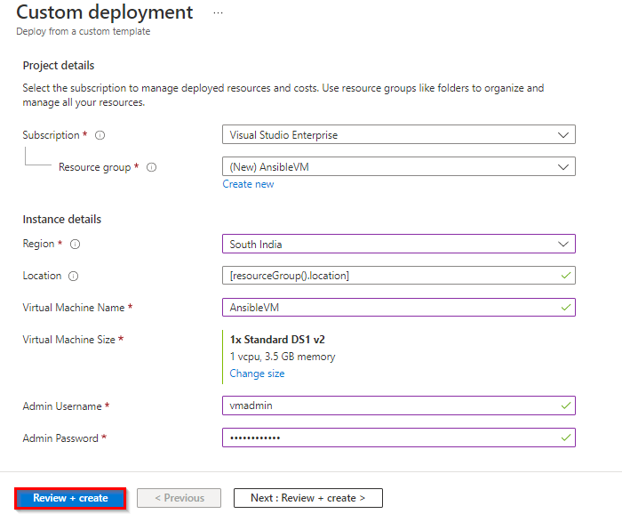

1. Once the deployment is successful, navigate to the resource group and select the VM.
      
    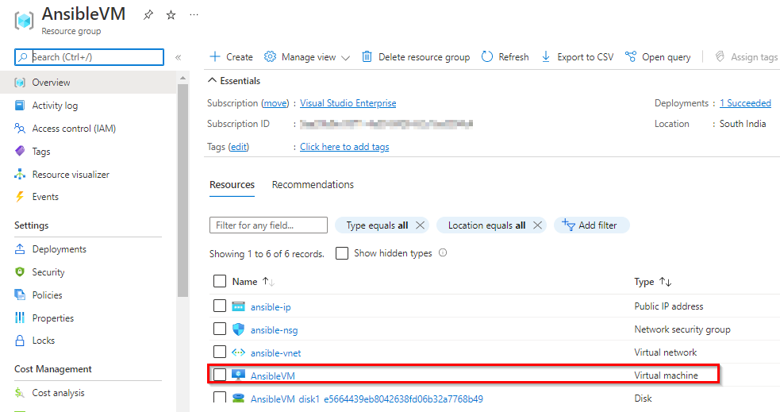

1. Click **Connect** and copy the login command under the **SSH** tab.
   
    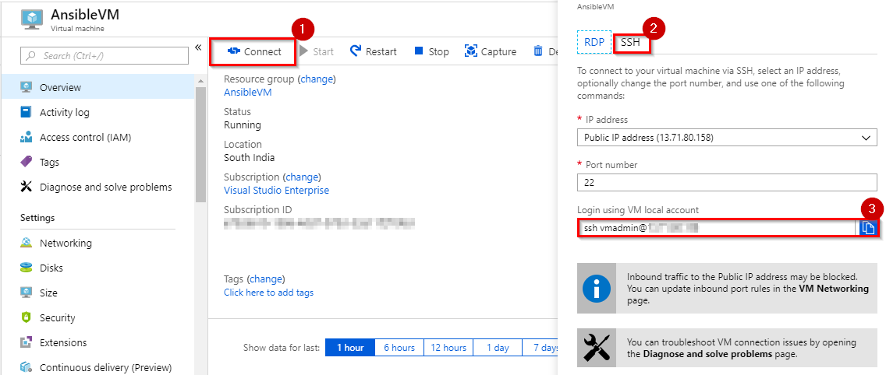

1. Open a Command prompt and paste the copied login command and log in. It will prompt for confirmation to connect, type **Yes** and provide the Password you have given in step 1.

   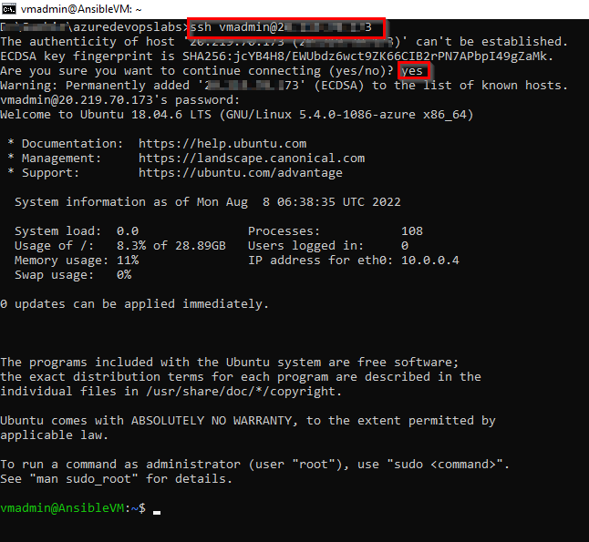 

1. Now we must create a directory named **.azure** in the home directory and a credentials file under it. Type the following commands to create them.

   `mkdir ~/.azure`

   `nano ~/.azure/credentials`

1. Insert the following lines into the **credentials** file. Replace the placeholders with the information from the service principal details you copied in the previuous task. Press **Ctrl+O** to save the file and **Ctrl+X** to exit from the text editor.

   `[default]`

   `subscription_id=<your-Azure-subscription_id>`

   `client_id=<azure service-principal-appid>`

   `secret=<azure service-principal-password>`

   `tenant=<azure serviceprincipal-tenant>`

1. Ansible is an agentless architecture based automation tool . Only it needs ssh authentication using Ansible Control Machine private/public key pair. Now let us create a pair of private and public keys. Run the following command to generate a private/public key pair for ssh and to install the public key in the local machine.

   `ssh-keygen -t rsa`
   
   `chmod 755 ~/.ssh`

   `touch ~/.ssh/authorized_keys`

   `chmod 644 ~/.ssh/authorized_keys`

   `ssh-copy-id vmadmin@127.0.0.1`

   >Note: Replace **vmadmin** with your VM username in the above command.

   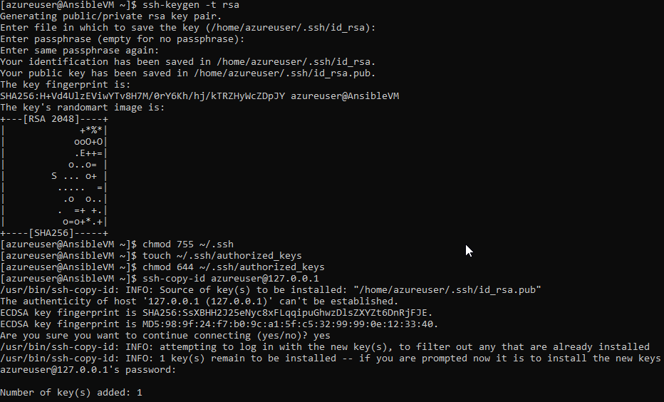 

1. In the next task, you need SSH private key to created SSH endpoint in Azure DevOps service. Run the following command to get the private key. Copy the private key to notepad.

    `cat ~/.ssh/id_rsa`

    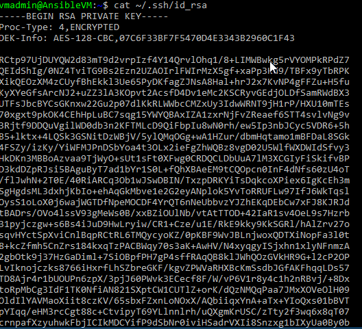 

### Task 3: Create a SSH Service Connection in Azure DevOps

To connect and run playbooks through Ansible VM in Azure pipelines, we need to have a connection between Azure DevOps and Ansible VM. This service connection provides authentication to Ansible.

1. Navigate to the project we created above using [Azure DevOps Demo Generator](https://azuredevopsdemogenerator.azurewebsites.net/?Name=Ansible).

1. Navigate to **Project Settings** --> **Service Connections**. Select **+New service connection** and select **SSH**

   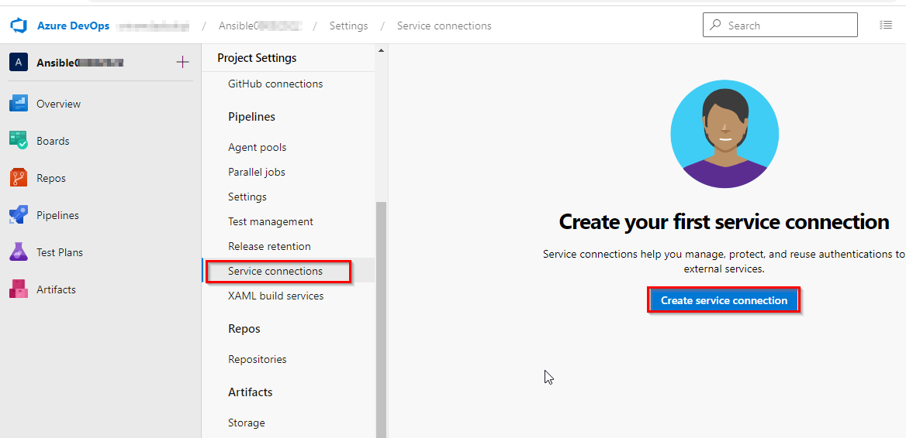 

1. In **Add an SSH service connection** window provide the required details and click **OK** to save the connection.
   
   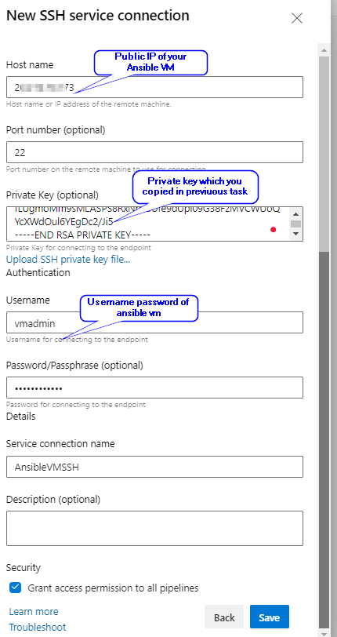

### Exercise 1: Examine the Ansible playbook (IaC) in your Source code

In this lab, we will use **SmartHotel360-CouponManagement**, a sample Java application backed by a MySQL database.  We will examine the Ansible playbook which helps you to provision the Azure resources required to deploy SmartHotel java application.

1. Navigate to your project. Select **Repos**.

1. Select the **webapp.yml** file under the **ansible-scripts** folder. Go through the code.

   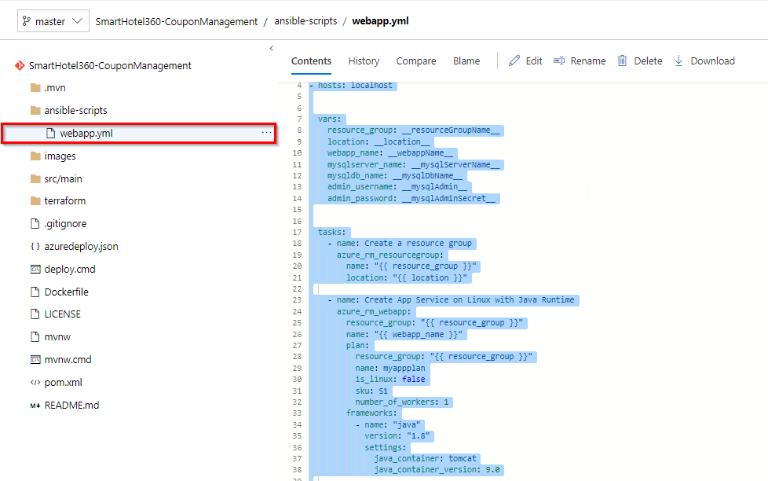

   **webapp.yml** is an Ansible playbook file written in YAML format.
   [Ansible Playbooks](https://docs.ansible.com/ansible/latest/user_guide/playbooks.html) are Ansible’s configuration, deployment, and orchestration language. They can describe a policy you want your remote systems to enforce or a set of steps in a general IT process. These playbooks use YAML file format to define a model of a configuration or a process.

   Ansible includes a suite of modules for interacting with Azure Resource Manager, giving you the tools to easily create and orchestrate infrastructure on the Microsoft Azure Cloud.

   In this example, we want to deploy an Azure Resource group, App service plan, App service and MySQL database required to deploy the website. And we have added playbook file (Infrastructure as Code) to source control repository in your Azure DevOps project which can deploy the required Azure resources.
   
   Update the playbook **webapp.yml** as the following.
   
   Change the name of the App service from Linux to Windows as the following image
   
   
   Also, change the EndIpAdress from 255.255.255.255 to 0.0.0.0 as the following image
   
    

   If you would like to learn more about the Ansible playbooks for Azure  click [here](https://docs.ansible.com/ansible/2.5/scenario_guides/guide_azure.html).

### Exercise 2: Build your application using Azure CI Pipeline
In this exercise, you will build your application and publish the required files to an artifact called drop.

1. Navigate to **Pipeline > Builds**. Select **Ansible-CI** and click **Edit**.
   
    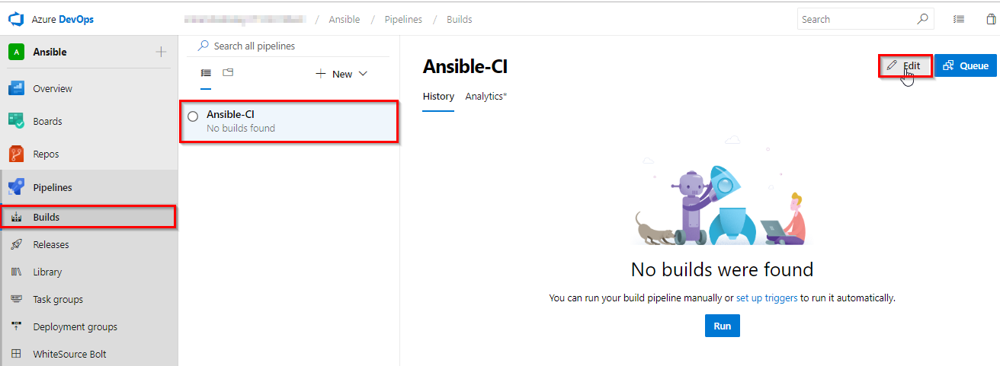

1. Your build pipeline will look like as below. This CI pipeline has tasks to compile Java project. The Maven in the pipeline will restore dependencies, build, test and publish the build output into a war file (package) which can be deployed to a web application.
 
     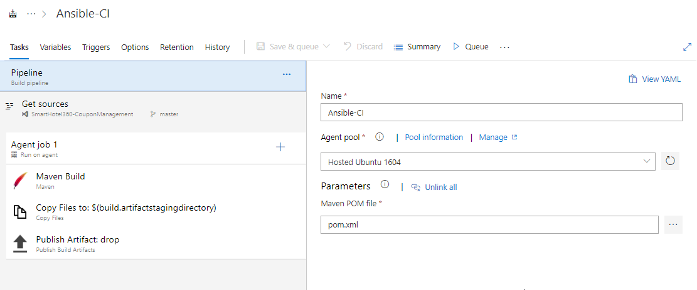

   For more guidance on how to build Java projects with Azure Pipelines see [here](https://docs.microsoft.com/en-us/azure/devops/pipelines/languages/java?toc=%2Fazure%2Fdevops%2Fjava%2Ftoc.json&bc=%2Fazure%2Fdevops%2Fpipelines%2Fbreadcrumb%2Ftoc.json&view=vsts).

1. In addition to the application build, we need to publish Ansible scripts  so that it will be available in CD pipeline. So, we configured Copy files task to copy Ansible playbook **.yml** and the java web package  **.war** file to Artifacts directory.

     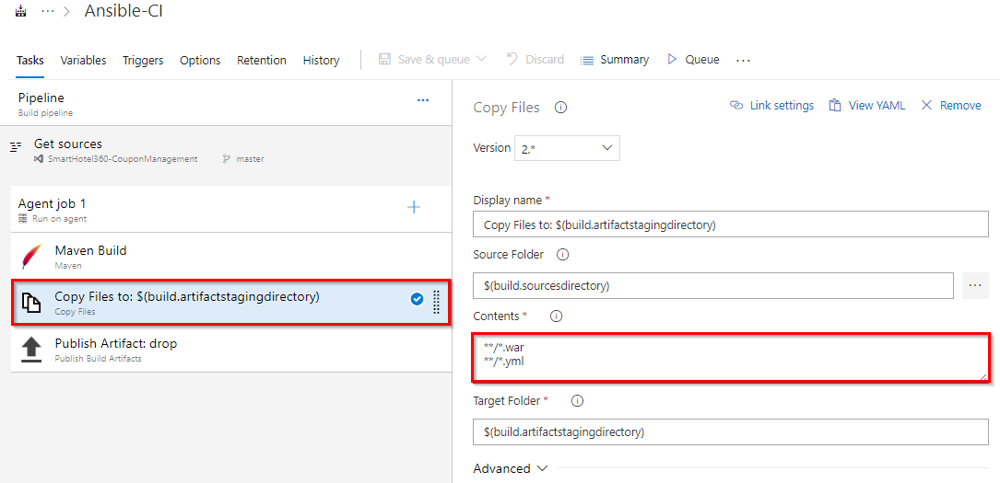

1. Now click **Queue** to trigger the build. Once the build success, verify that the artifacts have **ansible_scripts** folder and **ROOT.war** file in the drop.
  
    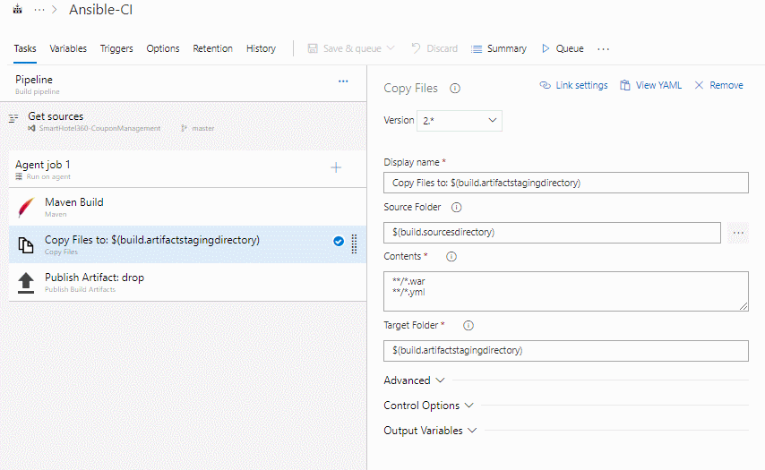

### Exercise 3: Deploy resources using Ansible in Azure CD Pipeline

 In this exercise, we will create azure resources using Ansible as part of our deployment (CD) pipeline and deploy the SmartHotel Coupon management application to the App service provisioned by Ansible.

1. Navigate to **Pipeline >> Releases**. Select **Ansible-CD** and click **Edit** pipeline. 

    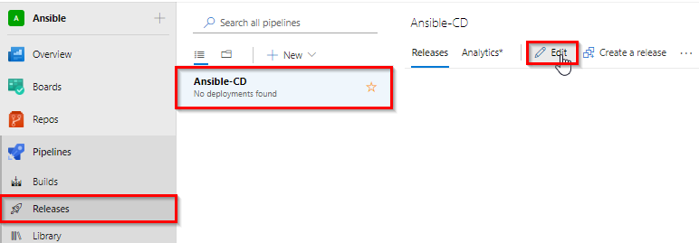

1. Select **Azure Dev** stage and click **View stage tasks** to view the pipeline tasks.

   

   You will see the tasks as below.

   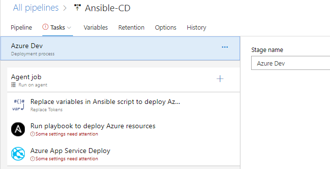

1. Select the **Replace Tokens** task.

   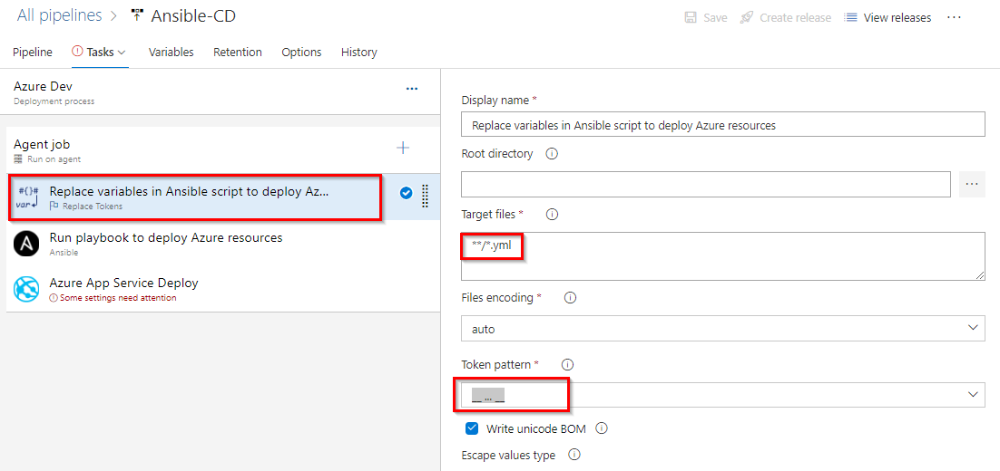

   If you observe the **webapp.yml** file in **Exercise 1**, **Step 2**  you will see there are few values are suffixed and prefixed with **__**. For example **__** **webappName** **__**. Using Replace tokens task we will replace those values with the variable values defined in the release pipeline.

    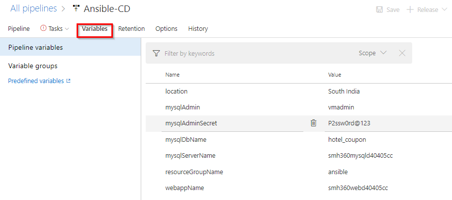

    Your CD pipeline is provisioned with some default values. If required you can changes the variable values.

1. Select the **Ansible** task. This task is to integrate with [Ansible](https://docs.ansible.com/ansible/latest/index.html). This task executes a given Ansible playbook on a specified list of inventory nodes via command line interface. This task requires that the Playbook files be located either on a private Linux agent or on a remote machine where Ansible automation engine has been installed. Select Ansible Location as **Remote Machine** and select **Ansible SSH endpoint** that you created in **Task 3**.

    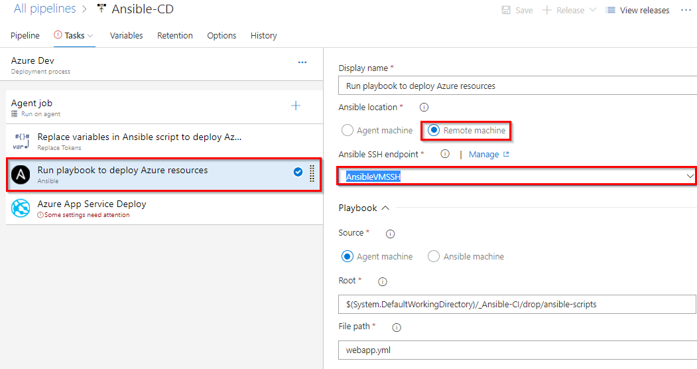

   Under the **Inventory** section, select **Host list** as inventory location and enter pubic ip of your ansible vm in **Host list** field as shown below.
    
    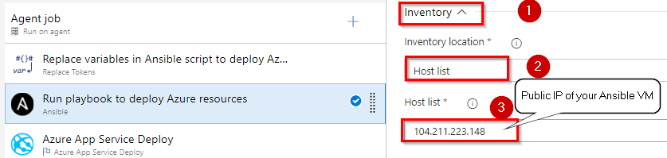
1. Select **Azure App Service Deploy** task. Select the Azure subscription from the drop-down list and click **Authorize** to configure Azure service connection. And this application require few app settings to connect to the MySQL database provisioned using Ansible script. That we are updating using **App settings** parameter in the task. This task will deploy the SmartHotel360-CouponManagement package to Azure app service which is provisioned by Ansible task in previous step.

    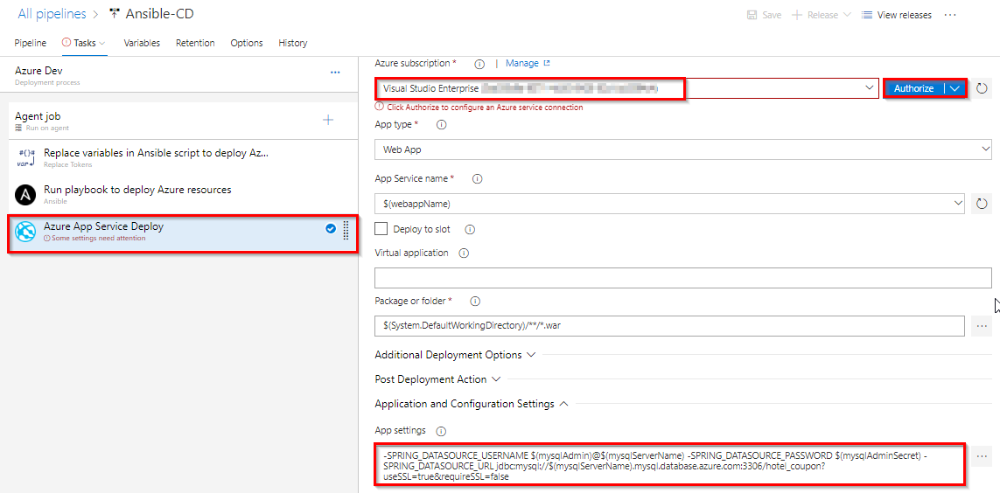

1. Once you are done **Save** the changes and **Create a release**.

   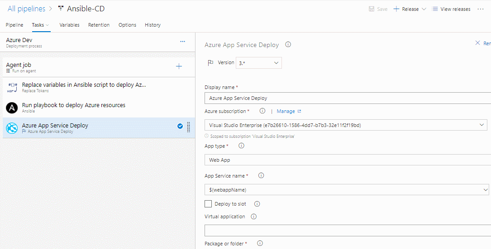

1. Once the release is success navigate to your Azure portal. Search for **smh360web** in App services. Select the app that created with **smh360-xxxx** and browse to view the application deployed. 
   
    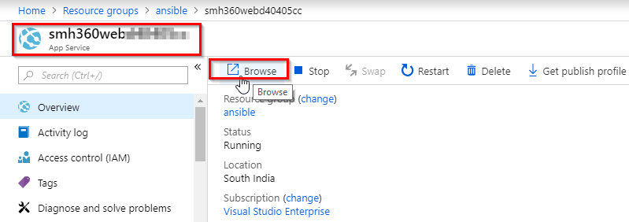

     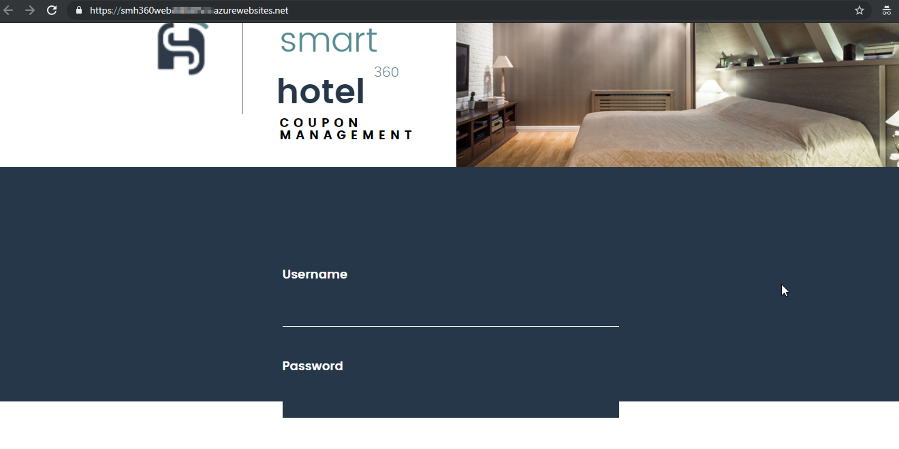

1. You can **Login** to the site with the following credentials.

   ` Username: me@smarthotel360.com `

   ` Password: 1234 `

    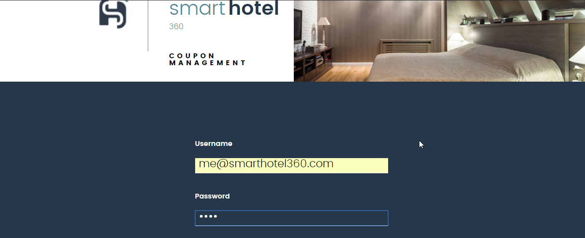

     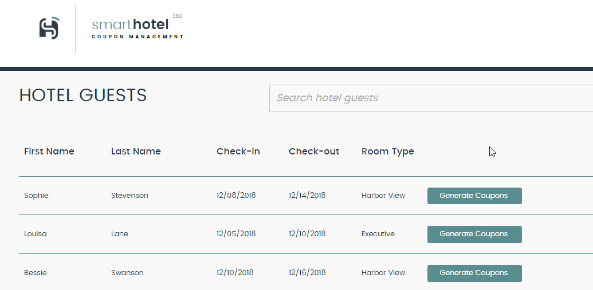

### Summary
In this lab, you have learnt how to deploy Azure resources automatically with **Ansible** and deploy the application with **Azure Pipelines**. 

For Ansible on Azure documentation and Quick starts click [here](https://docs.microsoft.com/en-us/azure/ansible/).

## Reference

You can watch the following video that walks you through all the steps explained in this lab

<figure class="video_container">
  <iframe width="560" height="315" src="https://www.youtube.com/embed/Q8aWeHCrGh4" frameborder="0" allowfullscreen="true"> </iframe>
</figure>

