

## Overview

[Visual Studio App Center](https://appcenter.ms/) brings together multiple services commonly used by mobile developers into an integrated cloud solution. Developers use App Center to Build, Test, and Distribute applications. Once the app's deployed, developers monitor the status and usage of the app using the Analytics and Diagnostics services, and engage with users using the Push service.

In this lab, we are going to Automate the **Build-Test-Distribute** process for **Tailwind Traders** mobile applications using **App Center + GitHub**. Tailwind Traders is a fictitious retail company showcasing the future of intelligent application experiences. These reference apps are powered by the Azure cloud, built with best-in-class tools, and made smarter through data and AI. The source repository used  in this lab is  imported from the below location
 - [TailwindTraders-Mobile](https://github.com/Microsoft/TailwindTraders-Mobile.git)

  

In this lab, we are going to use [App Center Demo Generator](https://appcenterdemogenerator.azurewebsites.net/) 
 to automatically provision required source code repository in your GitHub account and to configure a project in your App Center account.

## Before you begin

You must have the following - 
  * App Center account. If you don't have one get started for free from [here](https://azure.microsoft.com/en-in/services/app-center/).

  * API Token with *Full Access* to the App Center

  * Personal Access Token (PAT) for GitHub with *repo* scope

## Task 1: Set up the project in **App Center** using **App Center Demo Generator**

1. Open [App Center Demo Generator](https://appcenterdemogenerator.azurewebsites.net/) site on your browser. Click the links in the **Prerequisites** section to generate the required API tokens mentioned above.
   
    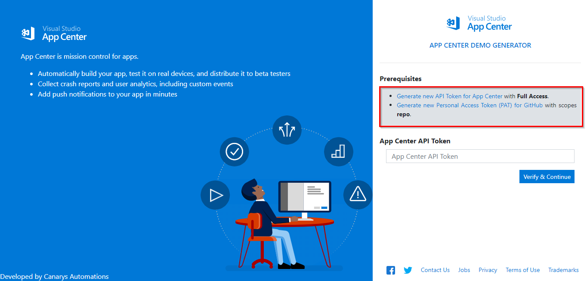

1. Enter the valid **App Center API Token** in the **App Center API Token** text field and click the **Verify & Continue** button.
   
   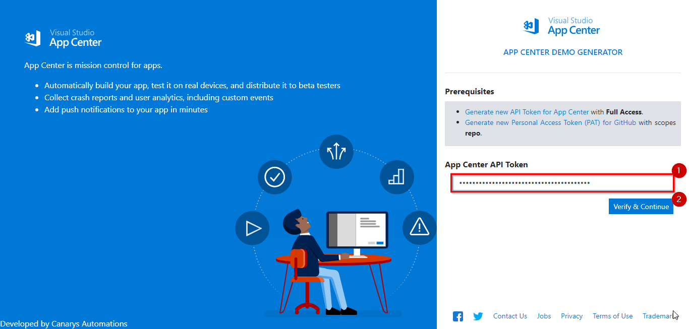

1. In the resulting page, choose **Tailwind Traders** template from a number of templates by clicking the **...** *ellipsis* button next to **Selected App Template** field. **Tailwind Traders** is the default selected template.
     
    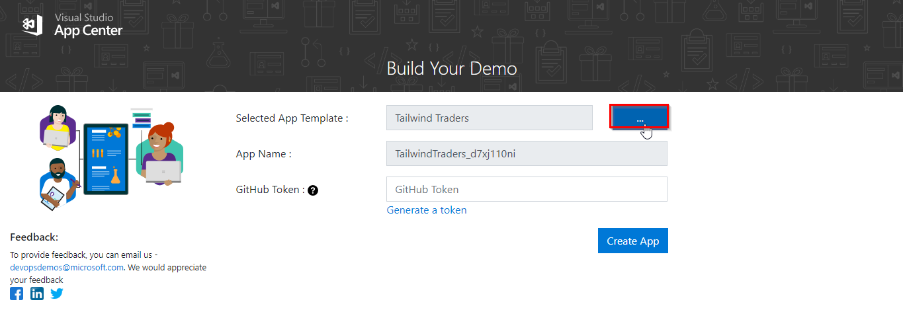 
    

1. Once the template is selected, a name for the application is auto-generated. Enter the valid GitHub token that was created previously. If you haven't created the token yet, click the **Generate a token** to generate a token with **repo** access. Click the **Create App** button.

    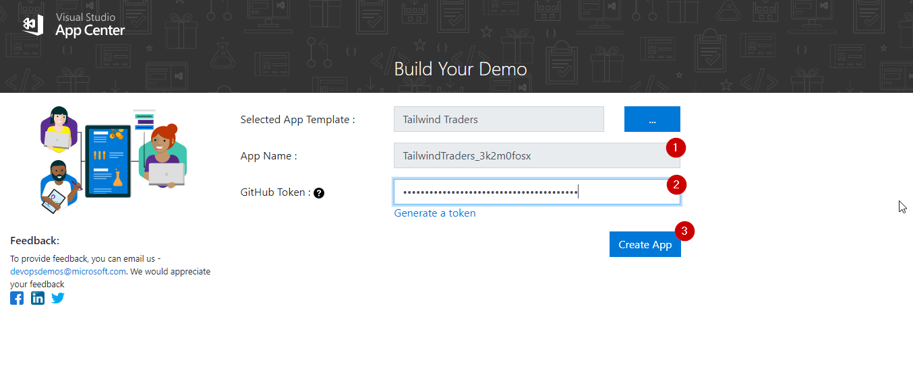

1. Once the process starts, you should be able to see status messages appearing in the page indicating the process of each step that the demo builder performs. 

    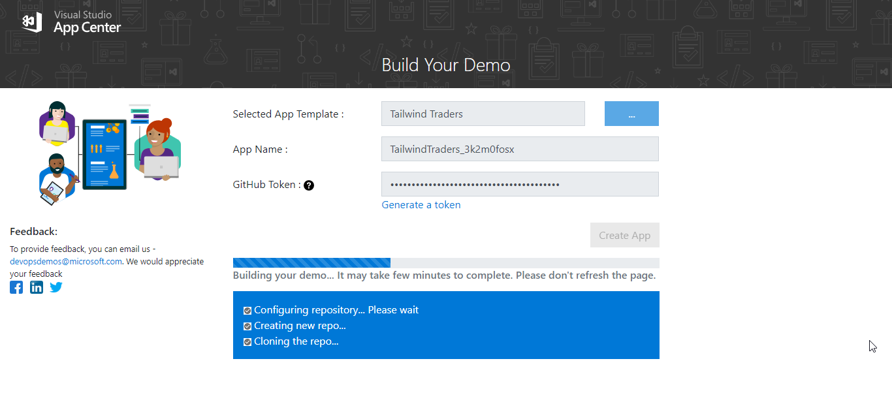

1. Once the application is provisioned successfully, you should see a success message with the App Center URL for the provisioned application.

    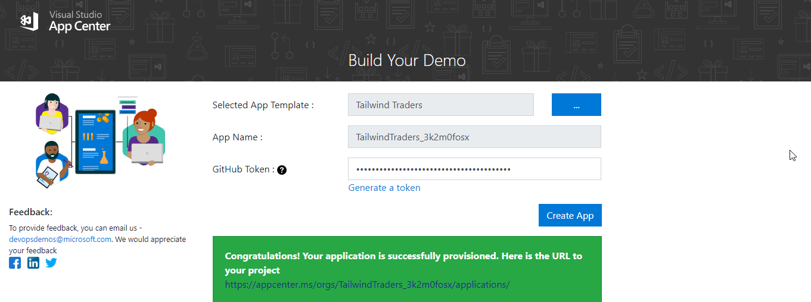

1. A **repository** with the source code will be created in your GitHub account that was provided and will be used in the build configuration of the application.

    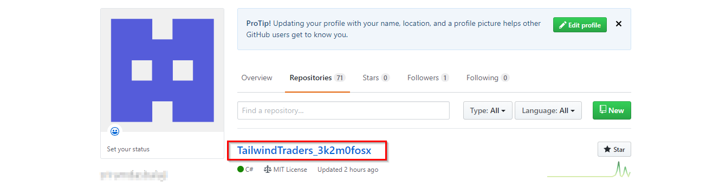

1. Navigate to the AppCenter portal by clicking the URL that has been generated after the application was successfully provisioned. You will see two apps created as shown below. One is for Tailwind Traders Android app and one is for iOS.

    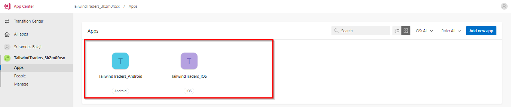

## Task 2: Managing Teams and Distribution groups for apps

1. In  App Center portal **TailwindTraders_xxxxx** which was created is known as **Organization**. Organizations are used to manage multiple apps. And under this Organization, we have two apps. One is for Android and other one is iOS. For more information on Creating and managing organizations click [here](https://docs.microsoft.com/en-us/appcenter/dashboard/creating-and-managing-organizations).
     
     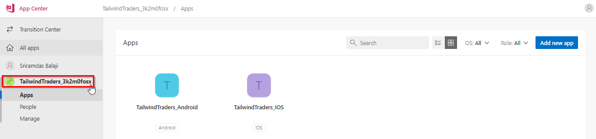

1. Select **People** under the organization and select **Collaborators**. In this window you can add/invite the collaborators by email for your app.
    
     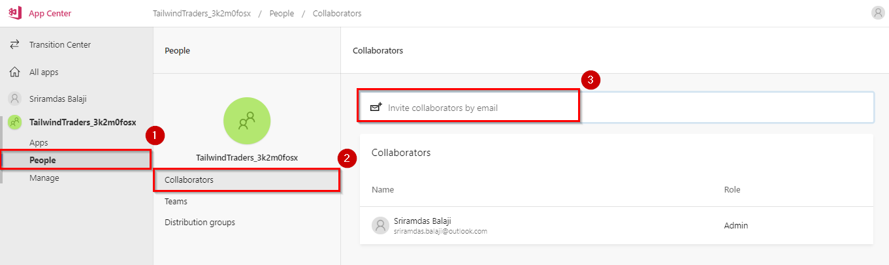

1. Select **Teams**. Use teams to better organize people that repeatedly work together. Any collaborator within an organization can create teams. Teams allow for better management of collaborators and app permissions. For more information on creating and managing teams click [here](https://docs.microsoft.com/en-us/appcenter/dashboard/creating-and-managing-teams)

    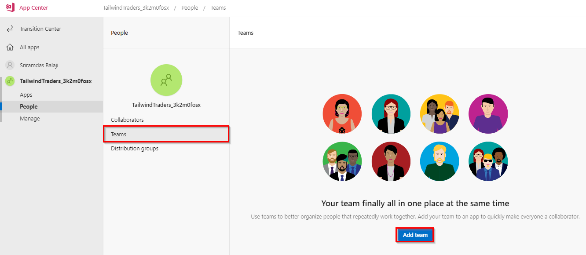

1. Select **Distribution groups**. Distribution groups allow you to easily distribute your app among collaborators, teams, and external testers. Here you can create multiple groups to distribute your app.

      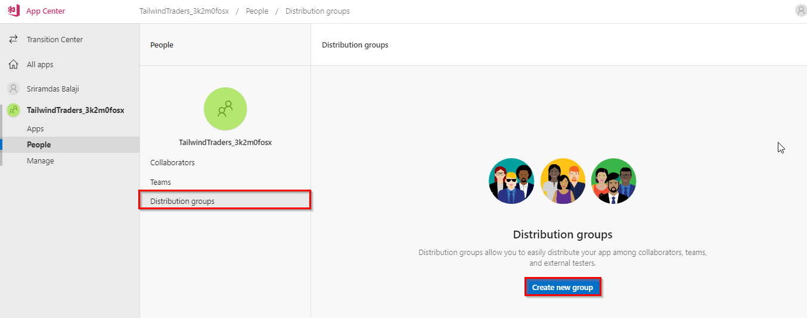

## Task 3: Examine the **Build-Test-Distribute** process for Tailwind Traders Android app

Since we have used [App Center Demo Generator](https://appcenterdemogenerator.azurewebsites.net/), it has automatically configured Build process for both the mobile apps. Let us examine the same.

1. From the App Center portal open the Tailwind Traders Android app

    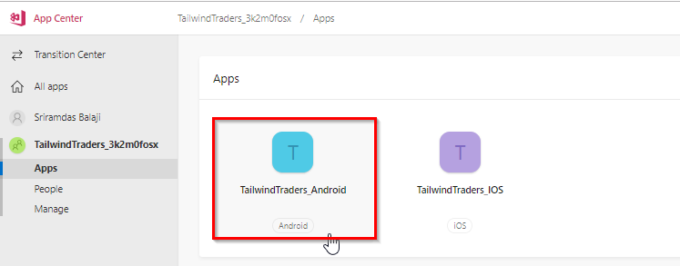

    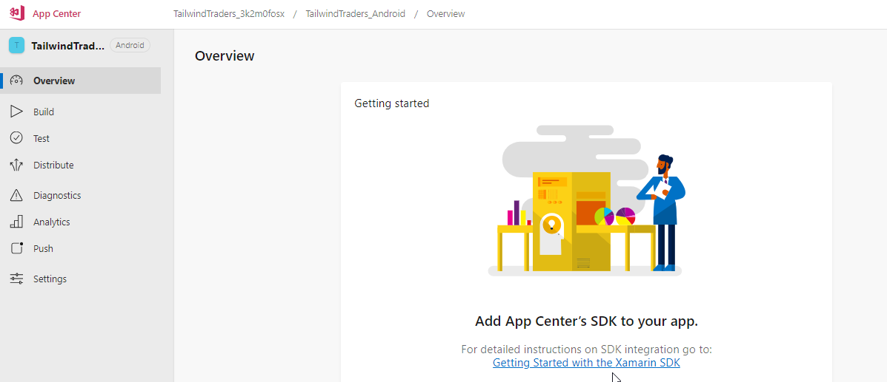

1. Select **Build** tab on the left side menu. The **[App Center Build service](https://docs.microsoft.com/en-us/appcenter/build/)** helps you build the mobile apps you and your team are working on, using a secure infrastructure. To start building your Android app, you will need to connect to your repository from GitHub. You could see that your Android app build is linked to your GitHub repo which is provisioned previously.

    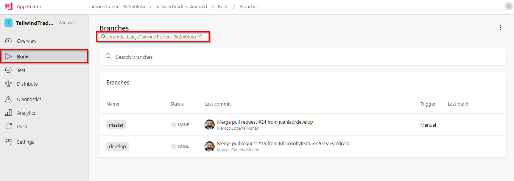

1. Select **master** branch and select settings icon in the resulting page.
     
     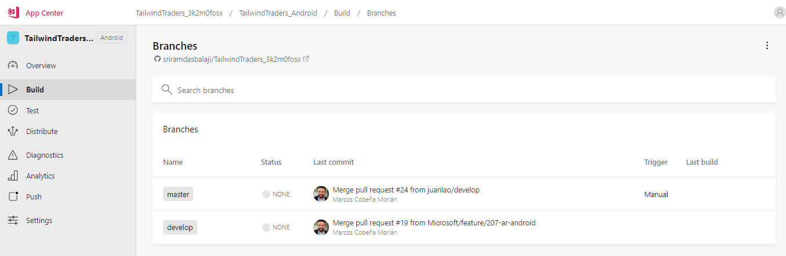

      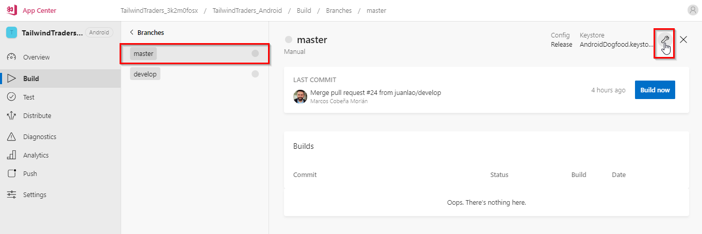

1. Below is the Build configuration for the Tailwind Traders Android app. This configuration is divided into multiple sections. Let us have a look at how these different sections are used.
     
     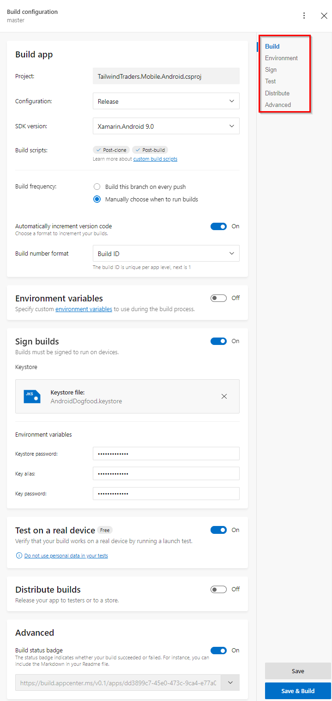

1. Under **Build app** section we will define which project to build, configuration, SDK version etc.
   
     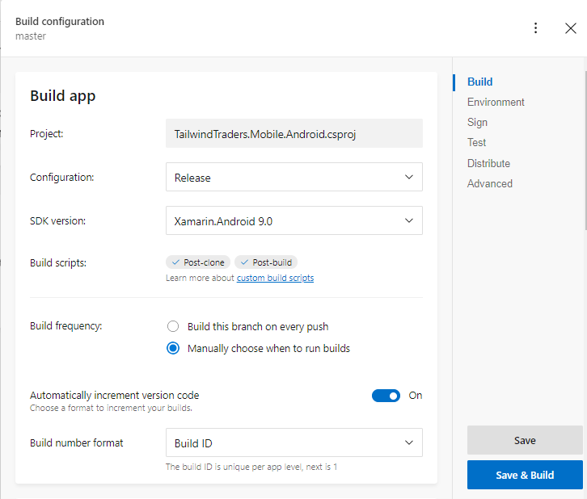

   - **Project** : The available projects in your repository will populate if they are located within the range of analysis. Select the correct project for your Android build and select the appropriate **Configuration**. Here we selected the Tailwind Traders Android project file from the repo.

   - **SDK version** : App Center allows using different Mono environments bundled with the respective Xamarin.Android SDK for your builds.

   - **[Build scripts](https://docs.microsoft.com/en-us/appcenter/build/custom/scripts/)** : You can add custom build steps that run at pre-defined stages during build time: post-clone, pre-build, post-build.

   - **Build frequency(Build triggers)** : By default, a new build is triggered every time a developer pushes to a configured branch. This is referred to as "Continuous Integration". If you prefer to trigger a new build manually, you can change this setting in the configuration pane.

   - **Automatically increment version code** : When enabled, the version code in the AndroidManifest.xml of your app automatically increments for each build. The change happens pre build and won't be committed to your repository.

   - **Build number format** : Automatically increment the build number of your builds with a specific format. Choose the continuous App Center build ID or other predefined formats. 

1. Under **[Environment variables](https://docs.microsoft.com/en-us/appcenter/build/custom/variables/)** section, you can enable the toggle to define custom environment variables to define sensitive information that is required for your build without checking them into your repository. The values of variables can be encrypted by clicking on the lock icon so they won't get exposed to the build configuration and appear obfuscated in the build logs.

   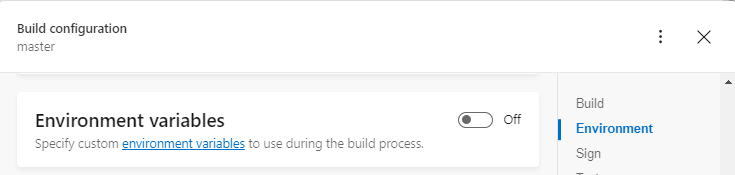

1. Select **Sign builds** section. A successful build will produce a `.apk` file. To release the build to the Play Store, it must be signed with a valid Keystore and Alias. To sign the builds produced from a branch, we need to enable code signing in the configuration pane, upload Keystore, and provide the values needed in the configuration pane. This has been set up for you automatically in this lab. You can read more detailed [code signing instructions](https://docs.microsoft.com/en-us/appcenter/build/xamarin/android/code-signing).

     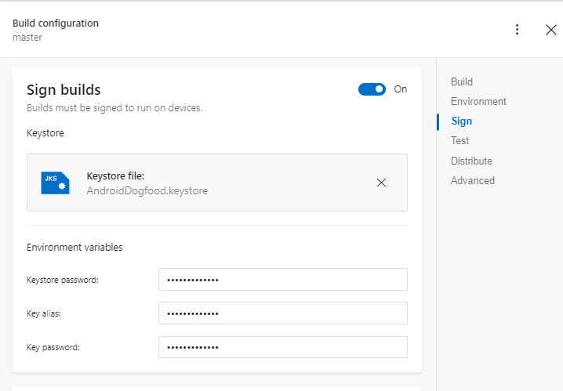

1. Select **[Test on a real device](https://docs.microsoft.com/en-us/appcenter/build/build-test-integration)** section. App Center Build's Launch Test feature helps to run your latest successful build (`.apk`) on a real device using the App Center Test. Launching your app after each build validates that your latest build is working.

   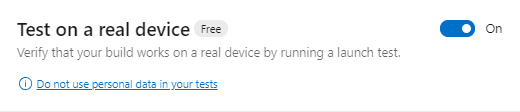

1. Select **[Distribute builds](https://docs.microsoft.com/en-us/appcenter/build/build-to-store)** section. Using this feature you can release your app to testers or to the store directly from App Center. You can configure each successful build from a branch to be distributed to previously created distribution groups.
  
     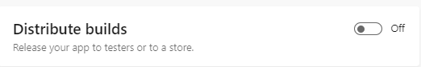

These are the build configuration steps available for your application in App Center. 

## Task 4: Queue the Build in App Center

   Once you are done with your Build configuration **Save** the changes and close the configuration window.

1. Click **Build now**. A build will be queued for the Tailwind Traders android project. You can view the build progress in the live console. 
    
      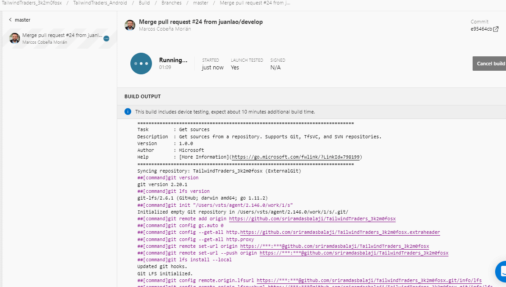

1. Since we enabled **Test on real device** feature in build configuration, the build may take more than 10 minutes to complete.

1. Once the build is a success, you can download the application `.apk` file and build logs from the build output.

    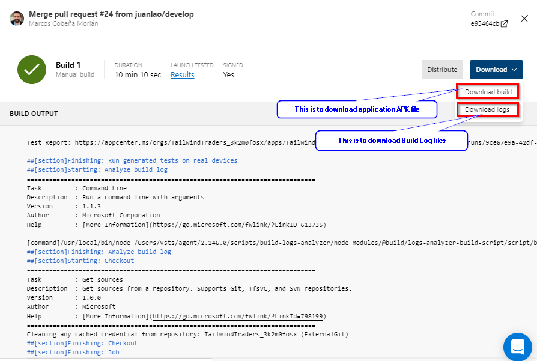

1. You can also **Distribute** the application to your collaborators or distribution groups. Users will get an email notification about your new release.

   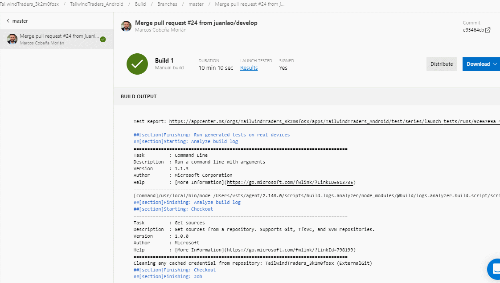

1. Since we enabled **Test on real device** feature you can view the test run performed as part of the build. Select **Test** tab. And open Test run.
    
    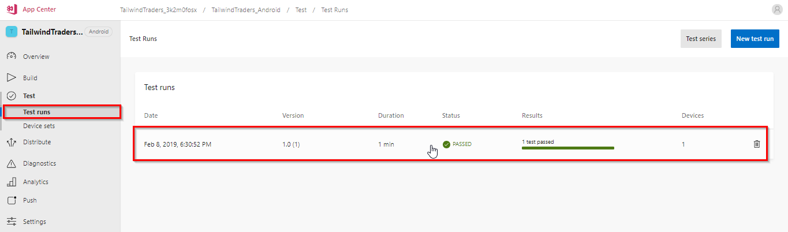

1. You can see the Test results as shown below. Select **App Does Launch** test.

    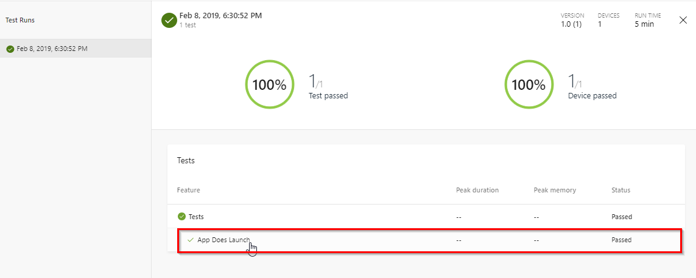

    In the resulting window, you can see a screenshot showing that the application is deployed on a mobile device (It's a real device, not an emulator) and able to launch successfully. This validates that our latest build is working.

    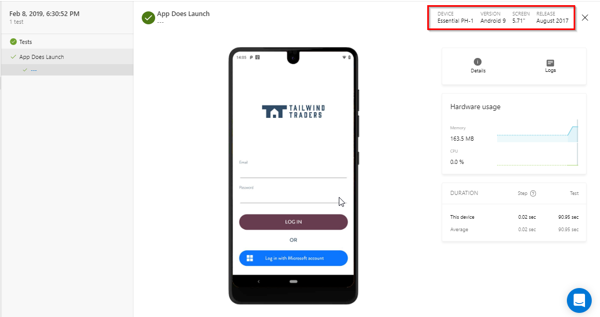

    For more information on **Testing Builds on Real Devices** click [here](https://docs.microsoft.com/en-us/appcenter/build/build-test-integration).

## Summary

As shown above, you can Automate the lifecycle of your iOS, Android, Windows, and macOS apps. Connect your repo and within minutes build in the cloud, test on thousands of real devices, distribute to beta testers and app stores. All in one place.

## References

 - [App Center Build](https://docs.microsoft.com/en-us/appcenter/build/)
 - [App Center Test](https://docs.microsoft.com/en-us/appcenter/test-cloud/)
 - [Distribute app using App Center](https://docs.microsoft.com/en-us/appcenter/distribution/)
 - [Monitor your app using App Center Analytics](https://docs.microsoft.com/en-us/appcenter/analytics/)
