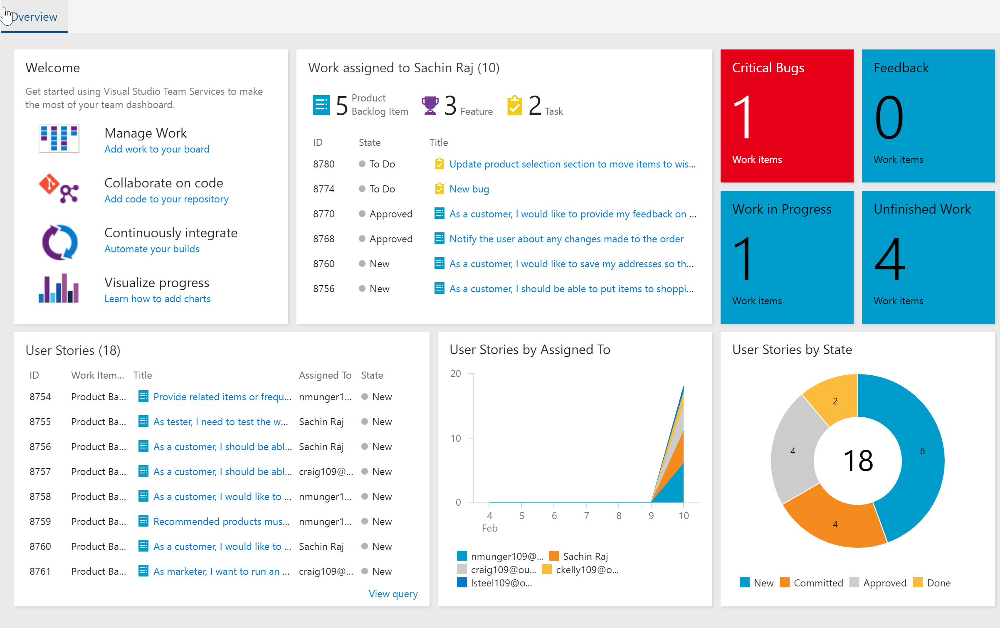

## Overview

Azure Web Apps, is a part of Azure App Services that helps to develop and deploy web applications.It offers several benefits including built-in auto scale and load balancing, high availability with auto-patching, integrated monitoring, etc., You can build the web application in the language of your choice including .NET, .NET Core, Java, Ruby, Node.js, PHP, or Python. 

In this lab, we will discuss how to deploy an ASP.NET application to Azure Web using Visual Studio Team Services (VSTS). You will

* Setup a Team Services project using DeMo Generator
* Setup a CI/CD pipeline
* Automate Azure infrastructure using ARM Templates
* Parameterize settings
* Configure approval process in Release Management
* Configure App Insights monitoring

### Prerequisites for the lab

1. **Microsoft Azure Account**: You will need a valid and active Azure account for the Azure labs. If you do not have one, you can sign up for one through one of the following ways:

    * If you are an active Visual Studio Subscriber, you are entitled for a $50-$150 credit per month. You can refer to this [link](https://azure.microsoft.com/en-us/pricing/member-offers/msdn-benefits-details/){:target="_blank"} to find out more information about this including how to activate and start using your monthly Azure credit.

    * If you are not a Visual Studio Subscriber, you can sign up for the FREE [Visual Studio Dev Essentials](https://www.visualstudio.com/dev-essentials/){:target="_blank"} program to create a **Azure free account** (includes 1 year of free services, $200 for 1st month).

1. You will need a **Visual Studio Team Services Account**. If you do not have one, you can sign up for free [here](https://www.visualstudio.com/products/visual-studio-team-services-vs){:target="_blank"}

1. You will need a **Personal Access Token** to set up your project using the **VSTS Demo Generator**. Please see this [article](https://docs.microsoft.com/en-us/vsts/accounts/use-personal-access-tokens-to-authenticate){:target="_blank"} for instructions to create your token.

    

## Setting up the VSTS Project

1. Use the [VSTS Demo Generator](https://vstsdemogenerator.azurewebsites.net/?name=PartsUnlimited){:target="_blank"} to provision the team project with sample content including  code, work items,build and release definitions required to follow this lab. 

   

1. Once the team project is provisioned, click on the URL to navigate to the team project.

   

1. You will see the work items, source code and CI/CD definitions already populated by the demo generator.

    

## Exercise 3: Setting up Continuous Integration (CI) and Continuous Deployment (CD)

1. Navigate to **Code** hub. You will notice that we have an ASP.NET code. This is ASP.NET 4.5 version of the PartUnlimited application , an example eCommerce website. You can find more details about the Partsunlimited application on GitHub [here](https://github.com/Microsoft/PartsUnlimited){:target="_blank"}

   

1. We will deploy this application to **Azure App Service**

1. Navigate to **Build** under **Build and Release** hub

1. Select the **PartsUnlimitedE2E** build definition and choose **Edit**

1. The build definition contains the following tasks

   | Tasks used in Build | Usage / Purpose |
   |-------|-------|
   | **Nuget Installer**| Restore and update all the package dependencies required to compile the project|
   | **Visual Studio Build**| Invoke  **MSBuild** to compile the application. We will instruct MSBuild to package the output as a zip file using the arguments   `/p:DeployOnBuild=true /p:WebPublishMethod=Package /p:PackageAsSingleFile=true /p:SkipInvalidConfigurations=true /p:PackageLocation="$(build.stagingDirectory)" /p:IncludeServerNameInBuildInfo=True /p:GenerateBuildInfoConfigFile=true /p:BuildSymbolStorePath="$(SymbolPath)" /p:ReferencePath="C:\Program Files (x86)\Microsoft Visual Studio\2017\Enterprise\Common7\IDE\Extensions\Microsoft\Pex"`  |
   | **Visual Studio Test**| As a part of the build process, we will run the unit tests included in the project using the VisualStudio Test task to ensure the code quality|
   | **Copy Files**| Copy the zipped binaries and the ARM template to a staging directory|
   | **Publish Build Artifacts**| Finally, deploy the binaries in the staging directory that were copied in the previous step|

1. Queue the build using the **Hosted Agent** 

1. Wait for the build to complete. Once completed, you can find the build summary with **Test Results**, **Code Coverage** etc.

   

<associating CD to CI>

## Exercise 4: Continuous Delivery

The release pipeline is configured as **Infrastructure as a Code** to deploy the application which is associated to the build and is automatically triggered when the build is successfully completed.

1. Click on the **PartsUnlimitedE2E** definition, to view the release progress.

   

1. Click on the **Edit** button to view the release pipeline. There are three configured deployment environments namely the **Dev**, **QA** and **Production**.

   

1. Select the **Dev** environment to view the tasks configured.

   

   | Tasks used in Release | Usage / Purpose |
   |-------|-------|
   | **Azure Resource Group Deployment**|The project used in this lab contains the front-end (Azure App Service) and back-end (Azure SQL DB) services. These will be provisioned as [PAAS on Azure](https://azure.microsoft.com/en-in/overview/what-is-paas/){:target="_blank"} using [ARM](https://docs.microsoft.com/en-us/azure/azure-resource-manager/resource-manager-create-first-template){:target="_blank"} templates. The task will create the above services in a resource group named **ASPDOTNET**|
   | **Azure App Service Deploy**| The task is used to deploy a Web project to the Azure App Service created in the previous step|

1. To view the outcome of the release, click on the **View releases** option.

   

1. To view the release summary for the environment, double=click on the environment blocks displayed in the report.

   

   

1. Login to the [Azure Portal](https://portal.azure.com) and search for a **Resource Group** named **ASPDOTNET**.

   

1. Browse to either the deployed Dev or Staging web application from the resource group to validate that the changes have been deployed successfully.

   

## Summary

The **VSTS** simplifies the creation of the continuous integration and continuous delivery pipelines for the application to be deployed to the Azure platform.