

## Overview

This lab details the deployment of an [ASP.NET](https://www.asp.net/){:target="_blank"} application to the Azure App Service using Visual Studio Team Services (VSTS).
ASP.NET is an open source web framework for building modern web applications and services. ASP.NET creates websites based on HTML5, CSS, and JavaScript that are simple, fast, and can scale to millions of users.

### Prerequisites for the lab

1. **Microsoft Azure Account**: You will need a valid and active Azure account for the Azure labs. If you do not have one, you can sign up for a [free trial](https://azure.microsoft.com/en-us/free/){:target="_blank"}

    * If you are an active Visual Studio Subscriber, you are entitled for a $50-$150 credit per month. You can refer to this [link](https://azure.microsoft.com/en-us/pricing/member-offers/msdn-benefits-details/){:target="_blank"} to find out more information about this including how to activate and start using your monthly Azure credit.

    * If you are not a Visual Studio Subscriber, you can sign up for the FREE [Visual Studio Dev Essentials](https://www.visualstudio.com/dev-essentials/){:target="_blank"} program to create a **Azure free account** (includes 1 year of free services, $200 for 1st month).

1. You will need a **Visual Studio Team Services Account**. If you do not have one, you can sign up for free [here](https://www.visualstudio.com/products/visual-studio-team-services-vs){:target="_blank"}

1. You will need a **Personal Access Token** to set up your project using the **VSTS Demo Generator**. Please see this [article](https://docs.microsoft.com/en-us/vsts/accounts/use-personal-access-tokens-to-authenticate){:target="_blank"} for instructions to create your token.

    

## Setting up the VSTS Project

1. Use the [VSTS Demo Generator](https://azuredevopsdemogenerator.azurewebsites.net/?name=PartsUnlimited){:target="_blank"} to provision the team project on the VSTS account.

   > **VSTS Demo Generator** helps you create team projects on your VSTS account with sample content that include source code, work items,iterations, service endpoints, build and release definitions based on the template you choose during the configuration.

   

1. Once the team project is provisioned, click on the URL to navigate to the team project.

   

## Exercise 1: Endpoint Creation

The connection between the VSTS and the Azure is not automatically established during the team project provisioning, and hence the endpoints need to be created manually. This endpoint will be used to connect **VSTS** with **Azure**. Follow the steps outlined below to create the endpoint.

1. In the VSTS home page, click on the **Settings** gear icon  and then click on the **Services** option to navigate to the **Services** screen.

1. Click on the **+New Service Endpoint** button and select the **Azure Resource Manager** option. Provide  `Connection name`, select the `Azure Subscription` from the list and the click on the **Ok** button. The Azure credentials will be required to be provided to authorize the connection.

   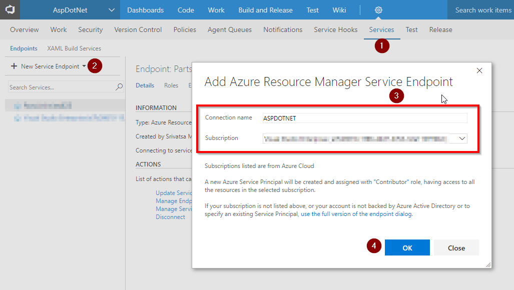

   > Disable the pop-up blocker in your browser. If a blank screen is displayed after the **Ok** button is clicked, retry the step.

## Exercise 2: Configure Release

1. Once the connection is established, manually map the endpoints to the release definition.

   

1. Click on the **Build & Release** section and then click on the **Releases**. Select the release definition **PartsUnlimitedE2E** and click on the **Edit** button.

   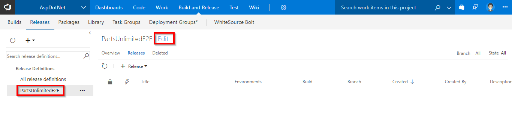

1. Select the **Tasks** tab and click on the **Dev** option.

   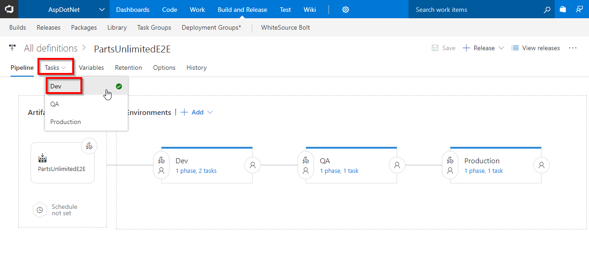

1. Select the **Azure Resource Group Deployment** task, pick the **Azure subscription** having the endpoint configuration from the dropdown list and select the desired **location** for deployment.

   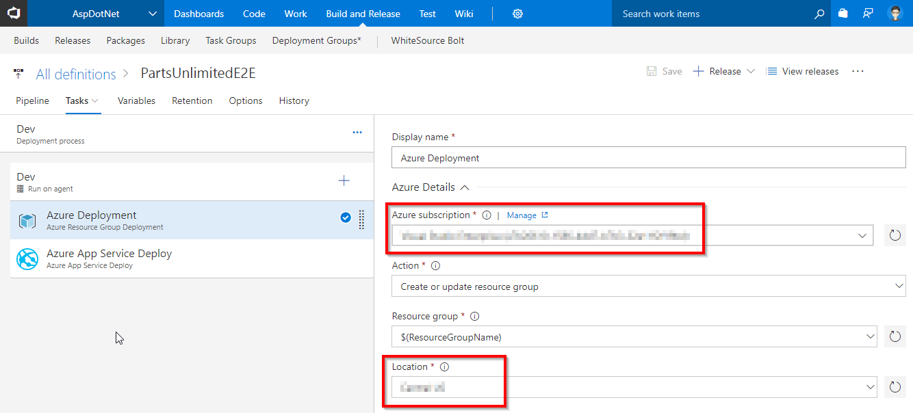

1. Select the **Azure App Service Deploy** task and pick **Azure subscription** from the dropdown list. In the **Slot** section, provide the slot name as **Dev**.

   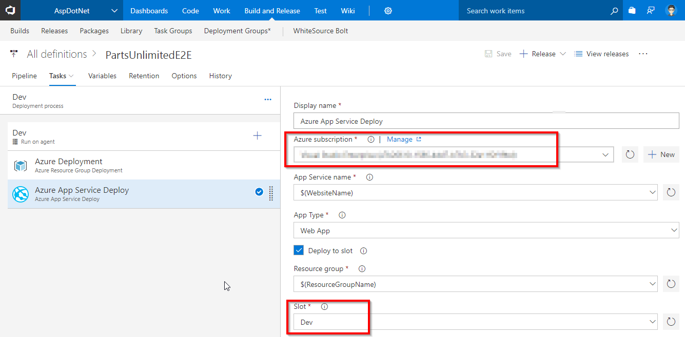

1. Similarly configure the  **Azure subscription** for the **QA** and **Production** environments. Select the **Tasks** tab and click on the **QA** option.

   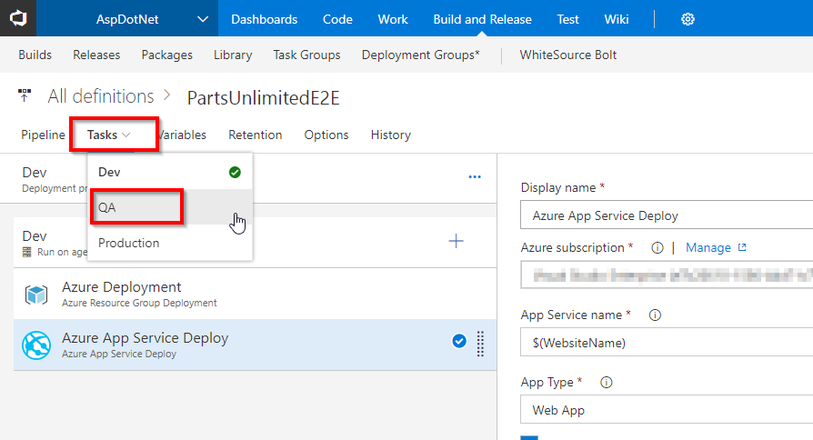

1. Select the **Azure App Service Deploy** task and pick the **Azure subscription** from the dropdown. Under the **Slot** section enter the slot name as **Staging**.

   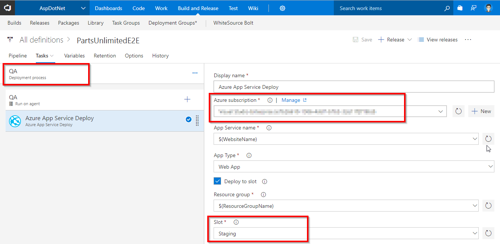

1. Navigate to the **Tasks** tab and select the **Production** option.

   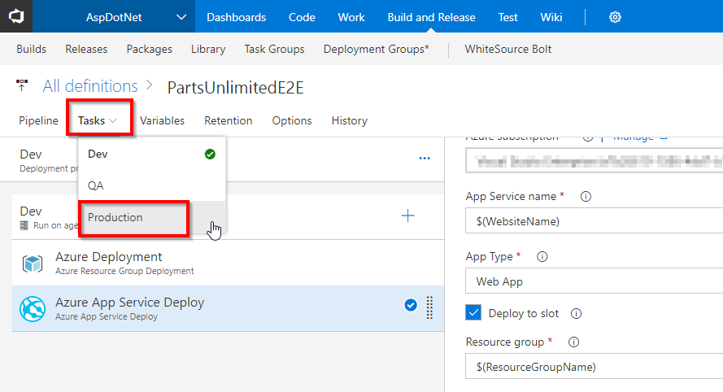

1. Select the **Azure App Service Deploy** task, pick the **Azure subscription** from the dropdown and click on the **Save** button to save the release definition.

   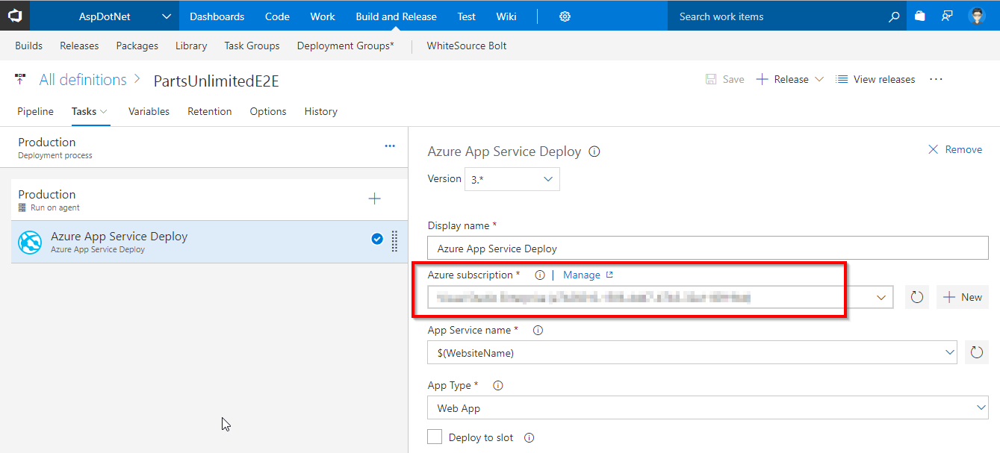

## Exercise 3: Initiate Continuous Integration (CI) and Continuous Deployment (CD)

To automatically initiate the CI-CD, the source code needs to be modified and committed to the source code repository.

1. Navigate to the **Code** hub on the VSTS portal.

   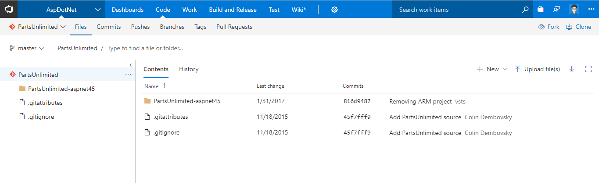

1. The repository contains an **ASP.NET** application source code provisioned by the VSTS Demo Generator. This application will be deployed to the Azure App Service.

   > The team project already has a Continuous Integration (CI) build configured that gets automatically initiated when the source code modifications are committed to the repository.

1. To edit the source code, open the file **Index.cshtml** by navigating to the below path in the master branch:

   `PartsUnlimited/PartsUnlimited-aspnet45/src/PartsUnlimitedWebsite/Views/Home/Index.cshtml`

   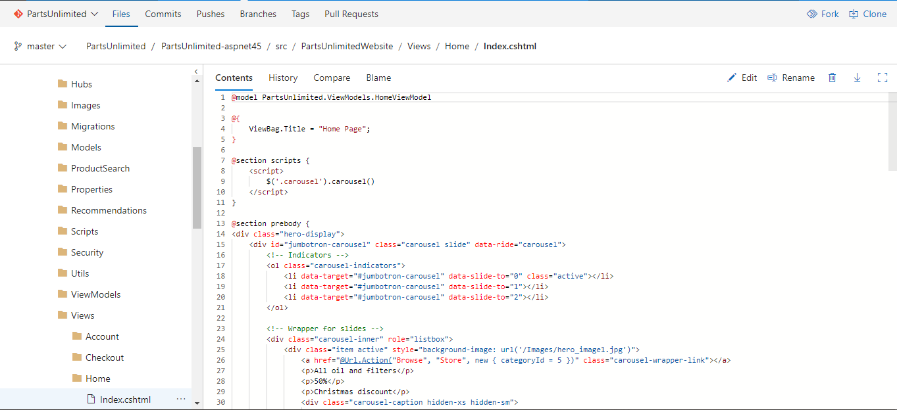

1. Make some small changes to the code. For this example, change the discount percentage of `50%` to `70%` on `line 28` and then click on the **Commit** button to save and commit the changes.

   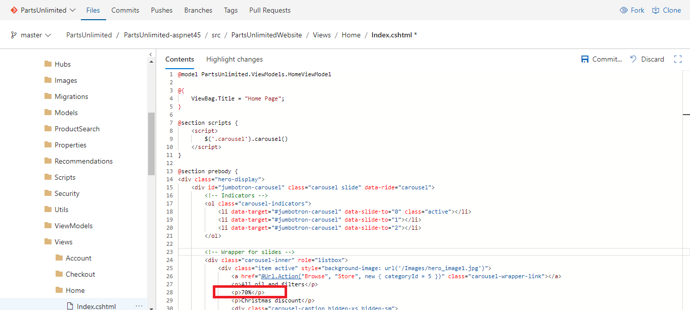

1. The code commit will trigger the CI build. Navigate to the **Build and Release** tab to view the progress of the  the CI build initiated automatically due to the code changes.

   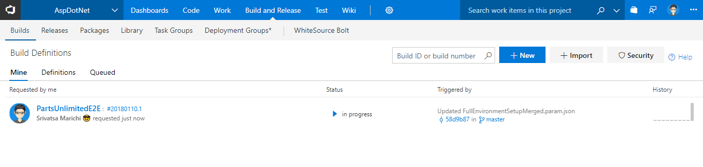

   The following tasks are used in the build definition:

   | Tasks used in Build | Usage / Purpose |
   |-------|-------|
   | **Nuget Installer**| Nuget installer restores and updates all the package dependencies required to compile the project|
   | **Visual Studio Build**| The Visual Studio Build task is used to invoke the MS build to compile and package the output as a zip file.|
   | **Visual Studio Test**| As a part of the build process, all the unit tests included in the project will be executed using the VisualStudio Test task to ensure the code quality. This project contains 16 unit tests|
   | **Copy Files**| This task is used to copy the zipped binaries and the ARM template to a staging directory|
   | **Publish Build Artifacts**| This task is used to deploy the binaries in the staging directory that were copied in the previous step|

1. To view the live progress of the build, click on the build number to open the build live console.

   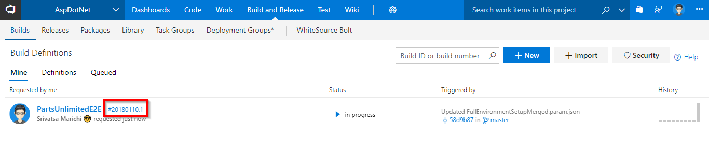

   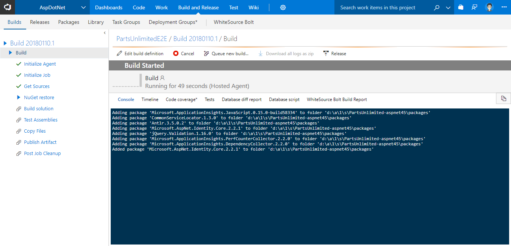

1. Once the build is completed, if not clicked earlier, click on the build number to view the build summary including **Test Results**, **Code Coverage** etc.

   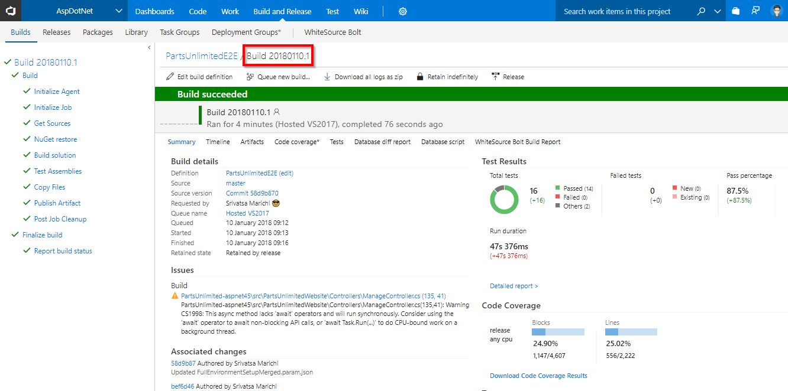

## Exercise 4: Continuous Delivery

The release pipeline is configured as **Infrastructure as a Code** to deploy the application which is associated to the build and is automatically triggered when the build is successfully completed.

1. To view the release progress, click on the **Build and Release** hub and select the **Release** option.

1. Click on the **PartsUnlimitedE2E** definition, to view the release progress.

   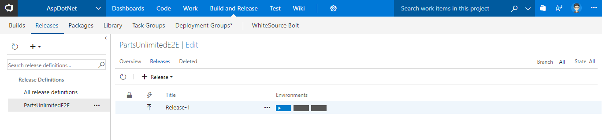

1. Click on the **Edit** button to view the release pipeline. There are three configured deployment environments namely the **Dev**, **QA** and **Production**.

   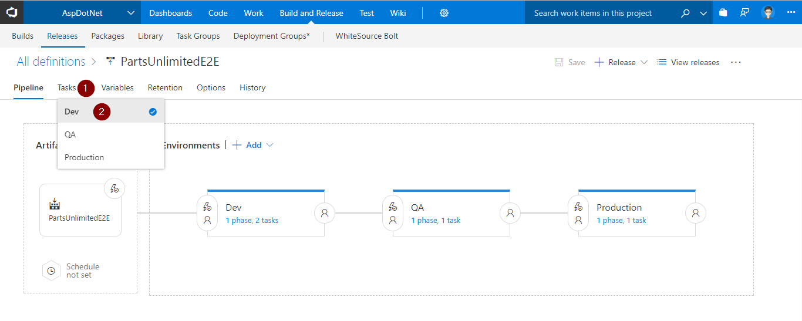

1. Select the **Dev** environment to view the tasks configured.

   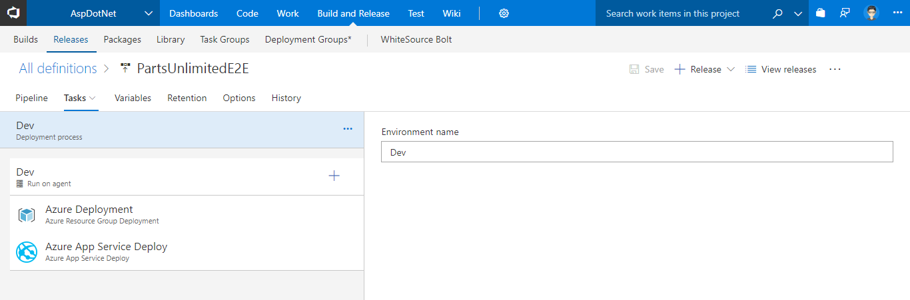

   | Tasks used in Release | Usage / Purpose |
   |-------|-------|
   | **Azure Resource Group Deployment**|The project used in this lab contains the front-end (Azure App Service) and back-end (Azure SQL DB) services. These will be provisioned as [PAAS on Azure](https://azure.microsoft.com/en-in/overview/what-is-paas/){:target="_blank"} using [ARM](https://docs.microsoft.com/en-us/azure/azure-resource-manager/resource-manager-create-first-template){:target="_blank"} templates. The task will create the above services in a resource group named **ASPDOTNET**|
   | **Azure App Service Deploy**| The task is used to deploy a Web project to the Azure App Service created in the previous step|

1. To view the outcome of the release, click on the **View releases** option.

   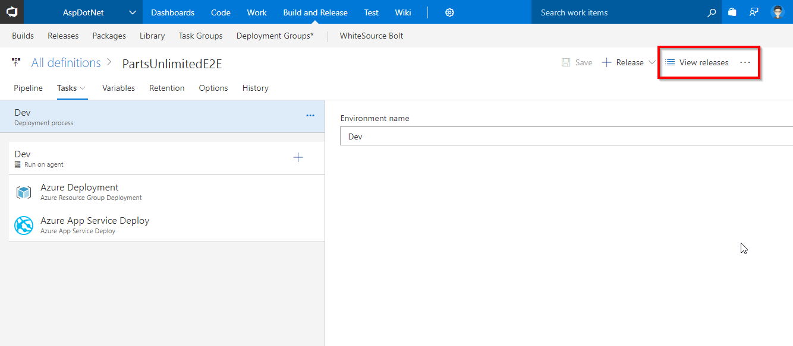

1. To view the release summary for the environment, double=click on the environment blocks displayed in the report.

   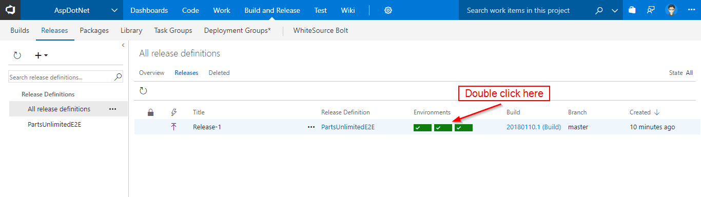

   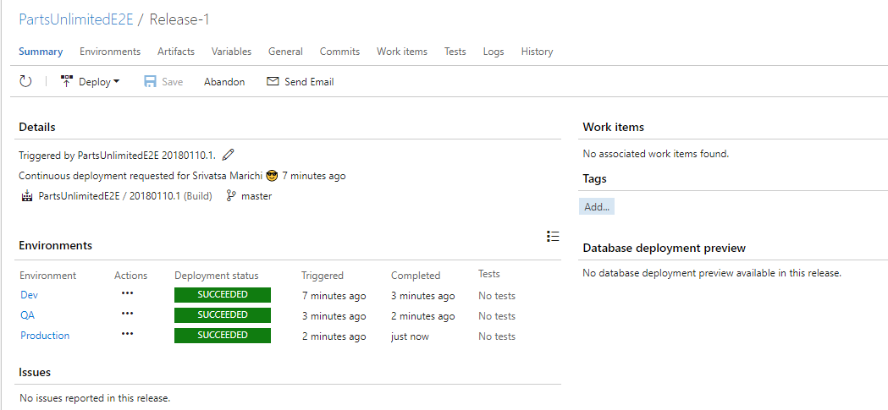

1. Login to the [Azure Portal](https://portal.azure.com) and search for a **Resource Group** named **ASPDOTNET**.

   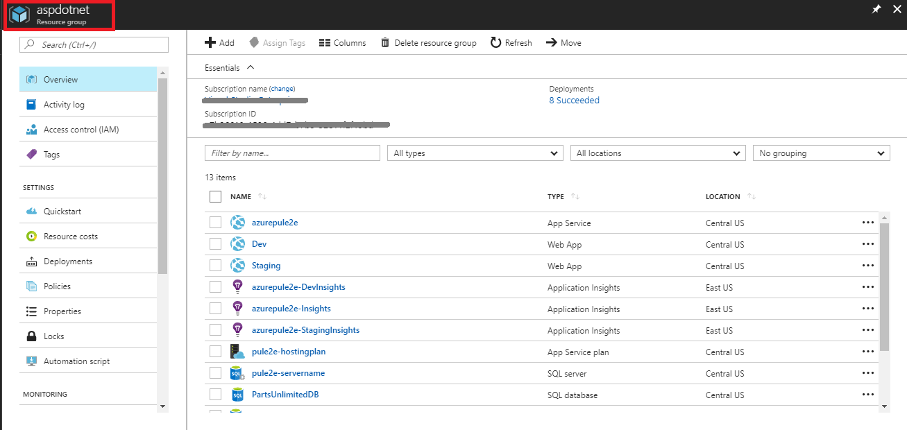

1. Browse to either the deployed Dev or Staging web application from the resource group to validate that the changes have been deployed successfully.

   

## Summary

The **VSTS** simplifies the creation of the continuous integration and continuous delivery pipelines for the application to be deployed to the Azure platform.