<div class="rw-ui-container"></div>

## Overview

The **Azure DevOps Project** simplifies the initial configuration of a continuous integration (CI) and continuous delivery (CD) pipeline for your .NET core or ASP.NET applications in **Visual Studio Team Services (VSTS)**.

## What's covered in this lab?

 In this lab, you will
* Create a new VSTS account with ASP.NET sample using **Azure DevOps Project** feature in Azure
* Examine the CI/CD pipelines configured by **Azure DevOps Project**
* Commit the code changes and execute CI/CD
* Configure Azure Application Insights monitoring

## Pre-requisites for the lab

 1. **Microsoft Azure Account**: You will need a valid and active Azure account for the Azure labs. If you do not have one, you can sign up for a [free trial](https://azure.microsoft.com/en-us/free/){:target="_blank"}

   * If you are a Visual Studio Active Subscriber, you are entitled for a $50-$150 credit per month. You can refer to this [link](https://azure.microsoft.com/en-us/pricing/member-offers/msdn-benefits-details/) to find out more including how to activate and start using your monthly Azure credit.

   * If you are not a Visual Studio Subscriber, you can sign up for the FREE [Visual Studio Dev Essentials](https://www.visualstudio.com/dev-essentials/)program to create **Azure free account** (includes 1 year of free services, $200 for 1st month).


## Exercise 1: Setting up Sample ASP.NET project using Azure DevOps Project


1. Sign into the [Microsoft Azure portal](https://portal.azure.com).

1. Choose the **+ Create a resource** icon in the left navigation bar, then search for **DevOps project**. Then choose **DevOps Project** in the list and click on **Create**

    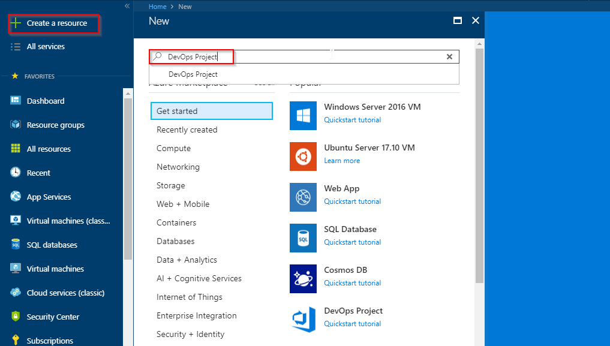

    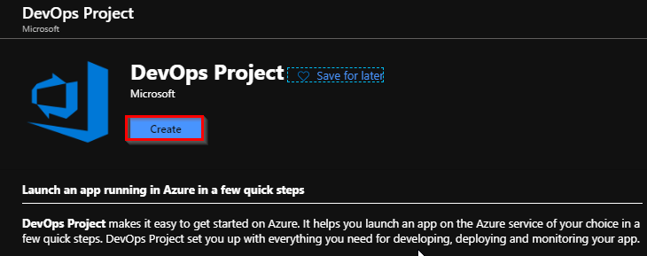

1. Select the **.NET** sample application. The .NET samples include a choice of either the open source ASP.NET framework or the cross-platform .NET Core framework.

   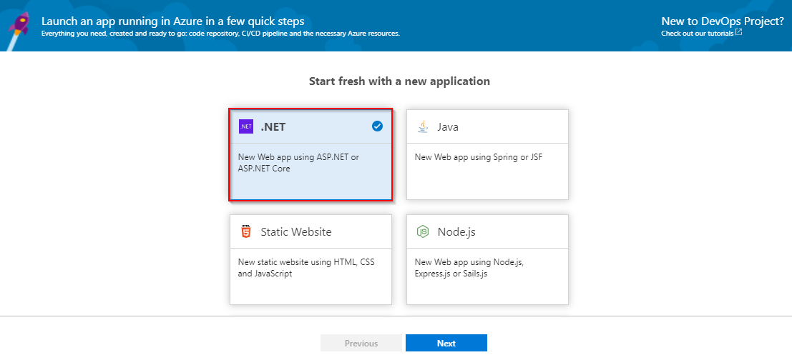


1. Select the .NET Core application framework. This sample is an ASP.NET Core MVC application. When you're done, choose **Next**.

   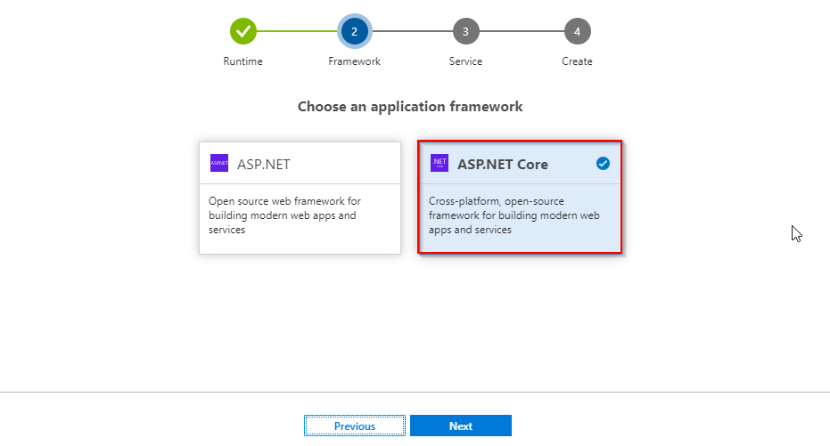

1. Select the **target service** to deploy as **Azure Virtual Machine**. When you're done, choose **Next**.

   

1. You can create a free **new VSTS** account or use an **existing account**. In this lab let us create **new VSTS account**. Choose a name for your VSTS **account** and **project**. Select your **Azure subscription**, and choose a **name** for your virtual machine. When you're done, choose **Done**.

    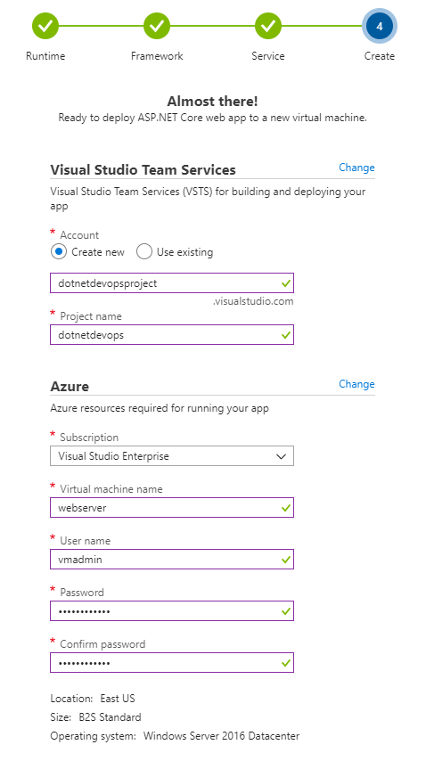

1. In a few minutes, the **project dashboard** loads in the Azure portal. A sample application is set up in a repository in your VSTS account, a build executes, and your application deploys to Azure Virtual Machine. This dashboard provides visibility into your **code repository, VSTS CI/CD pipeline**, and your **application in Azure virtual machine**.

    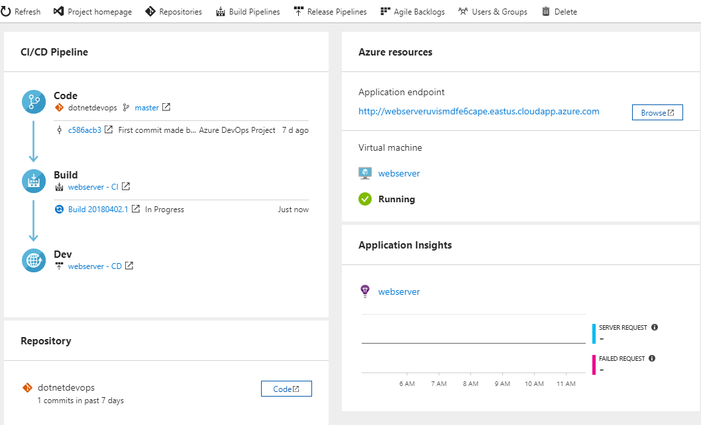

1.   On the right side of the dashboard, select **Browse** to view your running application.

     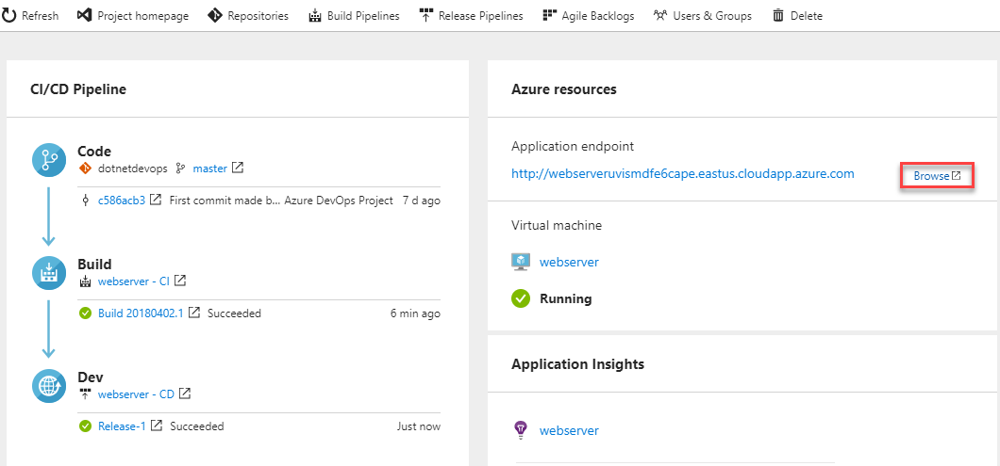


      The web app look like as shown in below figure    
    
 
     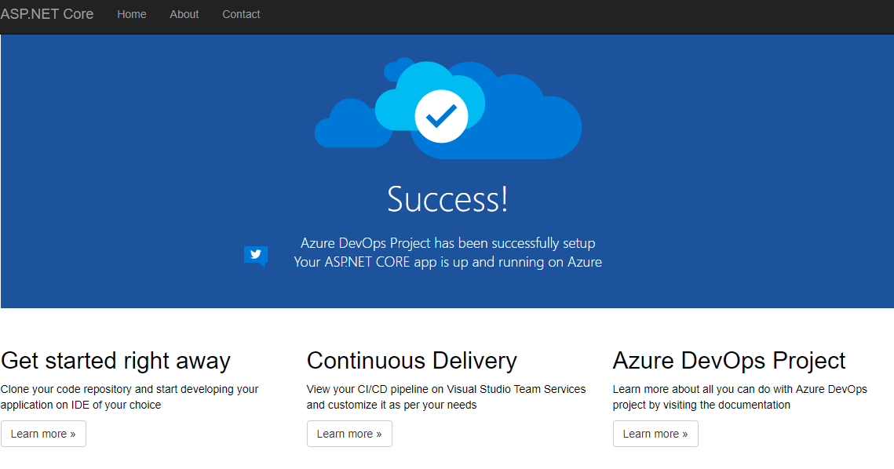

     The **Azure DevOps project** automatically configures a CI build and release trigger and Deploys application to the azure virtual machine. You're now ready to collaborate with a team on a ASP.NET Core app with a CI/CD process that automatically deploys your latest work to your web site.

## Exercise 2: Examine the VSTS CI/CD pipelines configured by Azure DevOps Project
  The Azure DevOps project automatically configured a full VSTS CI/CD pipeline in your VSTS account. You can explore and customize the pipeline as needed. Follow the steps below to familiarize yourself with the VSTS build and release definitions.

  1. Select **Build Pipelines** from the top of the Azure DevOps project dashboard. This link opens a browser tab and opens the VSTS build definition for your new project.

     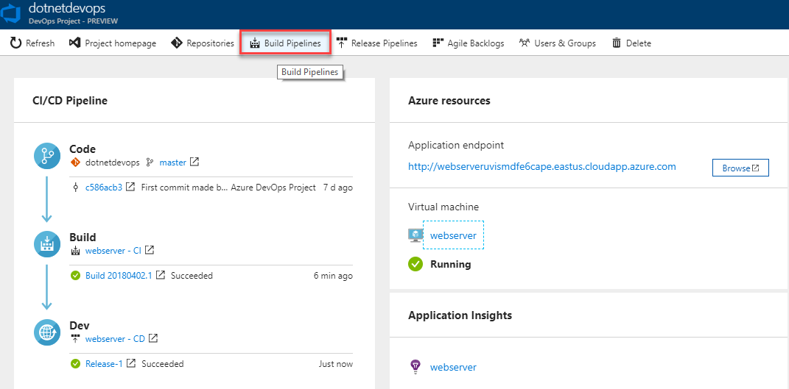


1. Select the **ellipsis** that appears. This action opens a menu where you can perform several activities such as queue a new build, pause a build, and edit the build definition. Select **Edit**.
      
    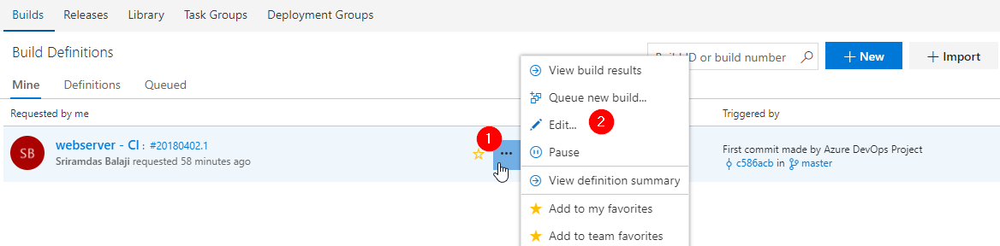

1. From this view, **examine the various tasks** for your build definition. The build performs various tasks such as fetching sources from the Git repository, restoring dependencies, and publishing outputs used for deployments.

    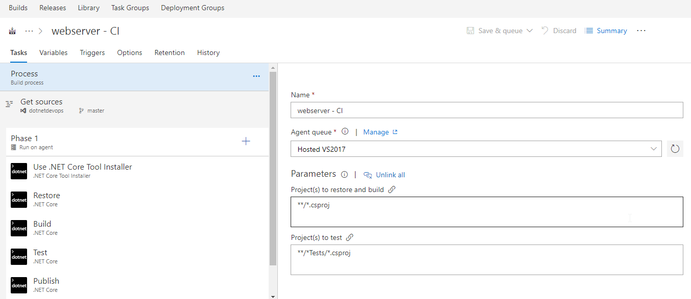

1. At the top of the build definition, select the **build definition name**. Change the name of your build definition to something more descriptive. Select **Save & queue**, then select **Save**.

    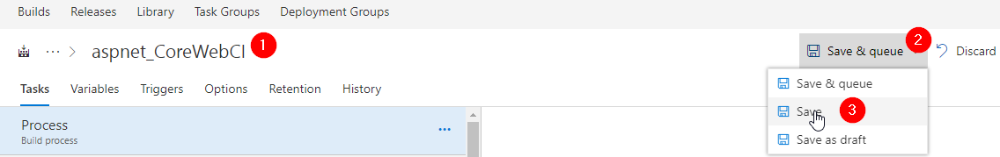

1. Under your build definition name, select **History**. You see an audit trail of your recent changes for the build. VSTS keeps track of any changes made to the build definition, and allows you to compare versions.

   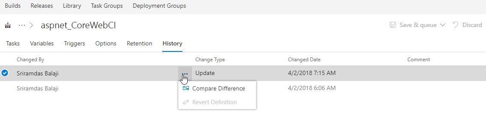
   
1. Select **Triggers**. The Azure DevOps project automatically created a CI trigger, and every commit to the repository initiates a new build. You can optionally choose to include or exclude branches from the CI process.

   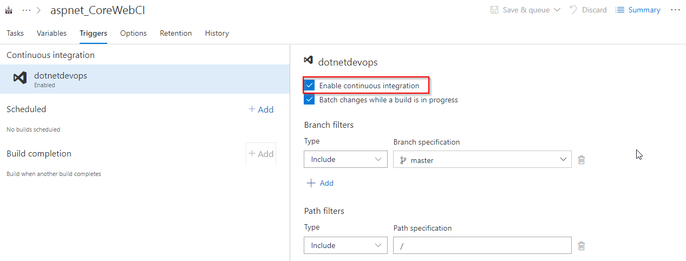

1. Select **Retention**. Based on your scenario, you can specify policies to keep or remove a certain number of builds.

1. Select **Build and Release**, then choose **Releases**. The Azure DevOps project created a VSTS release definition to manage deployments to Azure.

   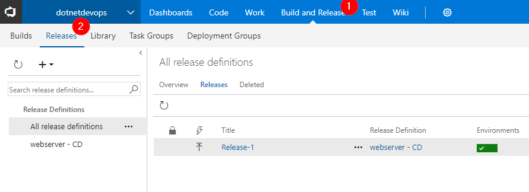

1. On the left-hand side of the browser, select the **ellipsis** next to your release definition, then choose **Edit**.

   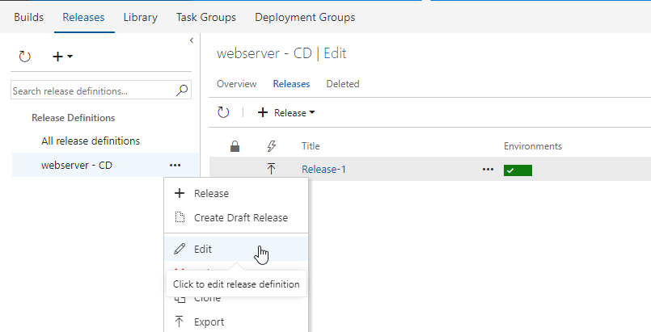

1. The release definition contains a **pipeline**, which defines the release process. Under **Artifacts**, select **Drop**. The build definition you examined in the previous steps produces the output used for the artifact.

    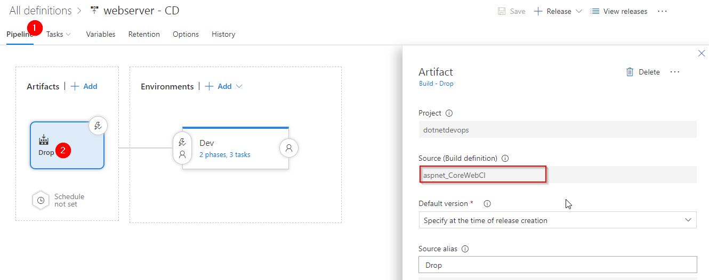

1. To the right-hand side of the **Drop** icon, select the **Continuous deployment trigger**. This release definition has an enabled CD trigger, which executes a deployment every time there is a new build artifact available. Optionally, you can disable the trigger, when your deployments require manual execution.

    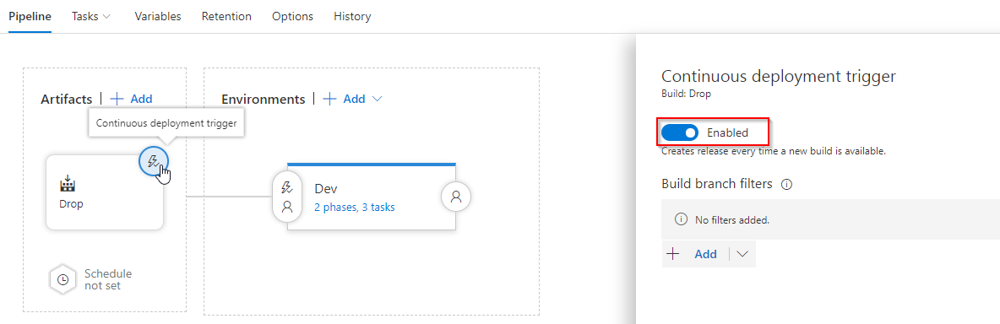


1. Select **Tasks**. The tasks are the activities your deployment process performs. In this example, you have three tasks with two [phases](https://docs.microsoft.com/en-us/vsts/build-release/concepts/process/phases?view=vsts).

     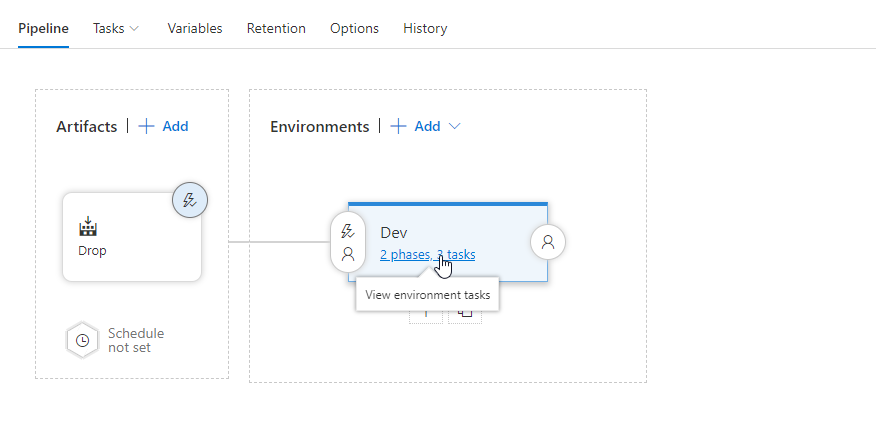

    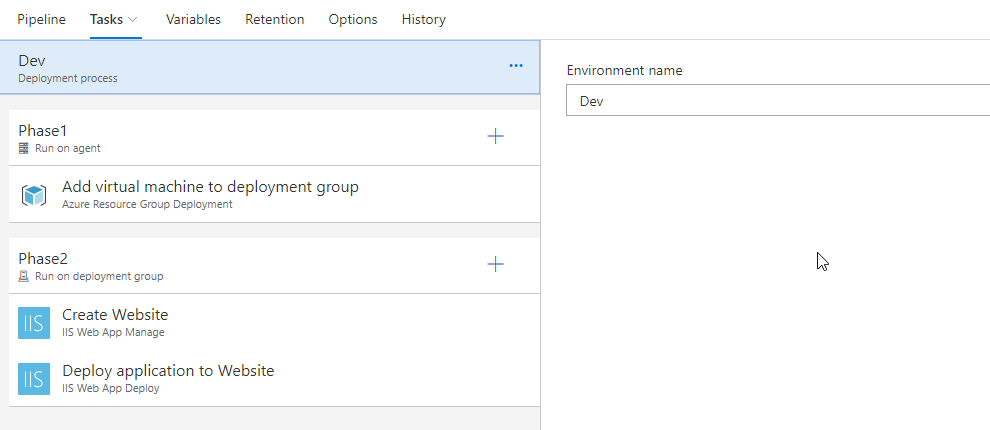

    **Phase 1**:  In this phase a task is added to add the virtual machine deployed using **Azure Devops project** to [Deployment Group](https://docs.microsoft.com/en-us/vsts/build-release/concepts/definitions/release/deployment-groups/?view=vsts). A deployment group is a logical set of deployment target machines that have agents installed on each one.

    **Pahse 2**: In this phase two tasks are added. One is to **Create a website** in virtual machine and the other is to **Deploy application to website**.

1. On the right-hand side of the browser, select **View releases**. This view shows a history of releases.

    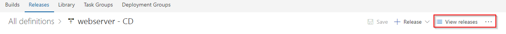


    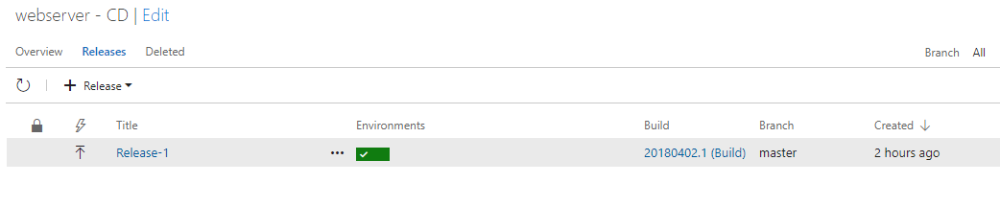

1. Select the **ellipsis** next to one of your releases, and choose **Open**. There are several menus to explore from this view such as a release summary, associated work items, and tests.

    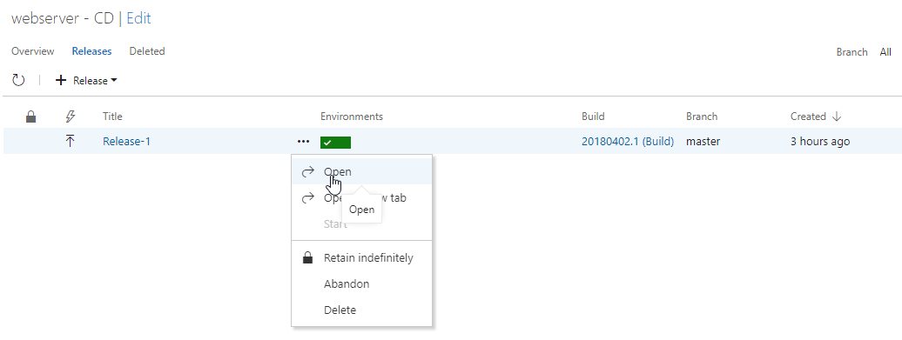

    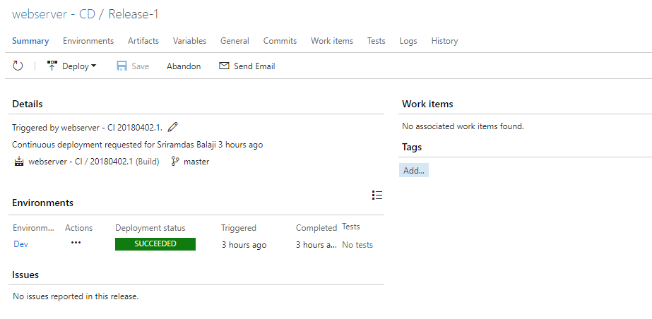
1.  Select **Logs**. The logs contain useful information about the deployment process. They can be viewed both during and after deployments.

     

## Exercise 3: Commit the code changes and execute CI/CD

The Azure DevOps project created a Git repository in your VSTS account. Follow the steps below to view the repository and make code changes to your application.

1. Click on **Code** tab to view the created Git repository by Azure DevOps project.

     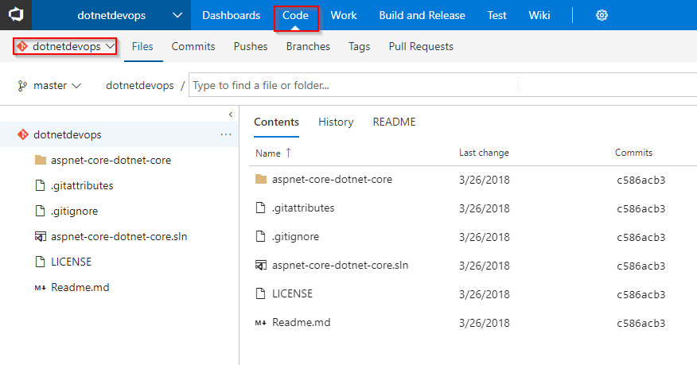

1. To view the repository clone URL, select **Clone** from the top right of the browser. You can clone your Git repository in your favorite IDE. In this lab, you can use the web browser to make and commit code changes directly to the master branch.

     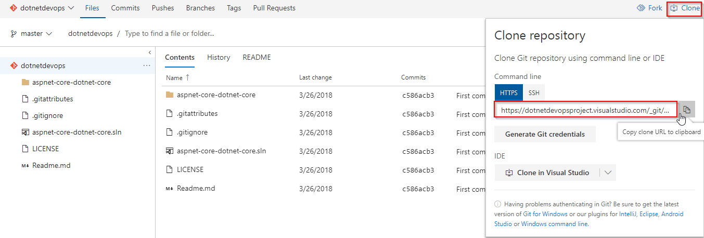

1. On the left-hand side of the browser, navigate to the **aspnet-core-dotnet-core/Views/Home/Index.cshtml** file. Select **Edit**, and make a change. For example, add a new description line as shown in below figure.
         
    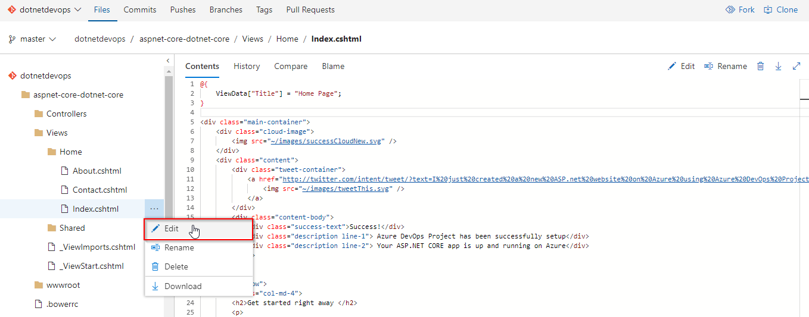
For example, add a new description line as shown in below figure.
      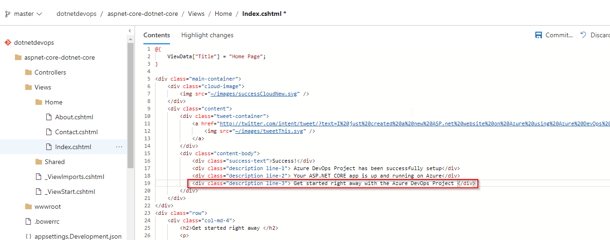
    ```csharp
         <div class="description line-3"> Get started right away with the Azure DevOps Project </div>

1. Choose **Commit**, to save and checkin your changes.

      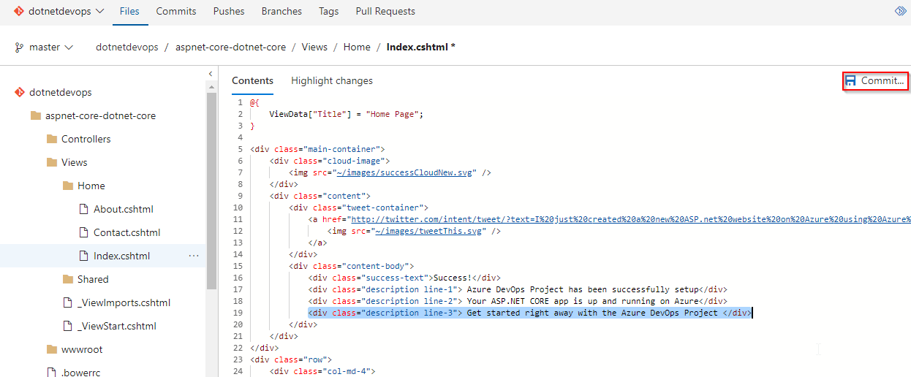

1. In your browser, navigate to the **Builds**. You should now see a build is in progress. The changes you just made are automatically built and deployed via a VSTS CI/CD pipeline.

    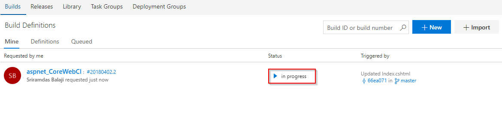

1. Once the Build and Release is completed in your browser, navigate to the **Azure DevOps project dashboard**. On the right side of the dashboard, select **Browse** to view your updated running application. You will the updated decription line in the web app.

   

   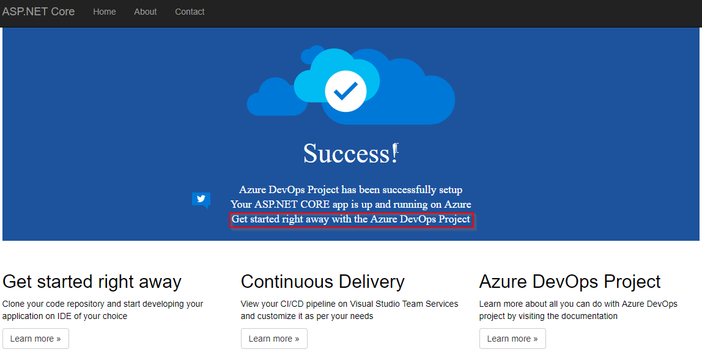

## Exercise 4: Configure Azure Application Insights monitoring

With Azure Application insights, you can easily monitor your application's performance and usage. The Azure DevOps project automatically configured an Application Insights resource for your application. You can further configure various alerts and monitoring capabilities as needed.

1. Navigate to the **Azure DevOps Project** dashboard in the Azure portal. On the bottom-right of the dashboard, choose the **Application Insights** link for your app.

   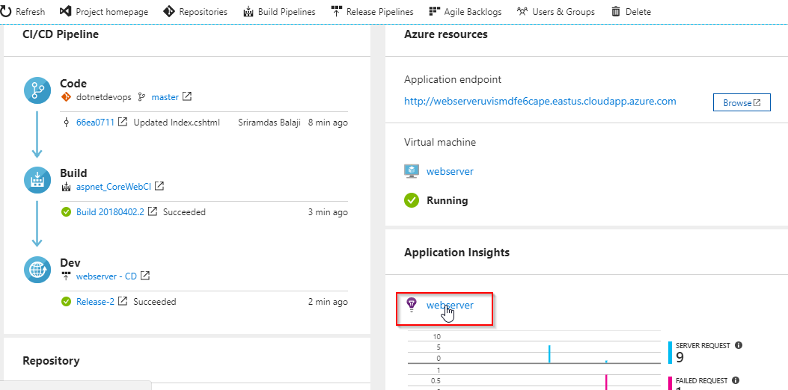

1. The **Application Insights** blade opens in the Azure portal. This view contains usage, performance, and availability monitoring information for your app.

   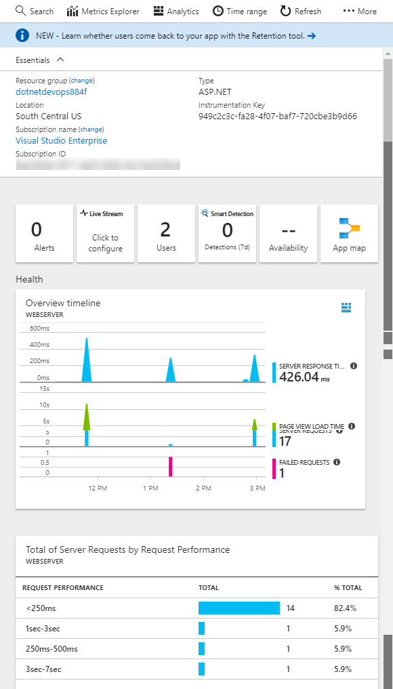

1. Select **Time range**, and then choose **Last hour**. Select Update to filter the results. You now see all activity from the last 60 minutes. Select the **x** to exit time range.

1. **Configure alerts** :Azure Application Insights can alert you to changes in performance or usage metrics in your web app. Select **Alerts**, then select **+ Add metric alert**.

   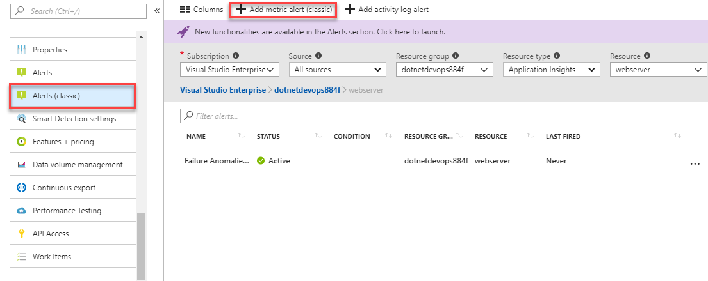

1. Enter a **Name** for the alert rule. Choose your App Service resource. The default alert is for a **server response time greater than 1 second**. Select the **Metric** drop-down to examine the various alert metrics. You can easily configure a variety of alerts to improve the monitoring capabilities of your app.

   Select the check-box for **Notify via Email owners, contributors, and readers** to get email notifications. Optionally, you can perform additional actions when an alert fires by executing an Azure logic app.

    
      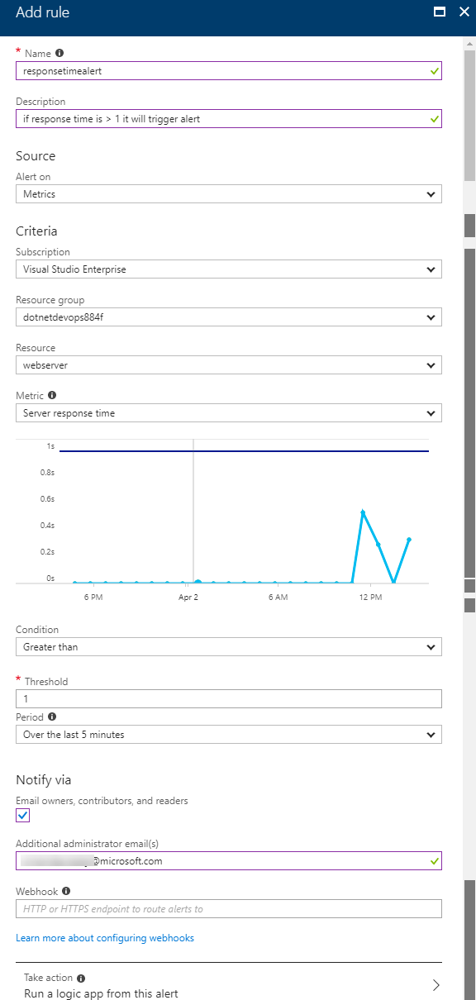

1. Choose **Ok** to create the alert. In a few moments, the alert appears as active on the dashboard. Exit the Alerts area, and navigate back to the **Application Insights blade**.

   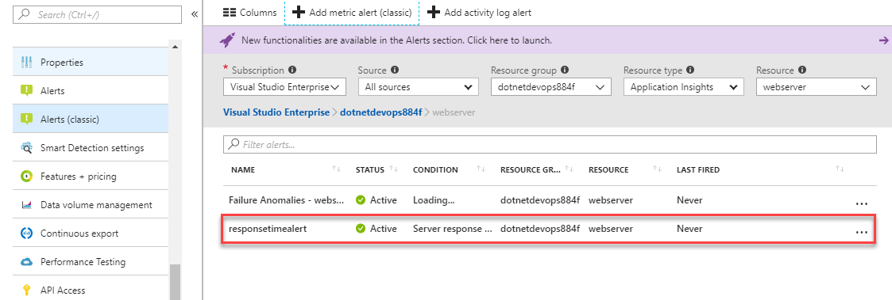

1. **Configure Availability test**: After you've deployed your web app or web site to any server, you can set up tests to monitor its **availability** and **responsiveness**. **Azure Application Insights** sends web requests to your application at regular intervals from points around the world. It alerts you if your application doesn't respond, or responds slowly.

1. Select **Availability**, then select **+ Add test**.

     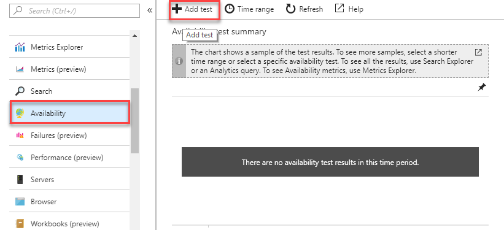

1. Enter a **Test name**, then choose **Create**. A simple ping test is created to verify the availability of your application. After a few minutes, test results are available, and the Application Insights dashboard displays an availability status. For more information on Monitor availability and responsiveness of web site click [here](https://docs.microsoft.com/en-us/azure/application-insights/app-insights-monitor-web-app-availability).

    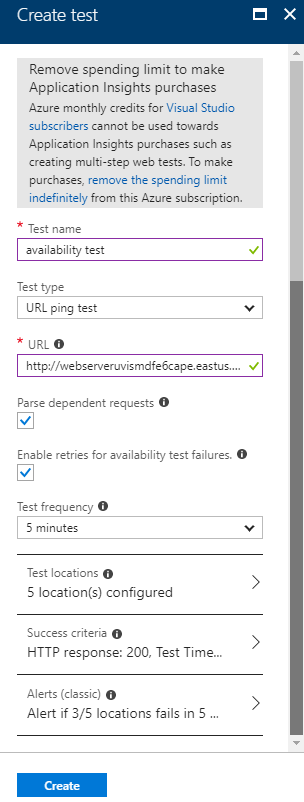
