# Deploying Azure Functions using VSTS

## Overview
<!---
Azure Functions is a [serverless](https://azure.microsoft.com/overview/serverless-computing/) compute service that enables you to run code on-demand without having to explicitly provision or manage infrastructure. We can have Azure Functions to run a script or piece of code in response to a variety of events.

OR --->

Azure Functions is an event driven, compute-on-demand experience that extends the existing Azure application platform with capabilities to implement the code triggered by events occurring in Azure or third-party service as well as on-premises systems. Azure Functions allows developers to take action by connecting to data sources or messaging solutions thus making it easy to process and react to events. Developers can leverage Azure Functions to build HTTP-based API endpoints accessible by a wide range of applications, mobile and IoT devices.
 
**Scenario for the lab:** In this lab, we are using a fictional eCommerce website - PartsUnlimited. The PartsUnlimited team decides to roll out a new feature called **special discount for *employees of PartsUnlimited*** and a **different discount for *general users***. In this lab, we will implement a .Net Core Web API which will contain information about products and price (including discounts) and an Azure Functions which acts as a switching mechanism to return different (discount) information based on the user logged in to the application.

 ## What is covered in this lab?

 In this lab, you will

* Provision a Team Services project with application data using DemoGenerator system.
* Clone the PartsUnlimited solution from the created Team Project
* Create API project in the PartsUnlimited solution
* Set Up Azure functions in portal
* Create Azure Functions project in the PartsUnlimited solution
* Update website to retrieve special discounted products based on the login from API
* Setup a build definition to build and test the code
* Setup Azure Web App and configure a CD pipeline in VSTS for Website, API and Azure Functions

## Pre-requisites for the lab

1. **Microsoft Azure Account**: You will need a valid and active Azure account for the Azure labs. If you do not have one, you can sign up for a [free trial](https://azure.microsoft.com/en-us/free/){:target="_blank"}

   * If you are a Visual Studio Active Subscriber, you are entitled for a $50-$150 credit per month. You can refer to this [link](https://azure.microsoft.com/en-us/pricing/member-offers/msdn-benefits-details/) to find out more including how to activate and start using your monthly Azure credit.

   * If you are not a Visual Studio Subscriber, you can sign up for the FREE [Visual Studio Dev Essentials](https://www.visualstudio.com/dev-essentials/)program to create **Azure free account** (includes 1 year of free services, $200 for 1st month).

1. You will need a **Visual Studio Team Services Account**. If you do not have one, you can sign up for free [here](https://www.visualstudio.com/products/visual-studio-team-services-vs)

1. You will need a **Personal Access Token** to set up your project using the Demo Generator. Please see this [article](https://docs.microsoft.com/en-us/vsts/accounts/use-personal-access-tokens-to-authenticate) for instructions to create your token.

    You should treat Personal Access Tokens like passwords. It is recommended that you save them somewhere safe so that you can re-use them for future requests.

1. Visual Studio 2017 version 15.4 or later  with [.Net Core SDK](https://www.microsoft.com/net/learn/get-started/windows#windows) and [Azure Development Tools for Visual Studio](https://docs.microsoft.com/en-us/azure/azure-functions/functions-develop-vs) are installed.

## Setting up the Environment

1. Click **Deploy To Azure** to provision an Azure App service plan with two web apps.

   [](https://portal.azure.com/#create/Microsoft.Template/uri/https%3A%2F%2Fraw.githubusercontent.com%2Fsriramdasbalaji%2FAzureFunctions%2Fmaster%2Farm%2520template%2Fazuredeploy.json)

1. It should take approximately 5-10 minutes to provision the resources. Once the deployment is successful, you will see the resources as shown.

   


## Setting up the VSTS team project

1. Use the [VSTS Demo Generator](https://vstsdemobuildertest.azurewebsites.net/) to provision the project on your VSTS account.

   > **VSTS Demo Generator** helps you create team projects on your VSTS account with sample content that include source code, work items,iterations, service endpoints, build and release definitions based on the template you choose during the configuration.

   

    This URL will automatically select **AzureFunctions** template in the demo generator. If you want to try other projects, use this URL instead -[https://vstsdemogenerator.azurewebsites.net/](https://vstsdemogenerator.azurewebsites.net/)

1. Once the project is provisioned, click the URL to navigate to the project.

   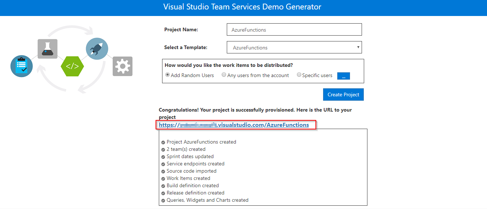


## Exercise 1: Cloning an existing repository

1. Sign in to your **Visual Studio Team Services** account and browse to **AzureFunctions** project (project provisioned by VSTS Demo generator).

   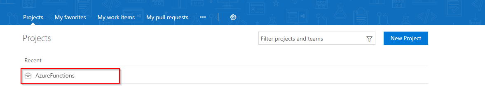

2. Navigate to the **Code** hub. Select **Clone** and select **Clone in Visual Studio**

     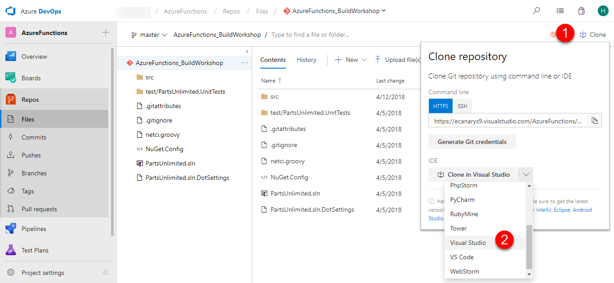

3. An instance of **Visual Studio** opens and you might be prompted to sign into to your account. Sign in to your account

4. Set the local path where you want the local repository to be placed and select **Clone**.

     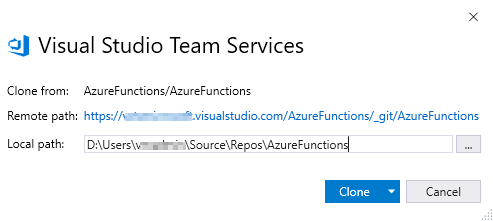

5. In Team Explorer under **Solutions**, you will see the list of solutions within the local git folder and double click on **PartsUnlimited.sln** to open the project.

     

## Exercise 2:  Create API for discounts

 In this exercise, you will create two versions of an API. The first API to display the products with price for public/general user of the site, the second one with more discounts for employees.

 1. *Create a new API project in **PartsUnlimited** solution* - Right click on solution, then click on **Add** and select **New Project...**

 2. Select **Web** under "Visual C#" category, select **ASP.NET Core Web Application (.NET Core)** as the type of this project, enter **PartsUnlimited.API** in the name field and append **\src** at the end in the **Location** field, then click on "OK".

     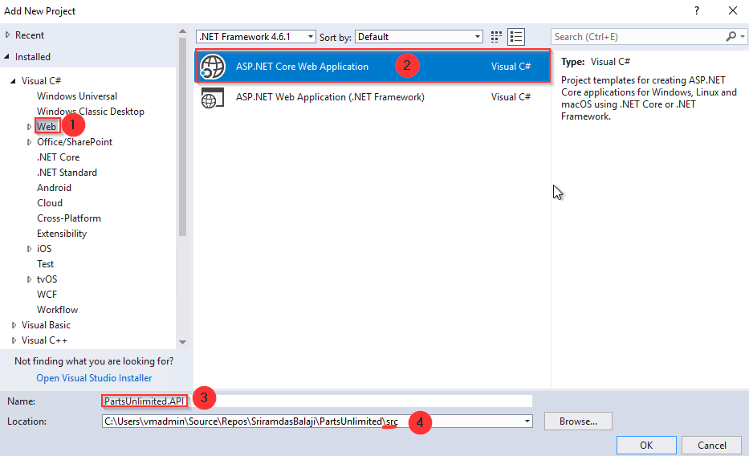

3. Select **Web API** template, and click on "OK".
 
   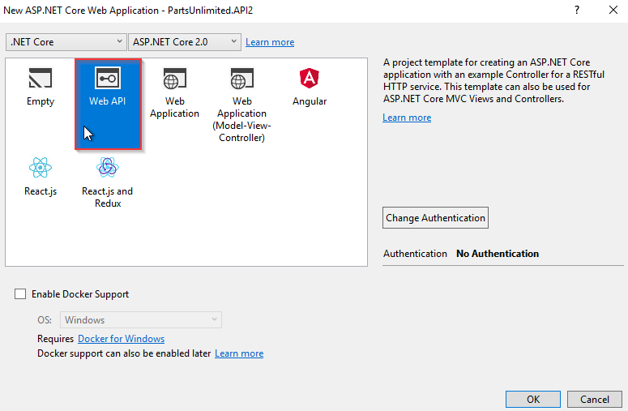

4. *Reference PartsUnlimited.Models from your API project* - Right click on your API project's **Dependencies**, then click on **Add Reference...**.

   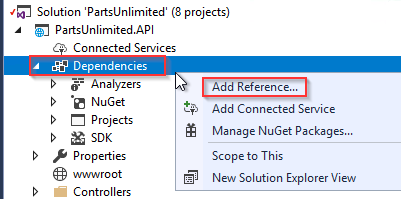

5. Tick a box next to **PartsUnlimited.Models** and click on **OK**.

    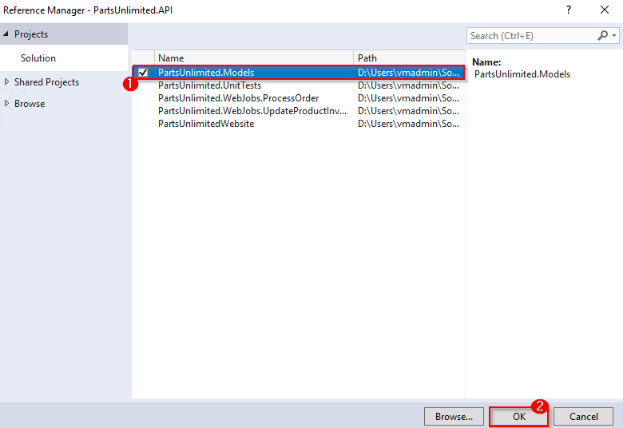

6.  *Define the original API* - Right click on **Controllers** folder, click on **Add**, then select **Class**.
   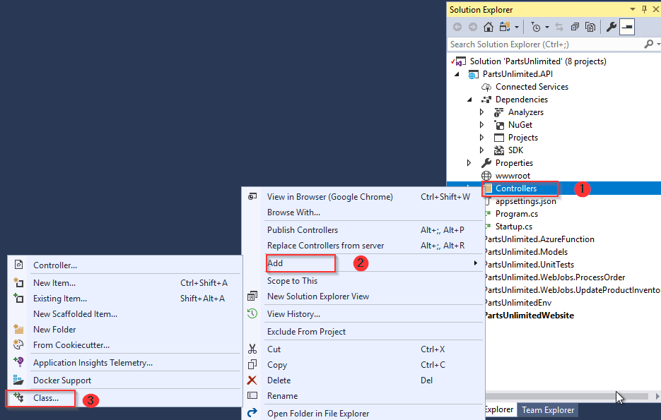

7. Enter **SpecialsController.cs** as the name of this class and click on **Add**.

8. Replace class with the following code:

```csharp
     using System.Collections.Generic;
     using Microsoft.AspNetCore.Mvc;
     using PartsUnlimited.Models;

namespace PartsUnlimited.API.Controllers
{
    [Route("api/v1/specials")]
    public class SpecialsController : Controller
    {
        [HttpGet("{id}")]
        public IEnumerable<Product> GetSpecialsByUserId(int id)
        {
            var productsOnSpecial = new List<Product>
            {
                new Product
                {
                    SkuNumber = "OIL-0001",
                    Title = "Filter Set V1",
                    CategoryId = 5,
                    Price = 28.99M,
                    Discount="10%",
                    SalePrice = 28.99M,
                    ProductArtUrl = "https://raw.githubusercontent.com/Microsoft/PartsUnlimited/master/src/PartsUnlimitedWebsite/images/product_oil_filters.jpg",
                    ProductDetails = "{ \"Filter Type\" : \"Canister and Cartridge\", \"Thread Size\" : \"0.75-16 in.\", \"Anti-Drainback Valve\" : \"Yes\"}",
                    Description = "Ensure that your vehicle's engine has a longer life with our new filter set. Trapping more dirt to ensure old freely circulates through your engine.",
                    Inventory = 3,
                    LeadTime = 0,
                    RecommendationId = 16
                },
                new Product
                {
                    SkuNumber = "OIL-0002",
                    Title = "Oil and Filter Combo V1",
                    CategoryId = 5,
                    Price = 34.49M,
                    Discount="10%",
                    SalePrice = 34.49M,
                    ProductArtUrl = "https://raw.githubusercontent.com/Microsoft/PartsUnlimited/master/src/PartsUnlimitedWebsite/images/product_oil_oil-filter-combo.jpg",
                    ProductDetails = "{ \"Filter Type\" : \"Canister\", \"Thread Size\" : \"0.75-16 in.\", \"Anti-Drainback Valve\" : \"Yes\", \"Size\" : \"1.1 gal.\", \"Synthetic\" : \"No\" }",
                    Description = "This Oil and Oil Filter combo is suitable for all types of passenger and light commercial vehicles. Providing affordable performance through excellent lubrication and breakdown resistance.",
                    Inventory = 5,
                    LeadTime = 0,
                    RecommendationId = 17
                },
                new Product
                {
                    SkuNumber = "OIL-0003",
                    Title = "Synthetic Engine Oil V1",
                    CategoryId = 5,
                    Price = 36.49M,
                    Discount="10%",
                    SalePrice = 36.49M,
                    ProductArtUrl = "https://raw.githubusercontent.com/Microsoft/PartsUnlimited/master/src/PartsUnlimitedWebsite/images/product_oil_premium-oil.jpg",
                    ProductDetails = "{ \"Size\" :  \"1.1 Gal.\" , \"Synthetic \" : \"Yes\"}",
                    Description = "This Oil is designed to reduce sludge deposits and metal friction throughout your cars engine. Provides performance no matter the condition or temperature.",
                    Inventory = 11,
                    LeadTime = 0,
                    RecommendationId = 18
                }
            };
            return productsOnSpecial;
        }
    }
}

```

9. *Define an API with a new feature* -
Similarly create a new class under Controllers, name it **V2SpecialsController.cs** and copy the following code into it:

```csharp
using System.Collections.Generic;
using Microsoft.AspNetCore.Mvc;
using PartsUnlimited.Models;

namespace PartsUnlimited.API.Controllers
{
    [Route("api/v2/specials")]
    public class V2SpecialsController : Controller
    {
        [HttpGet("{id}")]
        public IEnumerable<Product> GetSpecialsByUserId(int id)
        {
            var productsOnSpecial = new List<Product>
            {
                new Product
                {
                    SkuNumber = "OIL-0001",
                    Title = "Filter Set V2",
                    CategoryId = 5,
                    Price = 28.99M,
                    Discount="30%",
                    SalePrice = 28.99M,
                    ProductArtUrl = "https://raw.githubusercontent.com/Microsoft/PartsUnlimited/master/src/PartsUnlimitedWebsite/images/product_oil_filters.jpg",
                    ProductDetails = "{ \"Filter Type\" : \"Canister and Cartridge\", \"Thread Size\" : \"0.75-16 in.\", \"Anti-Drainback Valve\" : \"Yes\"}",
                    Description = "Ensure that your vehicle's engine has a longer life with our new filter set. Trapping more dirt to ensure old freely circulates through your engine.",
                    Inventory = 3,
                    LeadTime = 0,
                    RecommendationId = 16
                },
                new Product
                {
                    SkuNumber = "OIL-0002",
                    Title = "Oil and Filter Combo V2",
                    CategoryId = 5,
                    Price = 34.49M,
                    SalePrice = 34.49M,
                    Discount="30%",
                    ProductArtUrl = "https://raw.githubusercontent.com/Microsoft/PartsUnlimited/master/src/PartsUnlimitedWebsite/images/product_oil_oil-filter-combo.jpg",
                    ProductDetails = "{ \"Filter Type\" : \"Canister\", \"Thread Size\" : \"0.75-16 in.\", \"Anti-Drainback Valve\" : \"Yes\", \"Size\" : \"1.1 gal.\", \"Synthetic\" : \"No\" }",
                    Description = "This Oil and Oil Filter combo is suitable for all types of passenger and light commercial vehicles. Providing affordable performance through excellent lubrication and breakdown resistance.",
                    Inventory = 5,
                    LeadTime = 0,
                    RecommendationId = 17
                },
                new Product
                {
                    SkuNumber = "OIL-0003",
                    Title = "Synthetic Engine Oil V2",
                    CategoryId = 5,
                    Price = 36.49M,
                    SalePrice = 36.49M,
                    Discount="30%",
                    ProductArtUrl = "https://raw.githubusercontent.com/Microsoft/PartsUnlimited/master/src/PartsUnlimitedWebsite/images/product_oil_premium-oil.jpg",
                    ProductDetails = "{ \"Size\" :  \"1.1 Gal.\" , \"Synthetic\" : \"Yes\"}",
                    Description = "This Oil is designed to reduce sludge deposits and metal friction throughout your cars engine. Provides performance no matter the condition or temperature.",
                    Inventory = 11,
                    LeadTime = 0,
                    RecommendationId = 18
                }
            };
            return productsOnSpecial;
        }
    }
}
```

 >**Note:** For the purpose of this lab, the new feature here is just modification of text for each product and different discount percentage % for employees on special.

 10. Click on **Changes** section in **Team Explorer** and push the changes to the server by clicking **Commit All and Push** option from the drop down.

      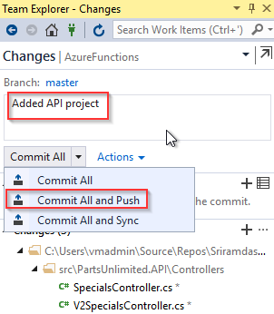

## Exercise 3: Build and Deploy Web and API projects to Azure

In this exercise, we will build and deploy the PartsUnlimited website project and API projects to Azure app services

1. In your VSTS account, click on **Build and Release** hub and select **AzureFunctions-Build** and click on **Edit**

   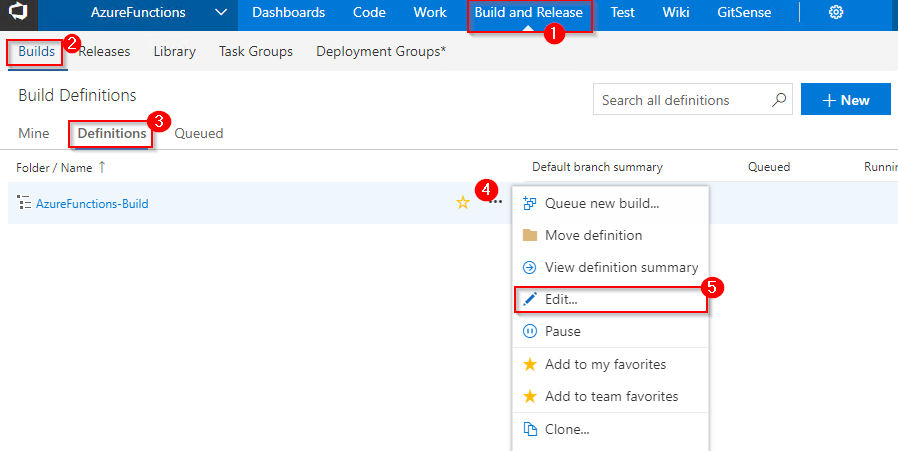

2. Add **src\PartsUnlimited.API\PartsUnlimited.API.csproj** in *Publish Task* and then click on **Save & Queue**. 
You will see a build has been queued. Click on the Build number to see the build progress
    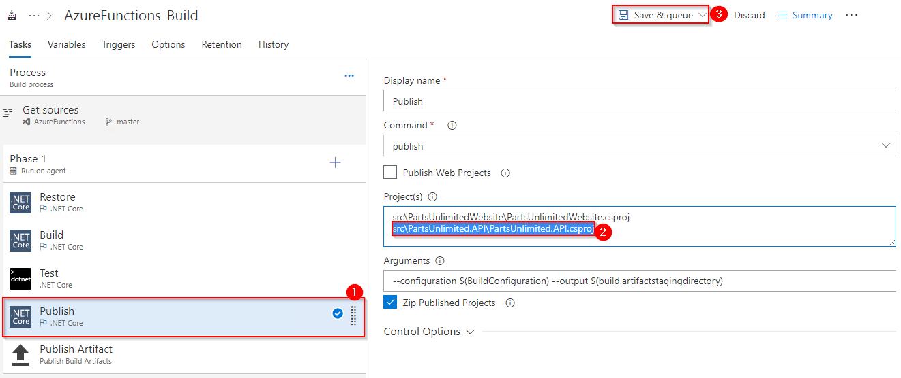

    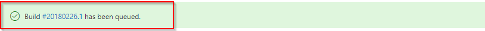

    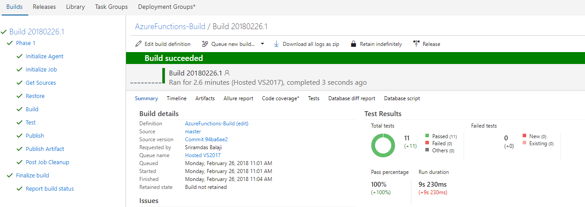

3. Once the Build is succeeded, click on the **Releases** tab. Select **AzureFunctions_Deploy** release definition and click **Edit**

   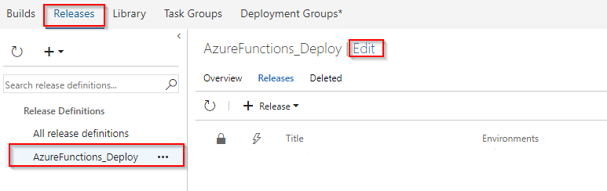

4. Click on **Dev** to view the deployment tasks in the definition

    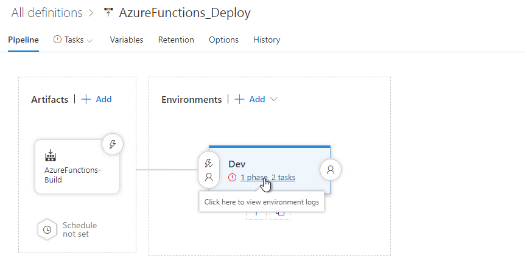
 
   You will see two tasks in the release definition.

   **Deploy Web App**: This task will deploy *Parts unlimited website* project to the Azure App service

   **Deploy API**: This task will deploy *API project* which we have created earlier to the Azure app service.

   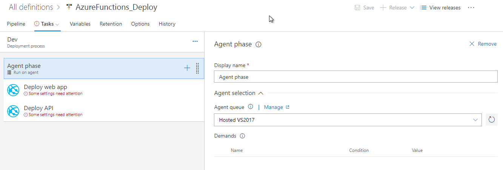

5. Select **Deploy Web app** task and verify you have valid **Azure subscription** selected in the task and select **PartsUnlimited-Web-XXXXXXXX** in App service name which was provisioned earlier by click of **Deploy to Azure** button.


   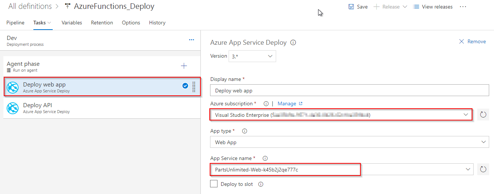

6. Select **Deploy API** task and verify you have valid **Azure subscription** selected in the task and select **PartsUnlimited-API-XXXXXXXX** in App service name which was provisioned using **Deploy to Azure**


   

7. Save the changes and click on **Create Release** and select **Create** on the Create New Release window to trigger the deployment.

   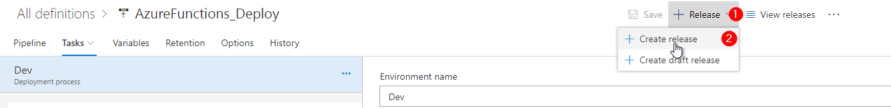

   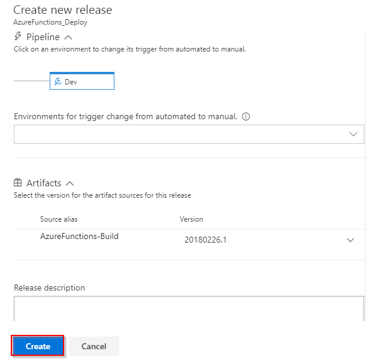
  
8. Open the triggered release to see the deployment progress. 

   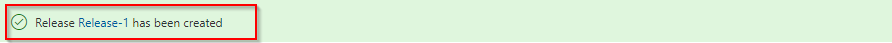

   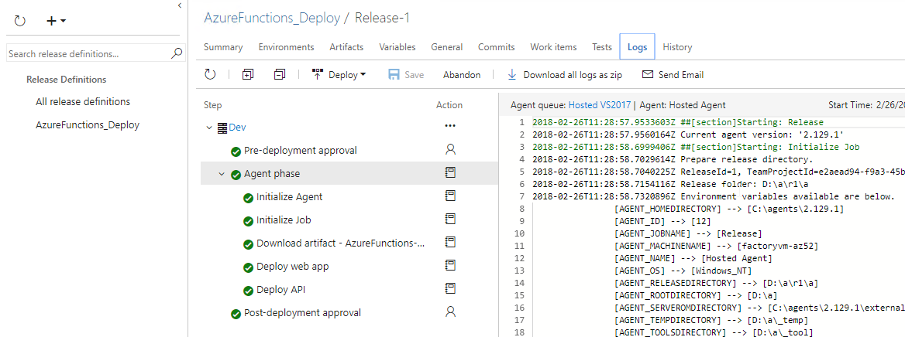

   Once the deployment completes, you can check that the site is deployed successfully by navigating to the site url.

   http://{Your_WebApp_Name}.azurewebsites.net

   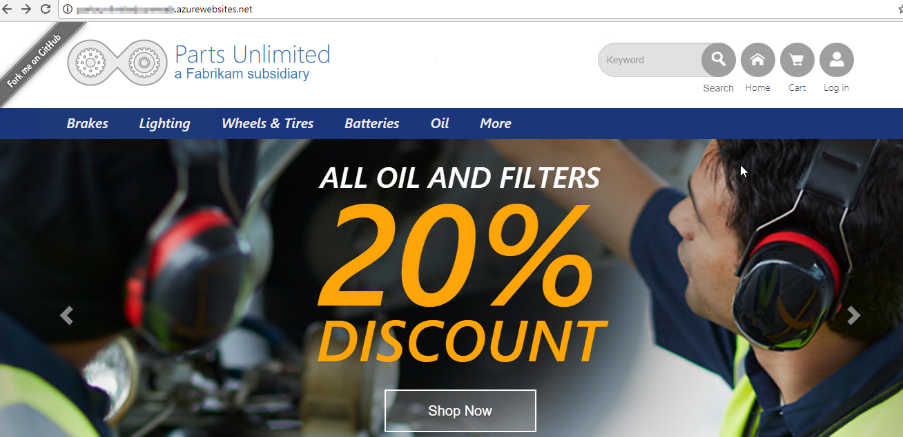

   Click on **Oil** category in the site and view the details of the products. We will see different details on the products once we implement Azure Functions with switching flag in the coming exercises.
   
      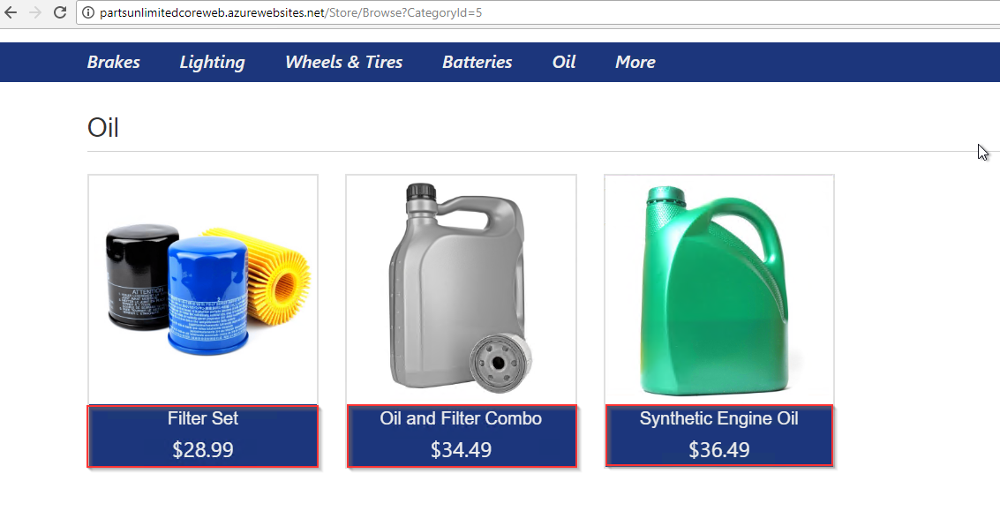

9. To verify that the API project is deployment, copy the API service url ( **http://{API_webapp_name}.azurewebsites.net** ) and 

   - Add **/api/v1/specials/GetSpecialsByUserId?id=1** at the end and see the output of your API. It should return JSON as below

   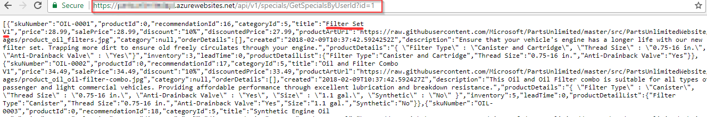

   - Add for V2 **/api/v2/specials/GetSpecialsByUserId?id=1**  at the end and see the output of your API. It should return JSON as below

   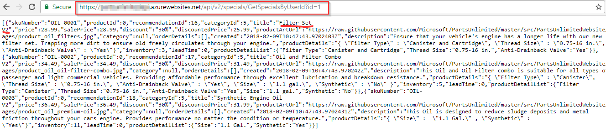


   Note down the URIs, you will need it later for Azure Functions.

## Exercise 4:  Set up an Azure Functions

Azure Functions App is the container that hosts the execution of individual functions. A function app lets you group functions as a logic unit for easier management, deployment, and sharing of resources. In this exercise, we will create **Azure Function App** from Azure portal and then we will create Azure Functions project in PartsUnlimited Solution using Visual Studio.

The [Azure Functions](https://azure.microsoft.com/en-in/services/functions/) created in this exercise will act as a switching proxy or mechanism to send public users to the API v1 and employees to the API v2. This Azure Functions will retrieve data from either API v1 or API v2 based on the user ID.
Although we have used a simple condition here, this could also use more complex rules which could potentially be hidden behind another web api call.

1. Open [Azure Portal](https://portal.azure.com) and login with your account.

2. Click on **Resources Groups**, select the resource group you deployed your API and Web project, then on **Overview** page click on **Add**.

   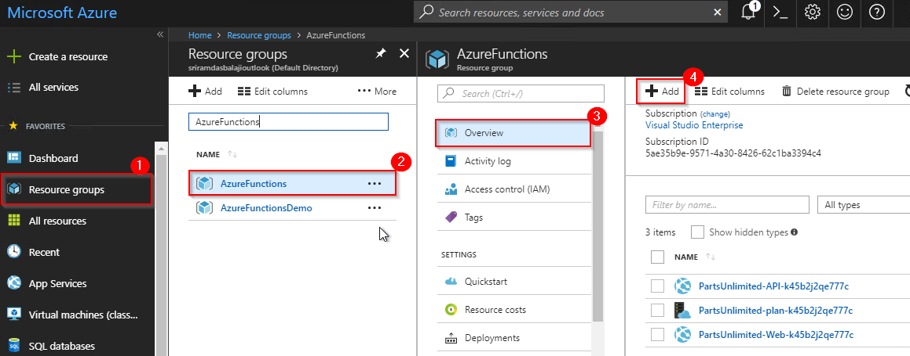

3. Filter down options by typing **Function App**, click on **Function App** option, then on **Create**.

    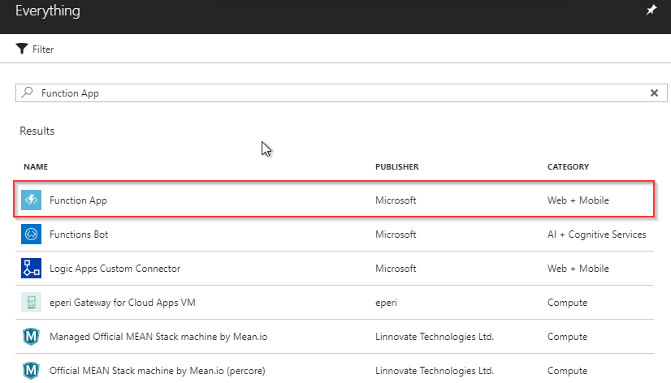

4.  Enter a name for your Function App, choose your subscription, select **App Service Plan** as your **Hosting plan** and click on **Create**.

    

5. Navigate to the resource group where you added your Azure function and click on it.

    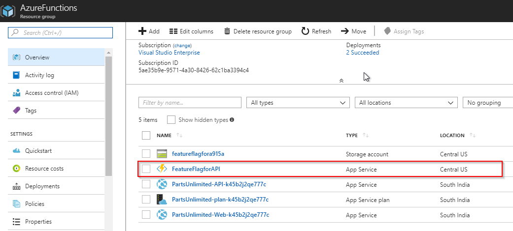

   You can see Function App is deployed successfully and status of the app as *Running*

   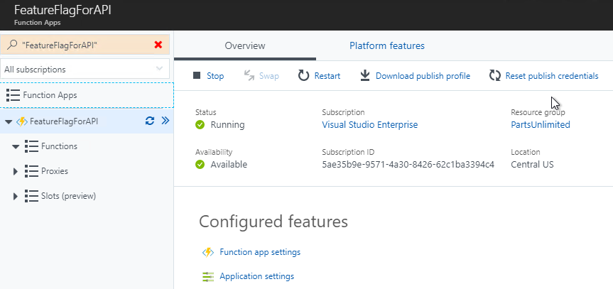

   
6. Select **Functions** in your function app and click on Add icon. Choose scenario as **Webhook+ API**, **C#** language and select **create your own custom function**. Then click on **Create this function**.

   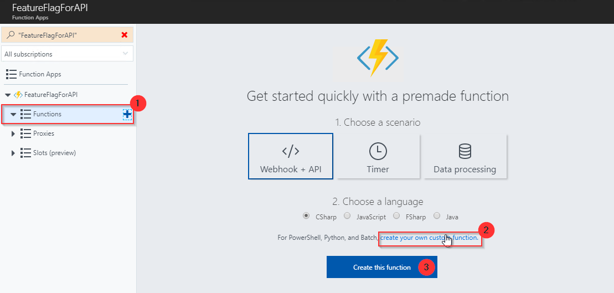
  
7. Select **HTTP trigger**.

    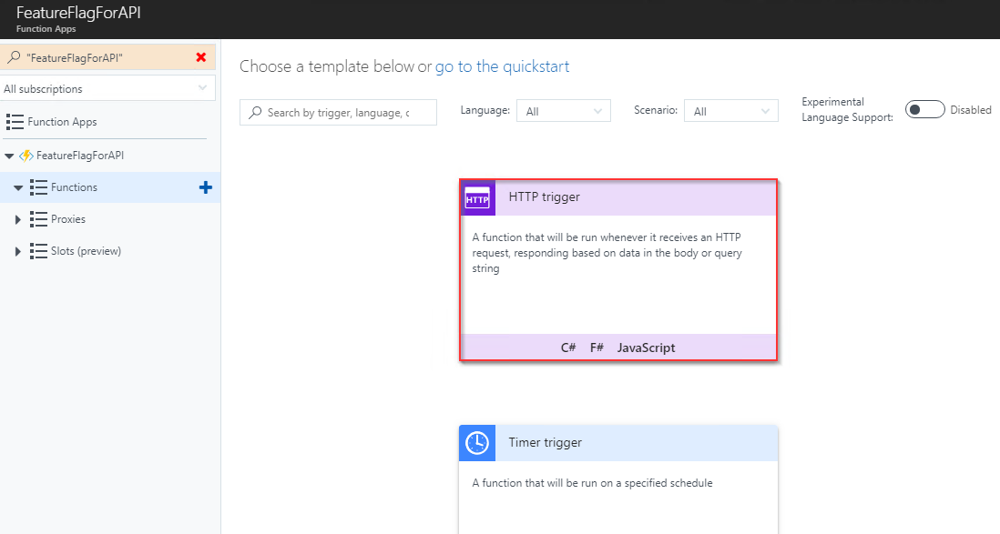

    Enter the details as shown below and click on Create. Select language as **C#** and  for Name enter **SpecialsProxy**

    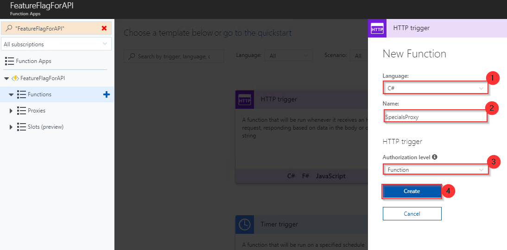

8. Once the Function is created, select the Function and click on **Get Function Url**
   
   

   Copy the URL and save to notepad. You will need this URL later on.

   

9. Now we will create Azure Functions Project using Visual Studio in PartsUnlimited solution. Then we will build and deploy Azure Functions using VSTS. In this Azure Functions Project, we will write code to redirect the API v1/v2 based on the user login. 
Right click on solution, then click on **Add** and select **New Project**.

   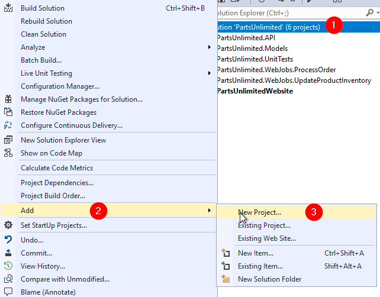

10. Select **Cloud** under **Visual C#** category, select **Azure Functions** as the type of this project, enter **PartsUnlimited.AzureFunction** into the name field and append **\src** at the end of the location, then click on "OK".

     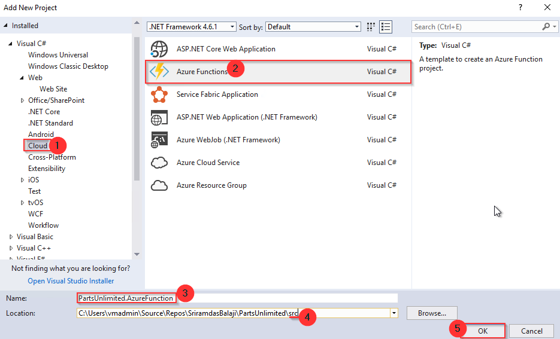

     Select **HttpTrigger** template and click on **OK**
    

    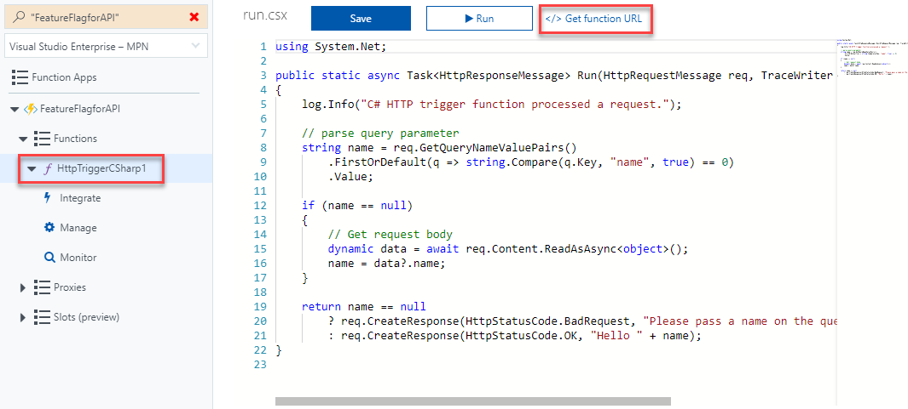

11. Expand the **PartsUnlimited.AzureFunction** project, right click on **Function 1.cs** and select **Rename**. Rename the file as **SpecialsProxy**

    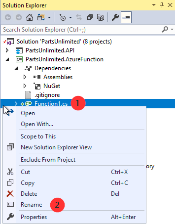

12. Open the **SpecialsProxy.cs** file, replace the existing code with the following code.
 ```csharp
using System;
using System.Linq;
using System.Net;
using System.Net.Http;
using System.Threading.Tasks;
using Microsoft.Azure.WebJobs;
using Microsoft.Azure.WebJobs.Extensions.Http;
using Microsoft.Azure.WebJobs.Host;

namespace PartsUnlimited.AzureFunction
{
    public static class SpecialsProxy
    {
        [FunctionName("SpecialsProxy")]
        public static async Task<HttpResponseMessage> Run([HttpTrigger(AuthorizationLevel.Function, "get", "post", Route = null)]HttpRequestMessage req, TraceWriter log)
        {
            var userIdKey = req.GetQueryNameValuePairs().FirstOrDefault(q => string.Equals(q.Key, "UserId", StringComparison.OrdinalIgnoreCase));
            var userId = string.IsNullOrEmpty(userIdKey.Value) ? int.MaxValue : Convert.ToInt64(userIdKey.Value);
            var url = $"https://YourAppServiceUrl.azurewebsites.net/api/{(userId > 10 ? "v1" : "v2")}/specials/GetSpecialsByUserId?id={userId}";
            using (HttpClient httpClient = new HttpClient())
            {
                return await httpClient.GetAsync(url);
            }
        }
    }
}
```
>1. Replace YourAppServiceUrl in url variable with URL for the App Service with your API.
>2. In this code snippet we are mentioning that Users with IDs < 10 will be redirected to the new v2 version of the specials controller, while the rest of users will be redirected to v1 controller.

## Exercise 5: Update Website to retrieve products on special from API.

At the current time of this feature deployment, we want only administrator to see it, so you will assign UserID 1 to administrator's account, every other account will have UserID 50.
>Note: For demo purposes only admin will be redirected to v2 controller. Ideally users should be assigned to some groups, each representing either a region or some other factor the products on special could differ on.

1.  Open StoreController located at PartsUnlimitedWebsite > Controllers > StoreController.cs

    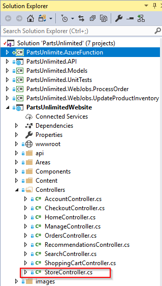

2. Replace the code with the following snippet
  ```csharp
  // Copyright (c) Microsoft. All rights reserved.
// Licensed under the MIT license. See LICENSE file in the project root for full license information.
using Microsoft.AspNetCore.Mvc;
using Microsoft.Extensions.Caching.Memory;
using PartsUnlimited.Models;
using System;
using System.Linq;
using System.Collections.Generic;
using System.Net.Http;
using System.Threading.Tasks;
using Newtonsoft.Json;
namespace PartsUnlimited.Controllers
{
    public class StoreController : Controller
    {
        private readonly IPartsUnlimitedContext _db;
        private readonly IMemoryCache _cache;

        public StoreController(IPartsUnlimitedContext context, IMemoryCache memoryCache)
        {
            _db = context;
            _cache = memoryCache;
        }

        //
        // GET: /Store/

        public IActionResult Index()
        {
            var category = _db.Categories.ToList();

            return View(category);
        }

        //
        // GET: /Store/Browse?category=Brakes

        public async Task<IActionResult> Browse(int categoryId)
        {
            // Retrieve category and its associated products from database
            // TODO [EF] Swap to native support for loading related data when available
            var categoryModel = _db.Categories.Single(g => g.CategoryId == categoryId);

            if (categoryModel.Name.ToLower().Equals("oil"))
            {
                var url = "https://partsunlimitefunctionapp.azurewebsites.net/api/SpecialsProxy?code=1wsG38iUPkMaclh0zmFpZoRewYs5usBLSlOkM5JaKIF4WvbklkeQYg==";
                if (HttpContext.User.Identity.IsAuthenticated)
                {
                    url += HttpContext.User.Identity.Name.Equals("Administrator@test.com") ? "&UserID=1" : "&UserID=50";
                }
                using (HttpClient client = new HttpClient())
                {
                    var jsonProducts = await client.GetStringAsync(url);
                    var products = JsonConvert.DeserializeObject<List<Product>>(jsonProducts);
                    foreach (Product product in products)
                    {
                        product.ProductId = _db.Products.First(a => a.SkuNumber == product.SkuNumber).ProductId;
                    }

                    categoryModel.Products = products;
                }
            }
            else
            {
                categoryModel.Products = _db.Products.Where(a => a.CategoryId == categoryModel.CategoryId).ToList();
            }
            return View(categoryModel);
        }
        public IActionResult Details(int id)
        {
            Product productData;

            productData = _db.Products.Single(a => a.ProductId == id);
            productData.Category = _db.Categories.Single(g => g.CategoryId == productData.CategoryId);


            return View(productData);
        }
    }
}
```
>Note 
>1. You have to replace url variable's value with your full Azure Function's URL which we have copied in **Exercise 4** including its code parameter at the end.
>2. Only Administrator@test.com will be able to see version 2 of the API output. Credentials for this account can be found bellow or in config.json file which is located in the root of PartsUnlimitedWebsite project:
  ```csharp
  "AdminRole": {
    "UserName": "Administrator@test.com",
    "Password": "YouShouldChangeThisPassword1!"
}
```

3. Open _ProductList.cshtml located at PartsUnlimitedWebsite > Views > Shared > _ProductList.cshtml .

   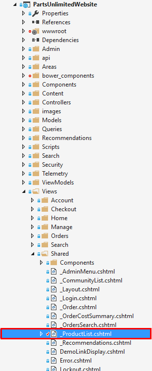

4. Replace everything in the file with the following code:
```csharp
@model IEnumerable<PartsUnlimited.Models.Product>
@if ((Model == null)
   || !Model.Any())
{
    <div class="alert alert-warning" role="alert">No products found!</div>
}
else
{
    <div class="row">
        @foreach (var product in Model)
        {
            if (!product.ProductArtUrl.StartsWith("http://", StringComparison.OrdinalIgnoreCase)
                && !product.ProductArtUrl.StartsWith("https://", StringComparison.OrdinalIgnoreCase))
            {
                product.ProductArtUrl = $"/images/{product.ProductArtUrl}";
            }

            <div class="col-lg-3 col-md-3 col-sm-3 col-xs-12">
                <div class="list-item-part">
                    <a href="@Url.Action("Details", "Store", new { id = product.ProductId })" title="@product.Title">
                        <div class="product-image-container hover-over hidden-xs">
                            <div class="image">

                                
                            </div>
                            <div class="detail">
                                <h4>@product.Title</h4>
                                <h5>@product.Price.ToString("C")</h5>
                                @if (product.CategoryId == 5)
                                {
                                    <h3>Discount @product.Discount</h3>
                                }


                            </div>
                            <div class="mouse-over hidden-xs">
                                <div class="image-second">
                                    
                                </div>

                                <div class="shop-now">
                                    <span class="glyphicon glyphicon-shopping-cart"></span>&nbsp;<span>Shop Now</span>
                                </div>
                            </div>
                        </div>

                        <div class="row visible-xs">
                            <div class="col-xs-4 col-sm-12 col-md-12 no-gutter-sm no-gutter image">
                                
                            </div>
                            <div class="col-xs-8 col-sm-12 col-md-12 detail">
                                <h4>@product.Title</h4>
                                <h5>@product.Price.ToString("C")</h5>
                            </div>
                        </div>
                    </a>
                </div>
            </div>
        }
    </div>
}
```

5. Click on **Changes** in **Team Explorer** and push the changes to the server

      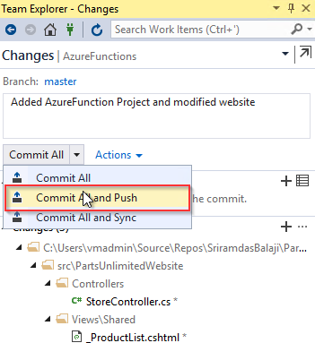
      

## Exercise 6: Build and Deploy Azure Functions project in VSTS
In this exercise we will modify the Build and Release definitions to build Azure Functions project and deploy the azure function to the Function app which we created.

1.  In your VSTS account click on **Build and Release** hub and select **PartsUnlimkted-CI** and click on **Edit**

    

2. Add  **src\PartsUnlimited.AzureFunction\PartsUnlimited.AzureFunction.csproj** in Build Task and Publish Task as shown below

    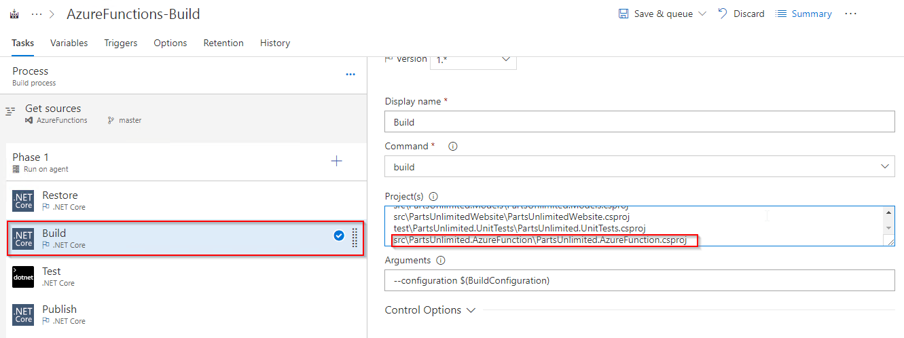
    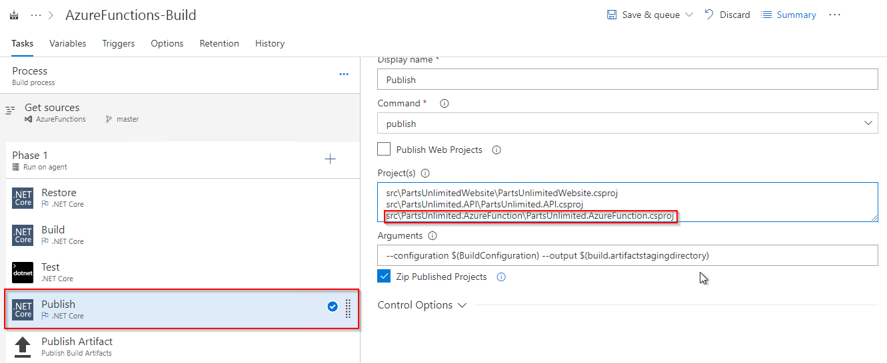

   We now included Azure functions project in build definition to Build and create a package for Azure Function Project.

3. Now click on **Save & Queue**. 
    You will see a build has been queued. Click on Build Number to see the progress of the build.

    
     

4. Once Build Succeeded Click on the **Releases** tab. Select **AzureFunctions_Deploy** release definition and click **Edit**

   

5. Click on **Dev** to view the deployment tasks in the definition

    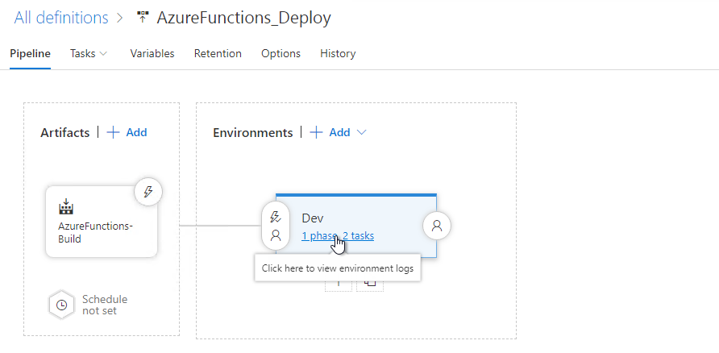

6. You have two tasks in the release definition.

   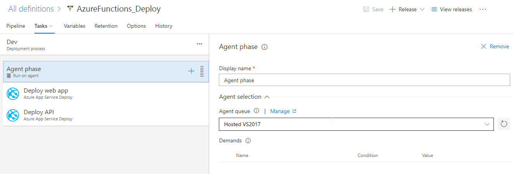

7. Now we will add one more task to deploy Azure Function to the Function App in Azure.
Click on **+** icon and add **Azure App Service deploy** Task

   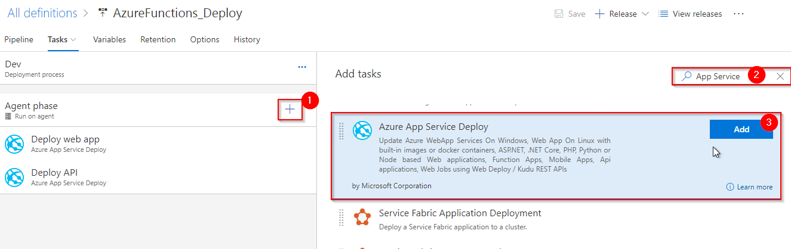

8. In the new task set the following parameters as shown in image

   > App Type: Function App

   > App Service Name: Function App which we have created in previuous exercise

   >Package or Folder: $(System.DefaultWorkingDirectory)/**/PartsUnlimited.AzureFunction.zip

   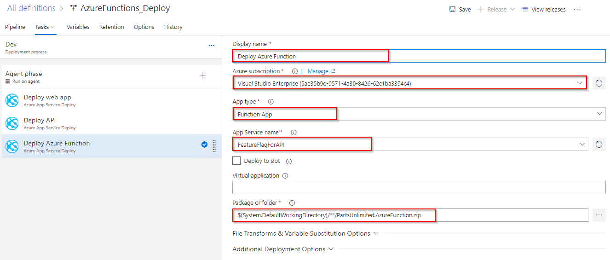

   

9. Save the changes and Trigger the Release to deploy modified web site and the Azure function.

   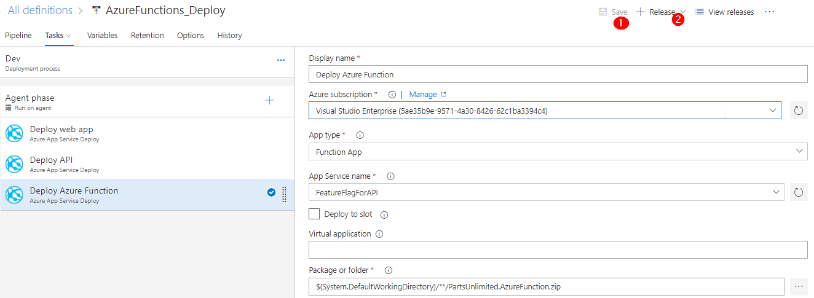

   You will see a Release has been queued. Click on the Release number to see the Release progress.

   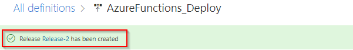

   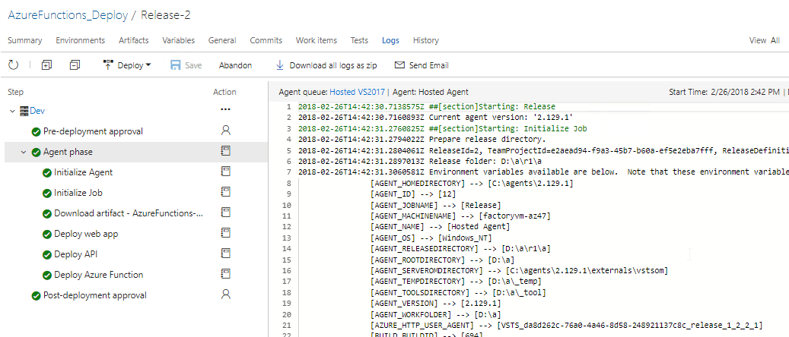

10. Once the Release is success, you can verify Website that you deployed calls the APIs.

## Exercise 7: Verify Website

1. Browse youe website and Navigate to **Oil** category without logging in, notice that products have V1 in their names, and showing Discount as 10% indicating they have been received from the original V1 controller which is for public users.

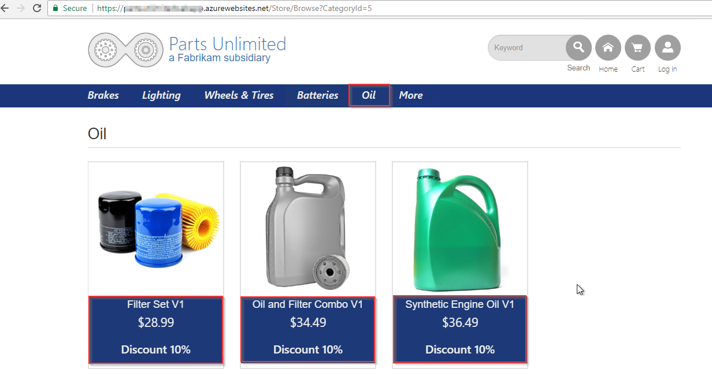

2. Log in as user Administrator@test.com with password **YouShouldChangeThisPassword1!** and navigate to Oil category again. You will notice that for this user Azure function routes the request to V2 controller (which is for Employees) and shows V2 products and Discount 30%

   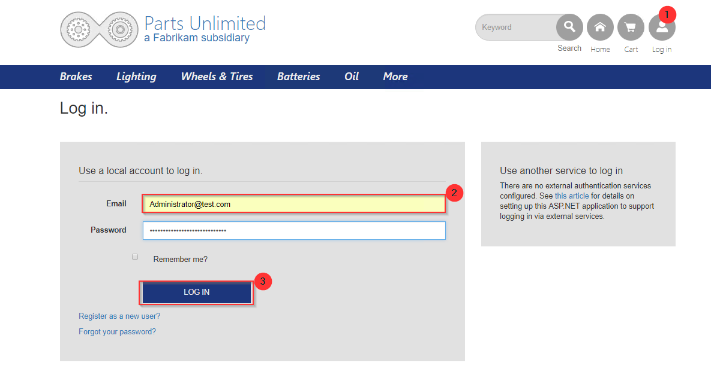

   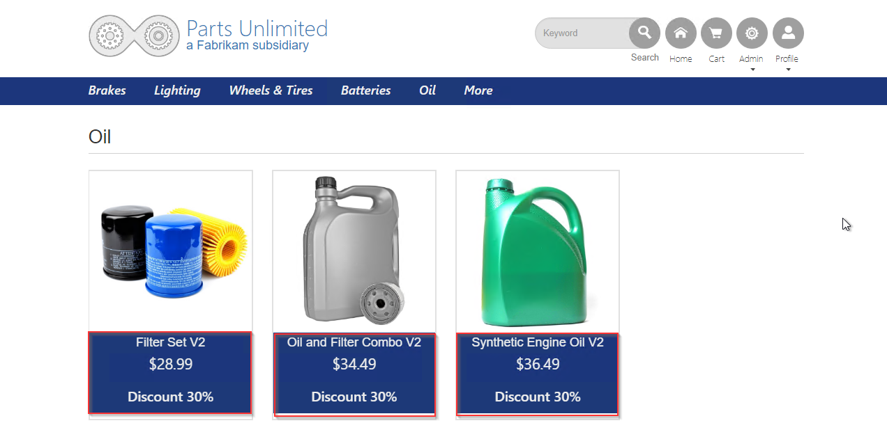

3. Log off from admin account and Create another account (public user) and login as that user. You will see V1 returned again.

   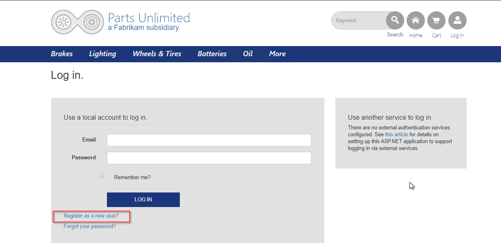

   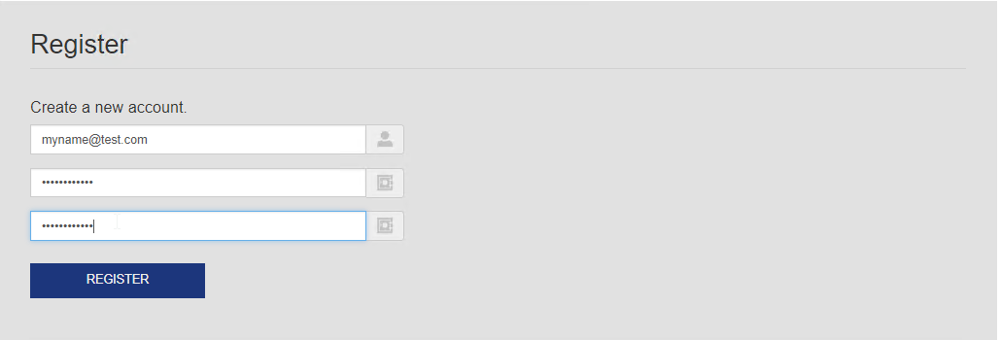

   

You have connected PartsUnlimited website to the Web API and used Azure function to retrieve data from either v1 or v2 of the API based on the user ID.
