<div class="rw-ui-container"></div>

## Overview

**Azure Functions** is an event-driven, compute-on-demand experience that extends the existing Azure application platform with capabilities to implement the code, triggered by events occurring in Azure or third-party services as well as on-premises systems. Azure Functions allows developers to act, by connecting to data sources or messaging solutions, thus making it easy to process and react to events. Developers can leverage Azure Functions to build HTTP-based API endpoints that are accessible by a wide range of applications, mobile and IoT devices.

**Lab Scenario**: In this lab, you will be using a fictional eCommerce website - **PartsUnlimited**. The PartsUnlimited team wants to roll out a new discount for its employees and customers and wants to build Azure Functions that will retrieve the right discount depending on whether the logged in user is an employee or a customer.

<div class="bg-slap">Want additional learning? Check out the <a href="https://docs.microsoft.com/en-us/learn/modules/deploy-azure-functions/" target="_blank"><b><u> Automate Azure Functions deployments with Azure Pipelines </u></b></a> module on Microsoft Learn.</div>

## What is covered in this lab?

 In this lab, you will

 * Generate the **PartsUnlimited** project in your **Azure DevOps Services** organization with **Azure DevOps Demo Generator** tool.
 * Setup **Azure Functions** in Azure portal and add code via Visual Studio.
 * Configure a **Build pipeline** in Azure DevOps Organization to build and test the code.
 * Configure a **Release pipeline** in Azure DevOps Organization for Website, API and Azure Functions.

## Pre-requisites for the lab

1. Refer the [Getting Started](../Setup/) page to know the prerequisites for this lab.

1. The lab additionally requires Visual Studio 2017 version 15.4 or later with [.Net Core SDK](https://www.microsoft.com/net/learn/get-started/windows#windows) and [Azure Development Tools for Visual Studio](https://docs.microsoft.com/en-us/azure/azure-functions/functions-develop-vs) installed.

1. Click the [Azure DevOps Demo Generator](http://azuredevopsdemogenerator.azurewebsites.net/?TemplateId=77374&Name=AzureFunctions) link and follow the instructions in [Getting Started](../Setup/) page to provision the project to your Azure DevOps Organization.

## Create the required Azure resources
You need to create two Azure App services for this lab.
1. Launch the [Azure Cloud Shell](https://docs.microsoft.com/en-in/azure/cloud-shell/overview) from the Azure portal and choose **Bash**.

1. Create a Resource Group. Replace `<region>` with the region of your choosing, for example eastus.
   
   ```bash
   az group create -n MyResourceGroup -l <region>
   ```

1. To create an App service plan
   
   ```bash
   az appservice plan create -g MyResourceGroup -n MyPlan --sku S1
   ```
1. Create two web apps with a unique app names.
 
    ```bash
    az webapp create -g MyResourceGroup -p MyPlan -n PartsUnlimited-Web
    ```

    ```bash
    az webapp create -g MyResourceGroup -p MyPlan -n PartsUnlimited-API
    ```

1. Navigate to the resource group you created, you will see the resources as shown.

   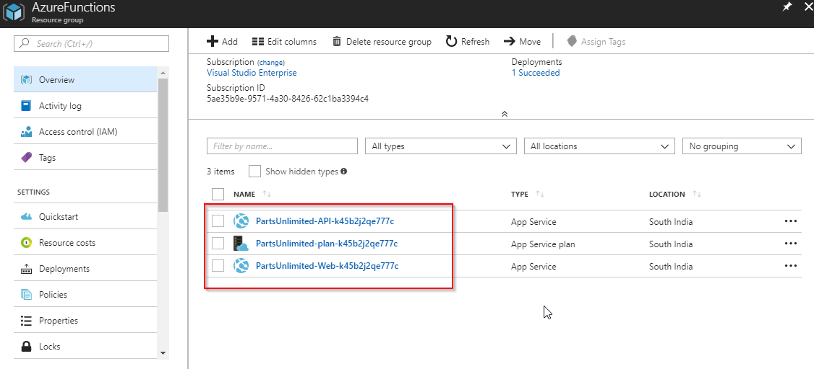

We created two App Services and an App Service Plan.

  * Web App - Used to deploy the Parts Unlimited website.
  * API App - Used to redirect users to different discounts page based on the user login.

## Exercise 1: Cloning an existing repository

1. Navigate to the **Repos**. Select **Clone** on the right side top corner. In the **Clone Repository** tab  select **Clone in Visual Studio** from the IDE's list.

      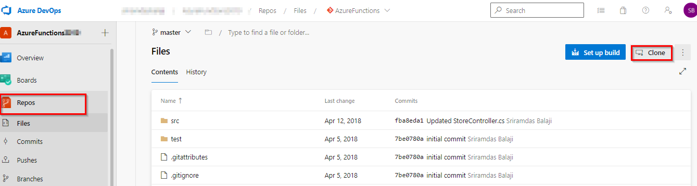
     

1. An instance of **Visual Studio** opens. Sign in to Visual Studio if prompted.

1. Set the local path where you want the local repository to be placed and select **Clone**.

     

1. In Team Explorer under **Solutions**, you will see  **PartsUnlimited.sln**. Double click the solution to open the project.

     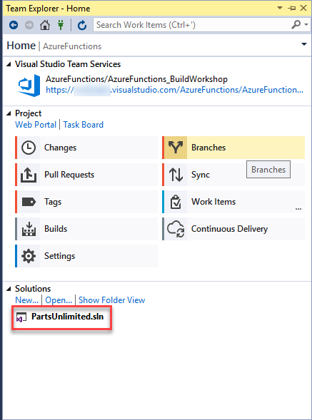

## Exercise 2: Create Azure Function in Azure Portal and in Visual Studio

In this exercise, you will create an **Azure Functions** App from the Azure portal and then add code by creating an Azure Functions project in Visual Studio.

The Azure Functions created in this exercise will act as a switching proxy or the mechanism to return to different (discount) information based on the user logged in to the application. Although you have used a simple condition here, this could also use more complex rules which could potentially be hidden behind another web api call.

1. Login to the [Azure Portal](https://portal.azure.com/). Select the **+ Create a resource** button on the upper left-hand corner of the Azure portal, then select **Compute > Function App**.

    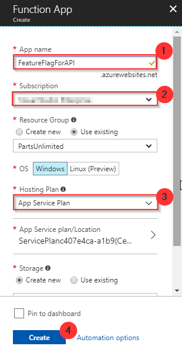

1. Create a Function app with similar settings as specified in the below image. Click **Review + create** and then **Create** to provision and deploy the function app.

    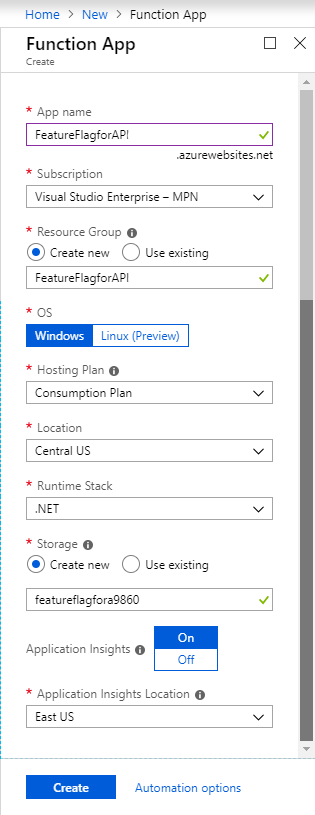

1. Select the Notification icon in the upper-right corner of the portal and watch for the Deployment succeeded message. Select **Go to resource** to view your new function app.

    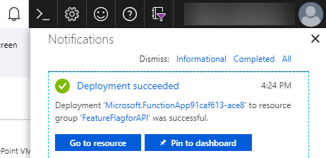

1. In Function app window select **Functions**. Click on **+Add** and select **Http trigger** from the templates.

    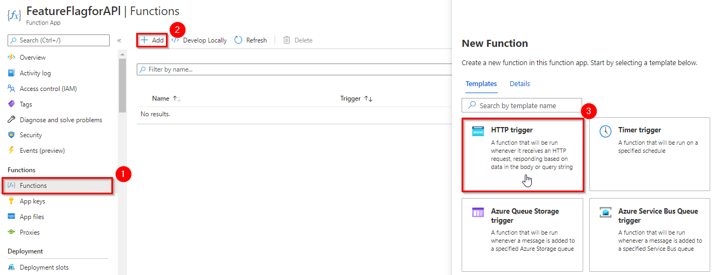
    
  
   > This lab uses CSharp as the development language for the function, but a function can be created in any supported language.
1. In the **New Function** window leave the defaults and click on **Create function**.

    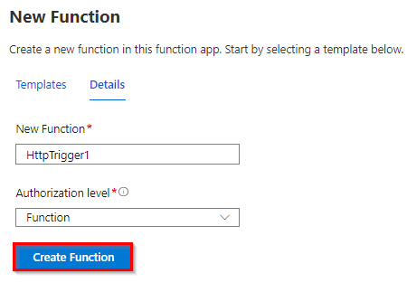

1. In the **HttpTrigger1** function page, click on **Get Function Url**. Copy the Azure Function URL and save to notepad. You will need this URL later in the exercise.

    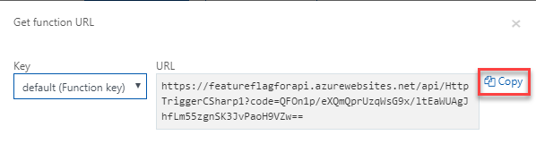

1. Return to the Visual Studio, double click on the **PartsUnlimited.sln** solution to open it. You will have to add code to the Functions App. While there are many ways of doing it, you will use Visual Studio in this lab. You will write code to redirect to the right APIs based on the user login, to return different (discount) information.

1. Right click on the solution and select **Add** and select **New Project**.

    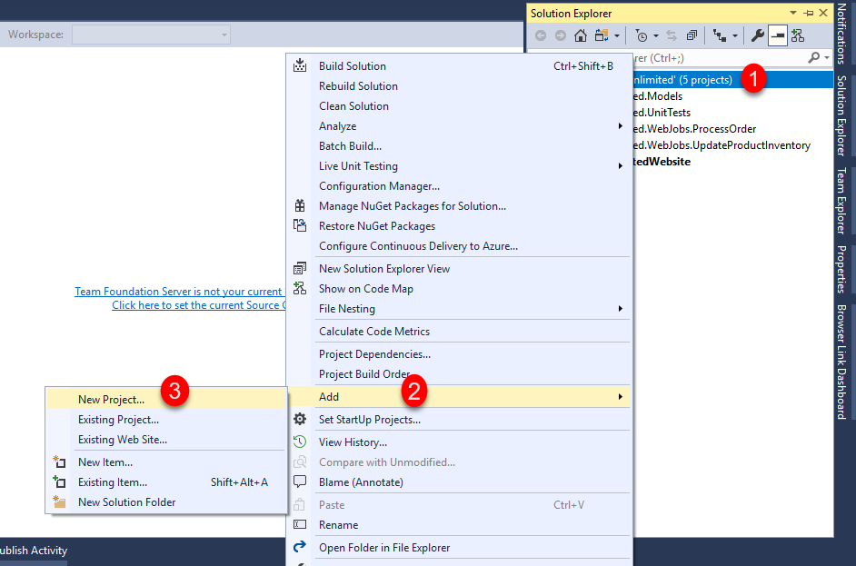

1. Select **Cloud** under **Visual C#** category, select **Azure Functions** as the type of this project. Enter **PartsUnlimited.AzureFunction** for the name and append **\src** at the end of the location, then click OK.

    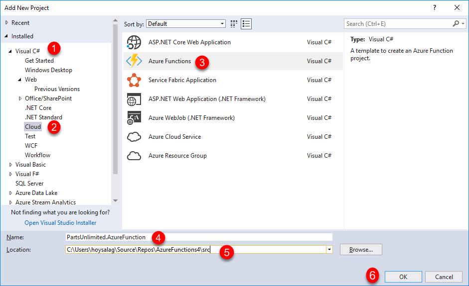

1. Select **HttpTrigger** template, **Azure Functions v1 (.NET Framework)** from the framework dropdown and click OK.

    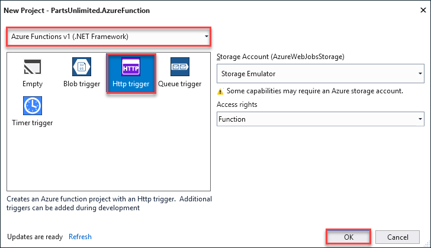
    
1. Expand the **PartsUnlimited.AzureFunction** project, open **Function1.cs** and then replace the existing code with the following code.

    ```CSharp
    using System;
    using System.Linq;
    using System.Net;
    using System.Net.Http;
    using System.Threading.Tasks;
    using Microsoft.Azure.WebJobs;
    using Microsoft.Azure.WebJobs.Extensions.Http;
    using Microsoft.Azure.WebJobs.Host;

    namespace PartsUnlimited.AzureFunction
    {
    public static class Function1
    {
        [FunctionName("HttpTrigger1")]
        public static async Task<HttpResponseMessage> Run([HttpTrigger(AuthorizationLevel.Function, "get", "post", Route = null)]HttpRequestMessage req, TraceWriter log)
        {
            var userIdKey = req.GetQueryNameValuePairs().FirstOrDefault(q => string.Equals(q.Key, "UserId", StringComparison.OrdinalIgnoreCase));
            var userId = string.IsNullOrEmpty(userIdKey.Value) ? int.MaxValue : Convert.ToInt64(userIdKey.Value);
            var url = $"https://<<YourAPIAppServiceUrl>>/api/{(userId > 10 ? "v1" : "v2")}/specials/GetSpecialsByUserId?id={userId}";
            using (HttpClient httpClient = new HttpClient())
            {
                return await httpClient.GetAsync(url);
            }
        }
    }
    }

    ```

1. Navigate to the resource group which was configured in the **Create required Azure resources** exercise. Click **PartsUnlimited-API-XXXXXXX.azurewebsites.net** and click the Copy icon under the URL section to copy the whole URL. Copy and replace the value of `https://<<**YourAPIAppServiceUrl**>>` in url variable with API app service name.

1. In Visual Studio, open **StoreController.cs** from the path **PartsUnlimitedWebsite > Controllers > StoreController.cs**.

    

1. In **StoreController.cs** file, replace the URL variable in *line 46* with the **Function url** copied in Step 7.

    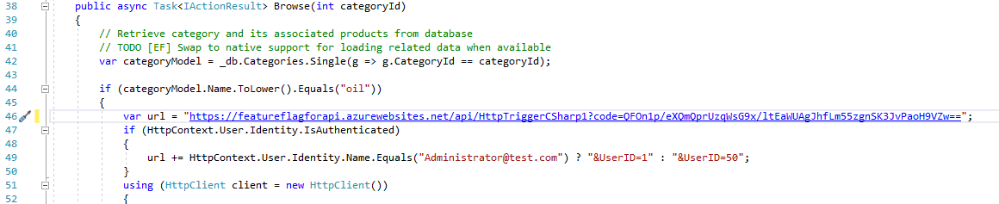

1. Click **Changes** in the Team Explorer, provide a comment and select **Commit all and Push** to push the changes to the remote repository.

    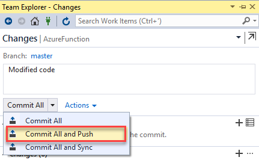

## Exercise 3: Setup Continuous Integration with Azure Build Pipelines

In this exercise, you will look at the build definition to get an insight of how the code is built as part of the CI pipeline.

1. Navigate to **Pipelines \| Pipelines** in Azure DevOps portal. Select **AzureFunctions_CI** and  click **Edit**.

    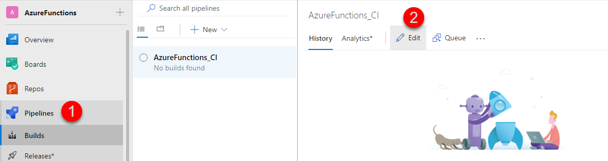

1. Before the build is executed, you will make this a **CI** build. Click the **Triggers** tab in the build definition. Enable the **Continuous Integration** trigger. Click **Save & queue**  to save the changes and trigger a build. This will ensure that the build process is automatically triggered every time you commit a change to your repository.

    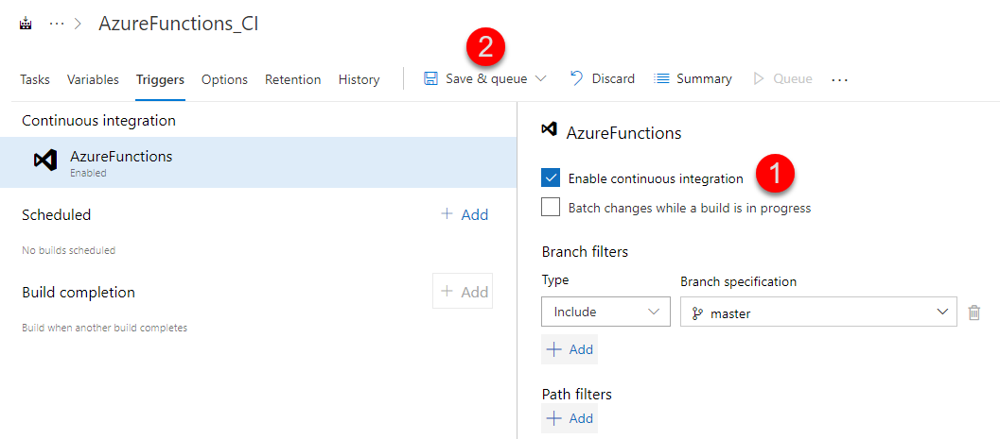
    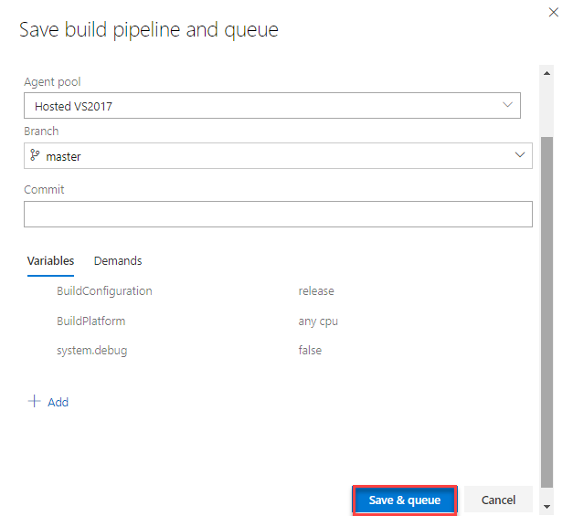

1. A new build is queued.  Click on the Job to view the live logs of the build as it progresses. Wait for the build to complete and succeed before proceeding to the next section.

    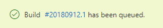 

## Exercise 4: Configuring Continuous Deployment with Azure Release Pipelines

1. Once the build succeeds, navigate to  **Pipelines \| Releases**.

1. Select **AzureFunctions_CD** pipeline and click **Edit**. 

    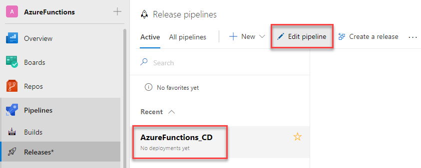 

1. Select the artifact trigger and make sure the **Continuous deployment** trigger is enabled.

    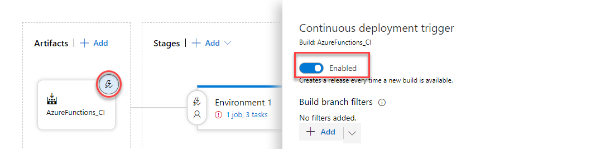 

1. To deploy **PartsUnlimited Website**, click Tasks and select the **Deploy PartsUnlimited Website** task, and configure the inputs as shown below.

    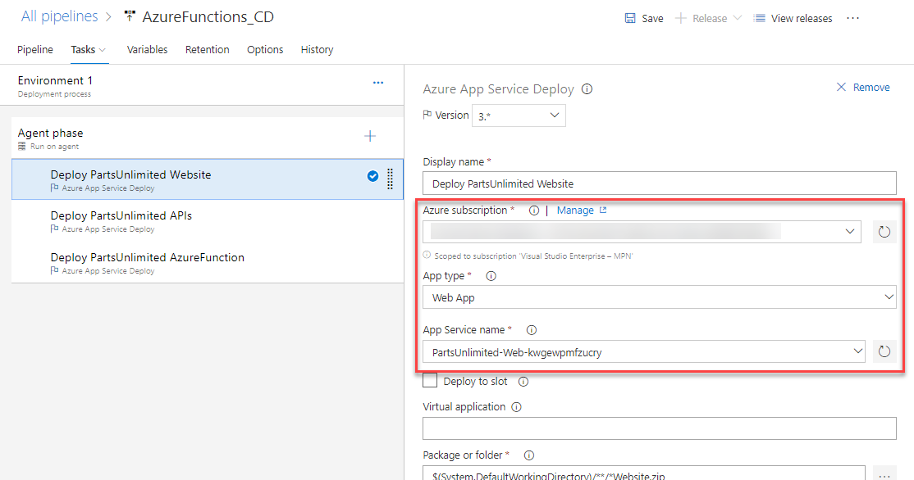 

    * If your Azure subscription is not listed or if you want to use an existing service principal, click on the `Manage` link.

        * Click on the **+New Service Connection** button and select the Azure Resource Manager option. Provide Connection name, select the Azure Subscription from the list and the click on the Ok button. The Azure credentials will be required to authorize the connection.

            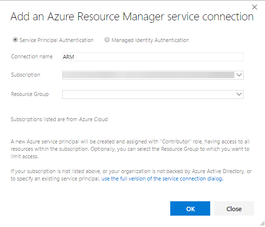

        * If your Azure subscription is already listed, select the Azure subscription from the drop down list and click **Authorize**.

            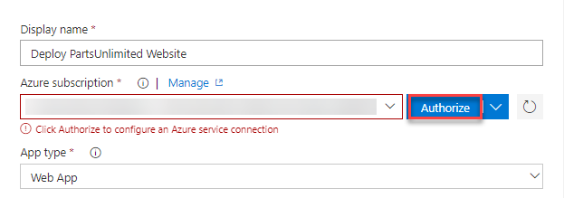 

1. Choose the pre-created **PartsUnlimited-Web-XXXX** name for **App Service Name** from the drop down.

1. For the **PartsUnlimited APIs**, select the second task and configure the inputs as shown below. Choose **PartsUnlimited-API-XXX** for the **App Service Name** field from the drop down.

    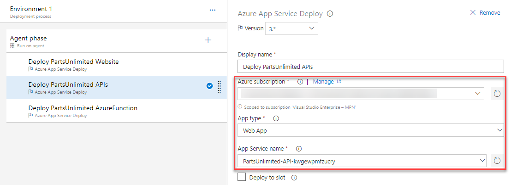

1. Select the third task to deploy **PartsUnlimited Azure Function** and configure the inputs as shown below. Choose the pre-created **Azure functions** name for the **App Name** field from the drop down.

    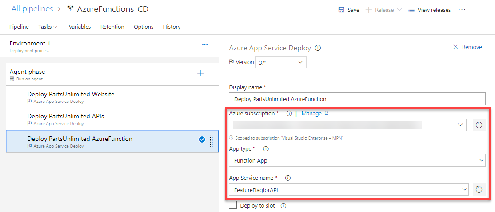

    > As the Azure Function Apps uses the Azure App Service infrastructure, the function app referred here can use all the features of an App Service. 

1. Click on *Save*. In the Save dialog box, click OK. To test the release definition, click on **Create Release**.

    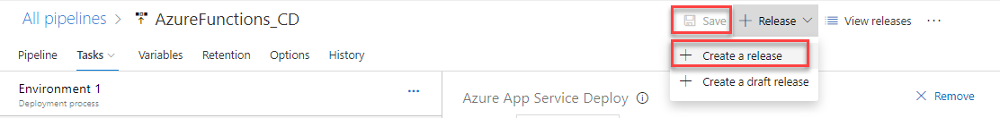 

1. On the Create new release dialog box, click **Create**.

    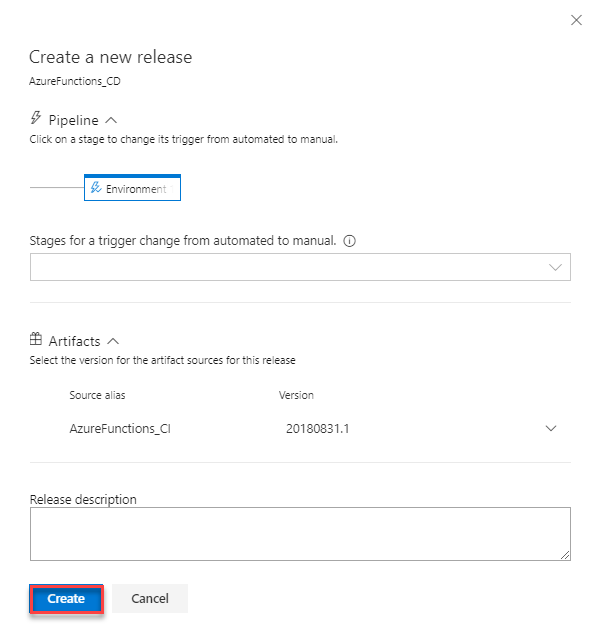

1. You will notice a new release being created. Select the link to navigate to the release.

    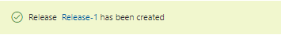

1. You can watch the live logs for the deployment as it happens. Wait for the release to be deployed to the Azure web app. Wait for the release to complete and happen before proceeding to the next section.

    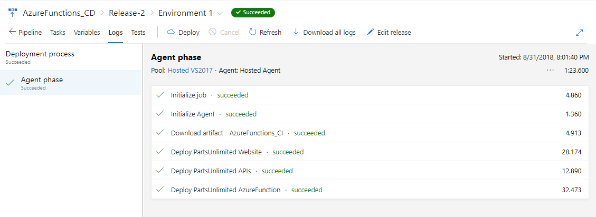

## Exercise 5: Verify the Deployment

1. Once deployment has completed, go to the Azure portal. In your resource group, select **PartsUnlimited-Web-xxxxx** web app and click Browse.

    

1.  Navigate to Oil category, notice that products are showing discount as **10%**.

    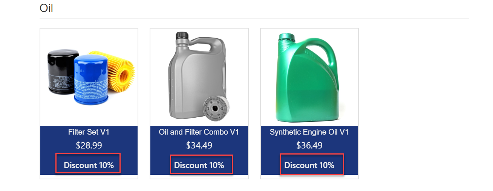

1. Now log in as **Administrator@test.com** with password **YouShouldChangeThisPassword1!** and navigate to Oil category again. You will notice that for this user, Azure function routes the request to another API and shows discount as **30%**.

    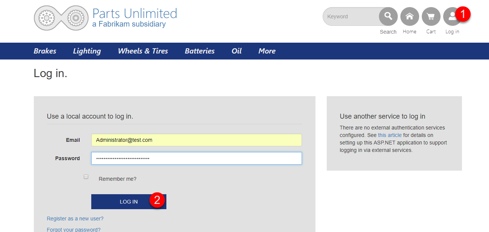
    
    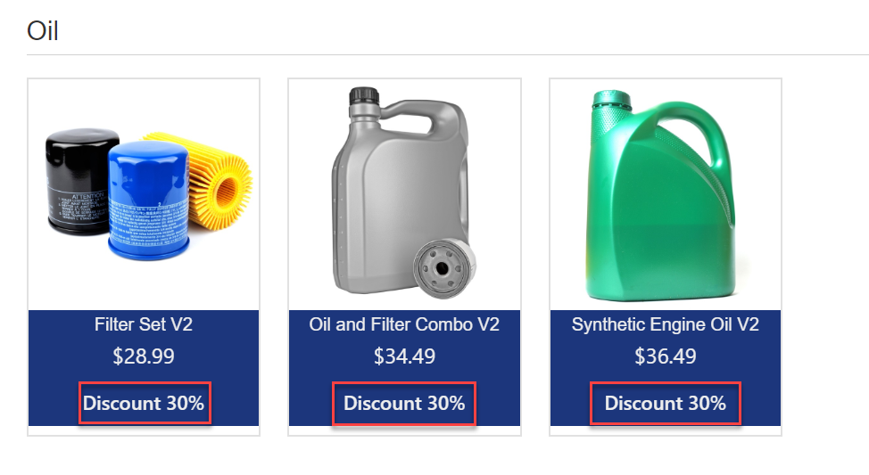

## Summary

   You have learned how to create and code Azure Functions in Visual Studio and setup a CI/CD pipeline to deploy the Functions App.
