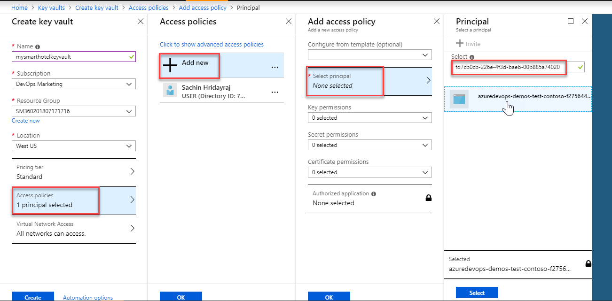
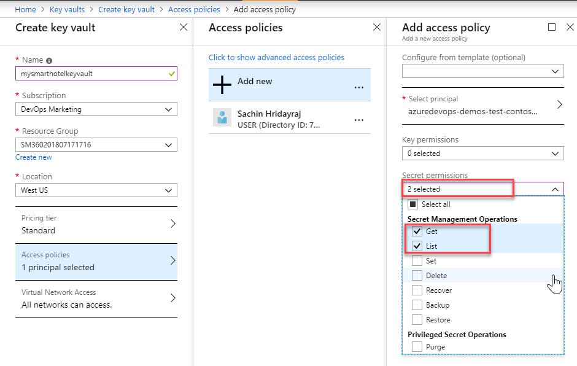

## Overview 
Azure Key Vault helps teams to securely store and manage sensitive information such as keys, password, certificates, etc. in a centralized storage which are safeguarded by industry-standard algorithms, key lengths, and even hardware security modules. This prevents information exposure through source code,  a common mistake that many developers make. Many developers leave sensitive information such as database connection strings, passwords, private keys, etc. in their source code which when gained by malicious users can result in undesired consequences. Access to a key vault requires proper authentication and authorization and with RBAC, teams can have even fine granular control who has what permissions over the sensitive data.

## What’s covered in this lab
In this lab, you will see how you can use Azure Key Vault in a pipeline

1. We will create a key vault, from the Azure portal, to store a MySQL server password
1. We will configure permissions to let a service principal to read the value
1. We will retrieve the password in an Azure pipeline and passed on to subsequent tasks

### Before you begin

1. Refer the [Getting Started](../Setup/) page before you begin following the exercises.
1. Fork the [**SmartHotel360-CouponManagement**](https://github.com/Microsoft/SmartHotel360-CouponManagement) repository to your GitHub account

### Task 1: Creating a service principal 

You will need a service principal to deploy an app to an Azure resource from Azure Pipelines. A service principal is automatically created by Azure Pipeline when you connect to an Azure subscription from inside a pipeline definition or when you create a new service connection from the project settings page. You can also manually create the service principal from the portal or using Azure CLI,  and re-use it across projects. It is recommended that you use an existing service principal when you want to have a pre-defined set of permissions. 

We will create one manually using the Azure CLI. If you do already have a service principal, you can skip this task.

1. Login to the [**Azure Portal**](https://portal.azure.com) 

1. Open the Azure cloud shell. Select **Bash** when prompted to choose shell.
    

1. Enter the following command by replacing ServicePrincipalName and PASSWORD with your desired values.

   `az ad sp create-for-rbac --name ServicePrincipalName --password PASSWORD `

   It will give you a JSON output as shown in the image. Copy the output to notepad or text file. You will need them later.
         
    

1. Enter the following command to get Azure SubscriptionID and copy the subscription ID and name to notepad.
   
    `az account show`

### Task 2: Creating a key vault
Next, we will create a key vault in Azure. For this lab scenario, we will use it to store the password of database as a secret which will be used when creating a new database. 

The SmartHotel360 Coupon Management is a sample app built on node.JS which connects to a MySQL database.  

1. If not already logged in, login to the [Azure Portal](https://portal.azure.com)

1. Enter "Key vault" in the search field and press enter. Select **Key Vaults** under services

1. Select **Add** or the **Create key vault** button to create a new key vault

    

1. Provide a name, subscription, resource group and location for the vault

    Because data in the Key Vaults are sensitive and business critical, you need to secure access to your key vaults by allowing only authorized applications and users. To access the data from the vault, you will need to provide read (Get) permissions to the service principal that you will be using for authentication in the pipeline. 

1. Select **Access policies** and then select **+Add new** to setup a new policy

1. You will need specify the permission that you intend to grant the application. This can be permissions to manage the key vault itself or just the data. In any case, applications can access the key vault in two ways:

    * User + Application access: Access is granted to specific user who can then be allowed to use any application or can be restricted to use a specific application. 

    * Application-only access: Access is granted to the application which can be run as a daemon service or background job. 

1. Select the **Select principal** and search for the security principal that you created earlier and select it. You can search by name or ID of the principal.

    

1. Next, we will select the permission to be granted. For now, we will select to provide **read-only** permissions (Get, List) to just the secrets.

    

1.  Click **OK** to close the open blades and select **Create** to create the vault.

It should not take long but a couple of minutes for the service to be created. Once it is provisioned, select the key vault and add a new secret. Let's name it **sqldbpassword**. Provide any value that will be accepted as a password for a MySQL database

### Task 3: Using the Key Vault in Azure Pipelines

1. Return back to the Azure DevOps project that you provisioned using the demo generator

1. Select **Builds** under **Pipelines** and then select the **SmartHotel-CouponManagement-CI** build and queue it

1. Wait for the build to complete. Before we deploy this build, let's take a look at the release definition

1. Go to **Releases** under **Pipelines** and then select and edit the **SmartHotel-CouponManagement-CD** definition

1. You will notice the release definition for **Dev** stage has **Azure Key Vault** task at the top. This task downloads *Secrets* from an Azure Key Vault. You will need to point to the subscription and the Azure Key Vault resource you created earlier in the lab.

1. You can use the ***Secret Filter*** field to download only selected list of secrets. If more than one, you should separate them by a comma. Use an asterisk (*) to download all secrets

    The downloaded secrets will be available as an environment variable which means the secret that you created earlier can be accessed in the subsequent tasks using the variable notation

1. Next task in the definition is **Azure Deploy** which is used for deploying an ARM template to a resource group. Select that and point to the Azure subscription to where you want to deploy. 

1. Note that the *Template* and *Template Parameter* fields are referring to the respective JSON files from the build output folder. 

1. Notice the *override templates parameters* field has the following value

    `-webAppName $(webappName) -mySQLAdminLoginName "azureuser" -mySQLAdminLoginPassword $(sqldbpassword) `

    In the above value, note that the webappname is a variable defined in the release manually but the sqldbpassword is a variable that is avaialble from the earlier task

1. This will provision the MySQL database defined in the ARM template using the password that you have specified in the key vault. It's that easy!!!

1. The final step in the release definition is the **App Service Deploy** task which will deploy the web application to the Azure Web App.

1. Initate a release and 