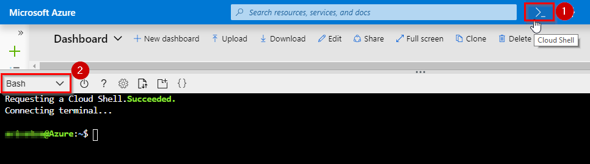
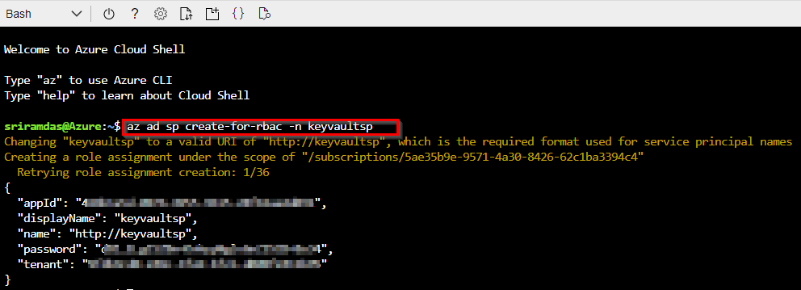
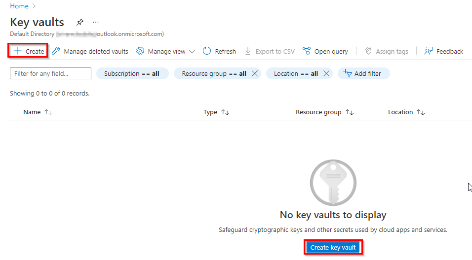
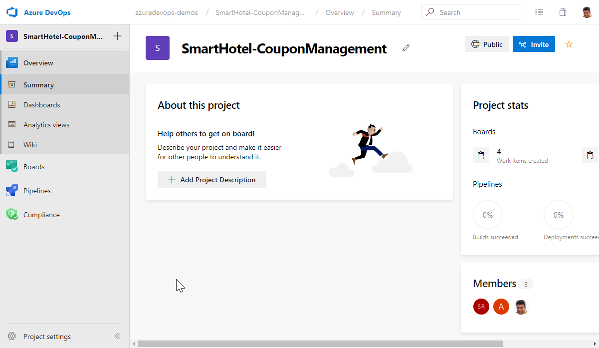
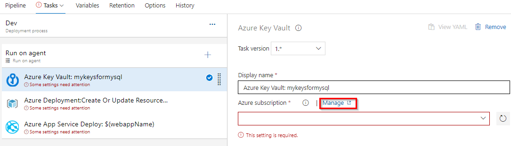
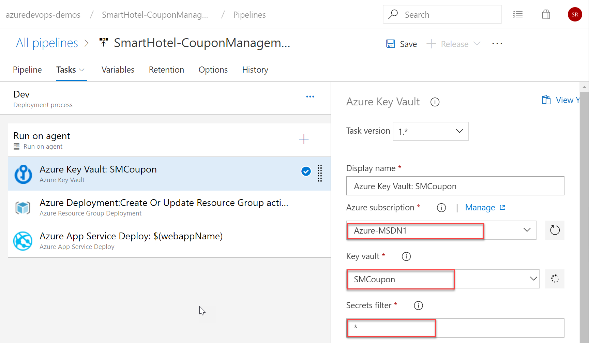
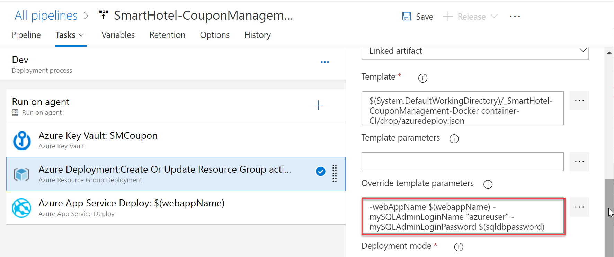

## Overview 
Azure Key Vault helps teams to securely store and manage sensitive information such as keys, passwords, certificates, etc., in a centralized storage which are safeguarded by industry-standard algorithms, key lengths, and even hardware security modules. This prevents the disclosure of information through source code,  a common mistake that many developers make. Many developers leave confidential details such as database connection strings, passwords, private keys, etc., in their source code which when gained by malicious users can result in undesired consequences. Access to a key vault requires proper authentication and authorization and with RBAC, teams can have even fine granular control who has what permissions over the sensitive data.

## What’s covered in this lab
In this lab, you will see how you can use Azure Key Vault in a pipeline.

1. We will create a key vault, from the Azure portal, to store a MySQL server password.
1. We will configure permissions to let a service principal to read the value.
1. We will retrieve the password in an Azure pipeline and passed on to subsequent tasks.

### Before you begin

1. Refer the [Getting Started](../Setup/) page before you begin following the exercises.

1. Use the [Azure DevOps Demo Generator](https://azuredevopsdemogenerator.azurewebsites.net/?name=keyvault){:target="_blank"} to provision the project on your Azure DevOps organization.
   This URL will automatically select **Azure Key Vault** template in the demo generator. If you want to try other projects, use this URL instead -[azuredevops generator](https://azuredevopsdemogenerator.azurewebsites.net/)

   Follow the [simple walkthrough](https://docs.microsoft.com/en-us/azure/devops/demo-gen/use-vsts-demo-generator-v2?view=vsts){:target="_blank"} to know how to use the Azure DevOps Demo Generator.

### Task 1: Creating a service principal 

You will need a service principal to deploy an app to an Azure resource from Azure Pipelines. Since we are going to retrieve secrets in a pipeline, we will need to grant permission to the service when we create the key vault. 

A service principal is automatically created by Azure Pipeline when you connect to an Azure subscription from inside a pipeline definition or when you create a new service connection from the project settings page. You can also manually create the service principal from the portal or using Azure CLI,  and re-use it across projects. It is recommended that you use an existing service principal when you want to have a pre-defined set of permissions.

We will create one manually using the Azure CLI. If you do already have a service principal, you can skip this task.

1. Login to the [**Azure Portal**](https://portal.azure.com).

1. Open the Azure cloud shell. Select **Bash** when prompted to choose shell.

    

1. Enter the following command by replacing ServicePrincipalName with your desired value.

   `az ad sp create-for-rbac -n ServicePrincipalName `

   It will give you a JSON output as shown in the image. Copy the output to notepad or text file. You will need them later.

    

1. Enter the following command to get Azure SubscriptionID and copy the subscription ID and name to notepad.

    `az account show`

### Task 2: Creating a key vault

Next, we will create a key vault in Azure. For this lab scenario, we have a node app that connects to a MySQL database where we will store the password for the MySQL database as a secret in the key vault.

1. If not already logged in, login to the [Azure Portal](https://portal.azure.com).

1. Enter "Key vault" in the search field and press enter. Select **Key Vaults** under services.

1. Select **Add** or the **Create key vault** button to create a new key vault.

    

1. Provide a name, subscription, resource group and location for the vault.

     

    Because data in Key Vaults are sensitive and business critical, you need to secure access to your key vaults by allowing only authorized applications and users. To access the data from the vault, you will need to provide read (Get) permissions to the service principal that you will be using for authentication in the pipeline. 

1. Select **Access policy** and then select **+ Add Access Policy** to setup a new policy.

     

1. You will need specify the permission that you intend to grant the application. This can be permissions to manage the keys and data(secrets). In any case, applications can access the key vault in two ways:

    * User + Application access: Access is granted to specific user who can then be allowed to use any application or can be restricted to use a specific application. 

    * Application-only access: Access is granted to the application which can be run as a daemon service or background job. 

1. Select the **Select principal** and search for the security principal that you created earlier and select it. You can search by name or ID of the principal.

    

1. Next, we will select the permission to be granted. For now, we will provide **read-only** permissions (Get, List) to secrets only.

    

1.  Click **Review + create** to close the open blades and select **Create** to create the vault.

1. It should only take a couple of minutes for the service to be created. Once it is provisioned, select the key vault and add a new secret. Let's name it **sqldbpassword**. Provide any value that will be accepted as a password for a MySQL database.

    

### Task 3: Check the Azure Pipeline

Now, lets go to the Azure DevOps project that you provisioned using the [Azure DevOps Demo Generator](https://azuredevopsdemogenerator.azurewebsites.net/?name=keyvault) and configure the Azure Pipelines to read the secret from the key vault.

1. Navigate to the Azure DevOps project.

    

1. Select **Pipelines \| Pipelines** from the left navigation bar.

1. To trigger a build, choose the **SmartHotel-CouponManagement-CI** definition and then **Run Pipeline** to manually queue it.

    

1. Go to **Releases** under **Pipelines** and then select and edit the **SmartHotel-CouponManagement-CD** definition.

1. Under **Tasks**, notice the release definition for **Dev** stage has a **Azure Key Vault** task. This task downloads *Secrets* from an Azure Key Vault. You will need to point to the subscription and the Azure Key Vault resource created earlier in the lab.

1. You need to authorize the pipeline to deploy to Azure. Azure pipelines can automatically create a service connection with a new service principal, but we want to use the one we created earlier. Click **Manage**, this will redirect to the Service connections page. 
    
    

   Follow the instruction [here](https://docs.microsoft.com/en-us/azure/devops/pipelines/library/connect-to-azure?view=azure-devops#create-an-azure-resource-manager-service-connection-with-an-existing-service-principal) to create an Azure Resource Manager service connection with an existing service principal.
   
1. Select the Service connection you created in previous step for Azure subsciption in Azure Key Vault task.  

1. You can enter the name or select the key vault you created from the drop-down.

1. In the **Secrets filter** field, you can specify an *asterisk* (*) to read all secrets or if you want only specific ones, you can provide the names of the secrets as comma-separated values.

    

    At runtime, Azure Pipelines will fetch the latest values of the secrets and set them as task variables which can be consumed in the following tasks which means the password we stored earlier can be read using **$(sqldbpassword)**.  

1. We pass this value in the next task, **Azure Deployment** where we deploy an ARM template.

    

   Notice the **Override template parameters** field has the database user name as a string but the password value is passed as a variable.

   `-webAppName $(webappName) -mySQLAdminLoginName "azureuser" -mySQLAdminLoginPassword $(sqldbpassword)`

   This will provision the MySQL database defined in the ARM template using the password that you have specified in the key vault. 

   You may want to complete the pipeline definition by specifying the subscription and location for the task. Repeat the same for the last task in the pipeline **Azure App Service Deploy**. Finally, save and create a new release to start the deployment.



### Exercise Challenge

Try creating a new secret to store the user name for the MySQL Database and change the pipeline to fetch and use the secret

### Related Labs
* [Embracing Continuous Delivery with Azure Pipelines](https://azuredevopslabs.com/labs/azuredevops/continuousdeployment/)

* [GitHub integration with Azure Pipelines](https://azuredevopslabs.com/labs/vstsextend/github-azurepipelines/)
