Last updated : {{ "now" | date: "%b %d, %Y" }}.

## Overview

In the earlier versions of the VSTS Release Management, if the application needed to be deployed to multiple servers, the Windows PowerShell remoting had to be enabled manually, the required ports opened and the deployment agent installed on each of the servers. The pipelines had to be managed manually in case of a roll-out deployment.

All the above challenges have been handled seamlessly with the introduction of the [Deployment Groups](https://docs.microsoft.com/en-us/vsts/build-release/concepts/definitions/release/deployment-groups/){:target="_blank"}.

The Deployment Group installs a deployment agent on each of the target servers within a configured group and instructs the Release Management to gradually deploy the application to all servers that belong to the Deployment Group. Multiple pipelines can be created for roll-out deployments so that the latest version of the application could be provided in a phased mannery to multiple user groups for validating the newly introduced features.

### What's covered in this lab

### Prerequisites for the lab

1. **Microsoft Azure Account**: You will need a valid and active Azure account for the Azure labs. If you do not have one, you can sign up for a [free trial](https://azure.microsoft.com/en-us/free/){:target="_blank"}

    * If you are a Visual Studio Active Subscriber, you are entitled for a $50-$150 credit per month. You can refer to this [link](https://azure.microsoft.com/en-us/pricing/member-offers/msdn-benefits-details/){:target="_blank"} to find out more including how to activate and start using your monthly Azure credit.

    * If you are not a Visual Studio Subscriber, you can sign up for the FREE [Visual Studio Dev Essentials](https://www.visualstudio.com/dev-essentials/){:target="_blank"} program to create **Azure free account** (includes 1 year of free services, $200 for 1st month).

1. You will need a **Visual Studio Team Services Account**. If you do not have one, you can sign up for free [here](https://www.visualstudio.com/products/visual-studio-team-services-vs){:target="_blank"}

1. You will need a **Personal Access Token** to set up your project using the Demo Generator. Please see this [article](https://docs.microsoft.com/en-us/vsts/accounts/use-personal-access-tokens-to-authenticate){:target="_blank"} for instructions to create your token.

    

## Setting up the Environment

The following resources will be provisioned on the Azure using an ARM template:

* Six Virtual Machines (VM) web servers with the IIS configured

* A SQL server VM (db server) and

* Azure Network Load Balancer

1. Click on the **Deploy to Azure** button to initiate the resource provisioning. It takes approximately 10-15 minutes to complete the deployment.

   {:target="_blank"}

   

1. Once the deployment is successful, the resources will be displayed on the Azure Portal.

   

1. Click on the **DB server VM** to view the details.

   

1. Make a note of the `DNS` name. This value will be required later during an exercise.

   

## Setting up the VSTS team project

1. Use the [VSTS Demo Generator](https://vstsdemogenerator.azurewebsites.net/?name=DeploymentGroups&templateid=77368){:target="_blank"} to provision a team project on the VSTS account.

   

1. Once the team project is provisioned, click on the URL to navigate to the project.

   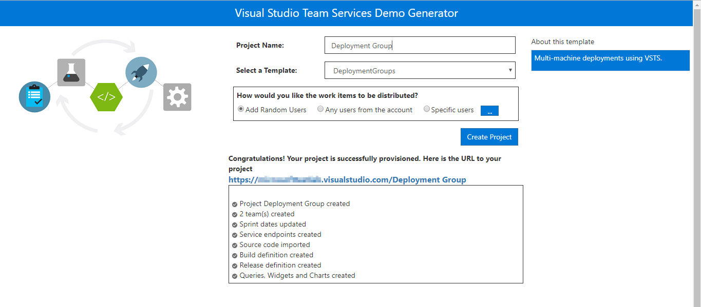

## Exercise 1: Endpoint Creation

Since the connections are not established during the project provisioning, the endpoints need to be configured manually.

1. In the VSTS, navigate to the **Services** by clicking on the gear icon, and click on the **+ New Service Endpoint** button. Select the **Azure Resource Manager** tab. Specify the **Connection name**, select the **Subscription** from the dropdown and click on the **Ok** button. This endpoint will be used to connect **VSTS** and **Azure**.

   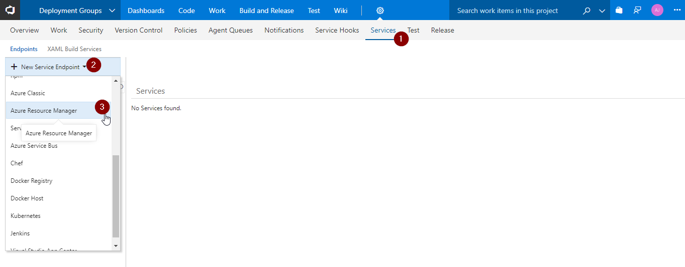

   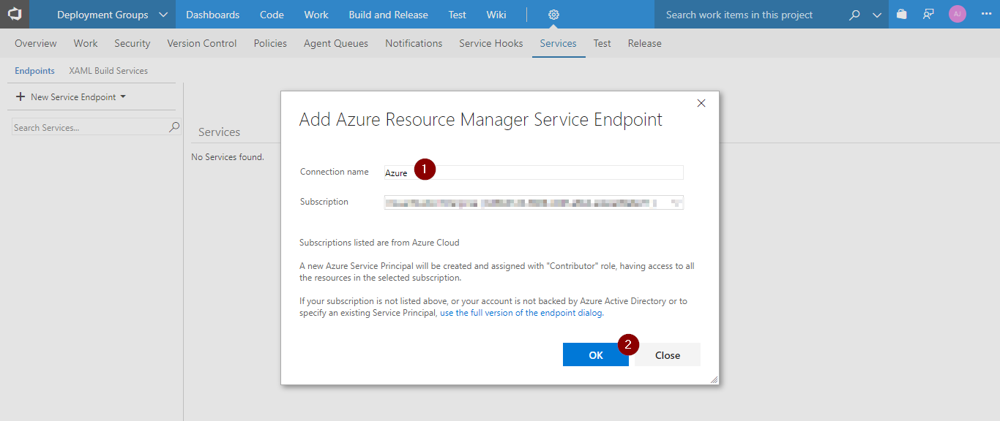

1. Create an endpoint of type **Team Foundation Server/Team Services**. Select the **Token based authentication** option and specify the following details-

   * **Connection Name**: Provide any name

   * **Connection Url**: The VSTS account Url

   * **Personal Access Token**: The VSTS Personal Access Token

   The configured endpoint will be used during the agent registration with deployment groups as the access to the VSTS team project is required.

   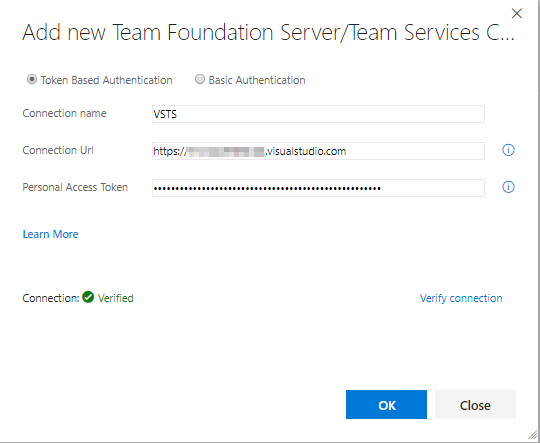

## Exercise 2: Creating Deployment Groups

VSTS makes it easier to organize the servers for hosting the applications. A deployment group is a collection of machines with a VSTS deployment agent on each of them. Each machine interacts with VSTS to coordinate deployment of the app.

1. Navigate to the **Build & Release** tab and click on the [**Deployment Groups**](https://docs.microsoft.com/en-us/vsts/build-release/concepts/definitions/release/deployment-groups/){:target="_blank"} option. Click on the **Add deployment group** button to configure a Deployment Group.

   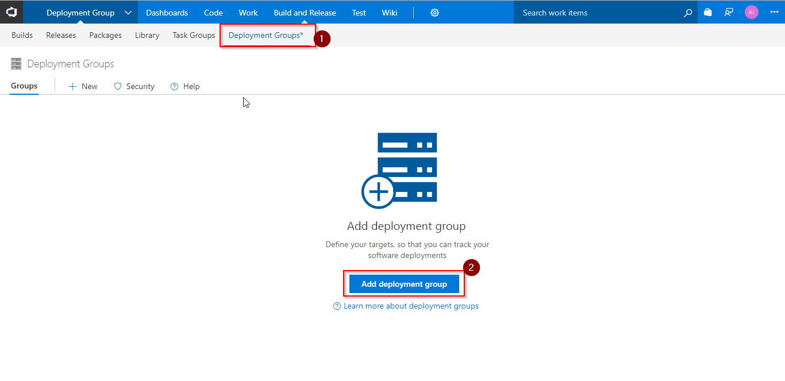

1. Provide a `Deployment group name`, and click on the **Create** button. The registration script generated will be displayed.

   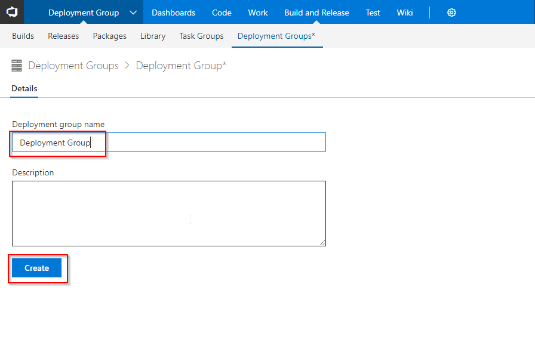

   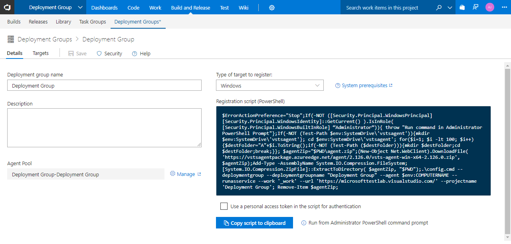

## Exercise 3: Configure Releases

The target servers are available in the deployment group for deploying the application. The release definition uses **Phases** to deploy the application to the target servers.

A [Phase](https://docs.microsoft.com/en-us/vsts/build-release/concepts/process/phases){:target="_blank"} is a logical grouping of the tasks that defines the runtime target on which the tasks will execute. A deployment group phase executes tasks on the machines defined in a deployment group.

1. Click on the **Build & Release** tab and select the **Release** option. Select the release definition **Deployment Groups** and then select the **Tasks** tab

    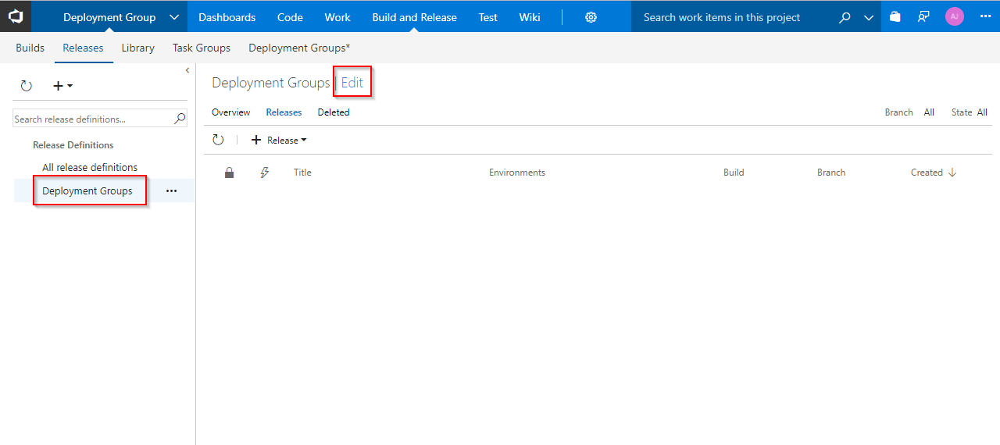

    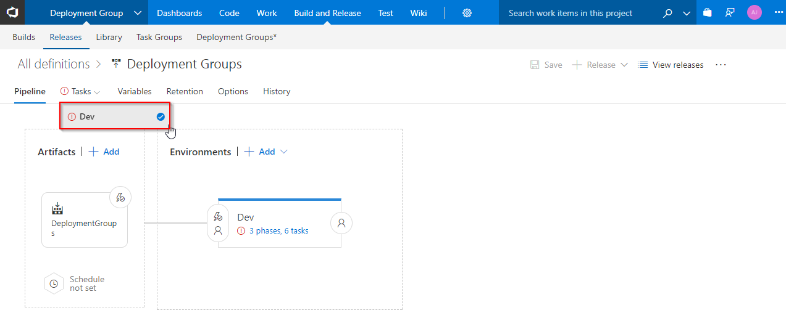

1. The tasks will be grouped under the **Agent phase**, **Database deploy phase** and **IIS Deployment phase**.

   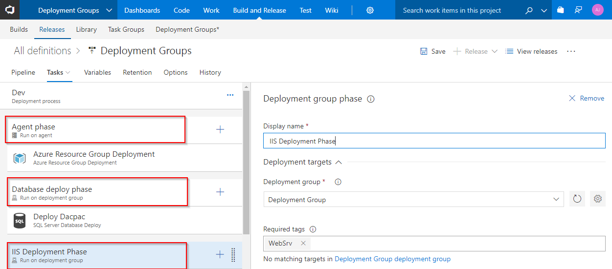

   * **Agent Phase**: In this phase, the target servers will be associated to the deployment group using the Azure Resource Group Deployment task.

     * **Azure Resource Group Deployment**: This task will automate the configuration of the deployment group agents to the web and db servers.

       

   * **Database deploy phase**: This deployment group phase executes tasks on the machines defined in the deployment group. This phase is linked to the **db** tag.

     * **Deploy Dacpac**: This task is used to deploy dacpac file to the DB server.

       

       

   * **IIS Deployment phase**: In this phase, the application will be deployed to the web servers using the below tasks. This phase is linked to **web** tag.

      * **Azure Network Load Balancer**: As the target machines are connected to NLB, this task will disconnect machines from the NLB prior to the deployment and reconnect to the NLB after the deployment.

      * **IIS Web App Manage**: The task runs on the deployment target machine(s) registered with the Deployment Group configured for the task/phase. It creates a webapp and application pool locally with the name **PartsUnlimited** running under the port
      **80**

      * **IIS Web App Deploy**: The task runs on the deployment target machine(s) registered with the Deployment Group configured for the task/phase. It deploys the application to the IIS server using **Web Deploy**.

        

1. The number of concurrent deployments can be controlled by setting the value in the **Maximum number of targets in parallel** field. For example, in this lab, since there are 6 web servers, setting the target servers to **50%** will deploy the build artifacts to 3 web servers in parallel at a time.

   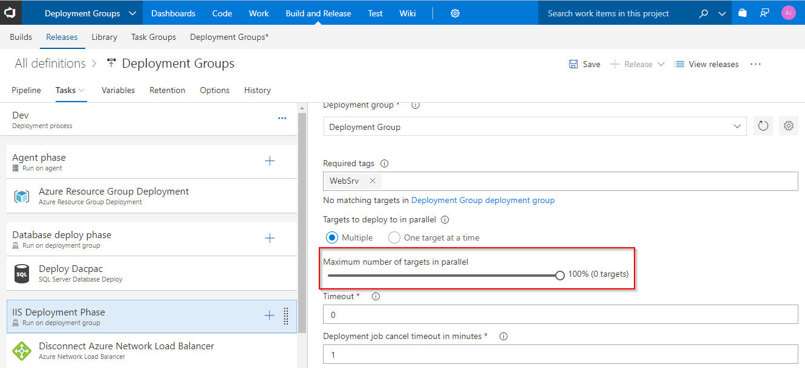

1. Select the **Disconnect Azure Network Load Balancer** task and provide the following details:

   * **Azure Subscription**: An ARM Endpoint created in the **Exercise 1**

   * **Resource Group**: Name of the Resource Group which was created while provisioning the environment

   * **Load Balancer Name**: Select the name from the dropdown

   * **Action**: Set the action to **Disconnect Primary Network Interface**

   

1. Select the **Connect Azure Network Load Balancer** task and provide the following details:

    * **Azure Subscription**: An ARM Endpoint created in the **Exercise 1**

    * **Resource Group**: Name of the Resource Group which was created while provisioning the environment

    * **Load Balancer Name**: Select the name from the dropdown

    * **Action**: Set the action to **Connect Primary Network Interface**

    

1. Click on the **Variables** tab and select the **Process Variables** option. Replace the value of the **DefaultConnectionString** variable with the `SQL DNS` value noted earlier.

   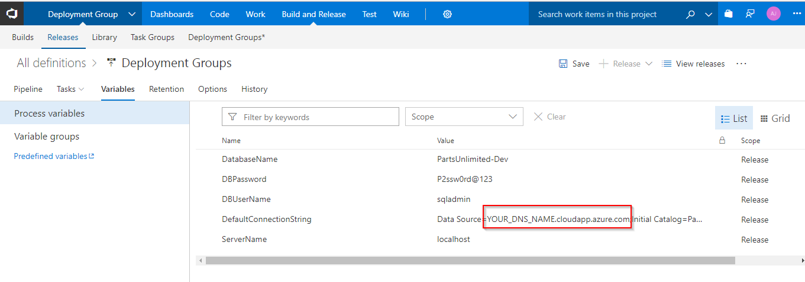

1. Click on the **Save** button and then click on the **Create release** option.

   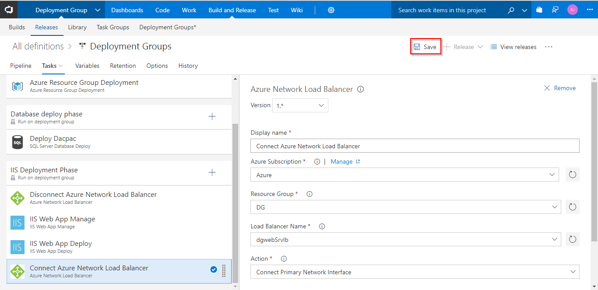

   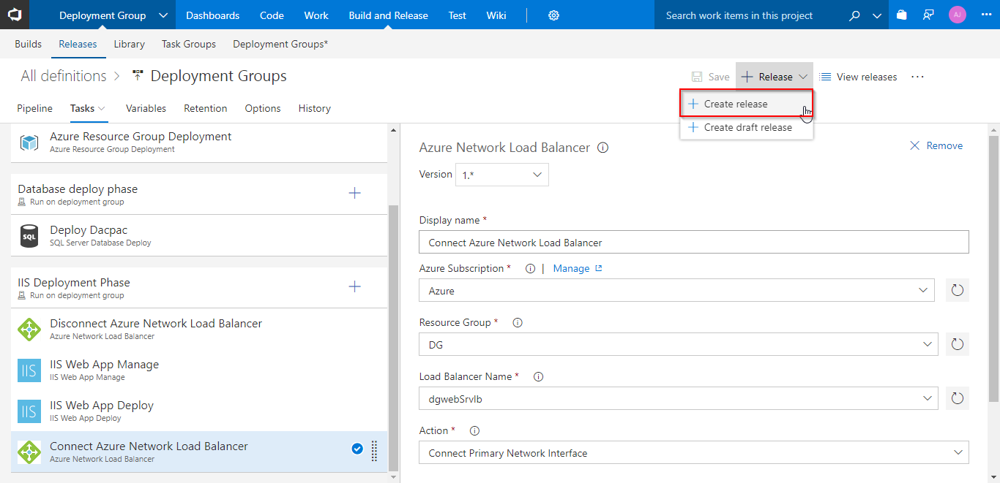

   

1. Once the release is completed, the deployments will be done to the DB and Web servers. Click on the logs to view the release summary.

    

1. In the Azure Portal, click on the **DNS** of any application instance, to access the application.

   

   

   

1. The deployed web application is displayed.

    

## Summary

Using VSTS and Azure, the web applications can be easily compiled and deployed to multiple target servers using Deployment Groups.