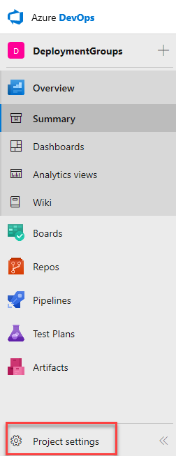
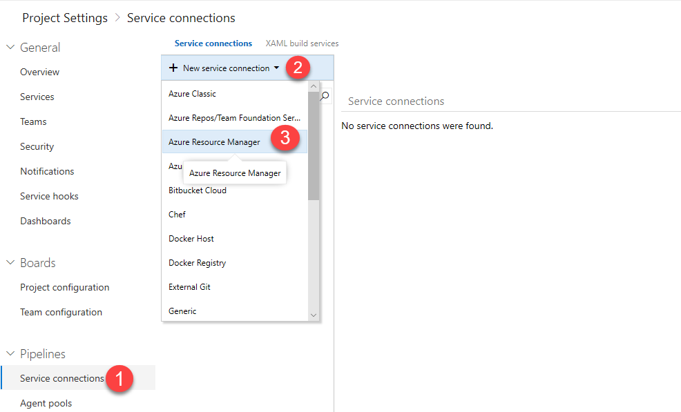
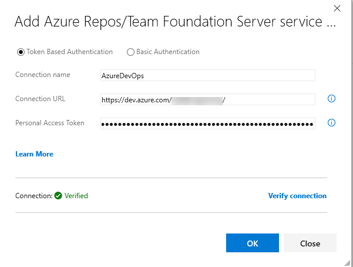

Last updated : {{ "now" | date: "%b %d, %Y" }}.

## Overview

In the earlier versions of Azure DevOps, if the application needed to be deployed to multiple servers, the Windows PowerShell remoting had to be enabled manually, the required ports opened and the deployment agent installed on each of the servers. The pipelines had to be managed manually if a roll-out deployment was required.

All the above challenges have been handled seamlessly with the introduction of the [Deployment Groups](https://docs.microsoft.com/en-us/vsts/build-release/concepts/definitions/release/deployment-groups/){:target="_blank"}.

The Deployment Group installs a deployment agent on each of the target servers in the configured group and instructs the Release Management to gradually deploy the application to all these servers that belong to the Deployment Group. Multiple pipelines can be created for roll-out deployments so that the latest version of the application could be provided in a phased manner to multiple user groups for validating the newly introduced features.

### What's covered in this lab?

This lab covers the configuration of the deployment groups and details how the deployment groups could be used in Azure DevOps.

### Prerequisites for the lab

1. Refer the [Getting Started](../Setup/) page to know the prerequisites for this lab.

1. Click the [Azure DevOps Demo Generator](http://azuredevopsdemogenerator.azurewebsites.net/?TemplateId=77376&Name=AzureFunctions_BuildWorkshop) link and follow the instructions in [Getting Started](../Setup/) page to provision the project to your **Azure DevOps**.

## Setting up the Environment

The following resources will be provisioned on the Azure using an ARM template:

* Six Virtual Machines (VM) web servers with the IIS configured

* SQL server VM (db server) and

* Azure Network Load Balancer

1. Click on the **Deploy to Azure** button to initiate the resource provisioning. It takes approximately 10-15 minutes to complete the deployment. Provide all the necessary information as shown.

   {:target="_blank"}

   

1. Once the deployment is successful, the list of all the resources will be displayed on the Azure Portal.

   

1. Click on the **DB server VM** to view the details.

   

1. Make a note of the `DNS` name. This value will be required later during an exercise.

   

## Exercise 1: Endpoint Creation

Since the connections are not established during the project provisioning, the endpoints need to be configured manually.

1. In the Azure DevOps home page, click on the below **Project Settings**. Click on the service connections under pipelines, and add a new service connection of type **Azure Resource Manager**. Specify the **Connection name**, select the **Subscription** from the dropdown and click on the **OK** button. This endpoint will be used to connect **Azure DevOps** and **Azure**.

   

   

1. Create an endpoint of type **Azure Repos/Team Foundation Server**. Select the **Token based authentication** option and specify the following details:

   * **Connection Name**: Provide any name

   * **Connection Url**: URL of the Azure DevOps organization

   * **Personal Access Token**: The Azure DevOps organizations Personal Access Token

   > The configured endpoint will be used during the agent registration with deployment groups to provide the access to the Azure DevOps project.

   

## Exercise 2: Creating Deployment Groups

The Azure DevOps makes it easier to organize the servers for deploying the applications. A deployment group is a collection of machines with a deployment agent on each of them. Each machine interacts with the Azure DevOps to coordinate deployment of the app.

1. From the pipelines, select the [**Deployment Groups**](https://docs.microsoft.com/en-us/vsts/build-release/concepts/definitions/release/deployment-groups/){:target="_blank"} option. Click on the **Add deployment group** button to configure.

   

1. Provide a `Deployment group name`, and click on the **Create** button. The registration script generated will be displayed.

   

   

## Exercise 3: Configure Releases

The target servers are available in the deployment group for deploying the application. The release definition uses **Phases** to deploy the application to the target servers.

A [Phase](https://docs.microsoft.com/en-us/vsts/build-release/concepts/process/phases){:target="_blank"} is a logical grouping of the tasks that defines the runtime target on which the tasks will execute. A deployment group phase executes tasks on the machines defined in a deployment group.

1. From the pipelines, click on the **Releases** option and edit the pipeline.

    

1. The tasks will be grouped under the **Agent phase**, **Database deploy phase** and **IIS Deployment phase**.

   

   * **Agent Phase**: In this phase, the target servers will be associated to the deployment group using the Azure Resource Group Deployment task.

     * **Azure Resource Group Deployment**: This task will automate the configuration of the deployment group agents to the web and db servers.

       

   * **Database deploy phase**: This deployment group phase executes tasks on the machines defined in the deployment group. This phase is linked to the **db** tag.

     * **Deploy Dacpac**: This task is used to deploy dacpac file to the DB server.

       

       

   * **IIS Deployment phase**: In this phase, the application will be deployed to the web servers using the below tasks. This phase is linked to **web** tag.

      * **Azure Network Load Balancer**: As the target machines are connected to the NLB, this task will disconnect the machines from the NLB prior to the deployment and reconnect them back to the NLB after the deployment.

      * **IIS Web App Manage**: The task runs on the deployment target machine(s) registered with the Deployment Group configured for the task/phase. It creates a webapp and application pool locally with the name **PartsUnlimited** running under the port **80**

      * **IIS Web App Deploy**: The task runs on the deployment target machine(s) registered with the Deployment Group configured for the task/phase. It deploys the application to the IIS server using **Web Deploy**.

        

1. The number of concurrent deployments can be controlled by setting the value in the **Maximum number of targets in parallel** field. For example, in this lab, since there are 6 web servers, setting the target servers to **50%** will deploy the build artifacts to 3 web servers in parallel at a time.

   

1. Select the **Disconnect Azure Network Load Balancer** task and provide the following details:

   * **Azure Subscription**: An ARM Endpoint created in the **Exercise 1**

   * **Resource Group**: Name of the Resource Group which was created while provisioning the environment

   * **Load Balancer Name**: Select the name from the dropdown

   * **Action**: Set the action to **Disconnect Primary Network Interface**

   

1. Select the **Connect Azure Network Load Balancer** task and provide the following details:

    * **Azure Subscription**: An ARM Endpoint created in the **Exercise 1**

    * **Resource Group**: Name of the Resource Group which was created while provisioning the environment

    * **Load Balancer Name**: Select the name from the dropdown

    * **Action**: Set the action to **Connect Primary Network Interface**

    

1. Click on the **Variables** tab and select the **Process Variables** option. Replace the value of the **DefaultConnectionString** variable with the `SQL DNS` value noted earlier.

   

1. Click on the **Save** button and then click on the **Create release** option.

   

   

   

1. Once the release is completed, the deployments will be done to the DB and Web servers. Click on the logs to view the release summary.

    

1. In the Azure Portal, click on the **DNS** of any web application instance, to access the application.

   

   

   

1. The deployed web application will be launched and the various features can be browsed.

    

## Summary

Using VSTS and Azure, the web applications can be easily compiled and deployed to multiple target servers using Deployment Groups.