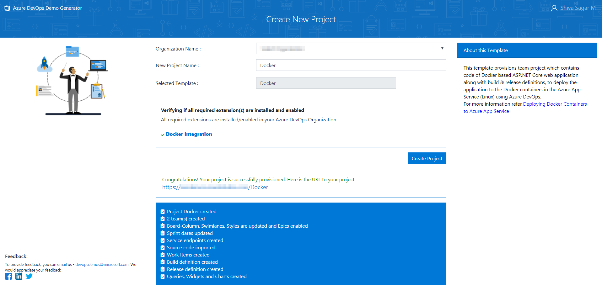
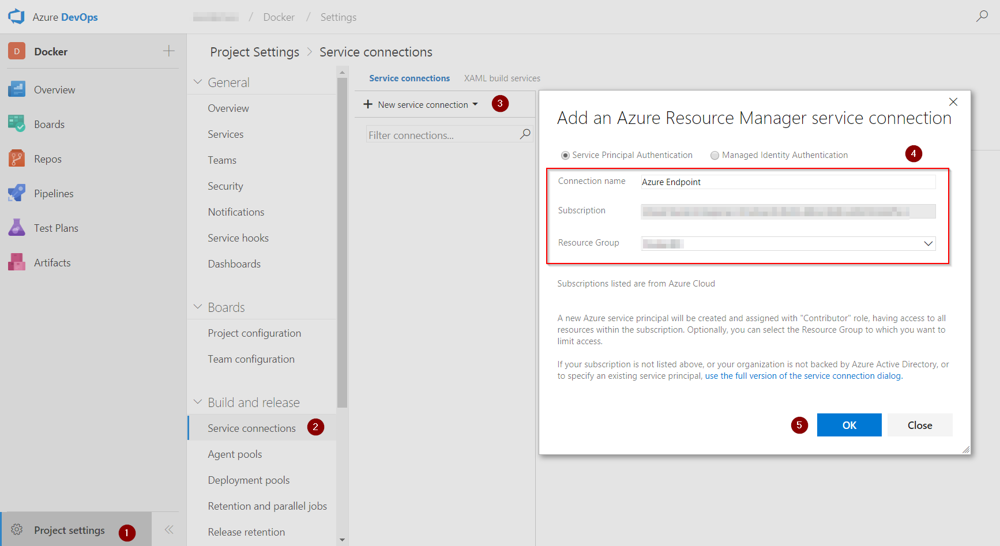
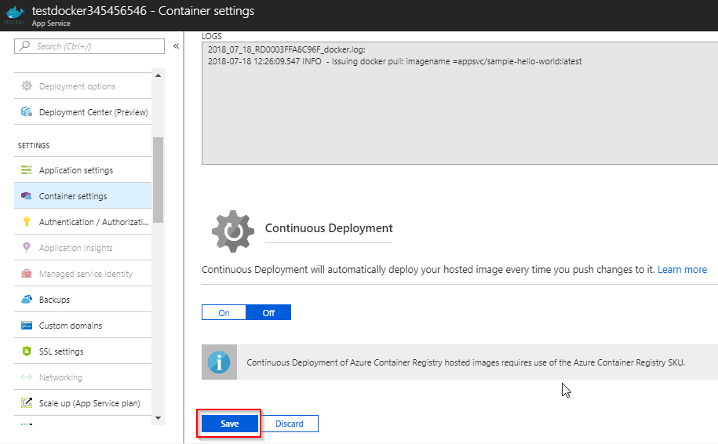

Last updated : {{ "now" | date: "%b %d,%Y" }}

## Overview

This lab outlines the process to build custom Docker images of an [**ASP.NET Core**](https://docs.docker.com/engine/examples/dotnetcore){:target="_blank"} application, push those images to a private repository in [Azure Container Registry](https://azure.microsoft.com/en-in/services/container-registry/){:target="_blank"} (ACR). These images will be used to deploy the application to the Docker containers in the **Azure App Service** (Linux) using Azure DevOps.

The Web App for Containers, allows creation of custom [Docker](https://www.docker.com/what-docker){:target="_blank"} container images, easily deploy and then run them on Azure. Combination of Azure DevOps and Azure integration with Docker will enable the following:

1. Build custom Docker images using [Azure DevOps Hosted Linux agent](https://docs.microsoft.com/en-us/Azure DevOps/build-release/concepts/agents/hosted){:target="_blank"}

1. Push and store the Docker images in a private repository

1. Deploy and run the images inside the Docker Containers

## Pre-requisites for the lab

1. Refer the [Getting Started](../Setup/) page to know the prerequisites for this lab.

1. Click the [Azure DevOps Demo Generator](http://azuredevopsdemogenerator.azurewebsites.net/?TemplateId=77376&Name=AzureFunctions_BuildWorkshop) link and follow the instructions in [Getting Started](../Setup/) page to provision the project to your **Azure DevOps**.

## Setting up the Environment

1. Click on the **Deploy to Azure** button to initiate the configuration.

   {:target="_blank"}

1. In Custom deployment window, select the **Subscription** type, leave the default selection for the resource group, and select the **Location**. Provide the **ACR Name**, **Site Name**, **DB Server Name**, accept the **Terms and Conditions** and click on the **Purchase** button to provision the following resources:

   * Azure Container Registry

   * Azure Web App

   * Azure SQL Server Database

   

     

   

1. It takes approximately 3 to 4 minutes to provision the environment. Click on  **Go to resource group** to view the resource group.

   

1. The following components are provisioned post deployment.

   Azure Components | Description
   -----------------|------------
    Container Registry | Used to store images privately
    Storage Account | Container Registry resides in this storage account
    App Service | Docker images are deployed to containers in this App Service
    App Service Plan | Resource where App Service resides
    SQL Server | SQL Server to host database
    SQL database | SQL database to host MyHealthClinic data

   

1. Click on the **mhcdb** SQL database and make a note of the server details under the header **Server name**.

   

1. Navigate back to the resource group. Click on the container registry and make a note of the server details under the header **Login server**. These details will be required in the Exercise 2.

   

## Setting up the Azure DevOps Project

1. Use the [Azure DevOps Demo Generator](https://azuredevopsdemogenerator.azurewebsites.net/?Name=Docker&TemplateId=77363) to provision the team project on your Azure DevOps Organization.

   > **Azure DevOps Demo Generator** helps you create team projects on your Azure Devops Organization with sample content that include source code, work items, iterations, service endpoints, build and release definitions based on the template that you choose during the configuration.

   

1. Once the team project is provisioned, click on the URL to navigate to the team project.

   

## Exercise 1: Endpoint Creation

The connection between Azure DevOps and Azure is not automatically established during the team project provisioning, and hence the endpoints need to be created manually. This endpoint will be used to connect **Azure DevOps** with **Azure**. Follow the steps outlined below to create the endpoint.

1. In Azure DevOps home page, click on **Project settings** gear icon and then click on **Service connections** option to navigate to the **Service connections** screen.
Click on the **+New Service Endpoint** dropdown and select **Azure Resource Manager** option. Provide  `Connection name`, select the `Azure Subscription` and select the
appropriate `Resource Group` which we have created earlier, and then click on **OK**. The Azure credentials will be required to authorize the connection.

   

   

## Exercise 2: Configure Continuous Integration (CI) and Continuous Delivery (CD)

Now that the connection is established, the **Azure endpoint** and the **Azure Container Registry** need to be manually configured for the build and release definitions. The dacpac will also be deployed to the mhcdb database so that the schema and data is configured for the backend.

1. Navigate to the **Builds** option under the **Pipelines** tab. Select the build definition `MHCDocker.build`, and select the **Edit** option.

   

1. In the **Run services, Build services and Push services** task, update the **Azure subscription** and **Azure Container Registry** with the endpoint component from the dropdown (use the arrow keys to choose **Azure Container Registry** for the first time) and click on **Save**.

   

   

   

   |Tasks|Usage|
   |-----|-----|
   | **Run services**| prepares suitable environment by restoring the required packages|
   | **Build services**| builds **myhealth.web** image |
   | **Push services**| pushes **myhealth.web** image tagged with **$(Build.BuildId)** to container registry|
   | **Publish Build Artifacts**| used to share dacpac for database deployment through Azure DevOps artifacts|

1. Navigate to the **Releases** section under the **Pipelines** tab. Select the release definition `MHCDocker.release`, click on **Edit** option and then click on the **Tasks** section.

   

   

1. The usage details of the agents are provided below:

   |Agents|Usage Details|
   |------|-----|
   |**DB deployment**|The **Hosted VS2017** agent is used to deploy the database|
   |**Web App deployment**|The **Hosted Linux Preview** agent is used to deploy the application to the Linux Web App|

1. Under the **Execute Azure SQL:DacpacTask** section, select the **Azure Subscription** from the dropdown.

    **Execute Azure SQL:DacpacTask**: This task will deploy the dacpac to the **mhcdb** database so that the schema and data is configured for the backend.

    

1. Under **Azure App Service Deploy** task, update the **Azure subscription** and **Azure Service name** with the endpoint components from the dropdown.

    **Azure App Service Deploy** will pull the appropriate docker image corresponding to the BuildID from repository specified, and then deploys the image to the Linux App Service.

    

1. Click on the **Variables** section, update the **ACR** details and the **SQLserver** details with the details noted earlier while configuration of the environment and click on the **Save** button.

    

   >The **Database Name** is set to **mhcdb**, the **Server Admin Login** is set to **sqladmin** and the **Password** is set currently to **P2ssw0rd1234**.

## Exercise 3: Initiating the CI-CD with source Code Change

In this exercise, the source code will be modified to trigger the CI-CD.

1. Click on **Files** section under the **Repos** tab, and navigate to the `Docker/src/MyHealth.Web/Views/Home` folder and open the `Index.cshtml` file for editing.

   

1. Modify the text **JOIN US** to **CONTACT US** on the line number 28 and then click on the **Commit** button.This action would initiate an automatic build for the source code.

    

1. Click on **Builds** tab, and subsequently select the build definition `MHCDoker.build` and again click on ellipsis to view the build in progress.

    

    

1. The Build will generate and push the docker image of the web application to the Azure Container Registry. Once the build is completed, the build summary will be displayed.

    

1. Navigate to the [Azure Portal](https://portal.azure.com){:target="_blank"} and click on the **App Service** that was created at the beginning of this lab. Select the **Container Settings** option and provide the information as suggested and then click the **Save** button.

   Field | Value to be provided
   ------- | -------
   **Image Source** | Select the value **Azure Container Registry**
   **Registry** | Select the registry value from the dropdown
   **image** | Select the value **myhealth.web**
   **Tag** | Select the value **latest**. This is required to map Azure Container Registry with the Web App.

   

   

    

1. Navigate to the **Azure Container Portal** and then select the **Repositories** option to view the generated docker images.

    

1. Navigate to the **Releases** section under **Pipelines** tab, and double-click on the latest release displayed on the page. Click on **Logs** to view the details of the release in progress.

    

    

1. The release will deploy the docker image to the App Service based on the **BuildID** tagged with the docker image. Once the release is completed, the release **Logs** will be displayed.

    

1. Navigate back to the [Azure Portal](https://portal.azure.com){:target="_blank"}   and click on the **Overview** section of the **App Service**. Click on the link displayed under the **URL** field to browse the application and view the changes.

    

    

    

## Summary

Using **Azure DevOps** and **Azure**, DevOps can be configured for dockerized applications by leveraging docker capabilities enabled on Azure DevOps Linux Hosted Agents.