Last updated : {{ "now" | date: "%b %d, %Y" }}.

## Overview

This lab outlines the process to build custom Docker images of an [**ASP.NET Core**](https://docs.docker.com/engine/examples/dotnetcore/") application, push those images to a private repository in [Azure Container Registry](https://azure.microsoft.com/en-in/services/container-registry/) (ACR). These images will be used to deploy the application to the Docker containers in the **Azure App Service** (Linux) using VSTS.

The Web App for Containers allows creation of custom [Docker](https://www.docker.com/what-docker) container images, easily deploy and run them at scale on Azure. Combination of VSTS and Azure integration with Docker will enable the following:

1. [Build](https://docs.docker.com/engine/reference/commandline/build/) custom Docker images using [VSTS Hosted Linux agent](https://docs.microsoft.com/en-us/vsts/build-release/concepts/agents/hosted)
1. [Push](https://docs.docker.com/engine/reference/commandline/push/) and store the Docker images in a private repository
1. Deploy and [run](https://docs.docker.com/engine/reference/commandline/run/) the images inside the Docker Containers

The below diagram details the VSTS DevOps workflow with Docker:

## Image to be added here

## Pre-requisites for the lab

1. An active **Microsoft Azure** account.

1. An active **VSTS** account. Create a new account from [here](https://docs.microsoft.com/en-us/vsts/accounts/create-account-msa-or-work-student).

1. A [Personal Access Token](https://docs.microsoft.com/en-us/vsts/accounts/use-personal-access-tokens-to-authenticate) (PAT).

1. Installation of the **Docker Integration** extension from [Visual Studio Marketplace](https://marketplace.visualstudio.com/items?itemName=ms-vscs-rm.docker)

## Setting up the Environment

1. Click on the **Deploy to Azure** button to initiate the configuration.

   

1. In the Custom deployment window, select the **Subscription** type, leave the default selection for the resource group and select the **Location**. Provide the **ACR Name, Site Name**, **DB Server Name**, accept the **Terms and Conditions** and click on the **Purchase** button to provision the following resources:

   - Azure Container Registry

   - Azure Web App

   - Azure SQL Server Database

   > Use lower case letters for ***DB Server Name***

   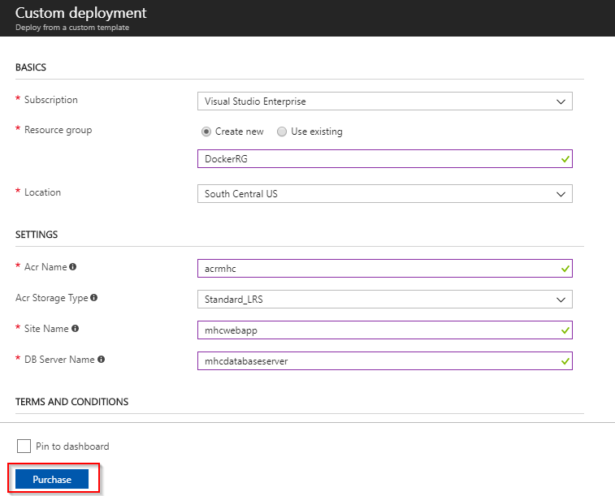

1. It takes approximately 3 to 4 minutes to provision the environment. Click on the **Go To resource group** to view the resource group.

   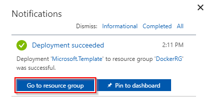

1. The following components are provisioned post deployment.

   Azure Components | Description
   -----------------|------------
    Container Registry | Used to store images privately
    Storage Account | Container Registry resides in this storage account
    App Service | Docker images are deployed to containers in this App Service
    App Service Plan | Resource where App Service resides
    SQL Server | SQL Server to host database
    SQL database | SQL database to host MyHealthClinic data

   ![]Post Azure Deployment(images/postazuredeployment.png)

1. Click on the **mhcdb** SQL database and make a note of the server under the header **Server name**.

   

1. Navigate back to the resource group. Click on the container registry and make a note of the server under the header **Login server**. These server details will be required in the Exercise 2.

   

## Setting up the VSTS Project

1. Use the [VSTS Demo Generator](https://vstsdemogenerator.azurewebsites.net/?name=PartsUnlimited) to provision the team project on the VSTS account.

   

1. Once the team project is provisioned, click on the URL to navigate to the team project.

   

## Exercise 1: Endpoint Creation

> The connection between the VSTS and the Azure is not automatically established during the team project provisioning, and hence the endpoints need to be created manually. This endpoint will be used to connect **VSTS** with **Azure**. Follow the steps outlined below to create the endpoint.

1. In the VSTS home page, click on the **Settings** gear icon  and then click on the **Services** option to navigate to the **Services** screen.

1. Click on the **+New Service Endpoint** button and select the **Azure Resource Manager** option. Provide  `Connection name`, select the `Azure Subscription` from the list and the click on the **Ok** button. The Azure credentials will be required to be provided to authorize the connection.

   

   > Disable the pop-up blocker in your browser. If a blank screen is displayed after the **Ok** button is clicked, retry the step.

## Exercise 2: Configure CI-CD

 Now that the connection is established, we will manually map the Azure endpoint and Azure Container Registry to build and release definitions. We will also deploy the dacpac to mhcdb database so that the schema and data is set for the backend.

>Note : If you encounter an error - ***TFS.WebApi.Exception: Page not found*** for Azure tasks in the build/ release definition, you can fix this by typing a random text in the Azure Subscription field and click the **Refresh** icon next to it. Once the field is refreshed, you can select the endpoint from the drop down. This is due to a recent change in the VSTS Release Management API. We are working on updating VSTS Demo Generator to resolve this issue.

1. Go to **Builds** under **Build and Release** tab, **Edit** the build definition **MHCDocker.build**

   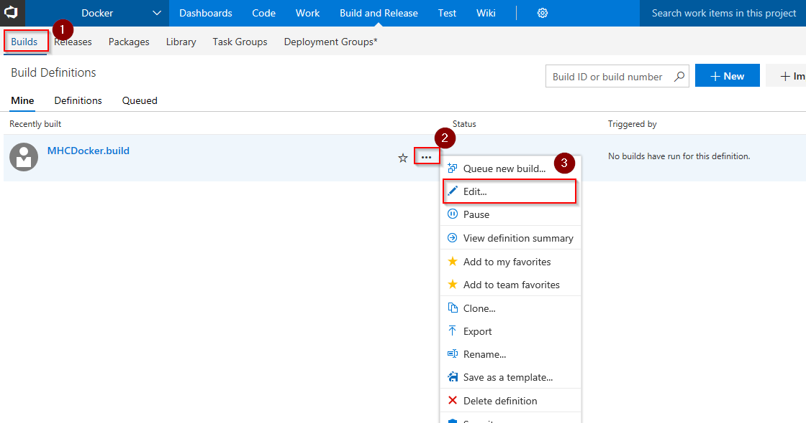

1. In the **Process** section, update **Azure subscription** and **Azure Container Registry** with the endpoint component from the dropdown. (use arrow keys to choose Azure Container Registry for the first time). Click **Save**.

   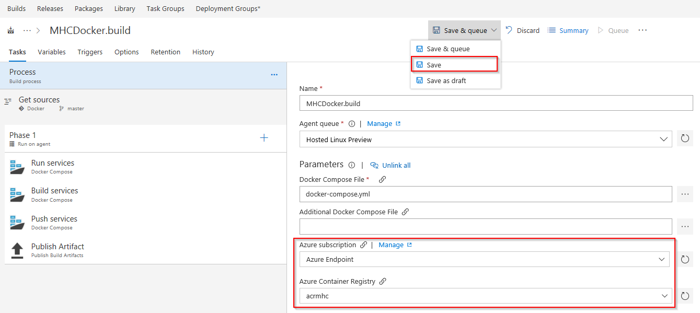

   |Tasks|Usage|
   |-----|-----|
   | **Run services**| prepares suitable environment by restoring required packages|
   | **Build services**| builds **myhealth.web** image |
   | **Push services**| pushes **myhealth.web** image tagged with **$(Build.BuildId)** to container registry|
   | **Publish Build Artifacts**| used to share dacpac for database deployment through VSTS artifacts  |

1. Go to **Releases** under **Build & Release** tab, **Edit** the release definition **MHCDocker.release** and select **Tasks**.

   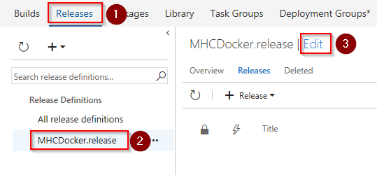

   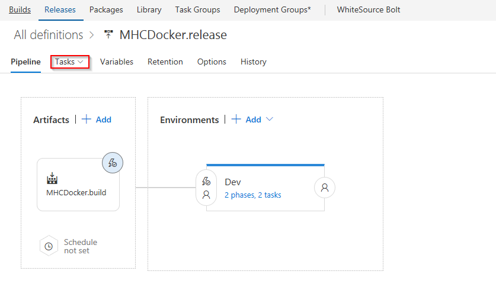

1. Description of three phases used in this release are given below:

   |Phases|Usage|
   |------|-----|
   |**DB deployment**|**Hosted VS2017** agent is used to create database|
   |**Web App deployment**|**Hosted Linux Preview** agent is used to deploy application to Linux Web App|

1. Under **Execute Azure SQL:DacpacTask**, update **Azure Subscription** from the dropdown.

    **Execute Azure SQL:DacpacTask**: will deploy the dacpac to **mhcdb** database so that the schema and data is set for the backend.

    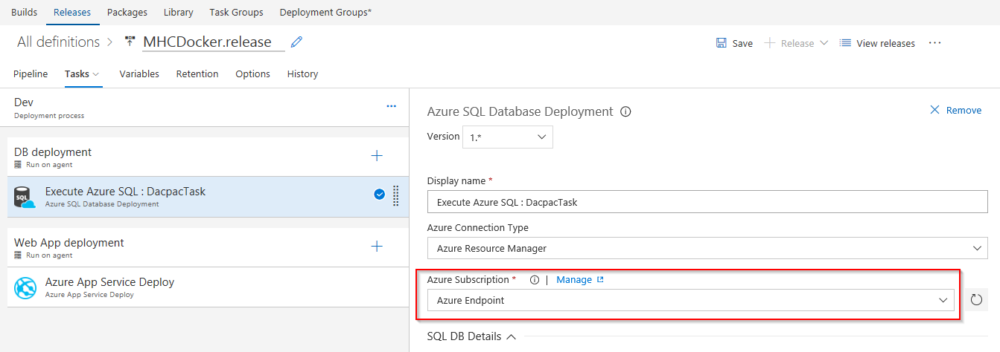

1. Under **Azure App Service Deploy** task, update **Azure subscription** and **Azure Service name** with the endpoint components from the dropdown.

    **Azure App Service Deploy** will pull the appropriate image corresponding to the BuildID from repository specified, and deploys the image to Linux App Service.

    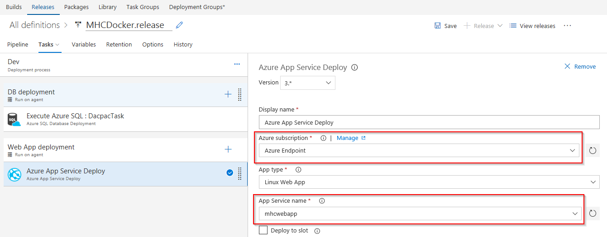

1. Click on **Variables** section, update **ACR** and **SQLserver** with the details noted earlier while setting up the environment. Click **Save**.

    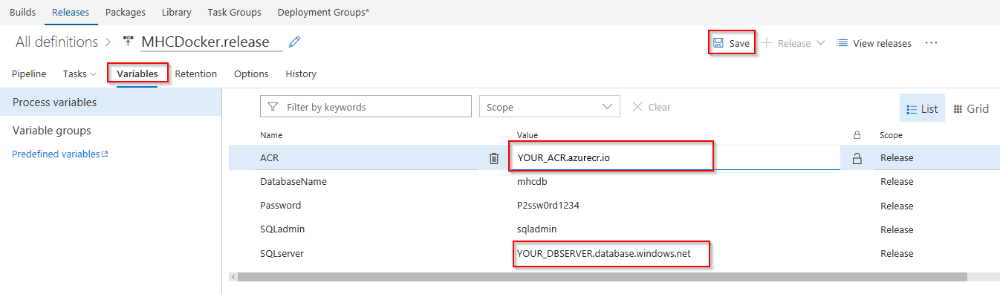

   >Note: **Database Name** is set to **mhcdb**, **Server Admin Login** is **sqladmin** and **Password** is **P2ssw0rd1234**.

## Exercise 3: Trigger CI-CD with Code Change

In this exercise, we will update the code to trigger CI-CD.

1. Go to **Files** under **Code** tab, and navigate to the below path to **Edit** the file **Index.cshtml**

   >Docker/src/MyHealth.Web/Views/Home/**Index.cshtml**

   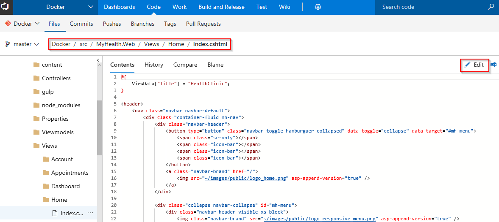

1. Go to line number **28**, update **JOIN US** to **CONTACT US**, and click **Commit**.

    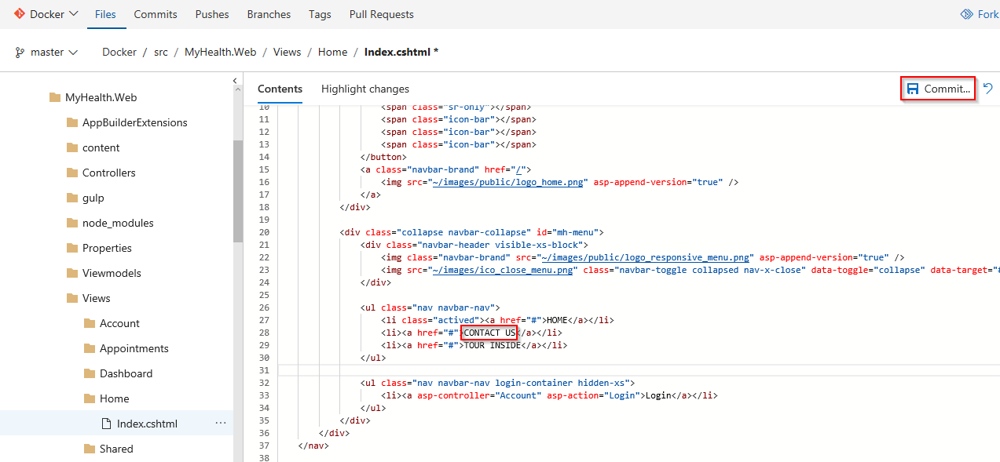

1. Click **Commit** in the pop-up window.

    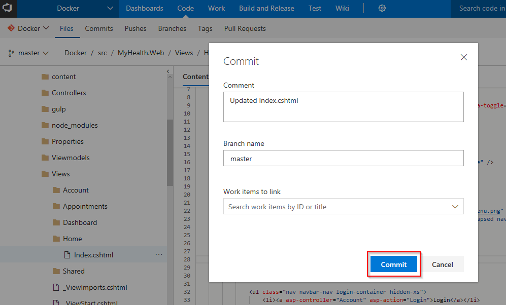

1. Go to **Builds** tab. Click on the build number to see the build in progress.

    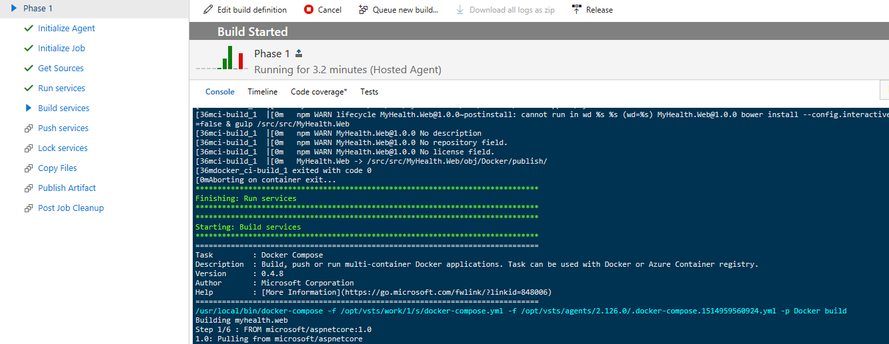

    Build will generate and push the image to Azure Container Registry. After build completes, you will see the build summary.

    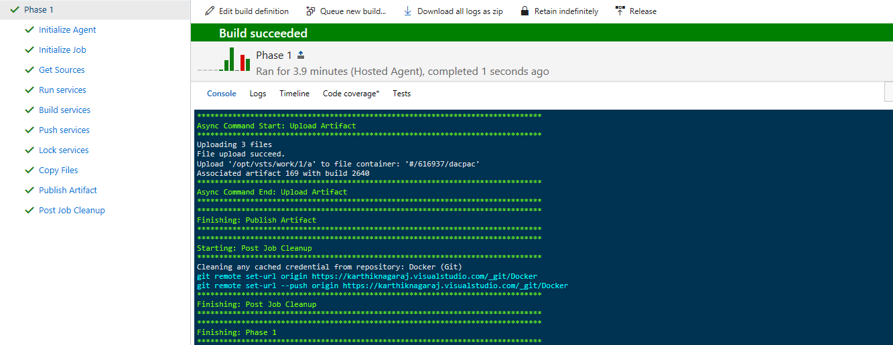

1. Go to [Azure Portal](https://portal.azure.com), navigate to the **App Service** which was created at the beginning of this lab. Select **Docker Container** section. Under **Image Source** highlight **Azure Container Registry**. Select your **Registry** from the dropdown. Under **image** dropdown select **myhealth.web** and under **Tag** dropdown select **latest**. This is required to map Azure Container Registry with the Web App. Click **Save**.

    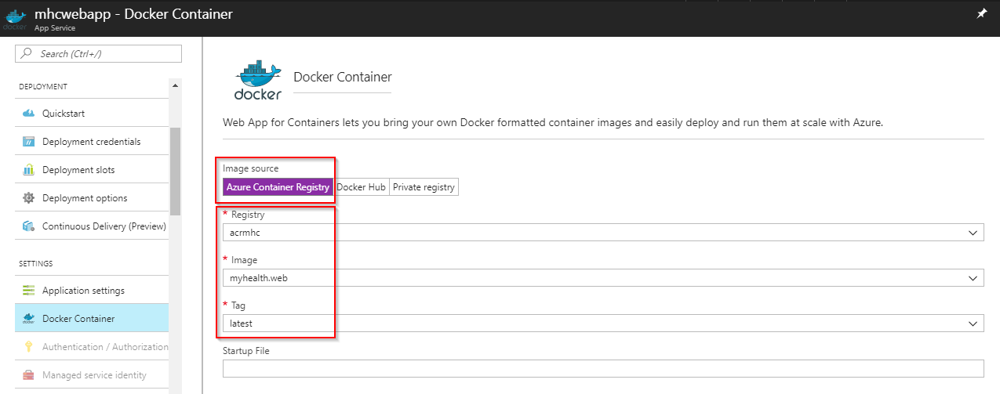

    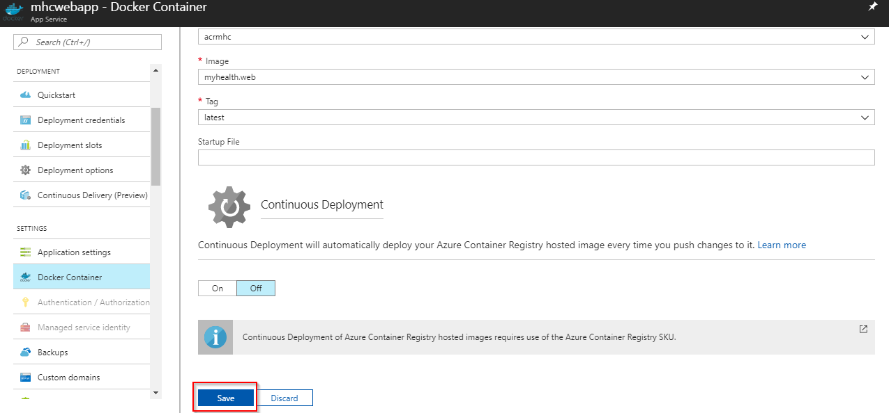

    We could configure Continuous Deployment to deploy the web app is updated when a new image is pushed to the registry, within the Azure portal itself. However, setting up a VSTS CD pipeline will provide more flexibility and additional controls (approvals, release gates, etc.) for application deployment.

1. To see generated images, go to your **Azure Container Registry** and navigate to **Repositories**.

    

1. Switch back to **Releases** in VSTS, and double click on latest release. Navigate to **Logs** section to see the release in progress.

    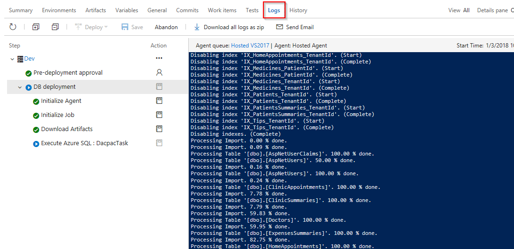

1. The release will deploy the image to App Service based on the **BuildID**, which is tagged with the image. You will see below summary once the release is complete.

    

1. Switch back to [Azure Portal](https://portal.azure.com), navigate to the **Overview** section of your **App Service**. Click on the **URL** to see the changes in your app.

    

    

    Use below credentials to login to your **HealthClinic** app:

    **Username**: user

    **Password**: P2ssw0rd@1

## Summary

With **Visual Studio Team Services** and **Azure**, we can build DevOps for dockerized applications by leveraging docker capabilities enabled on VSTS Hosted Agents.