<div class="rw-ui-container"></div>

## Overview

A Docker container image is a lightweight, standalone, executable package of software that includes everything needed to run an application: code, runtime, system tools, system libraries and settings.

This lab outlines the process to build custom Docker images of an [**ASP.NET Core**](https://docs.docker.com/engine/examples/dotnetcore){:target="_blank"} application, push those images to a private repository in [Azure Container Registry](https://azure.microsoft.com/en-in/services/container-registry/){:target="_blank"} (ACR). These images will be used to deploy the application to the Docker containers in the **Azure App Service** (Linux) using Azure DevOps.

The Web App for Containers allows the creation of custom [Docker](https://www.docker.com/what-docker){:target="_blank"} container images, easily deploy and then run them on Azure. Combination of Azure DevOps and Azure integration with Docker will enable the following:

1. Build custom Docker images using [Azure DevOps Hosted Linux agent](https://docs.microsoft.com/en-us/azure/devops/pipelines/agents/agents?view=vsts){:target="_blank"}

1. Push and store the Docker images in a private repository

1. Deploy and run the images inside the Docker Containers

<div class="bg-slap">Want additional learning? Check out the <a href="https://docs.microsoft.com/en-us/learn/modules/deploy-docker/" target="_blank"><b><u> Automate Docker container deployments </u></b></a> module on Microsoft Learn.</div>

## Before you begin

1. Refer the [Getting Started](../Setup/) page to know the prerequisites for this lab.

1. Click the [Azure DevOps Demo Generator](https://azuredevopsdemogenerator.azurewebsites.net/?Name=Docker&TemplateId=77363) link and follow the instructions in [Getting Started](../Setup/) page to provision the project to your **Azure DevOps**.

## Setting up the Environment

1. The following resources needs to be configured for this lab:

   * Azure Container Registry

   * Azure Web App for Containers

   * Azure SQL Server Database

1. Launch the [Azure Cloud Shell](https://docs.microsoft.com/en-in/azure/cloud-shell/overview) from the Azure portal and choose Bash.

1. **Create Azure Container Registry:**
    
    i.  Create a Resource Group. Replace `<region>` with the region of your choosing, for example eastus.
        
    ```bash
     az group create --name DockerRG --location <region>
    ```

    ii. Create ACR( Azure Container Registry)

    ```bash
    az acr create -n <unique-acr-name> -g DockerRG --sku Standard --admin-enabled true
    ```

    

1. **Create Azure Web App for Containers**:
   
   i. Create a Linux App Service Plan:

   ```bash
   az appservice plan create -n myappserviceplan -g DockerRG --is-linux
   ```

   ii. Create a custom Docker container Web App: To create a web app and configuring it to run a custom Docker container, run the following command:

   ```bash
   az webapp create -n <unique-appname> -g DockerRG -p myappserviceplan -i elnably/dockerimagetest
   ```
1. **Create Azure SQL server and Database**: 
    Create an Azure SQL server.
    
    ```bash
    az sql server create -l <region> -g DockerRG -n <unique-sqlserver-name> -u sqladmin -p P2ssw0rd1234
    ```

    Create a database

    ```bash
    az sql db create -g DockerRG -s <unique-sqlserver-name> -n mhcdb --service-objective S0
    ```
      

1. Create a firewall rule for SQL server that allows access from Azure services

    ```bash
    az sql server firewall-rule create --resource-group DockerRG --server <your-sqlserver-name> --name AllowAllAzureIps --start-ip-address 0.0.0.0 --end-ip-address 0.0.0.0
    ```
1. Update web app's connection string
   
   ```bash
   az webapp config connection-string set -g DockerRG -n <your-appservice-name> -t SQLAzure --settings defaultConnection='Data Source=tcp:<your-sqlserver-name>.database.windows.net,1433;Initial Catalog=mhcdb;User Id=sqladmin;Password=P2ssw0rd1234;'
   ```
    > Update your app service name and SQL server name in the above command. This command will add a connection string to your app service with the name `defaultConnection`.

1. Navigate to the resource group. You can see that the following components are provisioned.

   Azure Components | Description
   -----------------|------------
    Container Registry | Used to store images privately
    Web App for Containers | Docker images are deployed to containers in this App Service
    App Service Plan | Resource where App Service resides
    SQL Server | SQL Server to host database
    SQL database | SQL database to host MyHealthClinic data

   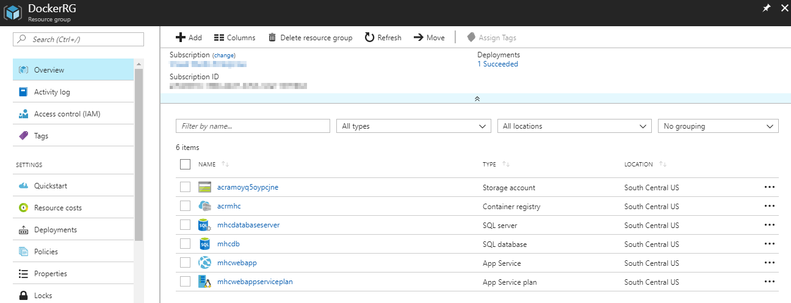

1. Click on the **mhcdb** SQL database and make a note of the server details under the header **Server name**.

   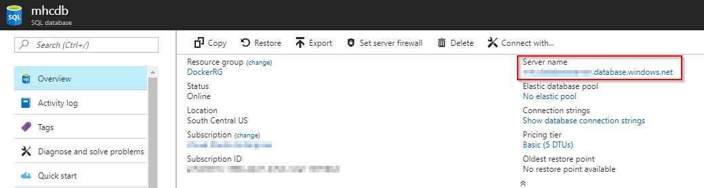

1. Navigate back to the resource group. Click on the container registry and make a note of the server details under the header **Login server**. These details will be required in the Exercise 2.

   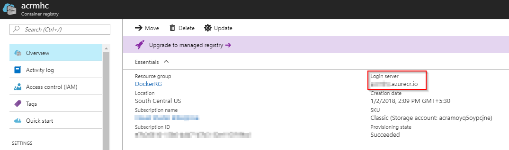

## Exercise 1: Configure Continuous Integration (CI) and Continuous Delivery (CD)

Now that the required resources are provisioned, the **Build** and the **Release** definition need to be manually configured with the new information. The dacpac will also be deployed to the mhcdb database so that the schema and data is configured for the backend.

1. Navigate to the **Builds** option under the **Pipelines** tab. Select the build definition `MHCDocker.build`, and select the **Edit** option.

   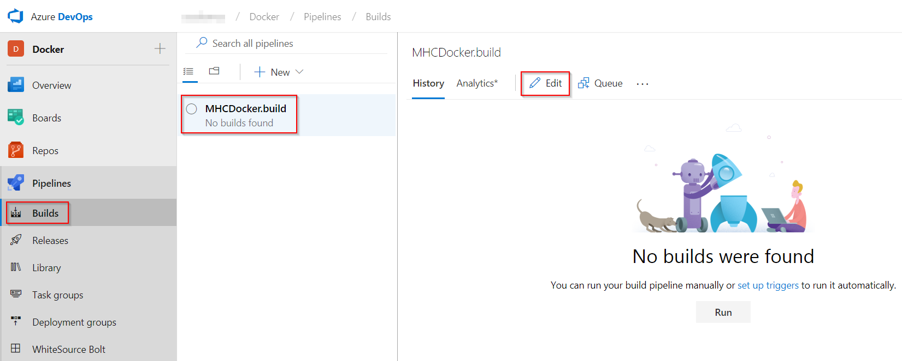

1. In the **Run services, Build services and Push services** tasks, authorize (only for the first task) the **Azure subscription** and update **Azure Container Registry** with the endpoint component from the dropdown and click on **Save**.

   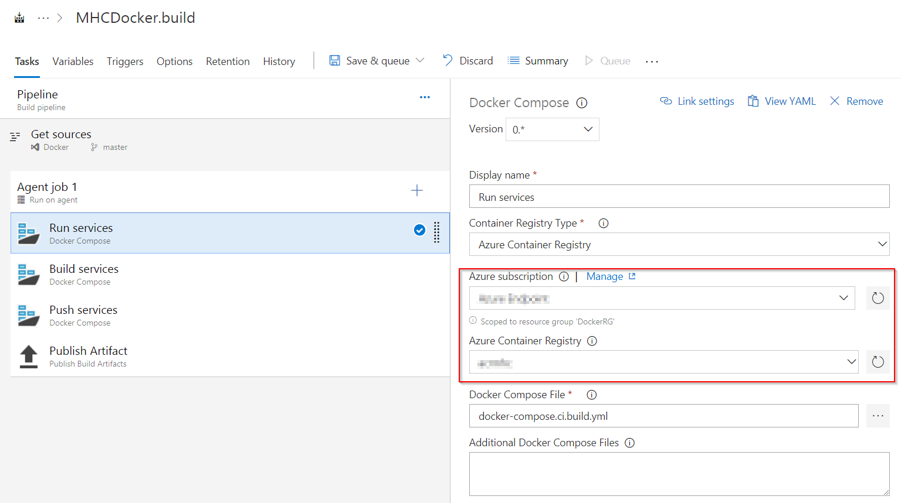

   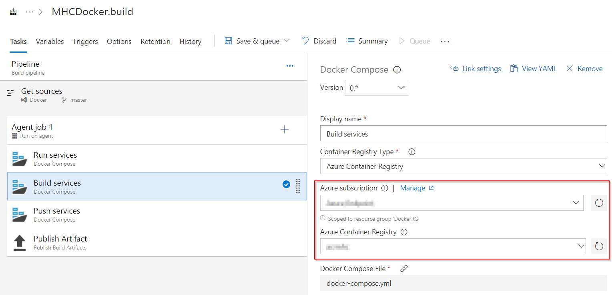

   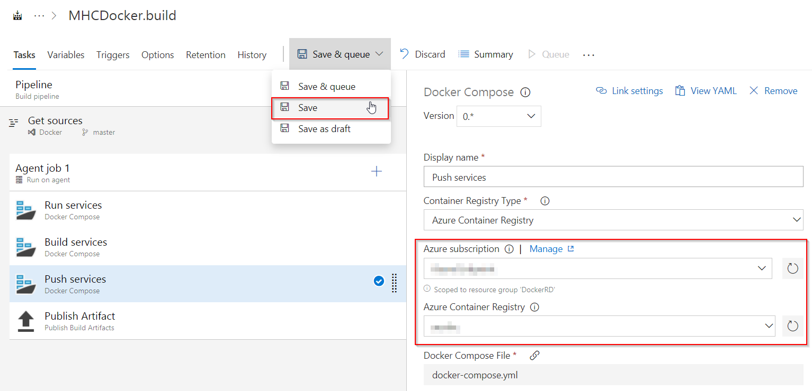

   |Tasks|Usage|
   |-----|-----|
   | **Run services**| prepares suitable environment by restoring the required packages|
   | **Build services**| builds **myhealth.web** image |
   | **Push services**| pushes **myhealth.web** image tagged with **$(Build.BuildId)** to container registry|
   | **Publish Build Artifacts**| used to share dacpac for database deployment through Azure DevOps artifacts|

1. Navigate to the **Releases** section under the **Pipelines** tab. Select the release definition `MHCDocker.release`, click **Edit Pipeline** option and then click on the **Tasks** section.

   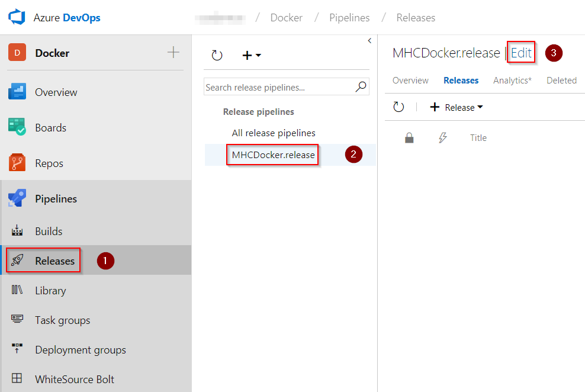

   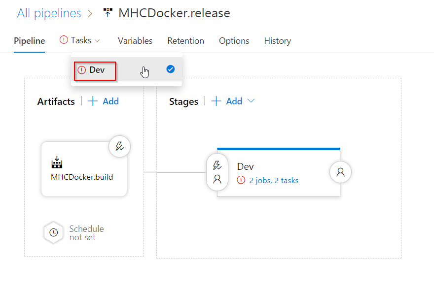

1. The usage details of the agents are provided below:

   |Agents|Usage Details|
   |------|-----|
   |**DB deployment**|The **Hosted VS2017** agent is used to deploy the database|
   |**Web App deployment**|The **Hosted Ubuntu 1604** agent is used to deploy the application to the Linux Web App|

1. Under the **Execute Azure SQL: DacpacTask** section, select the **Azure Subscription** from the dropdown.

    **Execute Azure SQL: DacpacTask**: This task will deploy the dacpac to the **mhcdb** database so that the schema and data are configured for the backend.

    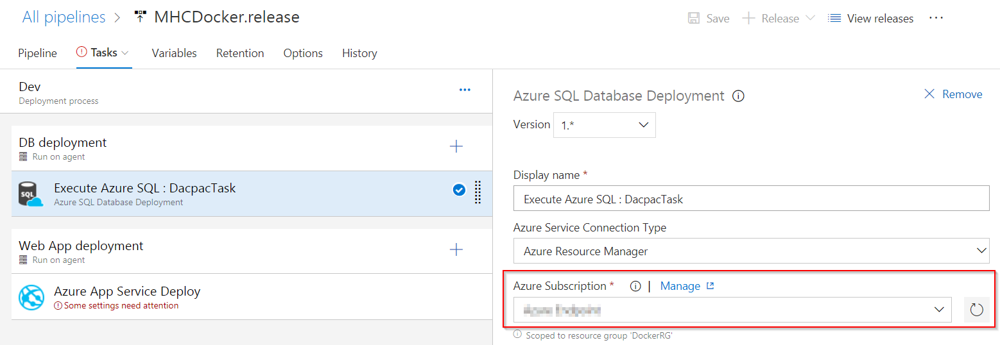

1. Under **Azure App Service Deploy** task, update the **Azure subscription** and **Azure App Service name** with the endpoint components from the dropdown.

    **Azure App Service Deploy** will pull the appropriate docker image corresponding to the BuildID from repository specified, and then deploys the image to the Linux App Service.

    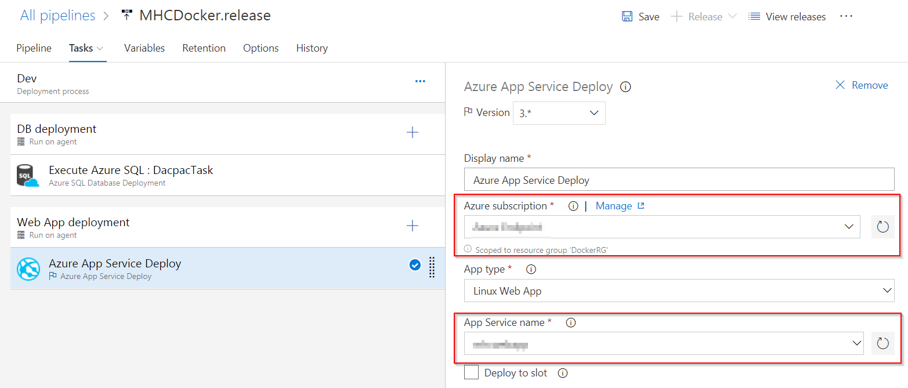

1. Click on the **Variables** section, update the **ACR** details and the **SQLserver** details with the details noted earlier while the configuration of the environment and click on the **Save** button.

    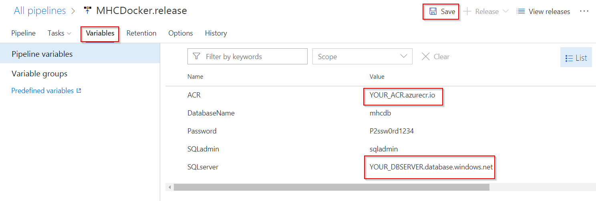

   >The **Database Name** is set to **mhcdb**, the **Server Admin Login** is set to **sqladmin** and the **Password** is set currently to **P2ssw0rd1234**.

## Exercise 2: Initiate the CI Build and Deployment through code commit 

In this exercise, the source code will be modified to trigger the CI-CD.

1. Click on **Files** section under the **Repos** tab, and navigate to the `Docker/src/MyHealth.Web/Views/Home` folder and open the `Index.cshtml` file for editing.

   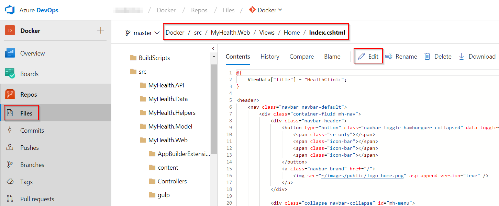

1. Modify the text **JOIN US** to **CONTACT US** on the line number 28 and then click on the **Commit** button. This action would initiate an automatic build for the source code.

    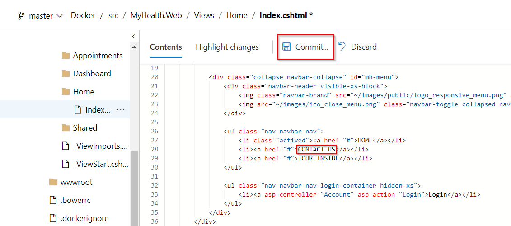


1. Click on **Builds** tab, you will see `MHCDoker.build` buils is queued. Double click on **Build #** or **Commit** to view the build in progress.

    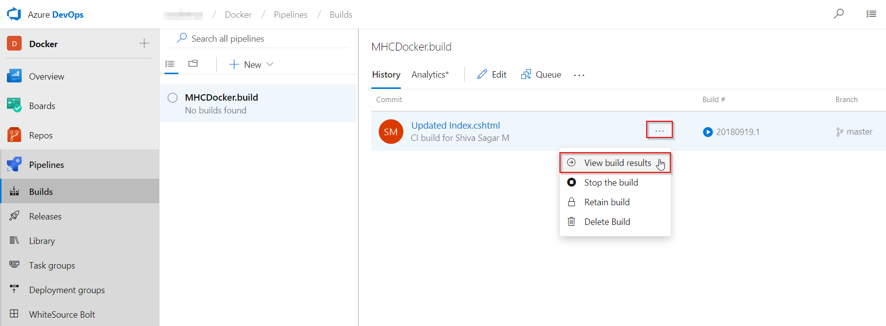

    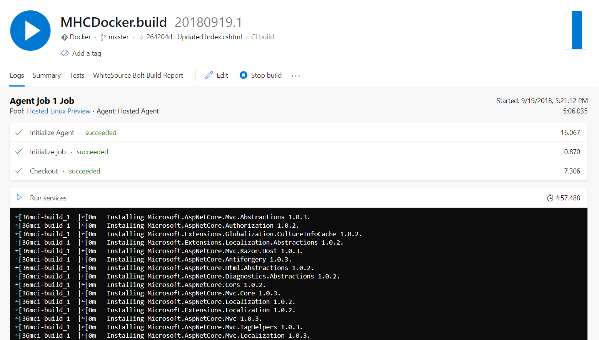

1. The Build will generate and push the docker image of the web application to the Azure Container Registry. Once the build is completed, the build summary will be displayed.

    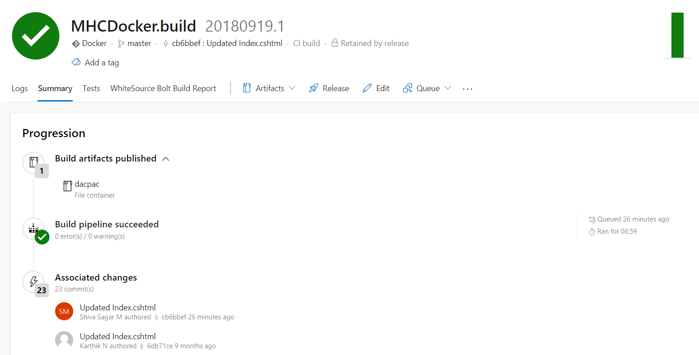

1. Navigate to the [Azure Portal](https://portal.azure.com){:target="_blank"} and click on the **App Service** that was created at the beginning of this lab. Select the **Container Settings** option and provide the information as suggested and then click the **Save** button.

   Field | Value to be provided
   ------- | -------
   **Image Source** | Select the value **Azure Container Registry**
   **Registry** | Select the registry value from the dropdown
   **image** | Select the value **myhealth.web**
   **Tag** | Select the value **latest**. This is required to map Azure Container Registry with the Web App.

   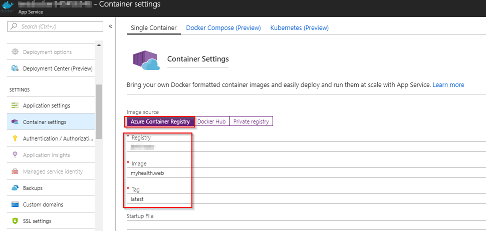

    

1. Navigate to the **Azure Container registry** created and then select the **Repositories** option to view the generated docker images.

    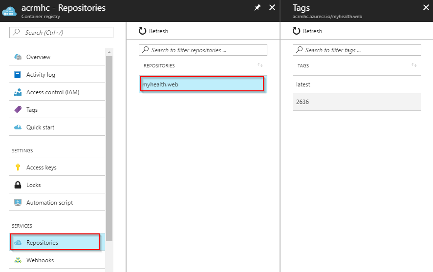

1. Navigate to the **Releases** section under **Pipelines** tab, and double-click on the latest release displayed on the page. Click on **Logs** to view the details of the release in progress.

    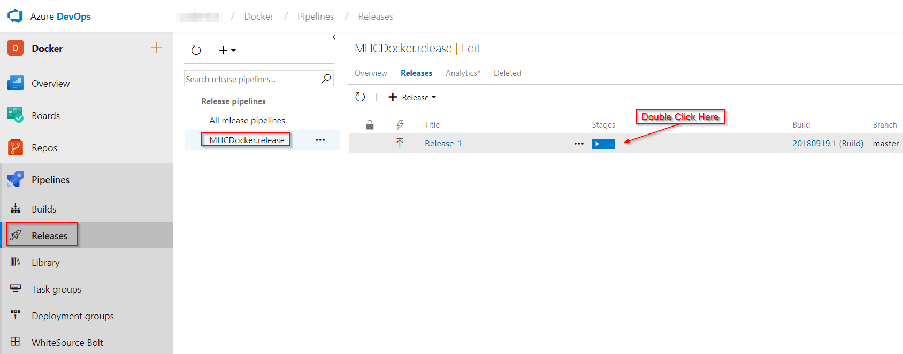

    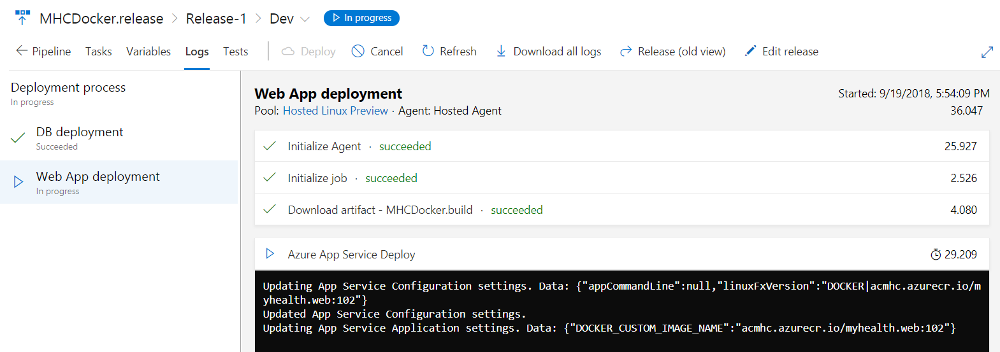

1. The release will deploy the docker image to the App Service based on the **BuildID** tagged with the docker image. Once the release is completed, the release **Logs** will be displayed.

    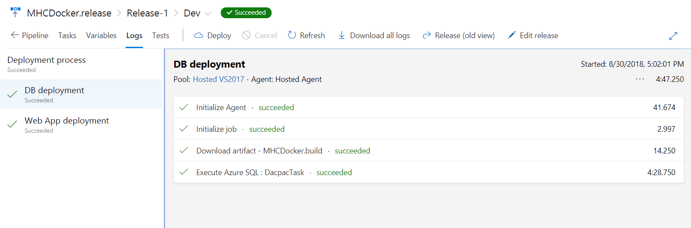

1. Navigate back to the [Azure Portal](https://portal.azure.com){:target="_blank"}   and click on the **Overview** section of the **App Service**. Click on the link displayed under the **URL** field to browse the application and view the changes.

    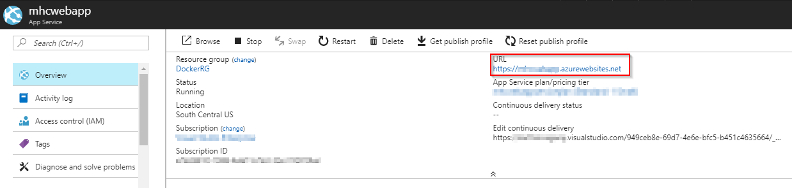

    

1. Use the credentials **Username**: `user` and **Password**: `P2ssw0rd@1` to login to the **HealthClinic** web application.

## Summary

With **Azure DevOps** and **Azure**, we have configured a dockerized application by leveraging docker capabilities enabled on Azure DevOps Ubuntu Hosted Agent.
