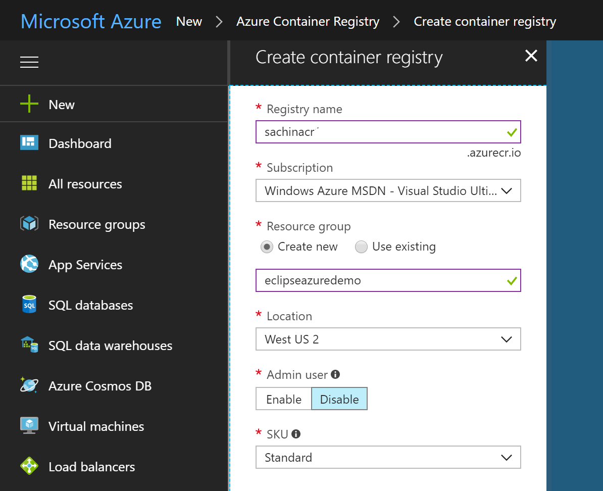
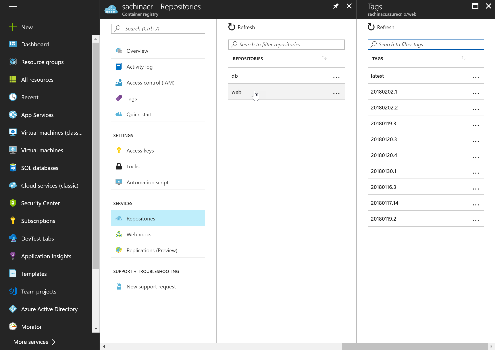
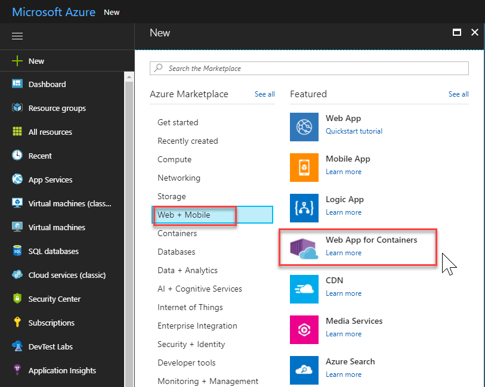
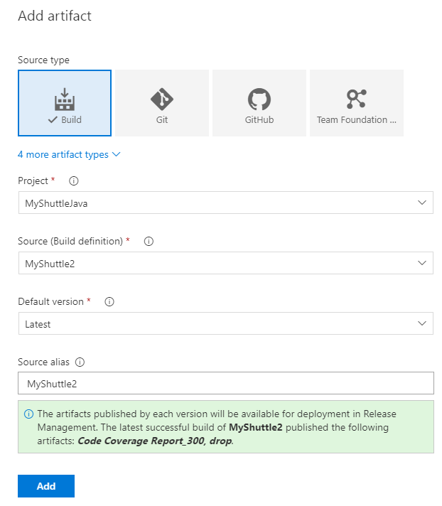
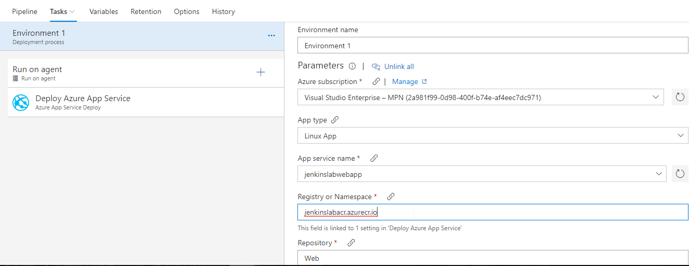
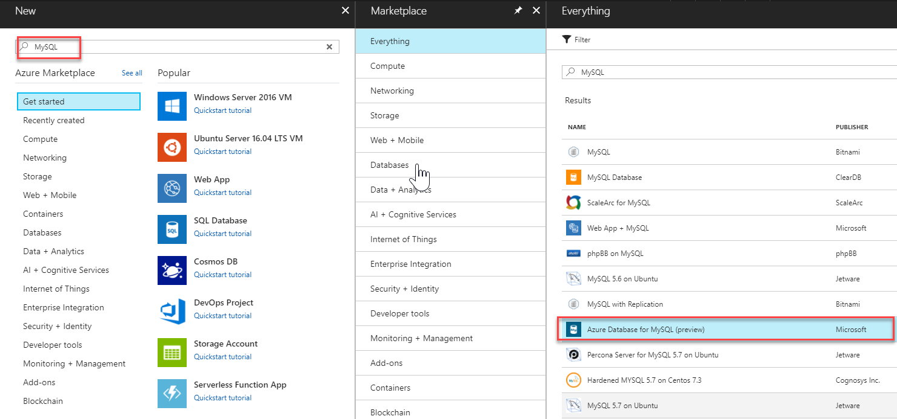
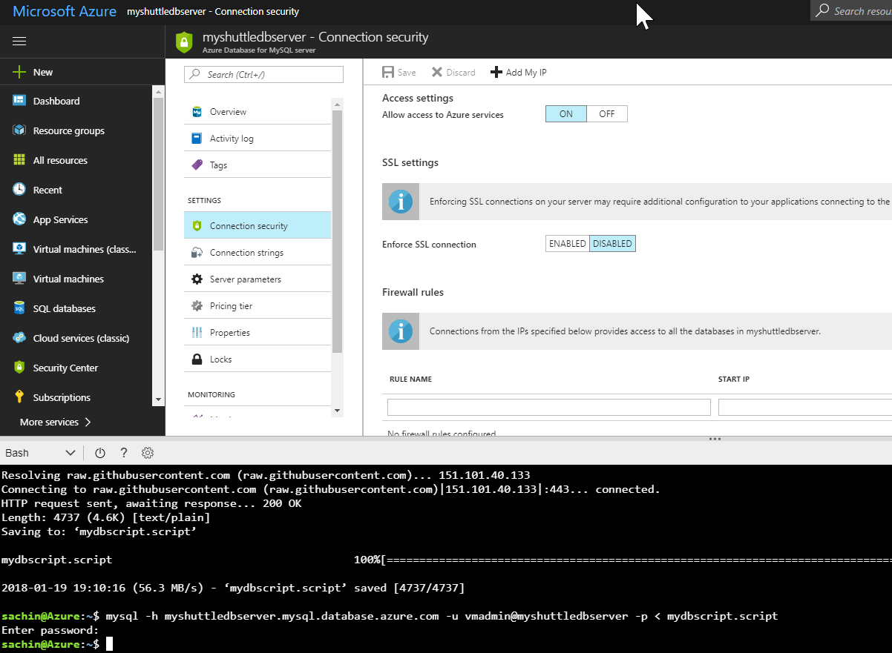

Last updated : {{ "now" | date: "%b %d,%Y" }}

## Overview

With Azure Web App for containers, it is easy to deploy container-based web apps. You can pull container images from Docker Hub or a private Azure Container Registry, and deploy the containerized app with your preferred dependencies to production in seconds.

### What's covered in this lab

In this lab, you will learn how you can set up a Continuous Integration (CI) and Continuous Delivery (CD) pipelines with Azure Pipelines to deploy a container-based Java web application to an Azure web app for containers.

This lab will show how you can

* Create a new Azure App Service and configure it to use Apache Tomcat
* Create a new MySQL database
* Use Azure App Service Task to deploy a WAR file

### Prerequisites for the lab

1. Refer the [Getting Started](../Setup/) page to know the prerequisites for this lab.

1. Use the [Azure DevOps Demo Generator](http://azuredevopsdemogenerator.azurewebsites.net) to provision the project to your Azure DevOps Org. Use the **MyShuttle** template.

  

## Exercise 2:  Configuring a CI pipeline to build and publish Docker images

In this task you will configure a CI pipeline that will build and push the image to Azure Container Registry

1. Open the <a href="https://portal.azure.com" target="_blank">Azure Portal</a>

1. Select **+New** and search for **Azure Container Registry**. Select **Create**. In the *Create Container Registry* dialog, enter a name for the service, select the resource group, location, **Enable** Admin User etc., and select **Create**.

    

1. Return to  Azure DevOps, from **Azure Pipelines**, select **Builds**. Select **+ New** and +**New Build pipeline**. 

1. Select the **Maven** template. This template will add a *maven* task to build the pom.xml file. The maven task should be updated to the following settings

    | Parameter | Value | Notes |
    | --------------- | ---------------------------- | ----------------------------------------------------------- |
    | Options | `-DskipITs --settings ./maven/settings.xml` | Skips integration tests during the build |
    |Code Coverage Tool | JaCoCo | Selects JaCoCo as the coverage tool |
    | Source Files Directory | `src/main` | Sets the source files directory for JaCoCo |

      

1. Then there is **Copy** task. We will copy the WAR file from the sources directory to the staging folder.

    | Parameter | Value | Notes |
    | --------------- | ---------------------------- | ----------------------------------------------------------- |
    |Source Folder| $(build.sourcesdirectory)| Copy from the source folder|
    |Contents|target/myshuttledev*.war| Copy the MyShuttle WAR file
    |Target Folder|$(build.artifactstagingdirectory)|we will copy it to the default staging folder|

1.  Next, we have a **Publish** tasks to publish the build artifacts to Azure Pipelines.
    | Parameter | Value | Notes |
    | --------------- | ---------------------------- | ----------------------------------------------------------- |
    |Path to publish| $(build.artifactstagingdirectory)| Copy contents from the staging folder|
    |Artifact name|drop|Provide a name for the artifact folder.  |
    |Artifact publish location |Visual Studio Team Services/TFS|we will publish it to Azure pipelines|


1. Next add two **Docker** tasks to build and publish  the images. Select the first **Docker** task and set the **Command** to **Build**. The other settings of the Docker compose tasks are as follows:

    | Parameter | Value | Notes |
    | --------------- | ---------------------------- | ------------------------------------------- |
    | Azure Subscription | Your Azure subscription | The subscription that contains your registry |
    | Container Registry Type | Azure Container Registry | This is to connect to the Azure Container Registry you created earlier |
    | Azure Container Registry | Your registry | Select the Azure Container registry you created earlier |
    |Command|build|Docker command|
    |Dockerfile|src/Dockerfile|Point to the src folder for the docker file|
    |Use default build context|Uncheck this option|
    |Build context|. (dot representing the root folder)| The build context should be the root folder|
    |Image name| `Web:$(Build.BuildNumber)` | Sets a unique name for each instance of the build |
    |Qualify image name| Check (set to true)|   
    | Include Latest Tag | Check (set to true) | Adds the `latest` tag to the images produced by this build |

    

1. We will add another **Docker** task with the same settings (you can also *clone* the previous task). We will change the **Command** to **Push** and set the **Image name** to  `Web:$(Build.BuildNumber)`. This action will instruct the task to push the Web image to the container registry

      

1. Click the **Save and Queue** button to save and queue this build.Make sure you are using the **Hosted Linux Agent**.

1. Wait for the build to complete. When it is successful you can go to your Azure portal and verify if the images were pushed successfully. 
    

1. If you are following this from the Eclipse lab, you can also verify if the images were pushed correctly from the **Azure Explorer** view. *Sign in* to Azure, refresh Azure Container Registry. Right click and select **Explore Container Registry**. You should see the image - tagged with the build number.

    

## Exercise 3: Deploying to an Azure Web App for containers

In this exercise, we will setup a CD pipeline to deploy the web application to Azure web app. First, let's create the Web App.

1. Sign into your <a href="https://portal.azure.com" target="_blank">Azure Portal</a>

1. In the Azure Portal, choose **New, Web + Mobile** and then choose **Web App for Containers**

     

1. Provide a name for the new web app, select existing or create new resource group for the web app. Then select **Configure Container** to specify the source repository for the images. Since we are using ACR to store the images, select **Azure Container Registry**. Select the **Registry**, **Image** value as **web** and **Tag** with the latest build value from the drop-downs. Select **OK** and then select **Create** to start provisioning the web app

1. Once the provisioning is complete, go to the web app properties page, and select the URL to browse the web app. You should see the default **Tomcat** page

1. Append **/myshuttledev** the web application context path for the app, to the URL to get to the MyShuttle login page. For example if your web app URL is `https://myshuttle-azure.azurewebsites.net/` , then your URL to the login page is `https://myshuttle-azure.azurewebsites.net/myshuttledev/`

    

    We could configure *Continuous Deployment* to deploy the web app is updated when a new image is pushed to the registry, within the Azure portal itself. However, setting up a VSTS CD pipeline will provide more flexibility and additional controls (approvals, release gates, etc.) for application deployment

1. Back in Azure DevOps, select **Azure Pipelines** and then **Releases**. Select **+** and then **Create Release Definition**

1. Select the **Azure App Service Deployment** template and click **Apply**

1. Select **Pipeline**. Click **+Add** to add the artifacts. Select **Build** for the source type. Select the **Project**, **Source** and the **Default version**.  Finally select **Add** to save the settings

    

1. Open the environment. Select **Environment 1** and configure as follows

    * Pick the Azure subscription
    * Select **Linux App** for the **App Type**
    * Enter the **App Service** name that you created
    * Enter the **Azure Container Registry** server url for **Registry or Namespace** and then
    * Enter ***Web*** for the **Repository**

    

1. Select the **Deploy Azure App Service** task and make sure that these settings are reflected correctly. Note that the task allows you to specify the **Tag** that you want to pull. This will allow you to achieve end-to-end traceability from code to deployment by using a build-specific tag for each deployment. For example, with the Docker build tasks  you can tag your images with the Build.ID for each deployment.

    

1. Select **Save** and then click **+ Release**  \| **Create Release** to start a new release

1. Check the artifact version you want to use and then select **Create**

1. Wait for the release to complete and then navigate to the URL `http://{your web app name}.azurewebsites.net/myshuttledev`. You should be able to see the login page

## Setting up MySQL database

Next, let's set up the MySQL database for the application

1. From the Azure portal, select **+ New** and search for **MySQL**. Choose **Azure Database for MySQL(preview)** from the filtered result list and click **Create**. 

    

1. Enter all required information and select **Create**

    

1. Navigate to **Connection Security** section, enable **Allow Access to Azure Services** and click **Save**. Select **Properties**. Note down **SERVER NAME** and **SERVER ADMIN LOGIN NAME**

1. In this example, the server name is **myshuttle-1-mysqldbserver.mysql.database.azure.com** and the admin user name is **mysqldbuser@myshuttle-1-mysqldbserver**

1. We will use the MySQL command-line tool to establish a connection to the Azure Database for MySQL server. We will run the MySQL command-line tool from the Azure Cloud Shell in the browser. To launch the Azure Cloud Shell, click the `>_` icon in the top right toolbar and choose **Bash** if given an option to choose the shell type.

1. Enter the following command

    ```HTML
    wget https://raw.githubusercontent.com/hsachinraj/azure-arm-templates/master/vstsazurejl_arm/mydbscript.script
    ```
    This should download the file that we want to execute on the server

1. Next, we will execute the SQL from the downloaded file on the database server. Enter the following command
    ````SQL
    mysql -h myshuttle-1-mysqldbserver.mysql.database.azure.com -u mysqldbuser@myshuttle-1-mysqldbserver -p < mydbscript.script
    ````
    Enter the password that you specified during provisioning the database

    

    >This should create the database, tables and populate records for us. 

1. Next, navigate to the Web app that you have created. Click **Application Settings** and scroll down to the **Connection Strings** section

1. Add a new MySQL connection string with **MyShuttleDb** as the name and the following string for the value - `jdbc:mysql://{MySQL Server Name}:3306/alm?useSSL=true&requireSSL=false&autoReconnect=true&user={your user name}&password={your password}`

1. Click **Save** to save the connection string

   

    ````Java
    String conStr = System.getenv("MYSQLCONNSTR_MyShuttleDb");
    ````

You have now setup and configured the database needed to deploy and run the MyShuttle application.

1. You should be able to login to the application now. Return back to the login page and try logging is using any of the username/password combination:

    * *fred/fredpassword*
    * *wilma/wilmapassword*
    * *betty/bettypassword*
