

## Overview

With Azure Web App for containers, it is easy to deploy container-based web apps. You can pull container images from Docker Hub or a private Azure Container Registry, and deploy the containerized app with your preferred dependencies to production in seconds.

### What's covered in this lab

In this lab, you will learn how you can set up a Continuous Integration (CI) and Continuous Delivery (CD) pipelines with Azure Pipelines to deploy a container-based Java web application to an Azure web app for containers.

This lab will show how you can

* Create a new Azure App Service with Container and configure it to use Apache Tomcat
* Create a new MySQL database
* Use Azure App Service Task to deploy a WAR file

Want additional learning? Check out the <a href="https://docs.microsoft.com/en-us/learn/modules/deploy-java-containers/" target="_blank"><b><u> Automate Java container deployments with Azure Pipelines </u></b></a> module on Microsoft Learn.

### Prerequisites for the lab

1. Refer the [Getting Started](../Setup/) page to know the prerequisites for this lab.

1. Use the [Azure DevOps Demo Generator](https://azuredevopsdemogenerator.azurewebsites.net/?TemplateId=77371&Name=MyShuttle) to provision the project to your Azure DevOps Org. Use the **MyShuttle** template.

  

## Exercise 1:  Configuring a CI pipeline to build and publish Docker image

In this task, you will configure a CI pipeline that will build and push the image to Azure Container Registry.

1. Open the <a href="https://portal.azure.com" target="_blank">Azure Portal</a>.

1. Select **+ Create a resource** and search for **Container Registry**. Select **Create**. In the *Create Container Registry* dialog, enter a name for the service, select the resource group, location and click **Review + Create**. Once the validation is success click **Create**.

    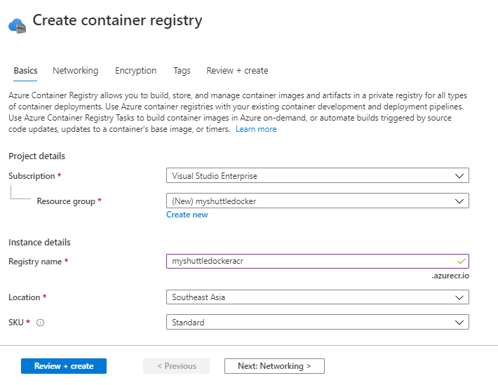

1. Once the resource is provisioned navigate to the resource and Enable Admin user for Container Registry.

    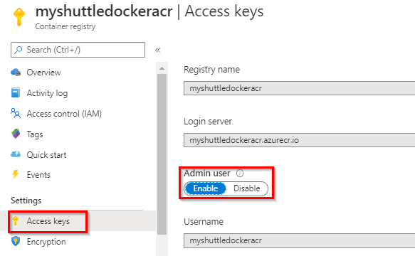

1. Navigate to your Azure DevOps project, select **Pipelines** from **Pipelines**. Select **MyShuttleDockerBuild** and click **Edit**. 

1. Lets look at the tasks used in the build definition.

1. Select the **Maven** task. This task is used to build the pom.xml file. The maven task is updated with the following additional settings

    | Parameter | Value | Notes |
    | --------------- | ---------------------------- | ----------------------------------------------------------- |
    | Options | `-DskipITs --settings ./maven/settings.xml` | Skips integration tests during the build |
    |Code Coverage Tool | JaCoCo | Selects JaCoCo as the coverage tool |
    | Source Files Directory | `src/main` | Sets the source files directory for JaCoCo |

      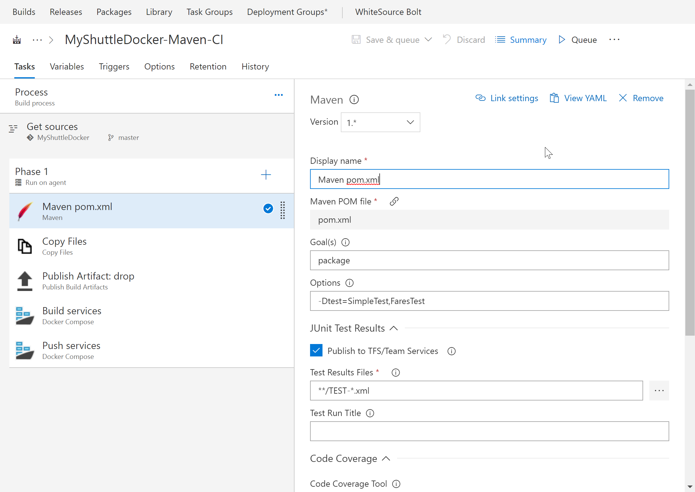

1. Then there is **Copy** task. We will copy the WAR file from the sources directory to the staging folder.

    | Parameter | Value | Notes |
    | --------------- | ---------------------------- | ----------------------------------------------------------- |
    |Source Folder| $(build.sourcesdirectory)| Copy from the source folder|
    |Contents|target/myshuttledev*.war, *.sql| Copy the MyShuttle WAR file
    |Target Folder|$(build.artifactstagingdirectory)|Copy it to the default staging folder|

1.  Next, we have a **Publish** task to publish the build artifacts to Azure Pipelines.

    | Parameter | Value | Notes |
    | --------------- | ---------------------------- | ----------------------------------------------------------- |
    |Path to publish| $(build.artifactstagingdirectory)| Copy contents from the staging folder|
    |Artifact name|drop|Provide a name for the artifact folder.  |
    |Artifact publish location |Azure Pipelines|we will publish it to Azure pipelines|

1. Next, there are two **Docker** tasks to build and publish the images. Select the first **Docker** task and notice that the **Command** is set to **Build**. The other settings of the Docker compose tasks are as follows:

    | Parameter | Value | Notes |
    | --------------- | ---------------------------- | ------------------------------------------- |
    | Azure Subscription | Authorize your Azure subscription | The subscription that contains your registry |
    | Container Registry Type | Azure Container Registry | This is to connect to the Azure Container Registry you created earlier |
    | Azure Container Registry | Your registry | Select the Azure Container registry you created earlier |
    |Command|build|Docker command|
    |Dockerfile|src/Dockerfile|Point to the src folder for the docker file|
    |Use default build context|Uncheck this option|
    |Build context|. (dot representing the root folder)| The build context should be the root folder|
    |Image name| `Web:$(Build.BuildNumber)` | Sets a unique name for each instance of the build |
    |Qualify image name| Check (set to true)|   
    | Include Latest Tag | Check (set to true) | Adds the `latest` tag to the images produced by this build |

    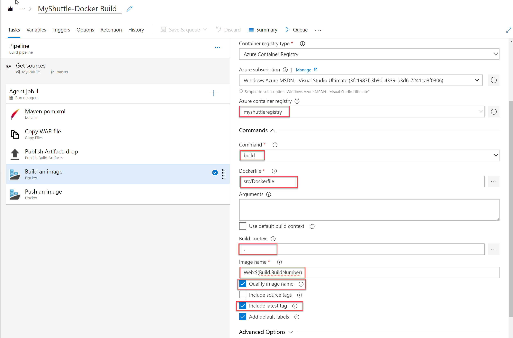

1. There is a second **Docker** task with almost the same settings. The only change is the **Command** is set to **Push** and the **Image name** is set to  `Web:$(Build.BuildNumber)`. This action will instruct the task to push the Web image to the container registry.

      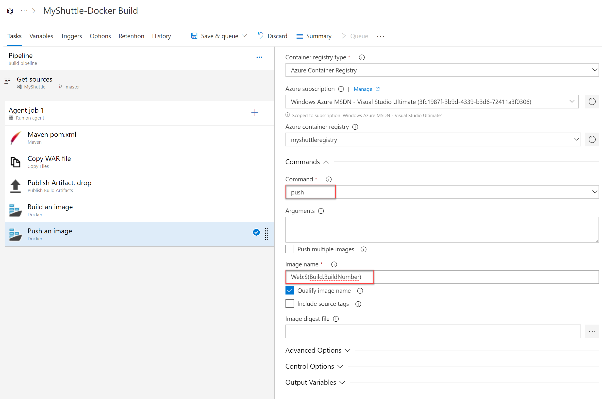

1. Click the **Save and Queue** button to save and queue this build. Make sure you are using the **Hosted Ubuntu 1604** build agent.

1. Wait for the build to complete. When it is successful, you can go to your Azure portal and verify if the images were pushed successfully. 
    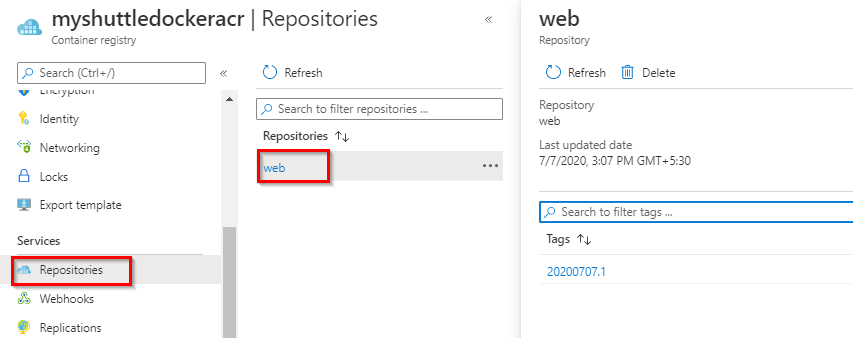

1. If you are following this from the Eclipse lab, you can also verify if the images were pushed correctly from the **Azure Explorer** view. *Sign in* to Azure, refresh Azure Container Registry. Right click and select **Explore Container Registry**. You should see the image - tagged with the build number.

    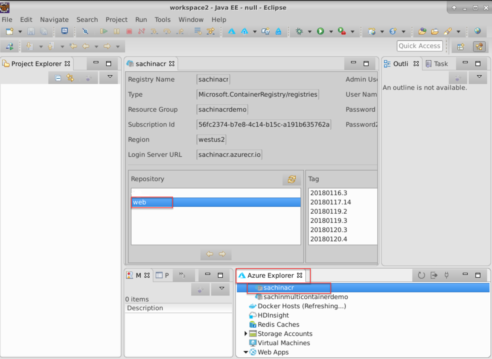

## Exercise 2: Deploying to an Azure Web App for containers

In this exercise, we will setup a Release pipeline to deploy the web application to an Azure web app. First,let's create a Web App for Container with MYSQL.

1. Navigate back to your [Azure Portal](https://portal.azure.com){:target="_blank"}.

1. In the Azure Portal, choose **+ Create a resource**, search for **Web App**, select and click *Create*.

1. Provide the following details and click **Next**- 

    * Enter a name for the new web app
    * Choose the Azure subscription 
    * Select existing or create new resource group for the web app. 
    * Leave the App Service plan/Location as it is.

      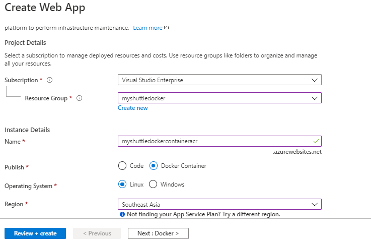

1. In the Docker tab, select **Azure   Container Registry** as Image source. Select the **Registry, Image and Tag** from the respective drop-downs and click **Review + create** and then **Create**.

    

1. Once the provisioning is complete, go to the web app Overview page, and select the URL to browse the web app. You should see the default **Tomcat** page.

1. Append **/myshuttledev** to the web application context path in the URL to get to the MyShuttle login page. For example if your web app URL is `https://myshuttle-azure.azurewebsites.net/` , then your URL to the login page is `https://myshuttle-azure.azurewebsites.net/myshuttledev/`

    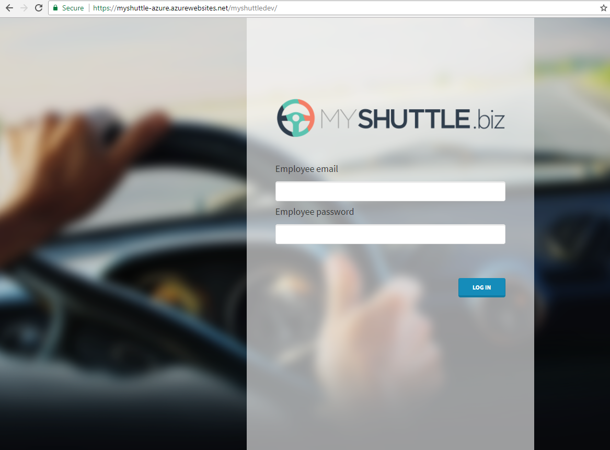
 
    We could configure *Continuous Deployment* to deploy the web app when a new image is pushed to the registry, within the Azure portal itself. However, setting up an Azure Pipeline will provide more flexibility and additional controls (approvals, release gates, etc.) for application deployment.

1. We need to create Azure Database for MySQL as well. Choose **+ Create a resource**, search for **Azure Database for MySQL**, select and click *Create*. Provide all the required mandatory information and note down **Password** to a notepad. We will use it later in the Deployment pipeline. Click **Review + create** and then **Create**.

    
    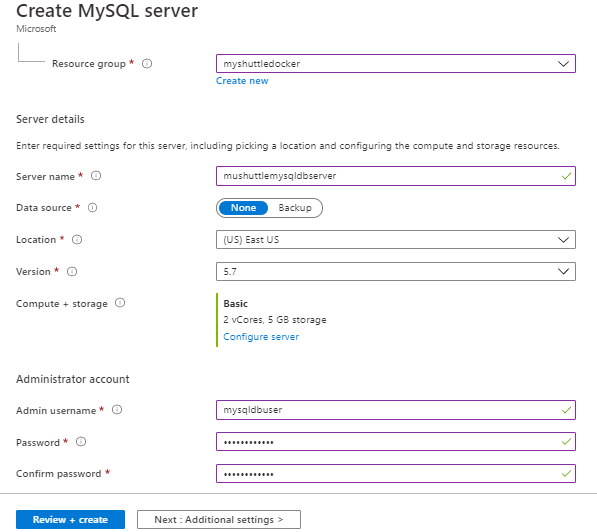

1. Navigate to the Azure Database for MySQL server provisioned.  Save the **Server name** and **Server admin login name** to a notepad.
    
     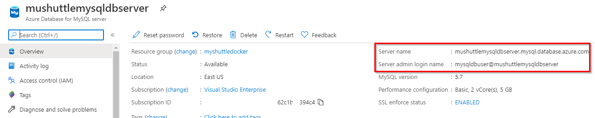

1. Select Connection security. Enable **Allow access to Azure services** toggle and **Save** the changes. This provides access to Azure services for all the databases in your MySQL server.

   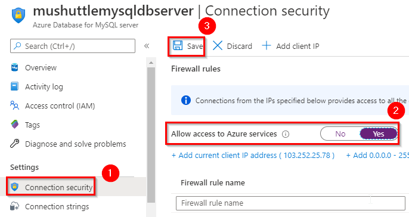

1. Back in Azure DevOps account, select **Releases** from the **Pipelines** hub. Select the Release definition - **MyShuttleDockerRelease** and click **Edit**.

     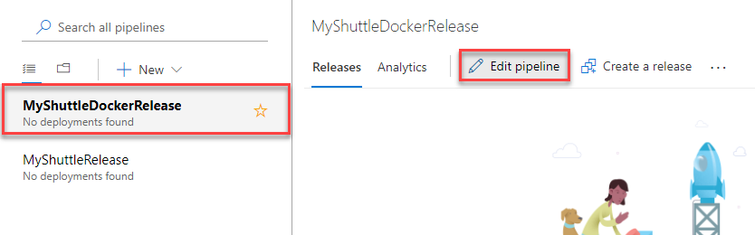

1. For enabling CD, click on the "lighting icon" and enable **Continuous deployment trigger".

    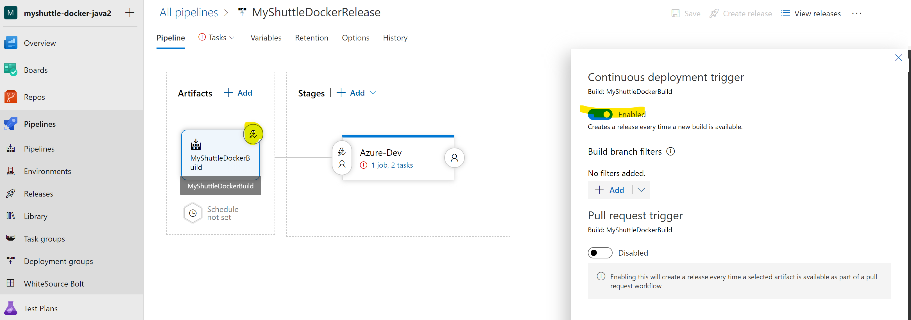

1. Click on **MyShuttleDockerBuild** artifact and select **Latest** as Default version.

    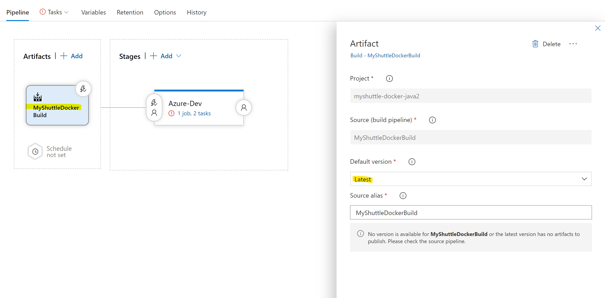

1. Hover the mouse on **Tasks** and select **Azure-Dev**. Configure the environment as below - 

    **Unlink all** and **Confirm**

    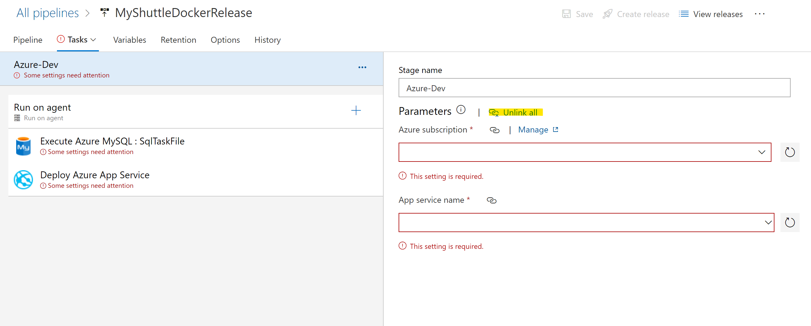

1. Select the **Execute Azure MYSQL:SqlTaskFile** task, choose the Azure subscription, and provide the DB details which were noted down earlier during the creation of the database server. 

    * Link to your Azure Subscription.
    * Select the *Host Name* from the drop down. 
    * *Server Admin Login* - Go to **Variables** section and enter the value for the variable - *$(DBUSER)*. 
    * Enter the *Password*. This is the password provided during the creation of MYSQL database in Azure portal. Go to **Variables** section and enter the value for the variable - *$(DBPASSWORD)*. Click the **lock** icon to decrypt the dummy value and then, enter the password.

    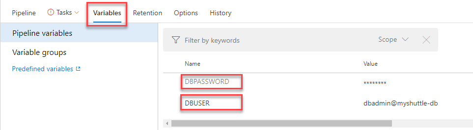

    * A *MYSQL script* that is version controlled and provided here which creates the database, tables and populate records.

    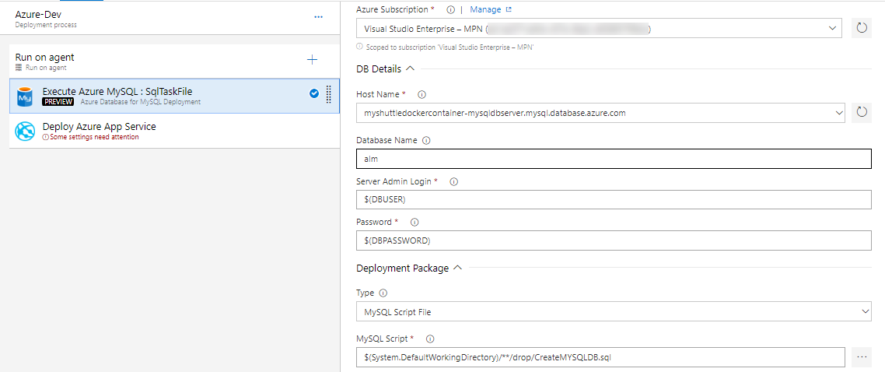

1. Select the **Deploy Azure App Service** task and make sure that the following values are provided. Note that the task allows you to specify the Tag that you want to pull. This will allow you to achieve end-to-end traceability from code to deployment by using a build-specific tag for each deployment. For example, with the Docker build tasks you can tag your images with the Build.Number for each deployment.

    - Select your Azure Subscription and previously created App Service.
    - Registry or Namespace - Provide the value of Login server of the created Container Registry. You will find it in the Overview section.
    - Image - Provide the value as web. This is where the container image is stored after build.
    - Tag - Provide the value as $(Build.BuildNumber).

    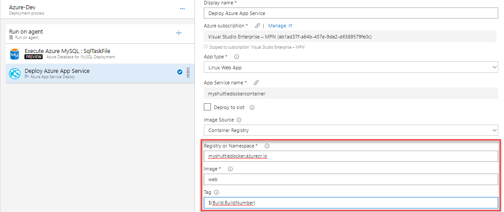
 
1. Select **Save** and then click **Create Release**.

1. Check the artifact version you want to use and then select **Create**.

1. Wait for the release is complete and then navigate to the URL `http://{your web app name}.azurewebsites.net/myshuttledev`. You should be able to see the login page.

## Exercise 3: Configuring MySQL connection strings in the Web App

1. Navigate to the Web app that you have created. Click **Configuration** and select **Application Settings**. Scroll down to the **Connection Strings** section.

1. Add a new MySQL connection string with **MyShuttleDb** as the name and the following string - `jdbc:mysql://`**`{MySQL Server Name}`**`.mysql.database.azure.com:3306/alm?useSSL=true&requireSSL=false&autoReconnect=true&user=`**`{your user name}`**`@`**`{MySQL Server Name}`**`&password=`**`{your password}`**. Replace the following with values that you have noted down

    * MYSQL Server Name - **Server Name** in the MYSQL Server *Overview* page
    * Your user name -  **SERVER ADMIN LOGIN NAME** in the MYSQL Server *Overview* page  
    * Your password -**Password** that you provided during the creation of MYSQL server in Azure

    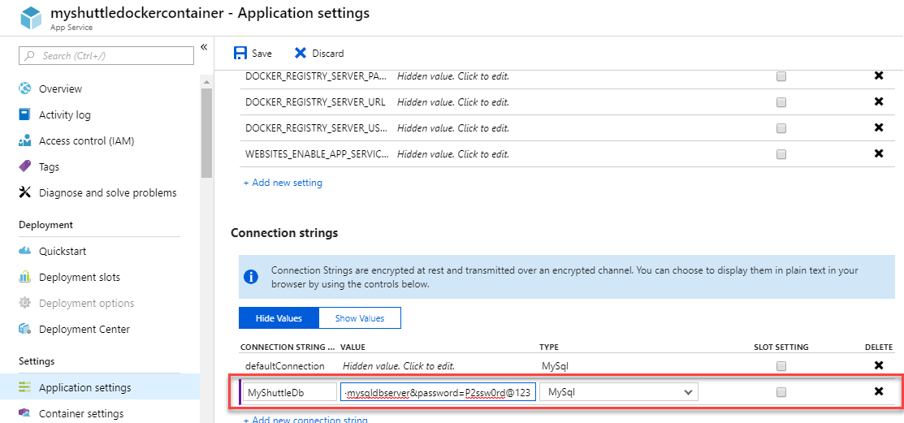

1. Click **Save** to save the connection string.

1. You should be able to login to the application now. Return to the web application and try logging in using any of the below *username/password* combination:

    * *fred/fredpassword*
    * *wilma/wilmapassword*
    * *betty/bettypassword*

