# Overview

In this exercise, you are going to see a typical end-to-end workflow for a Java developer.

You should have completed the exercises in [Part 1: Working with Eclipse - Getting started](../){:target="_blank"} labs to create a Team Project, set up Eclipse, configure an Azure Pipeline to publish images to ACR and deploy the application to Azure Web App.

In this scenario, you will open the running MyShuttle application and discover a bug. You will then use the [Exploratory Testing extension](https://marketplace.visualstudio.com/items?itemName=ms.vss-exploratorytesting-web){:target="_blank"} to create a Bug work item in your Azure DevOps Organization account. You will then branch the code for fixing the bug. Once the bug is fixed on the branch, you will merge the code in via a Pull Request and code review. This will then automatically queue the build/release pipeline and deploy your fix.

## Install the Exploratory Testing Extension for Chrome

In this task, you will install the [Exploratory Testing extension](https://marketplace.visualstudio.com/items?itemName=ms.vss-exploratorytesting-web){:target="_blank"} into Chrome. Follow the instructions to install the extension on your browser. We are using **Chrome** browser in this example.

1. Once installed, a beaker icon appears in the top right of the Chrome toolbar. Click it to open the UI.

1. Click on the gear icon to open the settings. Select **Connected** and enter your Azure DevOps Organization account URL and click Next. Then select your team project and expand it and select the default team (which should have the same name as your team project). Click Save.

    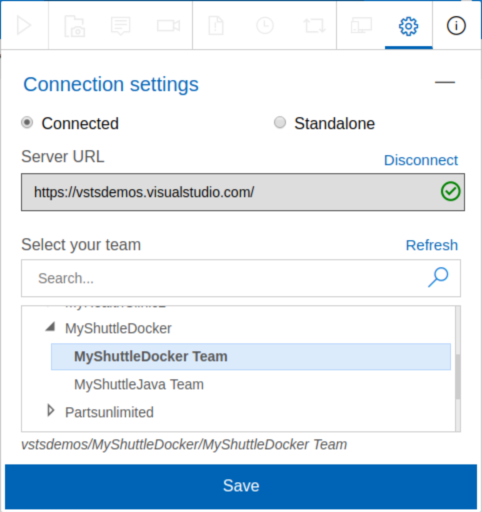
    
     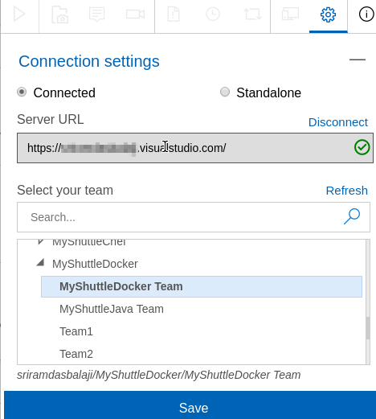
    

## Log a Bug using the Exploratory Test Extension

In this task you will start a test session, discover a bug in the MyShuttle app and log it to Azure DevOps Organization.

1. In the Test extension toolbar of the Exploratory Test extension, click the Play icon to start a testing session.

    

    

1. Enter `http://{your web app name}/myshuttledev` in the toolbar to navigate to the application. Enter `fred` for the username and `fredpassword` for the password and click **Log In**.

    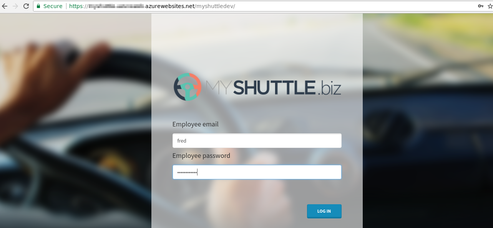


1. On the Dashboard page, click **Access Your Fare History** to navigate to the fare history page.

1. If you look at the totals for the Fare and Driver column in the table, you will note that the total for the driver column is incorrect.

1. Click the Test Extension beaker icon and click the Camera icon (capture image).

    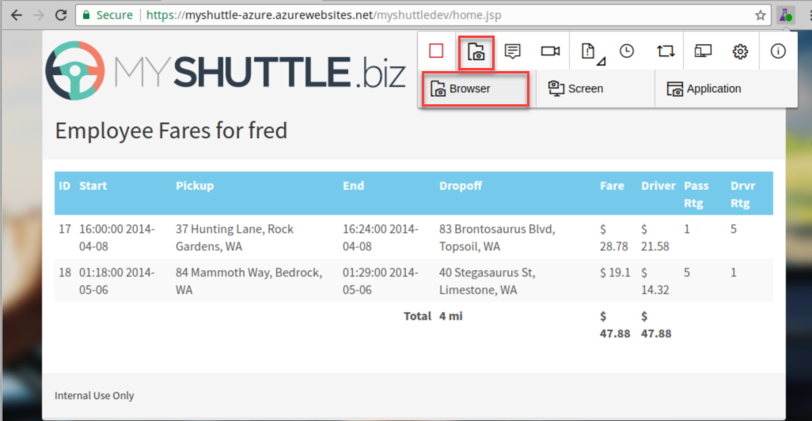

1. Capture the grid with the incorrect total. Annotate the image appropriately and click the tick (accept) icon.

    

1. Click the Test Extension beaker icon and click flyout (lower right) of the icon with the page and exclamation mark (new bug). From the menu click Create bug.

    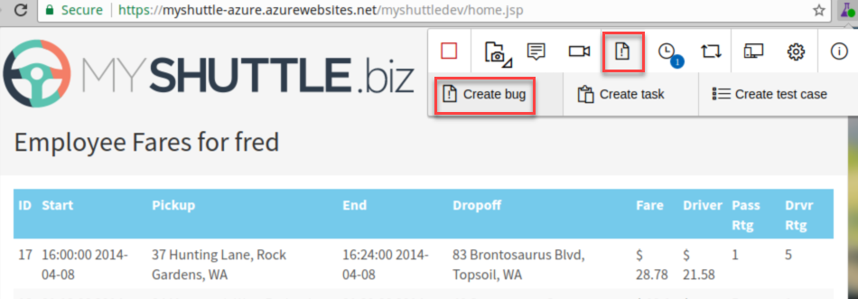

1. In the title box, enter **"Driver total incorrect"** and click **Save**.

    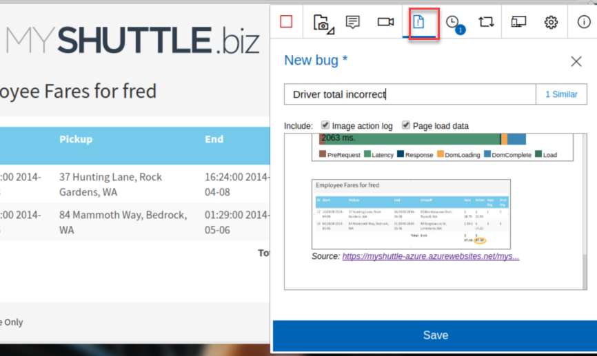

    .

1. Once the bug has been created, click the Stop button in the Test Extension toolbar to end the test session.

1. Navigate to your Azure DevOps Organization team project. Click **Boards** to navigate to the Work Hub. In the search toolbar, enter "driver" into the Search Work Items box and press enter or click the magnifying glass icon. You should see the Bug that you logged. Take a moment to look at the Repro Steps.

    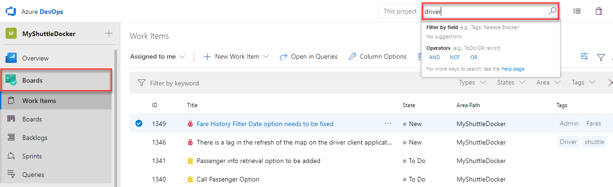

1. Assign the Bug to yourself and change the state to Approved. Click Save.

   {% include note.html content= "Now it's time to roll up your sleeves to detect the cause and find a fix for the bug. But before we make any code changes, we will create a **branch**. In the world of Git, teams generally create new branches to isolate changes for a feature or a bug fix from the master branch and other work. They commit and push changes to the remote branch. The changes are then presented to the rest of the team for review and approval via **Pull Request** before they are merged to the *master* branch. You can establish requirements for all pull requests to ensure high quality code and protect important branches with **Branch Policy**." %}

## Configure Branch Policies

In this task, you will enforce quality on the master branch by creating branch policies.

1. Go to your Azure DevOps Organization project and click **Repos**.

1. Select **Branches** and choose the ellipsis `"..."` of the master branch and select **Branch Policies**

    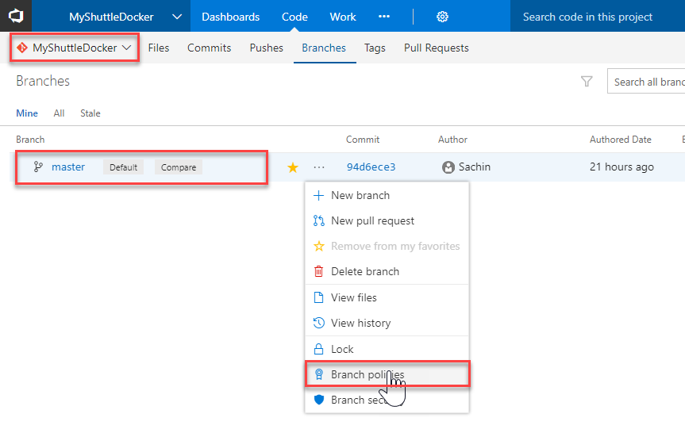

1. Check **Check for linked work items** and set the radio button to **Required**.

    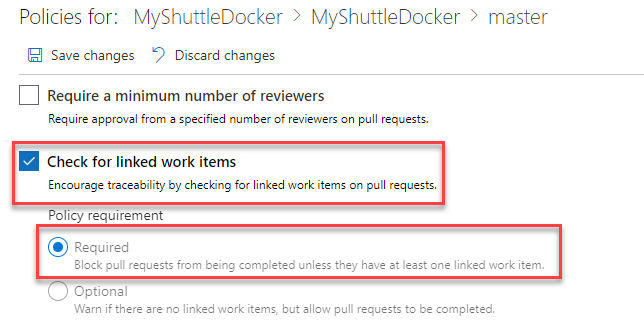

1. Under **Build validation**, click **Add build policy** and select **MyShuttleDockerBuild** from the list of build definitions and click **Save**.

    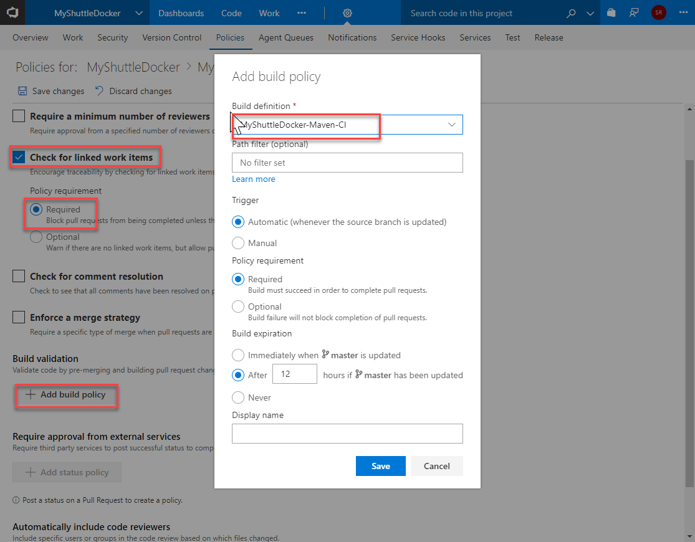

    

## Fix the Bug

In this task you will create a branch of the code to fix the Bug. You will then checkout the branch, fix the bug and commit the code. You will then create a Pull Request to merge the fix into master and see that this triggers the CI/CD pipeline to automatically deploy the fix to the dev environment.

1. Open Eclipse if it is not already open. Open the MyShuttleDocker project.

1. In **Team Explorer** change the drop down to **Work Items**.  If the dropdown does not show work items, connect to your Azure DevOps Organization account via the Team Explorer Home page.

1. If there are no queries saved under the **Boards**, a query can be created in Eclipse. Right-click on the My Queries folder and select **New Query**.

    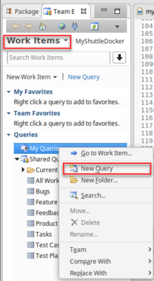

1. You can run an existing query by double clicking it. Double click **Bugs** query under *Shared Queries* to get the list of bugs in the project.

    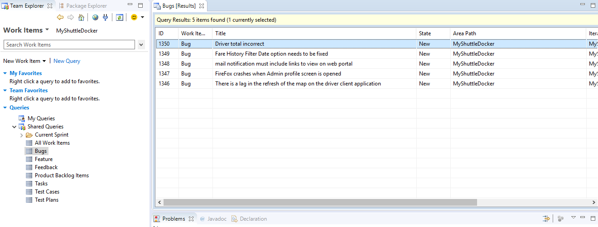

1. Select the **Driver total incorrect** bug and double click to open it in a browser.

1. Click the ellipsis  button `...` and select **New branch...** to create a new branch.

    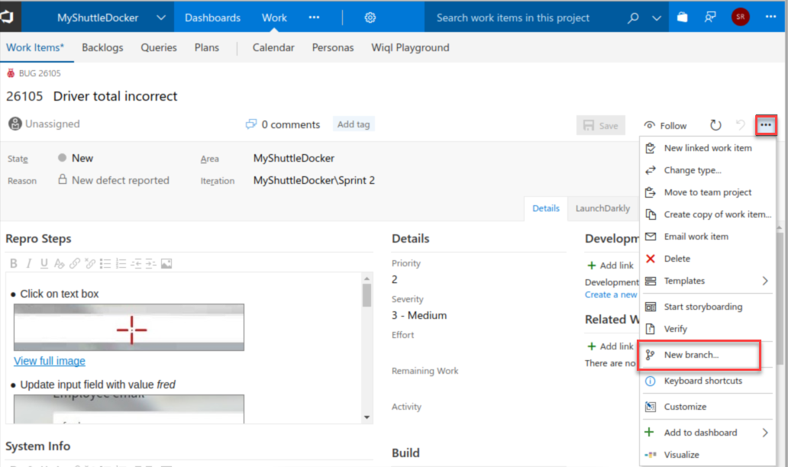

1. In the dialog, change the branch name to **fixtotalsBug** and click Create Branch. Note that the work item is already associated to the branch.

    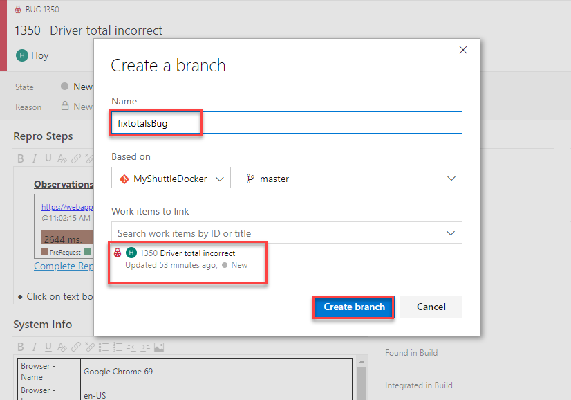

1. Return to Eclipse. In the project view of Eclipse,right-select the project, choose **Team** and then **Pull...** to fetch the latest changes, including the new branch just created. Click **Finish** in the next pop-up, enter password if prompted, for the operation to complete.

    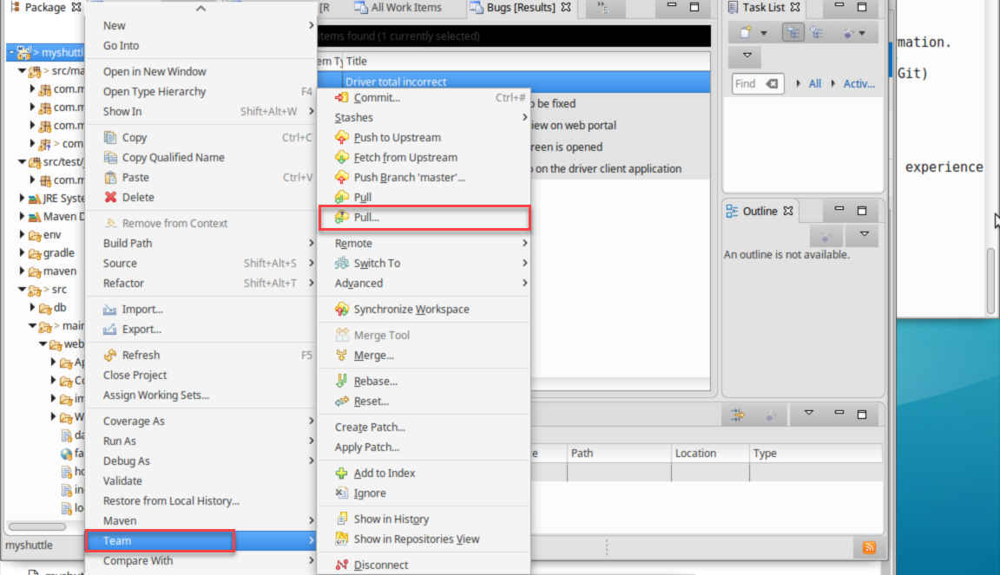

1. To switch to the new branch, select **Team** , **Switch to...**  and select **Other**.

    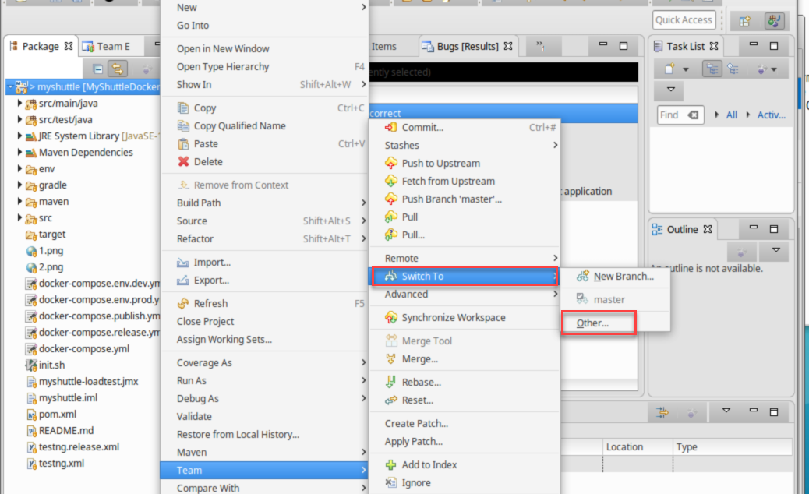

1. Expand **Remote Tracking** and select the **origin/fixtotalbugs** branch and click **Check Out**. In the resulting dialog, choose **Check out as a local branch** option and click **Finish** in the next window to complete the operation.

    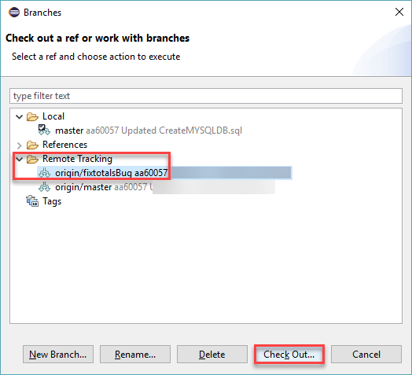
    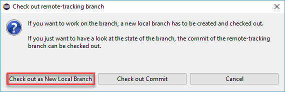
    
1. Browse to `src/main/java/com.microsoft.example.servlet` and open the LoginServlet class.

1. Around line 35, you will see what is causing the bug: the `totalDriverFee` is being calculated but the `driverFeeTotal` session attribute is being set to `totalFareForDriver` (this looks like a classic copy/paste error).

   Change this line of code:

    ```java
        session.setAttribute("driverFeeTotal", totalFareforDriver);
    ```
    to

    ```java
        session.setAttribute("driverFeeTotal", totalDriverFee);
    ```

1. Save the file.  Commit the changes by right clicking the file and selecting **Team->Commit**. Enter *Fixing totals bug #{ID of bug}* as the commit message. By putting the # symbol followed by an ID of a work item in a commit message, Azure DevOps will automatically associate the work item with the commit when it's pushed to the server. In the example of the screenshot, the ID is #1350. Click **Commit and Push** to push the changes to Azure DevOps Organization.

    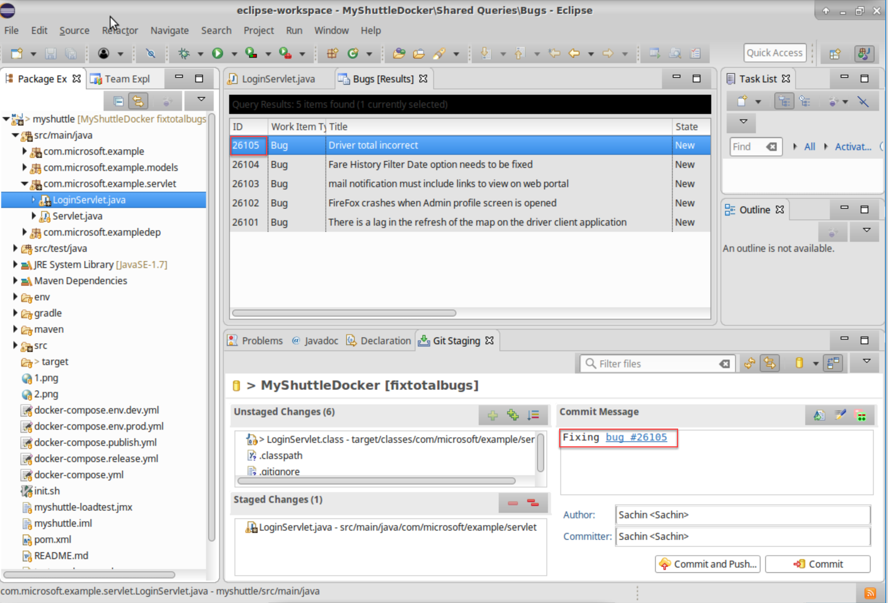

1. Now that the fix has been pushed to Azure DevOps on a branch, you can create a **Pull Request**. This will be done in Azure DevOps following the standard process for pull requests. Under the **Repos** hub, click on Files in the MyShuttleDocker repo and there should be a notification that you updated the `fixtotalsBug` branch. Click the link next to it, **Create a pull request**

    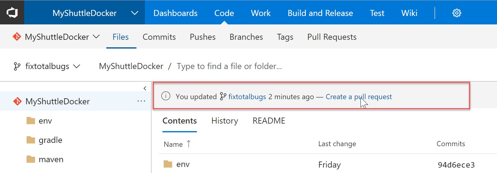

1. Then, in the pull request panel, click **Create** to create the pull request. Note that the bug is associated with the commit.

    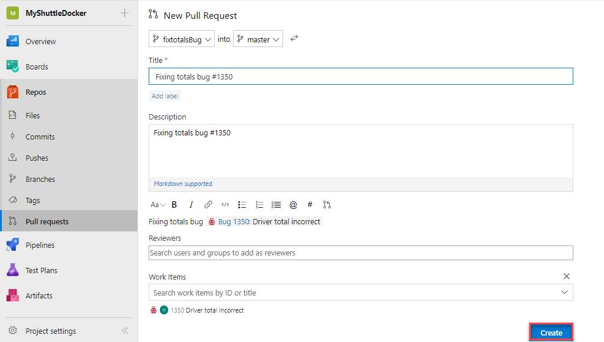

1. Once the PR has been created, you will notice that the build is running (this is the build mandated by the Branch Policy you set up earlier). The build will take 7-10 minutes to complete.

    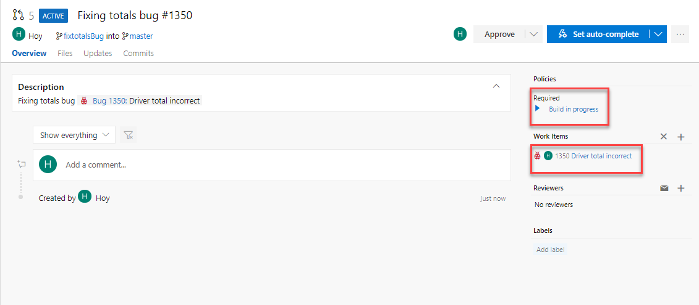

    

1. Click on the Files tab to open the file compare. Note the changes.

    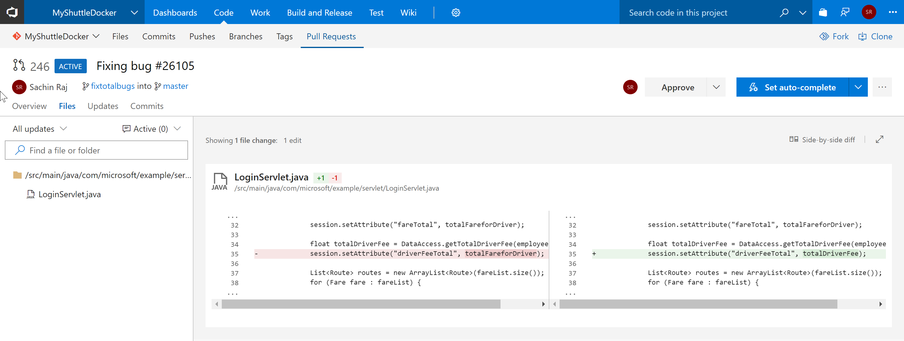

    

1. Click **Approve** to approve the pull request.

1. Now that the policies have been fulfilled, you can complete the PR which will merge the changes into *master* (the target branch). Click **Complete** to do the merge.

    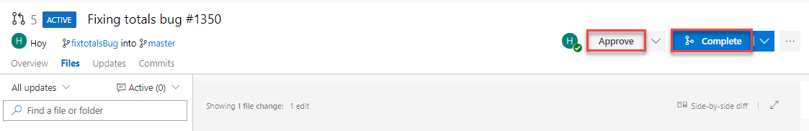
    
1. In the dialog, accept the defaults and click **Complete merge**.

    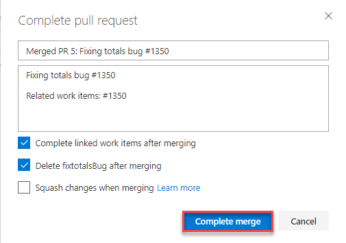

1. The PR completion triggers a new build off the master branch if CI trigger is set, which in turn will trigger a release if CD trigger is enabled. If not enabled, click *Builds* under **Pipelines** and queue a new build for the definition - *MyShuttleDockerBuild*. _It also transitions the Bug work item to Resolved state_. 

1. When the build completes, you will see the unit test and code coverage results as well as SonarQube analysis and quality gates (if you have configured SonarQube integration).

1. Click on Releases and open the latest release which should have triggered off as *CD* the PR merge build completion event. If CD is not enabled, click *Releases* under **Pipelines** and queue a new release for the definition - *MyShuttleDockerRelease*. 

1. On the Release Summary page, you will see the linked Bug work item.

    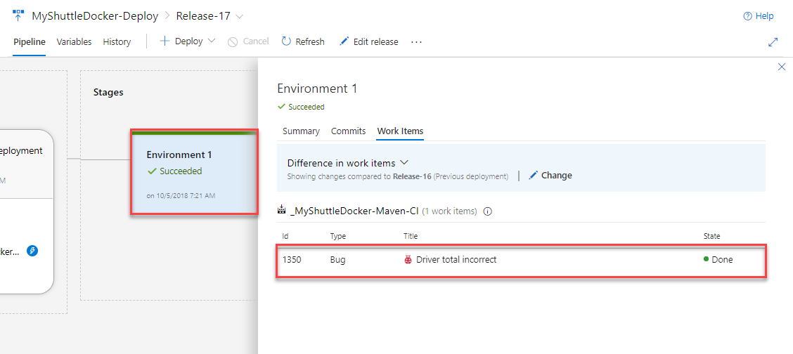

1. Click on commits to see the incoming commits for this release. There is the commit to fix the bug as well as the commit to merge into master.

    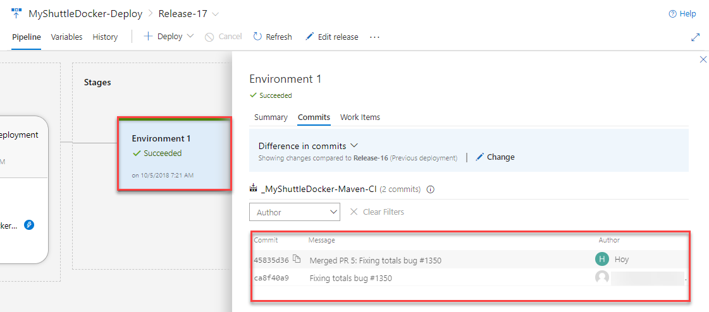

1. Return to the MyShuttle application.  Log in again and verify that the totals column is correct and the Bug has been fixed.

    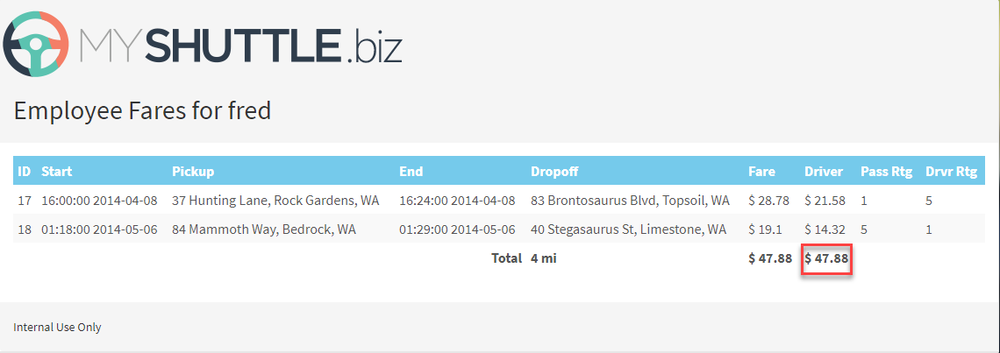
