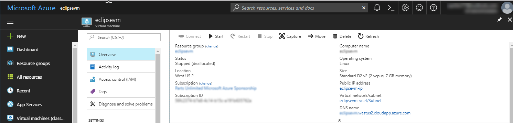
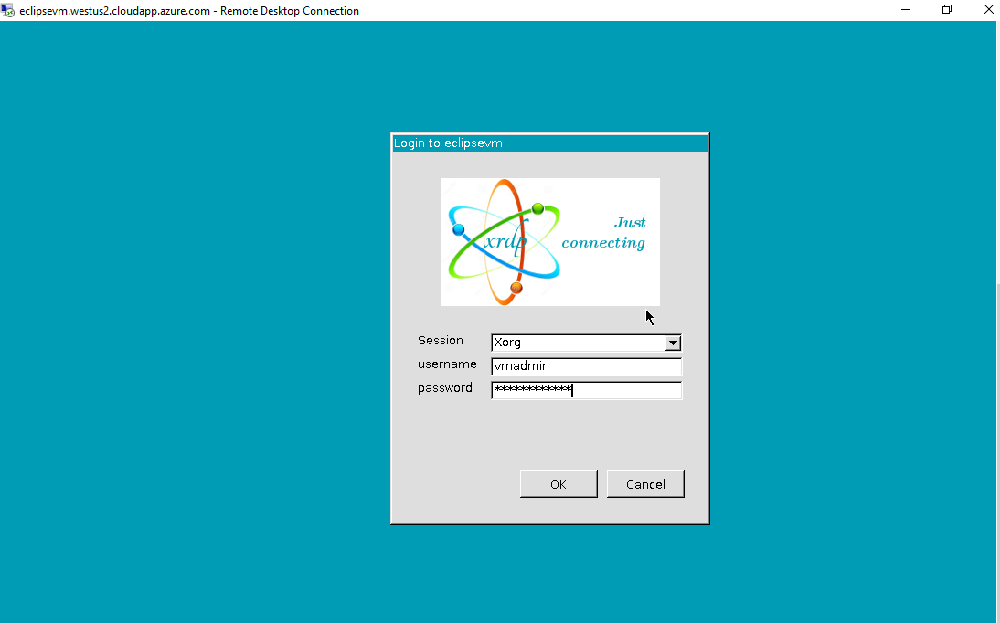
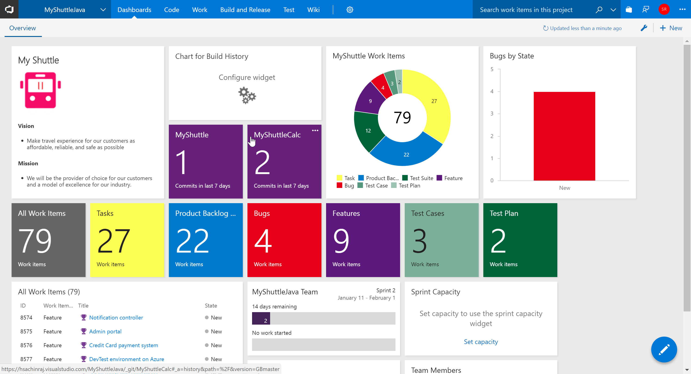
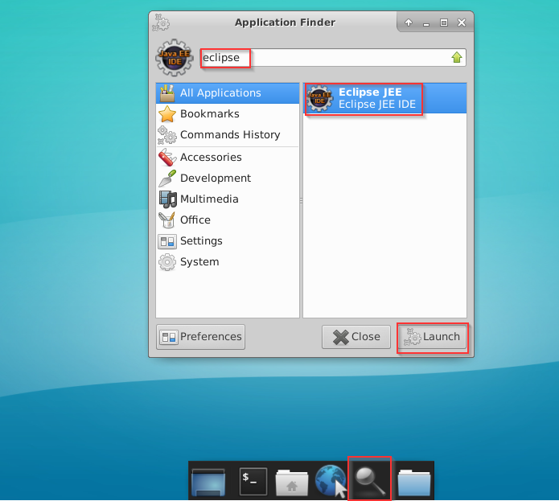
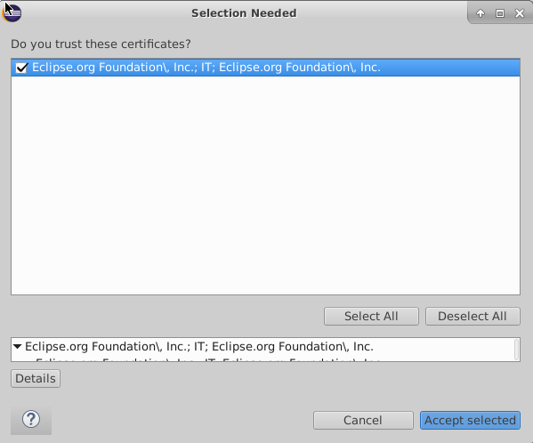
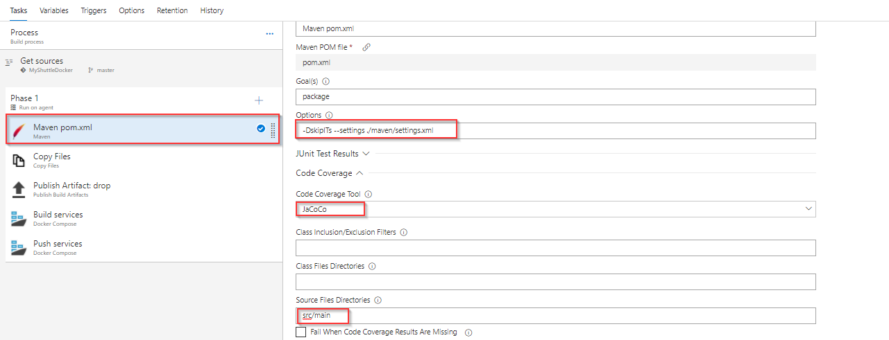
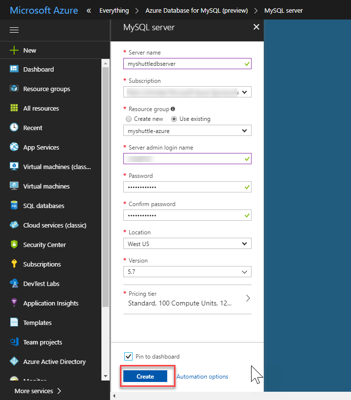
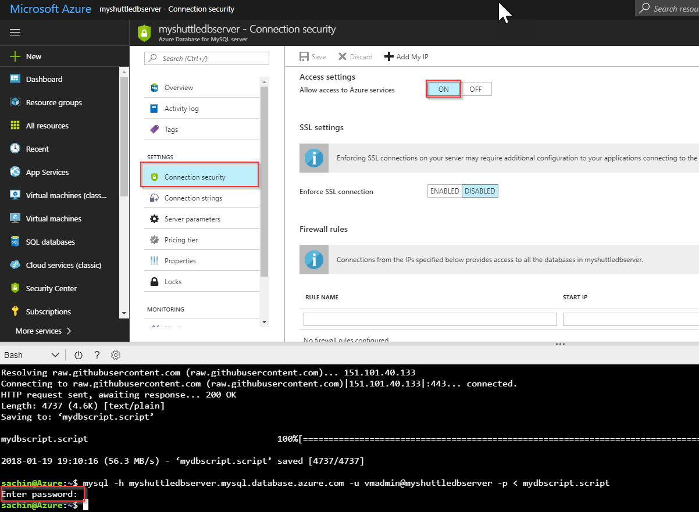

Last updated : {{ "now" | date: "%b %d,%Y" }}

## Overview

Visual Studio Team Services (VSTS) helps teams modernize their application development lifecycle and go from idea to deployment with continuous integration, testing, and deployment for any app targeting any platform.

VSTS works with (m)any development tool including Visual Studio, Eclipse, IntelliJ, Android Studio, XCode, etc., to make it easy for developers to use VSTS.

This lab will walk you through a typical end-to-end workflow for a Java developer using VSTS and working with Eclipse. We will use a hypothetical customer called MyShuttle that provides a portal for its drivers to access travel history and see fares collected. This is a  Java application built on JSP/Servlet technology running on Apache Tomcat and using MySQL as the database. We will develop this on a Ubuntu desktop station and we will deploy the app on Azure.

### What's covered in this lab

In this lab, you will

* Provision a Team Services project with some sample data and users
* Provision a Ubuntu VM with Eclipse installed
* Install and explore **Team Explorer Everywhere**, the VSTS plug-in for Eclipse
* Install and explore **Azure Toolkit for Eclipse**
* Setup a build definition to build and test the code, then push it to a Azure Container Registry
* Setup an Azure Web app and configure a CD pipeline in VSTS

**Estimated time to complete the lab:**  1 hour

### Pre-requisites for the lab

1. **Microsoft Azure Account**: You will need a valid and active Azure account for the Azure labs. If you do not have one, you can sign up for a [free trial](https://azure.microsoft.com/en-us/free/){:target="_blank"}

   * If you are a Visual Studio Active Subscriber, you are entitled for a $50-$150 credit per month. You can refer to this [link](https://azure.microsoft.com/en-us/pricing/member-offers/msdn-benefits-details/){:target="_blank"} to find out more including how to activate and start using your monthly Azure credit.

   * If you are not a Visual Studio Subscriber, you can sign up for the FREE [Visual Studio Dev Essentials](https://www.visualstudio.com/dev-essentials/){:target="_blank"} program to create **Azure free account** (includes 1 year of free services, $200 for 1st month).

1. You will need a **Visual Studio Team Services Account**. If you do not have one, you can sign up for free [here](https://www.visualstudio.com/products/visual-studio-team-services-vs){:target="_blank"}

1. You will need a **Personal Access Token** to set up your project using the Demo Generator. Please see this [article](https://docs.microsoft.com/en-us/vsts/accounts/use-personal-access-tokens-to-authenticate){:target="_blank"} for instructions to create your token.

    

1. You will need the [**Docker Integration**](https://marketplace.visualstudio.com/items?itemName=ms-vscs-rm.docker){:target="_blank"} extension installed and enabled on your Team Services account.

1. You will need a desktop station. Click on **Deploy to Azure** to provision a Ubuntu VM pre-installed with Eclipse, Docker, Jenkins, and all other software required to run this lab.

    [](https://portal.azure.com/#create/Microsoft.Template/uri/https%3A%2F%2Fraw.githubusercontent.com%2Fnwcadence%2Fjava-dev-vsts%2Fmaster%2Fenv%2FJavaDevVSTS.json){:target="_blank"}

1. Once the machine is provisioned, you can RDP to it. From the **Overview** tab of the virtual machine, note the **DNS Name** and use *Remote Desktop* program to connect and log in

    

1. Log in with the user name and password provided.

    

## Exercise 1: Setting up VSTS project

1. We will use the [VSTS Demo Data Generator](https://vstsdemogenerator.azurewebsites.net/?TemplateId=77373&Name=myshuttledocker){:target="_blank"} to provision a project on your VSTS account.

   

1. Select **MyShuttleDocker** for the template. You will need the [**Docker Integration**](https://marketplace.visualstudio.com/acquisition?itemName=ms-vscs-rm.docker){:target="_blank"} extension to be installed and enabled on the account. If the extension is not installed, click on the extension name to open the extension page on VS Marketplace. Install the extension. Return to the VSTS Demo Generator page and refresh

1. Provide a project name and click **Create Project** to start provisioning.

1. Once the project is provisioned, select the URL to navigate to the project that you provisioned.

1. You will see the work items, source code and CI/CD definitions already populated by the demo generator.

    

1. Navigate to the **Code** hub. You will find the code for the MyShuttle application created and populated by the demo generator system. We will import this to our dev workstation  in our next exercise.

## Exercise 2: Setting up Eclipse

Having setup Team Services project, we will now log in to the virtual machine and set up Eclipse.

1. If you have not already, log in to the virtual machine

1. Click on the Eclipse icon in the toolbar to open the Eclipse Java IDE.

    

1. The first time you run Eclipse, it will prompt you to choose a workspace. Specify a folder and click on the box **"Use this as the default and do not ask again"** if you want to Eclipse use that as default and not prompt you again.

    We will install **Team Explorer Everywhere (TEE)**, the official plug-in for Eclipse from Microsoft to connect Team Services and Team Foundation Server with Eclipse-based IDE on any platform. It is supported on Linux, Mac OS X, and Windows and is compatible with IDEs that are based on Eclipse 4.2 to 4.6. We will also install **Azure Toolkit for Eclipse**. The Azure Toolkit for Eclipse provides templates and functionality that allow you to easily create, develop, test, and deploy cloud applications to Azure from the Eclipse development environment.

1. After Eclipse has started, select **Help** \| **Install New Software** to bring the install dialog page

1. Choose the **Add** button to add a new repository.  Use Team Explorer Everywhere as the name and specify *http://dl.microsoft.com/eclipse* for the location.

    

1. Choose the **OK** button.

1. In the list of features in the Install dialog box, select the check box that corresponds to the Team Explorer Everywhere plugin and Azure Toolkit for Java.

    

    .

1. Choose **Next** to follow the wizard to complete the installation.

1. You might be prompted to trust the Eclipse Foundation certificate. Select ther certificate and click **Accept Selected**.
    

1. Eclipse will need to restart. When Eclipse restarts,choose **Windows > Show View** and select **Other...**

1. Search for **Team Explorer**, select the **Team Explorer** View, and select **OK**.

    

1. Next, select **Windows > Show View** and select **Other...**. Search for **Azure

1. From the **Team Explorer** view, choose the radio button next to **Connect to a Team Foundation Server or Team Services account** then type in the name of the VSTS account (`https://{your-account-name}.visualstudio.com`) and press the **Next** button

    The "Follow the instructions to complete sign-in" window will pop up. Click on the hyperlink to be redirected to the Device Login page in a browser on the VM (Note that link may have a black background for security purposes).

1. Log in to authenticate yourself.

1. Return back to Eclipse, press the OK button in the device login window. The VSTS account should now show up in the list of servers to connect to. Press the **Close** button to close the current window.

## Exercise 3: Clone MyShuttle from VSTS with Eclipse

Next, we will clone the VSTS Git repository to a local Git repository and import the code to a project in Eclipse.

1. In the **Team Explorer** panel, choose **Git Repositories**. This will list all the Git repositories in the project.

1. Right-click the **MyShuttleDocker** repo in the team project and select **Import Repository**

    

    

    Leave the defaults for the parent directory and repo folder name, then press the next button. This will clone the repo onto the VM.

    

1. We do not have any saved Eclipse projects in the repo. So, we can close the wizard now. We will import the project as a Maven project instead of Eclipse project. In the **"Import Projects from Team Foundation Server"** window, click the **Cancel** button.

    

1. The code has been cloned to the local repo. We can import from there. In Eclipse, choose **File -> Import...** to open the *Import* window. In the Import window, expand the Maven folder and choose **Existing Maven projects**. Then press the Next button.

    

    For the root directory, click on the Browse button or type in the root directory path of /home/vmadmin/MyShuttleDocker. The pom.xml file should appear under projects to indicate the Maven project. Additionally, click the checkbox next to **Add project(s) to working set** to add myshuttle to the working set to access in the Package Explorer window as a separate project. Then click the Finish button

    

1. Click on **Window -> Show View -> Package Explorer** in the toolbar at the top of Eclipse to view the myshuttle project in Eclipse in Package Explorer (You may have to minimize other windows to view the Package Explorer view cleanly)

    

## Exercise 4:  Create a VSTS Build to Build Docker Images

In this task you will configure the VSTS build definition that will build and push the image to an Azure Container Registry

1. Open the [**Azure Portal**](https://portal.azure.com){:target="_blank"} in a separate tab

1. Select **+New** and search for **Azure Container**. Select **Create**. In the *Create Container Registry* dialog, enter a name for the service, select the resource group, location, etc., and Enable **Admin user**,  select **Create**.

    

1. Return to  VSTS, from the **Build** hub, select and edit the **MyShuttle** build. This build definition contains a *maven* task to build the pom.xml file. In the  maven task set the following parameter values

   |Parameter|Value|Notes|
   |---------|-----|-----|
   |Options|-DskipITs -settings ./maven/settings.xml|Skips integration tests during the build|
   |Code Coverage Tool|JaCoCo|Selects JaCoCo as the coverage tool|
   |Source Files Directory|src/main|Sets the source files directory for JaCoCo|

   

1. Then there is **Copy** and **Publish** tasks to copy the artifacts to the staging directory and publish to VSTS (or a file share).

1. Next we use the **Docker Compose** task to build and publish the images. The settings of the Docker compose tasks are as follows:

    |Parameter|Value|Notes|
    |---------|------|-----|
    |Container Registry Type|Azure Container Registry|This is to connect to the Azure Container Registry you created earlier|
    |Azure Subscription|Your Azure subscription|The subscription that contains your registry|
    |Azure Container Registry|Your registry|Select the Azure Container registry you created earlier|
    |Additional Image Tags|`$(Build.BuildNumber)`|Sets a unique tag for each instance of the build|
    |Include Latest Tag|Check (set to true)|Adds the `latest` tag to the images produced by this build|

1. Click the "Save and Queue" button to save and queue this build.Make sure you are using the **Hosted Linux Agent**.

1. The build will push the image to the ACR we created earlier. We can verify if the images were pushed correctly from the **Azure Explorer** view. *Sign in* to Azure, refresh Azure Container Registry. Right click and select **Explore Container Registry**. You should see the image - tagged with the build number.

    

## Exercise 5: Deploying to an Azure Web App for containers

In this exercise, we will setup a CD pipeline to deploy the web application to an Azure web app. First, let's create the Web App

1. Sign into your [Azure Portal](https://portal.azure.com){:target="_blank"}.

1. In the Azure Portal, choose **New, Web + Mobile** and then choose **Web App for Containers**

     

1. Provide a name for the new web app, select existing or create new resource group for the web app. Then select **Configure Container** to specify the source repository for the images. Since we are using ACR to store the images, select **Azure Container Registry**. Select the **Registry, Image and Tag** from the respective drop-downs.Select **OK** and then select **Create** to start provisioning the web app

    

1. Once the provisioning is complete, go to the web app properties page, and select the URL to browse the web app. You should see the default **Tomcat** page

1. Append **/myshuttledev** the web application context path for the app, to the URL to get to the MyShuttle login page. For example if your web app URL is `https://myshuttle-azure.azurewebsites.net/` , then your URL to the login page is `https://myshuttle-azure.azurewebsites.net/myshuttledev/`

    

    We could configure *Continuous Deployment* to deploy the web app is updated when a new image is pushed to the registry, within the Azure portal itself. However, setting up a VSTS CD pipeline will provide more flexibility and additional controls (approvals, release gates, etc.) for application deployment

1. Back in VSTS, select **Releases** from the **Build and Release**hub. Select the Release definition and click edit
     

1. Open the environment. Select **Environment 1** and configure as follows

    * Pick the Azure subscription
    * Select **Linux App** for the **App Type**
    * Select the **App Service** that you created
    * Enter the **Container Registry** name and then
    * Enter ***Web*** for the **Repository**

    

1. Select the **Deploy Azure App Service** task and make sure that these settings are reflected correctly. Note that the task allows you to specify the **Tag** that you want to pull. This will allow you to achieve end-to-end traceability from code to deployment by using a build-specific tag for each deployment. For example, with the Docker build tasks  you can tag your images with the Build.ID for each deployment.

    

1. Select **Save** and then click **+ Release** \| **Create Release** to start a new release.

1. Check the artifact version you want to use and then select **Create**.

1. Wait for the release is complete and then navigate to the URL `http://{your web app name}.azurewebsites.net/myshuttledev`. You should be able to see the login page

## Exercise 6: Setting up MySQL database

 Next, let's set up the MySQL database for the application

1. From the Azure portal, select **+ New** and search for **MySQL**. Choose **Azure Database for MySQL(preview)** from the filtered result list and click **Create**

    

1. Enter all required information and select **Create**

    

1. Select **Properties**. Note down **SERVER NAME** and **SERVER ADMIN LOGIN NAME**

1. In this example, the server name is **myshuttledbserver.mysql.database.azure.com** and the admin user name is **mysqldbuser@myshuttledbserver**

1. We will use the MySQL command-line tool to establish a connection to the Azure Database for MySQL server. We will run the MySQL command-line tool from the Azure Cloud Shell in the browser.To launch the Azure Cloud Shell, click the `>_` icon in the top right toolbar.

1. Enter the following command

    ```HTML
    wget https://raw.githubusercontent.com/hsachinraj/azure-arm-templates/master/vstsazurejl_arm/mydbscript.script
    ```
    This should download the file that we want to execute on the server

1. Next, we will execute the SQL from the downloaded file on the database server. Enter the following command-

    ````SQL
    mysql -h myshuttledbserver.mysql.database.azure.com -u mysqldbuser@myshuttledbserver -p < mydbscript.script
    ````
    Turn ON **Allow access to azure services** in **Connection Security settings** Enter the password that you specified during provisioning the database

    

    > This should create the database, tables and populate records for us.

1. Next, navigate to the Web app that you have created. Click **Application Settings** and scroll down to the **Connection Strings** section

1. Add a new MySQL connection string with **MyShuttleDb** as the name and the following string for the value - `jdbc:mysql://{MySQL Server Name}:3306/alm?useSSL=true&requireSSL=false&autoReconnect=true&user={your user name}&password={your password}`

1. Click **Save** to save the connection string

   

    ````Java
    String conStr = System.getenv("MYSQLCONNSTR_MyShuttleDb");
    ````

    You have now setup and configured the database needed to deploy and run the MyShuttle application.

1. You should be able to login to the application now. Return back to the login page and try logging is using any of the username/password combination:

    * *fred/fredpassword*
    * *wilma/wilmapassword*
    * *betty/bettypassword*

## Next: End to End workflow with Eclipse

In the next part of the lab, you are going to see a typical end-to-end workflow for a Java developer using Eclipse. The version that you just deployed has an issue. Assuming the issue has been reported, you will go test it, file a bug, then find the cause and fix the bug.

Continue to [Part 2: End to End workflow with Eclipse](e2eeclipse/){:target="_blank"}
