

## Overview

Azure DevOps services helps teams modernize their application development lifecycle and go from idea to deployment with continuous integration, testing, and deployment for any app targeting any platform.

Azure DevOps services works with (m)any development tool including Visual Studio, Eclipse, IntelliJ, Android Studio, XCode, etc., to make it easy for developers to use Azure DevOps.

This lab will walk you through a typical end-to-end workflow for a Java developer using Azure DevOps and working with Eclipse. We will use a hypothetical customer called MyShuttle that provides a portal for its drivers to access travel history and see fares collected. This is a  Java application built on JSP/Servlet technology running on Apache Tomcat and using MySQL as the database. We will develop this on a Ubuntu desktop station and we will deploy the app on Azure.

### What's covered in this lab

In this lab, you will

* Provision a Azure DevOps Organization team project with sample data and users
* Install **Eclipse Photon** and **Team Explorer Everywhere**, the Azure DevOps plug-in for Eclipse
* Install and explore **Azure Toolkit for Eclipse**
* Setup an Azure Build pipeline to build and test the code, then push it to a Azure Container Registry
* Setup an Azure Web app and configure an Azure Release pipeline to deploy the image to Azure Web App

**Estimated time to complete the lab:**  1 hour

### Before you begin

1. Refer the [Getting Started](../Setup/) before you start following the exercises.

1. You will need to install and configure [JDK](https://java.com/en/download/help/windows_manual_download.xml), [Eclipse](https://www.eclipse.org/downloads/download.php?file=/oomph/epp/photon/R/eclipse-inst-win64.exe) on your Windows machine.

1. You will need the [**Docker Integration**](https://marketplace.visualstudio.com/items?itemName=ms-vscs-rm.docker){:target="_blank"} extension installed and enabled on your Azure DevOps Organization.

1. You will need to provision a team project with [Azure DevOps Demo Generator](https://azuredevopsdemogenerator.azurewebsites.net/?TemplateId=77371&Name=MyShuttle). The template **MyShuttle** is used here.

## Exercise 1: Setting up Eclipse

Having setup an Azure DevOps Organization project, we will now set up Eclipse.

1. Open the Eclipse Java IDE. The first time you run Eclipse, it will prompt you to choose a workspace. Specify a folder and click the check box **"Use this as the default and do not ask again"** if you want Eclipse to use that as default and not prompt you again.

    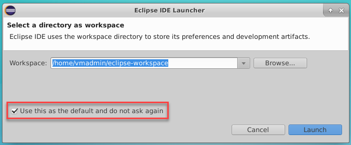

    We will install **Team Explorer Everywhere (TEE)**, the official plug-in for Eclipse from Microsoft to connect Azure DevOps and Azure DevOps Server with Eclipse-based IDE on any platform. It is supported on Linux, Mac OS X, and Windows and is compatible with IDEs that are based on Eclipse 4.2 to 4.6. We will also install **Azure Toolkit for Eclipse**. The Azure Toolkit for Eclipse provides templates and functionality that allow you to easily create, develop, test, and deploy cloud applications to Azure from the Eclipse development environment.

1. After Eclipse has started, select **Help** \| **Install New Software** to bring the install dialog page

1. Choose the **Add** button to add a new repository. Add *Team Explorer Everywhere* for the name and specify *http://dl.microsoft.com/eclipse* for the location.

    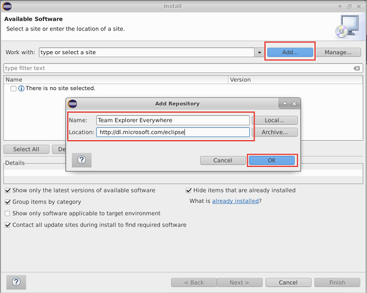

1. Click the **Add** button.

1. In the list of features in the Install dialog box, select the check box that corresponds to the **Team Explorer Everywhere** plugin and **Azure Toolkit for Java**.

    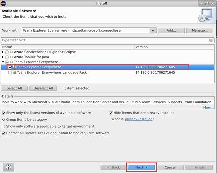

    .

1. Choose **Next** to follow the wizard, accept the terms and complete the installation.

1. You might receive a pop-up to allow restart of Eclipse to apply the changes. Choose **Restart Now**. After Eclipse restarts, go to **Windows > Show View** and select **Other...**

1. Search for **Team Explorer**, select the **Team Explorer** View, and click **Open**.

    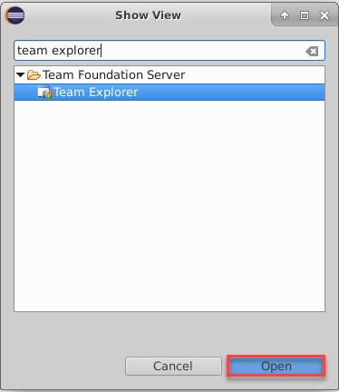 

1. From the **Team Explorer** view, click the link to **Connect to a Team Foundation Server or Team Services account**, then type in the name of the Azure DevOps Organization (`https://{your-account-name}.visualstudio.com`) and press the **Next** button.

    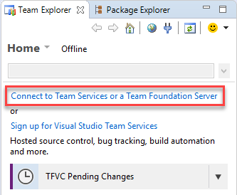

1. Choose the radio button next to "Connect to a Team Foundation Server or Azure DevOps Services account" then press the "Servers..." button. In the "Add/Remove Team Foundation Server" panel, click "Add..." and type in the name of the Azure DevOps organization (https://{your-account-name}.visualstudio.com) in the "Add Team Foundation Server" panel. Then press the OK button.

1. The "Follow the instructions to complete sign-in" window will pop up. Click on the hyperlink to be redirected to the Device Login page in a browser on the VM (may have a black background for security purposes).

    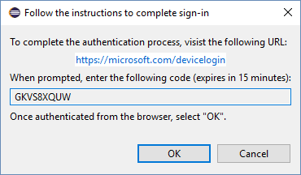

1. Copy the code in the text field in Eclipse and paste it into the browser page, then press the "Continue" button. Then sign in with your credentials used to access Azure DevOps Services. If you get the credentials wrong you can try again by closing Eclipse, deleting ~/.microsoft/Team Explorer/4.0/*, and restarting Eclipse.

    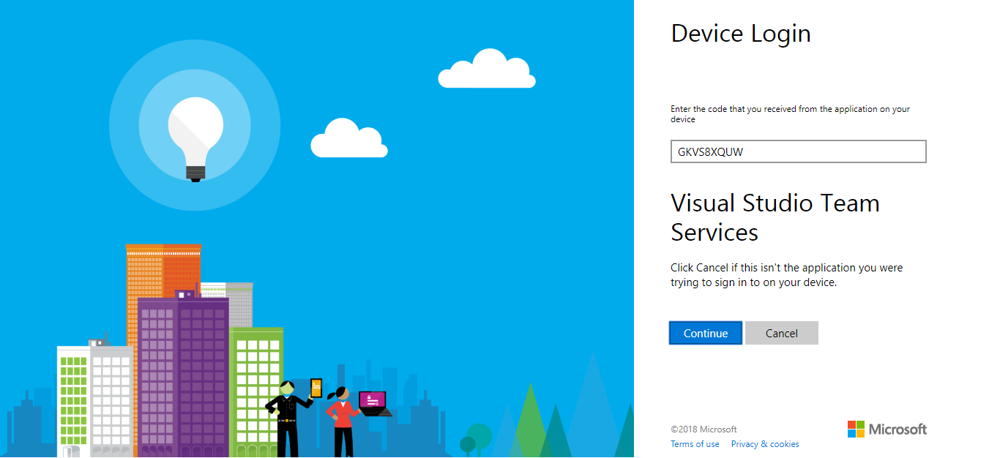

1. Back in Eclipse, press the OK button in the device login window. The Azure DevOps organization should now show up in the list of servers to connect to. Press the "Close" button to close the current window.

    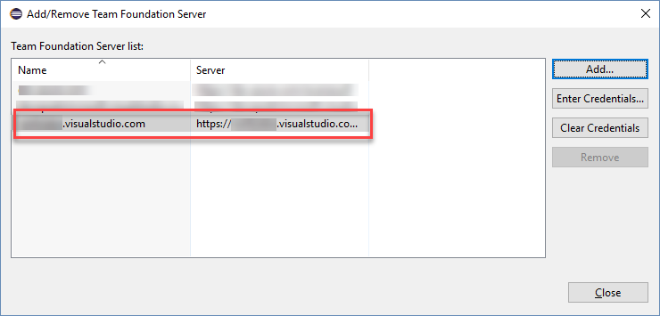

1. Choose the **Team Project** that you provisioned with *Azure DevOps Demo Generator* at the start of this lab and click **Finish**.

## Exercise 2: Clone MyShuttle from an Azure DevOps Services Git repo using Eclipse

Next, clone the **Azure Repos Git repository** to a local Git repository and import the code to a project in Eclipse.

1. In the **Team Explorer** panel, choose **Git Repositories**. This will list all the Git repositories in the project.

1. Right-click the **MyShuttle** repo in the team project and select **Import Repository**

    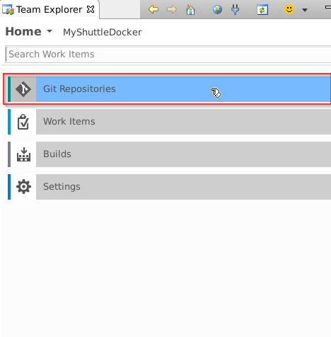

    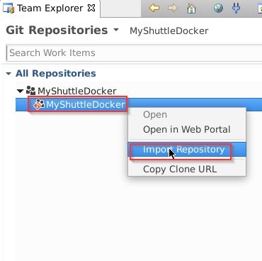

    Continue with the default value for the parent directory and the repo folder name, then press the next button. This will clone the repo onto the VM.

    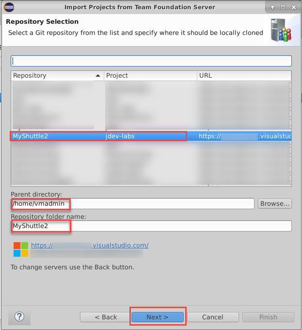

1. We do not have any saved Eclipse projects in the repo. So, we can close the wizard now. We will import the project as a Maven project instead of Eclipse project. In the **"Import Projects from Team Foundation Server"** window, click the **Cancel** button.

    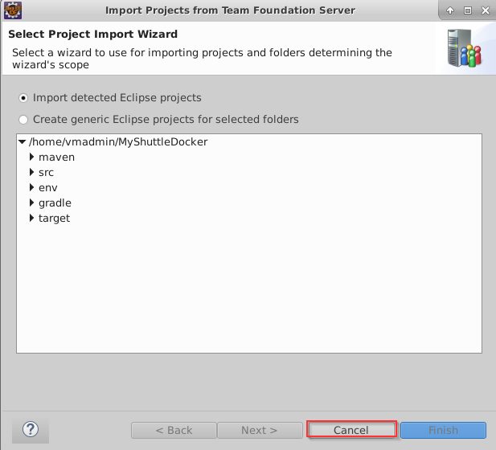

1. The code has been cloned to the local repo. We can import from there. In Eclipse, choose **File -> Import...** to open the *Import* window. In the Import window, expand the Maven folder and choose **Existing Maven projects**. Then press the Next button.

    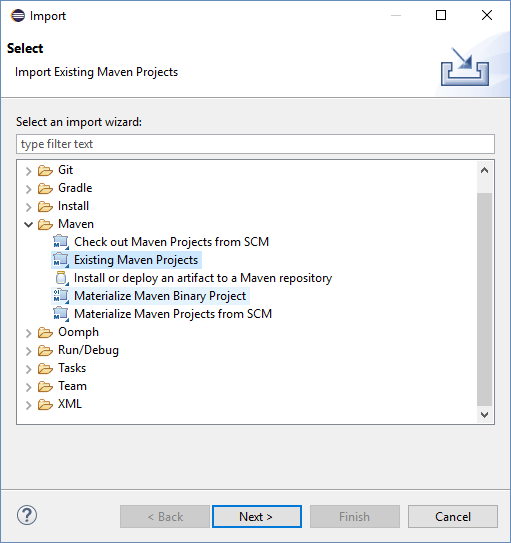

    For the root directory, click on the Browse button or type in the root directory path of "C:\Users\{your-user-name}\git\MyShuttle". The pom.xml file should appear under projects to indicate the Maven project. Additionally, click the checkbox next to **Add project(s) to working set** to add myshuttle to the working set to access in the Package Explorer window as a separate project. Then click the Finish button

    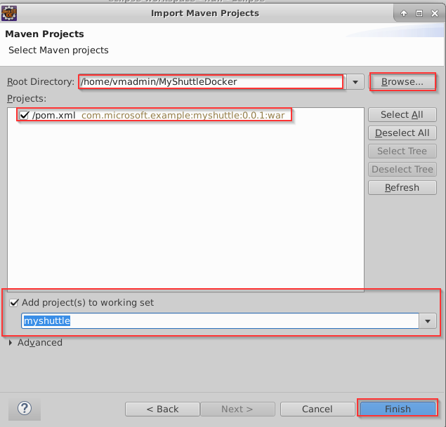

1. Click on **Window -> Show View -> Package Explorer** in the toolbar at the top of Eclipse to view the myshuttle project in Eclipse in Package Explorer (You may have to minimize other windows to view the Package Explorer view)

    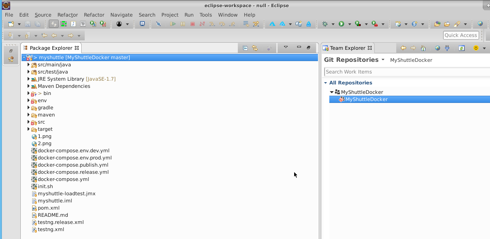

## Exercise 3:  Create an Azure Pipeline to build Docker image

In this task, you will configure the Azure Pipelines build definition that will build and push the image to an Azure Container Registry.

1. Open the [**Azure Portal**](https://portal.azure.com){:target="_blank"} in a separate tab

1. Select **+ Create a resource** and search for **Container Registry**. Select **Create**. In the *Create Container Registry* dialog, enter a name for the service, create a new resource group, select location, enable **Admin user**,  select **Create**.

    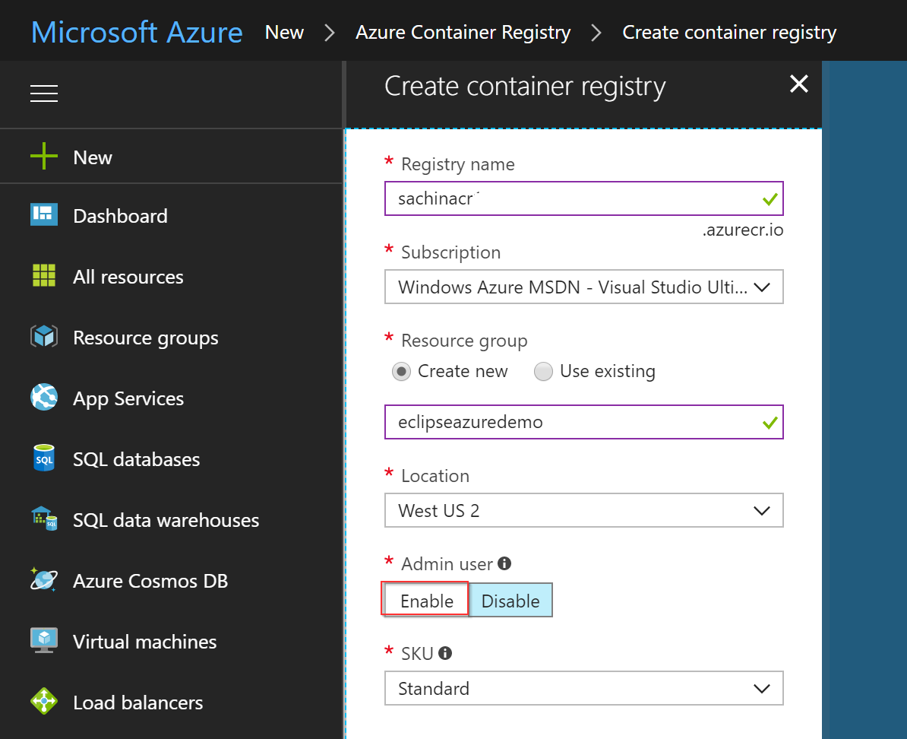

1. Return to  Azure DevOps Organization and click **Pipelines --> Build** hub, edit the **MyShuttleDockerBuild** build. This build definition contains a *maven* task to build the pom.xml file. In the  maven task, set the following parameter values

   |Parameter|Value|Notes|
   |---------|-----|-----|
   |Options|-DskipITs -settings ./maven/settings.xml|Skips integration tests during the build|
   |Code Coverage Tool|JaCoCo|Selects JaCoCo as the coverage tool|
   |Source Files Directory|src/main|Sets the source files directory for JaCoCo|

   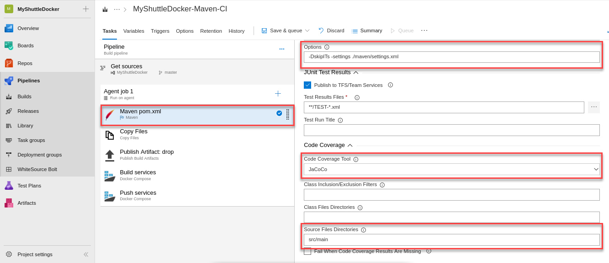

1. There is a **Copy** and **Publish** task to copy the artifacts to the staging directory and publish to Azure DevOps (or a file share).

1. Next we use the **Docker Compose** task to build and publish the images. The settings of the 2 Docker compose tasks - **Build an image** and **Push an image** are as follows:

    |Parameter|Value|Notes|
    |---------|------|-----|
    |Container Registry Type|Azure Container Registry|This is to connect to the Azure Container Registry you created earlier|
    |Azure Subscription|Your Azure subscription|You need to authorize the subscription that contains your registry|
    |Azure Container Registry|Your registry|You need to select the Azure Container registry you created earlier|
    |Image Name|`Web:$(Build.BuildNumber)`|Sets a unique tag for each instance of the build|
    |Include Latest Tag|Check (set to true)|Adds the `latest` tag to the images produced by this build|

1. Click the "Save and Queue" button to save and queue this build. Make sure you are using the **Hosted Ubuntu 1604** agent.

1. The build will push the image to the *Azure Container Registry* we created earlier. 

1. We can verify if the images were pushed correctly from the **Azure Explorer** view within Eclipse. Select **Windows > Show View** and select **Other...**. Search for **Azure Explorer**, select and click **Open**. Right click to *Sign in* to Azure and then refresh Azure Container Registry. Right click and select **Open ACR Explorer**. You should see the image - tagged with the build number.

    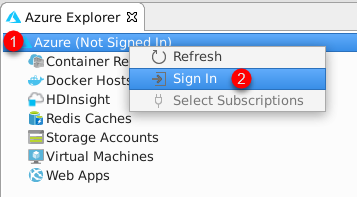

    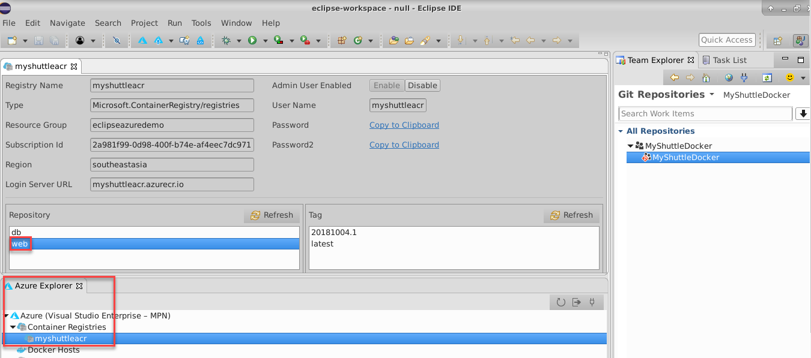

## Exercise 4: Deploying to an Azure Web App for containers

In this exercise, we will setup a Release pipeline to deploy the web application to an Azure web app. First, let's create the Web App

1. Sign into your [Azure Portal](https://portal.azure.com){:target="_blank"}.

1. In the Azure Portal, choose **+ Create a resource**, search for **Web App for Containers + MYSQL**, select and click *Create*.

     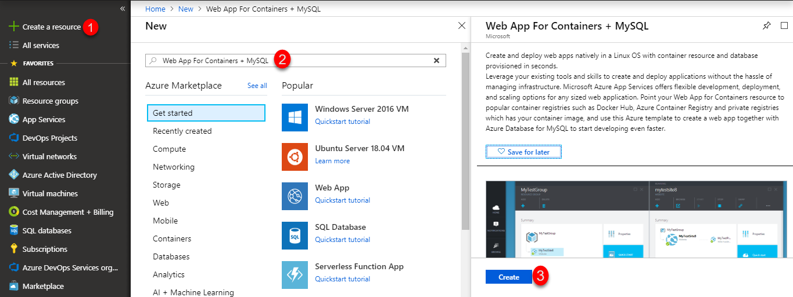

1. Provide the following details- 

    * Enter a name for the new web app
    * Choose the Azure subscription 
    * Select existing or create new resource group for the web app. 
    * Leave the App Service plan/Location as it is.
    * In the *Configure Container* option, select **Azure   Container Registry**. Select the **Registry, Image and Tag** from the respective drop-downs and click **Apply**.
    * In the *Database* section, provide all the required mandatory information and note down **Server Name, Server admin login name, Password** in a notepad. We will use it later in the Deployment pipeline.

    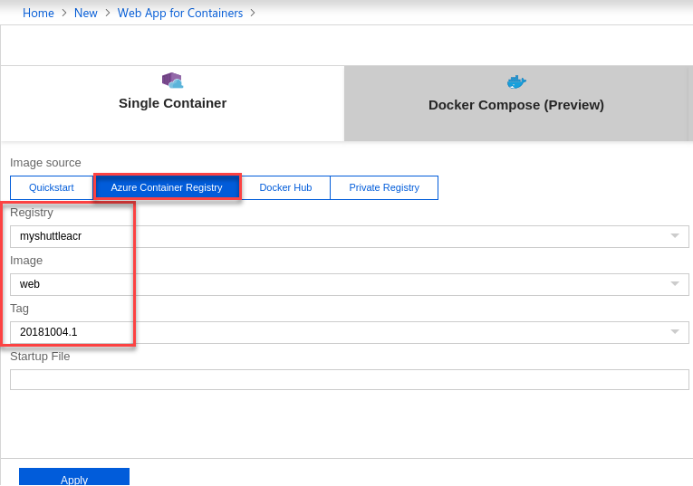
    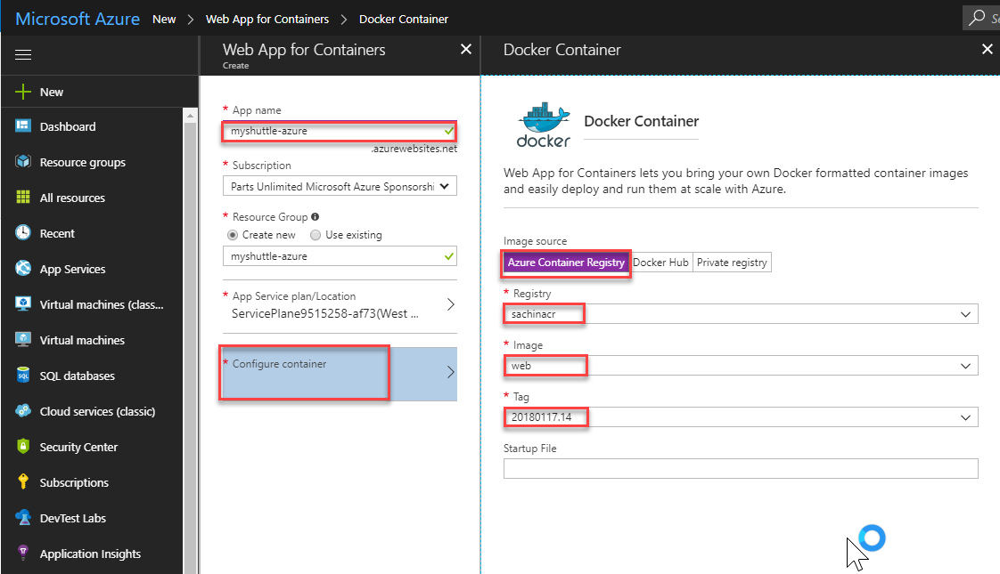

    
1. Once the provisioning is complete, go to the web app properties page, and select the URL to browse the web app. You should see the default **Tomcat** page.

1. Append **/myshuttledev** to the web application context path in the URL to get to the MyShuttle login page. For example if your web app URL is `https://myshuttle-azure.azurewebsites.net/` , then your URL to the login page is `https://myshuttle-azure.azurewebsites.net/myshuttledev/`

    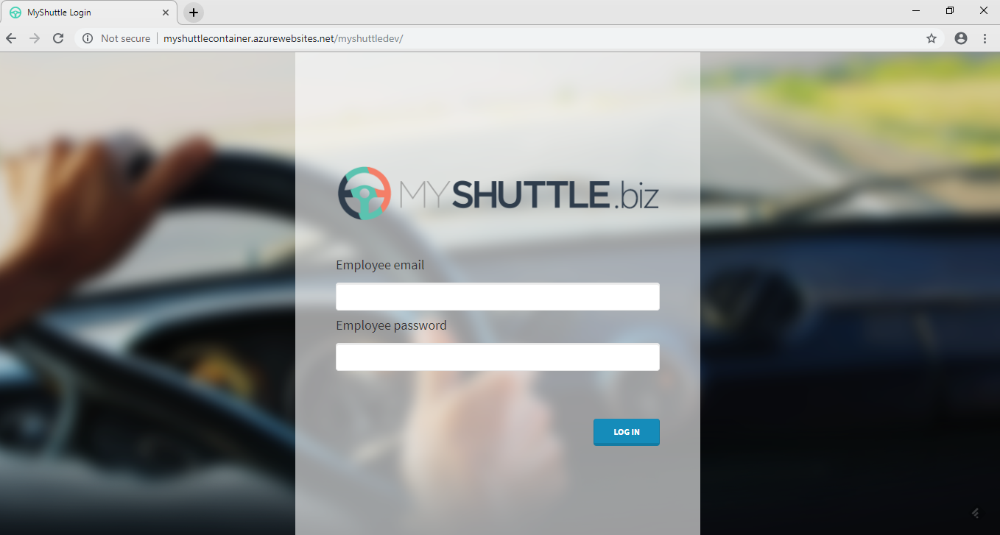
 
    We could configure *Continuous Deployment* to deploy the web app when a new image is pushed to the registry, within the Azure portal itself. However, setting up an Azure Pipeline will provide more flexibility and additional controls (approvals, release gates, etc.) for application deployment.

1. Back in Azure DevOps account, select **Releases** from the **Pipelines** hub. Select the Release definition **MyShuttleDockerRelease** and click *Edit Pipeline*.

     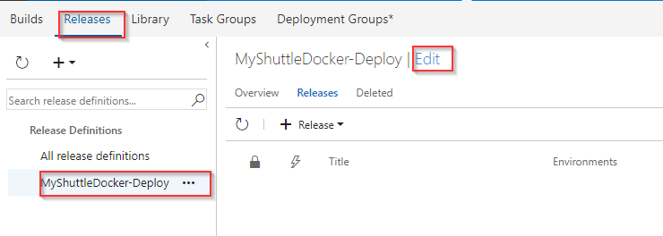

1. Hover the mouse on **Tasks** and select **Azure-Dev**. Configure the environment as below - 

    * Pick the Azure subscription and click **Authorize** to authorize the credentials
    * Enter the **App Service** that you created

    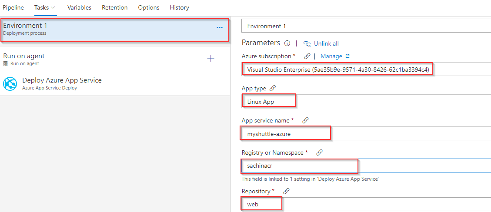

1. Select the **Execute Azure MYSQL:SqlTaskFile** task, choose the Azure subscription, and provide the DB details which were noted down earlier during the creation of the database server. 

    * Select the *Host Name* from the drop down. 
    * A version controlled *MYSQL script* is provided here which creates the required database *alm*, tables and finally, populate records.

    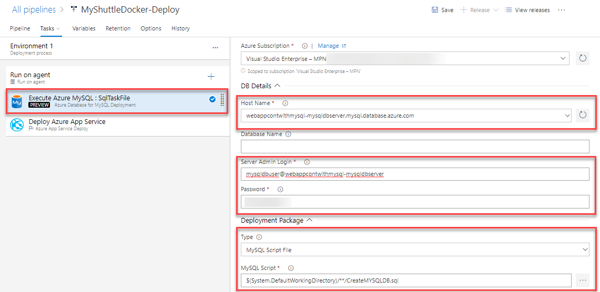

1. For the parameters - **$(DBUSER)** and **$(DBPASSWORD)**, click the **Variables** section and enter the corresponding values -

    * **$(DBUSER)** corresponds to the **SERVER ADMIN LOGIN NAME** value in the *Properties* section of the created MYSQL server in Azure Portal.
    * **$(DBPASSWORD)** corresponds to the **Password** provided during the creation of the MYSQL server in Azure Portal.

    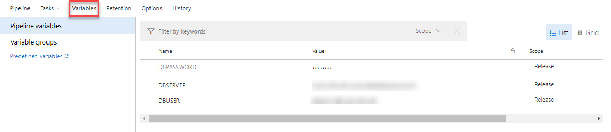

1. Select the **Deploy Azure App Service** task and make sure that the following values are provided. Note that the task allows you to specify the **Tag** that you want to pull. This will allow you to achieve end-to-end traceability from code to deployment by using a build-specific tag for each deployment. For example, with the Docker build tasks  you can tag your images with the *Build.Number* for each deployment.

    * Azure Subscription - Choose the correct Azure subscription from drop down.
    * Registry or Namespace - Provide the value of **Login server** of the created **Container Registry**. You will find it in the *Overview* section.
    * Image -  Provide the value as **web**. This is where the container image is stored after build.
    * Tag - Provide the value as **$(Build.BuildNumber)**.

    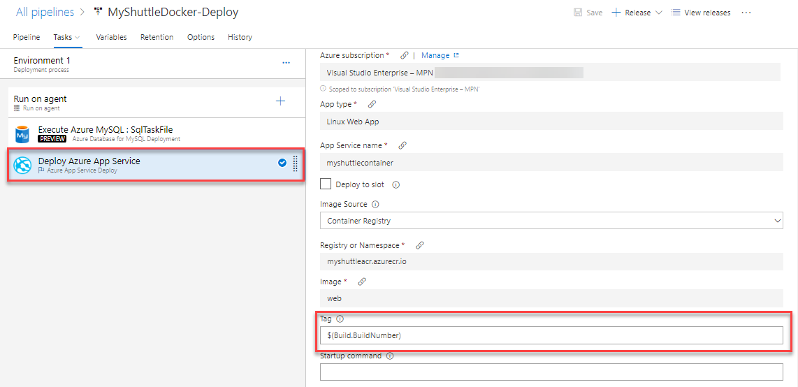

1. Select **Save** and then click **+ Release** \| **Create Release**.

1. Check the artifact version you want to use and then select **Create**.

1. Wait for the release is complete and then navigate to the URL `http://{your web app name}.azurewebsites.net/myshuttledev`. You should be able to see the login page.

## Exercise 5: Configuring MySQL connection strings in the Web App

1. From the Azure portal, select the Web app you provisioned. Select **Application Settings** and scroll down to the **Connection Strings** section.

1. Click **+ Add new connection** string, change the type to **MySQL**, name as **MyShuttleDb** and paste the following string for the value and replace MySQL Server Name, your user name and your password with the appropriate values -

    > `jdbc:mysql://{MySQL Server Name}:3306/alm?useSSL=true&requireSSL=false&autoReconnect=true&user={your user name}&password={your password}`

    * MySQL Server Name : Value that you copied previously from the MySQL server Properties.
    * your user name : Value that you copied previously from the MySQL server Properties.
    * your password : Value that you provided during the creation of MYSQL database server in the Deploy to Azure phase.

      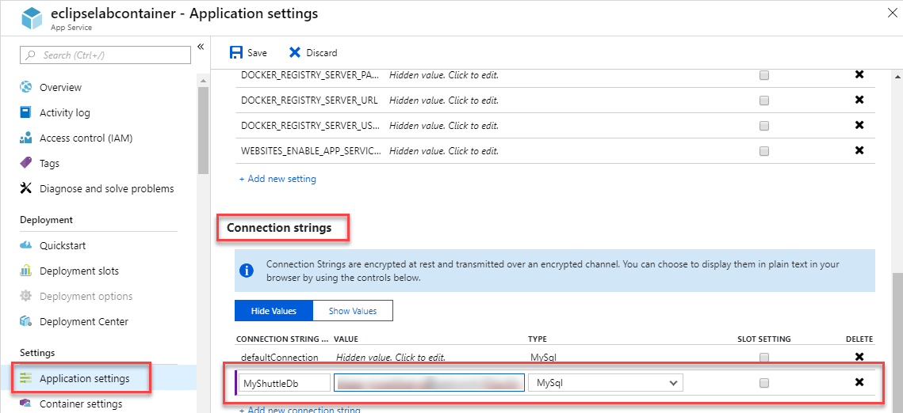

1. Click on Save to save the connection string.

1. You should be able to login to the application now. Return to the login page and try logging in using any of the below *username/password* combination:

    * *fred/fredpassword*
    * *wilma/wilmapassword*
    * *betty/bettypassword*    

## Next: End to End workflow with Eclipse

In the next part of the lab, you are going to see a typical end-to-end workflow for a Java developer using Eclipse. The version that you just deployed has an issue. Assuming the issue has been reported, you will go test it, file a bug, then find the cause and fix the bug.

Continue to [Part 2: End to End workflow with Eclipse](e2eeclipse/){:target="_blank"}
