<div class="rw-ui-container"></div>

## Overview 

**GitHub** hosts over 100 million repositories containing applications of all shapes and sizes. But GitHub is just a start---those applications still need to get built, released, and managed to reach their full potential.

[Azure Pipelines](https://azure.microsoft.com/services/devops/pipelines/) that enables you to continuously build, test, and deploy to any platform or cloud. It has cloud-hosted agents for Linux, macOS, and Windows; powerful workflows with native container support; and flexible deployments to Kubernetes, VMs, and serverless environments.

   

Azure Pipelines provides unlimited CI/CD minutes and 10 parallel jobs to every GitHub open source project for free. All open source projects run on the same infrastructure that our paying customers use. That means you'll have the same fast performance and high quality of service. Many of the top open source projects are already using Azure Pipelines for CI/CD, such as Atom, CPython, Pipenv, Tox, Visual Studio Code, and TypeScript---and the list is growing every day.

In this lab, you'll see how easy it is to set up **Azure Pipelines** with your **GitHub** projects and how you can achieve an end-to-end traceability from work items to code change, commit, to build and release.

## Prerequisites

These items are required for this lab.

-  A GitHub account from <https://github.com>.

-  An Azure account from <https://azure.com>.

-  An Azure DevOps account from <https://dev.azure.com>

-  ARM Outputs extension installed in your Azure DevOps account from
    <https://marketplace.visualstudio.com/items?itemName=keesschollaart.arm-outputs>.

-  Git installed from <https://git-scm.com/downloads>.

-  Visual Studio Code installed from <https://code.visualstudio.com>.

-  Azure Pipelines extension for Visual Studio Code installed from
    <https://marketplace.visualstudio.com/items?itemName=ms-azure-devops.azure-pipelines>.

-  GitHub Pull Requests extension for Visual Studio Code installed from
    <https://marketplace.visualstudio.com/items?itemName=GitHub.vscode-pull-request-github>.

## Setting up the environment

1. On GitHub, navigate to the [Microsoft/ContosoAir](https://github.com/Microsoft/ContosoAir/) repository.
1. If you’re not already signed in to GitHub, sign in now.

      

1. In the top-right corner of the page, click **Fork** to fork the repository to your own account.
    
      

1. Once the repo is forked, you need to clone the GitHub repo locally and open it in Visual Studio Code.

1. Copy the clone URL of your forked repository.
      
      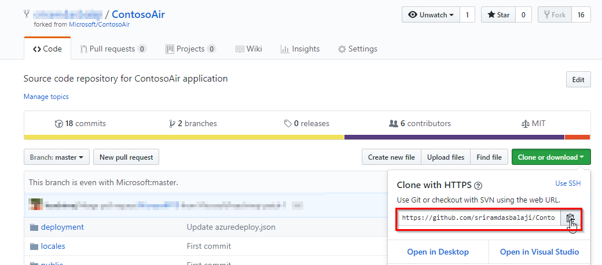

1. Start Visual Studio Code. Press `Ctrl+Shift+P` to bring the Command Palette and enter `Git: Clone` to clone the Git repository. You will be asked for the URL of the remote repository. Paste the URL you copied earlier. Choose the directory under which to put the local repository. Choose **Open Repository** when prompted. 

      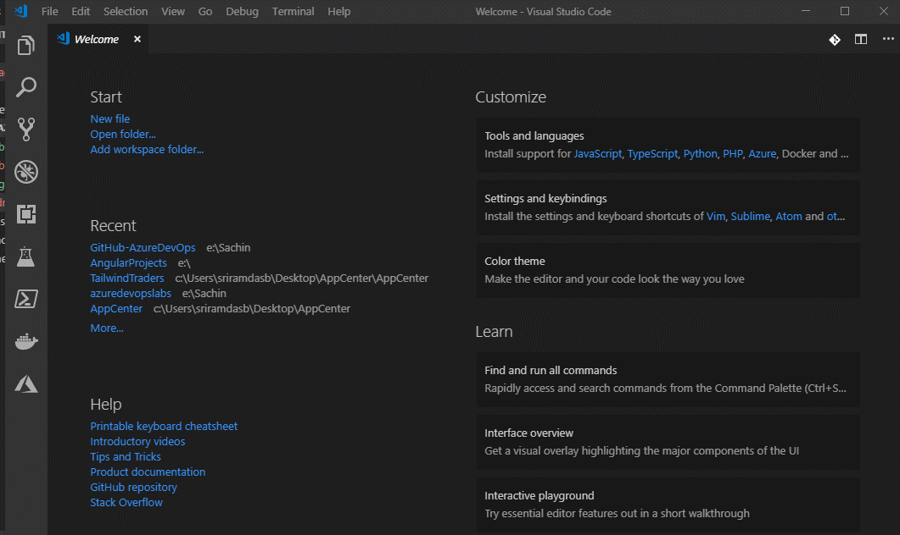

## Lab Scenario: 
In this lab, we'll be illustrating the integration and automation benefits of **Azure DevOps**. We will take on the role of helping a fictitious airline---Contoso Air---that has developed their flagship web site using Node.js. To improve their operations, they want to implement pipelines for continuous integration and continuous delivery so that they can quickly update their public services and take advantage of the full benefits of DevOps and the cloud.

The site will be hosted in Azure, and they want to automate the entire process so that they can spin up all the infrastructure needed to deploy and host the application without any manual intervention. Once this process is in place, it will free up their technology teams to focus more on generating business value.

## Exercise 1: Setting up automated CI/CD pipelines with Azure Pipelines
In this exercise, we will help Contoso Air revamp a critical component of their DevOps scenario. Like all airlines, they rely on their web site to generate and manage business opportunities. However, the current processes they have in place to move a change from their source code to their production systems is time-consuming and open to human error. They use GitHub to manage their source code and want to host their production site on Azure, so it will be our job to automate everything in the middle.

This will involve setting up a pipeline so that commits to the GitHub repo invoke a continuous integration build in Azure DevOps. Once that build is complete, it will invoke a continuous delivery deployment to push the bits out to Azure, creating the required resources, if necessary. The first thing we need to do is to connect GitHub with Azure DevOps, which we can do via the **Azure Pipelines** extension in the GitHub Marketplace.

## Task 1: Installing Azure Pipelines from GitHub Marketplace

**Azure Pipelines** is available in GitHub Marketplace which makes it even easier for teams to configure a CI/CD pipeline for any application using your preferred language and framework as part of your GitHub workflow in just a few simple steps

1. Switch to the browser tab open to the root of your GitHub fork.

1. Navigate to the **GitHub Marketplace**.

    

1. Search for "**pipelines**" and click **Azure Pipelines**.
   
    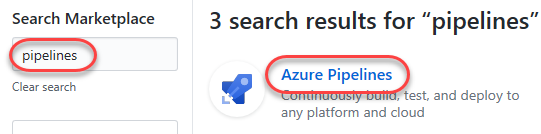

1. Scroll to the bottom and click **Install it for free**. If you previously installed Azure Pipelines, select **Configure access** instead to skip steps 6-8.
    
    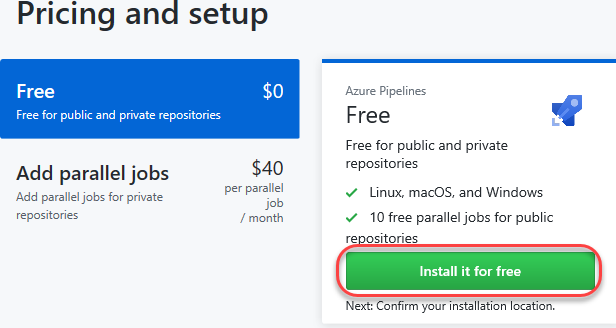

   

1. If you have multiple **GitHub** accounts, select the one you forked the project to from the **Switch billing account** dropdown.

    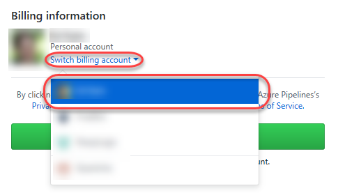

1. Click **Complete order and begin installation**.

     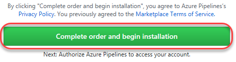

1. Select the repositories you want to include (or **All repositories**) and click Install.
 
    

     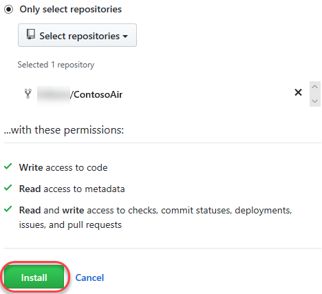

## Task 2: Configuring a Continuous Integration Pipeline

Now that Azure Pipelines has been installed and configured, we can start building the pipelines but we will need to select a project where the pipeline will be saved. You may select an existing or create a new Azure DevOps project to hold and run the pipelines we need for continuous integration and continuous delivery. The first thing we'll do is to create a CI pipeline.

1. Select the organization and Azure DevOps project that you want to use. If you do not have one, you can create for free.

   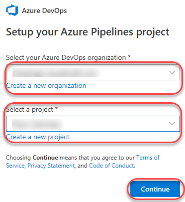

1. Select the forked repo.

   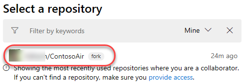

   Every build pipeline is simply a set of tasks. Whether it's copying files, compiling the source, or publishing artifacts, the existing library of tasks covers the vast majority of scenarios. You can even create your own if you have specialized needs not already covered. We're going to use YAML, a markup syntax that lends itself well to describing the build pipeline. Note that the Node.js pipeline as a starting point based on an analysis of our source project. We'll replace the contents with the final YAML required for our project.

1. Select **Node.JS** as the recommended template if prompted.

   
   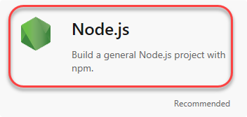

1. Replace the default template with the YAML below.

   ```YAML
   pool:
     vmImage: 'ubuntu-16.04'
   trigger:
     - master
   steps:
     - task: CopyFiles@2
       displayName: 'Copy Files to: $(build.artifactstagingdirectory)/Templates'
       inputs:
         SourceFolder: deployment
         Contents: '*.json'
         TargetFolder: '$(build.artifactstagingdirectory)/Templates'
     - task: Npm@1
       displayName: 'npm custom'
       inputs:
         command: custom
         verbose: false
         customCommand: 'install --production'
     - task: ArchiveFiles@2
       displayName: 'Archive $(Build.SourcesDirectory)'
       inputs:
         rootFolderOrFile: '$(Build.SourcesDirectory)'
         includeRootFolder: false
     - task: PublishBuildArtifacts@1
       displayName: 'Publish Artifact: drop'

   ```

      

1. Click **Save and run**.

    

1. Confirm the **Save and run** to commit the YAML definition directly to the master branch of the repo.

    

1. Follow the build through to completion.
    

    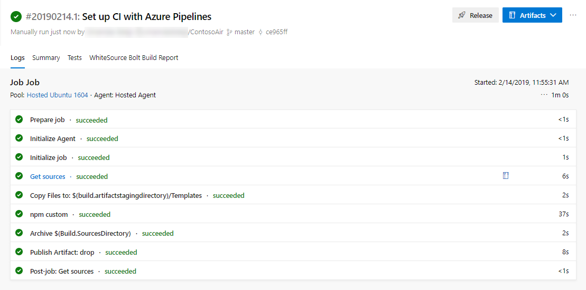

## Task 3: Adding a build status badge

An important sign for a quality project is its build status badge. When someone finds a project that has a badge indicating that the project is currently in a successful build state, it's a sign that the project is maintained effectively.

1. Click the build pipeline to navigate to its overview page.
    
    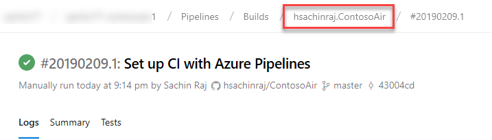

1. From the **ellipses (...)** dropdown, select **Status badge**.
    
    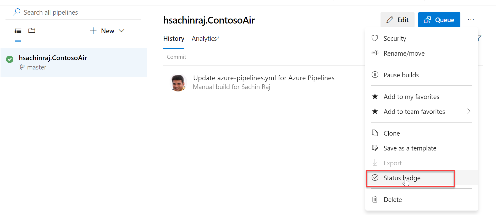

1. The **Status badge** UI provides a quick and easy way to integrate the build status wherever you want. Often, you'll want to use the provided URLs in your own dashboards, or you can use the Markdown snippet to add the status badge to locations such as Wiki pages. Click the **Copy to clipboard** button for **Sample Markdown**.

    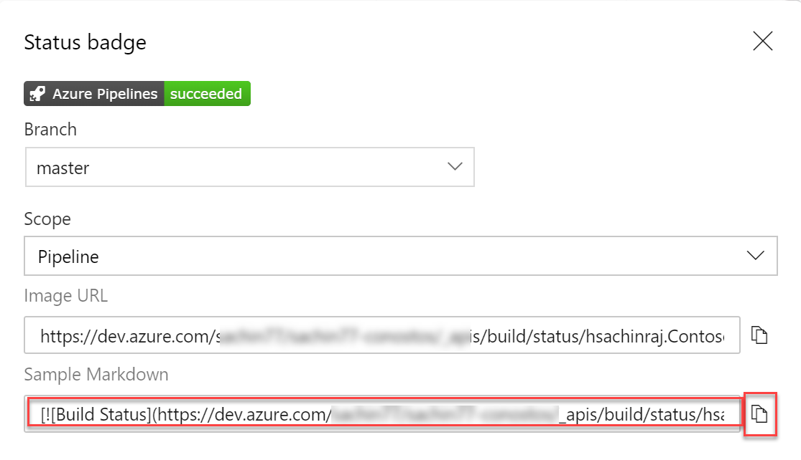

1. Return to Visual Studio Code and open the **README.md** file.

1. Paste in the clipboard contents at the beginning of the file. Press **Ctrl+S** to save the file.

    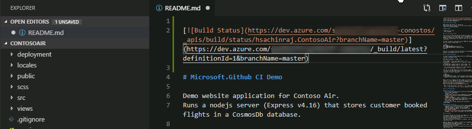

1. From the **Source Control** tab, enter a commit message like **Added build status badge** and press **Ctrl+Enter** to commit. Confirm if prompted.

    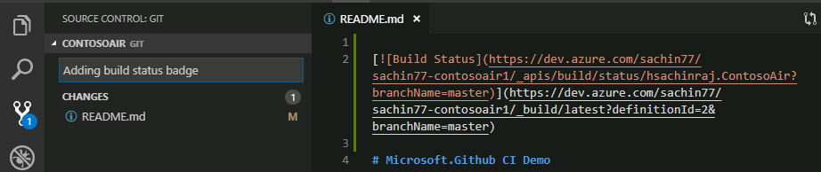

1. In Git, only changes need to be staged first to be included in the commit. If you are prompted to choose whether you want the VS Code automatically to stage all changes and commit them directly, choose **Always**
   

   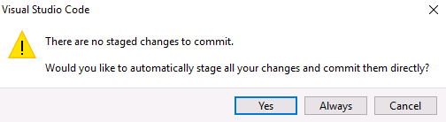

1. If you receive an error prompting you to configure `user .name` and `user.email` in git, open a command prompt and enter the following command to set your user name and email address:

    `git config --global user.name "Your Name"`

    `git config --global user.email "Your Email Address"`

1. Press the **Synchronize Changes** button at the bottom of the window to push the commit to the server. Confirm if prompted.

    

1. You will need to sign in to GitHub if you have not already signed in

    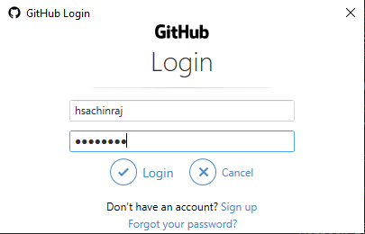

1. Go to the readme file on the browser and you will see the status.

     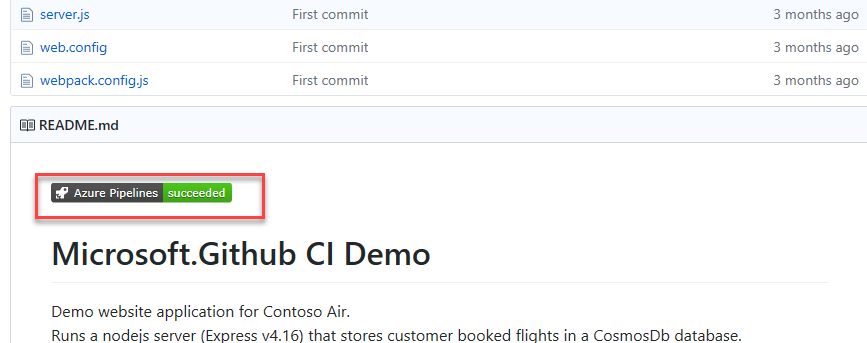

## Task 4: Embedding automated tests in the CI pipeline
Now that we have our CI successfully built, it's time to deploy but how do we know if the build is a good candidate for release? Most teams run automated tests, such as unit tests, as a part of their CI process to ensure that they are releasing a high-quality software. Teams capture key code metrics such as code coverage, code analysis, as they run the tests, to make sure that the code quality does not drop and the technical debt if not completely eliminated, is kept low. 

 We're going to pull down the `azure-pipelines.yml` file that we created earlier and add tasks to run some tests and publish the test results.

1.  Return to Visual Studio Code.

1.  From the **Explorer** tab, open **azure-pipelines.yml**.

    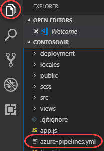

    Before we make our change, let's take a quick look at the build tasks. There are four steps required for the build. First, deployment templates are copied to a target folder for use during the release process. Next, the project is built with NPM. 
    After that, the built solution is archived and finally published for the release pipeline to access. With the Azure Pipelines extension
    for Visual Studio Code, you get a great YAML editing experience, including support for IntelliSense.

    What we are missing is testing in the pipeline. We already have unit tests for our code. We just have to run them in the pipeline. We will add tasks to run the test and publish the results and code coverage. 

1. Remove all the steps and replace it with the following code. Press **Ctrl+S** to save the file.

   ```YAML
   pool:
     vmImage: ubuntu-16.04
   trigger:
     - master
   steps:
     - task: Npm@1
       inputs:
         command: 'custom'
         customcommand: 'install --production'
     - script: |
         npm install
         npm test
       displayName: 'Run unit tests'
       continueOnError: true
     - task: PublishTestResults@2
       displayName: 'Publish Test Results'
       condition: succeededOrFailed()
       inputs:
         testResultsFiles: $(System.DefaultWorkingDirectory)/test-report.xml
     - task: PublishCodeCoverageResults@1
       displayName: 'Publish Code Coverage'
       condition: 'in(variables[''Agent.JobStatus''], ''Succeeded'')'
       inputs:
         codeCoverageTool: Cobertura
         summaryFileLocation: '$(System.DefaultWorkingDirectory)/coverage/*coverage.xml'
         reportDirectory: $(System.DefaultWorkingDirectory)/coverage
     - task: ArchiveFiles@2
       displayName: 'Archive sources'
       inputs:
         rootFolderOrFile: $(Build.SourcesDirectory)
         includeRootFolder: false
     - task: CopyFiles@2
       displayName: 'Copy ARM templates'
       inputs:
         SourceFolder: deployment
         Contents: '*.json'
         TargetFolder: $(build.artifactstagingdirectory)/Templates
     - task: PublishBuildArtifacts@1
       displayName: 'Publish Artifact: drop'

   ```


1.  From the **Source Control** tab, enter a commit message like **Updated build pipeline** and press **Ctrl+Enter** to commit.
    Confirm if prompted.

    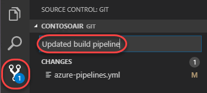

1. Press the **Synchronize Changes** button at the bottom of the window to push the commit to the server. Confirm if prompted.

    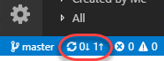


1. Back in Azure DevOps, navigate to **Pipelines --> Pipelines**. We can see that our build pipeline has kicked off a new build.

    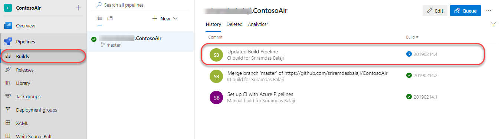
    
   We can follow as it executes the tasks we defined earlier, and even get a real-time view into what's going on at each step. When the build completes, we can review the logs and any tests that were performed as part of the process.
   Track the build tasks.

    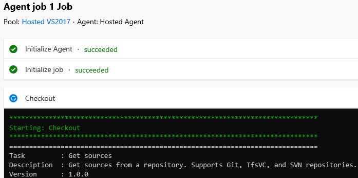

   Follow the build through to completion.

    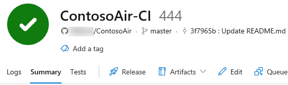

1. Now that the build has completed, let's check out the **Tests** tab to view the published tests results. We can get quantitative metrics such as total test count, test pass percentage, failed test cases, etc., from the **Summary**  section

    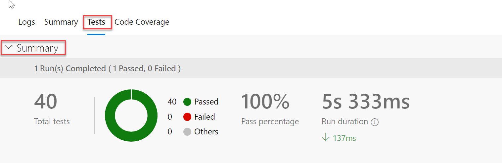

1. The **Results** section lists all tests executed and reported as part of the current build or release. The default view shows only the failed and aborted tests in order to focus on tests that require attention. However, you can choose other outcomes using the filters provided

    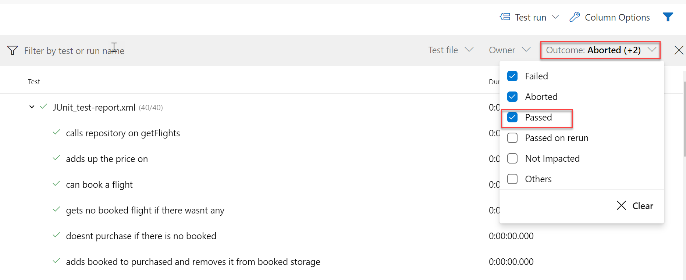

1. Finally, you can use the details pane to view additional information, for the selected test case, that can help to troubleshoot such as the error message, stack trace, attachments, work items, historical trend, and more.

From the results, we can see all 40 tests have passed which means we have not broken any changes and this build is a good candidate for deployment. 


## Task 5: Configuring a CD pipeline with Azure Pipelines

 Now that the build pipeline is complete and all tests have passed, we can turn our attention to creating a release pipeline. 
 
 Like the build templates, there are many packaged options available that cover common deployment scenarios, such as publishing to Azure. But to illustrate how flexible and productive the experience is, we will build this pipeline from an empty template.

1.  From the left hand menu, under **Pipelines** click **Releases**. Click **New Pipeline** to create a new CD pipeline to deploy the artifacts produced by the build.

    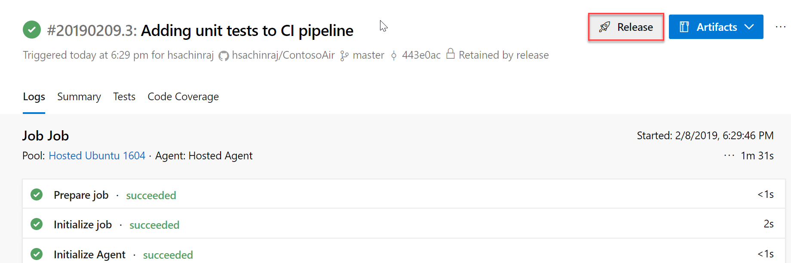

1.  Click **Empty job**.

    

    The first item to define in a release pipeline is exactly what will be released and when. In our case, it's the output
    generated from the build pipeline. Note that we could also assign a
    schedule, such as if we wanted to release the latest build every
    night.

1.  Select the associated artifact. 

    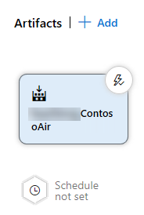

1.  Set **Source** to the build pipeline created earlier and **Default
    version** to **Latest**. Change the **Source alias**, if you want, to something like **"\_ContosoAir-CI"** and click **Add**. Note that this is an identifier (typically a short name) that uniquely identifies an artifact linked to the release pipeline. It cannot contain the characters: \ / : * ? < > | or double quotes

    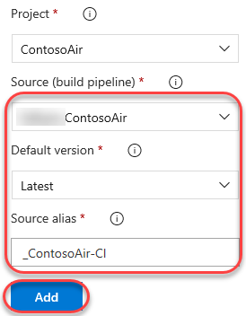

    As we did with continuous integration starting on a source commit, we also want to have this pipeline automatically start when the build pipeline completes. It's just as easy.

1.  Click the **Triggers** button on the artifact.

    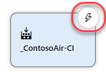

1.  **Enable** continuous deployment, if it is not already enabled.

    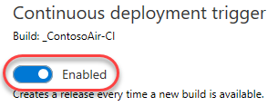

    > We also have the option of adding quality gates to the release process. For example, we could require that a specific user or group approve a release before it continues, or that they approve it after it's been deployed. These gates provide notifications to the necessary groups, as well as polling support if you're automating the gates using something dynamic, such as an Azure function, REST API, work item query, and more. We won't add any of that here, but we could easily come back and do it later on.

1.  Click the **pre-deployment conditions** button.

    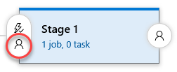

1.  Review pre-deployment condition options.

    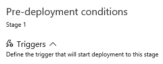

   

1.  Select the **Variables** tab.

    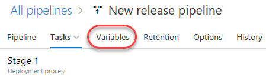
   
    In this pipeline, we're going to need to specify the same resource group in multiple tasks, so it's a good practice to use a pipeline variable. We'll add one here for the new Azure resource group we want to provision our resources to.

1. **Add** a **resourcegroup** variable that is not currently used by
    an existing resource group in your Azure account (**"contosoair"**
    will be used in this script).

    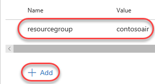

    Also, just like the build pipeline, the release pipeline is really just a set of tasks. There are many out-of-the-box tasks available, and you can build your own if needed. The first task our release requires is to set up the Azure deployment environment if it doesn't yet exist. After we add the task, I can authorize access to the Azure account I want to deploy
    to and instruct it to use the variable name we just specified for the resource group name.

1. Select the **Tasks** tab. Click the **Add task** button.

    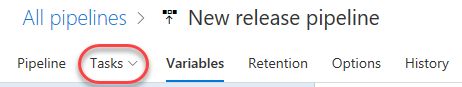

    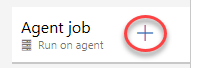

1. Search for **"arm"** and **Add** an **ARM template
    deployment** task.

    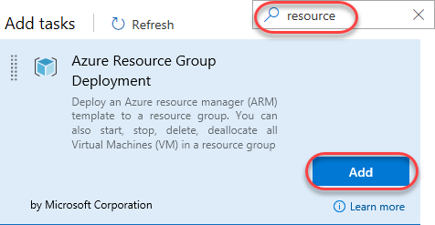

1. Select the newly created task.

    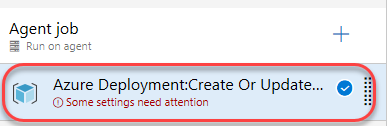

    Then, select the **Task version** to **2.\***.

    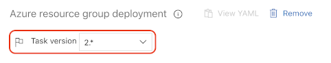

1. Select and authorize an Azure subscription. 

    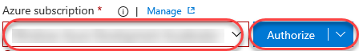

   > Note: You will need to disable popup-blockers to sign in to Azure for authorization. If the pop-up window hangs, please close and try it again. 
1. Set the **Resource group** to **"\$(resourcegroup)"** and select a
    **Location**.

    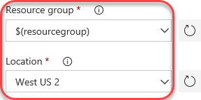

    Rather than having to manually create the Azure
    resources required to host the web app, we defined an
    **Azure Resource Manager** or **ARM** template that describes the
    environment in JSON. This allows the environment definition to be
    updated and managed like any other source file. These were the files
    we copied to the Templates folder during the build pipeline. You can
    also override the template parameters as part of this configuration if required.

1. Enter the settings below. You can use the browse navigation to
    select them from the most recent build output.
     
     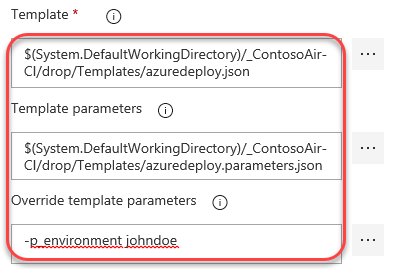
    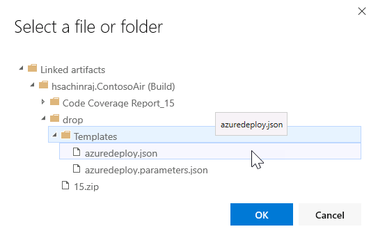

    Template:
    **\$(System.DefaultWorkingDirectory)/\_ContosoAir-CI/drop/Templates/azuredeploy.json**  
    Template parameters:
    **\$(System.DefaultWorkingDirectory)/\_ContosoAir-CI/drop/Templates/azuredeploy.parameters.json**

    You will also need to set **Override template parameters** to
    generate an Azure app service name that is globally unique, so your
    name is recommended. For example, if your name is **John Doe**, use
    something like **-p\_environment johndoe**. This will be used as
    part of the app service name in Azure, so please limit it to
    supported characters.


    When this task completes, it will have generated
    an Azure resource group with the resources required to run our
    application. However, the ARM template does some processing of the
    variables to generate names for the resources based on the input
    variables, which we will want to use in future tasks. While we could
    potentially hardcode those variables, it could introduce problems if
    changes are made in the future, so we'll use the ARM Outputs task to
    retrieve those values and put them into pipeline variables for us to
    use. This task happens to be a 3rd party task I installed earlier
    from the Visual Studio Marketplace. It contains this and many other
    extensions for Azure DevOps from both Microsoft and 3rd parties.

1. Click the **Add task** button.

    

1. Search for **"arm"** and add **ARM outputs** task.

    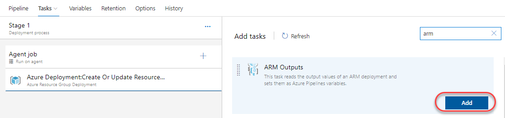


   The key variable we care about here is the name of the app
    service created, which our ARM template has specified as an output.
    This task will populate it for us to use as the "web" variable in
    the next task.

1. Select the newly created task. Select the same subscription from the previous task and enter the same resource group variable name.

    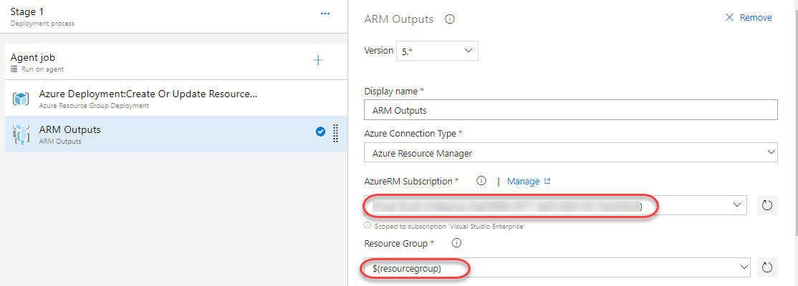

    Finally, we can deploy the app service. We'll use
    the same subscription as earlier and specify the web variable as the
    name of the app service we want to deploy to. By this time in the
    pipeline, it will have been filled in for us by the ARM Outputs
    task. Also, note that we have the option to specify a slot to deploy
    to, but that is not covered in this demo. 

1. Click the **Add task** button.

    

   Search for **"app service"** and **Add** an **Azure App Service
    Deploy** task.

    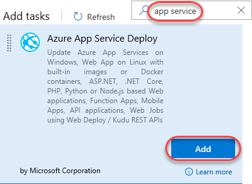

1. Select the newly created task.

    

1. Select the same subscription as earlier.

    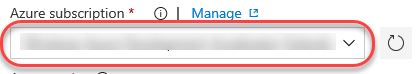

1. Enter the **App Service name** of **"\$(web)"**.

    

1. **Save** the pipeline.

    

1. Select **+ Release** and then select **Create a Release** 

    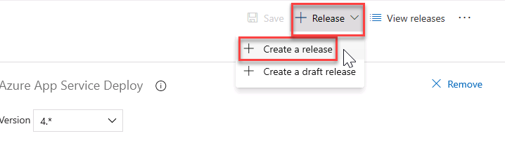

1. Select **Create** to start a new release. 

1. Navigate to the release summary by clicking on the **Release-1** link that appears. Click **In progress** to follow the release process.

    

1. Note that it will take a few minutes (around 5 at the time of drafting) for the app to finish deploying due to heavy first-time operations. 

    

1. Select the **App Service Deploy** task to view the detailed log. You should find the URL to the published website here. **Ctrl+Click** the link to open it in a separate tab.

    

1. This will open the web page of the Contoso Air.

    

## Next: GitHub integration with Azure Boards

In addition to Azure Pipelines, GitHub users can also benefit from [Azure Boards](https://azure.microsoft.com/services/devops/boards/), a set of features that enable you to plan, track, and discuss work across your teams using Kanban boards, backlogs, team dashboards, and custom reporting. You can link GitHub activities from Azure Boards by mentioning them in commits and pull requests, and even automate the state transition of linked work items when pull requests are approved.

Continue to [GitHub integration with Azure Boards lab](../github-azureboards)
