<div class="rw-ui-container"></div>

## Overview 

**GitHub Actions** gives you the flexibility to build an automated software development lifecycle workflow. You can write individual tasks, called actions, and combine them to create a custom workflow. Workflows are custom automated processes that you can set up in your repository to build, test, package, release, or deploy any code project on GitHub.

With **GitHub Actions** you can build end-to-end continuous integration (CI) and continuous deployment (CD) capabilities directly in your repository. GitHub Actions powers GitHub's built-in continuous integration service.

 

### What’s covered in this lab
In this lab, you will see

1. How to set up a workflow with GitHub Actions
1. Create a workflow to Build and Deploy a sample .Net Core web application to Azure App Services

### Before you begin

We are excited you want to learn how to use **GitHub Actions** for your automated workflow.

Before you start following the lab, you need to complete the below tasks.

### Prerequisites

1. You will need a **GitHub** account. If you do not have one, you can sign up for free [here](https://github.com/join)

1. **Microsoft Azure Account**: You will need a valid and active Azure account for this lab. If you do not have one, you can sign up for a [free trial](https://azure.microsoft.com/en-us/free/).

### Setting up the GitHub repository

**Parts Unlimited** is an example ASP.NET Core eCommerce website site. Let us fork the Parts Unlimited repository to get started with this lab.

1. On GitHub, navigate to the [sriramdasbalaji/PartsUnlimited-Core](https://github.com/sriramdasbalaji/PartsUnlimited-Core.git) repository.

1. In the top-right corner of the page, click **Fork**.

    

    Now, you have a fork of the original [sriramdasbalaji/PartsUnlimited-Core](https://github.com/sriramdasbalaji/PartsUnlimited-Core.git) repository.

## Task 1: Set up a workflow to Build and Test your project with GitHub Actions

1. Navigate to the GitHub repository which you cloned above.

1. Select **Actions**.

   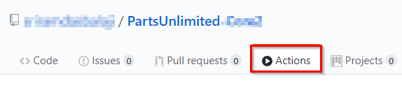

1. You will see some predefined workflows to help you to get started with GitHub Actions
  
   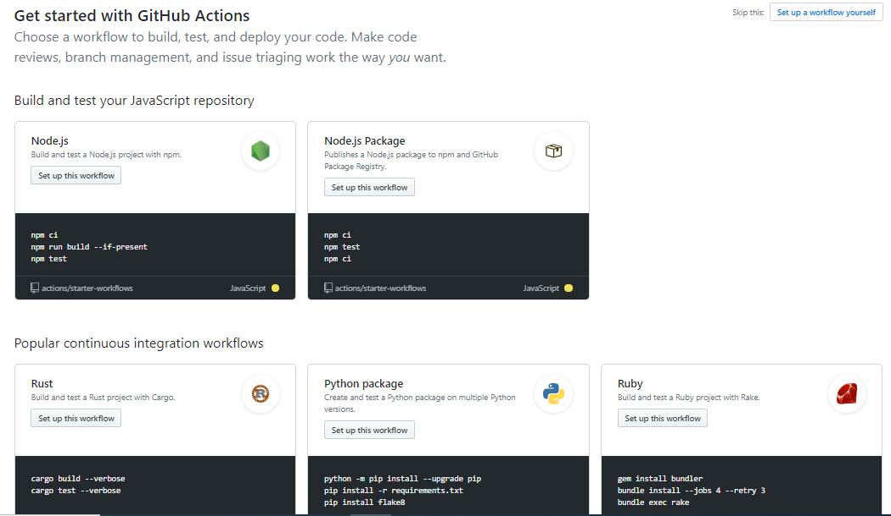

1. For this lab select **Set up a workflow yourself** from the right top corner of the page.

   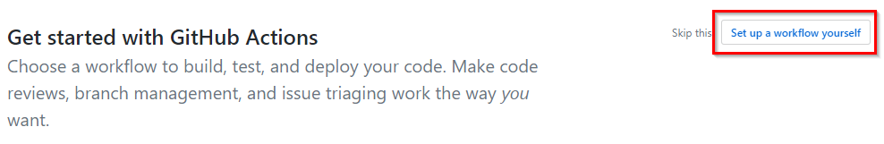

1. You can see that at the root of your repository, it created a directory named `.github/workflows` to store your workflow files. And it will add a `.yml` or `.yaml` file for your workflow.

      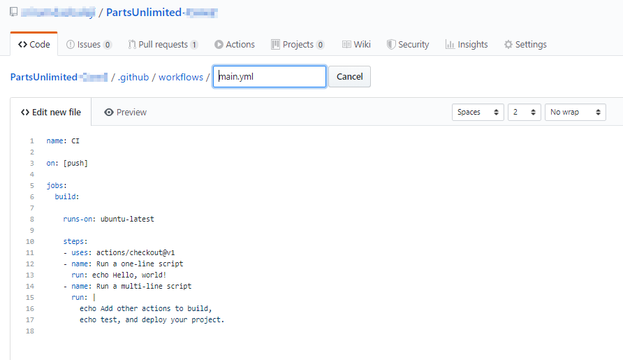

    >For workflow syntax for GitHub Actions see [here](https://help.github.com/en/github/automating-your-workflow-with-github-actions/workflow-syntax-for-github-actions)

1. Rename the `main.yml` to `PartsUnlimitedWorkflow.yml` and replace the content of the workflow with below YAML snippet.

   ```yaml
   name: PartsUnlimited- Deployment Workflow

   on: [push]

   jobs:
     build:

       runs-on: ubuntu-latest
    
       steps:
       - uses: actions/checkout@v1
       - name: Setup .NET Core
         uses: actions/setup-dotnet@v1
         with:
           dotnet-version: 2.2.108
       - name: Restore with dotnet
         run: dotnet restore
       - name: Build with dotnet
         run: dotnet build
       - name: Test with dotnet
         run: dotnet test
       - name: Publish with dotnet
         run: dotnet publish -c release

    ```
1. Now your file should look like as below
  
    

1. Let us get into the details of the workflow.

   - **Workflow Triggers**: Your workflow is set up to run on push events to the branch
     
     ```yaml
        on: [push]
     ```
    
      You can set your workflow to run on push events to specific branches as well. For example to the `master` and `release/*` branches

      ```yaml
      on:
      push:
      branches:
      - master
      - release/*
      ```
     For more information, see [Events that trigger workflows](https://help.github.com/articles/events-that-trigger-workflows).
   
   - **Running your jobs on hosted runners:** GitHub Actions provides hosted runners for Linux, Windows, and macOS. We specified hosted runner in our workflow as below.

       ```yaml
       jobs:
       build:
       runs-on: ubuntu-latest

      ```
   - **Using an action**: Actions are reusable units of code that can be built and distributed by anyone on GitHub. To use an action, you must specify the repository that contains the action.
      
      ```yaml
      - uses: actions/checkout@v1
       - name: Setup .NET Core
         uses: actions/setup-dotnet@v1
         with:
           dotnet-version: 2.2.108
      ```

   - **Running a command**: You can run commands on the job's virtual machine. We are running below dotnet commands to restore, build, test and publish our application.

      ```yaml
       - name: Restore with dotnet
         run: dotnet restore
       - name: Build with dotnet
         run: dotnet build
       - name: Test with dotnet
         run: dotnet test
       - name: Publish with dotnet
         run: dotnet publish -c release
     ```

1. Click on **Start Commit** to push the changes. Since the workflow is configured to trigger on push events, your workflow will be queued when commit is done. 

    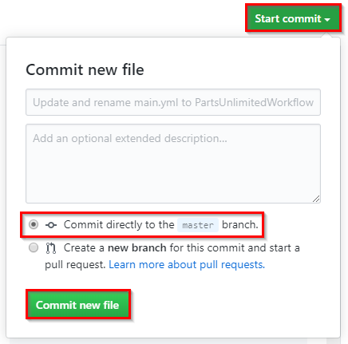
  
1. Once you commit the file to navigate back to **Actions** tab. You would see workflow is queued. 

    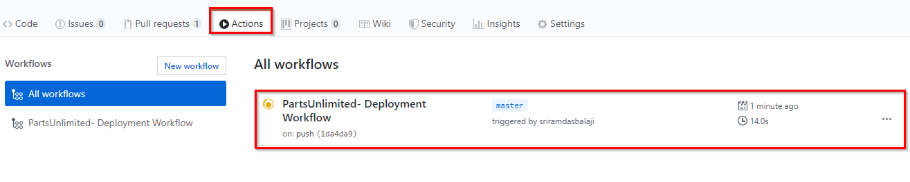

1. Click on workflow to see the progress of the run.

   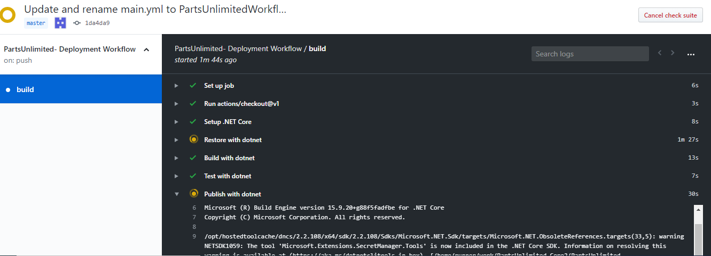

1. Workflow status details
    
    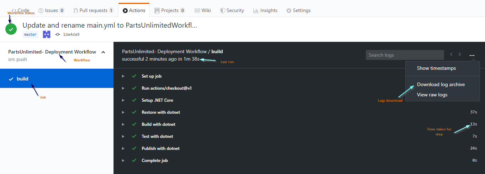


Now you have created a GitHub workflow to Build, Test and Publish your .Net core application on every push.


## Task 2: Configure deployment credentials (Azure) in GitHub secrets

Once the build is a success, we would like to deploy the application to Azure App services. For any credentials like Azure Service Principal, Publish Profile etc we need to add them as [secrets](https://help.github.com/en/articles/virtual-environments-for-github-actions#creating-and-using-secrets-encrypted-variables) in the GitHub repository and then use them in the workflow.

1. Navigate to [Azure Portal](https://portal.azure.com).

1. Launch the [Azure Cloud Shell](https://docs.microsoft.com/en-in/azure/cloud-shell/overview) from the Azure portal and choose Bash.

1. Create a Resource Group. Replace `<region>` with the region of your choosing, for example, eastus.

    ```bash
    az group create --name MyResourceGroup --location <region>
    ```

1. Run the below [az cli](https://docs.microsoft.com/en-us/cli/azure/?view=azure-cli-latest) command to create Azure Service Principal for deployment. Replace `{subscriptionid}` and `{resource-group}` with your Azure subscription id and Resource group name which you created above.

   ```bash  

   az ad sp create-for-rbac --name "myApp" --role contributor \
                            --scopes /subscriptions/{subscription-id}/resourceGroups/{resource-group} \
                            --sdk-auth
   ```
1. The command should output a JSON object as shown in the below image. Copy the JSON output to notepad.

    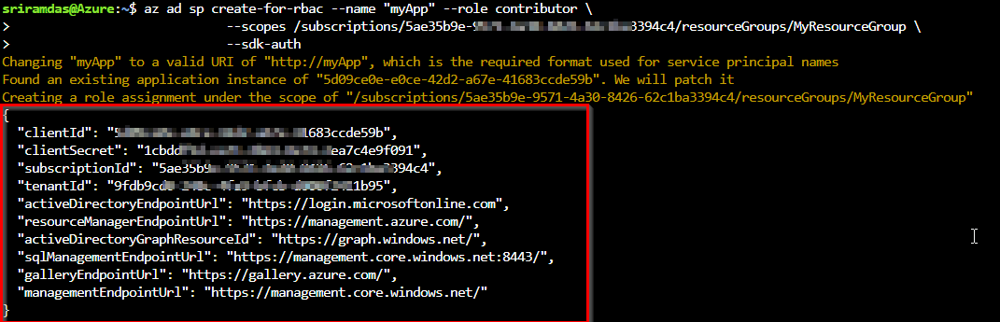

1. Now navigate to your GitHub repository. Select repository **Settings**.

   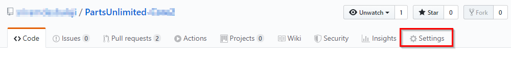

1. Select **Secrets** and click on **Add a new Secret**
    
    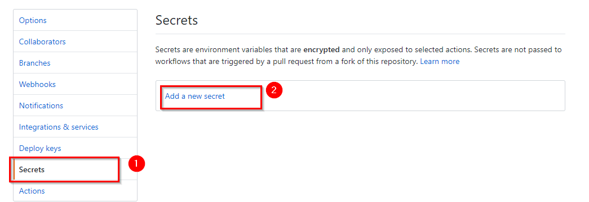

1. Enter the secret name as **AzureCredentials** and paste the JSON output we copied earlier in **Value**. Click on **Add Secret**.

    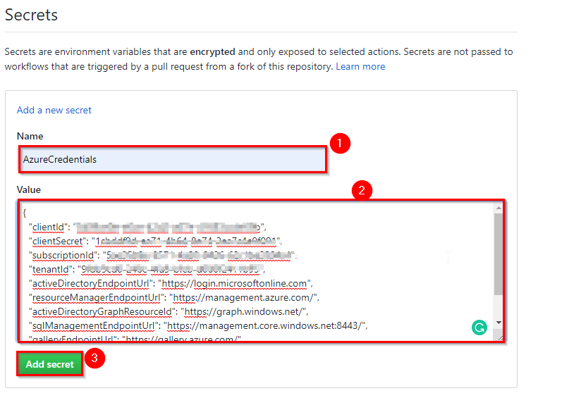

## Task 3: Automate the deployment to Azure

Let's update the workflow to create and update the application Azure App service.

1. Open the file `.github/workflows/PartsUnlimitedWorkflow.yml` from your repository to update.

1. Copy the below yaml snippet at end of the file.

   ```yaml
    - uses: azure/actions/login@master

      with:

        creds: ${{ secrets.AzureCredentials }}
    - name: Create or Update Resources
      run: |
           az appservice plan create --resource-group MyResourceGroup --name MyappservicePlan --sku S1
           az webapp create --resource-group MyResourceGroup --plan MyappservicePlan --name PartsUnlmitedWeb2610
    - name: 'Run Azure webapp deploy action'
      uses: azure/webapps-deploy@v1
      with: 
        app-name: PartsUnlmitedWeb2610 # Replace with your app name
        package: './src/PartsUnlimitedWebsite/bin/Release/netcoreapp2.0/publish/'
       
      ```

      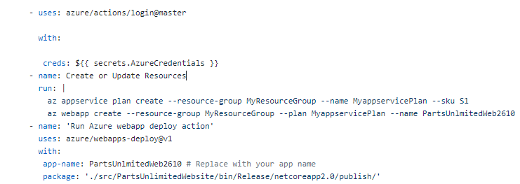
1. Let's get into the details of the above YAML snippet.

   -  **Azure login action to run `az cli`**: We are using [GitHub Azure Actions](https://github.com/Azure/actions/blob/master/README.md) to login to Azure with the credentials stored in GitHub secrets which you created in the previous task.

       ```yaml
        - uses: azure/actions/login@master

          with:

            creds: ${{ secrets.AzureCredentials }}
       ```
    - **Create Azure Resources**: And then we are trying to create an Azure App Service plan and an Azure Web App to deploy our application by running `az cli` commands.
       
       ```yaml

       - name: Create or Update Resources
      run: |
           az appservice plan create --resource-group MyResourceGroup --name MyappservicePlan --sku S1

           az webapp create --resource-group MyResourceGroup --plan MyappservicePlan --name PartsUnlmitedWeb2610
        ```
      > Use the same resource group which you created in previous exercise step3 and Web App name should be unique.

      > Azure CLI won't create the resources if they already exist.

    - **Deploy the application**: Using [GitHub Action for deploying to Azure Web App](https://github.com/Azure/webapps-deploy), we will deploy the application to Azure Web App.

      ```yaml
        - name: 'Run Azure webapp deploy action'
        uses: azure/webapps-deploy@v1
        with: 
        app-name: PartsUnlmitedWeb2610 # Replace with your app name
        package: './src/PartsUnlimitedWebsite/bin/Release/netcoreapp2.0/publish/'
      ```
1. Now your complete `PartsUnlimitedWorkflow.yml` will look like below

     ```yaml
     name: PartsUnlimited- Deployment Workflow

     on: [push]

     jobs:
         build:
           runs-on: ubuntu-latest
           steps:
            - uses: actions/checkout@v1
            - name: Setup .NET Core
              uses: actions/setup-dotnet@v1
              with:
                dotnet-version: 2.2.108
            - name: Restore with dotnet
              run: dotnet restore
            - name: Build with dotnet
              run: dotnet build
            - name: Test with dotnet
              run: dotnet test
            - name: Publish with dotnet
              run: dotnet publish -c release
        
            - uses: azure/actions/login@master

              with:

                creds: ${{ secrets.AzureCredentials }}
            - name: Create or Update Resources
              run: |
                az appservice plan create --resource-group MyResourceGroup --name MyappservicePlan --sku S1
                az webapp create --resource-group MyResourceGroup --plan MyappservicePlan --name PartsUnlmitedWeb2610
            - name: 'Run Azure webapp deploy action'
              uses: azure/webapps-deploy@v1
              with: 
                app-name: PartsUnlmitedWeb2610 # Replace with your app name
                package: './src/PartsUnlimitedWebsite/bin/Release/netcoreapp2.0/publish/'
      ```

1. Click on **Start Commit** to push the changes. Since the workflow is configured to trigger on push events, your workflow will be queued when commit is done. 

     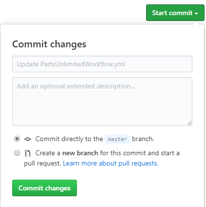

1. Once you commit the changes navigate back to **Actions** tab. You would see workflow is queued. Wait for the job to complete successfully.

    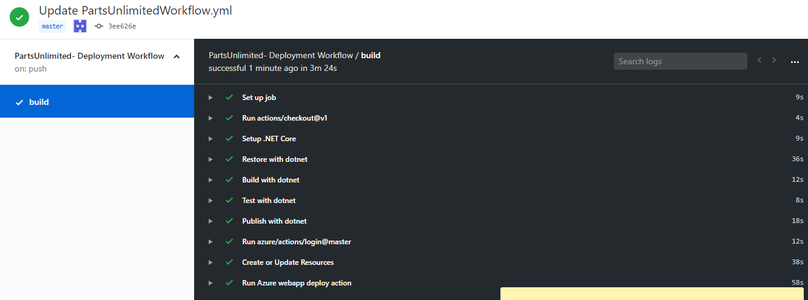

1. Now navigate to your Azure portal. You will see an Azure App Service plan and Azure Web App are created in the resource group.

     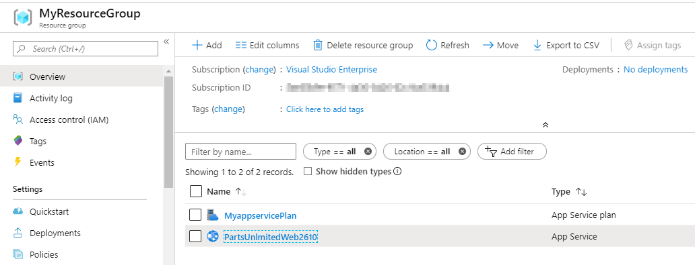

1. Select the Azure web app and browse to view the application deployed. 

     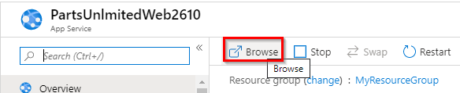

   Your application looks like below

     
