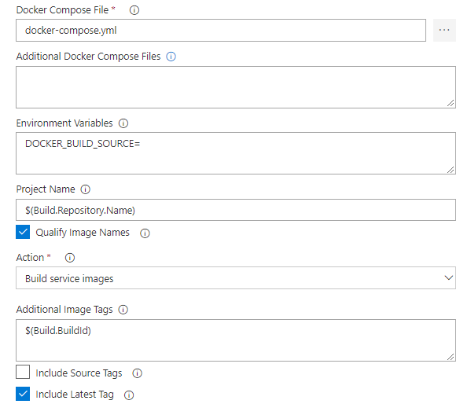

## Overview

[**Azure Kubernetes Service (AKS)**](https://azure.microsoft.com/en-us/services/container-service/){:target="_blank"} is the quickest way to use Kubernetes on Azure. AKS provides capabilities to deploy and manage Docker containers using Kubernetes. With AKS, customers automatically get the benefits of the open source Kubernetes without the complexity and the operational overhead. Azure DevOps helps in creating Docker images for faster deployments and reliability using the continuous build option.

One of the biggest advantage to use AKS is that instead of creating resources in cloud you can create resources and infrastructure inside Azure Kubernetes Cluster through Deployments and Services manifest files.

### Lab Scenario

This lab uses a Docker-based ASP.NET Core web application - **MyHealthClinic** and is deployed to a **Kubernetes** cluster running on **Azure Container Service (AKS)** using **Azure DevOps**.There is a  **mhc-aks.yaml** manifest file which consists of definitions to spin up Deployments and Services such as **Load Balancer** in the front and **Redis Cache** in the backend. The MHC application will be running in the mhc-front pod along with the Load Balancer.

If you are new to Kubernetes, [click here](documentation/readme.md){:target="_blank"} for description of terminology used in this lab.

### What's covered in this lab

The following tasks will be performed:

* Create an Azure Container Registry (ACR), AKS and Azure SQL server

* Provision the Azure DevOps Team Project with a .NET Core application using the Azure DevOps Demo Generator tool.

* Configure application and database deployment, using Continuous Deployment (CD) in the Azure DevOps

* Initiate the build to automatically deploy the application

## Before you begin

1. Refer the [Getting Started](../Setup/) page to know the prerequisites for this lab.

1. Click the [Azure DevOps Demo Generator](http://azuredevopsdemogenerator.azurewebsites.net/?TemplateId=77372&Name=AKS) link and follow the instructions in [Getting Started](../Setup/) page to provision the project to your **Azure DevOps**.

## Preparing the user machine

This lab requires all the pre-requisite executables to be installed and configured in an **Administrator** mode on the user machine. 

**Note**: If you do not have the administrative privileges on your machine, it is suggested to create a Windows Virtual Machine (VM) on Azure and follow the exercises in the VM.

1. Spin up a [Windows virtual machine on Azure](https://portal.azure.com/#create/Microsoft.WindowsServer2016Datacenter-ARM){:target="_blank"}.

1. Disable the Internet Explorer Enhanced Configuration to allow download of the rest of the pre-requisite tools.

1. Enable the [JavaScript](https://support.microsoft.com/en-in/help/3135465/how-to-enable-javascript-in-windows){:target="_blank"} to allow required lab specific features on the webpage.

1. Download and install the [Git Bash](https://git-scm.com/downloads){:target="_blank"} on the Azure VM.

1. Install  [Azure CLI version 2.0.45](https://azurecliprod.blob.core.windows.net/msi/azure-cli-2.0.45.msi){:target="_blank"} on the Azure VM.

   

1. Download the [KubeCtl](https://storage.googleapis.com/kubernetes-release/release/v1.9.0/bin/windows/amd64/kubectl.exe){:target="_blank"}, and make sure the path of **kubectl.exe** is included in the [PATH Environment Variable](https://msdn.microsoft.com/en-us/library/office/ee537574(v=office.14).aspx){:target="_blank"} of the lab machine.

   

1. Follow the below instructions to create a pair of SSH RSA public & private keys which will be used in the next exercise.
    1. Open the **Git Bash**, type the command `ssh-keygen -t rsa` and press the **Enter** button.
    2. Provide the following values:
        * **File path** : Path to which the generated key file should be saved. Leave it blank to save the file to default path.
        * **Passphrase** : Provide a passphrase or leave it blank for an empty passphrase.
    3. Access the path where the keys are generated. The contents of the public key **id_rsa.pub** is required for setting up the environment.

1. Type **az login** in the command prompt and press Enter. Authorize your login in the browser.

     1. Type **az ad sp create-for-rbac -n "MySampleApp" -p P2SSWORD** in the command prompt to get the Service Principal Client and the Service Principal Client Secret.

     * Copy appId which is the **Service Principal Client ID**

     * P2SSWORD is the **Service Principal Client Secret**. Both will be required for the next exercise. (keep this window open)

         

## Setting up the environment

The following azure resources need to be configured for this lab:

|Azure resources | Description|
|----------------|------------|
| Azure Container Registry | Used to store the Docker images privately|
| AKS | Docker images are deployed to Pods running inside AKS|
| Azure SQL Server | SQL Server on Azure to host database|

1. Select the **Deploy to Azure** button (or right click and select the ***Open in new tab*** option) to spin up **Azure Container Registry**, **Azure Container Service (AKS)** and **Azure SQL Server**. Enter required details for the below fields, agree to the ***Terms and Conditions***, and then Select the **Purchase** button.

   

   

   

    * Subscription
    * Resource Group
    * Location
    * Acr Name 
    * DB Server Name
    * AKS Name
    * DNS Prefix
    * SSH RSA Public Key
    * Service Principal Client
    * Service Principal Client Secret

   {:target="_blank"}

   

   

1. It takes about 5 minutes to provision the environment. Once the deployment succeeds, a notification is displayed in the Azure portal. Select the **Go to resource group** button.

   

1. The following components - **Storage account**, **Container Registry**, **Container Service**, **SQL Server** along with **SQL Database** are deployed. Access each of these components individually and make a note of the details which will be used in Exercise 1.

   

1. Select the **mhcdb** SQL database and make a note of the **Server name**.

   

1. Navigate to the resource group, select the created container registry and make a note of the **Login server** name.

    

Since all the required azure components are now created, the Azure DevOps team project can be created.

## Exercise 1: Configure Build and Release pipeline

Make sure that you have created the AKS project in your Azure DevOps account through [Azure DevOps Demo Generator](http://azuredevopsdemogenerator.azurewebsites.net/?TemplateId=77372&Name=AKS) (as mentioned in pre-requisites). We will manually map Azure resources such as AKS and Azure Container Registry to the build and release definitions.

1. Select **Builds** section under the **Pipelines** hub and **Edit** the build definition **MyHealth.AKS.Build**.

   

1. In **Run services** section, under the **Tasks** tab select your Azure subscription from **Azure subscription** dropdown. Click **Authorize**.

    

    You will be prompted to authorize this connection with Azure credentials. Disable pop-up blocker in your browser if you see a blank screen after clicking the OK button, and please retry the step.

     This creates an **Azure Resource Manager Service Endpoint**, which defines and secures a connection to a Microsoft Azure subscription, using Service Principal Authentication (SPA). This endpoint will be used to connect **Azure DevOps** and **Azure**.

     

1. Select appropriate values from the dropdown - **Azure subscription** and **Azure Container Registry** as shown. Repeat this for the Build services, Push services and Lock services. Click on the **Variables** tab.

    

    

    |Tasks|Usage|
    |-----|-----|
    |**Replace tokens**| replace ACR in **mhc-aks.yaml** and database connection string in **appsettings.json**|
    | **Run services**| prepares suitable environment by pulling required image such as aspnetcore-build:1.0-2.0 and restoring packages mentioned in **.csproj**|
    | **Build services**| builds the docker images specified in a **docker-compose.yml** file and tags images with **$(Build.BuildId)** and **latest**|
    | **Push services**| pushes the docker image **myhealth.web** to Azure Container Registry|
    | **Publish Build Artifacts**| publishes **mhc-aks.yaml** & **myhealth.dacpac** files to artifact drop location in Azure DevOps so that they can be utilized in Release Definition|

    **applicationsettings.json** file contains details of the database connection string used to connect to Azure database which was created in the beginning of this lab.
    
    **mhc-aks.yaml** manifest file contains configuration details of **deployments**, **services** and **pods** which will be deployed in Azure Kubernetes Service.

1. Update **ACR** and **SQLserver** values for **Pipeline Variables** with the details noted earlier while configuring the environment. Select the **Save** button.

    

1. Navigate to the **Release** section under the **Build & Release** menu, **Edit** the release definition **MyHealth.AKS.Release** and select **Tasks**.

   

   

1. In the **Dev** environment, under the **DB deployment** phase, select **Azure Resource Manager** from the drop down for **azure service connection type**,  update the **Azure Subscription** value from the dropdown for **Execute Azure SQL: DacpacTask** task.

    

1. In the **AKS deployment** phase, under the **Create Deployments & Services in AKS** task, update the **Azure Subscription**, **Resource Group** and **Kubernetes cluster** from the dropdown. Expand the **Secrets** section and update the parameters for **Azure subscription** and **Azure container registry** from the dropdown. Repeat similar steps for **Update image in AKS** task.

    

    

    * **Create Deployments & Services in AKS** will create the deployments and services in AKS as per the configuration specified in **mhc-aks.yaml** file. The Pod, for the first time will pull up the latest docker image.

    * **Update image in AKS** will pull up the appropriate image corresponding to the BuildID from the repository specified, and deploys the docker image to the **mhc-front pod** running in AKS.

    * A secret called **mysecretkey** is created in AKS cluster through Azure DevOps by using command *kubectl create secret* in the background. This secret will be used for authorization while pulling myhealth.web image from the Azure Container Registry.

1. Select the **Variables** section under the release definition, update **ACR** and **SQLserver** values for **Pipeline Variables** with the details noted earlier while configuring the environment. Select the **Save** button.

   

   

## Exercise 2: Trigger a Build and deploy application

In this exercise, let us trigger a build manually and upon completion, an automatic deployment of the application will be triggered. Our application is designed to be deployed in the pod with the **load balancer** in the front-end and **Redis cache** in the back-end.

1. Click on **Pipelines** tab and select the **Queue** button under **Builds** section.

    

1. Once the build process starts, select the build number to see the build in progress.

    

    

1. The build will generate and push the docker image to ACR. After the build is completed, you will see the build summary. To view the generated images in the Azure Portal, select the **Azure Container Registry** and navigate to the **Repositories**.

    

1. Switch back to the Azure DevOps portal. Select the **Release** tab in the **Pipelines** section and double-click on the latest release. Select **In progress** link to see the live logs and release summary.

    

    

1. Once the release is complete, launch the command prompt with Administrator privilege and run the below commands to see the pods running in AKS:

    1. Type **`az login`** in the command prompt and press Enter. Authorize your login by providing your credentials.

         

    1. Type **`az aks get-credentials --resource-group yourResourceGroup --name yourAKSname`** in the command prompt to get the access credentials for the Kubernetes cluster. Replace the variables `yourResourceGroup` and `yourAKSname` with the actual values.

         

    1. **`kubectl get pods`**

        

        The deployed web application is running in the displayed pods.

1. To access the application, run the below command. If you see that **External-IP** is pending, wait for sometime until an IP is assigned.

    **`kubectl get service mhc-front --watch`**

    

1. Copy the **External-IP** and paste it in the browser and press the Enter button to launch the application.

    

    **Access AKS through the browser**
    Type the below command in the command prompt to access the AKS through the browser.

    **`az aks browse --resource-group <yourResourceGroup> --name <yourAKSname>`**

    

    **AKS Dashboard:**
    Once the AKS dashboard is launched, the following details will be displayed.

    

    **Note**: Under Release Definition, you can optionally disable **Execute Azure SQL: DacpacTask** and **Create Deployments & Services in AKS** tasks as they are required to run only once in the beginning.

## Summary

AKS reduces the complexity and operational overhead of managing a Kubernetes cluster by offloading much of that responsibility to the Azure. With **Azure DevOps** and **Azure Container Services (AKS)**, we can build DevOps for dockerized applications by leveraging docker capabilities enabled on Azure DevOps Hosted Agents.
