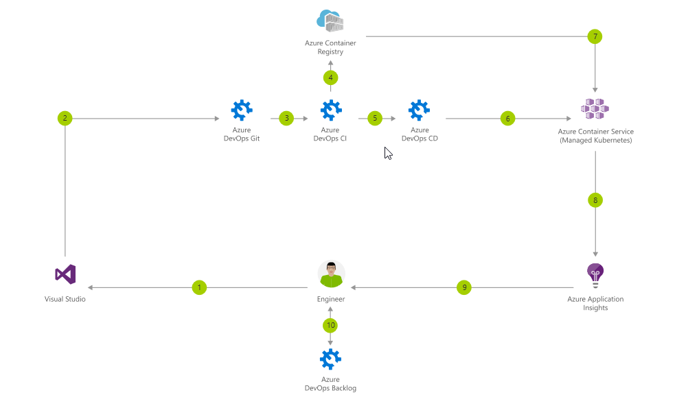
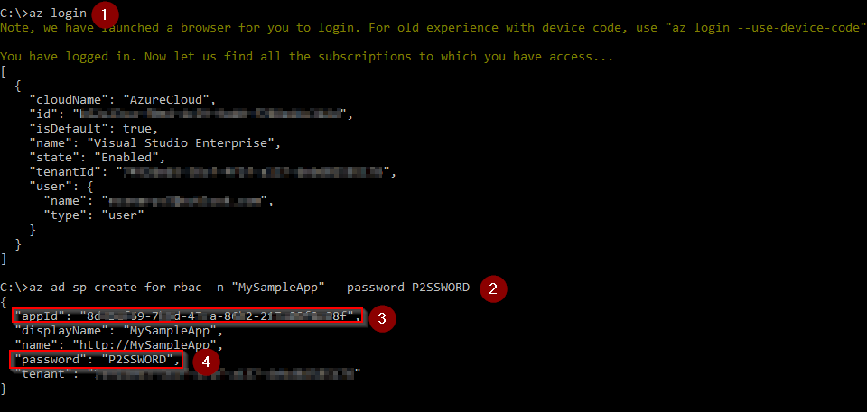
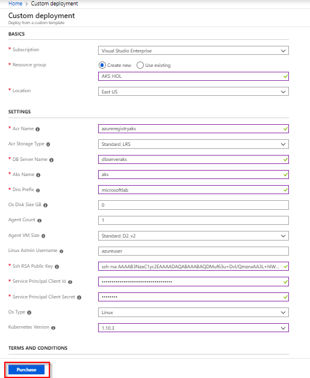
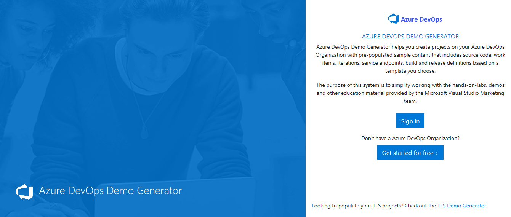
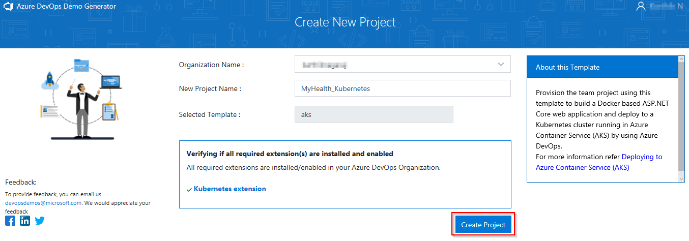
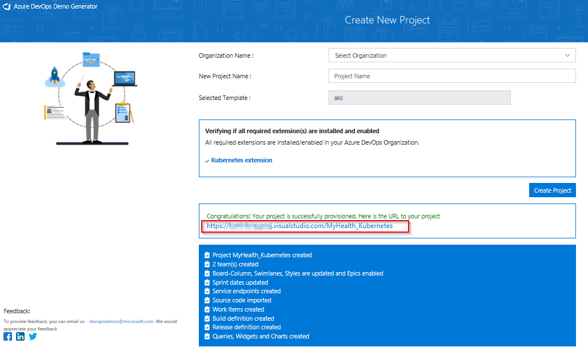
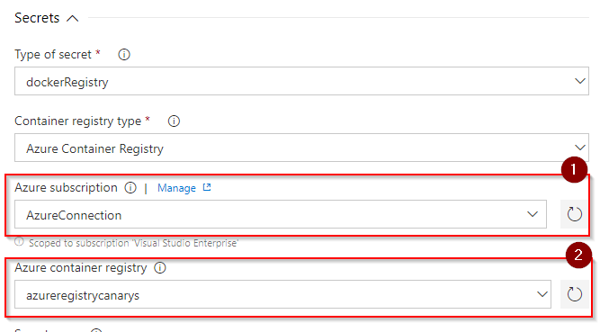

Last updated : {{ "now" | date: "%b %d, %Y" }}.

## Overview

This lab outlines the process, to compile a Docker-based ASP.NET Core web application and deploy it to a **Kubernetes** cluster running on **Azure Container Service (AKS)** using **Azure DevOps**.

[**Azure Kubernetes Service (AKS)**](https://azure.microsoft.com/en-us/services/container-service/){:target="_blank"} is the quickest way to use Kubernetes on Azure. AKS provides capabilities to deploy and manage Docker containers using Kubernetes, Docker Swarm and Mesosphere DC/OS orchestrators. With AKS, customers automatically get the benefits of the open source Kubernetes without the complexity and the operational overhead. Azure DevOps helps in creating the application container Docker images for faster deployments, reliably using the continuous build option.

Below are the description for the terminolgy used in the lab document to help you get started:

[**Docker**](https://www.docker.com/){:target="_blank"}: Docker is a software technology, that provides operating-system-level virtualization to easily deploy applications in a sandbox (called containers) to run on Linux.

[**Images**](https://docs.docker.com/engine/docker-overview/#docker-objects){:target="_blank"}: An image is a read-only template, with the necessary instructions required for the application to run.

[**Containers**](https://docs.docker.com/engine/docker-overview/#docker-objects){:target="_blank"}: Provides an isolated environment in which an app along with its environment is being run.

[**Kubernetes**](https://kubernetes.io/){:target="_blank"}: Kubernetes is an open source system for managing containerized applications across multiple hosts, providing basic mechanisms for deployment, maintenance, and scaling of applications.

[**Pods**](https://kubernetes.io/docs/concepts/workloads/pods/pod/){:target="_blank"}: A Pod is the basic building block of Kubernetes and represents a executable unit of work. A Pod usually contains a single container.

[**Services**](https://kubernetes.io/docs/concepts/services-networking/service/){:target="_blank"}: A service tells other pods about the services your application provides.

[**Deployments**](https://kubernetes.io/docs/concepts/workloads/controllers/deployment/){:target="_blank"}: A Deployment controller provides declarative updates for Pods

[**Kubernetes Manifest file**](https://kubernetes.io/docs/reference/kubectl/cheatsheet/){:target="_blank"}: Kubernetes manifests with deployments, whereas services and pods can be defined in json or yaml. The file extensions .yaml, .yml, and .json can be used.

### What's covered in this lab

In this lab, the following tasks will be performed:

* Create an Azure Container Registry (ACR), AKS and Azure SQL server

* Provision the Azure DevOps Team Project with a .NET Core application using the [Azure DevOps Demo Generator](https://Azure DevOpsdemogenerator.azurewebsites.net/?Name=aks&templateId=77372){:target="_blank"} tool

* Configure endpoints (properties) in Azure DevOps to access Azure and AKS

* Configure application and database deployment, using Continuous Deployment (CD) in Azure DevOps

* Modify database connection string & ACR configuration in the source code

* Initiate the build to automatically deploy the application

## Reference Architecture

The below diagram details the Azure DevOps workflow with Azure Container Service with AKS:

{:target="_blank"}

* First, the source code changes are committed to the Azure DevOps git repository

* Azure DevOps will create the custom Docker image **myhealth.web** and push the image tagged with the build ID to the ACR. Subsequently it will publish the [Kubernetes deployment YAML file](https://kubernetes.io/docs/concepts/workloads/controllers/deployment/){:target="_blank"} as a build artifact.

* Azure DevOps will deploy **mhc-front** and **mhc-back** services into the Kubernetes cluster using the YAML file.

  

* The Kubernetes cluster will then pull the **myhealth.web** image from the ACR into the [Pods](https://kubernetes.io/docs/concepts/workloads/pods/pod/){:target="_blank"} and complete the deployment file instructions
* The myhealth.web application will be accessible through a browser, once the deployment is successfully completed

You can read the full specification of the architecture [here](https://azure.microsoft.com/en-in/solutions/architecture/continuous-integration-deployment-containers/){:target="_blank"}

## Pre-requisites for the lab

1. Refer the [Getting Started](../Setup/) page to know the prerequisites for this lab.

1. Click the [Azure DevOps Demo Generator](http://azuredevopsdemogenerator.azurewebsites.net/?TemplateId=77372&Name=Aks) link and follow the instructions in [Getting Started](../Setup/) page to provision the project to your **Azure DevOps**.

## Preparing the user machine

This lab requires all the pre-requisite executables to be installed and configured in an **Administrator** mode on the user machine. If the administrative privileges are not available on the user machine, it is suggested to create a Windows Virtual Machine (VM) on Azure and follow the exercises in the VM.

1. Spin up a [Windows virtual machine on Azure](https://portal.azure.com/#create/Microsoft.WindowsServer2016Datacenter-ARM){:target="_blank"}.

1. Disable the [Internet Explorer Enhanced Configuration](https://support.microsoft.com/en-in/help/815141/internet-explorer-enhanced-security-configuration-changes-the-browsing){:target="_blank"} to allow download of the rest of the pre-requisite tools.

1. Enable the [JavaScript](https://support.microsoft.com/en-in/help/3135465/how-to-enable-javascript-in-windows){:target="_blank"} to allow required lab specific features on the webpage.

1. Download and install the [Git Bash](https://git-scm.com/downloads){:target="_blank"} on the Azure VM.

1. Install  [Azure CLI version 2.0.45](https://azurecliprod.blob.core.windows.net/msi/azure-cli-2.0.45.msi){:target="_blank"} on the Azure VM.

   

1. Download the [KubeCtl](https://storage.googleapis.com/kubernetes-release/release/v1.9.0/bin/windows/amd64/kubectl.exe){:target="_blank"}, and make sure the path of **kubectl.exe** is included in the [PATH Environment Variable](https://msdn.microsoft.com/en-us/library/office/ee537574(v=office.14).aspx){:target="_blank"} of the lab machine.

   

1. Follow the below instructions to create a pair of SSH RSA public & private keys which will be used in the next exercise.
    1. Open the **Git Bash**, type the command `ssh-keygen -t rsa` and press the **Enter** button.
    2. Provide the following values:
        * **File path** : Path to which the generated key file should be saved. Leave it blank to save the file to default path.
        * **Passphrase** : Provide a passphrase or leave it blank for an empty passphrase.
    3. Access the path where the keys are generated. The contents of the public key **id_rsa.pub** is required for setting up the environment.

1. Type **az login** in the command prompt and press Enter. Authorize your login in the browser.

     1. Type **az ad sp create-for-rbac -n "MySampleApp" --password P2SSWORD** in the command prompt to get the Service Principal Client and Service Principal Client Secret.

     * Copy appId which is the Service Principal Client

     * P2SSWORD is the Service Principal Client Secret. Both will be required for the next exercise. (keep this window open)

         

## Setting up the environment

The following azure resources need to be configured for this lab:

|Azure resources | Description|
|----------------|------------|
| Azure Container Registry | Used to store the Docker images privately|
| AKS | Docker images are deployed to Pods running inside AKS|
| SQL Server | SQL Server to host database|

1. Click on the **Deploy to Azure** button (or right click and select the ***Open in new tab*** option) to spin up **Azure Container Registry**, **Azure Container Service (AKS)** and **Azure SQL Server**. Enter required details for the below fields, agree to the ***Terms and Conditions***, and then click on the **Purchase** button.

   

    * Subscription
    * Resource Group
    * Location
    * Acr Name
    * DB Server Name
    * AKS Name
    * DNS Prefix
    * SSH RSA Public Key
    * Service Principal Client
    * Service Principal Client Secret

   {:target="_blank"}

   

   

1. It takes about 5 minutes to provision the environment. Once the deployment succeeds, a notification is displayed in the Azure portal. Click on the **Go to resource group** button.

   

1. The following components - **Storage account**, **Container Registry**, **Container Service**, **SQL Server** along with **SQL Database** are deployed. Access each of these components individually and make a note of the details to be used in Exercise 2.

   

1. Click on the **mhcdb** SQL database and make a note of the **Server name**.

   

1. Navigate back to the resource group, click on the created container registry and make a note of the **Login server** name.

    

1. Switch back to the resource group. Click on the container service and make a note of the **API server address**.

   

Since all the required azure components are now created, the Azure DevOps team project can be created.

## Setting up the Azure DevOps team project

1. Use the [Azure DevOps Demo Generator](https://azuredevopsdemogenerator.azurewebsites.net/?templateId=77372&Name=aks){:target="_blank"} to provision the project on your Azure DevOps account. Click **Sign In** to authorize and **Accept** permissions.

   > **Azure DevOps Demo Generator** helps you create the team projects on your Azure DevOps account, with sample content that include source code, work items, iterations, service endpoints, build and release definitions based on the template you choose during the configuration.

    

1. Select an **Organization Name** and provide a **New Project Name**. Click on the **Create Project** button.

   

1. Once the project is provisioned, click on the link displayed under the **URL** field to navigate to the project.

   

## Exercise 1: Service connection creation

Service endpoints are a bundle of properties securely stored by the Azure DevOps and is a way for Azure DevOps to connect to the external systems or services.

Since the connections are not established during project provisioning, the endpoint - **Azure Resource Manager** needs to be created manually.

1. **Azure Resource Manager Service Endpoint**: Defines and secures a connection to a Microsoft Azure subscription, using Service Principal Authentication (SPA).

   * In the Azure DevOps, navigate to the **Project Settings** and click on **Service connections** followed by  **+ New service connection** button. Select the **Azure Resource Manager** and specify the **Connection name**, select the **Subscription** from the dropdown and click on the **OK** button. This endpoint will be used to connect the **Azure DevOps** and the **Azure**.

     You will be prompted to authorize this connection with Azure credentials. Disable pop-up blocker in your browser if you see a blank screen after clicking the OK button, and please retry the step.

     

     

## Exercise 2: Configure Build and Release definitions

Now that the connection is established, we will manually map the created Azure endpoint, AKS and Azure Container Registry to the build and release definitions.



1. Select the **Builds** section under the **Pipelines** hub and **Edit** the build definition **MyHealth.AKS.Build**.

   

1. In **Run services** section under the **Tasks** tab, select the previously created endpoints from the dropdown for the parameters - **Azure subscription** and **Azure Container Registry** as shown. Repeat this for the Build services, Push services and Lock services. Click the **Variables** tab.

    

    |Tasks|Usage|
    |-----|-----|
    | **Run services**| prepares the suitable environment by restoring required packages|
    | **Build services**| builds the docker images specified in a **docker-compose.yml** file with registry-qualified names and additional tags such as **$(Build.BuildId)**|
    | **Push services**| pushes the docker images specified in a **docker-compose.yml** file, to the container registry|
    | **Publish Build Artifacts**| publishes the **myhealth.dacpac** file to Azure DevOps|

    The **applicationsettings.json** file contains details of database connection string used to connect with Azure database which was created in the beginning of this lab.
    
    The **mhc-aks.yaml** manifest file, contains configuration details of **deployments**, **services** and **pods** which will be deployed in Azure Kubernetes Service.

1. Update **ACR** and **SQLserver** values for **Pipeline Variables** with the details noted earlier while configuring the environment. Click on the **Save** button.

    

1. Navigate to the **Releases** section under the **Build & Release** menu, **Edit** the release definition **MyHealth.AKS.Release** and select **Tasks**.

   

   

1. In the **Dev** environment, under the **DB deployment** phase, update the **Azure Subscription** value from the dropdown for **Execute Azure SQL: DacpacTask** task.

    

1. In the **AKS deployment** phase, Under the **Create Deployments & Services in AKS** task, update the **Azure Subscription**, **Resource Group** and **Kubernetes cluster** value from the dropdown. Expand the **Secrets** section and update the parameters - **Azure subscription** and  **Azure Container Registry** with the endpoint components from the dropdown.

1. Repeat similar steps for **Update image in AKS** task.

    

    

    * **Create Deployments & Services in AKS** will create the deployments and services in AKS as per the configuration specified in **mhc-aks.yaml** file. The Pod, for the first time will pull up the latest docker image.

    * **Update image in AKS** will pull up the appropriate image corresponding to the BuildID from the repository specified, and deploys the docker image to the **mhc-front pod** running in AKS.

1. Click on the **Variables** section under the release definition, update **ACR** and **SQLserver** values for **Pipeline Variables** with the details noted earlier while configuring the environment. Click on the **Save** button.

   

   

## Exercise 3: Trigger a Build and deploy application

In this exercise, let us trigger a build manually and upon completion, an automatic deployment of the application will be triggered. Our application is designed to be deployed in the pod with the **load balancer** in the front-end and **Redis cache** in the back-end.

1. Click **Pipelines** tab and click on the **Queue** button.

    

1. Once the build process starts, click on the build number to see the build in progress.

    

    

1. The build will generate and push the docker image to ACR. After the build is completes, you will see the build summary. To view the generated images in the Azure Portal, click on the **Azure Container Registry** and navigate to the **Repositories**.

    

1. Switch back to the Azure DevOps portal. Click on the **Releases** tab in the **Pipelines** section and double-click on the latest release. Click on **In progress** link to see the live logs and release summary.

    

    

1. Once the release is complete, launch the command prompt with Administrator privilege and run the below commands to see the pods running in AKS:

    1. Type **`az login`** in the command prompt and hit Enter. Authorize your login by providing your credentials.

         

    1. Type **`az aks get-credentials --resource-group yourResourceGroup --name yourAKSname`** in the command prompt to get the access credentials for the Kubernetes cluster.

         

    1. **`kubectl get pods`**

        

        The deployed web application is running in the displayed pods.

1. To access the application, run the below command. If you see that **External-IP** is pending, wait for sometime until an IP is assigned.

    **`kubectl get service mhc-front --watch`**

    

1. Copy the **External-IP** and paste it in the browser and press the Enter button to launch the application.

    

    **Access AKS through the browser**
    Type the below command in the command prompt to access the AKS through the browser.

    **`az aks browse --resource-group <yourResourceGroup> --name <yourAKSname>`**

    

    **AKS Dashboard:**
    Once the AKS dashboard is launched, the following details will be displayed.

    

## Summary

AKS reduces the complexity and operational overhead of managing a Kubernetes cluster by offloading much of that responsibility to Azure. With **Azure DevOps** and **Azure Container Services (AKS)**, we can build DevOps for dockerized applications by leveraging docker capabilities enabled on Azure DevOps Hosted Agents.
