<div class="rw-ui-container"></div>

## Overview

[**LaunchDarkly**](https://launchdarkly.com/) is a continuous delivery platform that provides feature flags as a service and allows developers to iterate quickly and safely. LaunchDarkly gives you the power to separate feature rollout from code deployment and manage feature flags at scale. With the integration of LaunchDarkly with Azure DevOps services allow developers to release confidently with less risk. You can tie feature flag roll-outs to Azure DevOps work items to get complete control over who sees what when. By managing feature flags in the context of Azure DevOps release pipelines, unlock the true power of DevOps.

### What’s covered in this lab

In this lab, you will learn 

1. How to implement a very simple feature flag for an ASP.NET MVC application.
1. How to integrate LaunchDarkly with Azure DevOps 
1. How to roll-out LaunchDarkly feature flags in Azure DevOps release pipelines

### Before you begin

1. Refer the [Getting Started](../Setup/) page before you begin following the exercises.
1. **LaunchDarkly account**: You will need a LaunchDarkly account. If you don't have one sign up for a trial account [here](https://launchdarkly.com).

1. Visual Studio 2017 version 15.4 or later with [.Net Core SDK](https://www.microsoft.com/net/learn/get-started/windows#windows) installed.

1. Use the [Azure DevOps Demo Generator](https://azuredevopsdemogenerator.azurewebsites.net/?TemplateId=77381&Name=LaunchDarkly) to provision the project on your Azure DevOps organization.
   This URL will automatically select **LaunchDarkly** template in the demo generator. If you want to try other projects, use this URL instead -https://azuredevopsdemogenerator.azurewebsites.net/

   Follow the [simple walkthrough](https://docs.microsoft.com/en-us/azure/devops/demo-gen/use-vsts-demo-generator-v2?view=vsts) to know how to use the Azure DevOps Demo Generator.

## Exercise 1: Create a Feature Flag in LaunchDarkly

1. Sign in to your [LaunchDarkly](https://app.launchdarkly.com/) account. You’re then taken to the portal where you can create your first Feature Flag. Click    

   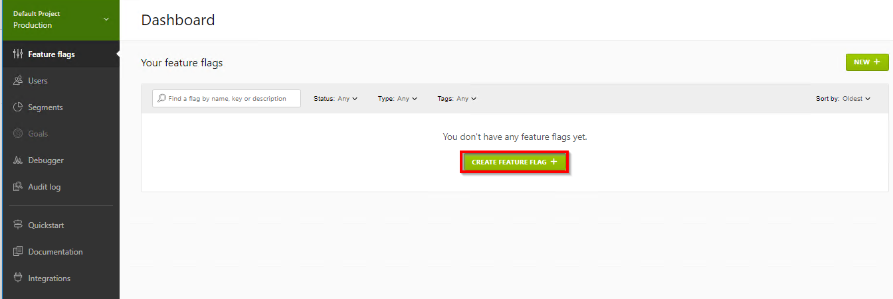

1. In the Create a feature flag window enter **Member Portal** as feature flag name and click **Save Flag** 

    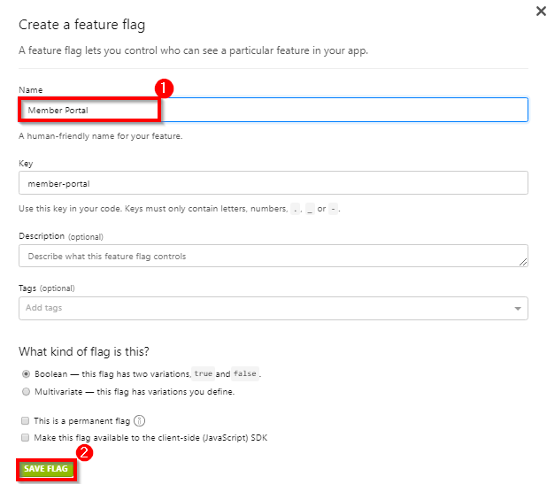

1. You’ve created a flag named **Member Portal**. Assume that you want to use this flag to determine the visibility of the **Member Portal** feature in your ASP.NET MVC web app. Now your dashboard looks as below
   
   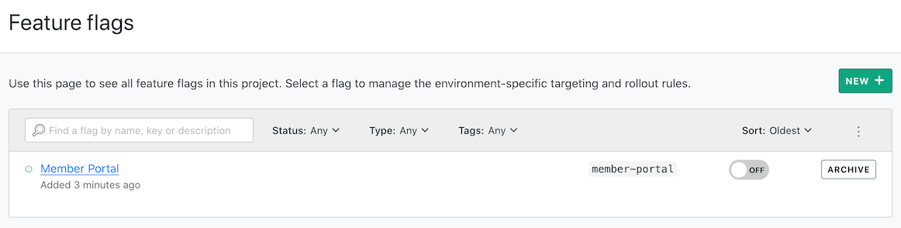

1. To integrate LaunchDarkly into your application, you need an SDK key. If you go the **Account settings** in the portal, you see that there are two predefined environments: production and test.  You can use the production environment SDK key for this project. Copy SDK key and paste it into your notepad. You need this in the following exercise.

   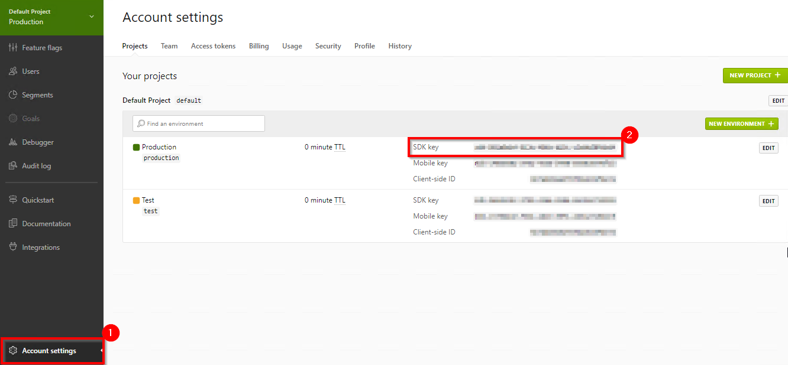

## Exercise 2: Integrate LaunchDarkly in your Web application
   1. Make sure **Commit mention linking** toggle is **On** in your Azure DevOps services project as shown below. This will automatically create links for work items mentioned in a commit comment.
      
       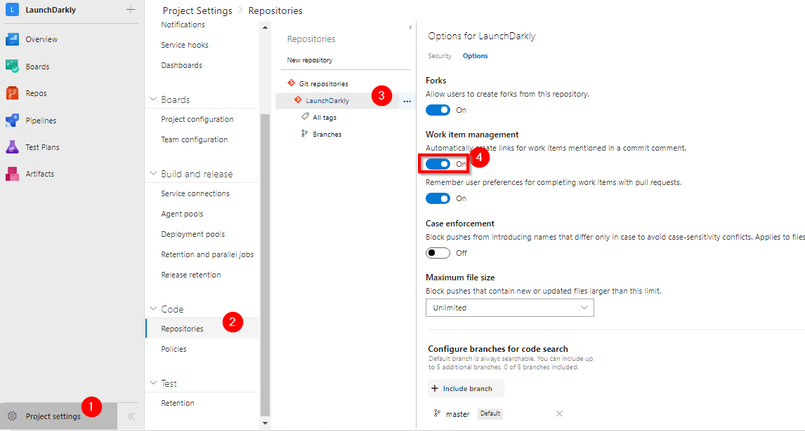

   1. Navigate to **Boards \| Work items**. Select User Story with the title `Implement FeatureFlag Management using LaunchDarkly` and assign it to yourself if its not assigned.

      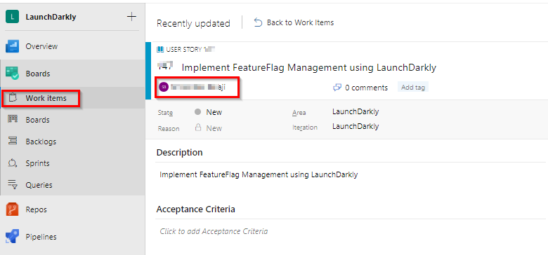

   1. Now navigate to the **Repos** within the project portal, select **Clone** and then select **Clone in Visual Studio**.

      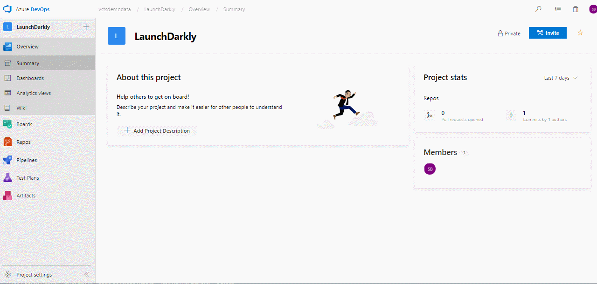

   1. When the code opens in Visual Studio if you are prompted to sign into Azure DevOps Services,  use the same credentials (that you used above to create the azure devops project), choose the local path to clone the repo and select **Clone**.

      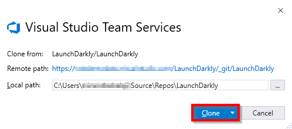

   1. In **Team Explorer** select **Branches** and right click **launch-darkly** branch and select **checkout**. Select **PartsUnlimited.sln** to open the project.
 
      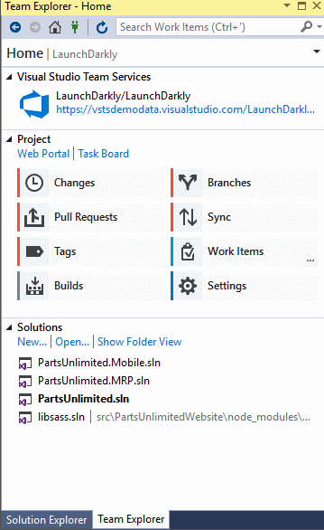

   1. To integrate **LaunchDarkly** with .NET applications you need to install  NuGet package with the **LaunchDarkly client**. In the current project, we have already added for ease of use.

        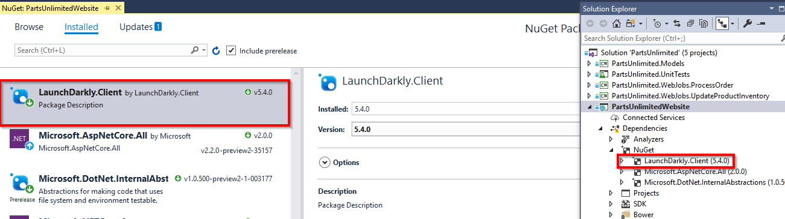

   1. Launch the application locally once. You would be able to see **Member Portal** on the right side corner of the application.

       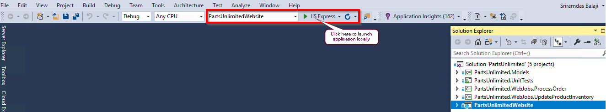

       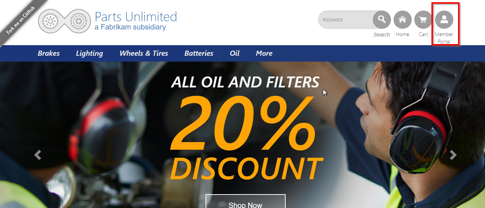


         >Assume that this **Member Portal** module is a new feature and you would like to control this feature using **LaunchDarkly Feature flag** so that when you turn on the flag in LaunchDarkly then only this feature should be visible to users else not.

   1. Open **HomeController.cs** from the path **\PartsUnlimitedWebsite\Controllers** and replace the code from  following [code snippet](https://raw.githubusercontent.com/Microsoft/azuredevopslabs/master/labs/vstsextend/launchdarkly/codesnippet/HomeController.cs).

   1. Open **AccountController.cs** from the path **\PartsUnlimitedWebsite\Controllers** and replace the code from  following [code snippet](https://raw.githubusercontent.com/Microsoft/azuredevopslabs/master/labs/vstsextend/launchdarkly/codesnippet/AccountController.cs).

   1. Open **_Layout.chtml** from the path **PartsUnlimitedWebsite\Views\Shared** and replace line 55 ` @await Html.PartialAsync("_Login")` with the below code.

       `
       @if (ViewBag.togglevalue == true)
         {
          @await Html.PartialAsync("_Login")
         }
      `

   1. In **Home Controller.cs** and **AccountController.cs** replace **\_\_YourLaunchDarklySDKKey__** with your LaunchDarkly account SDK key which you have copied in previous exercise. This is to create a new LDClient with your environment-specific SDK key:

       ` static LdClient client = new LdClient("__YourLaunchDarklySDKKey__");`

         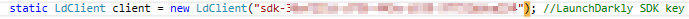

       

   1. In **HomeController.cs** if you go through code from line 57 to 74 
      ```   
      //LaunchDarkly start
            User user = LaunchDarkly.Client.User.WithKey("administrator@test.com");
     
            bool value = client.BoolVariation("member-portal", user, false);
            if (value)
            {
                ViewBag.Message = "Your application description page.";
                ViewData["togglevalue"] = value;
                return View(viewModel);
            }
            else
            {
                return View(viewModel);
            }
           // return View(viewModel);

        }
        //LaunchDarkly End
      ```
      When you request a feature flag, you need to pass in a user object. So we are initializing user object in the beginning. This will be used to check whether a user with specified key exists in LaunchDarkly or not. In this sample, we have hardcoded the user value. In real time it might be from logged in user, database etc..

      Then we are calling the **BoolVariation** method to check feature flag value in LaunchDarkly. If the flag is true it will set **[ViewData["togglevalue"]**  to true which is used in **_Layout.chtml** to view Member Portal module. If it is false it won't show Member Portal Module.

      Similarly in **AccountController.cs** we have added LaunchDarkly code to **Login()** method which is responsible to show Login page once you click on **Member portal** icon. If the flag in LaunchDarkly is false an HttpNotFound error will be returned for the Login page.


   1. Now **Save** all the changes and launch the application locally. Since the **MemberPortal** flag which we created is turned off we would not be able to see **Member portal** link as below.
          
          

        So we have implemented feature flag control using LaunchDarkly. Though you can enable the toggle from the LaunchDarkly portal manually in this lab, we will try to Turn the feature flag on in Azure DevOps Release pipeline using the LaunchDarkly extension. To include feature flags as part of the release process we need to associate this changes with the Azure DevOps work item to get complete control. 

   1. Note down the Work item id which is assigned to you as shown below. (in my case it is 2051 )

       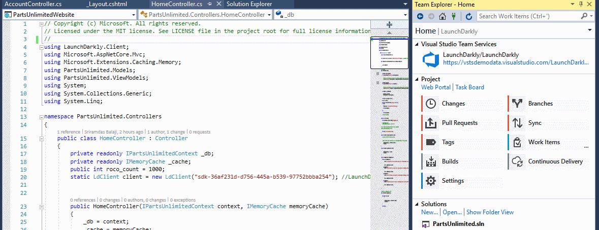

        
   1. Now navigate to **Changes** tab in Team Explorer and enter comment suffixed with work item id with hash tag (ex: integrated LaunchDarkly #2051) and select **Commit All and Push** to push all the changes to the Repo.
       
        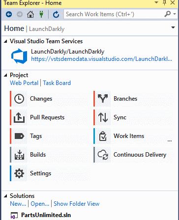

## Exercise 3: Automatically rollout your LaunchDarkly feature flags during release.

1. We need a LaunchDarkly access token to integrate with Azure DevOps services. Visit the [Access Tokens](https://app.launchdarkly.com/settings/tokens) tab on the Account Settings page in LaunchDarkly. If you don't have, create one and copy access token to the clipboard. Make sure the token has at least **Write** access
  
   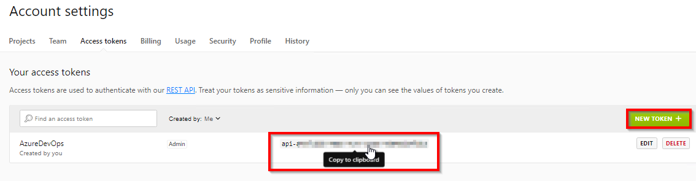

   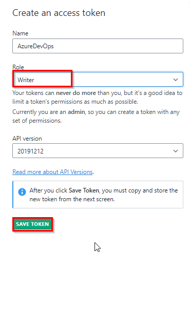

1. In Azure DevOps project navigate to **Project Settings \| Pipelines \| Service connections**. Select **Create service connection** , choose **LaunchDarkly** and click **Next**.

      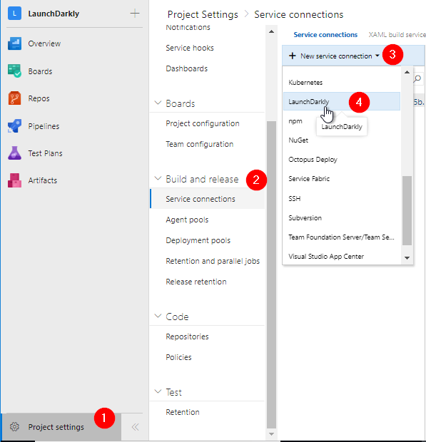

1. In **New LaunchDarkly service connection** window give connection name and paste the access token which you copied in the first step and click **Save**

   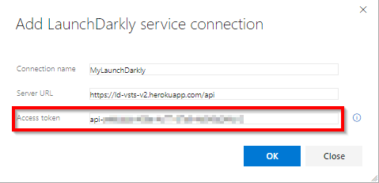

1. Open the work item assigned to you and select the radio button beside your **MemberPortal** feature flag under **LaunchDarkly** tab and save changes.

   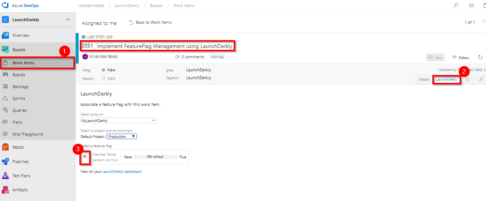

1. Navigate to **Releases** under **Pipelines**. Select **LaunchDarkly_CD** pipeline and click **Edit**.

   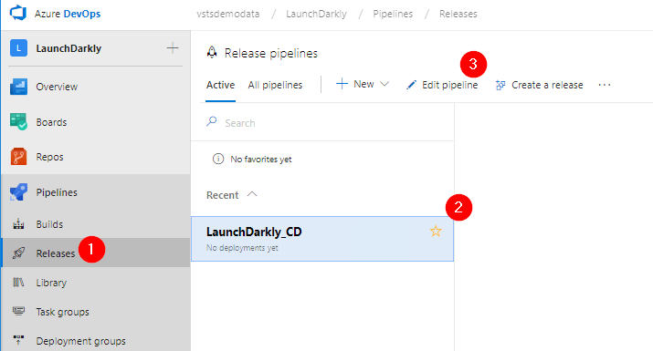

1. Select **Stage 1** to view the tasks in the pipeline.
     
     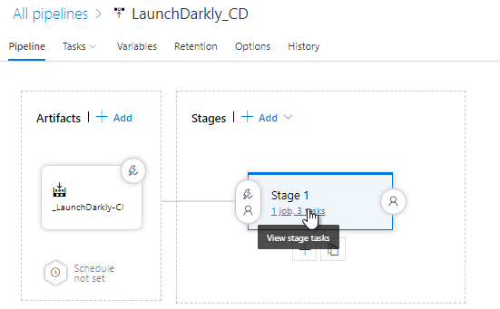
1. You would see three tasks as shown below

      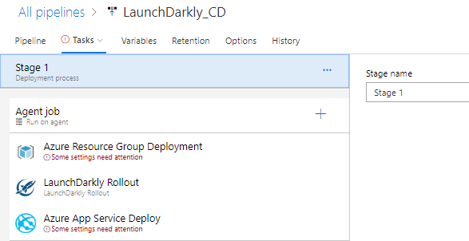

   **Azure Resource Group Deployment**: This task helps you to deploy an Azure app service for your PartsUnlimited website using ARM template.

   **LaunchDarkly Rollout**:  This task helps to rollout/ turn on the feature flag in your LaunchDarkly subscription

   **Azure App Service Deploy**: This task deploys the PartsUnlimited web app to the app service created in the first task.

1. Select **Azure Resource Group Deployment** task and choose your Azure subscription. Then click Authorize to configure Azure service connection.

     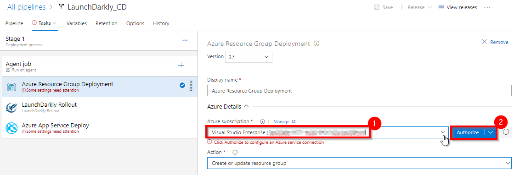 

1. Select **LaunchDarkly** task and choose your LaunchDarkly service connection from the Account drop down
      
      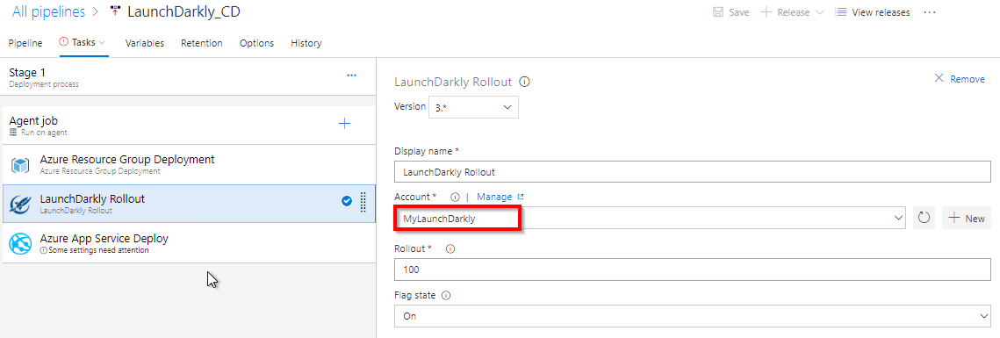
1. Select **Azure App Service Deploy** task and choose your Azure subscription.

    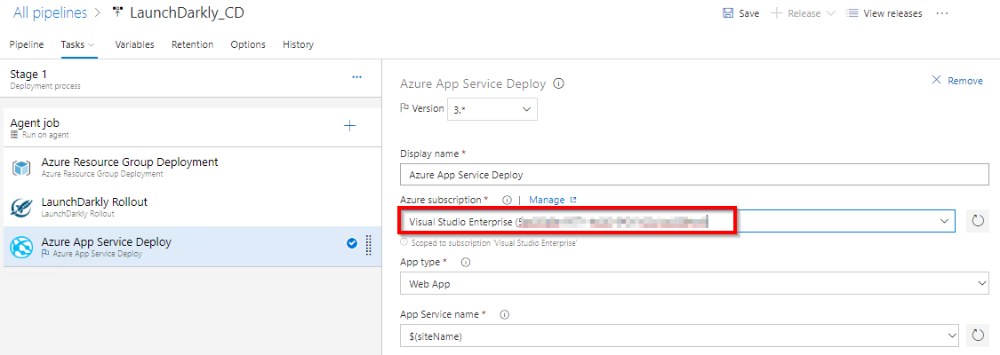
1. Select **Variables** and for **launchdarkly-pat** variable enter your Azure DevOps services **Personal Access Token (PAT)**. If you don't have one click [here](https://docs.microsoft.com/en-us/azure/devops/organizations/accounts/use-personal-access-tokens-to-authenticate?view=vsts) to know how to create personal access tokens for Azure DevOps Services. Also fill out the **launchdarkly-account-name** and **launchdarkly-project-name** variables with the name of your Azure DevOps account and the project name.  **Save** your changes.

     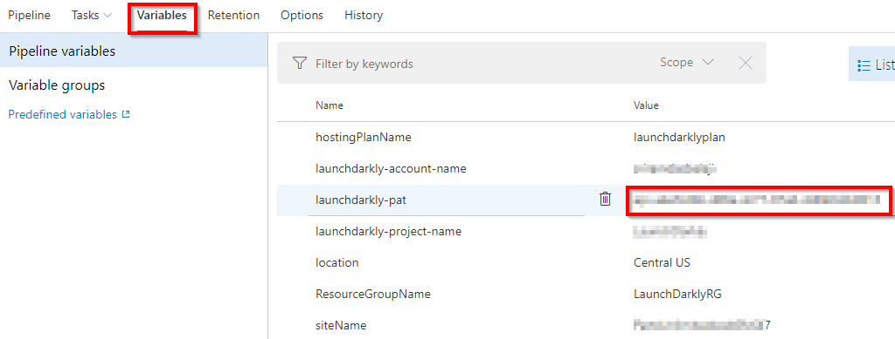
     
1. Now you are done with the configuring release pipeline. Navigate to **Pipelines-->Pipelines** and Queue **LaunchDarkly-CI** build. This CI pipeline has tasks to compile .Net Core project. For more guidance on how to build .Net Core projects with Azure Pipelines see [here](https://docs.microsoft.com/en-us/azure/devops/pipelines/languages/dotnet-core?view=vsts&tabs=designer#build-your-project). Once the build completes successfully a release would be triggered to deploy app and rollout feature flag in LaunchDarkly.
   
    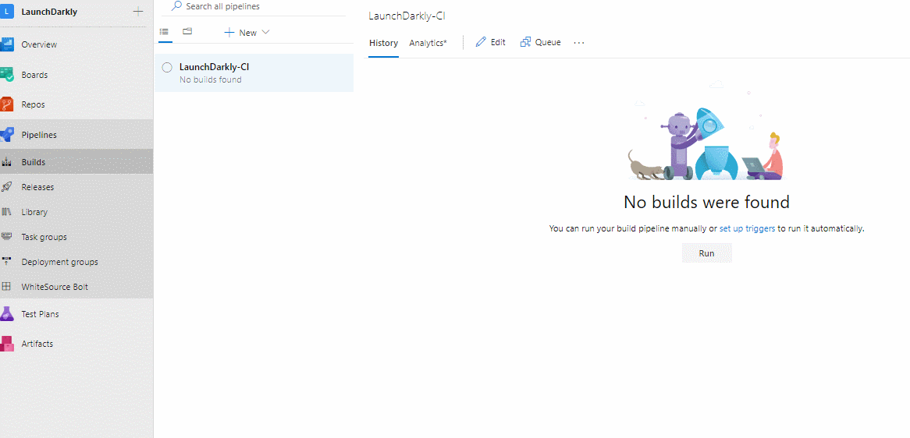

1. Once the release completes successfully you would be able to see **MemberPortal** feature flag is turned on in LaunchDarkly dashboard.
   
    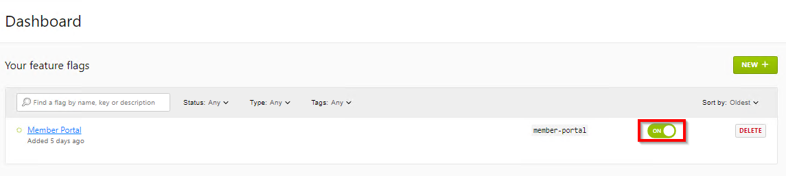 

1. Go to your Azure portal and browse the application deployed by release pipeline.
    
     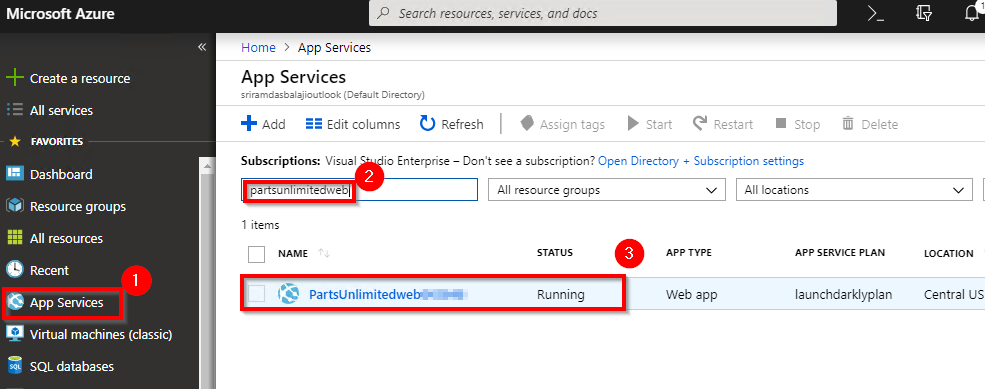 

     You will see that the **Member Portal** is enabled on your website.

    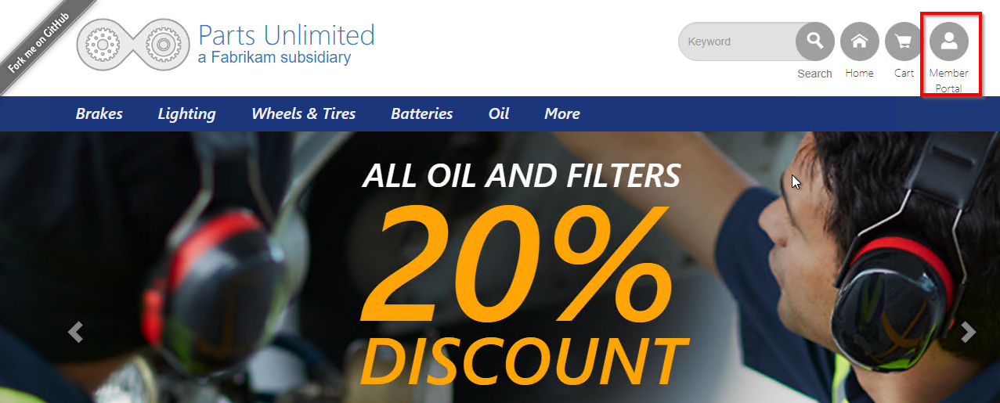

    And this is only the beginning. There are lot more features of LaunchDarkly. 
    
    - **User Targeting**: LaunchDarkly targeting lets you turn features on or off for individual users or groups of users. You can use the Targeting tab to roll features out for internal testing, private betas, or usability tests before performing a broader rollout. You can create your own rules to target who you want, when you want. Learn more about targeting users in our documentation [here](https://docs.launchdarkly.com/docs/targeting-users).

    - **Custom targeting rules**: In addition to targeting individual users, LaunchDarkly allows you to target segments of users by constructing custom rules. In other words, you can create custom rules to target users based on any attributes you send us. Learn more [here](https://docs.launchdarkly.com/docs/targeting-users#targeting-rules-based-on-user-attributes)

    - **Projects and environments to manage your development process**: [Projects](https://docs.launchdarkly.com/docs/projects) allow you to manage multiple different software projects under one LaunchDarkly account. [Environments](https://docs.launchdarkly.com/docs/environments) allow you to manage your feature flags throughout your entire development lifecycle — from local development to QA, staging, and production. 

    Do you want to learn more about LaunchDarkly? If yes click [here](https://docs.launchdarkly.com/docs) for LaunchDarkly documentation.
 

    
