Last updated : {{ "now" | date: "%b %d,%Y" }}

## Overview

[Octopus Deploy](https://Octopus.com) is an automated deployment server that makes it easy to automate deployment of ASP.NET web applications, Java applications, NodeJS application and custom scripts to multiple environments.

Visual Studio Team Services includes a first-class, powerful release management capability that simplifies deployment of any application to any platform. But teams who prefer or already have chosen Octopus deploy, can use the **[Octopus Deploy Integration](https://marketplace.visualstudio.com/items?itemName=octopusdeploy.octopus-deploy-build-release-tasks)** extension available on the Visual Studio Marketplace that provides Build and Release tasks to integrate Octopus Deploy with Team Services and Team Foundation Server.

This lab shows how  we  can integrate VSTS/TFS Team Build and Octopus to automate build and deployment application using a sample PHP application that will be deployed to an Azure App Service.

### Pre-requisites

1. Valid and active **Microsoft Azure Account:** 

1. **Visual Studio Team Services Account** and [**Personal Access Token**](https://docs.microsoft.com/en-us/vsts/accounts/use-personal-access-tokens-to-authenticate)

## Setting up the Environment

Octopus Deploy has two components:
* **Octopus Server** - a centralized web front-end that orchestrates deployments , and 
* **Tentacle** - agent that needs to be on every target endpoint 

 We will spin up a Octopus server on Azure. Click the **Deploy to Azure** button below to provision a Octopus Server.

   

1. Provide **Resource group** and **Octopus DNS Name**, and click **Purchase**, if you agree with the **Terms and Conditions** .

    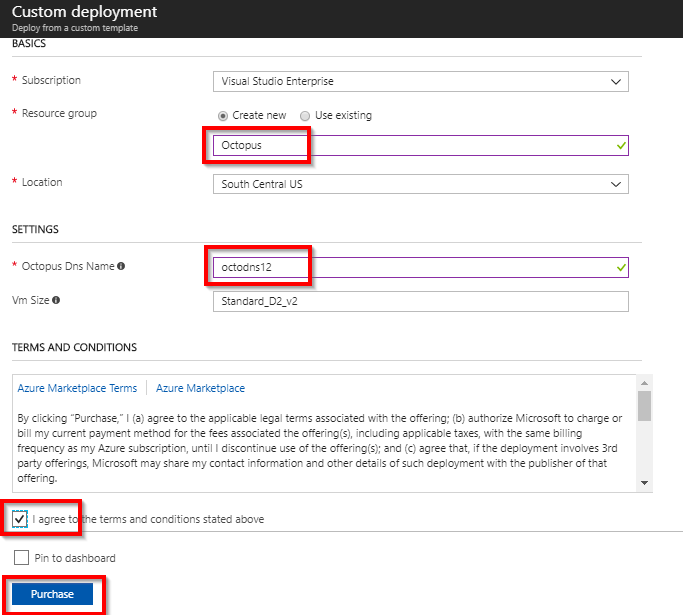

1. It takes approximately 15 minutes for the deployment to complete. Once the deployment is successful, resources including a Windows Server 2012 VM which hosts the **Octopus Deploy server**, an **Azure App Service** for the application deployment, a **SQL Server** with a **SQL Database** PaaS that acts as the backend of Octopus server is configured.

    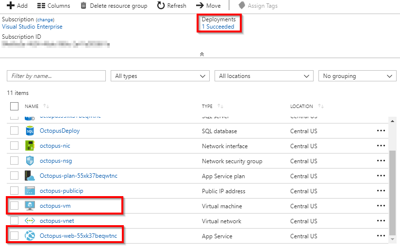

1. Select the **octopus-vm**. In the **Overview** section, note the **DNS name**. We will use this to connect to the VM. Press the copy to clipboard button next to it. 

   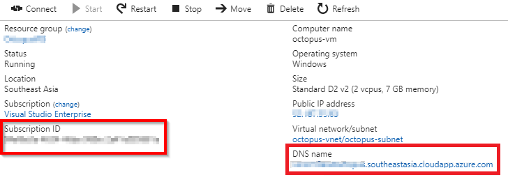

1. Open a new tab and enter `http://{your_vm_dns_name}` to access the Octopus Deploy server. Enter the following credentials and click **Sign In**

   **Username**: admin   
   **Password**: P2ssw0rd@123

   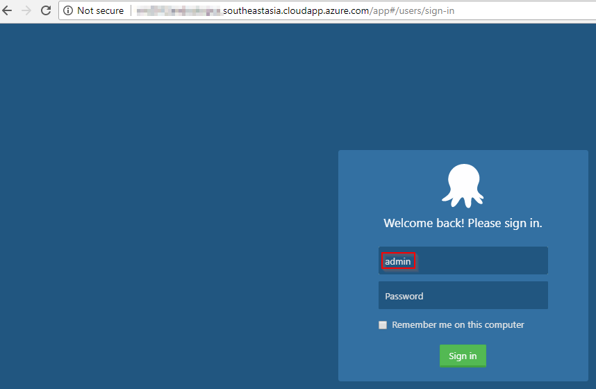

 You will see the Octopus deploy web portal.
    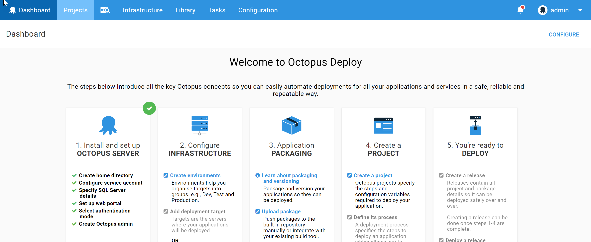

1. From the Octopus Deploy portal, select **Profile** under *User* menu.

   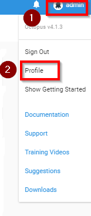

1. Select **My API Key** and click **New API Key** to create one. We will use the API Key to connect Octopus Deploy with Team Services

   

1. Specify a **purpose**, for e.g., **VSTS Integration** and click **Generate New**.

   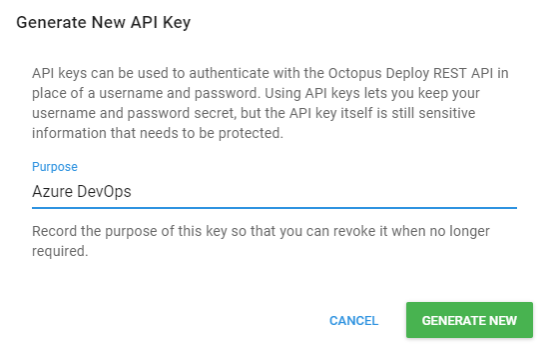

1. Copy the API Key to clipboard and save this somewhere as you may use it for future requests. 

   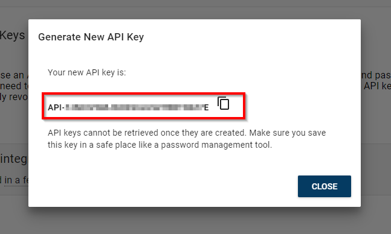

## Setting up Team Services project

1. Use [VSTS Demo Data Generator](https://vstsdemogenerator.azurewebsites.net/?TemplateId=77370&name=octopus) to provision the project on our VSTS account.

   

1. Provide a name for your project. Paste, the Octopus URL (VM's DNS URL) that was created previously, API Key and click on **Create Project**. 

1. Once the project is provisioned, click the URL to navigate to the project.

   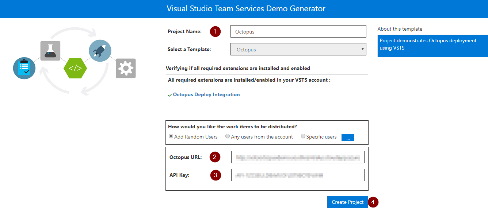

   >Note: This URL will automatically select Octopus template in the demo generator. If  we  want to try other projects, use this URL instead - https://vstsdemogenerator.azurewebsites.net/

## Exercise 1: Configure Deployment Target in Octopus Server

Let us create a deployment environment in Octopus server and link to Azure using Management Certificate. Environments are deployment targets consisting of machines or services used by Octopus Deploy to deploy software. With Octopus Deploy,  we  can deploy software to Windows servers, Linux servers, Microsoft Azure, or even an offline package drop.

Grouping  our deployment targets by environment lets you define your deployment processes and have Octopus deploy the right versions of our software to the right environments at the right time.

In this lab, we are using Azure App Service as the deployment target.

1. From the Octopus portal, select **Create environments** to go into the *Infrastructure* page

   

1. Once inside, click **Add Environment**.

   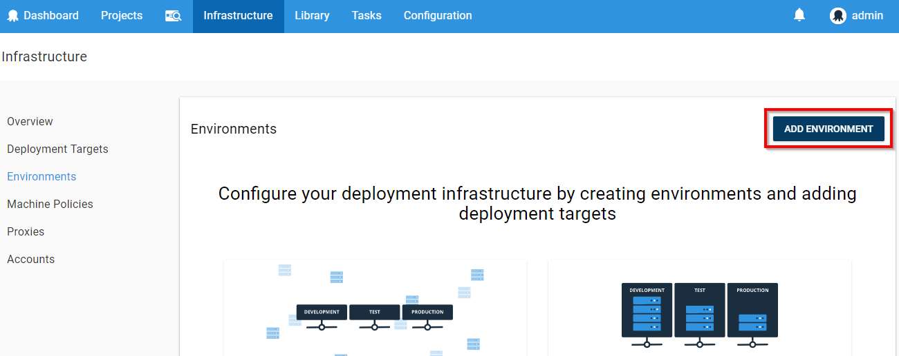

1. Provide the environment name and click **Save**.

   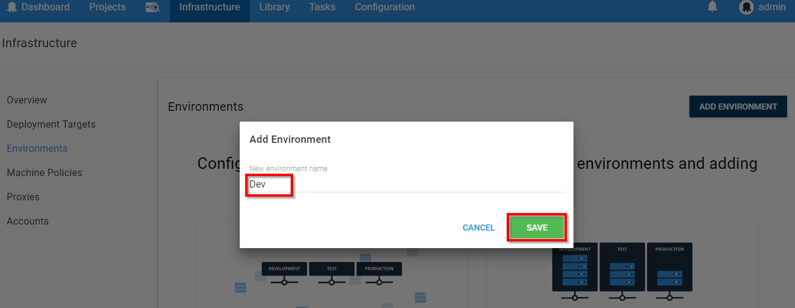

1.	Octopus Deploy provides first-class support for deploying Azure Cloud Services and Azure Web Applications. To deploy software to Azure,   we must add  our  Azure subscription to Octopus Deploy, and then use the built-in step templates to deploy to the cloud. Once the environment is created, click on **Accounts**.

   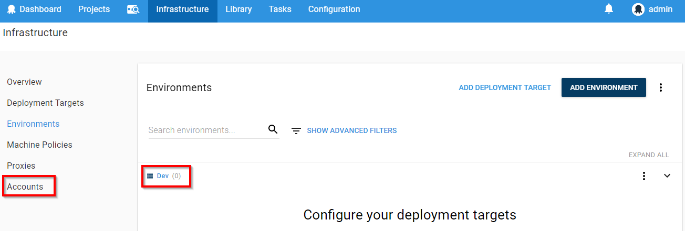

1. Click on **ADD ACCOUNT** to link your Azure subscription to the created environment. 

   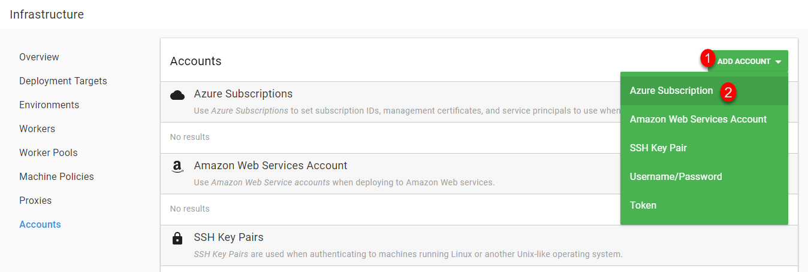

1. Octopus Deploy authenticates with Azure in one of two methods: 
    * To deploy to Azure Resource Manager (ARM), Octopus requires [**Azure Service Principal Account**](https://octopus.com/docs/infrastructure/azure/creating-an-azure-account/creating-an-azure-service-principal-account)
    * [**Azure Management Certificate**](https://octopus.com/docs/infrastructure/azure/creating-an-azure-account/creating-an-azure-management-certificate-account) is used by Octopus to deploy to Cloud Services and Azure Web Apps.

    Enter the following details -

    - **Name**: Provide an account name 
    - **Subscription ID**: Your [Azure Subscription ID](https://blogs.msdn.microsoft.com/mschray/2016/03/18/getting-your-azure-subscription-guid-new-portal/)
    - **Authentication Method**: Choose **Use Management Certificate**

   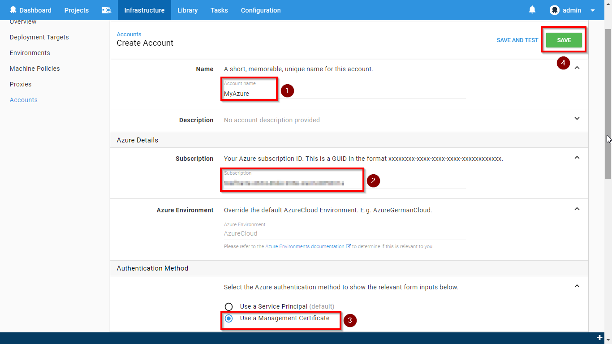

1. Click **Save** and notice that a management certificate is generated. Download this certificate.

   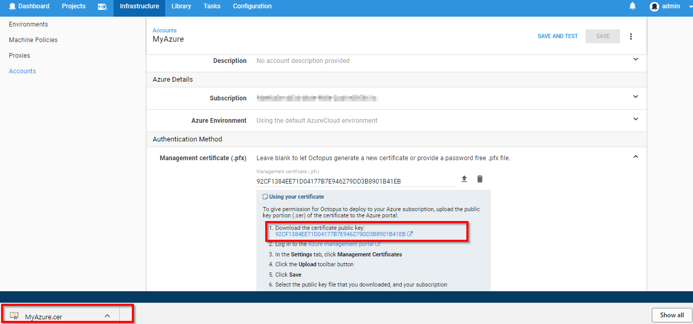

1. To upload the certificate in Azure, go to [Azure Portal](https://portal.azure.com) and search for **Subscriptions**.

   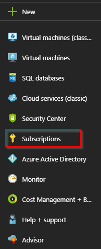

1. Click on the Subscription.

   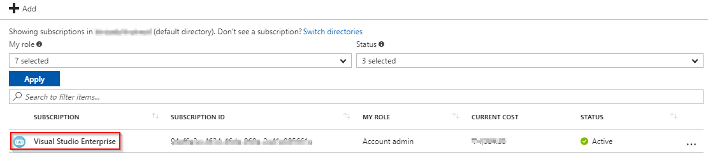

1. Scroll down and click **Management certificates**.

    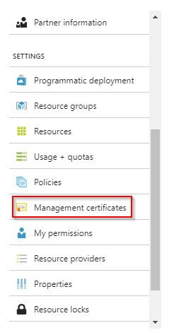

1. Click **Upload** to upload the certificate which was downloaded in the **step 7**.

    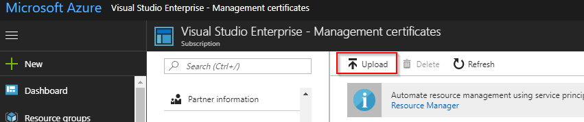

    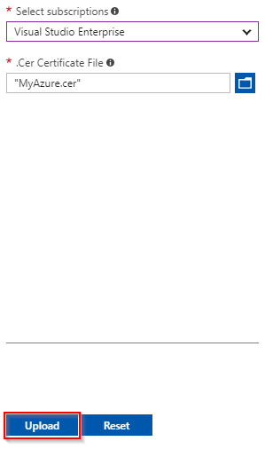

1. Once the certificate is uploaded successfully, go back to Octopus portal and click **Save and Test**. If the test succeeds,  we should be able to configure Octopus to deploy application packages to Azure.

    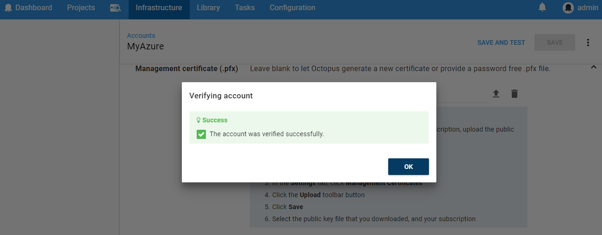

## Exercise 2: Create Project in Octopus

Let us create a Project in Octopus to deploy the package to **Azure App Service**. A [**Project**](https://octopus.com/docs/deployment-process/projects) is a collection of deployment steps and configuration variables that define how your software is deployed.

1. Go to Octopus dashboard and click **Create a project**.

   

1. Click on **ADD PROJECT**, provide the project name, description and click on **SAVE**.

   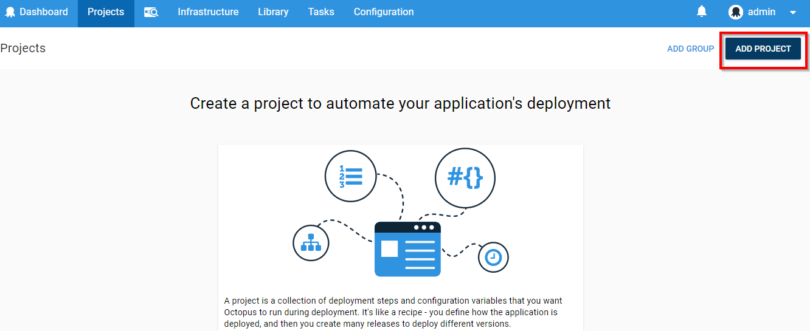

   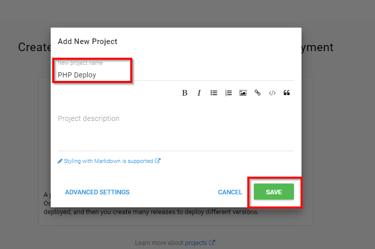

1. Once the project is created, click **Define your deployment process**. The [deployment process](https://octopus.com/docs/deploying-applications/deployment-process) is like a recipe for deploying your software.

   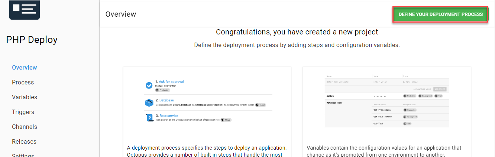

1. Click on **ADD STEP** to see a list of built-in step templates, custom step templates, and community contributed step templates.

   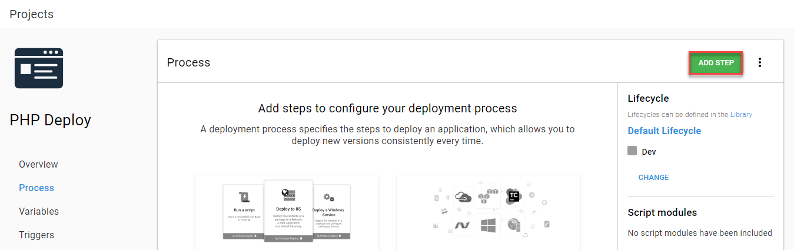

1. **Search** for **Azure Web App** template and click **Add**.

   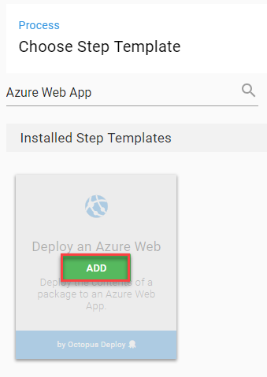

1. Populate the step template with required details -

   - **Step Name** : A short, unique name for the template.
   - **Package ID** : PHP (if you are providing different package ID, update it in **Package PHP** task of the build definition)
   - **Azure account** & **Web App** : Select from the dropdown

   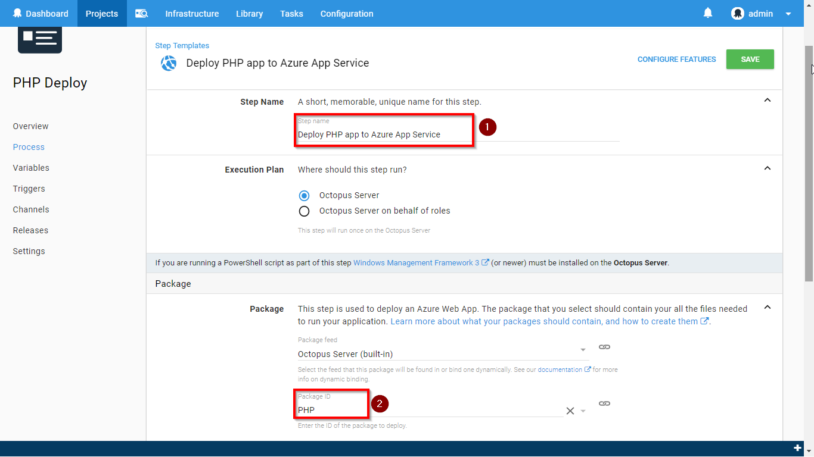

   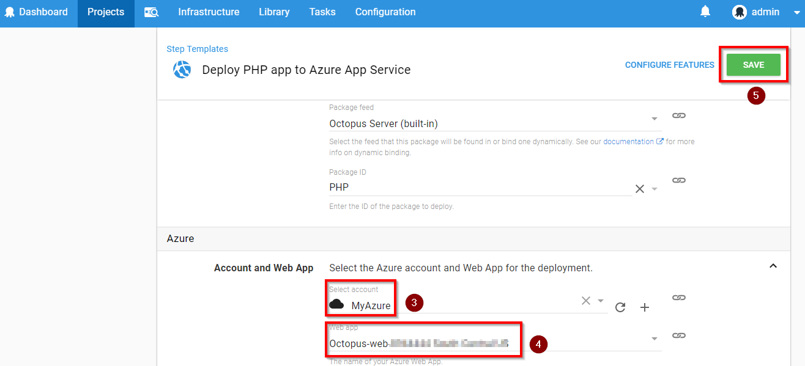

1. Clicking **Save** should define the project creation and its deployment process.

## Exercise 3: Triggering CI-CD

In this exercise, we will package PHP application and push the package to Octopus Server. We will use build tasks of **Octopus Deploy Integration** extension which was installed during Team Project provisioning.

| Tasks| Usage|
|-------| ------|
| **Package Application** | We will package the PHP source code into a zip file with the version number|
| **Copy Files**| The Copy Files task will copy the generated package to artifacts directory in VSTS|
| **Push packages to Octopus**| The copied package will be pushed to Octopus server from VSTS artifacts directory|
| **Create Octopus Release**|Automates the creation of release in Octopus server. A release captures all the project and package details to be deployed over and over in a safe and repeatable way|
| **Deploy Octopus Release**| Automates the deployment of release in Octopus server. A deployment is the execution of the steps to deploy a release to an environment. An individual release can be deployed numerous times to different environments|

1. Go to **Builds** under **Build and Release** tab and click on **Octopus** build definition.

   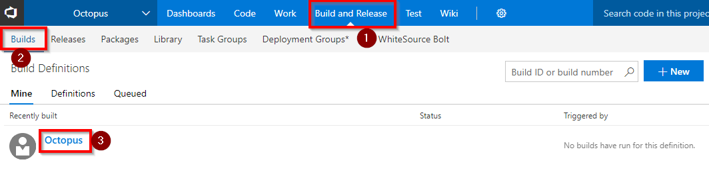

1. **Edit** the build definition to update Octopus server endpoint.

   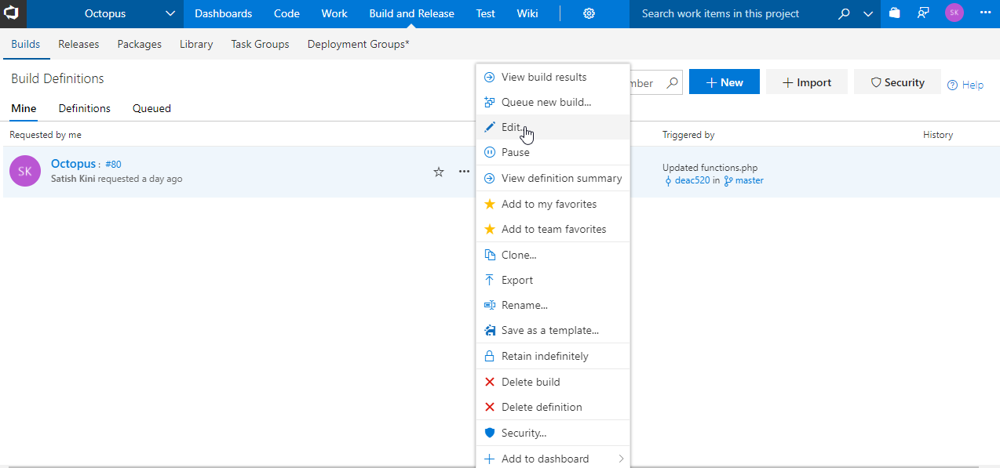

1. In **Push Packages to Octopus** task, update **Octopus Deploy Server** field with the created endpoint value.

   > **Note** : We will encounter an error - **TFS.WebApi.Exception: Page not found** for Azure tasks in the release definition. This is due to a recent change in the VSTS Release Management API. While we are working on updating VSTS Demo Generator to resolve this issue, we can fix this by typing a random text in the **Azure Subscription** field and click the **Refresh** icon next to it. Once the field is refreshed, we can select the endpoint from the drop down.

   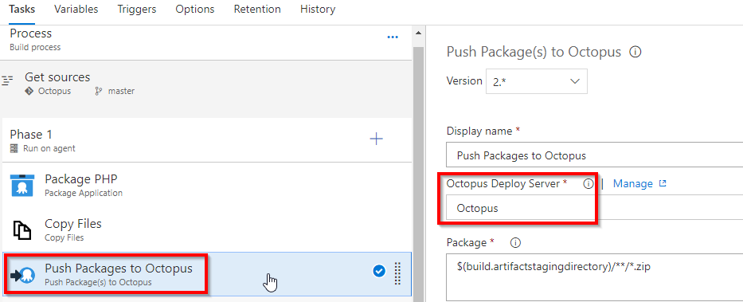

1. In **Create Octopus Release** task, update **Octopus Deploy Server** field with the created endpoint value and **Project** fields.

    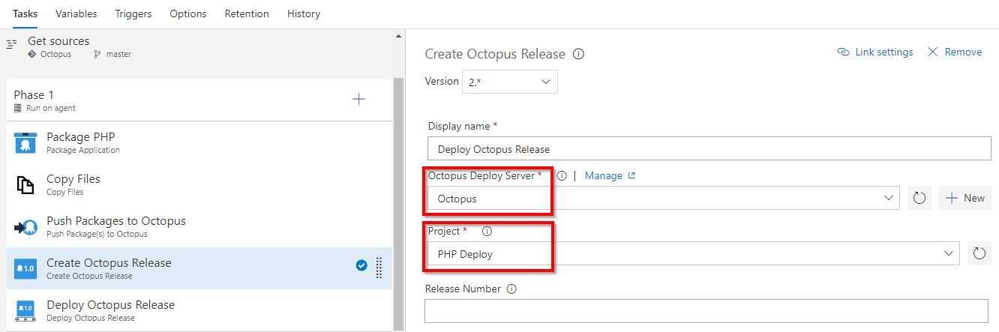

1. In **Deploy Octopus Release** task, update **Octopus Deploy Server** field with the created endpoint value, choose the appropriate values from the drop down for fields - **Project**  and **Deploy to Environments**.

    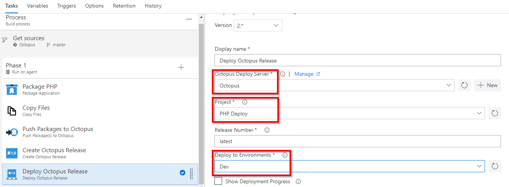

1. Save the build definition.

    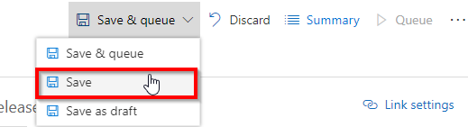

1. Go to **Code** tab and edit the file **functions.php**

    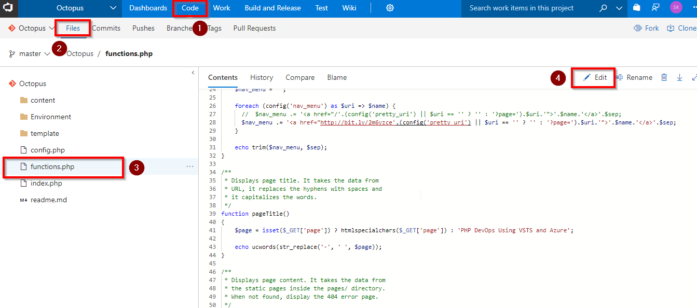

1. Update the **line 41** as shown, change the title to - **PHP DevOps Using VSTS, Octopus and Azure** and **commit** the changes.

    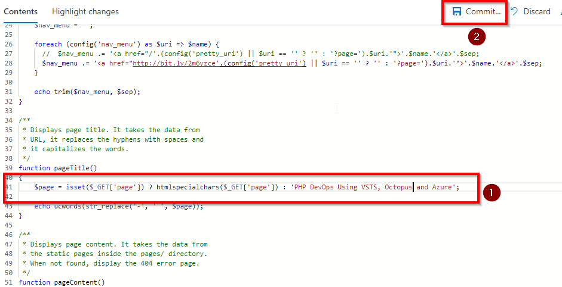

1. Go to **Build** tab, you will see in-progress build.

    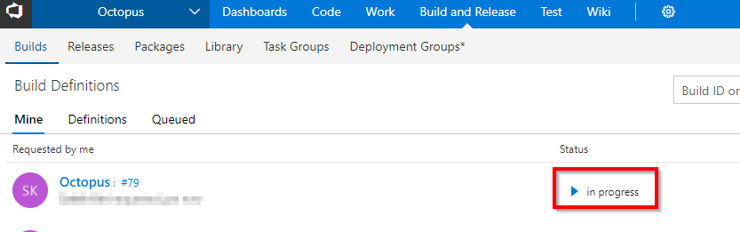

1. Once the build completes, go to Octopus portal project dashboard. We will see the release completion in Octopus.

    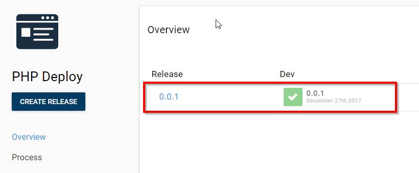

1. Go to Azure Web App from your **[Azure Portal](https://portal.azure.com)** and click on **Browse**.

   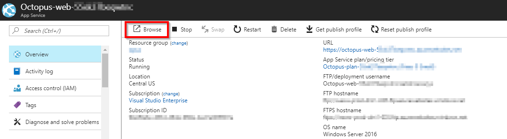

1. You will see the PHP application up and running.

   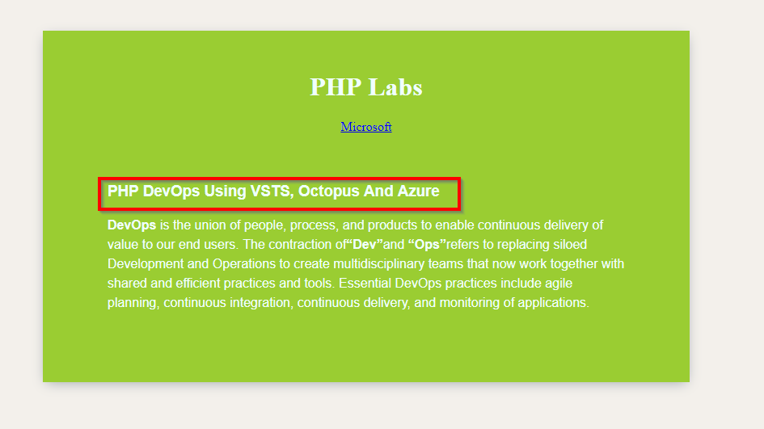