

## Overview

Service virtualization helps organizations accelerate time to market without compromising quality. Especially in Agile environments, dependent components (e.g., APIs, 3rd-party services, databases, mainframes, etc.) connected to the application under test are not readily accessible for development and testing because they are still evolving, beyond a team's control, or too costly/complex to configure in a test lab. With service virtualization, testing and development can proceed without waiting for access to the actual dependent components.

Parasoft's service virtualization solution provides a unique environment-based approach. The combination of Microsoft Azure, Microsoft VSTS, and Parasoft Service Virtualization—operating natively within the Microsoft environment—is designed to provide teams the rapid, scalable, and flexible test environment access required for Agile, DevOps, and "Continuous Everything

Please see the [Getting started with Parasoft and Azure](https://cdn2.hubspot.net/hubfs/69806/New_Pages/Getting%20Started%20Parasoft%20Azure%20Overview.pdf){:target="_blank"} provides for a more in-depth overview of Parasoft  Service Virtualization.

In this lab, we’ll create a complete continuous delivery pipeline for the Parabank application using VSTS and Parasoft. We’ll highlight
the value of service virtualization and how it facilitates complete virtual environments for testing.

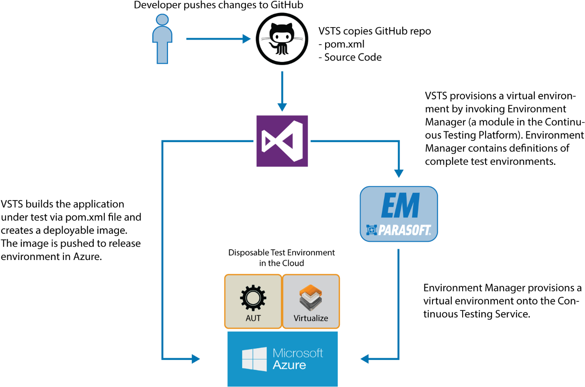

As shown in the above diagram, we'll:

1. Pull Parabank code from GitHub.

1. Build Parabank in VSTS using Maven.

1. Deploy (“release”) Parabank onto a VM in Azure. Simultaneously, we’ll call Parasoft Environment Manager (“EM”) to provision a virtual environment. This virtual environment will enable functional testing of Parabank.

### Prerequisites for the lab

1. **Microsoft Azure Account**: You will need a valid and active Azure account for the Azure labs. If you do not have one, you can sign up for a [free trial](https://azure.microsoft.com/en-us/free/){:target="_blank"}

    * If you are an active Visual Studio Subscriber, you are entitled for a $50-$150 credit per month. You can refer to this [link](https://azure.microsoft.com/en-us/pricing/member-offers/msdn-benefits-details/){:target="_blank"} to find out more information about this including how to activate and start using your monthly Azure credit.

    * If you are not a Visual Studio Subscriber, you can sign up for the FREE [Visual Studio Dev Essentials](https://www.visualstudio.com/dev-essentials/){:target="_blank"} program to create a **Azure free account** (includes 1 year of free services, $200 for 1st month).

1. You will need a **Visual Studio Team Services Account**. If you do not have one, you can sign up for free [here](https://www.visualstudio.com/products/visual-studio-team-services-vs){:target="_blank"}

1. You will need a **Personal Access Token** to set up your project using the **VSTS Demo Generator**. Please see this [article](https://docs.microsoft.com/en-us/vsts/accounts/use-personal-access-tokens-to-authenticate){:target="_blank"} for instructions to create your token.

    

1. The ParaBank.zip sample system. You can download it **here**.

## Creating a Virtual Machine in Azure

Before we create a project in VSTS, we need to deploy an Azure virtual machine. This machine will serve several purposes:

- It will host Parasoft’s Continuous Testing Platform on which we’ll define virtual environments
- We will deploy the Parabank demo application to this machine
- We will deploy virtual environments onto this machine as part of the release process in VSTS.

1. In your Azure portal, select **New** to access the Marketplace:

   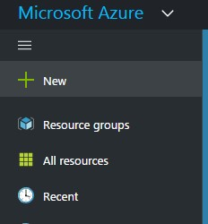

1. In the Marketplace, search for **Parasoft** and select **Service Virtualization On-Demand**. You may select the **BYOL** option if you’ve previously received a special license from Parasoft. Click Create.

1. Provide a name for the VM, then enter a username and password. You can choose to create a new resource group for the VM or add it to an existing VM. All other options can be left at the defaults. Click OK.

   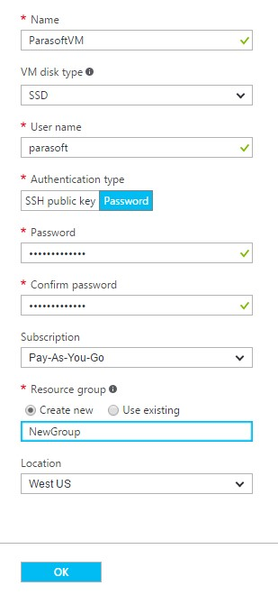

1. Select a virtual machine size (recommended is DS2\_V2 or better).Click OK.

1. Under **Settings**, you may change other configurations if desired. It is recommended that you do not change the default configuration unless you have a specific reason for doing so. Click OK.

1. Click OK on the Summary view.

   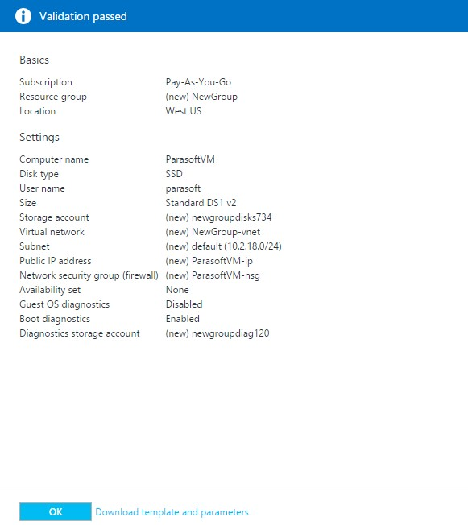

1. Click Purchase on the Buy view. You will now be charged on an hourly basis while the Parasoft VM is running. The VM creation process will take several minutes to complete.

   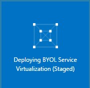

1. Once the VM’s status is **Running**, select the VM and copy its Public IP Address.

   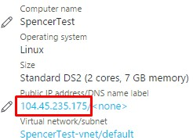

1. Go to http://&lt;VM\_IP\_Address&gt; in your browser. The Continuous Testing Platform main menu will appear. Once the **Online Percentage** widget shows **100%,** the virtual machine is fully configured and initialized:

   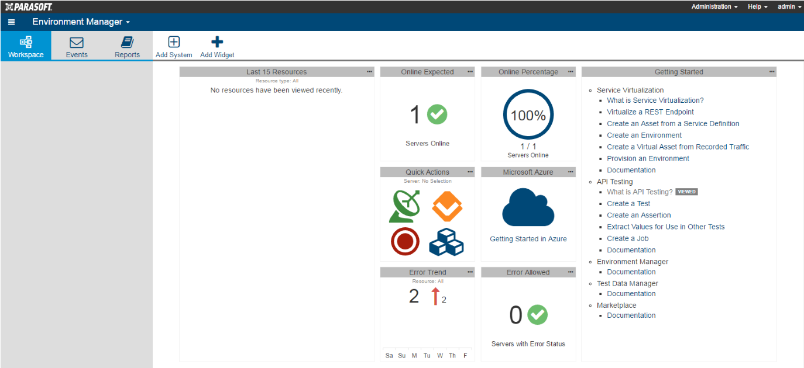

## Importing Data into Environment Manager

1. In your browser, navigate to http://&lt;VM\_IP\_Address&gt;Error! Hyperlink reference not valid.

1. Near the top, click **Add System**:

   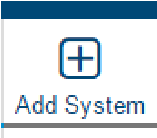

1. Select “Import a system from file,” then browse to Parabank.zip (download it *here*). Select “AzureVirtServer” as the Target server, select “localhost:2424” as the Repository server, then click “Import”:

   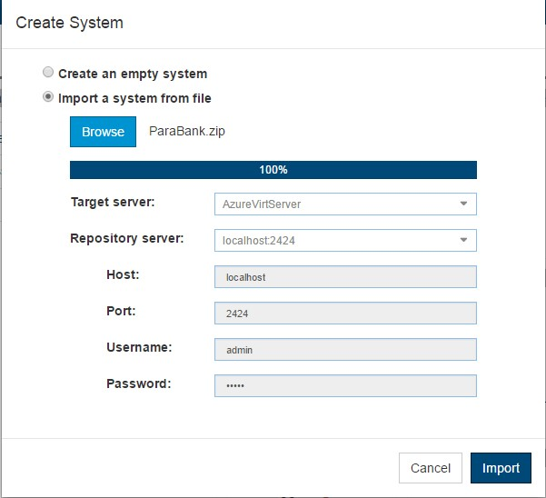

   We’ve now imported the Parabank system and associated data.

   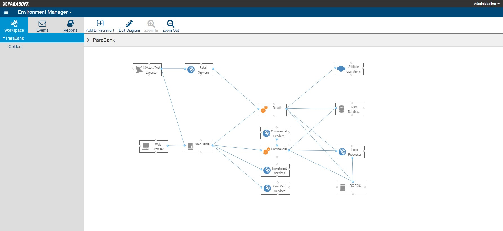

## Creating and Building the Parabank Project in VSTS

1. In your VSTS portal, create a new project called Parabank (default settings are fine).

   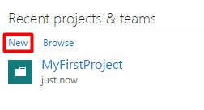

   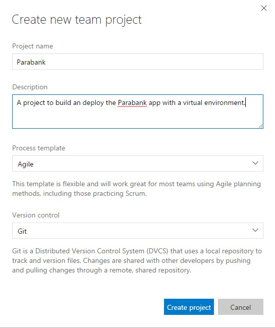

1. Select the gear icon at the top and click **Services**:

   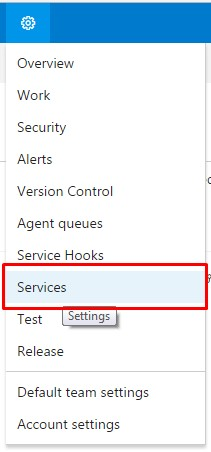

1. On the left, click "New Service Endpoint" and select "External Git."

   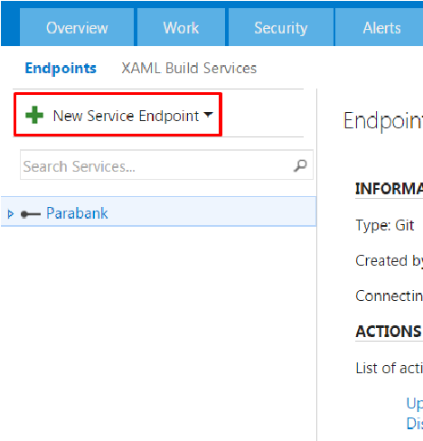

1. Use the following values for the fields:

    - Connection Name: ParabankGitHub

    - Server URL: [http://github.com/parasoft/parabank.git](http://github.com/parasoft/parabank.git){:target="_blank"}

    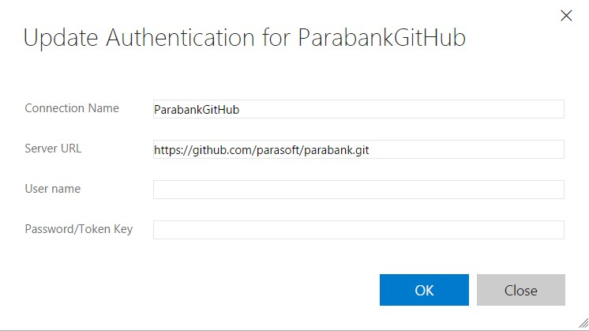

1. Click "OK."

1. Now we’ll add and configure a new build definition as follows:

   - Scroll over “Build & Release” at the top and click Builds.

   - Select “+ New” to start a new build definition.

     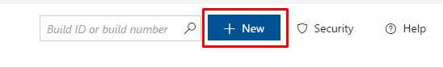

   - Select “Empty” for the template, then click "Next."

   - Choose “Remote Git Repository” under “Repository source.”

   - Click "Create."

   - Click "Save” then provide a name for the build definition (for example, “Parabank Maven build”).

1. Select the Repository tab.

   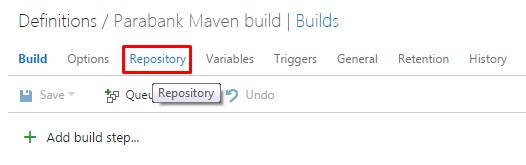

1. Select “External Git” for Repository type. Click on the refresh icon next to the connection field, then enter the following details:

    - Connection: ParabankGitHub

    - Repository name: ParabankGitHub

    - Default branch: master

    - Clean: True

    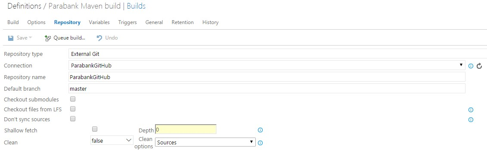

1. Go to the Build tab.

   

1. Add the following build steps in the order listed:

   - Maven (under the *Build* category)

   - Copy and Publish Build Artifacts (under the *Utility* category)

1. Configure each build task.

    - Configure Maven as follows:

    - Maven POM file: pom.xml

    - Options: (leave blank)

    - Goal: install

    - Under ‘JUnit Test Results’: uncheck ‘Publish to TFS/Team Services’

    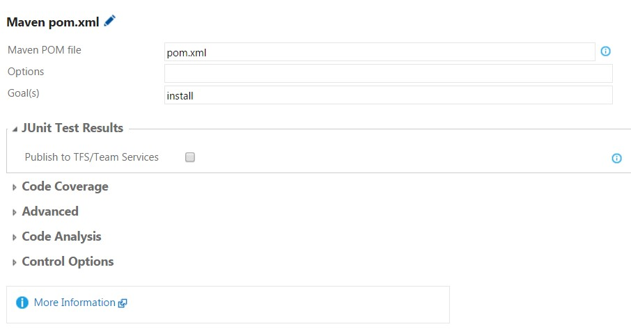

    - Copy Root: \$(Build.Repository.LocalPath)/target
    - Contents: \*.war
    - Artifact Name: drop
    - Artifact Type: Server

    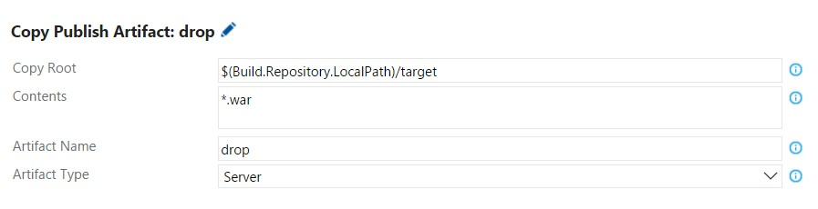

1. Click "Save" to save all the changes.

1. Click "Queue build…" to execute the build.

1. In the popup that appears, leave the default settings and click "OK."

   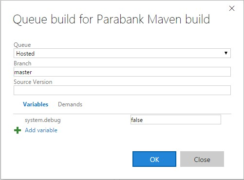

The build will take approximately 5 to 10 minutes. After the build succeeds, you are ready to move on to the next section.

## Releasing Parabank with Parasoft Service Virtualization

Once we’ve built Parabank and produced a .war file, we’re going to release it by deploying it onto a Tomcat server hosted on the Azure
machine we created in the section “Steps to create a Virtual Machine in Azure.”

1. First we’ll install two add-ons from the Team Services Marketplace.

   - Go to the Marketplace by clicking the icon on the top right corner and selecting "Browse Marketplace":

   

   - Install the “Apache Tomcat Deployment” and “Parasoft Service Virtualization” plugins from the Marketplace. This step requires Administrative privileges.

1. Back in the Parabank project, click the gear icon at the top and select "Services":

   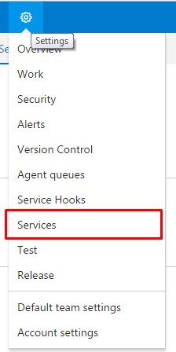

1. Choose "New Service Endpoint" and add an instance of Parasoft CTP. For the Server URL field, use Error! Hyperlink reference not valid. You can also use the VM’s DNS name if you wish. Use admin/admin for the user/password field.

   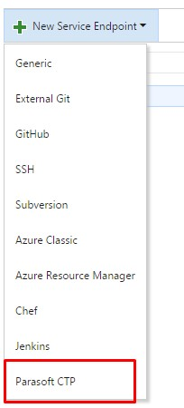

   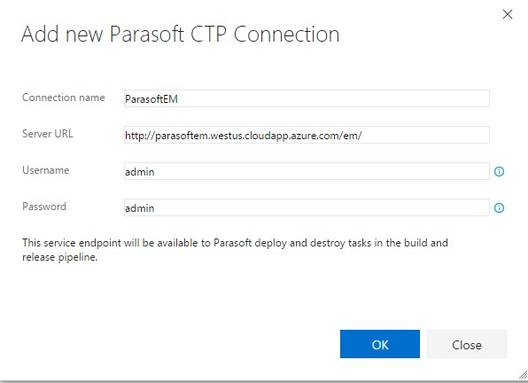

1. Scroll over the **Build & Release** tab and then select **Releases**.

   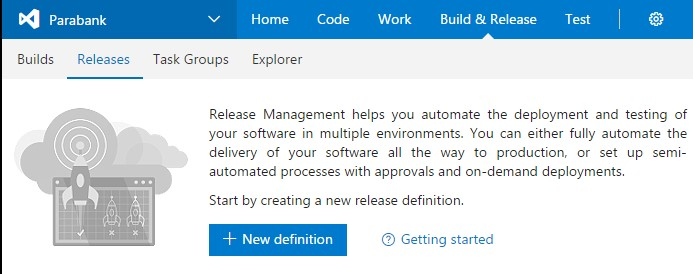

   - Create a new release definition. Click “+ New definition”

   - Select "Empty" and click "Next."

   - Choose "Build" as your artifact source and point to your existing
    Parabank build definition.

     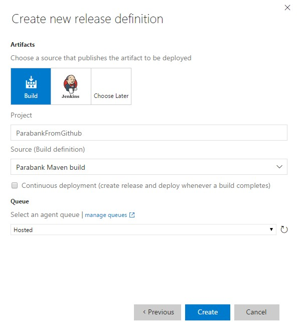

   - Click "Create."

1. In the new definition, click "Add tasks" and add the following:

    - Deploy to Apache Tomcat (under the *Deploy* category)

    - Parasoft Service Virtualization Deploy (under the *Deploy* category)

    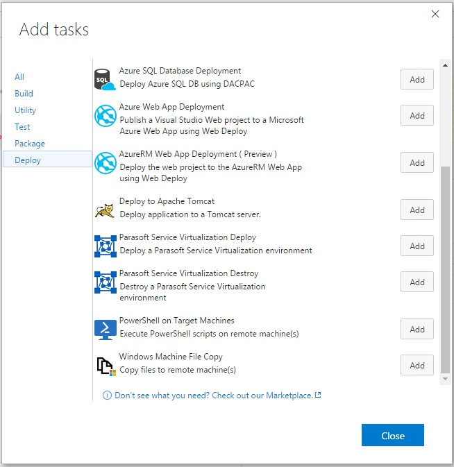

1. In your release definition, select the “Deploy application to a Tomcat server” task. Complete the configuration fields as follows:

    - Tomcat Server URL: Error! Hyperlink reference not valid. (make sure you remove the port 8080) Error! Hyperlink reference not valid.

    - Tomcat Manager Username: tomcat

    - Password: tomcat

    - WAR file: (Browse in the build artifact and select the parabank.war file)

1. Select your Parasoft Service Virtualization Deploy task and configure it as follows:

    - Parasoft CTP Endpoint: From the dropdown, select the ParasoftEM service endpoint created at the beginning of this section

    - System: ParaBank

    - Environment: Golden

    - Instance: Negative

    - Leave everything else default and click "Save."

## What are environments and instances

**An Environment** is a collection of virtual assets, proxies, data sets and real endpoints that belong to a particular group or physical environment (for example, Dev, Performance, QA, Staging, etc.). In Environment Manager, all Environments belong to a System.

**An Instance** is a particular configuration of an Environment. It is typically a subset of all available artifacts in the Environment and describes a specific configuration state for components in the Environment. All Instances belong to an Environment.

1. Give the release definition a suitable name (like “Parabank Deployment”). To edit the name, select the pencil icon next to the current name. Then click "Save."

   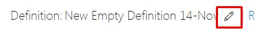

1. Create a release by select the green plus sign next to “Release,” then selecting the latest successful Parabank build id (this could be any number 1 or greater depending on how many builds you’ve already executed):

   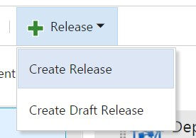

   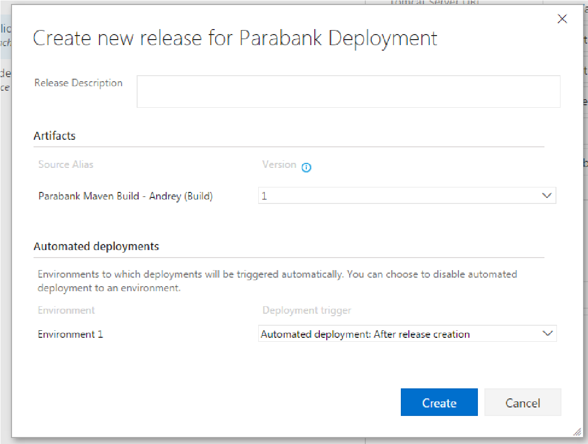

1. Once the release has completed and is successful (this may take a few minutes), navigate to http://&lt;VM\_IP\_ADDRESS&gt;/parabank in your browser. The Parabank application should load:Error! Hyperlink reference not valid.

   

1. Now that we’ve provisioned our virtual environment, we must reconfigure the Parabank application to use our “proxies.” These are endpoints which sit between Parabank and the virtual services it will consume. These proxies will redirect Parabank’s requests to our virtual services.

   Proxies can be used to redirect traffic between the application under test and many real and virtual components including web services, databases, mainframes and other endpoints:

   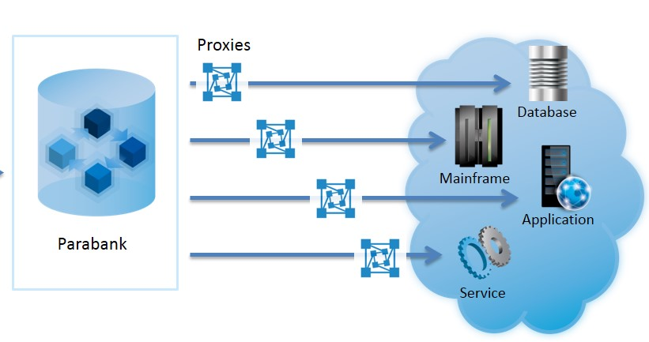

   To reconfigure Parabank to use our proxies:

   - Select the link to the Admin Page (on the left) and locate the Data Access Mode section.

   - Select the "SOAP" radio button.

     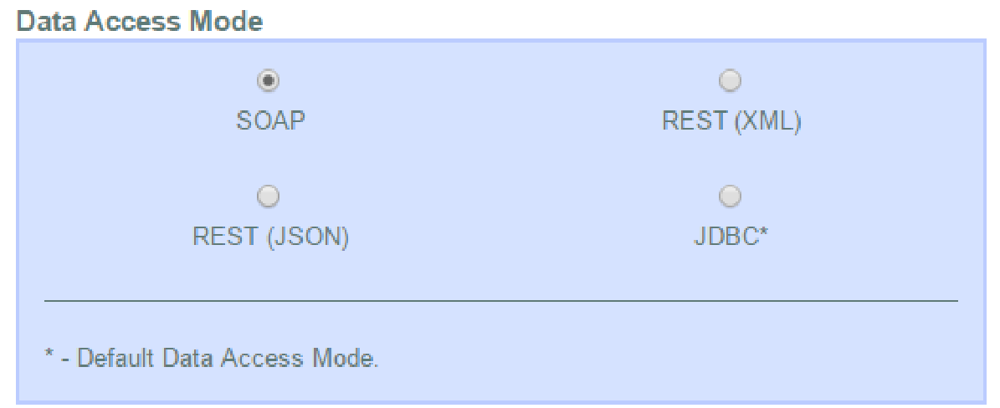

   - Scroll down the page and locate the Web Service section.

   - For SOAP Endpoint, enter [http://localhost:9080/ParabankProxy](http://localhost:9080/ParabankProxy)

   - For Loan Processor Service Endpoint, enter [http://localhost:9080/LoanProcessorProxy](http://localhost:9080/LoanProcessorProxy)

     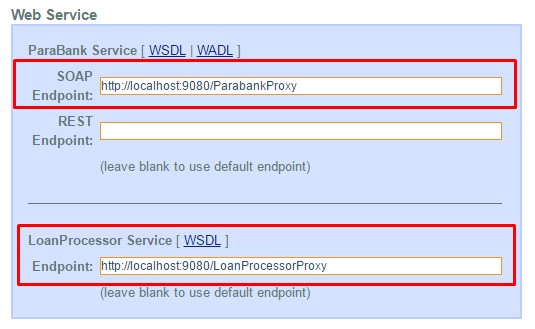

1. Invoke the virtual asset by requesting a loan in Parabank as follows:

    - Log in to Parabank using john/demo for user/password.

    - Select “Request Loan” on the left.

    - Enter any Loan Amount and Down Payment.

    - Select “Apply Now”. You should receive the following response:

    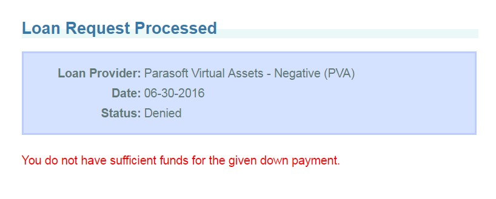

      

1. If you wish, you may now provision one of the other available environments instances. Your options are as follows:

   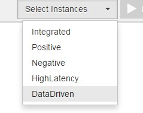

   - Return to the release definition.

   - Edit your Deploy task with the name of the instance you want to deploy (from the list above).

   - Remove the initial Deploy to Apache Tomcat step. This saves time and prevents you from having to reconfigure Parabank’s endpoints each time Parabank redeploys.

## Using the Parasoft Deploy/Destroy Tasks in a Real Workflow

In this tutorial, we have executed the Deploy and Destroy Parasoft tasks during separate release executions. This made it possible for the user
to manually go into Parabank and witness the change in behavior after we deployed a certain virtual environment.

In a real use case, it’s likely that a Deploy task would be utilized to create an appropriate environment for an automated test to execute. We’d
then execute a Destroy task during the same workflow in order to “clean-up” the service virtualization engine after test execution.

It’s possible that we may iteratively provision and destroy several virtual environments in a release as we execute different categories of
tests. See the screenshot for an example of iterative virtual environment deploy and testing:

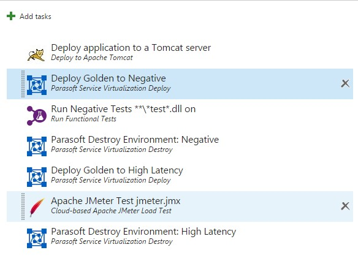

Another distinction between Parabank and a real application is automated configuration. In Parabank, we went into the administration interface
and manually changed the Parabank Service and Loan Processor endpoints to communicate with our virtual services. In a real application, this
configuration would likely be automated as part of the build or release process.
