

## Overview

Azure Pipelines helps you set up a highly customizable continuous integration (CI) and continuous delivery (CD) pipeline to target app services, virtual machines, or containers in Azure whether you are developing a .NET, Java, Node, PHP, or a Python app.   

In this lab, you will configure [Azure Pipelines](https://azure.microsoft.com/en-us/services/devops/pipelines/) for a PHP app to deploy on to an [Azure Web App](https://docs.microsoft.com/en-us/azure/app-service/app-service-web-overview).

## Objectives

Upon completion of this lab, you will be able to:

  * Set up a PHP Azure DevOps Project with Azure DevOps Demo Generator
  * Set up an Azure CI Pipeline
  * Set up an Azure Web App within the Release pipeline and deploy the PHP Application to the Azure Web App

### Before you begin

1. Refer [Getting Started](../Setup/) before you follow the lab exercises.

## Exercise 1: Create a PHP application project using the Azure DevOps Demo Generator

In this practice lab, you are going to work on a PHP project. The purpose is to create a system for the developer to understand the list of tasks that are triggered once the code is pushed to a shared repository.

While the code is a simple PHP application, you will use Azure Command Line Interface(CLI) to provision the infrastructure to deploy the build artifacts.

1. Use the [Azure DevOps Demo Generator](https://azuredevopsdemogenerator.azurewebsites.net/?TemplateId=77365&Name=PHP){:target="_blank"} to provision project on your Azure DevOps Organization. This URL will automatically select the **PHP** template in the demo generator.

## Exercise 2: Commit code changes which triggers a CI build

The **Azure DevOps Demo Generator** creates a Git repository with code in your Azure DevOps Organization. You are going to update the code and commit changes. 

1. Navigate to **Repos** tab in the Azure DevOps portal and navigate to the below path to edit the file.

   >php/config.php

   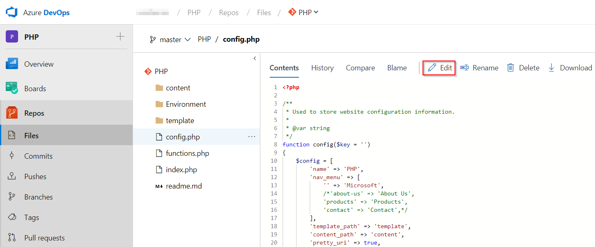

1. Scroll down to line number **11**, select *Edit*  , modify **PHP** to **DevOps for PHP using Azure DevOps** and choose **Commit** to save the changes to the code.

   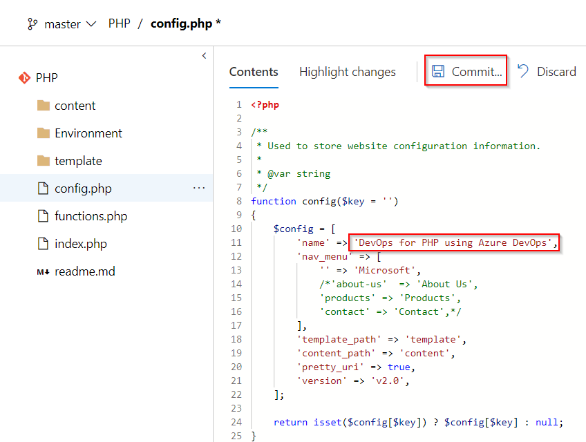

1. Go to **Builds** tab under **Pipelines**. You should now see a build is in progress. The changes you just made are automatically built which will be deployed via the Release pipeline. Click the ellipsis to **View build results**.

   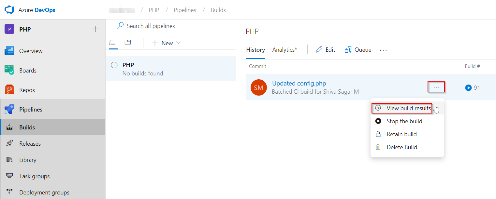

   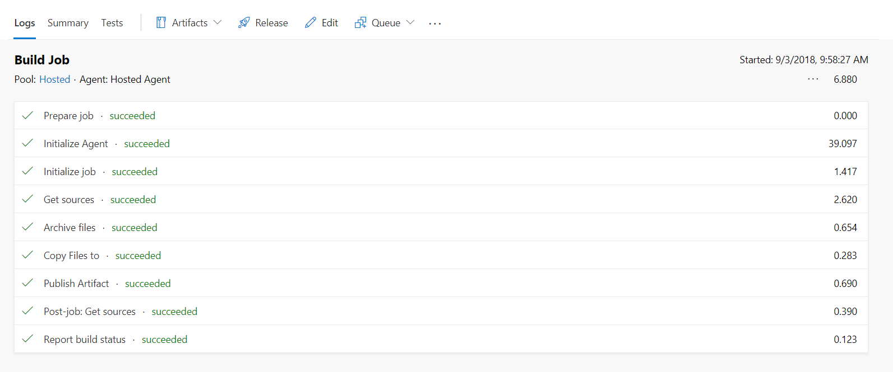

## Examine the Build Definition

   Let's explore the build definition. The tasks used in the build definition are listed below.

   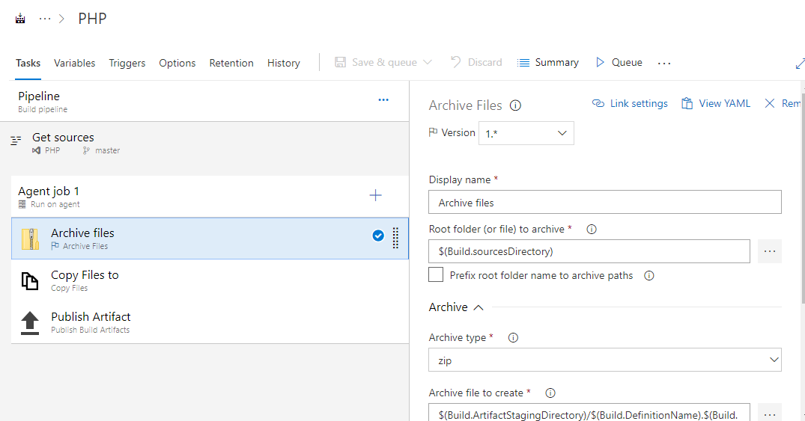

   <table width="70%">
    <thead>
      <tr>
        <th width="60%"><b>Tasks</b></th>
        <th><b>Usage</b></th>
      </tr>
    </thead>
    <tr>
      <td> <b>Archive files</b></td>
      <td>Since PHP is an interpreted language, there is no need to compile the code. Instead, the code is archived into a Zip file.</td>
    </tr>
    <tr>
      <td> <b>Publish Build Artifacts</b></td>
      <td>Publish the build artifacts so that it is available to the Release pipeline</td>
    </tr>
   </table>

## Exercise 3: Configure the Release Definition

Once the build is complete, let us configure the CD pipeline. You will notice a release definition by navigating to **Releases** under the **Pipelines** section. The release will provision an Azure Web app using the Azure CLI and deploy the zip file to the Web App generated by the associated build.

1. Under the **Releases** under **Pipelines** tab, select release definition **PHP** and click on **Edit**.

    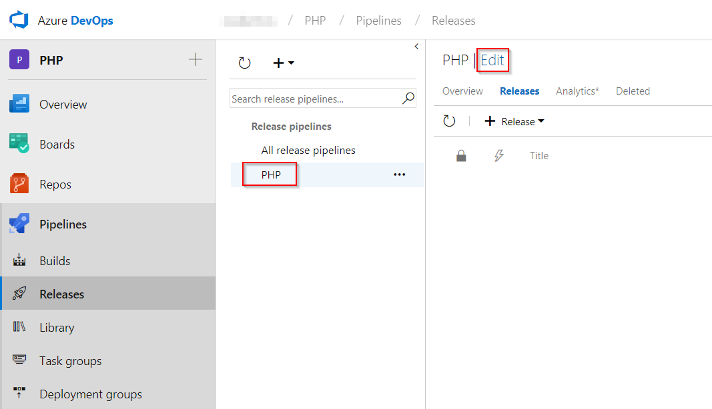

1. Go to **Tasks** and select **Dev** environment.

   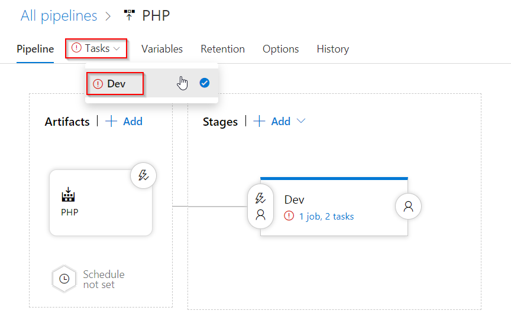

1. Select the **Azure CLI** task, choose the **Azure subscription**. There are 2 ways of choosing the Azure subscription.
   
    * If your subscription is not listed or if you want to use an existing service principal, click the `Manage` link. 

        1. Click on the `+New Service Connection` button and select the **Azure Resource Manager** option. Provide Connection name, select the Azure Subscription from the list and then click on the Ok button. The Azure credentials will be required to authorize the connection.

        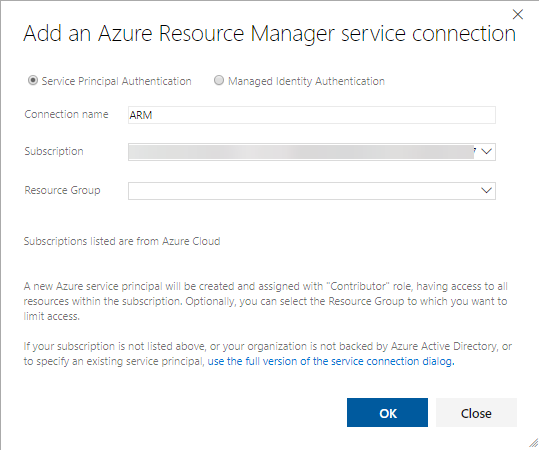

    * If the subscription is already listed, select the Azure subscription from the list and click `Authorize`.

        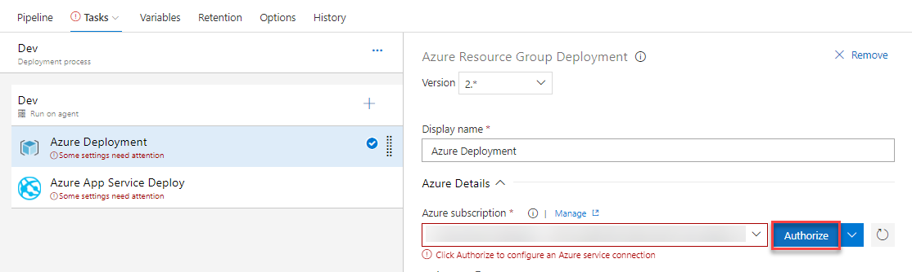

1. Azure CLI is used in the inline script to create the following in Azure - 

    * Resource Group
    * App Service Plan
    * App Service

    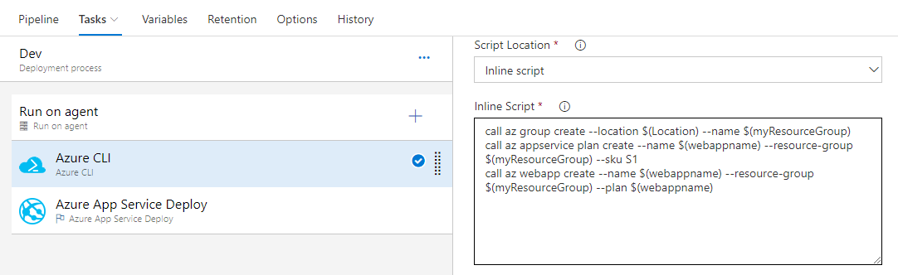

1. The variables are defined in the **Variables** section.

    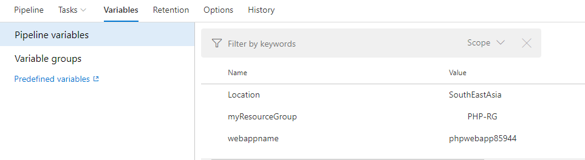

1. Select the **Azure App Service Deploy** task and pick **Azure subscription** from the dropdown list, then click on **Save**. 

    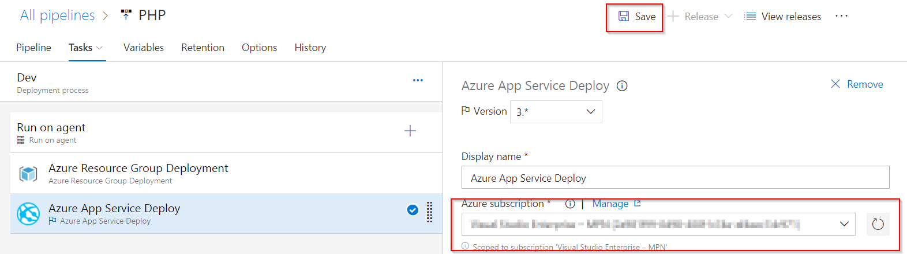    

   <table width="70%">
    <thead>
      <tr>
        <th width="60%"><b>Tasks</b></th>
        <th><b>Usage</b></th>
      </tr>
    </thead>
    <tr>
      <td> <b>Azure CLI</b></td>
      <td>Executes the inline batch scripts to provision a Web App within a resource group</td>
    </tr>
    <tr>
      <td> <b>Azure App Service Deploy</b></td>
      <td>Deploys the PHP code to the provisioned App service</td>
    </tr>
   </table>

1. Queue the saved release definition to deploy the latest build artifacts to the Azure Web App.

   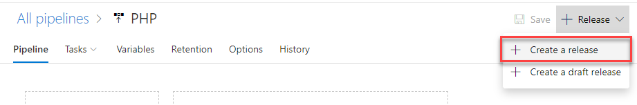

   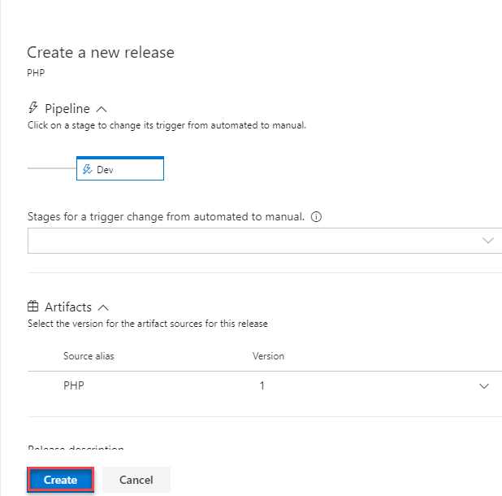

1. Once the release succeeds, navigate to the created Web App to view the PHP application.

   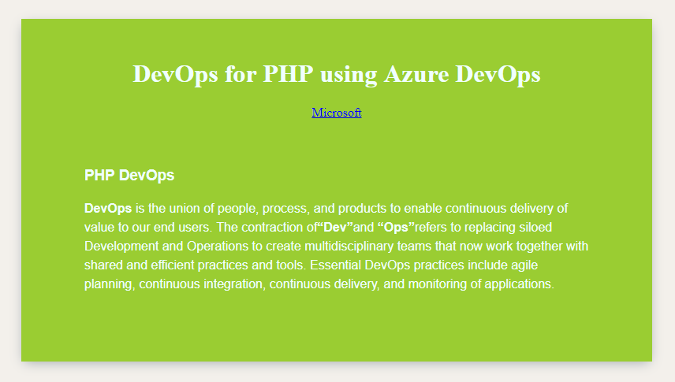 

## Summary

In this lab, you have learnt how to deploy a PHP application on Azure Web App with Azure Pipelines.

