Last updated : {{ "now" | date: "%b %d, %Y" }}.
## Overview

**PHP** is a server-side scripting language, and a powerful tool for making dynamic and interactive Web pages.

This lab shows how to deploy **PHP** application to **Azure App** service using **Visual Studio Team Services**.

### Pre-requisites for the lab

1. **Microsoft Azure Account**: You will need a valid and active Azure account for the Azure labs. If you do not have one, you can sign up for a [free trial](https://azure.microsoft.com/en-us/free/){:target="_blank"}

    * If you are a Visual Studio Active Subscriber, you are entitled for a $50-$150 credit per month. You can refer to this [link](https://azure.microsoft.com/en-us/pricing/member-offers/msdn-benefits-details/){:target="_blank"} to find out more including how to activate and start using your monthly Azure credit.

    * If you are not a Visual Studio Subscriber, you can sign up for the FREE [Visual Studio Dev Essentials](https://www.visualstudio.com/dev-essentials/){:target="_blank"} program to create **Azure free account** (includes 1 year of free services, $200 for 1st month).

1. You will need a **Visual Studio Team Services Account**. If you do not have one, you can sign up for free [here](https://www.visualstudio.com/products/visual-studio-team-services-vs){:target="_blank"}

1. You will need a **Personal Access Token** to set up your project using the Demo Generator. Please see this [article](https://docs.microsoft.com/en-us/vsts/accounts/use-personal-access-tokens-to-authenticate){:target="_blank"} for instructions to create your token.

  

## Setting Up the VSTS Project

1. Use [VSTS Demo Data Generator](https://vstsdemogenerator.azurewebsites.net/?name=PHP&templateid=77365){:target="_blank"} to provision a PHP project on your VSTS account.

   

1. Once the project is provisioned, click the URL to navigate to the project.

   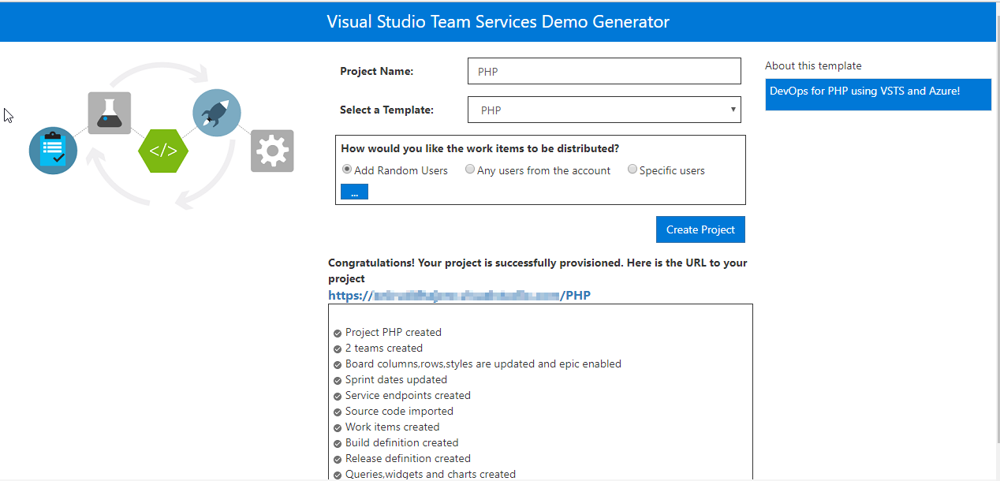

## Exercise 1: Endpoint Creation

Since the connections are not established during project provisioning, we will manually create the endpoints.

In VSTS, navigate to **Services** by clicking the gear icon  , and click  **+ New Service Endpoint**. Select **Azure Resource Manager**. Specify connection name, select your subscription from the dropdown and click OK. We use this endpoint to connect VSTS with Azure.

   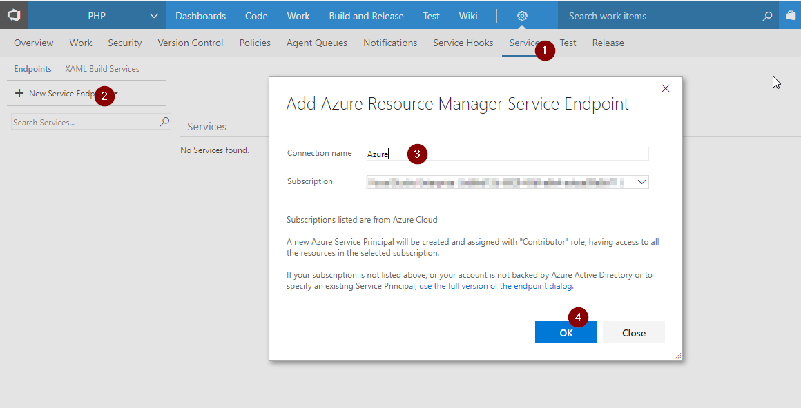

You will be prompted to authorize this connection with Azure credentials.



## Exercise 2: Configure Release Definition

We will use ARM template as **Infrastructure as a Code**  in the release definition to provisions a Web App and a Web App Service Plan under the specified resource group.

  

1. Go to **Releases** under **Build and Release** tab, Select release definition **PHP** and click **Edit**

   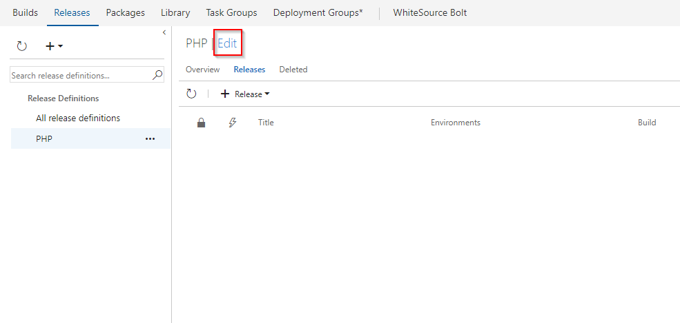

1. Go to **Tasks** and select **Dev** environment.

   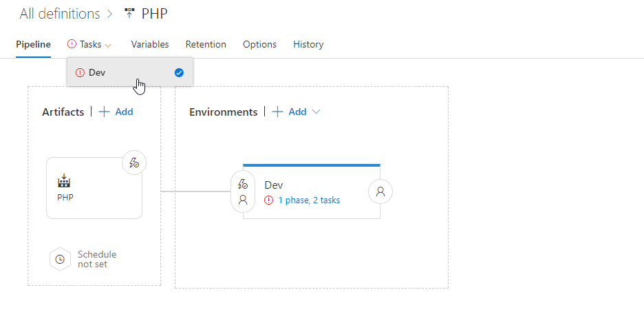

1. Under **Azure Resource Group Deployment** task, update **Azure subscription** and **Location**.

   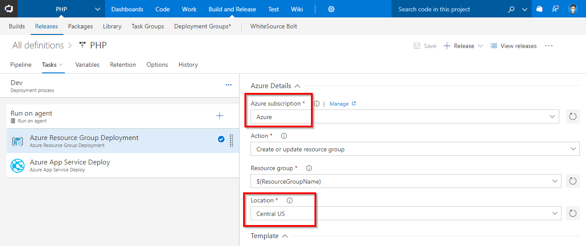

1. Under **Azure App Service Deploy** task, update **Azure subscription** and click **Save**.

   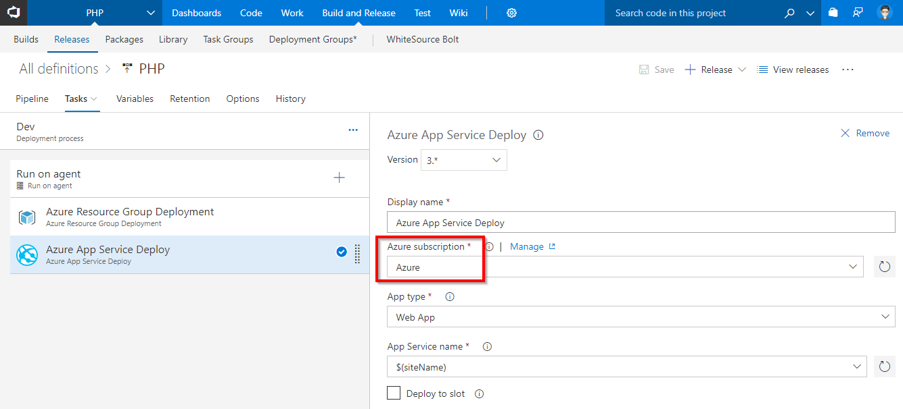

   <table width="70%">
    <thead>
      <tr>
        <th width="60%"><b>Tasks</b></th>
        <th><b>Usage</b></th>
      </tr>
    </thead>
    <tr>
      <td> <b>Azure Resource Group Deployment</b></td>
      <td>Uses the provided ARM template to create a resource group with App Service plan and App Service</td>
    </tr>
    <tr>
      <td> <b>Azure App Service Deploy</b></td>
      <td>deploys a PHP application to the created App service</td>
    </tr>
   </table>

## Exercise 3: Deploying the application

**PHP** is an interpreted language, so we don't have to compile the code. Instead we will create an archive file which will be deployed to the Azure App Service.

Let's make a code change to trigger a CI-CD pipeline to build and deploy the application.

1. Go to **Code** tab and navigate to the below path to edit the file.

   >php/config.php

   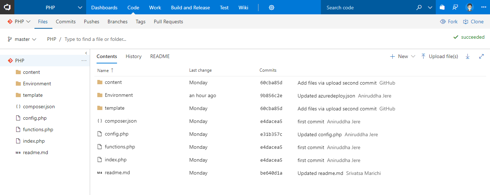

1. Go to line number **11**, modify **PHP** to **DevOps for PHP using VSTS** and commit the code.

   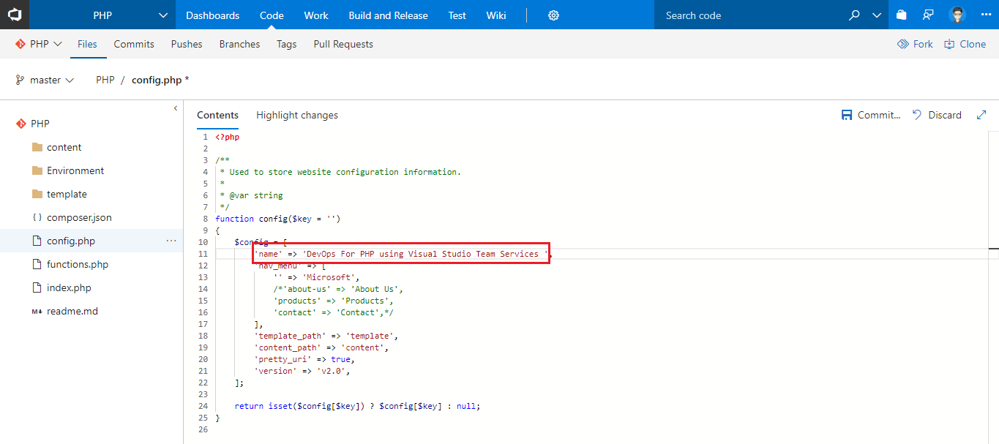

1. Go to **Builds** tab under **Build and Release** tab to see the associated CI build in progress.

   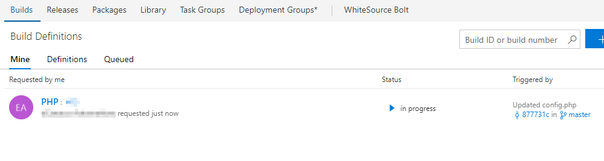

   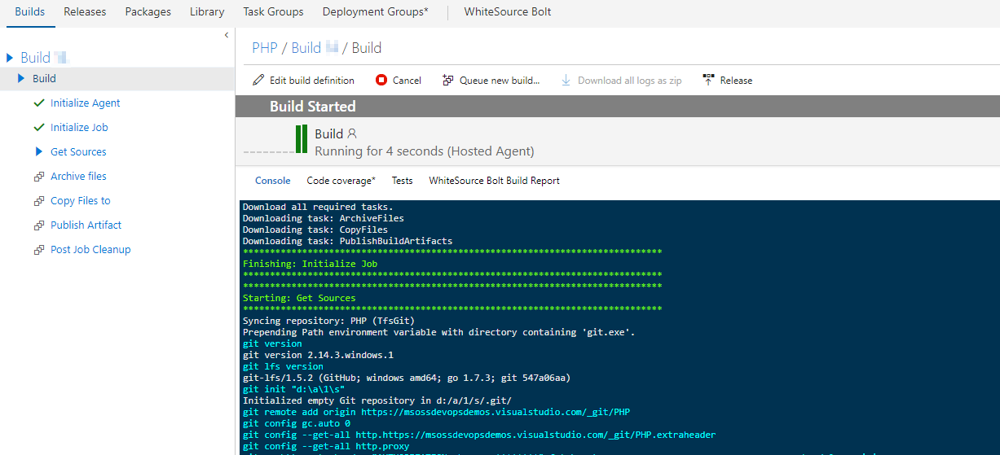

   Let's explore the build definition. The tasks used in the build definition are listed as shown.

   <table width="70%">
    <thead>
      <tr>
        <th width="60%"><b>Tasks</b></th>
        <th><b>Usage</b></th>
      </tr>
    </thead>
    <tr>
      <td> <b>Archive files</b></td>
      <td>We will archive all the files in the folder to a zip file</td>
    </tr>
    <tr>
      <td> <b>Copy Files</b></td>
      <td>Copy the ARM template and the Zip file to the artifact folder</td>
    </tr>
    <tr>
      <td> <b>Publish Build Artifacts</b></td>
      <td>Publish the build artifacts so that it is available to the Release pipeline</td>
    </tr>
   </table>

1. Once the build is complete, it triggers the CD pipeline. You can notice the linked release is in progress by navigating to **Releases** under **Build and Release**. The release will provision the Azure Web app and deploy the zip file generated by the associated build.

   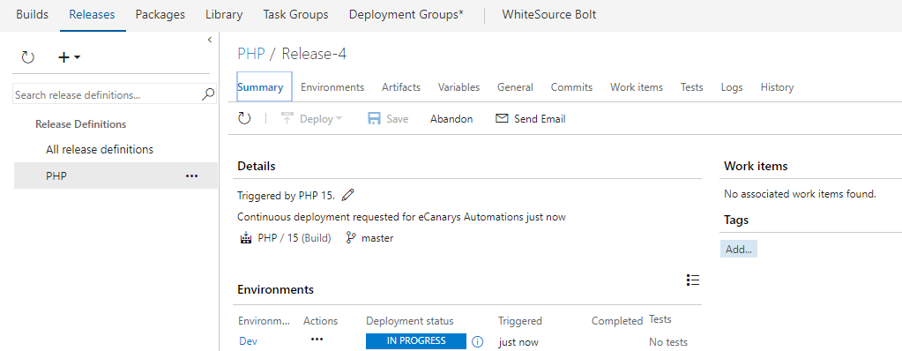

1. Alternatively, you can also login to the [Azure Portal](https://portal.azure.com){:target="_blank"} and navigate to the **Resource Group** that contains the Web App that was provisioned in the CD pipeline

   

1. Select the **App Service** and from the **Overview** tab,  click **Browse** to see the application deployed.

   
