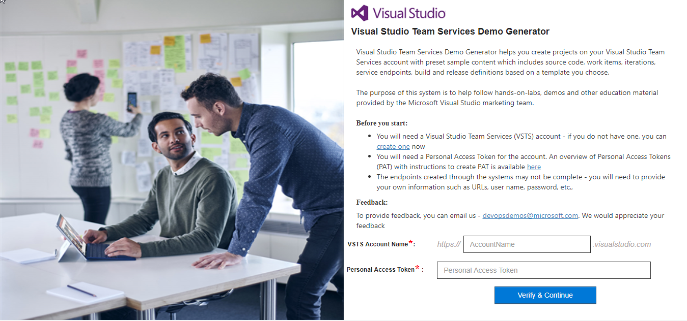
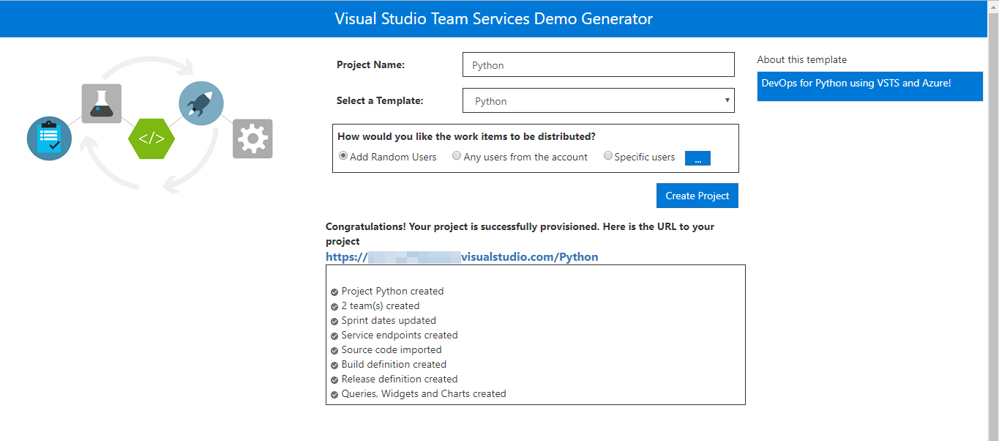
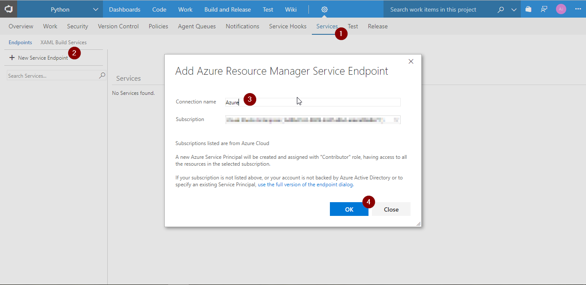
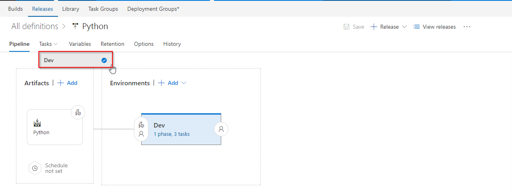

Last updated : {{ "now" | date: "%b %d, %Y" }}.

## Overview

**Python** is a server-side scripting language and a powerful tool for making dynamic and interactive web pages.

This lab shows how to deploy a **Python** application to **Azure App Service** from  **Visual Studio Team Services**. We will use  with [Django](https://www.djangoproject.com/){:target="_blank"} framework for deployment.

### Prerequisites for the lab

1. **Microsoft Azure Account**: You will need a valid and active Azure account for the Azure labs. If you do not have one, you can sign up for a [free trial](https://azure.microsoft.com/en-us/free/){:target="_blank"}

    * If you are an active Visual Studio Subscriber, you are entitled for a $50-$150 credit per month. You can refer to this [link](https://azure.microsoft.com/en-us/pricing/member-offers/msdn-benefits-details/){:target="_blank"} to find out more information about this including how to activate and start using your monthly Azure credit.

    * If you are not a Visual Studio Subscriber, you can sign up for the FREE [Visual Studio Dev Essentials](https://www.visualstudio.com/dev-essentials/){:target="_blank"} program to create a **Azure free account** (includes 1 year of free services, $200 for 1st month).

1. You will need a **Visual Studio Team Services Account**. If you do not have one, you can sign up for free [here](https://www.visualstudio.com/products/visual-studio-team-services-vs){:target="_blank"}

1. You will need a **Personal Access Token** to set up your project using the **VSTS Demo Generator**. Please see this [article](https://docs.microsoft.com/en-us/vsts/accounts/use-personal-access-tokens-to-authenticate){:target="_blank"} for instructions to create your token.

    

## Setting Up the VSTS Project

1. Use the [VSTS Demo Generator](https://vstsdemogenerator.azurewebsites.net/?name=Python&templateid=77369){:target="_blank"} to provision a Python project on your VSTS account.

   > **VSTS Demo Generator** helps you create team projects on your VSTS account with sample content that include source code, work items,iterations, service endpoints, build and release definitions based on the template you choose during the configuration.

    

1. Once the project is provisioned, click the URL to navigate to the project.

    

## Exercise 1: Endpoint Creation

Since the connections are not established during project provisioning, we will manually create the endpoints.

In VSTS, navigate to **Services** by clicking the gear icon, and click  **+ New Service Endpoint**. Select **Azure Resource Manager**. Specify connection name, select your subscription from the drop down and click OK. We use this endpoint to connect VSTS with Azure.

   

   You will be prompted to authorize this connection with Azure credentials.

   

## Exercise 2: Configure Release

We will provision the resources on **Azure** using ARM template in the **release definition**.



1. Go to **Releases** under **Build and Release** tab, Select release definition **Python** and click **Edit**

   

1. Go to **Tasks** and select **Dev** environment.

   

1. Under **Azure Resource Group Deployment** task, update **Azure subscription** and **Location**.

   

1. Under **Install Python Extension** task, update **Azure subscription**.

   

1. Under **Azure App Service Deploy** task, update **Azure subscription** and click **Save**.

   

   <table width="75%">
    <thead>
        <tr>
          <th width="67%"><b>Tasks</b></th>
          <th><b>Usage</b></th>
        </tr>
    </thead>
    <tr>
        <td> <b>Azure Resource Group Deployment</b></td>
        <td>This task will create a resource group with the name <b>Python</b> and  provision an <b>App service</b> and <b>App Service Plan</b> </td>
    </tr>
        <tr>
            <td> <b>Install Python Extension </b></td>
            <td>Installs the specific version of Python into Azure App Service</td>
        </tr>
    <tr>
        <td> <b>Azure App Service Deploy</b></td>
        <td>The task is used to update Azure App Service to deploy Web Apps to azure.</td>
    </tr>
   </table>

## Exercise 3: Trigger CI-CD with code change

**Python** is an interpreted language, and hence compilation is not required. We will archive the files in the build and use the package in the release for deployment. Update the code to trigger CI-CD using **Hosted build agent**.

1. Go to **Code** tab and navigate to the below path to edit the file.

   

   

1. Go to line number **32**, modify **Continuous Delivery** to **Continuous Delivery for Python** and commit the code.

   

1. Go to **Builds** tab under **Build and Release** tab to see the build in progress.

   

   

   Let's explore the build definition while the build is in-progress. The tasks used are listed as shown.

   <table width="80%">
    <thead>
      <tr>
         <th width="60%"><b>Tasks</b></th>
         <th><b>Usage</b></th>
      </tr>
    </thead>
    <tr>
        <td> <b>Archive files</b></td>
        <td>creates zip file for deployment</td>
    </tr>
    <tr>
        <td> <b>Copy Files</b></td>
        <td>copies ARM template which is used to provision resources on azure </td>
    </tr>
    <tr>
        <td> <b>Publish Build Artifacts</b></td>
        <td> publishes the build artifacts </td>
    </tr>
    </table>

1. The build generates artifact which is used for deployment to Azure.

   

1. Once the build is complete, it triggers the CD pipeline. You can notice the linked release is in progress by navigating to Releases under Build and Release. The release will provision the Azure Web app and deploy the zip file generated by the associated build.

   

   

1. Login to [Azure Portal](https://portal.azure.com){:target="_blank"} and go to  the **Resource Group** with the name **Python**. You will see the resources **App Service** and **App Service Plan**.

   

1. Select the **App Service** and from the Overview tab, click Browse to see the application deployed.

   

## Summary

This lab shows how to create a continuous integration(CI) and continuous deployment (CD) pipeline for Python code with Visual Studio Team Services (VSTS) on Azure.
