

## Overview

**Python** is a server-side scripting language and a powerful tool for making dynamic and interactive web pages.

This lab shows how to deploy a **Python** application to **Azure App Service** using **Azure DevOps**. We will be using [Django](https://www.djangoproject.com/){:target="_blank"} framework for deployment.

Want additional learning? Check out the <a href="https://docs.microsoft.com/en-us/learn/modules/deploy-python/" target="_blank"><b><u> Automate Python deployments with Azure Pipelines </u></b></a> module on Microsoft Learn.

### Prerequisites for the lab

1. Refer the [Getting Started](../Setup/) page to know the prerequisites for this lab.

1. Click the [Azure DevOps Demo Generator](https://azuredevopsdemogenerator.azurewebsites.net/?Name=Python&TemplateId=77369) link and follow the instructions in [Getting Started](../Setup/) page to provision the project to your **Azure DevOps**.

## Exercise 1: Examine the source code

In this lab, you will use a simple **Python** web application built using **Django** framework. **Django** is a high-level Python Web framework that encourages rapid development and clean, pragmatic design. 
In this exercise, you will examine the source code provisioned by [Azure DevOps Demo Generator](https://azuredevopsdemogenerator.azurewebsites.net/?Name=Python&TemplateId=77369).

1. Navigate to the project you created above using [Azure DevOps Demo Generator](https://azuredevopsdemogenerator.azurewebsites.net/?Name=Python&TemplateId=77369).

1. Select **Repos**. In this repository you have 

   * **Application** folder which has a web application developed using Python and Django
   * **unit_tests** folder has few unit test cases which can be executed as part of your CI pipeline
   * **functional_test** folder which has a Selenium test case which can be executed as part of the CD pipeline after the application deployed.

     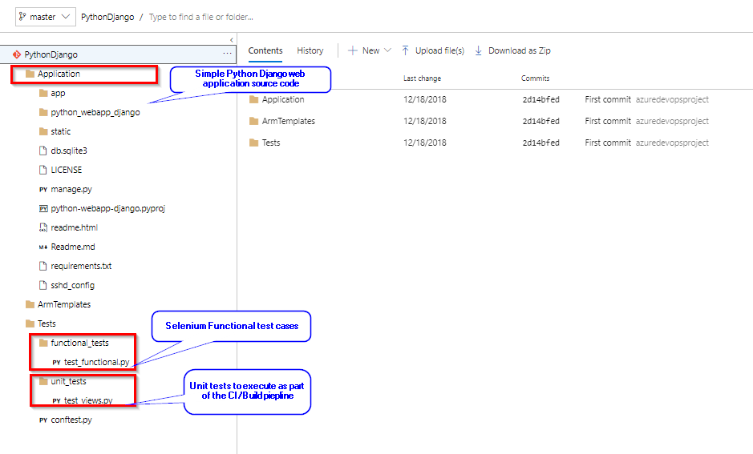

   In the following exercises, we will Build this application using Azure DevOps CI pipeline and Deploy the application to Azure App service using Azure DevOps CD pipeline.

## Exercise 2: Examine the CI pipeline

**Python** is an interpreted language, and hence compilation is not required. In this exercise, we will run unit tests and we will archive the application files to use in the release for deployment.

1. Navigate to **Pipelines –> Builds**. Select **Python-CI** and click **Edit**.

    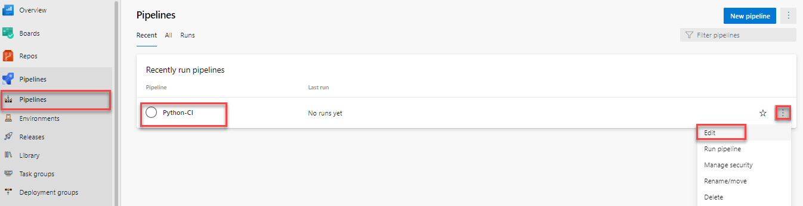

1. Your build pipeline will look like as below. This pipeline has tasks to install dependencies of application, run unit tests, archive& publish the application into a zip file (package) which can be deployed to a web application.

     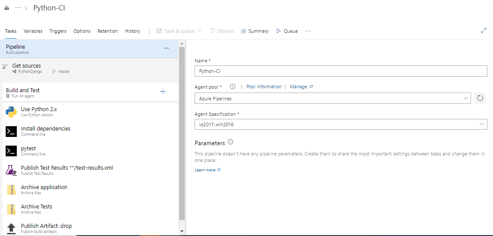

1. Select **[Use Python Version](https://docs.microsoft.com/en-us/azure/devops/pipelines/tasks/tool/use-python-version?view=vsts)** task. This task is used in a build or release pipeline to select a version of Python to run on an agent, and optionally add it to PATH.
   
      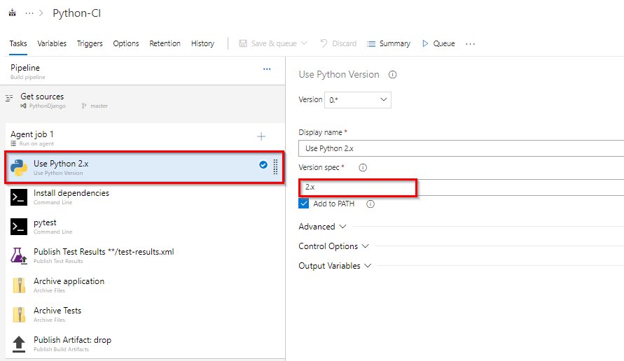

1. Select **Install dependencies** task. In this task, we are using [Command Line task](https://docs.microsoft.com/en-us/azure/devops/pipelines/tasks/utility/command-line?view=vsts&tabs=yaml) to install dependencies of the application like Django framework version etc..

   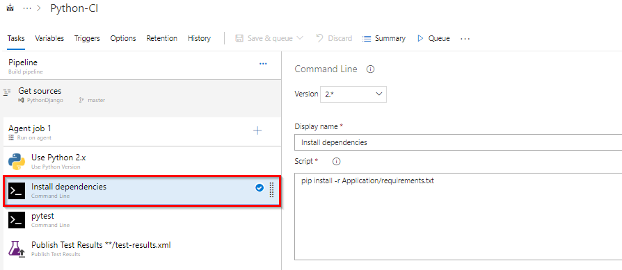

1. Select **pytest** task. In this task also we are using [Command Line task](https://docs.microsoft.com/en-us/azure/devops/pipelines/tasks/utility/command-line?view=vsts&tabs=yaml) to run **Unit tests** using **[pytest](https://docs.pytest.org/en/latest/)** and publish the test results to **test-results.xml** file.
  
    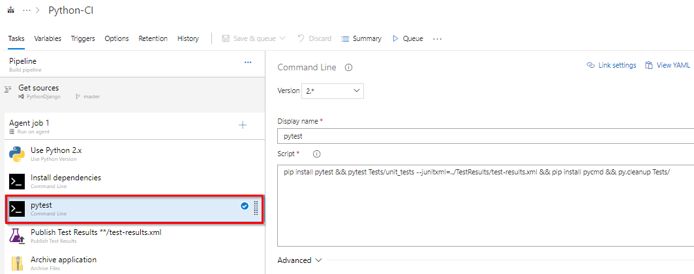

1. Select **[Publish Test Results](https://docs.microsoft.com/en-us/azure/devops/pipelines/tasks/test/publish-test-results?view=vsts&tabs=yaml)**. Using this task we will publish the test results form the previous task to Azure Pipelines. The published test results will be displayed in the **Tests** tab in a build or release summary.

   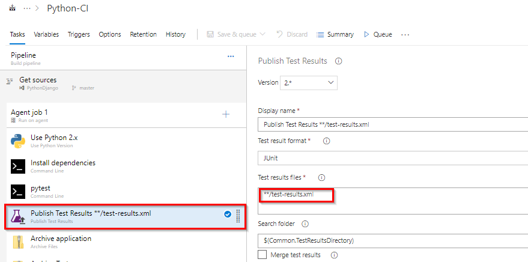

1. Select **Archive application** task. Using [Archive files](https://docs.microsoft.com/en-us/azure/devops/pipelines/tasks/utility/archive-files?view=vsts) task we are creating a **zip** (package) file from the application folder to use in the release pipeline.

     

1. Select **Archive Tests** task. We have few Selenium functional tests which need to be executed after the deployment in the release pipeline. Using [Archive files](https://docs.microsoft.com/en-us/azure/devops/pipelines/tasks/utility/archive-files?view=vsts) task we are creating a **zip** (package) file from Tests folder to use in the release pipeline.

     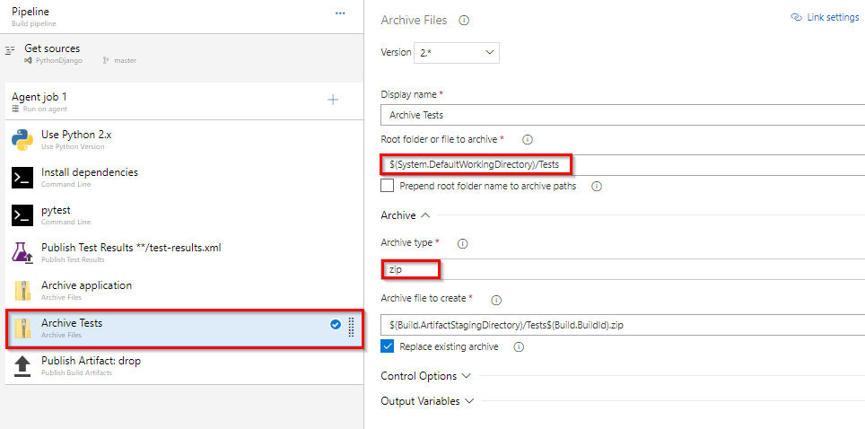

1. Select **[Publish Artifacts](https://docs.microsoft.com/en-us/azure/devops/pipelines/tasks/utility/publish-build-artifacts?view=vsts)** task. This task is used to publish build artifacts (Application and Tests packages from previous tasks) to Azure Pipelines.

   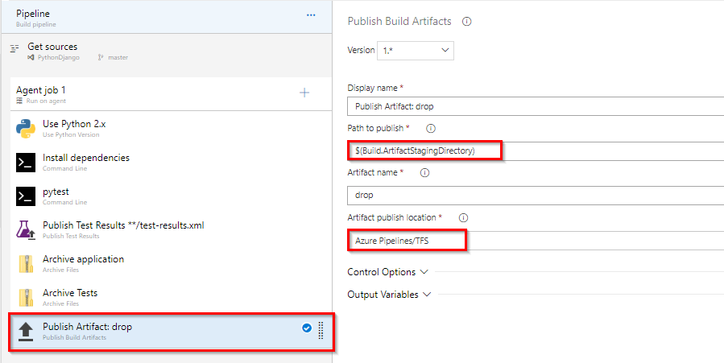

1. Select **Triggers** and **[Enable continuous integration](https://docs.microsoft.com/en-us/azure/devops/pipelines/get-started-designer?view=vsts&tabs=new-nav#enable-continuous-integration-ci)** trigger. A continuous integration trigger on a build pipeline indicates that the system should automatically queue a new build whenever a code change is committed. **Save** changes.

   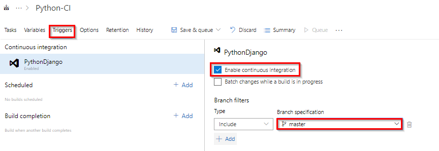

## Exercise 3: Configure Release pipeline

In this exercise, you will configure release (CD) pipeline to create Azure resources using Azure CLI  as part of your deployment and deploy the Python application to the App service provisioned.

1. Go to **Releases** under **Pipelines** tab, select release definition **Python-CD** and click **Edit** pipeline.
   
   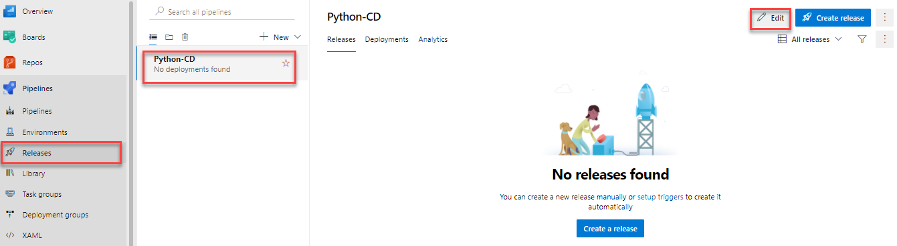

1. Select **Dev** stage and click **View stage tasks** to view the pipeline tasks.

   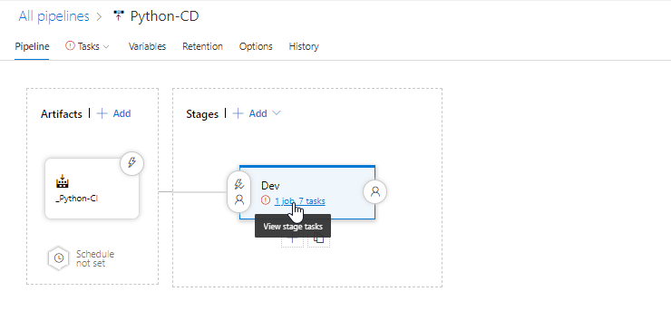

1. You will see the tasks as below.

   
   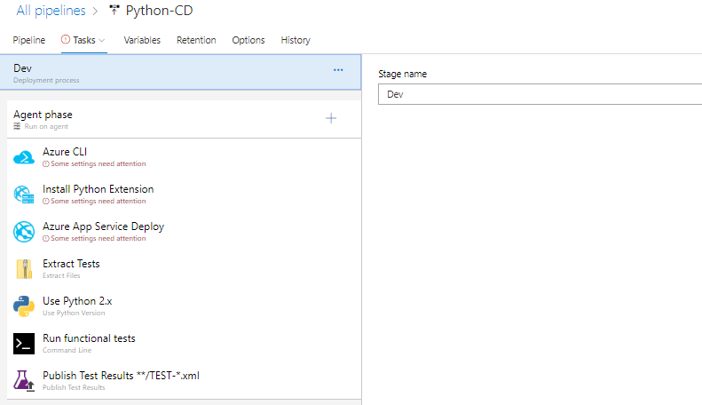

1. Select the **Azure CLI** task. Select the Azure subscription from the drop-down list and click **Authorize** to configure Azure service connection. 

    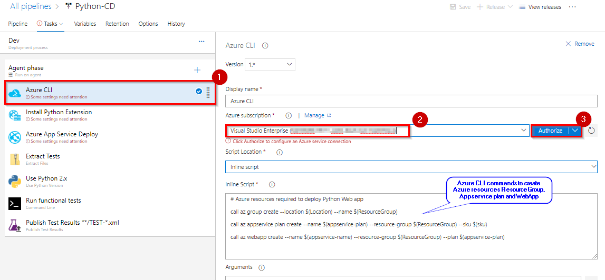

   In this task we are using Azure CLI commands to create Azure Resources required to deploy Python web application.

   If you observe the commands you will see few variables like **$(Location), $(ResourceGroup)** etc.. These are the required values to deploy resources and the values are defined in **Variables** section. If required you can modify this variable values as desired.
      
    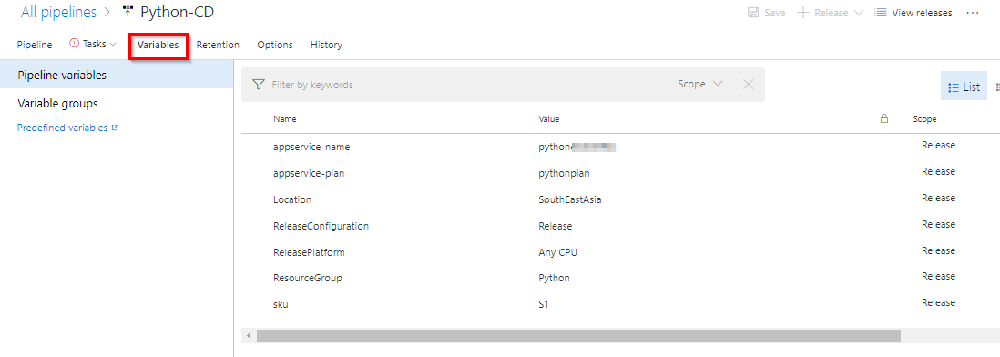

1. Select **Azure App Service Manage** task. Select the service connection for the Azure Subscription where the resources are created above. Using this task we are installing Python Extension for Azure App service created in previous task to support Python web application. Make sure App Service name is set to variable **$(appservice-name)**

    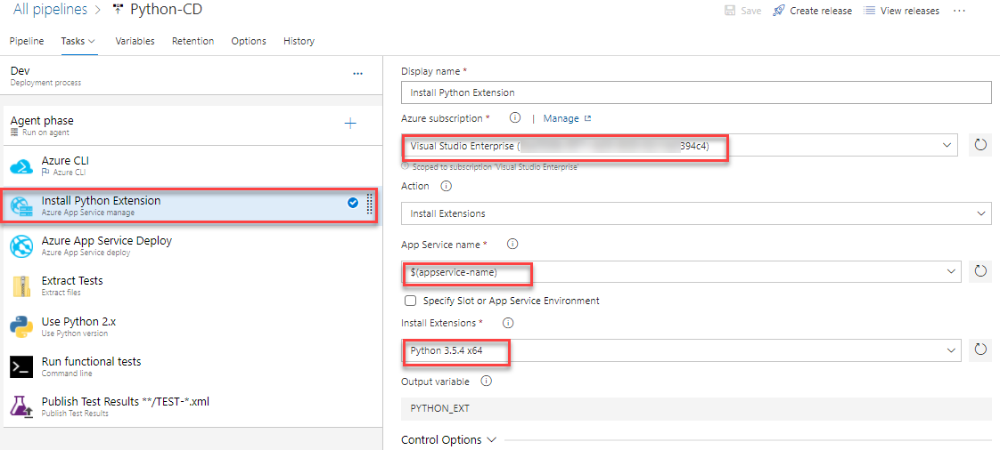

1. Select **Azure App Service Deploy** task. Make sure the settings are as shown below. This task is used to deploy Application package to Azure app service which is provisioned above.

    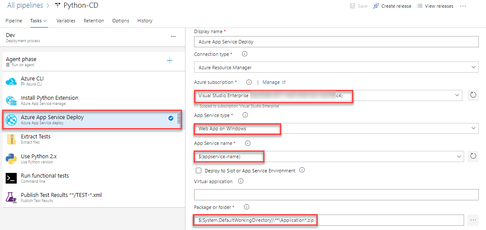

1. Select **Run Functional Tests** task. Here we are using Command line task to run Selenium tests after the application deployed to the Azure app service. And the test results will be published to release summary using **Publish Test Results** task.

    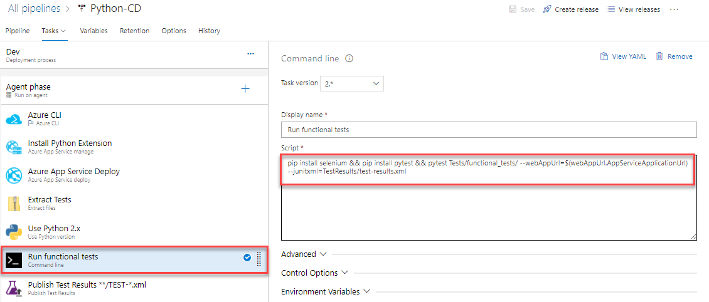

1. Let us enable **Continuous deployment trigger**. Select **Pipelines** and click ****Continuous deployment trigger** option. Enable the trigger and **Save** the changes.
    
      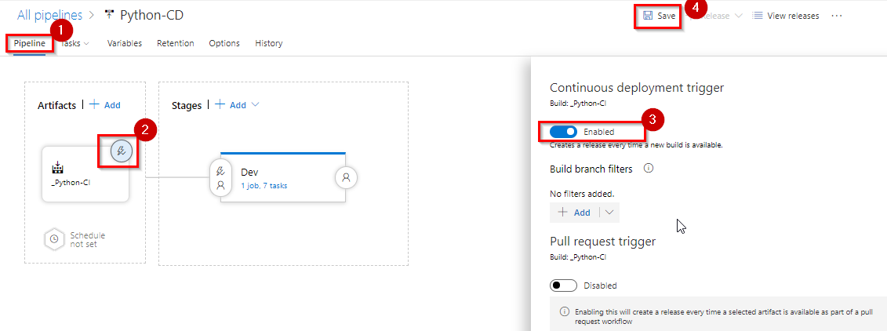

 Now you have configured a release pipeline to provision required Azure resources, Deploy the web application and Run functional tests. 

## Exercise 4: Trigger Build and Release pipeline with a code change

   In the previous exercises, we have configured build and release pipelines and enabled CI-CD. Let us update the code to trigger CI-CD.

1. Go to **Repos** tab and navigate to the below path to edit the file.

   `Application/app/templates/app/index.html`

     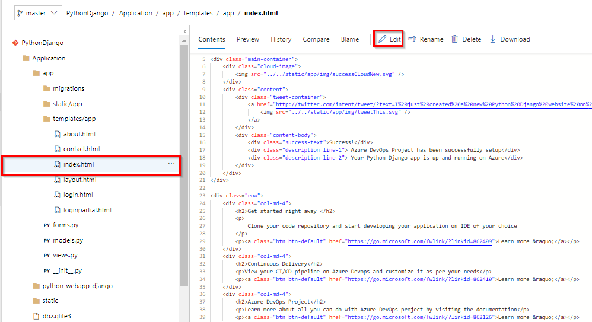

 1. Click on **Edit** and go to line number 32, modify **Continuous Delivery** to **Continuous Delivery for Python** and **Commit** the code.
    
     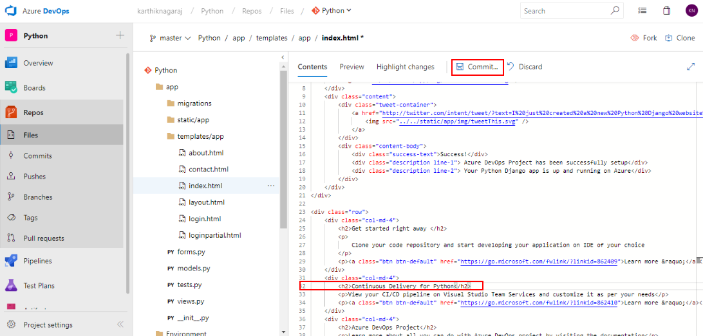

 1. Since we have enabled CI-CD triggers a build will be queued automatically. Go to **Builds**, under **Pipelines** tab to see the build in progress.

     
  
    You would be able to see the test results under **Tests** tab in build summary. Once the build is complete, it triggers the CD pipeline. You can notice the linked release is in progress by navigating to Releases under Pipelines. The release will provision the Azure Web app and deploy the zip file generated by the associated build.

1. Now go to **Releases**, under **Pipelines** tab to see the release in progress.

     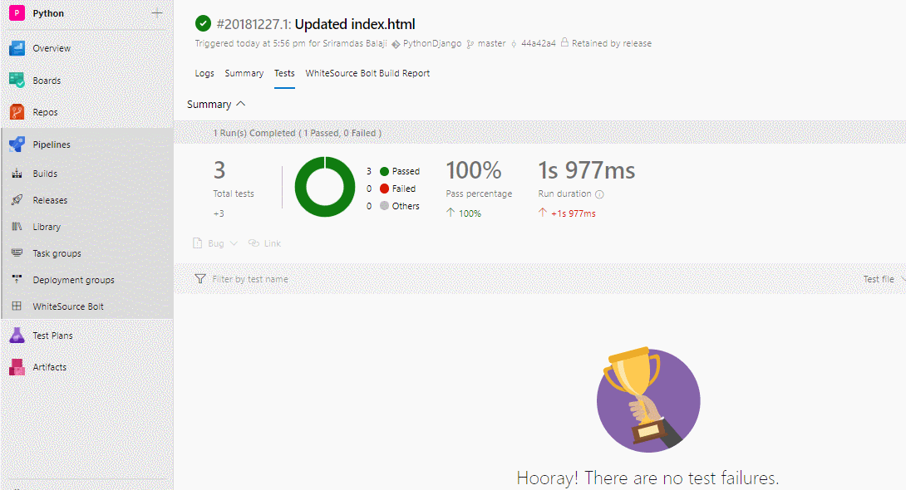

1. Once the Release succeeds, login to [Azure Portal](https://portal.azure.com) and go to the **Resource Group** with the name **Python**. You will see the resources **App Service** and **App Service Plan**.
Select the **App Service** and from the Overview tab, click on **Browse** to see the application deployed.

     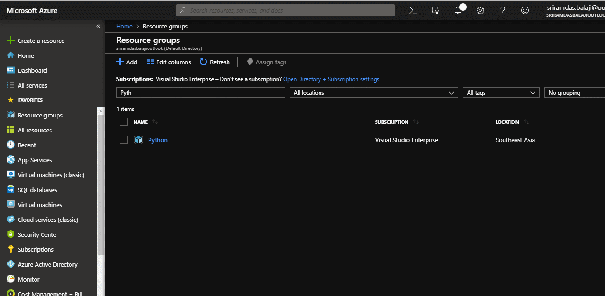

## Summary

This lab shows how to create a continuous integration(CI) and continuous deployment (CD) pipeline for Python code with Azure DevOps on Azure.
