Last updated : {{ "now" | date: "%b %d, %Y" }}.

## Overview

**Python** is a server-side scripting language and a powerful tool for making dynamic and interactive web pages.

This lab shows how to deploy a **Python** application to **Azure App Service** using **Azure DevOps**. We will be using [Django](https://www.djangoproject.com/){:target="_blank"} framework for deployment.

### Prerequisites for the lab

1. Refer the [Getting Started](../Setup/) page to know the prerequisites for this lab.

1. Click the [Azure DevOps Demo Generator](https://azuredevopsdemogenerator.azurewebsites.net/?Name=Python&TemplateId=77369) link and follow the instructions in [Getting Started](../Setup/) page to provision the project to your **Azure DevOps**.

## Exercise 1: Endpoint Creation

Since the connections are not established during project provisioning, you will manually create the endpoints.

In **Azure DevOps**, navigate to **Project settings**, under **Pipelines** select **Service connections**, click on **+ New service connection** and select **Azure Resource Manager**. Specify connection name, select your subscription from the drop down and click on OK. We use this endpoint to connect Azure DevOps with Azure.

  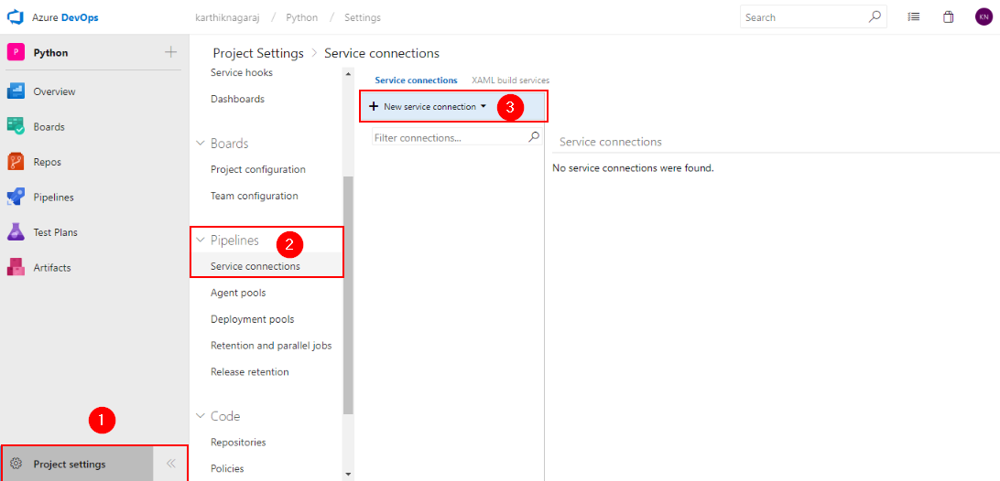

   You will be prompted to authorize this connection with Azure credentials.

   

   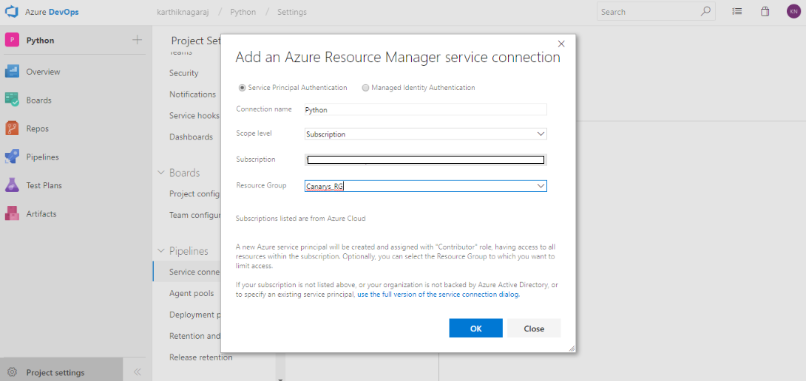

## Exercise 2: Configure Release

You will provision the resources on **Azure** using ARM template in the **release definition**.



1. Go to **Releases** under **Pipelines** tab, select release definition **Python** and click **Edit pipeline**

   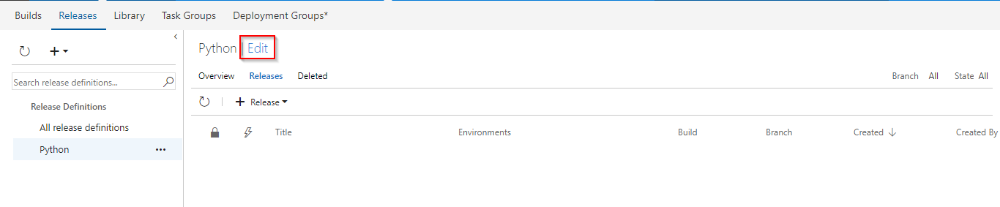

1. Go to **Tasks** and select **Dev** environment, under **Azure Deployment** task, update **Azure subscription** and **Location**.

   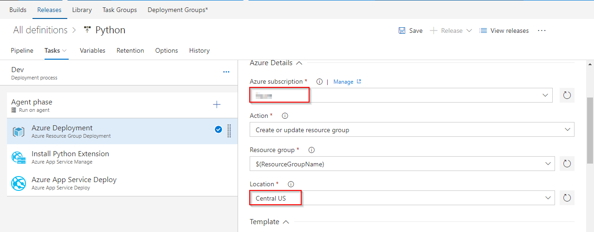

1. Under **Install Python Extension** task, update **Azure subscription** and select **Python 3.6.4 x86** in **Install Extensions**.

   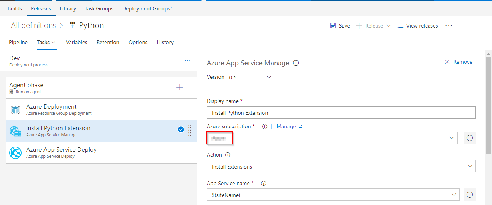

1. Under **Azure App Service Deploy** task, update **Azure subscription** and click on **Save**.

   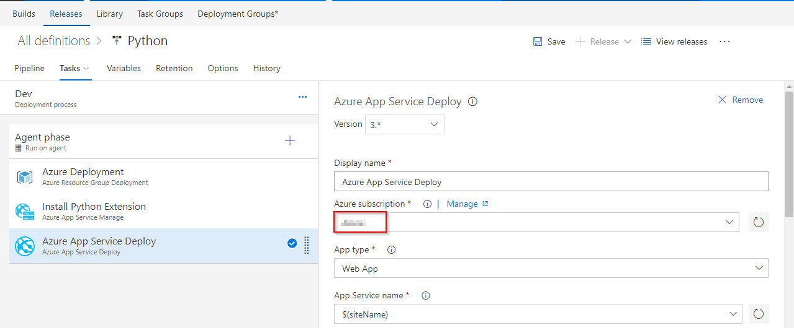

   <table width="75%">
    <thead>
        <tr>
          <th width="67%"><b>Tasks</b></th>
          <th><b>Usage</b></th>
        </tr>
    </thead>
    <tr>
        <td> <b>Azure Resource Group Deployment</b></td>
        <td>This task will create a resource group with the name <b>Python</b> and  provision an <b>App service</b> and <b>App Service Plan</b> </td>
    </tr>
        <tr>
            <td> <b>Install Python Extension </b></td>
            <td>Installs the specific version of Python into Azure App Service</td>
        </tr>
    <tr>
        <td> <b>Azure App Service Deploy</b></td>
        <td>The task is used to update Azure App Service to deploy Web Apps to azure.</td>
    </tr>
   </table>

## Exercise 3: Trigger CI-CD with code change

**Python** is an interpreted language, and hence compilation is not required. We will archive the files in the build and use the package in the release for deployment. Update the code to trigger CI-CD using **Hosted build agent**.

1. Go to **Repos** tab and navigate to the below path to edit the file.

   

   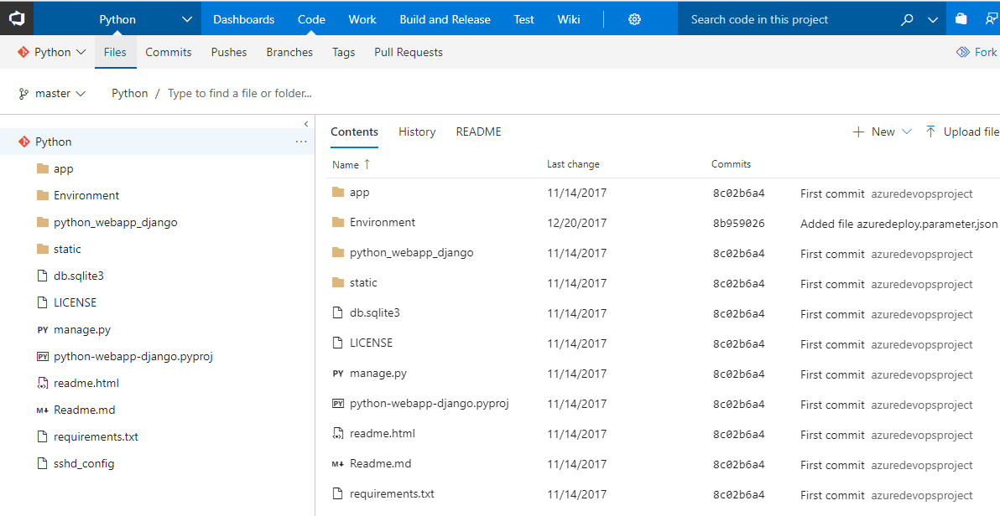

1. Click on **Edit** and go to line number **32**, modify **Continuous Delivery** to **Continuous Delivery for Python** and commit the code.

   

1. Go to **Builds**, under **Pipelines** tab to see the build in progress.

   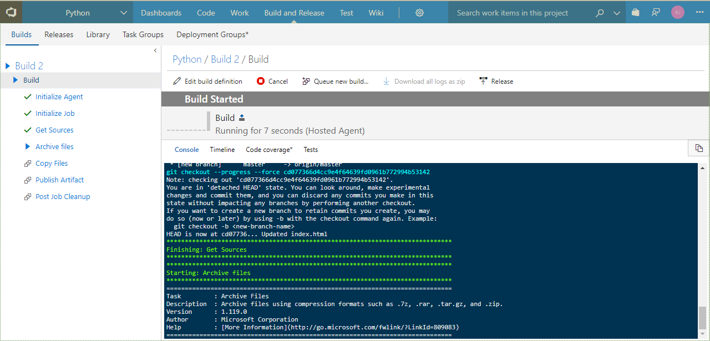

   Let's explore the build definition while the build is in-progress. The tasks used are listed as shown.

   <table width="80%">
    <thead>
      <tr>
         <th width="60%"><b>Tasks</b></th>
         <th><b>Usage</b></th>
      </tr>
    </thead>
    <tr>
        <td> <b>Archive files</b></td>
        <td>creates zip file for deployment</td>
    </tr>
    <tr>
        <td> <b>Copy Files</b></td>
        <td>copies ARM template which is used to provision resources on azure </td>
    </tr>
    <tr>
        <td> <b>Publish Build Artifacts</b></td>
        <td> publishes the build artifacts </td>
    </tr>
    </table>

1. The build generates artifact which is used for deployment to Azure.

   

1. Once the build is complete, it triggers the CD pipeline. You can notice the linked release is in progress by navigating to Releases under Pipelines. The release will provision the Azure Web app and deploy the zip file generated by the associated build.

   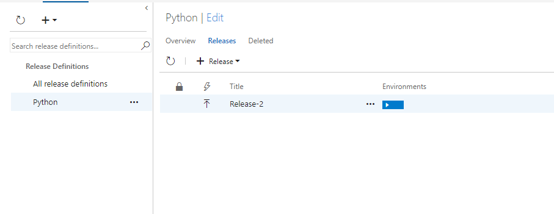

   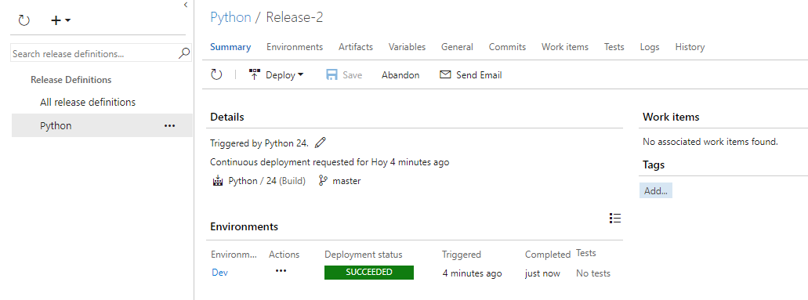

1. Login to [Azure Portal](https://portal.azure.com){:target="_blank"} and go to  the **Resource Group** with the name **Python**. You will see the resources **App Service** and **App Service Plan**.

   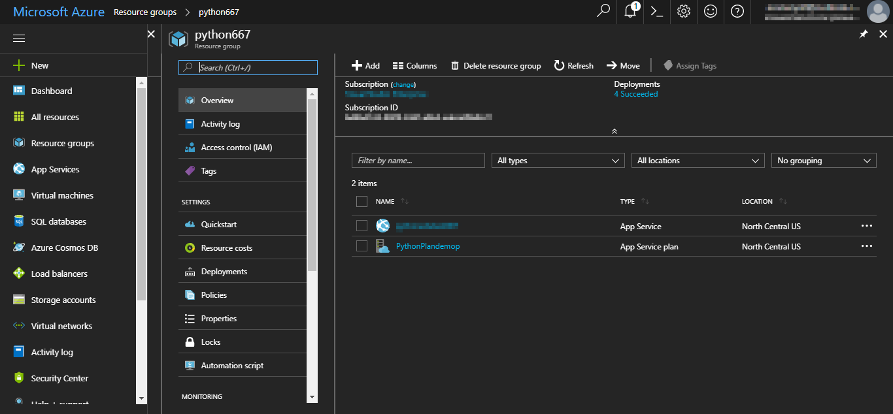

1. Select the **App Service** and from the Overview tab, click on **Browse** to see the application deployed.

   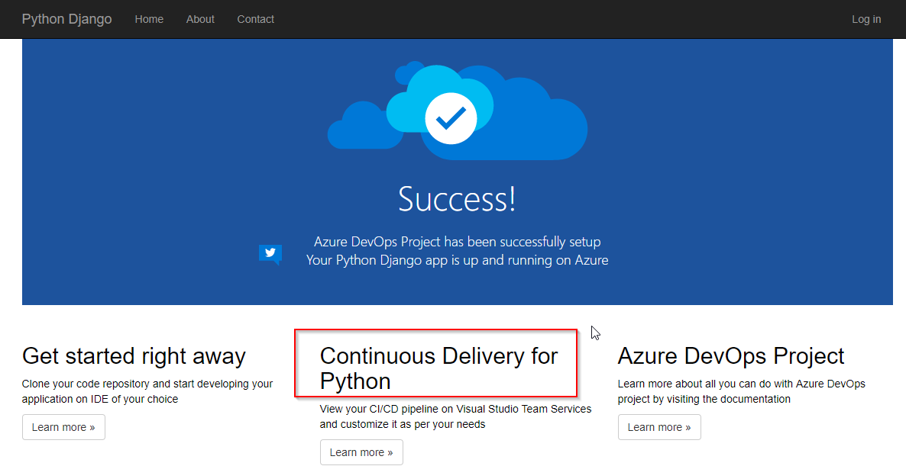

## Summary

This lab shows how to create a continuous integration(CI) and continuous deployment (CD) pipeline for Python code with Azure DevOps on Azure.
