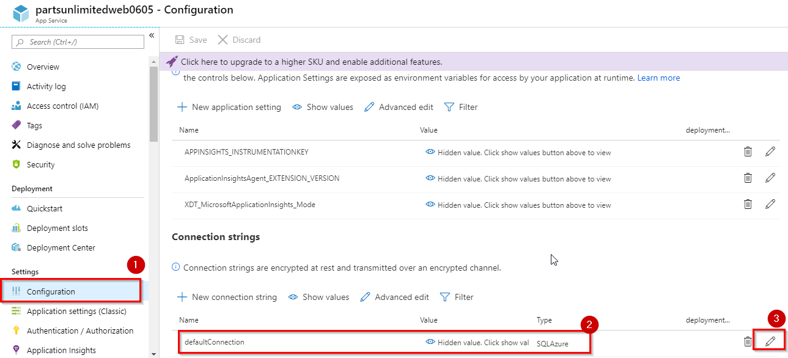
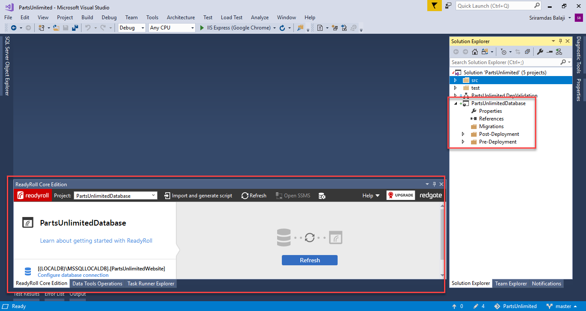

## Overview

**Database DevOps** has come of age. It is seen as a key technical practice which can contribute to the successful implementation of DevOps, thereby eliminating the database bottleneck and having the releases faster and easier.
A common blocker that prevents organizations from implementing DevOps is the database. It has unique requirements and often follows a completely different development process from the one used for application development. This is where [Redgate SQL Change Automation](https://documentation.red-gate.com/sca3/getting-started/about-sql-change-automation) tools helps in develop, source control, and safely automate SQL Server and Azure SQL database deployments from Visual Studio with [Redgate SQL Change Automation Core](https://documentation.red-gate.com/sca3/getting-started/about-sql-change-automation/sql-change-automation-core).

**Redgate SQL Change Automation** is a migrations-first database development and deployment tool inside Visual Studio, allowing you to extend DevOps processes to your SQL Server databases, so you can:

- Prevent the database from being a bottleneck to delivering value quickly
- Automate the deployment of database changes with precision and control
- Manage database changes alongside application changes for a single source of truth
- Integrate with the existing build and release tools including Azure DevOps and TFS

### What’s covered in this lab

In this lab, you will see
1.  How Redgate SQL Change Automation help to manage database changes alongside the application.
1.  How to automate deployments of SQL Server database changes alongside application changes.

### Before you begin

1. You will need an Azure DevOps account. If you do not have one, you can sign up for free [here](https://azure.microsoft.com/en-us/services/devops/)

1. You will need Visual Studio Enterprise 2017 or 2019 with [Redgate SQL Change Automation Core](https://marketplace.visualstudio.com/items?itemName=vs-publisher-306627.RedgateSqlChangeAutomation) extension installed. And the following extensions needs to be installed on your Azure DevOps organization.

   - [SQL Change Automation: Build](https://marketplace.visualstudio.com/items?itemName=redgatesoftware.redgateDlmAutomationBuild)
   - [SQL Change Automation: Release](https://marketplace.visualstudio.com/items?itemName=redgatesoftware.redgateDlmAutomationRelease)

1. **Microsoft Azure Account**: You will need a valid and active Azure account for this lab. If you do not have one, you can sign up for a [free trial](https://azure.microsoft.com/en-us/free/).

### Setting up the Environment

1. This lab requires you to complete Task 1 & 2 from  the [prerequisite](https://azuredevopslabs.com/labs/azuredevops/prereq/) instructions.

1. You need to provision a Web App and SQL Database on Azure. Click [here](https://portal.azure.com/#create/Microsoft.WebSiteSQLDatabase) to create a website and an Azure SQL Database together. Name the database as `PartsUnlimited-Prod` and make a note of SQL server admin login and password.

   

1. Once the resources are provisioned navigate to the Web App which you created. Select the **Configutaion** tab. Click the **defaultConnection** setting. Update the Name to **"DefaultConnectionString"**, which is the key expected by the application. This will enable it to connect to the database created for the app service. Click **Update**.

    

     

1. Click **Save** to apply the changes.

      

### Exercise 1: Add a ReadyRoll project to the PartsUnlimited solution.

Here, you will create a SQL Change Automation project in your existing PartsUnlimited application solution to manage database changes alongside the application. This SQL Change Automation project contain a database's state, and a set of scripts that describe how to get to that state.

1. This exercise requires to to complete Task 1 & 2 from the [prerequisite](https://azuredevopslabs.com/labs/azuredevops/prereq/) section.

1. Press **F5** or click on  **Start debugging** icon to build and run the application locally.
   
      

    The application will look like as below
     
    

1. Return to Visual Studio and click the **Stop** button to stop debugging the application.

    

1. Open **SQL Server Object Explorer** in Visual studio.
     
    

   From the **SQL Server Object Explorer** click **Add SQL server** icon  . Select **MSSQLLocalDB** from the local and click **Connect**.
       
    

1. In the *SQL Server* view, under **(localdb)\MSSQLLocalDB-->Databases**, you should be able to see **PartsUnlimitedWebsite** database.

     

1. Consider this database as the development database for this application and **Redgate Data Tools** will be used to manage database changes alongside the application.

1. The SQL database that was created earlier in Azure is a *blank* database. For the purpose of this lab, you will need to publish the current local database schema along with data to the Azure SQL database. You will then use the Azure SQL database as the baseline database.

1. In SQL Server Object Explorer, click **Add Server** and connect to the Azure SQL server which you created in the previous task.
   
   

   > If it prompts you a question to add your Client IP to the firewall in order to access the database, click **OK** to add your client IP to the SQL server firewall.

1. To migrate the schema from the LocalDB to the new SQL Azure instance, right-click the **PartsUnlimitedWebsite** Database and select the **Schema Compare** option.

   

   In the schema compare wizard,  select Azure SQL database (PartsUnlimited-Prod) as the *target* and click **Compare**.
   
   

   Click **Update** in the next wizard to update the schema to Azure SQL database (PartsUnlimited-Prod).
 
     

     

1. Similarly, to migrate the data from the LocalDB to the SQL Azure instance, right-click on the LocalDB instance, select the Data Compare tool and follow the walk through in the SQL Data Compare wizard.
  
   

   In the wizard, select Azure SQL database as *target* and click **Compare**.

   

   Click **Update** to move data to Azure SQL database.
   
   

   > Now you have two databases. One is local database **PartsUnlimitedWebsite** which will be assumed as your *development or sandbox* database. The second database on Azure (**PartsUnlimited-Prod**) will be assumed as the *Production* database. The changes you make to the application and the development database has to be deployed on to  Production. This is where the **SQL Change Automation** project helps us to manage database changes.

1. Now, you will create a SQL Change Automation project project. Right click on the solution and select **Add** **-->** **New Project**.

     

1. In **Add New Project** window search for **SQL**. Select **SQL Change Automation Project** template and click **Next** to create a project. 

   

1. In **Configure your new project** wizard enter the project name as **PartsUnlimitedDatabase** and Click **Create**.

   

   In **Set up a new SQL Change Automation Project** wizard, click **Get started**.

   

1. In **Database connections** wizard, select **Specify connection** under Development.

    
   In the resulting window, select **MSSQLLocalDB** as server and select **PartsUnlimitedWebsite** database. Click **OK**.

   

1. Now under **Deployment Target** section, select **Specify Connection** and select Azure SQL database.
  
   

1. In **Database connections** wizard, select **Next** and click **Create Baseline** in the next window to complete the project creation.

     

     
     

   > The schema of the Deployment Target will be read in order to create a baseline schema. This will not modify the Deployment Target in any way.

1. Now you should be able to see a database project added to your solution and also the **ReadyRoll Core Edition** window.

      

   > SQL Change Automation project automatically generates a migration script which represents the current schema on the deployment target – the baseline schema. Two folders are also generated, 1.0.0-Baseline and 1.1.0-Changes. The baseline schema migration script is automatically placed in the 1.0.0-Baseline folder, and the baseline schema can be deployed to your sandbox development environment by clicking Deploy project. You can then make changes in your development environment, which will be placed in 1.1.0-Changes.

### Exercise 2: Make the Database and Application changes

Now that the SQL Change Automation project is ready, you will need to make some changes to the database schema and data along with some code changes in the application.

### Lab Scenario: 
 Run the application locally once again. Press **F5** or click on  **Start debugging** icon to build and run the application locally.
   

If you observe in the home page, you have some discount on Oil and Filters products.

**Application code change**: Customer would like to have a discount on all products as a New Year offer. This requires a code change in the existing application.

**Database changes**: For the above application, update the pricing of the products in the database.

For example, under **Brakes** category the pricing needs to be updated with a discount.
  
  

Let us see how to manage database changes and deploy alongside the application.

1. In SQL Server Object Explorer, browse the **PartUnlimitedWebsite** database under LocalDB. Expand **‘Tables’** and right click on **Products** table, select **View Designer**.
   
   

1. Either you can do database schema changes in the design window or you can use **T-SQL**. Assuming that you need a new column in the Products table to show the price in USD, you will add a new column **PriceUSD** using designer (Schema change) and click **Update**.
  
   

   In **Preview Database updates** window, select **Generate Script**.
   
   

    This will add a new migration script in your database project with Schema changes. Click **Deploy Project** to verify the changes.

   
 
    > ReadyRoll generates numerically ordered SQL migration scripts that sit inside your Visual Studio project and take your schema from one version to the next. You can add these migration scripts to version control, use them to build and release, and automate database deployments, all in one process.

1. You can rename the script for better understanding.
  

1. Select **Products** table form the local database, right click and select **View Data**.

   

   You will need to update the Price column with 50% discount price.

   

1. Right click on the folder **1.1.0-Changes** and add new migration script manually. And rename the script to something like **PriceUpdate** as shown below.

   

1. In the renamed script, enter the following query to update the price to 50% discount and click **Deploy Project** to deploy changes to local db.

    ` 
    UPDATE dbo.Products SET Price = Price * 0.5
    `

    `
    GO
    `
     

1. To view the new price, select **Products** table and then **View Data** .
    
    

   You have made the database changes in your local and generated migration scripts. You will now change the application code.

1. Open **Index.html** file from the path `src\PartsUnlimitedWebsite\Views\Home\` , make the changes as shown below and save the changes.

   

1. Commit the changes to the server; create Build and Release pipelines in Azure DevOps to compile and deploy the changes. 

   In the **Team Explorer**, select **Changes**. Enter a commit comment and select **Commit All and Push** to commit the changes to the server.
   
    

    With this, you have added ReadyRoll Database project with version control support and committed the project to the Azure Repos.

### Exercise 3: Create Build pipeline in Azure DevOps

Now you have version controlled both the application and database project. Next, you will create a build pipeline to build your ReadyRoll Database project alongside your application.

1. Navigate to **Pipelines --> Builds** in your Azure DevOps organization. Select **New Build pipeline** to create new build pipeline.

     

   In the **Select a source** window make sure source settings are correct and click **Continue**.

1. In **Choose a template** section search for **ReadyRoll**, select **ReadyRoll** template and click **Apply**.

     

   > If you don't see the above template make sure you have installed **Redgate ReadyRoll** extension from [here](https://marketplace.visualstudio.com/items?itemName=redgatesoftware.redgate-readyroll).

1. Your build pipeline will look like as below. You can see that ReadyRoll tasks are added to the pipeline.

      

1. Select **Hosted VS2017** as agent pool.

    

1. Select **ReadyRoll Download Build Components** task. This task downloads the ReadyRoll build components using NuGet so that you don't have to install them manually.

    

1. Select **ReadyRoll Set Target Database** task.  This task makes it easy to configure the target database that ReadyRoll uses to generate reports. Select **Target type** as **Azure SQL Database**. Enter your Azure SQL database details which you created at the beginning of the lab.
    
    
    

1. Select **Visual Studio Build Solution** task. This task builds both the application and ReadyRoll database project. You will need to create packages for the application and database to deploy to the Azure web app and SQL database respectively. Replace the **MSBuild arguments** with the following to do so. And select **Restore Nuget Packages** checkbox to restore the Nuget packages before the build.

   `/p:GenerateSqlPackage=True @"$(Build.SourcesDirectory)\$(ReadyRoll.MsBuildResponseFileName)" /p:DeployOnBuild=true /p:WebPublishMethod=Package /p:PackageAsSingleFile=true /p:SkipInvalidConfigurations=true /p:PackageLocation="$(build.artifactstagingdirectory)\\"
`

   

1. Select **Variables**. Create a variable with name **TargetPassword** and enter your Azure SQL server admin password as value.
  
    

1. Select **Triggers**. Enable **Continuous Integration** trigger.
    
     

1. **Save & Queue** the build pipeline. 
   
   

1. Once the build succeeds, make sure **PartsUnlimited_DatabasePackage.ps1** and **PartsUnlimitedWebsite.zip** are available as part of the build Artifacts.

    

### Exercise 4: Create Release pipeline in Azure DevOps

Now you have both the application and database packages available as build artifacts. In this exercise, you will create a release pipeline to deploy your database package alongside your application.

1. Navigate to **Pipelines --> Releases** in your Azure DevOps organization. Select **New release pipeline** to create a new pipeline.

      

1. In **Select a template** wizard select **Azure App Service deployment** template and **Apply**.

    

1. Change the pipeline name. In this case, it is **PartsUnlimited-CD**. Click on **Add an artifact**.
 
      

1. In **Add an artifact** wizard, select the build pipeline which you created in the previous exercise as Source and click **Add**. 

      

1. Select **View stage tasks**. 
   
     

    In the next window select your Azure Sevice connection and App service name which you created at the beginning of this lab.

    

1. Click **+** icon to add a new task to the pipeline. Search for ReadyRool tasks and select **ReadyRoll Deploy Database Package** task.

   
    

    Now you have two tasks in the pipeline.

1. **Deploy Azure App Service**: Using this task you will deploy application package to Azure app service which was created. 

    

1. **ReadyRoll Deploy Database**: This deploy task will take the package produced by building a ReadyRoll project and deploy it to a target database. Select  **ReadyRoll Deploy Database** task and enter the details as shown in the image below.

      

1. Select **Variables**. Create a variable with name **TargetPassword** and enter your Azure SQL server admin password as value.

   

1. Select **Pipeline**. Enable **Continuous deployment** trigger and **Save** the changes.

    

1. Trigger the release pipeline manually. 

      

1. Once the release succeeds, navigate to your Azure portal. Select and browse the app that you created to view the application deployed. 

   You should be able to see the new changes reflecting in the application.

   

   When you select **Brakes** category, you can see the updated price as well which means that the database changes are also updated to the Production database along with the application.

   Since the CI & CD is enabled, if any database changes are committed, CI & CD will be triggered automatically and changes will be deployed.
