

## Overview

Perhaps you’re implementing **DevOps** processes for your application development, and already reaping the benefits of increased productivity, agility and performance across your team. **So what about the database?**
A common blocker that prevents organizations from implementing DevOps is the database. It has unique requirements and often follows a completely different development process from the one used for application development. This is where Redgate Data Tools helps in Develop, source control, and safely automate SQL Server and Azure SQL database deployments from Visual Studio with ReadyRoll-Core.

**ReadyRoll includes a new project type in Visual Studio that can be used as an alternative to the standard SQL Server Database Project**. This project helps, Extend DevOps processes to SQL Server databases with Redgate Data tools and Visual Studio.

- Prevent the database from being a bottleneck to delivering value quickly
- Automate the deployment of database changes with precision and control
- Manage database changes alongside application changes for a single source of truth
- Integrate with the existing build and release tools including Azure DevOps and TFS

### What’s covered in this lab

In this lab, you will see
1.	How Redgate data tools help to manage database changes alongside the application.
1.	How to automate deployments of SQL Server database changes alongside application changes.

### Before you begin

1. You will need an Azure DevOps account. If you do not have one, you can sign up for free [here](https://azure.microsoft.com/en-us/services/devops/)

1. You will need Visual Studio Enterprise 2017 with **Redgate Data Tools** installed. And [Redgate ReadyRoll Extension](https://marketplace.visualstudio.com/items?itemName=redgatesoftware.redgate-readyroll) needs to be installed on your Azure DevOps organization. For detailed instructions see [here](../redgateinstall).

1. **Microsoft Azure Account**: You will need a valid and active Azure account for this lab. If you do not have one, you can sign up for a [free trial](https://azure.microsoft.com/en-us/free/).

### Setting up the Environment

1. This lab requires you to complete Task 1 & 2 from  the [prerequisite](https://azuredevopslabs.com/labs/azuredevops/prereq/) instructions.

1. We need to provision Web App and SQL Database on Azure. Click [here](https://portal.azure.com/#create/Microsoft.WebSiteSQLDatabase) to create a Website and Azure SQL Database together. Keep the database name as something like PartsUnlimited-Prod. And make a note of SQL server admin login and password.

   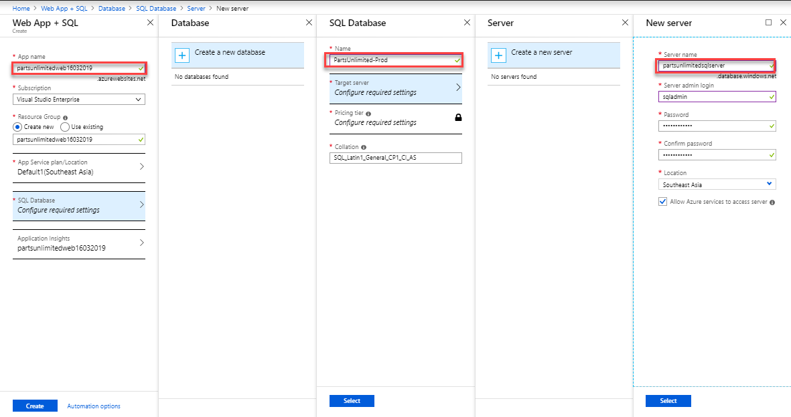

1. Once the resources are provisioned navigate to the Web App which you created. Select **Application Settings** and change the connection string name to **DefaultConnectionString**,  **Save** the changes.

    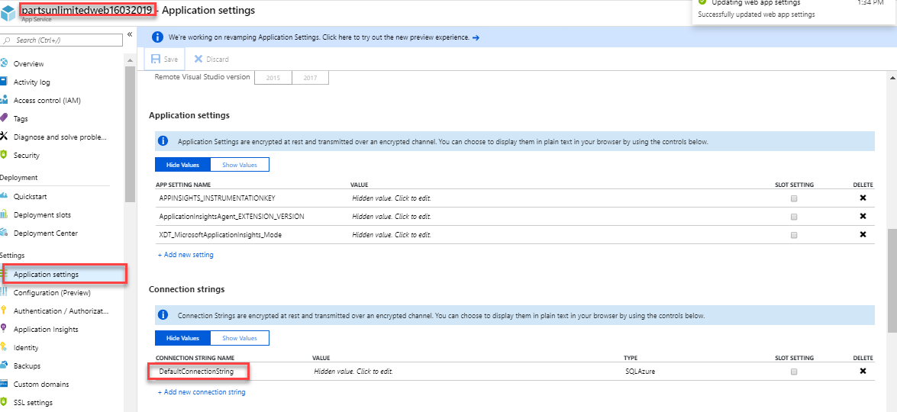

### Exercise 1: Adding a ReadyRoll project to the PartsUnlimited solution.

In this exercise, you will create a ReadyRoll project in your existing PartsUnlimited application solution to manage database changes alongside the application.

1. Hope you have completed Task 1 & 2 from the [prerequisite](https://azuredevopslabs.com/labs/azuredevops/prereq/) instructions.

1. Let us run the application locally once. Press **F5** or click on  **Start debugging** icon to build and run the application locally.
   
      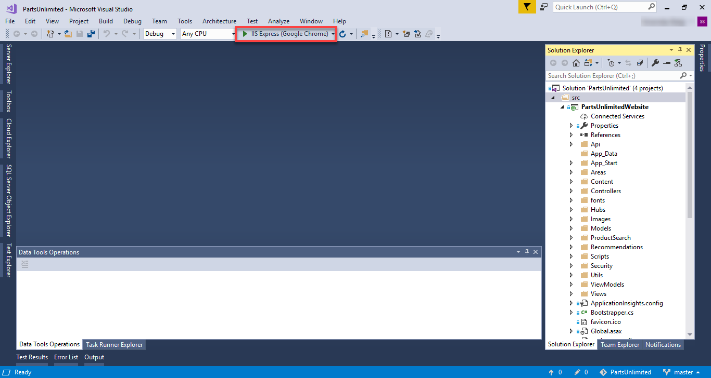

    The application will look like as below
     
    

    Close the application window to stop the debugging.

1. Open **SQL Server Object Explorer** in Visual studio.
     
    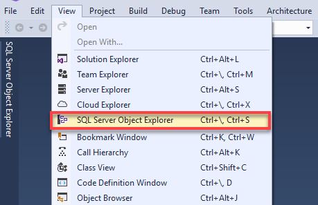

   From the **SQL Server Object Explorer** click **Add SQL server** icon  . Select **MSSQLLocalDB** from the local and click **connect**.
       
    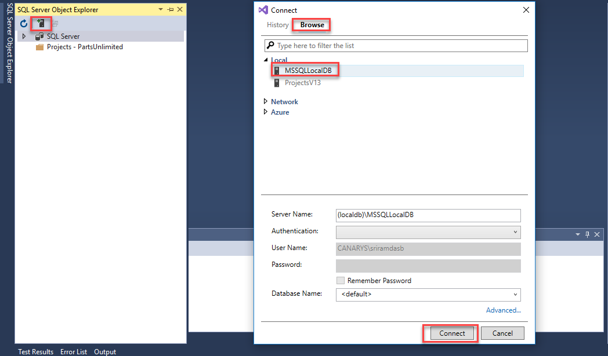

1. If you expand Databases under **MSSQLLocalDB** you should be able to see **PartsUnlimitedWebsite** database as shown below.
    
     

1. Let us consider that this is our development database for our application. And we would like to manage database changes alongside the application with the help of **Redgate Data Tools**.

1. The SQL database which you created in Azure is a blank database. For this lab purpose let us publish the current database schema and data to the SQL database on Azure. Assume that the Azure SQL database is our Production database and you would like to use that as Baseline Database.

1. In SQL Server Object Explorer click on **Add Server** icon and connect to the Azure SQL server which you have created in the previous task.
   
   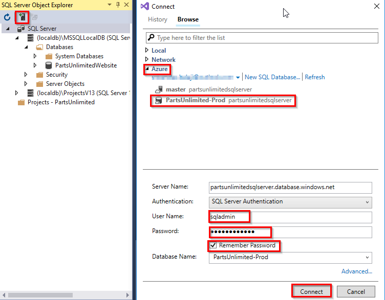

   > If it prompts you the question if you would like to add your Client IP to the firewall in order to access the database, click **OK** to add your client IP to the SQL server firewall.

1. To get the schema moved from the LocalDB to the new SQL Azure instance right-click on the **PartsUnlimitedWebsite** Database and select the Schema Compare option.

   

   In the schema compare wizard select target as Azure SQL database (PartsUnlimited-Prod) and click **Compare**.
   
   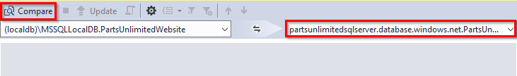

   Click on **Update** in the next wizard to update the schema to Azure SQL database (PartsUnlimited-Prod).
 
     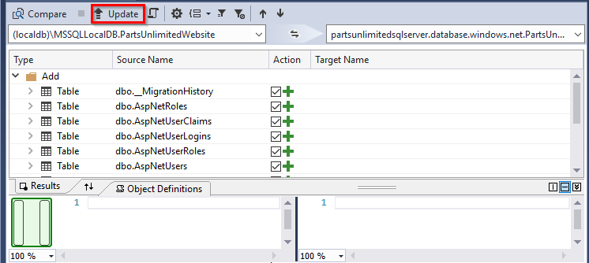

     

1. Similarly to get the data moved from the LocalDB to the SQL Azure instance to right-click on the LocalDB Instance and select the Data Compare tool and walk through the SQL Data Compare wizard.
  
   

   In the wizard select target as Azure SQL database and click on compare.

   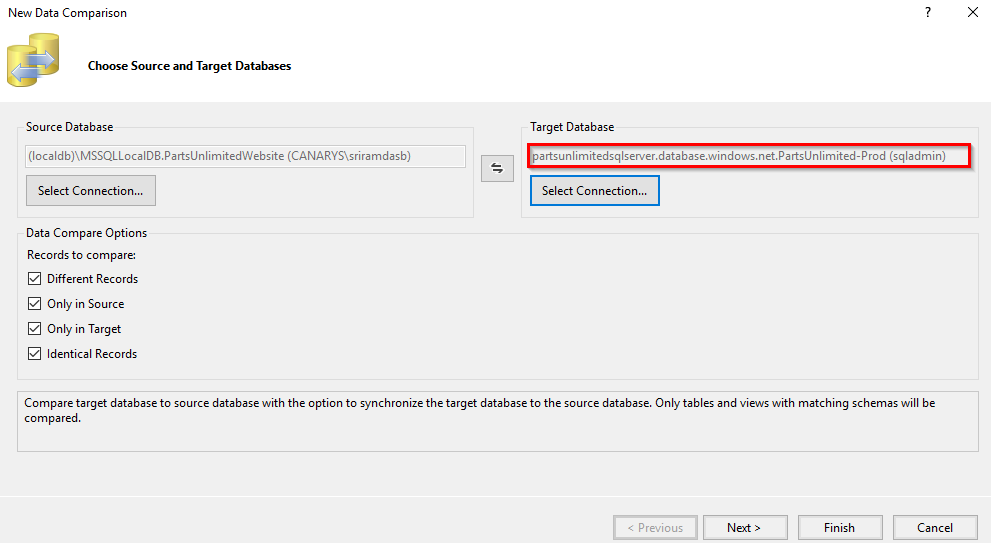

   Click on **Update** to move data to Azure SQL database.
   
   

   Now we have two databases. One is local database **PartsUnlimitedWebsite**. Let us say this is our development or sandbox database. And assume that the one we have on Azure is the Production database. The changes we do to the development database has to be managed along with the application and has to be deployed to the Production database along with the application. This is where the Redgate ReadyRoll project helps us to manage database changes.

1. Now let us create a Redgate ReadyRoll project. Right click on solution and select **Add** **-->** **New Project**.

     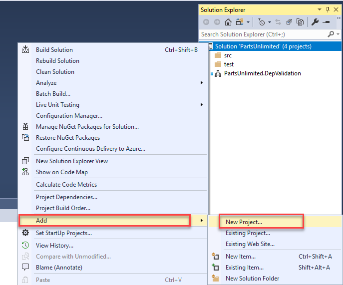

1. In **Add New Project** window under **SQL Server** select **ReadyRoll SQL Server Database Project** and enter the project name as **PartsUnlimitedDatabase**. Click **OK** to create a project. 

   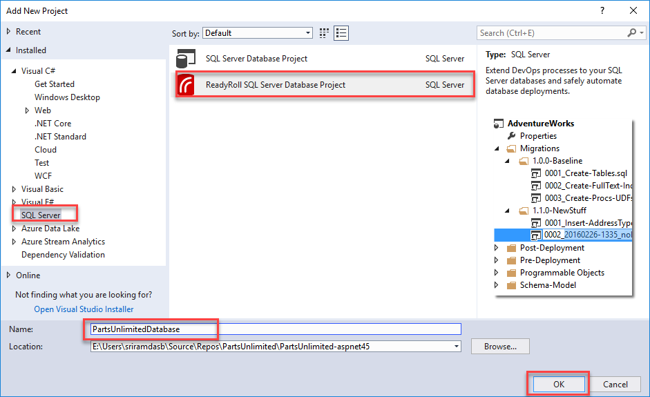

1. In **Set up a new ReadyRoll project** wizard click **Get started**. 

   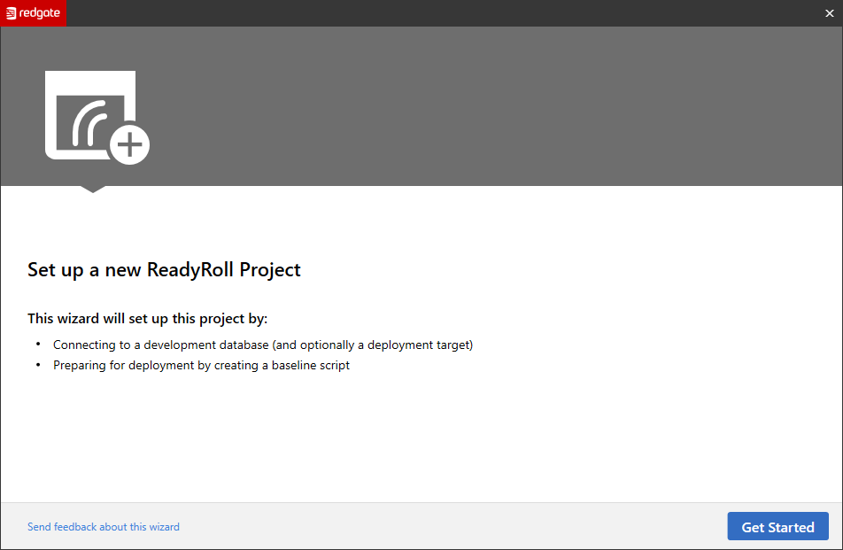

   In **Database connections** wizard select **Specify connection** under Development.

   

   In the resulting window select **MSSQLLocalDB** as server and select **PartsUnlimitedWebsite** database. Click **OK**.

   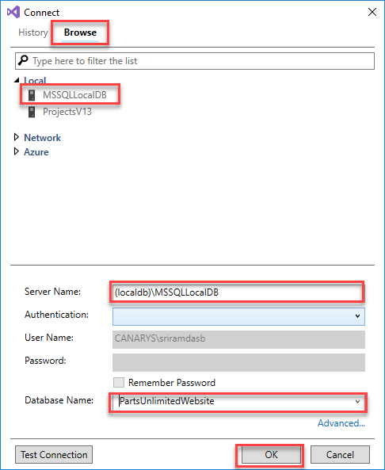

1. Now under **Deployment Target** section select **Specify Connection** and select Azure SQL database.
  
   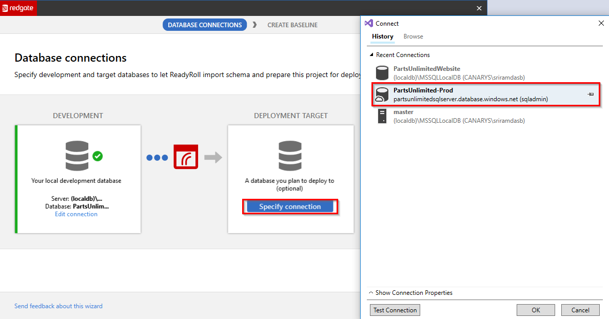

1. In **Database connections** wizard select **Next** and click **Create Baseline** in the next window to complete the project creation.

     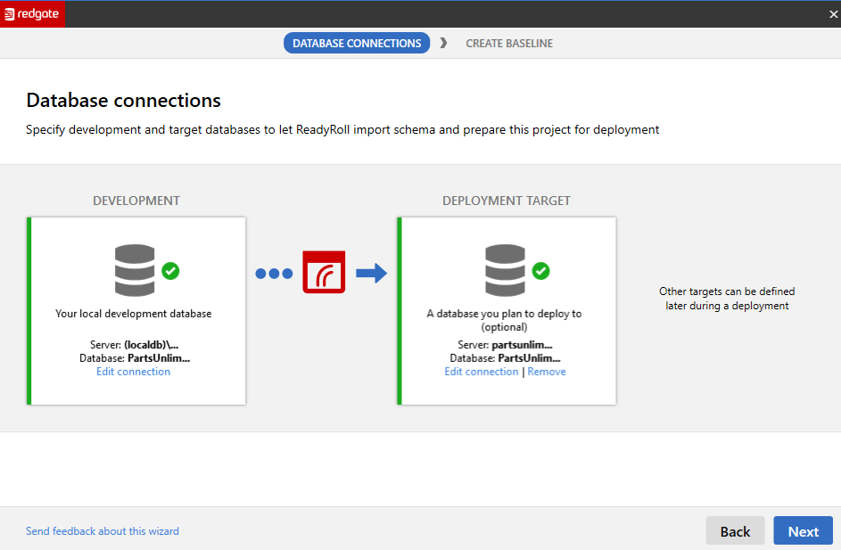

     
     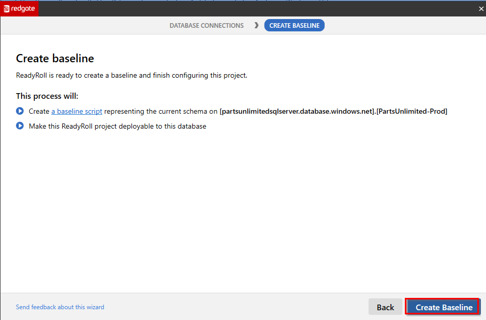

   > The schema of the Deployment Target will be read in order to create a baseline schema. This will not modify the Deployment Target in any way.

1. Now you should be able to see a database project has been added to your solution and you can see **ReadyRoll Core Edition** window.

      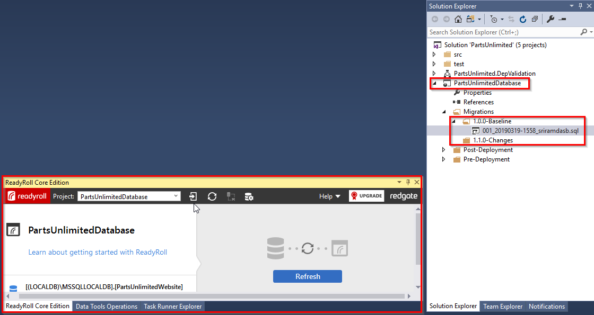

   > ReadyRoll automatically generates a migration script which represents the current schema on the deployment target – the baseline schema. Two folders are also generated, 1.0.0-Baseline and 1.1.0-Changes. The baseline schema migration script is automatically placed in the 1.0.0-Baseline folder, and the baseline schema can be deployed to your sandbox development environment by clicking Deploy project. You can then make changes in your development environment, which will be placed in 1.1.0-Changes.

### Exercise 2: Make the Database and Application changes.

Now the ReadyRoll project is ready. Let us do some changes to the Database schema and data along with few application changes.

### Example Scenario: 
 Run the application locally once again. Press **F5** or click on  **Start debugging** icon to build and run the application locally.
   

If you observe in the home page we have some discount on Oil and Filters products

**Application change**: Customer would like to give a discount on all products for New Year offer. So we need to change front end application.

**Database changes**: For the above application change Pricing of the products need to be updated in the Database.

For example, under **Brakes** category the pricing needs to be updated with discount.
  
  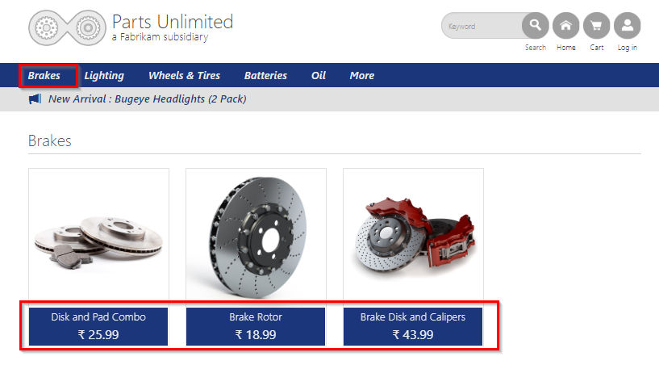

Let us see how to manage database changes and deploy alongside the application.

1. In SQL Server Object Explorer Browse the **PartUnlimitedWebsite**  database on LocalDB.Expand **‘Tables’** and right click on **Products** table, select **View Designer**.
   
   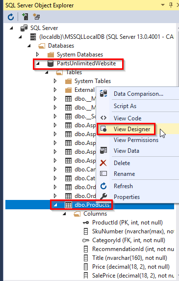

1. Either we can do Database schema changes in Design window or we can use **T-SQL**. Assume that we need a new column in the Products table to show the price in USD. Add a new column **PriceUSD** Designer (Schema change) and click **Update**.
  
   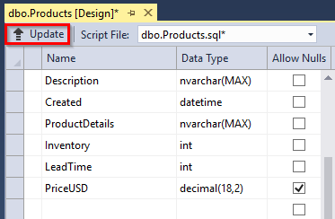

   In **Preview Database updates** windows select **Generate Script**
   
   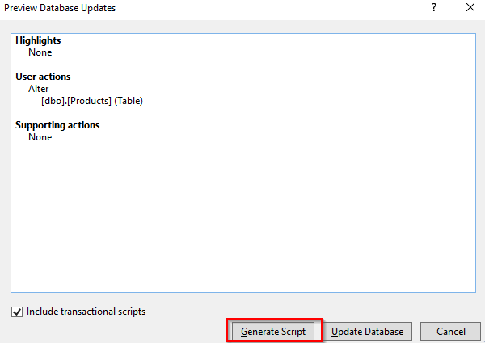

    This will add a new migration script in your database project with Schema changes. Click **Deploy Project** to verify the changes.

   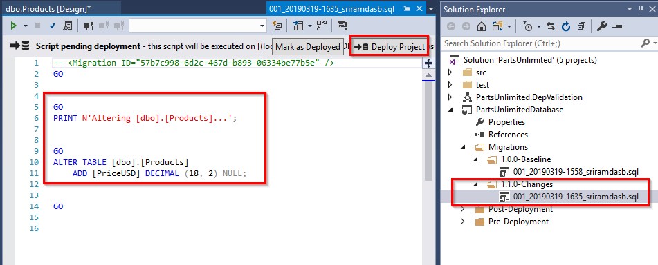
 
    > ReadyRoll generates numerically ordered SQL migration scripts that sit inside your Visual Studio project and take your schema from one version to the next. You can add these migration scripts to version control, use them to build and release, and automate database deployments, all in one process.

1. You can rename the script for better understanding.
  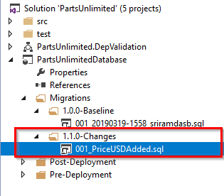

1. Select **Products** table form the local database, right click and select **View Data**.

   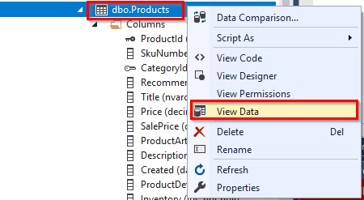

   We need to update the Price column with 50% discount price.

   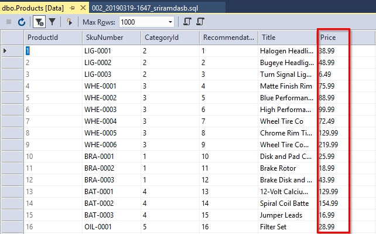

1. Right click on folder **1.1.0-Changes** and add new migration script manually. And rename the script to something like **PriceUpdate** as shown below.

   

1. In the script added enter the following query to update the price to 50% discount and click **Deploy Project** to deploy changes to local db.

    ` 
    UPDATE dbo.Products SET Price = Price * 0.5
    `

    `
    GO
    `
     

1. Select **Products** table and **View Data** again. You will see the price is updated.
    
    

   So as per the requirement, we have done the Database changes in our local and generated migration scripts for the same.
Let us do Application changes.

1. Open **Index.html** file from the path `src\PartsUnlimitedWebsite\Views\Home\` and do the changes as shown below and save the changes.

   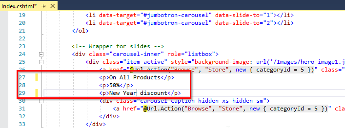

1. Let us commit the changes to the server and create Build and Release pipelines in Azure DevOps to compile and deploy the changes. 

   In **Team Explorer** select **Changes**. Enter the commit comment and select **Commit All and Push** to commit the changes to the server.
   
    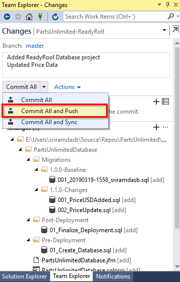

    With this, we have added ReadyRoll Database project with version control support and committed the project to the Azure Repos.

### Exercise 3: Create Build pipeline in Azure DevOps

Now we have both the application and database project in version control. In this exercise, you will create a build pipeline to build your ReadyRoll Database project alongside your application.

1. Navigate to **Pipelines --> Builds** in your Azure DevOps organization. Select **New Build pipeline** to create new build pipeline.

     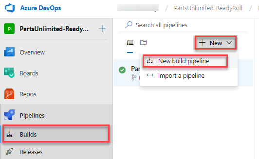

   In the **Select a source** window make sure source settings are correct and click **Continue**.

1. In **Choose a template** section search for **ReadyRoll**, select **ReadyRoll** template and click **Apply**.

     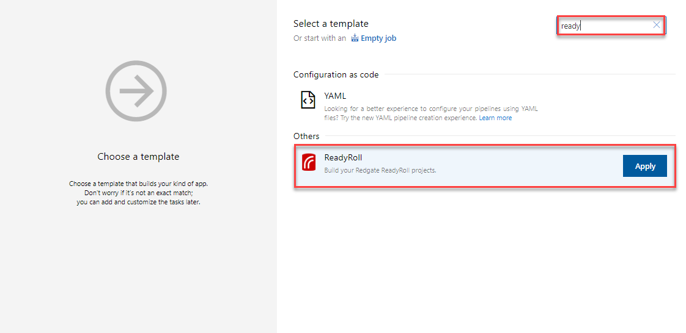

   > If you don't see the above template make sure you have installed **Redgate ReadyRoll** extension from [here](https://marketplace.visualstudio.com/items?itemName=redgatesoftware.redgate-readyroll).

1. Your build pipeline will look like as below. You can see that ReadyRoll tasks also added to the pipeline.

      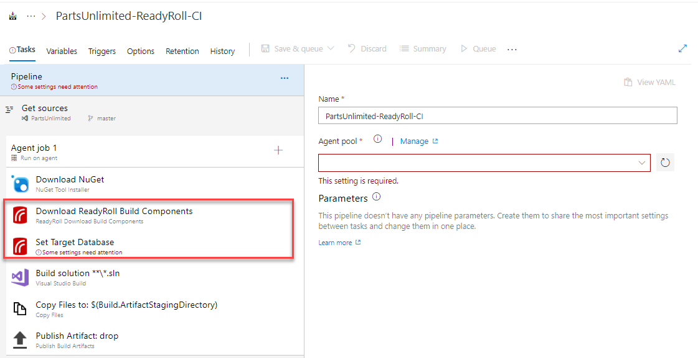

1. Select **Hosted VS2017** as agent pool.

    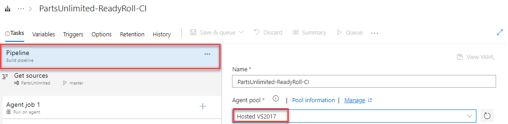

1. Select **ReadyRoll Download Build Components** task. This task downloads the ReadyRoll build components using NuGet so that you don't have to install them by hand.

    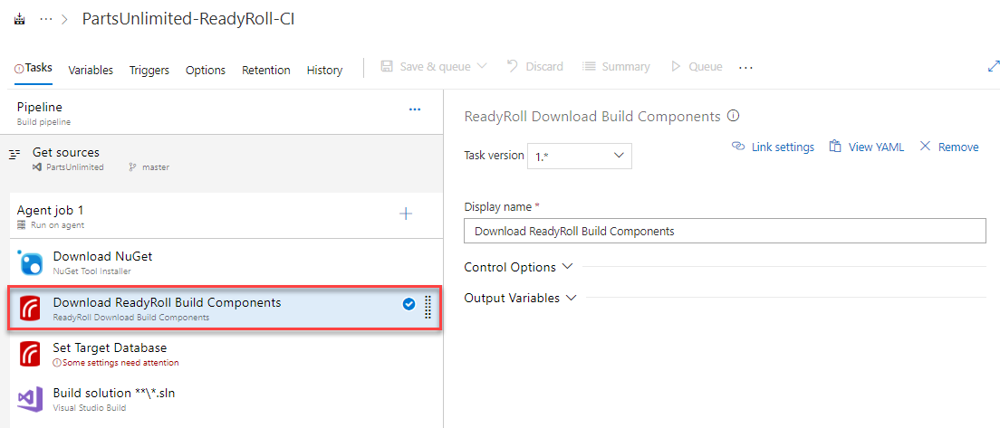

1. Select **ReadyRoll Set Target Database** task.  This task makes it easy to configure the target database that ReadyRoll uses to generate reports. Select **Target type** as **Azure SQL Database**. Enter your Azure SQL database details which you created at the beginning of the lab.
    
    
    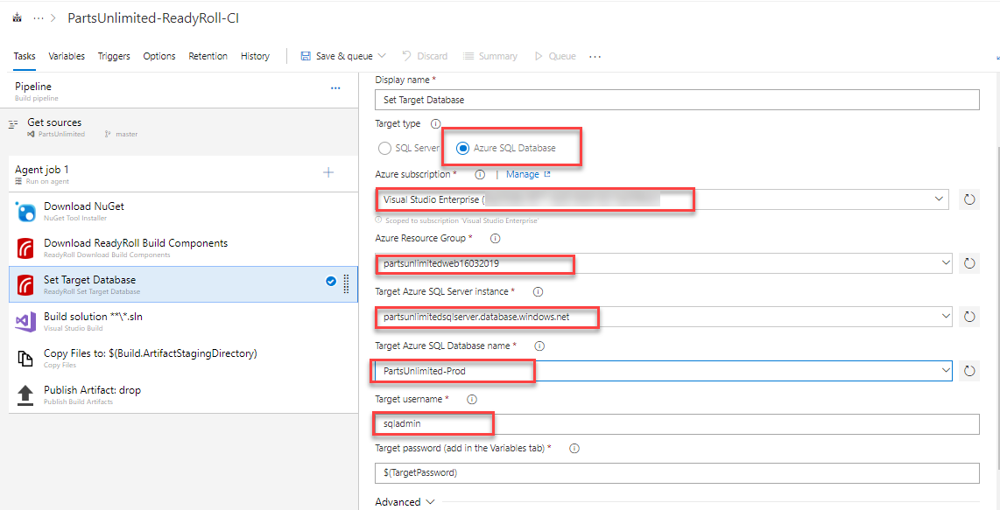

1. Select **Visual Studio Build Solution** task. This task builds both the application and ReadyRoll database project. We need to create packages for the application and database to deploy to the Azure web app and SQL database respectively. Replace the **MSBuild arguments** with the following to do so. And select **Restore Nuget Packages** checkbox to restore the Nuget packages before the build.

   `/p:GenerateSqlPackage=True @"$(Build.SourcesDirectory)\$(ReadyRoll.MsBuildResponseFileName)" /p:DeployOnBuild=true /p:WebPublishMethod=Package /p:PackageAsSingleFile=true /p:SkipInvalidConfigurations=true /p:PackageLocation="$(build.artifactstagingdirectory)\\"
`

   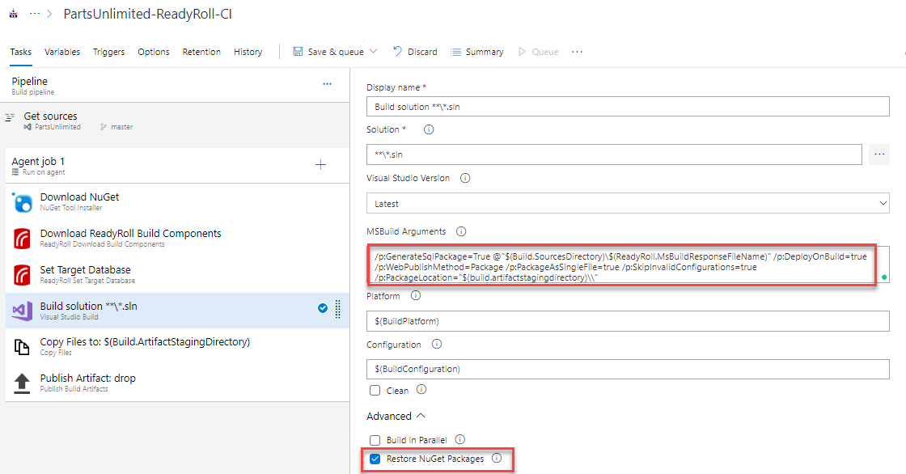

1. Select **Variables**. Create a variable with name **TargetPassword** and enter your Azure SQL server admin password as value.
  
    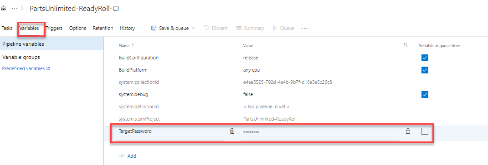

1. Select **Triggers**. Enable **Continuous Integration** trigger.
    
     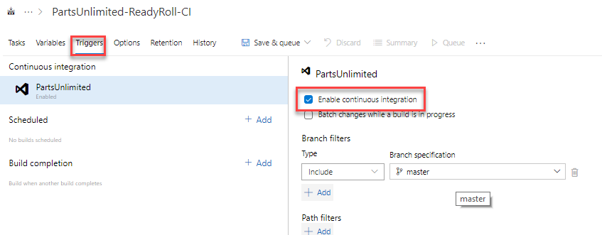

1. **Save & Queue** the build pipeline. 
   
   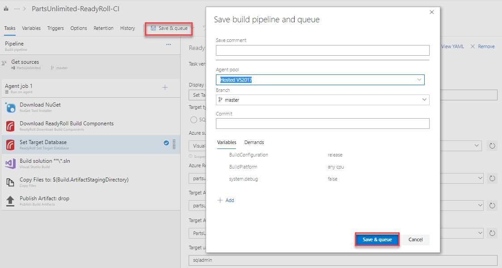

1. Once the build is success make sure **PartsUnlimited_DatabasePackage.ps1** and **PartsUnlimitedWebsite.zip** are available as part of the build Artifacts.

    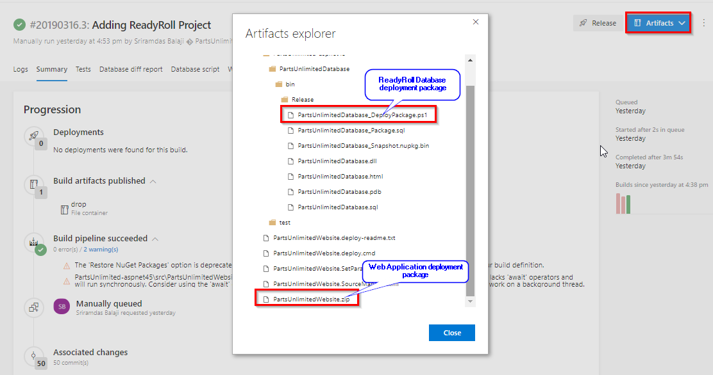

### Exercise 4: Create Release pipeline in Azure DevOps

Now we have both the application and database packages available as build artifacts. In this exercise, you will create a release pipeline to deploy your Database package alongside your application.

1. Navigate to **Pipelines --> Releases** in your Azure DevOps organization. Select **New release pipeline** to create a new pipeline.

      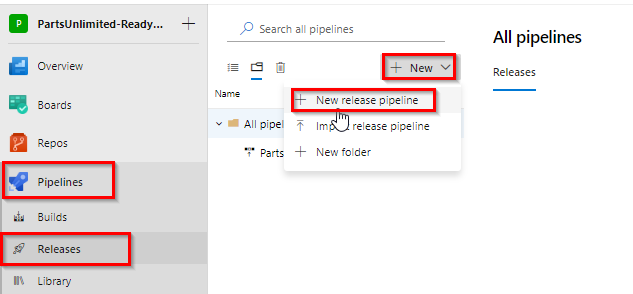

1. In **Select a template** wizard select **Azure App Service deployment** template and **Apply**.

    

1. Change the pipeline name. In my case, it is **PartsUnlimited-CD**. Click on **Add an artifact**.
 
      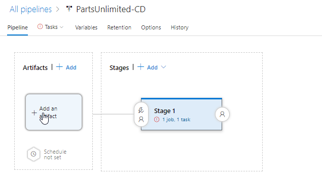

1. In **Add an artifact** wizard select the build pipeline which you created in previous exercise as Source and click **Add**. 

      

1. Select **View stage tasks**. 
   
     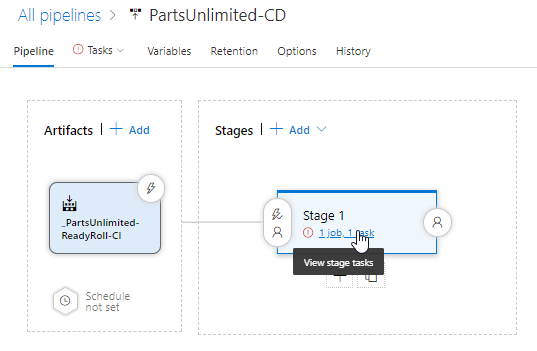

    In the next window select your Azure Sevice connection and App service name which you created at the beginning of this lab.

    

1. Click **+** icon to add a new task to the pipeline. Search for ReadyRool tasks and select **ReadyRoll Deploy Database Package** task.

   
    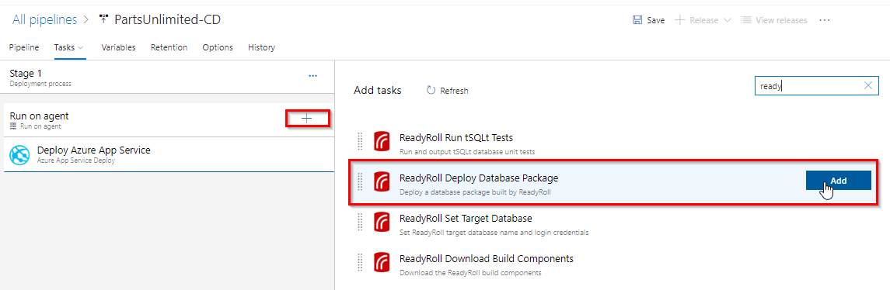

    Now you have two tasks in the pipeline.

1. **Deploy Azure App Service**: Using this task we can deploy application package to Azure app service which we created. 

    

1. **ReadyRoll Deploy Database**: This deploy task will take the package produced by building a ReadyRoll project and deploy it to a target database. Select  **ReadyRoll Deploy Database** task and enter the details as shown in the image below.

      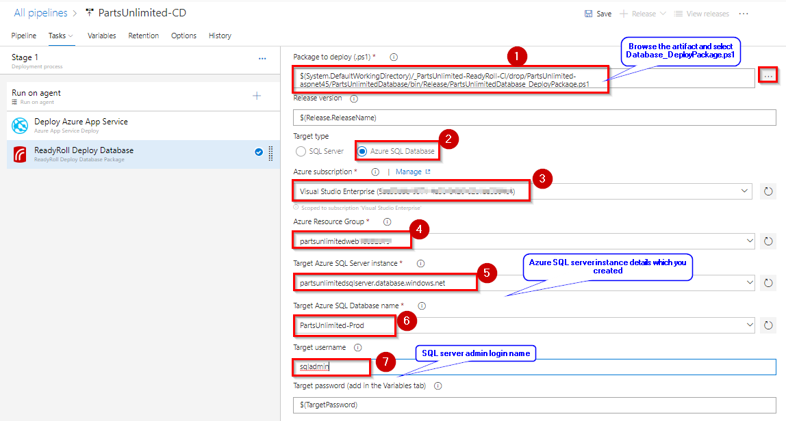

1. Select **Variables**. Create a variable with name **TargetPassword** and enter your Azure SQL server admin password as value.

   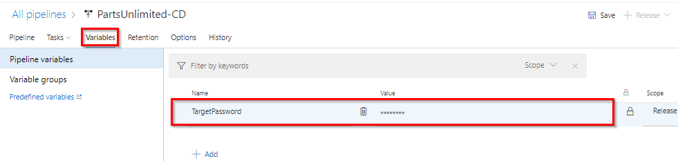

1. Select **Pipeline**. Enable **Continuous deployment** trigger and **Save** the changes.

    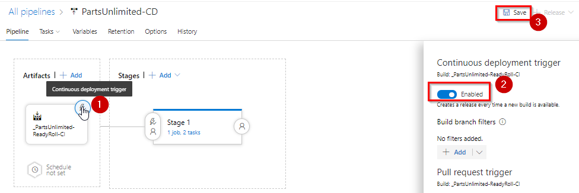

1. Create a release manually once. 

      

1. Once the release is success navigate to your Azure portal. Select the app that you created and browse to view the application deployed. 

   You could see the application change we did as shown below

   

   And If you select **Brakes** category you can see that price also updated. That means database changes also updated to the Production database along with the application.

   Since we have enabled CI &CD now if you do any database changes, CI & CD will be triggered automatically and changes will be deployed.
