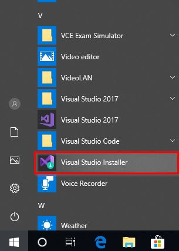
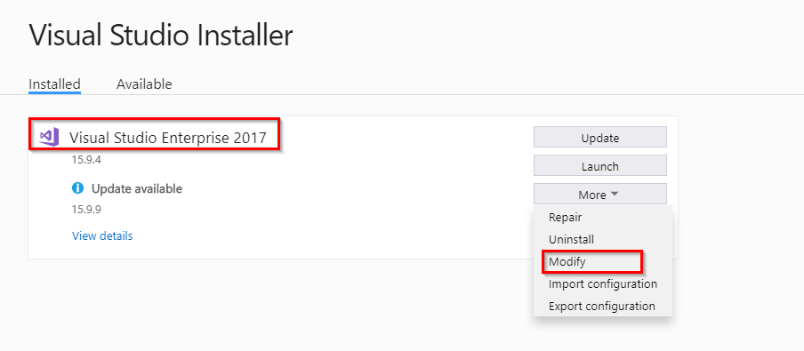
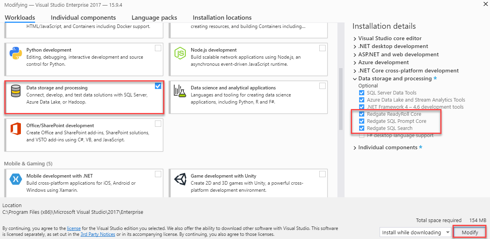
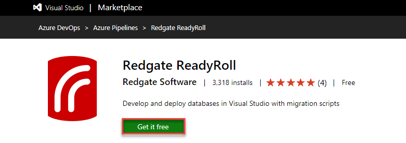

### Installing Redgate Data Tools for Visual Studio Enterprise 2017

1. Launch **Visual Studio Installer** from the **Start** menu.
   
     

1. If the installer prompt for an update, select Update. Once the update is complete, it will launch the Installer Window. Select **Modify** under **Visual Studio Enterprise 2017**

   

1. Select the check box next to **Data Storage and Processing** workload which will add the ReadyRoll Core components. Click the **Modify** button to complete the installation.

    

### Installing ReadyRoll extension for Azure DevOps

The easiest way to do continuous integration and Deployment with ReadyRoll using Azure DevOps is to use the [ReadyRoll extension](https://marketplace.visualstudio.com/items?itemName=redgatesoftware.redgate-readyroll).

1. Find the the ReadyRoll extension on the Visual Studio marketplace, [here](https://marketplace.visualstudio.com/items?itemName=redgatesoftware.redgate-readyroll).

1. Select the **Get it free** button and select the Azure DevOps organization where you would like to install this extension. Click **Install** to complete the installation.

     

     

     You can now start using the ReadyRoll extension in your Azure DevOps.