<div class="rw-ui-container"></div>

## Overview

**Database DevOps** has come of age. It is seen as a key technical practice which can contribute to the successful implementation of DevOps, thereby eliminating the database bottleneck and having the releases faster and easier.
A common blocker that prevents organizations from implementing DevOps is the database. It has unique requirements and often follows a completely different development process from the one used for application development. This is where [Redgate SQL Change Automation](https://documentation.red-gate.com/sca3/getting-started/about-sql-change-automation) helps with development, source control, and safe automated SQL Server and Azure SQL database deployments from Visual Studio with [Redgate SQL Change Automation](https://documentation.red-gate.com/sca3/getting-started/about-sql-change-automation/sql-change-automation-core).

**Redgate SQL Change Automation** is a migrations-first database development and deployment tool inside Visual Studio, allowing you to extend DevOps processes to your SQL Server databases, so you can:

- Prevent the database from being a bottleneck to delivering value quickly
- Automate the deployment of database changes with precision and control
- Manage database changes alongside application changes for a single source of truth
- Integrate with the existing build and release tools including Azure DevOps and TFS

### What’s covered in this lab

In this lab, you will see
1.  How Redgate SQL Change Automation help to manage database changes alongside the application.
1.  How to automate deployments of SQL Server database changes alongside application changes.

### Before you begin

1. You will need an Azure DevOps account. If you do not have one, you can sign up for free [here](https://azure.microsoft.com/en-us/services/devops/)

1. You will need Visual Studio Enterprise 2017 or 2019 with [Redgate SQL Change Automation](https://marketplace.visualstudio.com/items?itemName=vs-publisher-306627.RedgateSqlChangeAutomation) extension installed. And the following extensions need to be installed on your Azure DevOps organization.

   - [SQL Change Automation: Build](https://marketplace.visualstudio.com/items?itemName=redgatesoftware.redgateDlmAutomationBuild)
   - [SQL Change Automation: Release](https://marketplace.visualstudio.com/items?itemName=redgatesoftware.redgateDlmAutomationRelease)

1. **Microsoft Azure Account**: You will need a valid and active Azure account for this lab. If you do not have one, you can sign up for a [free trial](https://azure.microsoft.com/en-us/free/).

### Setting up the Environment

1. This lab requires you to complete Task 1 & 2 from  the [prerequisite](https://azuredevopslabs.com/labs/azuredevops/prereq/) instructions.

1. The following resources need to be configured for this lab:
  
   - Azure Web App
   - Azure SQL Server Databases (two databases)

1. Launch the [Azure Cloud Shell](https://docs.microsoft.com/en-in/azure/cloud-shell/overview) from the Azure portal and choose Bash.

1. **Create Azure Web App:**
   
   i.  Create a Resource Group. Replace `<region>` with the region of your choosing, for example eastus.

   ```bash
    az group create --name MyResourceGroup --location <region>
   ```

   ii. Create App Service Plan
     
    ```bah
    az appservice plan create --resource-group MyResourceGroup --name MyPlan --sku S1

    ```

   iii. Create a web app with a unique app name

   ```bash
   az webapp create --resource-group MyResourceGroup --plan MyPlan --name MyUniqueAppName
   ```
2. **Create Azure SQL server and Database:**   
  
    i. Create an Azure SQL server

    ```bash
    az sql server create -l <region> -g MyResourceGroup -n <unique-sqlserver-name> -u sqladmin -p P2ssw0rd1234
    ```
     

    ii. Create two databases namely **pul-dev** and **pul-prod**

    ```bash
    az sql db create -g MyResourceGroup -s <unique-sqlserver-name> -n pul-dev --service-objective S0
     ```

     ```bash
    az sql db create -g MyResourceGroup -s <unique-sqlserver-name> -n pul-prod --service-objective S0
      ```
    
   iii. Create a firewall rule for SQL server that allows access from Azure services

   ```bash
   az sql server firewall-rule create --resource-group MyResourceGroup --server <your-sqlserver-name> --name AllowAllAzureIps --start-ip-address 0.0.0.0 --end-ip-address 0.0.0.0
   ```
1. Let us import initial database schema to the **pul-dev** and **pul-prod** databases. This databases will be used as a starting point for SQL Change Automation project which we will create in the next exercise.

1. Select the **pul-dev** SQL database from the Azure resources. In the left-hand menu, find and select **Query editor (preview)**. From the **Authorization type** drop-down menu, select **SQL Server authentication** and enter the user ID and password of the server admin account used to create the database. Select **OK**.

      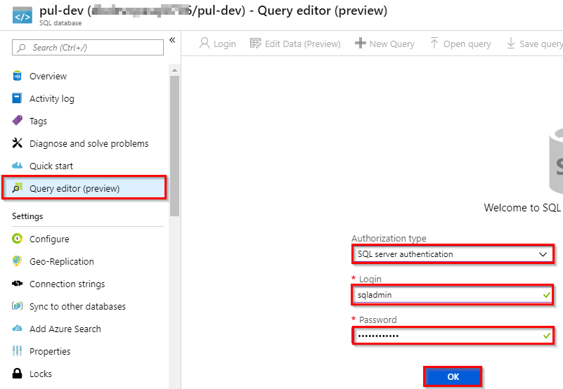

1. In the next window copy the script from [here](https://raw.githubusercontent.com/microsoft/azuredevopslabs/master/labs/vstsextend/redgate/dbscript/initialdbscript.sql) and paste into the **query** window. Click **Run**. This script will create the initial database schema required for our application.
      
      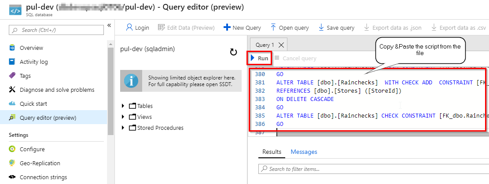

9. Repeat the same steps for **pul-prod** database.

### Exercise 1: Add a Redgate SQL Change Automation project to the PartsUnlimited solution.

Here, you will create a SQL Change Automation project in your existing PartsUnlimited application solution to manage database changes alongside the application. This SQL Change Automation project will contain a database's state and a set of scripts that describe how to get to that state.

1. This exercise requires to to complete Task 1 & 2 from the [prerequisite](https://azuredevopslabs.com/labs/azuredevops/prereq/) section.

1. Now, you will create a SQL Change Automation project. Right click on the solution and select **Add** **-->** **New Project**.

     

1. In **Add New Project** window search for **SQL**. Select **SQL Change Automation Project** template and click **Next** to create a project. 

   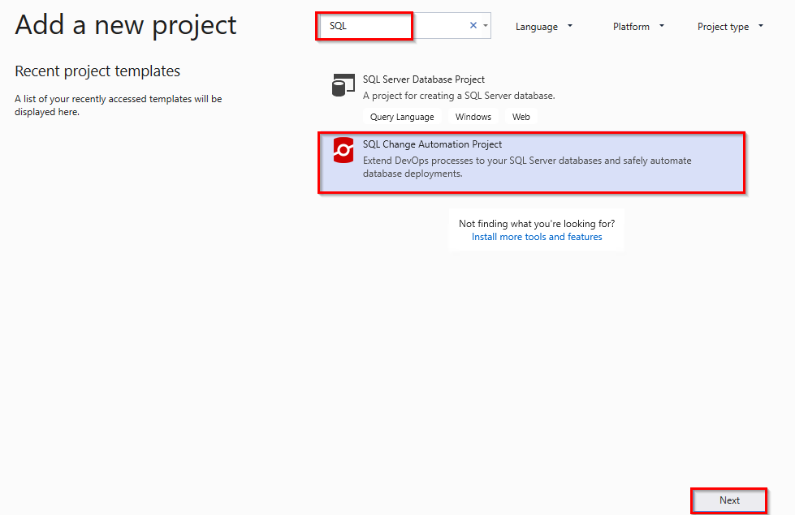

1. In **Configure your new project** wizard enter the project name as **PartsUnlimitedDatabase** and Click **Create**.

   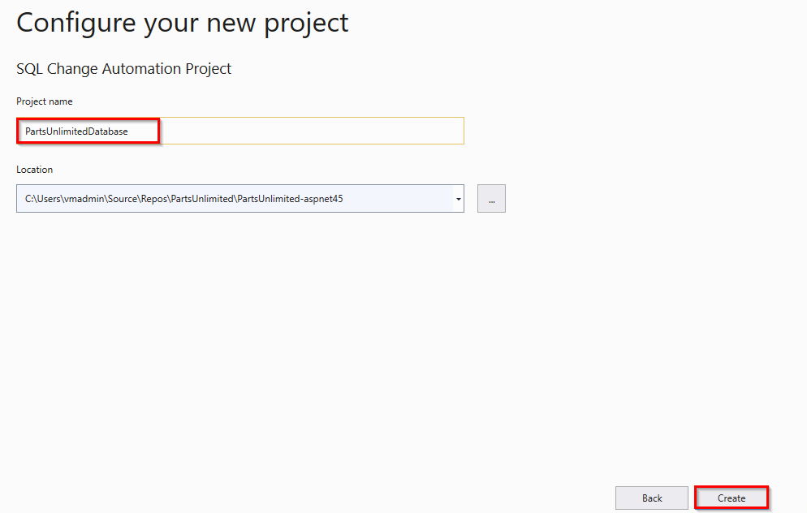

   In **Set up a new SQL Change Automation Project** wizard, click **Get started**.

   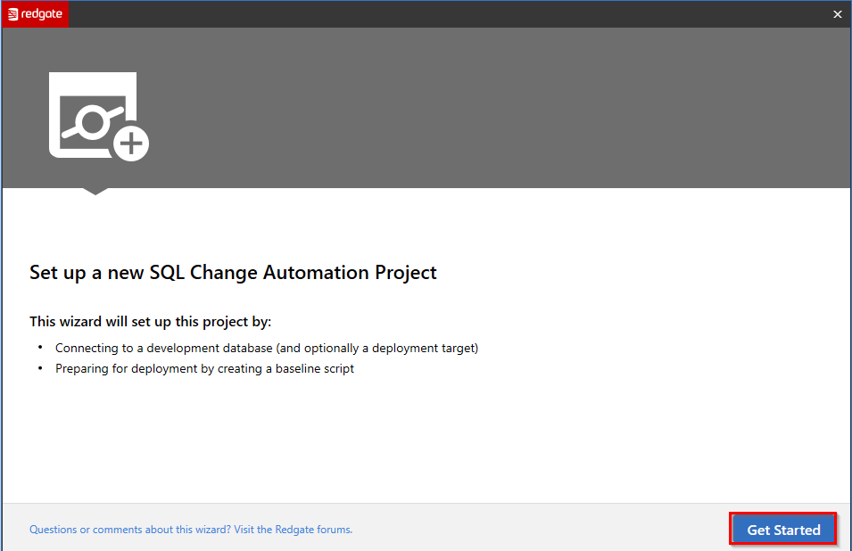

1. In **Database connections** wizard, select **Specify connection** under Development.

    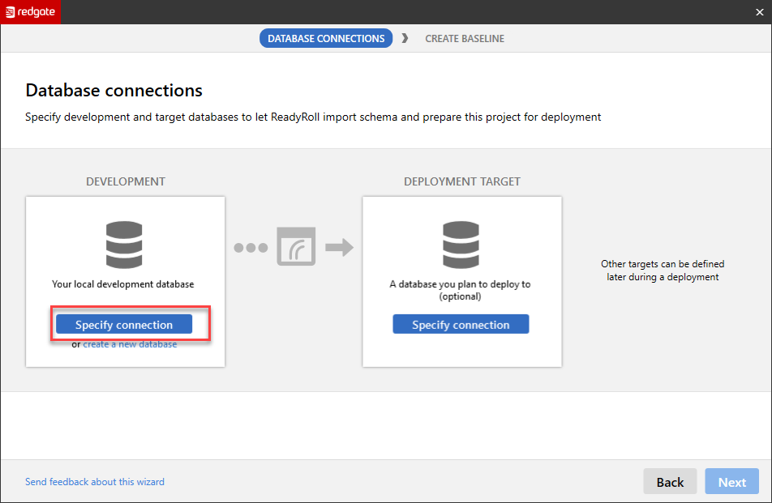
   In the resulting window, **Browse** and select **pul-dev** database from **Azure**. Click **OK**.

   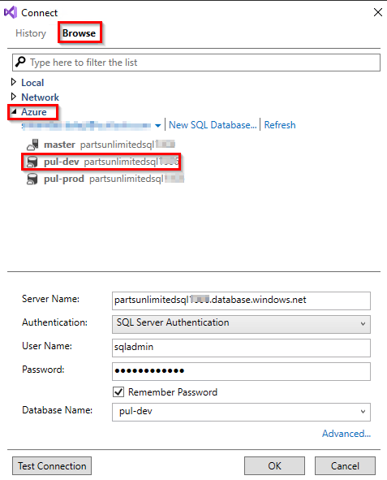

1. Now under **Deployment Target** section, select **Specify Connection** and select **pul-prod** Azure SQL database.
  
   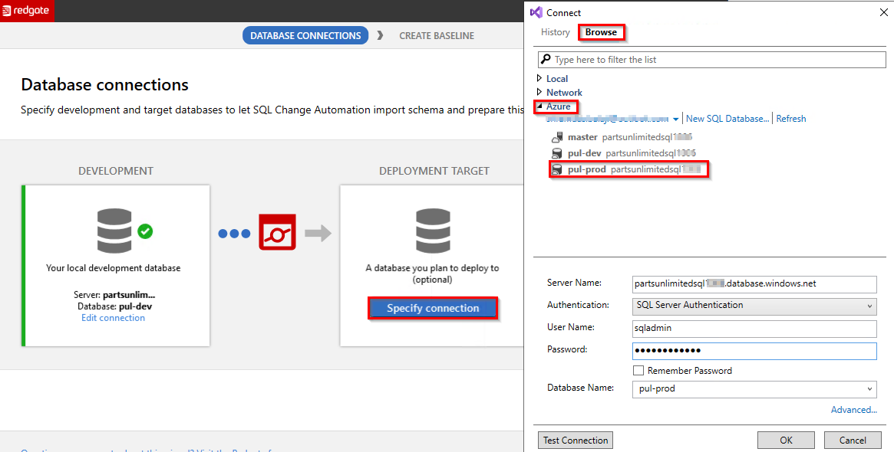

1. In **Database connections** wizard, select **Next** and click **Create Baseline** in the next window to complete the project creation.
     
     

   >The schema of the Deployment Target will be read in order to create a baseline schema. This will not modify the Deployment Target in any way.

1. Now you should be able to see a database project added to your solution and also the **SQL Change Automation Edition** window.

      

   >SQL Change Automation project automatically generates a migration script which represents the current schema on the deployment target – the baseline schema. Two folders are also generated, 1.0.0-Baseline and 1.1.0-Changes. The baseline schema migration script is automatically placed in the 1.0.0-Baseline folder, and the baseline schema can be deployed to your sandbox development environment by clicking Deploy project. You can then make changes in your development environment, which will be placed in 1.1.0-Changes.

### Exercise 2: Make the Database and Application changes

Now that the SQL Change Automation project is ready, you will need to make some changes to the database schema and data along with some code changes in the application.

### Lab Scenario: 

- Edit **web.config** file from **PartsUnlimitedWebsite** project. Change the connection string to connect **pul-dev** database. Update the connection string as shown below. 

   ```
    <connectionStrings>
    <add name="DefaultConnectionString" connectionString="Server=tcp:{your_sqlservername}.database.windows.net,1433;Initial Catalog=pul-dev;Persist Security Info=False;User ID={your_sql-username};Password={your_sql-password};" providerName="System.Data.SqlClient" />
     </connectionStrings>
   ```
-  Run the application locally once again. Press **F5** or click on  **Start debugging** icon to build and run the application locally.
   
    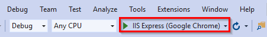

    If you observe in the home page, you have some discount on Oil and Filters products.

    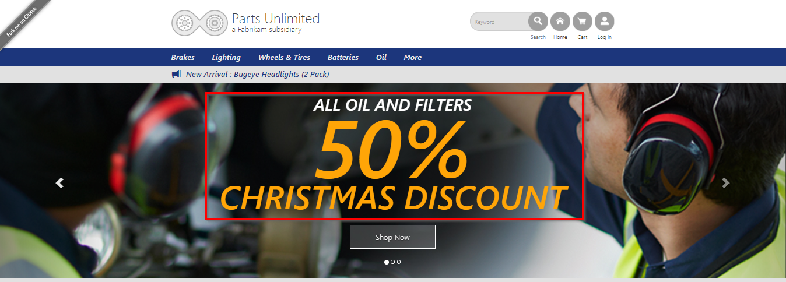

  **Application code change**: Assume that customer would like to have a discount on all products as a New Year offer. This requires a code change in the existing application.

**Database changes**: For the above application, update the pricing of the products in the database.

For example, under **Brakes** category the pricing needs to be updated with a discount.
  
  

Let us see how to manage database changes and deploy alongside the application.
1. From SQL Server Object Explorer, connect to the **pul-dev** Azure SQL database.
   
   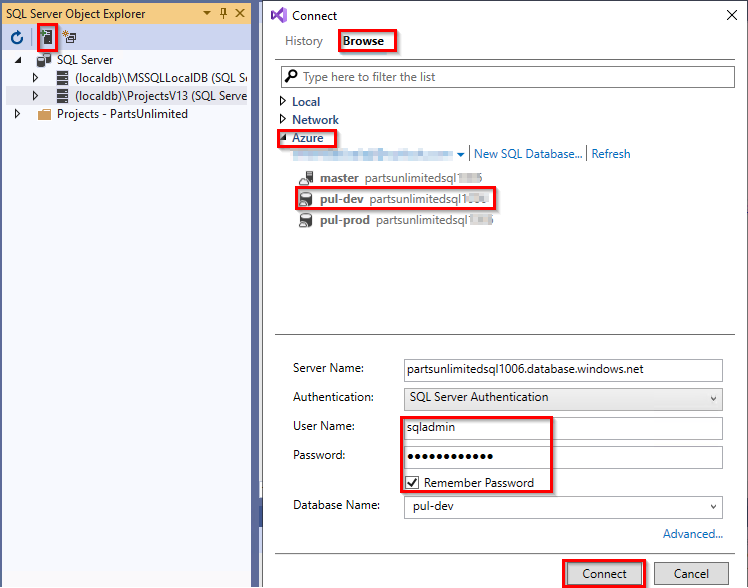
1. In **pul-dev** database expand **‘Tables’**. Right click on **Products** table, select **View Designer**.
   
   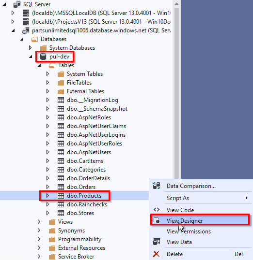

1. Either you can do database schema changes in the design window or you can use **T-SQL**. Assuming that you need a new column in the Products table to show the price in USD, you will add a new column **PriceUSD** using designer (Schema change) and click **Update**.
  
   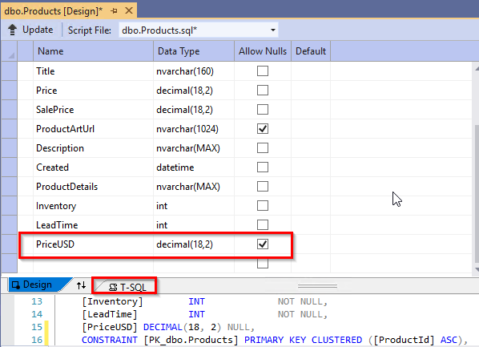

   In **Preview Database updates** window, select **Update Database**.
   
   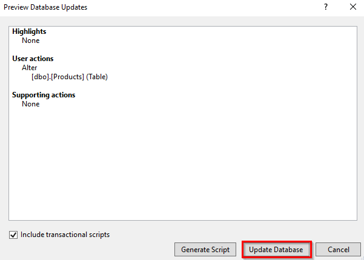

    This will update the changes to the dev database.


1. Open SQL Change Automation window and click **Refresh** to check the pending changes to import.
      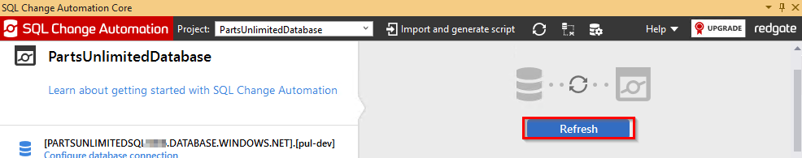

      Now click Generate scripts icon as shown below
      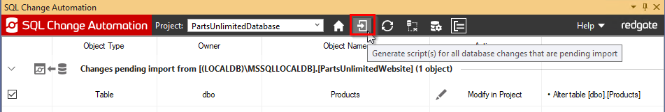

1. This will add a new migration script in your database project with Schema changes.  Click **Refresh(verify script)** to verify the script.

   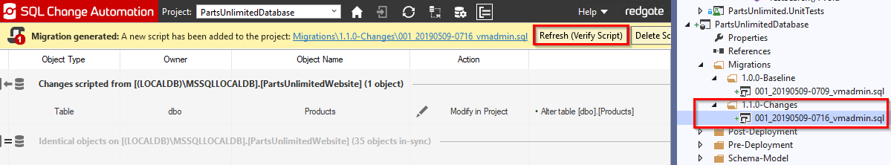


    >SQL Change Automation generates numerically ordered SQL migration scripts that sit inside your Visual Studio project and take your schema from one version to the next. You can add these migration scripts to version control, use them to build and release, and automate database deployments, all in one process.

1. You can rename the script for better understanding.

     

1. Select **Products** table form the **pul-dev** database, right click and select **View Data**.

   

   You will need to update the Price column with 50% discount price.

   

1. Right click on the folder **1.1.0-Changes** and add new migration script manually. And rename the script to something like **PriceUpdate** as shown below.

   

1. In the renamed script, enter the following query to update the price to 50% discount and click **Deploy Project** to deploy changes to local db.

    ` 
    UPDATE dbo.Products SET Price = Price * 0.5
    `

    `
    GO
    `
     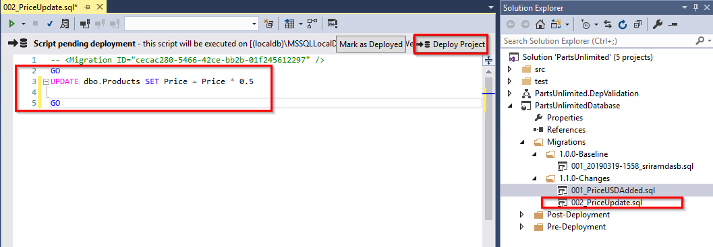

1. To view the new price, select **Products** table and then **View Data**.
    
    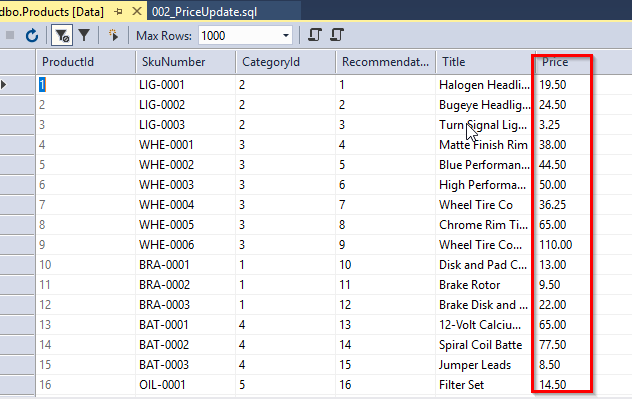

   You have made the database changes in your **pul-dev** and generated migration scripts. You will now change the application code.

1. Open **Index.html** file from the path `src\PartsUnlimitedWebsite\Views\Home\` , make the changes as shown below and save the changes.

   

1. Right click solution and select **Configuration Manager**. For **Release**  configuration unselect the check boxes for Build and Deploy to the PartsUnlimited Database project. We will use SQL Change Automation task in the pipelines to build this project.

   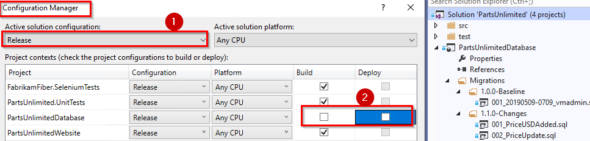

1. Commit the changes to the Azure Repos.

   In the **Team Explorer**, select **Changes**. Enter a commit comment and select **Commit All and Push** to commit the changes to the server.
   
    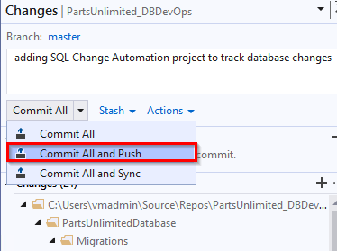

    With this, you have added SQL Change Automation project with version control support and committed the project to the Azure Repos.

### Exercise 3: Create Build pipeline in Azure DevOps

Now you have version controlled both the application and database project. Next, you will create a build pipeline to build your SQL Change Automation project alongside your application.

1. Navigate to **Pipelines --> Builds** in your Azure DevOps organization. Before creating a new pipeline, you will want to disable the existing build pipeline.

   Select the existing PartsUnlimitedE2E pipeline.

    

   From the dropdown, select Pause pipeline.

    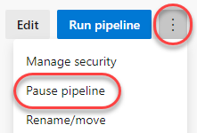

1. Select **New Build pipeline** to create new build pipeline.

     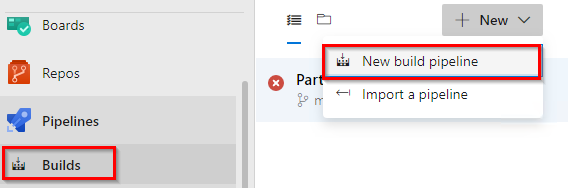

1. Select **Use the classic editor** to create pipeline.
    
      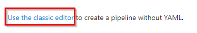

1.  In the **Select a source** window make sure source settings are correct and click **Continue**.

1. In **Choose a template** section, select ASP.NET template and click **Apply**.

     

   This template has tasks to compile and create a package for your .NET project.
   
1. Add **Redgate SQL Change Automation: Build** task just below the Visual Studio build task.

      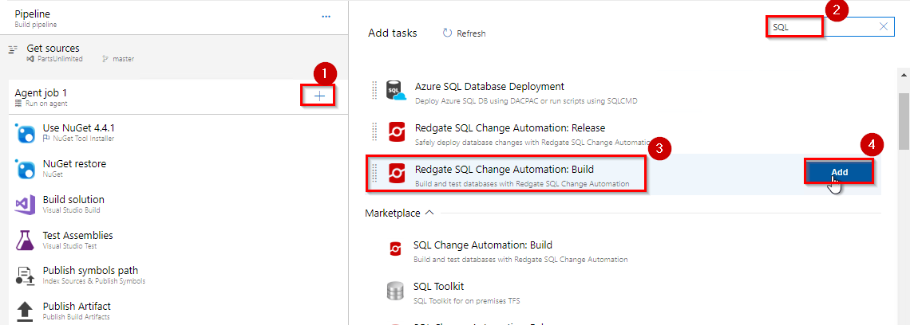

      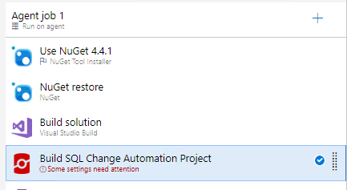

   >If you don't see the above task make sure you have installed [SQL Change Automation: Build](https://marketplace.visualstudio.com/items?itemName=redgatesoftware.redgateDlmAutomationBuild) extension.


1. Select **Redgate SQL Change Automation: Build** task. This task will build your SQL Change Automation project and creates a Nuget package with the migration scripts. Browse & select **SQL Change Automation project**. Enter **Output Nuget Package ID** as `PartsUnlimiteDatabase`.

    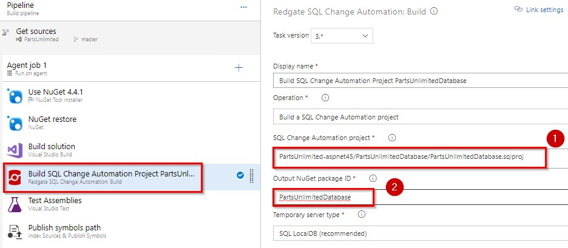

1. **Save & Queue** the build pipeline. 
   
   

1. Once the build succeeds, make sure **PartsUnlimitedDatabase.1.0.nupkg** and **PartsUnlimitedWebsite.zip** are available as part of the build Artifacts.

    

    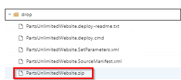

### Exercise 4: Create Release pipeline in Azure DevOps

Now you have both the application and database packages available as build artifacts. In this exercise, you will create a release pipeline to deploy your database package alongside your application.

1. Navigate to **Pipelines --> Releases** in your Azure DevOps organization. Select **New release pipeline** to create a new pipeline.

      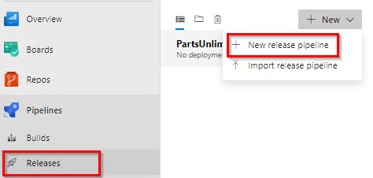

1. In **Select a template** wizard select **Azure App Service deployment** template and **Apply**.

    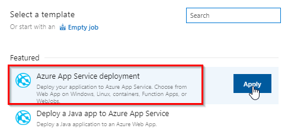

1. Change the pipeline name. In this case, it is **PartsUnlimited-CD**. Click on **Add an artifact**.
 
      

1. In **Add an artifact** wizard, select the build pipeline which you created in the previous exercise as Source and click **Add**. 

      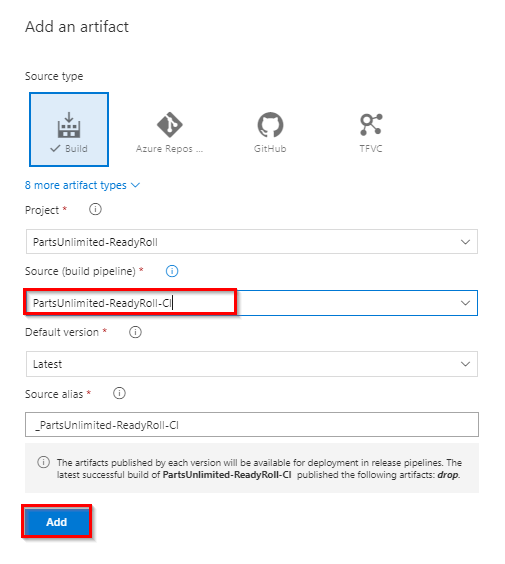

1. Select **View stage tasks**. 
   
     

    In the next window select your Azure Sevice connection and App service name which you created at the beginning of this lab.

    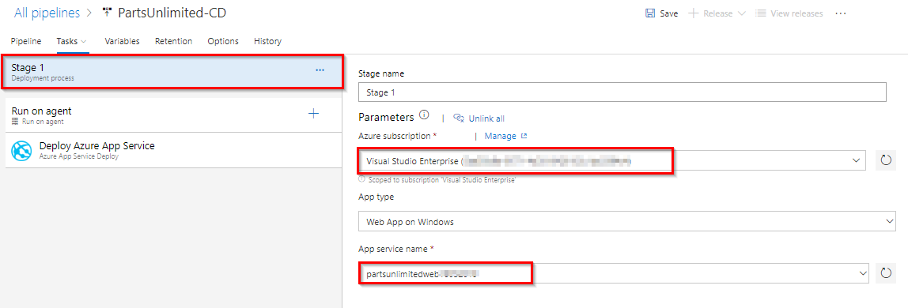

1. Click **+** icon to add a new task to the pipeline. Search for **Redgate** and select **Redgate SQL Change Automation: Release** task.

   
    

    Now you have two tasks in the pipeline.

1. **Deploy Azure App Service**: Using this task you will deploy application package to Azure app service which was created. And also we need to update the connection string for this app service to access **pul-prod** database. In App Service task set **XML variable substitution** option.
    
      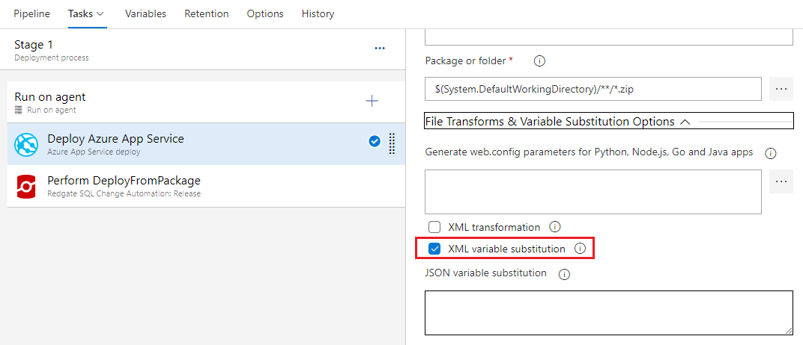

   >XML variable substitution enables you to modify configuration settings in configuration files (*.config files) inside web packages and XML parameters files (parameters.xml). In this way, the same package can be configured based on the environment to which it will be deployed. For more information on XML Transformations click [here](https://docs.microsoft.com/en-us/azure/devops/pipelines/tasks/transforms-variable-substitution?view=azure-devops)

1. Define the release variable with the name **DefaultConnectionString** and set the value as shown below. 

    ```
    Server=tcp:{your_sqlservername}.database.windows.net,1433;Initial Catalog=pul-prod;Persist Security Info=False;User ID={your_sqlusername};Password={your_sqlpassword};
   ```
    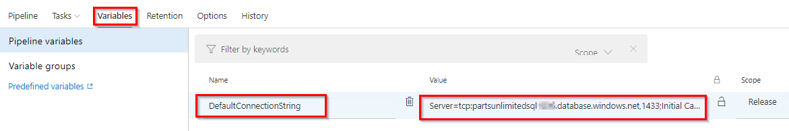
1. **Redgate SQL Change Automation: Release**: This task will take the package produced by building a SQL Change Automation project and deploy it to a target database. Select  **Redgate SQL Change Automation: Release** task, select **Operation** as `Deploy database changes from a build artifact` and select package path from the build artifact.

      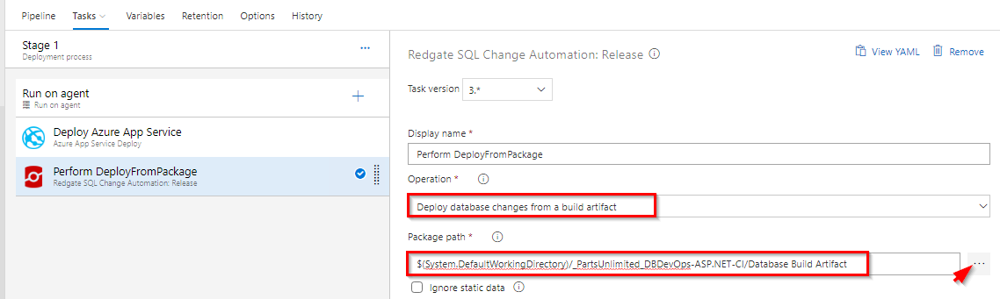

   Under the **Target database** section, enter the target SQL server details.
      
    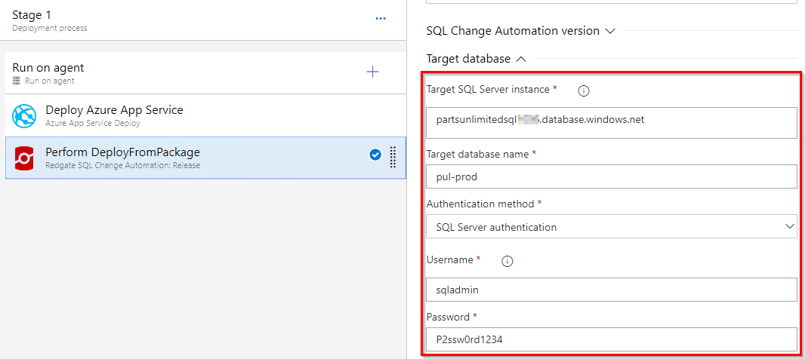

1. **Save** the changes and trigger the release. 

      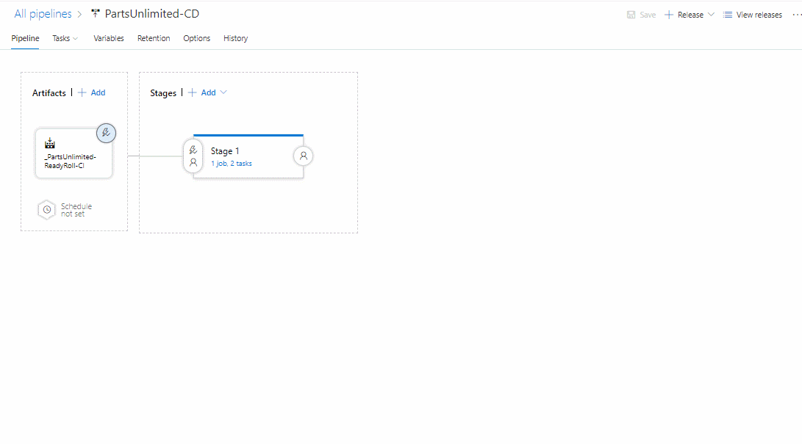

1. Once the release succeeds, navigate to your Azure portal. Select and browse the app that you created to view the application deployed. 

   You should be able to see the new changes reflecting in the application.

   

   When you select **Brakes** category, you can see the updated price as well which means that the database changes are also updated to the Production database along with the application.

